# 评价细则自动化方案

本版为 2026-10-06—2026-10-07 连续研究稿。全部新增方案及材料汇总关系均为**待审核**，用户尚未选定任何路线。研究列齐不表示来源已经联调、真实项目已经核验或业务功能已经实现。本轮仅更新研究文档。

**研究覆盖检查**：77/77 条，硬件 44 条、软件 33 条；172 个事实检查点、520 个候选方案。170 个检查点各 3 方案，首条论文和专利各 5 方案；每点均含人工兜底。结构与原文校验通过，候选方案研究已列齐，真实样本与接口联调未执行。

## 本轮文字修订进度

本轮按 [zh-tech-writing](https://github.com/leter/zh-tech-writing) 的中文技术写作要求改写。已完成 TRL 1 至 TRL 9，共 520／520 个候选方案。每个已改写方案都用自然段说明输入准备、具体动作、结果、异常处理和投入；方案编号及待审核状态保持不变。

已逐个判断流程图是否有助于阅读，当前加入 126 幅 Mermaid 图，用于说明条件分支、证据流向或步骤依赖。字段对照与简单人工阅卷保留文字说明。图中路径只表示单个候选内部的处理过程，不表示已经选定该方案，也不表示多个候选必须依次执行。

写作参考版本为仓库中的 `skills/zh-tech-writing/SKILL.md`（文件对象 `f0ef55c2e87e3c65463392b014a9e01850f527bd`）及其排版规范。原表引文、历史记录和差异对照保留原意，不按写作习惯改动规则。外部能力的核实日期沿用来源账本，本轮文字修订没有把文档核实改成接口实测。

进度：全部 520 个候选已改写并完成完整性校核。77 条规则、172 个检查点和原表引文均保留；各方案的原有动作、输出与限制已核对，172 个检查点均有人工兜底。126 个 Mermaid 图块已检查限定语法、节点引用及分支结构，未逐幅渲染。待决事项仍是各检查点下的口径、可采证据及候选选择，均未代用户作决定。


|等级|规则数|检查点数|段落方案数|流程图数|状态|
|---|---:|---:|---:|---:|---|
|TRL 1|5|14|46|13|待审核|
|TRL 2|7|15|45|7|待审核|
|TRL 3|8|17|51|11|待审核|
|TRL 4|9|20|60|14|待审核|
|TRL 5|10|21|63|18|待审核|
|TRL 6|10|24|72|19|待审核|
|TRL 7|9|19|57|15|待审核|
|TRL 8|8|18|54|11|待审核|
|TRL 9|11|24|72|18|待审核|

## 输入、版本与项目现状

原始 Excel 为 Sheet1，SHA-256 `d0f94caeee640f46e449a6c5f42b52a0e977994bd1058e7336511cd58f5854a3`。逐行核对 77 条：各级硬件/软件数量分别为 2/3、3/4、5/3、6/3、5/5、6/4、6/3、5/3、6/5，总计 44/33。本次附件方案 26,179 字节是较早初稿；已有保存版 61,551 字节与功能分支方案正文相同（仅末尾换行不同），本版保留后者讨论历史，取代其中尚未确认的推荐组合。

读取分支`feat/real-evidence-verification`，提交`308d265e25220dfb995d4040411d8aa69eb7deac`，读取日 2026-10-06。主分支 README 已包含 TRL/MRL 及企业自评流程，而功能分支仍是早期评价员工作流；本次接入分析以功能分支实际代码为准，将来开发前需另行决定基线。未修改主分支、业务文件或规则种子。

已读 RuleItem、EvaluationProject、CheckItem、EvidenceFile、AuditLog 及评价/报告服务。RuleItem 存规则，CheckItem 在项目创建时物化快照，code 为计算属性；EvidenceFile 归属单个条目，有 SHA-256、上传人与软删除记录，尚无跨条目证据关系、事实结果、外部响应、评价基准日、解析版本或核验批次等结构。AuditLog 可记录前后 JSON。`pass_level`检查未判定数为零；`get_achieved_level`按连续 LevelGate 取等级。这是流程确认，不能证明全部技术条件满足。报告引用人工 result/statement/support_info 及材料清单，部分评价组人员为演示固定数据，研究不将演示内容当作实际评审。

入口候选包括上传后触发、评价员按检查点发起、材料变更后重查，均未选定；锁定后补查应生成独立记录，不覆盖已冻结结论。复用解析时仍需按条目、对象版本、基准日重算适用性。一份材料支持多个条目、一条规则有多份材料须明示关系，不能按文件名推断。模型选型、队列、数据库表结构不在本轮定案。

原表与分支种子共 41 条差异：3 处条件、40 处材料字段（2 条同时涉及）。逐条显示差异，并在附录保留原对照。TRL2 软件原序号 4、5、4、5 分别对应系统 4、5、6、7；原始 C20/C21 不改写。TRL1-SW-4 残句、TRL4-SW-8“思想”均保留，研究给出条件解释但不修订正式规则。

## 全文适用的事实语义与成本口径

执行状态（排队/完成/超时/限流/无权限）与事实状态（匹配/冲突/缺项/未检索到/无法确认）分别记录。未命中不等于不存在；缺失不填 0。元数据匹配不证明全文真实；哈希相同只证明字节一致；印章图像、EXIF 不是来源或现场真实性证明；数字签名需要信任链、签署覆盖和时间证据。自报置信度、相似度与多模型一致不能作为未经校准的自动通过门槛。

所有数值比较先核对象、型号、版本、单位、方向、试验条件、样本与日期；门槛取已确认任务书/需求/适用依据，本文假设值仅用于说明。各项材料是 AND、OR、补充还是条件触发，由每条汇总草案提出，待审核。级别总述中的市场准入等要求是否另设检查点需规则维护者决定，不能偷偷塞进 77 条的任何一项。

凡写“语义审阅”，模型输入限定为本条材料相关页段和已确认项目背景，输出主张—证据位置—反证—未知；扫描抽取需保留原图。材料中的指令只作数据，不允许改写任务、评价口径或触发工具。非公开材料可选本地解析/本地模型、获授权云 API 或脱敏处理，未获授权不外发。本轮不上传受评材料、不联系第三方。

所有候选工具与数据接入均未在本项目实现。文档比对需解析适配与人工标注；确定性计算需口径/单位/公式维护；模型辅助有推理及复核工时；原系统追溯需只读授权与导出接口适配；现场见证需人员和设备时间。没有报价的商业服务、专家工时与接口维护费用均待评估/询价，不声称零成本或固定准确率。现场或原始系统方案的自动部分是记录关联、抽取、计算和差异检测，真实性仍受采集边界约束。

## 来源账本

R0 指本次原始 Excel、附件及已读取仓库代码，是候选 PRD 推导依据，不是外部工具能力证明。后文未依赖外部服务的方案标 R0，不虚构通用“权威 API”。本次无真实待评样本，所有源只做文档级核实；历史覆盖、更新延迟未有明确保证时写未知，不能给统一时滞。

|编号|官方来源及链接|本轮确认范围、接入状态及留证限制|
|---|---|---|
|S1|[Crossref REST](https://www.crossref.org/documentation/retrieve-metadata/rest-api/)|打开官方文档，确认JSON书目、works及agency端点和出版后更新信息；无需注册不代表无限流量。字段缺失与登记范围限制保留。未实测，留查询参数、响应和时间；历史状态不能凭当前记录倒推。|
|S2|[OpenAlex认证](https://help.openalex.org/api/authentication/)|打开官方文档，确认基础免密钥访问及key预算机制；不延续旧稿“无需账号无限免费”。作品字段、覆盖及计数按具体响应，保留检索时间；历史累计被引未保证。未实测。|
|S3|[万方选题API](https://topic.wanfangdata.com.cn/api.html)|确认appkey与签名、文献题名作者年及卷期等字段；接口有类型限定，不等于全库核验。授权/报价/样本未取得。|
|S4|[万方开放检索目录](https://github.com/wanfangdata/wfdata-open-skills/blob/master/skills/wfdata-search/references/api-catalog.md)|已打开提供方仓库；检索/详情候选须另核授权与字段，不用选题接口覆盖承诺替代验收。CNKI、维普具体可用接口本轮未确认。|
|S5|[NSTL接口服务入口](https://www.nstl.gov.cn/Portal/sy_jkfw.html?ad_check=1)|原稿有机构合作入口记录；本轮打开失败，未确认接口字段和生产可用性，保留待核实候选，不计为已接通。|
|S6|[CNIPA公共服务](https://ggfw.cnipa.gov.cn/)、[专利业务办理](https://cponline.cnipa.gov.cn/)|公共服务含检索、数据资源等入口，页面本轮可解析内容有限；正式数据授权及通用API未确认。不得断言国家专利API不存在或任何人可调用；未公开申请走授权卷宗/回执，不能预设18个月统一复查。|
|S7|[EPO OPS](https://www.epo.org/en/searching-for-patents/data/web-services/ops)|已打开官方服务文档，确认专利数据Web服务；需要注册/使用条件核对，国别字段与历史法律状态按覆盖判断。未获账号、未实测；国际源不保证中国数据完整及时。|
|S8|[PatSnap P002](https://open.patsnap.com/devportal/api-reference/search/patent/query-search-patent/v2)|打开官方文档确认Bearer API key、申请/公开号码日期、题名、申请人等；法律历史需相应端点授权，不由P002推断。报价、权限、覆盖与更新SLA待核。incoPat/佰腾API能力未单独证实。|
|S9|[WIPO PATENTSCOPE](https://www.wipo.int/en/web/patentscope)|确认官方专利检索服务；不据网页检索推断开放REST，作为可审阅公开记录候选。未实测。Google专利BigQuery不等同权威法律状态接口，本版不依赖它。|
|S10|[pyHanko验证说明](https://docs.pyhanko.eu/en/latest/cli-guide/validation.html)|确认PDF签名验证工具及信任配置要求；非纸面签章识别，也未确认任意OFD/国产算法兼容。未实测。验证错误、证书吊销、无可信时间分别展示。|
|S11|[全国标准信息平台](https://std.samr.gov.cn/)|打开官方页面，确认标准检索；标准号/年份/状态及替代关系需回查具体记录。全文权限、历史状态及API未确认，不自动要求最新版本替代项目适用版本。|
|S12|[CNAS官网](https://www.cnas.org.cn/)|官网与官方认可结果查询说明，需核证书范围附件、机构及日期；查询子页面初次打开失败。仅网页核验候选，不保证API；机构有资质不证明某报告真伪。|
|S13|[CNCA业务系统](https://www.cnca.gov.cn/hlwfw/ywxt/)、[CMA](https://cma.cnca.cn/)|认证和资质查询入口分别核实；cx.cnca.cn首次打开失败。历史状态、地方覆盖、证书范围需逐证核对，不承诺开放API。|
|S14|[国家企业信用公示](https://www.gsxt.gov.cn/)|本轮页面打开失败，主体匹配可保留人工官方查询路线；不把企业名相同当主体一致，不承诺工商API。|
|S15|中国版权保护中心|本轮未获得足以确认可用查询接口的官方证据；软件登记证书只能作为提交材料，真实性通过登记凭证/官方人工查询核实，接口待研究。软著不是所有软件规则的强制条件。|

S1—S15 首轮查阅日为 2026-10-06；S2 于 2026-10-07 补读[API总览](https://help.openalex.org/api/)，确认检索、实体 ID 和 DOI 等查询方式，两个推测子路径打开失败不影响已打开总览的确认范围。S16—S18 于 2026-10-07 补充查阅。链接和状态用于复查，正文设计为本项目推导，不是服务提供方担保。未确认的服务始终有不依赖该服务的候选路径。

|补充来源|官方链接|核实状态|
|---|---|---|
|S16 追溯模型|[W3C PROV概览](https://www.w3.org/TR/prov-overview/)|已打开，支持对象、活动、责任方和派生关系的设计参考；非指定技术栈，无项目实测。|
|S17 统计过程分析|[NIST控制图概述](https://www.itl.nist.gov/div898/handbook/pmc/section3/pmc31.htm)|已打开，统计控制与图形模式解释的方法参考；不是TRL合格率门槛，不照搬通用3σ或固定样本量。|
|S18 书目日期|[Crossref日期定义](https://community.crossref.org/t/date-types-in-the-rest-api/15118)|已打开官方社区维护者说明，出版/发布与记录创建更新索引日期分开；未完成样本查询。|

补充失败记录：NIST SSDF 所试路径、CMA 查询页及 CPCC 主页正文未成功读取，不据其声称接口能力；CNAS 官方查询说明 PDF 文字提取存在乱码，确认范围仅以可读官网入口为准，尚未验证具体证书。


## 进度索引

|规则|检查点数|列齐数|研究进度|决策|待决入口|
|---|---:|---:|---|---|---|
|TRL1-HW-1|5|5|方案已列齐|待审核|哪些文献形式可采纳，基准日按网络还是纸本发表；中文授权路线是否保留？|
|TRL1-HW-2|2|2|方案已列齐|待审核|假设完整性以哪份原理定义为基准？|
|TRL1-SW-3|2|2|方案已列齐|待审核|“关键”的排序依据与问题覆盖边界如何确定？|
|TRL1-SW-4|2|2|方案已列齐|待审核|原表残句应维持现义还是按种子“基本算法”解释？|
|TRL1-SW-5|3|3|方案已列齐|待审核|随机性、数据分布和资源条件需描述到什么精度？|
|TRL2-HW-1|3|3|方案已列齐|待审核|指标至少需要哪些字段，定性目标如何留待确认？|
|TRL2-HW-2|2|2|方案已列齐|待审核|“主要”功能的范围由谁确认？|
|TRL2-HW-3|2|2|方案已列齐|待审核|需覆盖使用之外的运输和储存吗？|
|TRL2-SW-4|2|2|方案已列齐|待审核|潜在需求的来源证据需要到何种程度？|
|TRL2-SW-5|2|2|方案已列齐|待审核|“拟采用”允许保留哪些可替换组件？|
|TRL2-SW-6|2|2|方案已列齐|待审核|技术准备是否包含人员能力和授权资源？|
|TRL2-SW-7|2|2|方案已列齐|待审核|概要设计需包含哪些视图，哪些可后续详设？|
|TRL3-HW-1|2|2|方案已列齐|待审核|“完善”以哪些维度和范围评审？|
|TRL3-HW-2|3|3|方案已列齐|待审核|关键功能清单和试验/仿真替代范围由谁确认？|
|TRL3-HW-3|2|2|方案已列齐|待审核|哪些耦合风险是本系统集成必须论证的？|
|TRL3-HW-4|2|2|方案已列齐|待审核|开发计划“完善”的最小可执行粒度是什么？|
|TRL3-HW-5|2|2|方案已列齐|待审核|预期制造条件按什么产品版本和批量假设？|
|TRL3-SW-6|2|2|方案已列齐|待审核|范围外与后续版本如何标识，哪些未决项允许保留？|
|TRL3-SW-7|2|2|方案已列齐|待审核|关键技术识别与验证判据由什么基线确定？|
|TRL3-SW-8|2|2|方案已列齐|待审核|详细设计需细到函数还是模块，按何种项目复杂度区分？|
|TRL4-HW-1|3|3|方案已列齐|待审核|“完成开发”需要哪些交付及功能证据？|
|TRL4-HW-2|3|3|方案已列齐|待审核|“各”按哪个部件基线，仿真可覆盖哪些指标？|
|TRL4-HW-3|2|2|方案已列齐|待审核|关键样件识别需到序列号还是批次？|
|TRL4-HW-4|2|2|方案已列齐|待审核|系统集成要求覆盖到哪些物理/功能接口？|
|TRL4-HW-5|2|2|方案已列齐|待审核|关键性如何定义，是否接受定性评估？|
|TRL4-HW-6|2|2|方案已列齐|待审核|过程清晰最少需要哪些阶段和决策证据？|
|TRL4-SW-7|2|2|方案已列齐|待审核|实施方案完成的评审口径及必要内容是什么？|
|TRL4-SW-8|2|2|方案已列齐|待审核|主框架完成以什么功能骨架为界？|
|TRL4-SW-9|2|2|方案已列齐|待审核|原型最低场景范围和版本证据是什么？|
|TRL5-HW-1|2|2|方案已列齐|待审核|“各功能部件”基线及允许的临时替代是什么？|
|TRL5-HW-2|3|3|方案已列齐|待审核|初样改动后哪些结果可继承？|
|TRL5-HW-3|2|2|方案已列齐|待审核|对标准外购件的设计过程可用何种选型证据替代？|
|TRL5-HW-4|2|2|方案已列齐|待审核|设备与夹具确定到规格还是具体型号？|
|TRL5-HW-5|2|2|方案已列齐|待审核|确定工艺需要何种确认记录及参数粒度？|
|TRL5-SW-6|2|2|方案已列齐|待审核|哪些原型问题必须在测试版解决，遗留项如何处理？|
|TRL5-SW-7|2|2|方案已列齐|待审核|测试范围和必要异常场景由什么依据约束？|
|TRL5-SW-8|2|2|方案已列齐|待审核|“等”包括哪些项目相关测试类别？|
|TRL5-SW-9|2|2|方案已列齐|待审核|统计分母、重跑和跳过用例如何计？|
|TRL5-SW-10|2|2|方案已列齐|待审核|“规范”依据内部制度还是另有外部规范？|
|TRL6-HW-1|2|2|方案已列齐|待审核|正样定义和允许临时件范围是什么？|
|TRL6-HW-2|3|3|方案已列齐|待审核|系统指标基线及继承测试的条件是什么？|
|TRL6-HW-3|2|2|方案已列齐|待审核|工程试验范围、选样和判据由什么依据确定？|
|TRL6-HW-4|3|3|方案已列齐|待审核|系统级过程清晰与前级部件文档的差别怎样验收？|
|TRL6-HW-5|2|2|方案已列齐|待审核|生产工艺需确定到哪些控制参数？|
|TRL6-HW-6|2|2|方案已列齐|待审核|成本按什么批量和核算边界，是否含研发摊销？|
|TRL6-SW-7|2|2|方案已列齐|待审核|正式版本的发布确认和交付边界是什么？|
|TRL6-SW-8|3|3|方案已列齐|待审核|“全功能”与质量验证的完整基线是什么？|
|TRL6-SW-9|3|3|方案已列齐|待审核|何种验收主体及证明形式有效，有条件通过如何计？|
|TRL6-SW-10|2|2|方案已列齐|待审核|各阶段范围和问题粒度如何确定？|
|TRL7-HW-1|2|2|方案已列齐|待审核|工程化开发完成的任务范围及允许遗留项是什么？|
|TRL7-HW-2|2|2|方案已列齐|待审核|何种环境和负载可认作实际使用环境？|
|TRL7-HW-3|2|2|方案已列齐|待审核|应用测试需覆盖哪些典型任务，和功能性能验证如何分界？|
|TRL7-HW-4|3|3|方案已列齐|待审核|装配验证批次/样本及可接受偏离怎么定？|
|TRL7-HW-5|2|2|方案已列齐|待审核|“体系或标准”的替代关系及初步建立程度怎么定？|
|TRL7-HW-6|2|2|方案已列齐|待审核|验证目标按单位成本还是全生命周期成本？|
|TRL7-SW-7|2|2|方案已列齐|待审核|典型用户如何定义，内部用户是否可接受？|
|TRL7-SW-8|2|2|方案已列齐|待审核|环境一致允许哪些等效差异？|
|TRL7-SW-9|2|2|方案已列齐|待审核|典型用户与反馈身份应核到什么粒度？|
|TRL8-HW-1|2|2|方案已列齐|待审核|“全部”以哪个范围基线为准，遗留项如何认定？|
|TRL8-HW-2|3|3|方案已列齐|待审核|“各项”基线和指标变更继承条件是什么？|
|TRL8-HW-3|2|2|方案已列齐|待审核|完成说明书的最低任务覆盖和审定方式是什么？|
|TRL8-HW-4|2|2|方案已列齐|待审核|小批量定义、批次范围和资源全集如何确认？|
|TRL8-HW-5|2|2|方案已列齐|待审核|哪些部件为关键，渠道需核到制造商还是合同供方？|
|TRL8-SW-6|2|2|方案已列齐|待审核|多个用户按法人、站点还是独立使用组织计算？|
|TRL8-SW-7|3|3|方案已列齐|待审核|生产指标由用户要求还是设计目标确定，冲突怎么处理？|
|TRL8-SW-8|2|2|方案已列齐|待审核|多个认可按组织还是人，谁能代表用户单位？|
|TRL9-HW-1|2|2|方案已列齐|待审核|实际任务如何定义，任务成功和验证发生如何区分？|
|TRL9-HW-2|2|2|方案已列齐|待审核|“所有文件”按何种归档制度和项目边界定义？|
|TRL9-HW-3|2|2|方案已列齐|待审核|“所有”范围和生产规模基线是什么？|
|TRL9-HW-4|2|2|方案已列齐|待审核|批量生产的数量、批次和重复性如何认定？|
|TRL9-HW-5|2|2|方案已列齐|待审核|采用哪种合格率，抽样与返修如何计？|
|TRL9-HW-6|2|2|方案已列齐|待审核|售后计划最小范围、服务边界和责任主体是什么？|
|TRL9-SW-7|2|2|方案已列齐|待审核|“相关”和“全部”以哪份清单定义？|
|TRL9-SW-8|3|3|方案已列齐|待审核|价格确定可否为区间/审批规则，优惠和试用如何处理？|
|TRL9-SW-9|2|2|方案已列齐|待审核|完善支撑需覆盖哪些场景，恢复目标如何确定？|
|TRL9-SW-10|2|2|方案已列齐|待审核|哪些角色和任务必须覆盖，外包运维反馈算用户吗？|
|TRL9-SW-11|3|3|方案已列齐|待审核|大规模按哪些维度定义，目标负载和持续时间是什么？|

### TRL1-HW-1　方案已列齐／待审核

**原表位置**：Sheet1!C8（原序号 1），条件 E8，材料 F8。

**条件原文**：
> 在学术刊物、会议论文、研究报告、专利申请等资料中公布了可作为项目研究基础
> 的基本原理

**支撑材料原文**：
> 论文、报告或专利等

**规则解释与差异**：C1/C2/C3 由所用材料类型触发，C4/C5 核实项目关联与技术内容。原条无最低被引次数、期刊级别或成果必须自有的要求。
与读取分支种子条件、材料文字一致（忽略空白）。

**1. 事实检查点拆解**

|编号|核验事实及原文对应|输入和触发范围|输出与可追溯证据|
|---|---|---|---|
|C1|论文身份、发表载体、日期、版本及正文对应|本条申报该事实时；论文PDF首页/正文、候选DOI、题名作者、评价基准日|逐字段差异、日期精度、官方页链接与正文页段|
|C2|专利申请、公开记录及项目所需状态|本条申报该事实时；申请/公开号、种类代码、名称、申请人、申请/公开日期及评价基准日|申请与公开事件卡、号码映射、来源记录与时间|
|C3|研究报告出具主体、版本与时间可追溯|本条申报该事实时；报告原件、编号版本、签署信息、出具方档案记录|档案记录号、原件位置、签名覆盖/时间和版本差异|
|C4|来源材料与本项目的关系|本条申报该事实时；任务书研究基础、作者/发明人/出具方、项目引用说明，声明自有成果时的合作或权利材料|来源角色表、引用位置、项目对应段及权利主张边界|
|C5|基本原理对项目研究的具体支撑|本条申报该事实时；材料原理/方法正文、任务书技术问题与边界条件|原理—假设—项目环节矩阵、页段及反例|

**2. TRL1-HW-1/C1：论文身份、发表载体、日期、版本及正文对应**

**核验范围及前提**：论文 PDF 首页/正文、候选 DOI、题名作者、评价基准日。输入清单表示该路线所需信息，不将全部文件名变成强制提交项；材料合并承载同一事实时保留页段对应。

**TRL1-HW-1/C1/P1　DOI 书目回查｜待审核**

采用这一路线的前提是：首页有可定位 DOI。评价员先从论文 PDF 首页/正文、候选 DOI、题名作者、评价基准日中确认本路线可用的证据，标明对象、版本及评价时点。输入不足时，先记录缺少哪项依据。

排除参考文献 DOI。随后，Crossref works/agency 核注册及书目。接着，OpenAlex 补可用引文信息。最后，逐项比较题名、作者、载体和日期。正文状态独立标注。

先在首页或出版信息区确认本篇 DOI，保留其页码和原始写法。参考文献中出现的 DOI 单独标记，不能直接拿来查询本篇身份。回查注册机构后，再按相应来源取得书目记录；Crossref 没有记录不等于论文不存在。

将题名、作者、载体、文献类型与日期分开比较。网络发表、纸本发表和记录更新日期保留各自含义；只有年份时保存日期范围，范围跨过评价基准日就保留时间未知。OpenAlex 的引文信息另附查询时点和覆盖说明，不设被引门槛。

结果整理为逐字段差异、日期精度、官方页链接与正文页段。每项结果同时给出原材料位置、使用的字段或记录及处理依据，区分支持、冲突和无法确认。针对只有年份、DOI 指向他文、预印本冒充正式稿，保留异常所涉及的具体材料，交 TRL1-HW-1/C1/P5 复核。自动处理不替评价员作本条最终判断。

S1/S2 官方文档已确认，未实测。维护解析与限流，计数带来源时间。元数据相同不能保证全文真实。这些依赖尚未在本项目完成接入或样本验证，实际费用和工时按授权范围、材料规模另行评估。
**TRL1-HW-1/C1/P2　中文授权书目检索｜待审核**

采用这一路线的前提是：有中文题名作者刊名年卷期及机构检索/详情授权。评价员先从论文 PDF 首页/正文、候选 DOI、题名作者、评价基准日中确认本路线可用的证据，标明对象、版本及评价时点。输入不足时，先记录缺少哪项依据。

用万方适用检索召回候选并取详情，逐字段核对题名、作者、载体、页码与日期精度。无 DOI 也保留可核身份。CNKI/维普仅在后续证实接口授权时作为候选。

先确认机构授权覆盖哪类检索、详情字段和留存方式，再用题名、作者、刊名及年卷期组成查询。检索结果逐条与上传首页对应，记录同题、作者重名和卷期不一致的候选，不能仅凭中文题名相同就确认身份。

详情返回后分别核对题名、作者、载体、页码和日期精度。没有 DOI 的记录仍可保留已核实的书目事实；没有全文权限时，正文保持未核对。CNKI 和维普仍是待证实授权条件的候选来源，不写成已经能够调用。

结果整理为逐字段差异、日期精度、官方页链接与正文页段。每项结果同时给出原材料位置、使用的字段或记录及处理依据，区分支持、冲突和无法确认。针对只有年份、DOI 指向他文、预印本冒充正式稿，保留异常所涉及的具体材料，交 TRL1-HW-1/C1/P5 复核。自动处理不替评价员作本条最终判断。

S3/S4 有官方文档但选题类型接口不能承诺任意文献覆盖，S5 页面失败。费用配额待询价，普通订阅不等于 API 授权。同题同名和入库滞后转人工。这些依赖尚未在本项目完成接入或样本验证，实际费用和工时按授权范围、材料规模另行评估。


**TRL1-HW-1/C1/P3　题名作者多字段检索｜待审核**

采用这一路线的前提是：无可用 DOI 且有题名作者年份/载体。评价员先从论文 PDF 首页/正文、候选 DOI、题名作者、评价基准日中确认本路线可用的证据，标明对象、版本及评价时点。输入不足时，先记录缺少哪项依据。

在 OpenAlex 等已确认检索服务召回候选，按作者、日期、类型、载体逐项核对。模型可修复 OCR/排序但不造标识符。命中预印本不改写为正式发表。

先从首页提取原始题名、作者、年份和载体。扫描识别不清时并存原图与修正候选，再分别检索原始写法和有依据的变体，保留每次查询的返回范围。模型可以排序候选，但不能补造 DOI 或出版记录。

逐个候选核对作者、年份、载体和文献类型，说明排除或保留的理由。正式稿、接受稿与预印本分别保留版本关系；多个来源如果来自同一上游，不重复计为独立证明。仍有两个以上合理候选时交 P5 复核。

结果整理为逐字段差异、日期精度、官方页链接与正文页段。每项结果同时给出原材料位置、使用的字段或记录及处理依据，区分支持、冲突和无法确认。针对只有年份、DOI 指向他文、预印本冒充正式稿，保留异常所涉及的具体材料，交 TRL1-HW-1/C1/P5 复核。自动处理不替评价员作本条最终判断。

S2 需预算/密钥管理及样本验收，检索维护工时。同题、译名和预印本合并可能误配，多个来源可能同一上游，未唯一对应转人工。这些依赖尚未在本项目完成接入或样本验证，实际费用和工时按授权范围、材料规模另行评估。


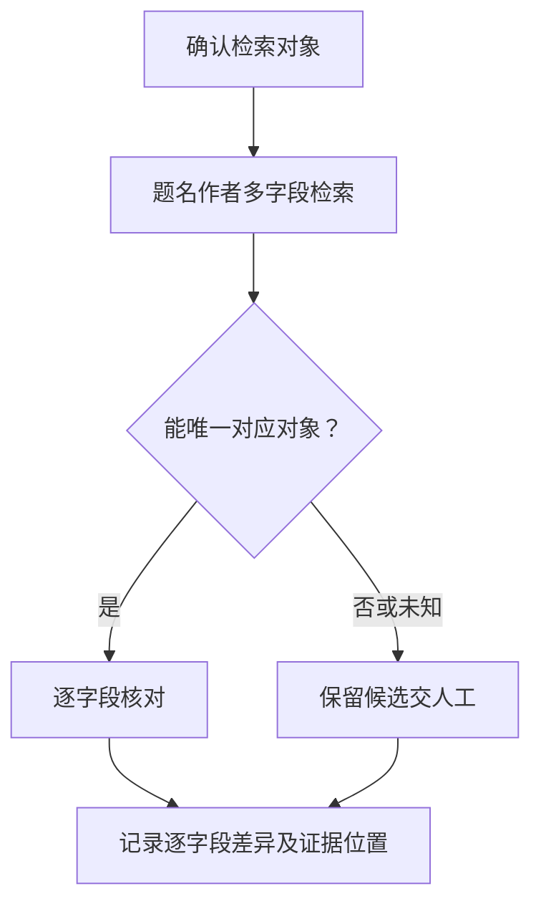

**TRL1-HW-1/C1/P4　出版方原始版本核对｜待审核**

采用这一路线的前提是：可获得合法出版页及官方全文。评价员先从论文 PDF 首页/正文、候选 DOI、题名作者、评价基准日中确认本路线可用的证据，标明对象、版本及评价时点。输入不足时，先记录缺少哪项依据。

校核期刊/会议身份与目录。随后，提取网络/纸本日期及更正信息。最后，将官方正文与提交稿按段落表格对照。自动定位实质差异。

先核出版页面所列期刊或会议身份、卷期目录及文章链接，再取得获准访问的正式正文。分别保存出版页面、下载稿和提交稿的版本信息；若正文拿不到，只继续核对页面实际公开的字段。

正文比较先定位章节、段落、表格和公式，再区分排版、水印与实质内容变化。更正或撤稿信息保留来源与查询时间。哈希不同只说明字节不同，是否存在内容冲突，要回到具体页段由评价员复核。

结果整理为逐字段差异、日期精度、官方页链接与正文页段。每项结果同时给出原材料位置、使用的字段或记录及处理依据，区分支持、冲突和无法确认。针对只有年份、DOI 指向他文、预印本冒充正式稿，保留异常所涉及的具体材料，交 TRL1-HW-1/C1/P5 复核。自动处理不替评价员作本条最终判断。

需全文访问许可和逐站适配成本。预印本、接受稿、正式稿不可合并当同版。无全文只输出书目事实。这些依赖尚未在本项目完成接入或样本验证，实际费用和工时按授权范围、材料规模另行评估。

**TRL1-HW-1/C1/P5　人工兜底｜待审核**

这一路线接受本检查点的全部相关材料，也承接其他候选无法处理或结果冲突的情况。评价员先收集论文 PDF 首页/正文、候选 DOI、题名作者、评价基准日，连同已有抽取、计算或查询结果一起阅卷。没有自动结果也可以直接人工核验，不能因此要求补做一遍接口查询。

复核围绕“论文身份、发表载体、日期、版本及正文对应”展开。评价员逐项回看原件，确认对象与时间范围，再请相应领域专家解释技术含义。材料保管人协助说明来源、编号和版本。对“DOI 书目回查”、“中文授权书目检索”、“题名作者多字段检索”、“出版方原始版本核对”产生的不同结果，先核各自前提和覆盖范围，再判断是材料冲突还是核验范围不同。

重点检查只有年份、DOI 指向他文、预印本冒充正式稿。对疑点建立一条待核记录，写清相互矛盾的原文、可能解释和仍缺的依据。能从现有材料解决的，补上定位与理由。需要函询、现场观察或新增试验的，由评价员另行明确对象和范围，本轮不代为执行。

以下假设场景说明复核意见应达到的具体程度：假设首页 DOI 对应另一题名：系统输出标识符冲突，评价员查官方目录并要求正确文件，不因 DOI 能解析就通过。

复核后形成逐字段差异、日期精度、官方页链接与正文页段。评价员逐项记录采纳、驳回或暂不能确认，并注明证据范围、复核人和日期。无法取得原始依据时继续保留未知。人工意见也需要说明依据，不能只写“专家认为通过”。

这一路线需要阅卷权限、材料保管人协助及相应领域专家的工时。投入取决于材料数量、疑点复杂度和是否需要补证，当前不预设费用。系统仅协助整理证据位置、意见和修改记录。此前的自动结果保留，便于复查人工修改的原因。

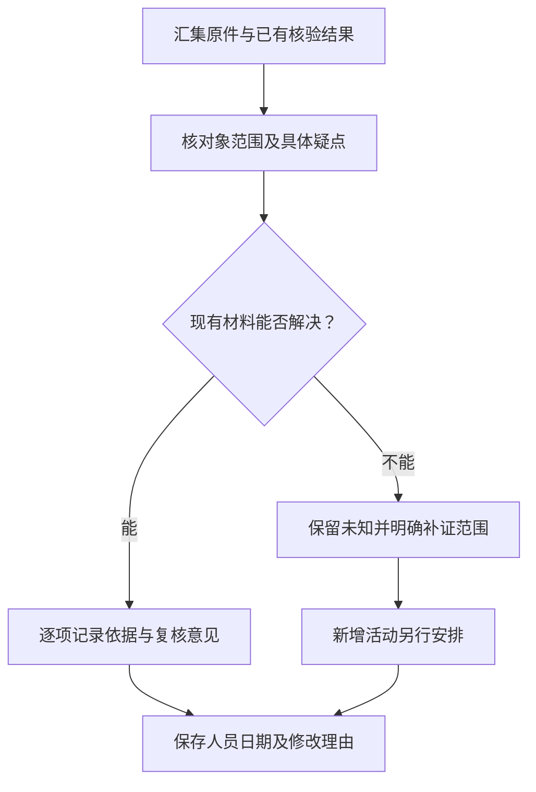

**候选差异**：P1 依赖首页有可定位 DOI；P2 依赖有中文题名作者刊名年卷期及机构检索/详情授权；P3 依赖无可用 DOI 且有题名作者年份/载体；P4 依赖可获得合法出版页及官方全文。各路线形成各自范围内的事实，来源一致不能自动视为独立证明。P5 人工兜底始终保留，当前不选定或排列实施优先级。

**假设场景**：假设首页 DOI 对应另一题名：系统输出标识符冲突，评价员查官方目录并要求正确文件，不因 DOI 能解析就通过。

**异常与边界**：只有年份、DOI 指向他文、预印本冒充正式稿。正常结果仅对已核对象和范围有效；缺失与明确冲突分列。解析失败、查询超时、权限不足均记执行状态，不转成技术不满足。

**来源与接入状态**：S1/S2/S3/S4/S5（具体查阅日及状态见来源账本）。本检查点未取得真实受评材料，未完成实测。

**待讨论**：哪些文献形式可采纳，基准日按网络还是纸本发表；中文授权路线是否保留？ **用户选择：未选择。**

**3. TRL1-HW-1/C2：专利申请、公开记录及项目所需状态**

**核验范围及前提**：申请/公开号、种类代码、名称、申请人、申请/公开日期及评价基准日。输入清单表示该路线所需信息，不将全部文件名变成强制提交项；材料合并承载同一事实时保留页段对应。

**TRL1-HW-1/C2/P1　中国官方公开记录核对｜待审核**

采用这一路线的前提是：有已公开申请或授权文献及官方可核查询记录。评价员先从申请/公开号、种类代码、名称、申请人、申请/公开日期及评价基准日中确认本路线可用的证据，标明对象、版本及评价时点。输入不足时，先记录缺少哪项依据。

规范申请/公开号及种类代码，回查同一申请的名称、申请人、申请/公开/授权事件。记录评价基准日与查询日。形式校验与事实查询分列。

先区分申请号、公开号和授权公告号，保留国别与种类代码。用官方可核记录或合法授权导出建立同一申请的号码关系，再比较名称、申请人以及各事件日期；号码格式校验只作为形式检查。

申请、公开、授权分别输出，评价基准日和查询日分别保存。当前页面若未提供历史状态，只报告当前可见记录及其限制。查询未命中时先检查号码、公开状态和覆盖范围，不能把未公开申请判为不存在。

结果整理为申请与公开事件卡、号码映射、来源记录与时间。每项结果同时给出原材料位置、使用的字段或记录及处理依据，区分支持、冲突和无法确认。针对申请与公开混淆、同族误配、历史状态缺失，保留异常所涉及的具体材料，交 TRL1-HW-1/C2/P5 复核。自动处理不替评价员作本条最终判断。

S6 仅确认官方服务入口，通用 API 和批量授权未证实。网页需要登录/人工或合法授权导出，维护和人员成本待估。未命中不能否定。这些依赖尚未在本项目完成接入或样本验证，实际费用和工时按授权范围、材料规模另行评估。


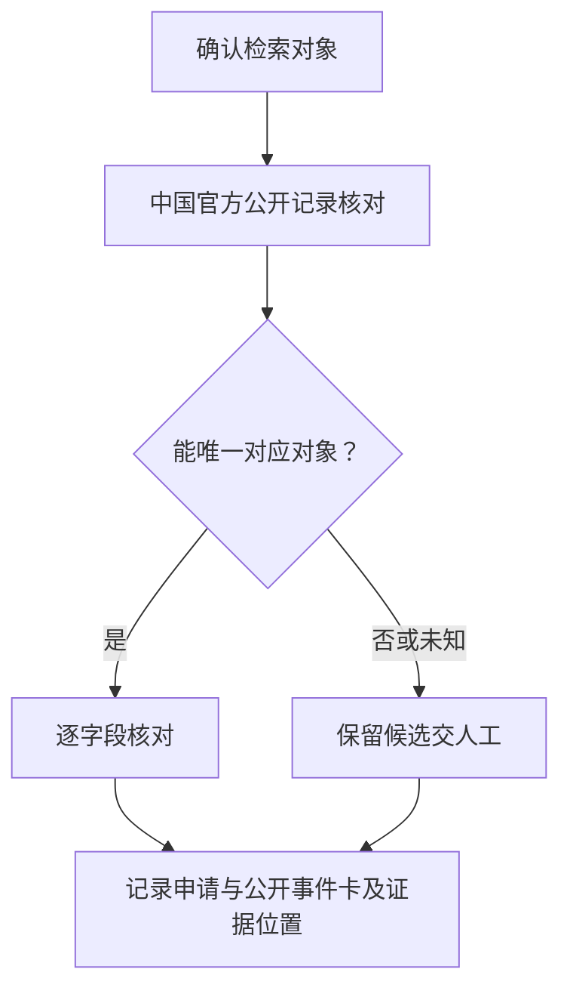

**TRL1-HW-1/C2/P2　商业授权结构化核验｜待审核**

采用这一路线的前提是：取得 PatSnap 相应检索和详情授权。评价员先从申请/公开号、种类代码、名称、申请人、申请/公开日期及评价基准日中确认本路线可用的证据，标明对象、版本及评价时点。输入不足时，先记录缺少哪项依据。

按申请/公开号定位记录，逐字段比对申请人与当前权利人、题名及事件日期。历史法律状态需要单独端点和覆盖核实。

先核授权是否包含所需检索、详情和留存字段，再以具体申请号或公开号取得记录。比较时拆开原申请人、当前权利人和文献名称，保留字段原名及事件时间，避免把权利转移误写成主体冲突。

如果服务按同族聚合，需展开到本次申报的具体申请。历史法律状态只在对应端点和字段覆盖另行确认后分析；检索接口 P002 能返回基本字段，不代表已经提供完整历史。商业记录与原件冲突时交 P5 核实。

结果整理为申请与公开事件卡、号码映射、来源记录与时间。每项结果同时给出原材料位置、使用的字段或记录及处理依据，区分支持、冲突和无法确认。针对申请与公开混淆、同族误配、历史状态缺失，保留异常所涉及的具体材料，交 TRL1-HW-1/C2/P5 复核。自动处理不替评价员作本条最终判断。

S8 官方文档确认，未实测，报价配额待核。P002 不能推定历史法律状态全覆盖。同族折叠可能漏具体申请，结果冲突转人工。这些依赖尚未在本项目完成接入或样本验证，实际费用和工时按授权范围、材料规模另行评估。


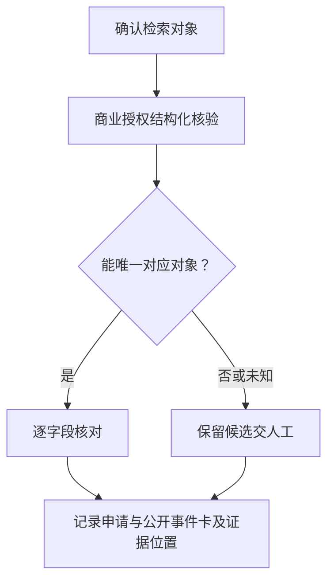

**TRL1-HW-1/C2/P3　国际官方专利数据核验｜待审核**

采用这一路线的前提是：取得 EPO OPS 授权或可审的 WIPO 公开记录。评价员先从申请/公开号、种类代码、名称、申请人、申请/公开日期及评价基准日中确认本路线可用的证据，标明对象、版本及评价时点。输入不足时，先记录缺少哪项依据。

核对国别、号码、种类及具体申请文献，比较申请/公开元数据。不同国别同族仅作关系不替代本申请。保留覆盖与检索时间。

先根据国别、号码和种类代码锁定具体文献，再使用已获授权的 EPO OPS 数据或可审阅的 WIPO 公开记录。分别保存服务返回字段、检索日期和文献位置，不能因为两个记录属于同族就替换为同一申请。

核对申请和公开事件时，保留来源实际支持的日期及精度。中国记录缺失、更新延迟或历史状态不全时，明确写出覆盖限制，再交 P5 查阅授权原始材料；WIPO 网页能检索也不等于已确认开放接口。

结果整理为申请与公开事件卡、号码映射、来源记录与时间。每项结果同时给出原材料位置、使用的字段或记录及处理依据，区分支持、冲突和无法确认。针对申请与公开混淆、同族误配、历史状态缺失，保留异常所涉及的具体材料，交 TRL1-HW-1/C2/P5 复核。自动处理不替评价员作本条最终判断。

S7 确认 Web 服务，S9 只确认检索页面。未实测、账号和成本条件待核。中国记录及时性和法律历史不能保证。这些依赖尚未在本项目完成接入或样本验证，实际费用和工时按授权范围、材料规模另行评估。


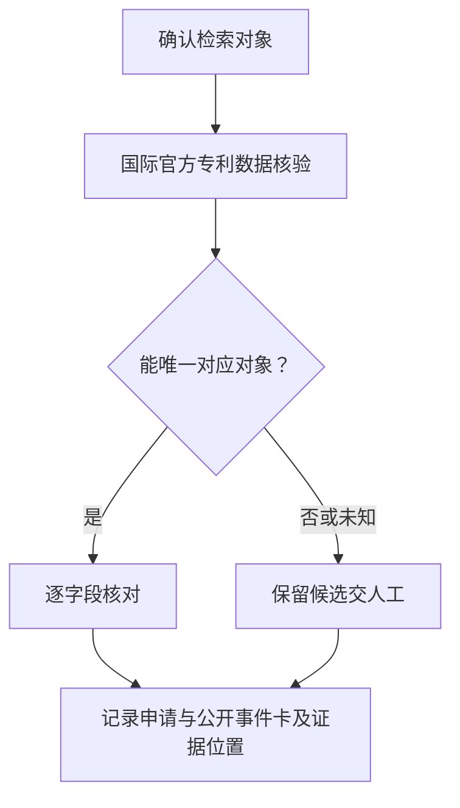

**TRL1-HW-1/C2/P4　未公开申请的受理/卷宗证据核对｜待审核**

采用这一路线的前提是：只有受理凭证及申请人授权提供的原始回执或卷宗。评价员先从申请/公开号、种类代码、名称、申请人、申请/公开日期及评价基准日中确认本路线可用的证据，标明对象、版本及评价时点。输入不足时，先记录缺少哪项依据。

提取申请号、申请人、名称、申请日并关联正式提交/受理记录。核对回执签署或业务记录。申请事实与是否满足本条公布分开。

先取得申请人授权提供的受理凭证、原始回执或卷宗，核申请号、名称、申请人和申请日。把这些字段与正式提交及受理记录逐项对应，原件的签署信息或业务记录另行核实，不能仅凭受理通知扫描图确认真实性。

材料能够支持申请事实时，仍要单独标注公开状态及公开时间是否可知。该材料是否满足本条“公布”，交评价员按原文解释处理；不以授权与否增加门槛，也不把所有专利类型都套用同一公开期限。

结果整理为申请与公开事件卡、号码映射、来源记录与时间。每项结果同时给出原材料位置、使用的字段或记录及处理依据，区分支持、冲突和无法确认。针对申请与公开混淆、同族误配、历史状态缺失，保留异常所涉及的具体材料，交 TRL1-HW-1/C2/P5 复核。自动处理不替评价员作本条最终判断。

需要申请人授权、文件核实来源和人工成本。不能假定 18 个月适用于所有类型，纸面受理通知可伪造。公开时间及可采性未知时交 P5。这些依赖尚未在本项目完成接入或样本验证，实际费用和工时按授权范围、材料规模另行评估。

**TRL1-HW-1/C2/P5　人工兜底｜待审核**

这一路线接受本检查点的全部相关材料，也承接其他候选无法处理或结果冲突的情况。评价员先收集申请/公开号、种类代码、名称、申请人、申请/公开日期及评价基准日，连同已有抽取、计算或查询结果一起阅卷。没有自动结果也可以直接人工核验，不能因此要求补做一遍接口查询。

复核围绕“专利申请、公开记录及项目所需状态”展开。评价员逐项回看原件，确认对象与时间范围，再请熟悉专利或成果来源的复核人员解释技术含义。材料保管人协助说明来源、编号和版本。对“中国官方公开记录核对”、“商业授权结构化核验”、“国际官方专利数据核验”、“未公开申请的受理/卷宗证据核对”产生的不同结果，先核各自前提和覆盖范围，再判断是材料冲突还是核验范围不同。

重点检查申请与公开混淆、同族误配、历史状态缺失。对疑点建立一条待核记录，写清相互矛盾的原文、可能解释和仍缺的依据。能从现有材料解决的，补上定位与理由。需要函询、现场观察或新增试验的，由评价员另行明确对象和范围，本轮不代为执行。

以下假设场景说明复核意见应达到的具体程度：假设仅有受理通知：可提示申请事实待凭卷宗确认，公开状态未知。专家另审该材料是否满足本条“公布”，不强加授权门槛。

复核后形成申请与公开事件卡、号码映射、来源记录与时间。评价员逐项记录采纳、驳回或暂不能确认，并注明证据范围、复核人和日期。无法取得原始依据时继续保留未知。人工意见也需要说明依据，不能只写“专家认为通过”。

这一路线需要阅卷权限、材料保管人协助及熟悉专利或成果来源的复核人员的工时。投入取决于材料数量、疑点复杂度和是否需要补证，当前不预设费用。系统仅协助整理证据位置、意见和修改记录。此前的自动结果保留，便于复查人工修改的原因。


**候选差异**：P1 依赖有已公开申请或授权文献及官方可核查询记录；P2 依赖取得 PatSnap 相应检索和详情授权；P3 依赖取得 EPO OPS 授权或可审的 WIPO 公开记录；P4 依赖只有受理凭证及申请人授权提供的原始回执或卷宗。各路线形成各自范围内的事实，来源一致不能自动视为独立证明。P5 人工兜底始终保留，当前不选定或排列实施优先级。

**假设场景**：假设仅有受理通知：可提示申请事实待凭卷宗确认，公开状态未知；专家另审该材料是否满足本条“公布”，不强加授权门槛。

**异常与边界**：申请与公开混淆、同族误配、历史状态缺失。正常结果仅对已核对象和范围有效；缺失与明确冲突分列。解析失败、查询超时、权限不足均记执行状态，不转成技术不满足。

**来源与接入状态**：S6/S7/S8/S9（具体查阅日及状态见来源账本）。本检查点未取得真实受评材料，未完成实测。

**待讨论**：未公开申请能否作为本条公布证据，是否需要核到历史状态？ **用户选择：未选择。**

**4. TRL1-HW-1/C3：研究报告出具主体、版本与时间可追溯**

**核验范围及前提**：报告原件、编号版本、签署信息、出具方档案记录。输入清单表示该路线所需信息，不将全部文件名变成强制提交项；材料合并承载同一事实时保留页段对应。

**TRL1-HW-1/C3/P1　出具方档案关联｜待审核**

采用这一路线的前提是：取得只读档案导出及报告原件。评价员先从报告原件、编号版本、签署信息、出具方档案记录中确认本路线可用的证据，标明对象、版本及评价时点。输入不足时，先记录缺少哪项依据。

以报告号+项目号关联登记与发布记录。随后，比对附件哈希/版本。最后，识别批准、发布、归档三个日期。自动输出不一致处。

先选定一个明确对象，用材料已有的编号、版本和时间关联各环节记录。每条关联保留两端的原始定位；同名、相近时间或单方填报只能作为线索，不能直接当作同一事件。

遇到缺少中间记录、一对多映射或前后版本不一致时，保留各条可能关系并指出断点。原系统标为完成只说明该状态被记录，是否实际完成还要看交付、执行或验证依据。

结果整理为档案记录号、原件位置、签名覆盖/时间和版本差异。每项结果同时给出原材料位置、使用的字段或记录及处理依据，区分支持、冲突和无法确认。针对只有扫描章、档案不可访问、签署人不能代表机构，保留异常所涉及的具体材料，交 TRL1-HW-1/C3/P3 复核。自动处理不替评价员作本条最终判断。

需要档案授权和字段适配工时。企业自行提交导出不等于独立来源。无记录不代表报告未出具。这些依赖尚未在本项目完成接入或样本验证，实际费用和工时按授权范围、材料规模另行评估。


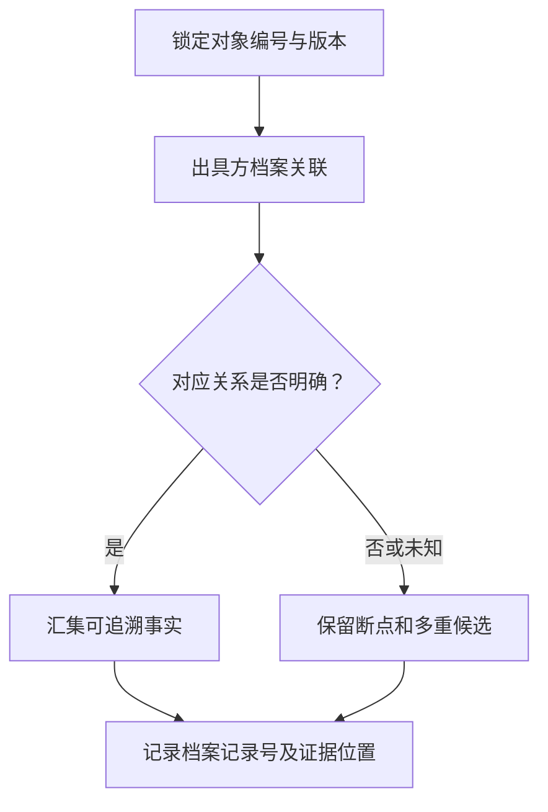

**TRL1-HW-1/C3/P2　数字签名及签署范围验证｜待审核**

采用这一路线的前提是：原始签名 PDF 和信任材料。评价员先从报告原件、编号版本、签署信息、出具方档案记录中确认本路线可用的证据，标明对象、版本及评价时点。输入不足时，先记录缺少哪项依据。

验证签名覆盖与修改状态、证书链及可用可信时间。随后，对照证书主体与出具机构。签署后追加内容另标，不以印章图案替代验证。

先取得原始签名 PDF，核每个签名覆盖的字节范围以及签后增补内容，再按可获得的信任根和撤销资料验证证书链。证书验证失败、资料不足、签名后修改和没有可信时间分别输出。

将证书主体与报告出具机构对应，再核签署人是否具有相应代表身份。报告标注日期与可信签署时间不一致时并列保存，不替换原日期。只有扫描章时转人工核源；OFD 或未确认兼容的算法保留工具适配未知。

结果整理为档案记录号、原件位置、签名覆盖/时间和版本差异。每项结果同时给出原材料位置、使用的字段或记录及处理依据，区分支持、冲突和无法确认。针对只有扫描章、档案不可访问、签署人不能代表机构，保留异常所涉及的具体材料，交 TRL1-HW-1/C3/P3 复核。自动处理不替评价员作本条最终判断。

S10 文档确认未实测。需信任根及撤销数据，OFD 兼容待核。签名有效不证明技术内容正确。这些依赖尚未在本项目完成接入或样本验证，实际费用和工时按授权范围、材料规模另行评估。


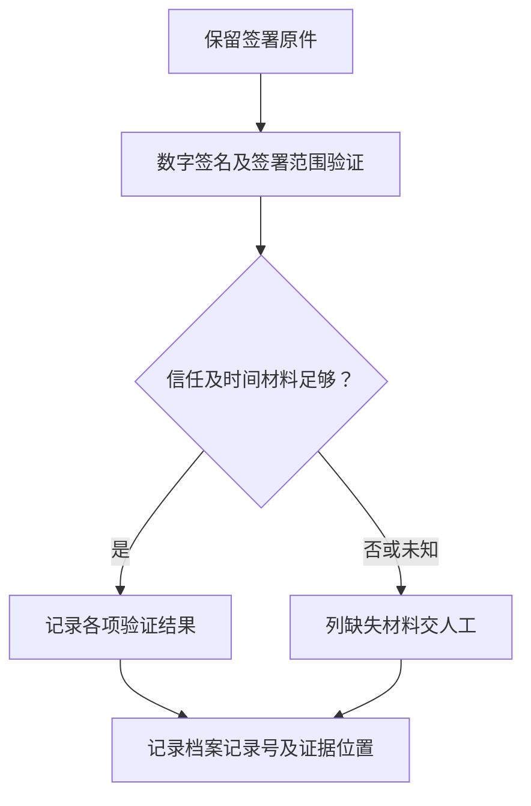


**TRL1-HW-1/C3/P3　人工兜底｜待审核**

这一路线接受本检查点的全部相关材料，也承接其他候选无法处理或结果冲突的情况。评价员先收集报告原件、编号版本、签署信息、出具方档案记录，连同已有抽取、计算或查询结果一起阅卷。没有自动结果也可以直接人工核验，不能因此要求补做一遍接口查询。

复核围绕“研究报告出具主体、版本与时间可追溯”展开。评价员逐项回看原件，确认对象与时间范围，再请相应领域专家解释技术含义。材料保管人协助说明来源、编号和版本。对“出具方档案关联”、“数字签名及签署范围验证”产生的不同结果，先核各自前提和覆盖范围，再判断是材料冲突还是核验范围不同。

重点检查只有扫描章、档案不可访问、签署人不能代表机构。对疑点建立一条待核记录，写清相互矛盾的原文、可能解释和仍缺的依据。能从现有材料解决的，补上定位与理由。需要函询、现场观察或新增试验的，由评价员另行明确对象和范围，本轮不代为执行。

以下假设场景说明复核意见应达到的具体程度：假设报告日期早于基准日但可信签署晚于基准日：系统并列两个时间，评价员查出具登记，不擅改报告日期。

复核后形成档案记录号、原件位置、签名覆盖/时间和版本差异。评价员逐项记录采纳、驳回或暂不能确认，并注明证据范围、复核人和日期。无法取得原始依据时继续保留未知。人工意见也需要说明依据，不能只写“专家认为通过”。

这一路线需要阅卷权限、材料保管人协助及相应领域专家的工时。投入取决于材料数量、疑点复杂度和是否需要补证，当前不预设费用。系统仅协助整理证据位置、意见和修改记录。此前的自动结果保留，便于复查人工修改的原因。


**候选差异**：P1 依赖取得只读档案导出及报告原件；P2 依赖原始签名 PDF 和信任材料。各路线形成各自范围内的事实，来源一致不能自动视为独立证明。P3 人工兜底始终保留，当前不选定或排列实施优先级。

**假设场景**：假设报告日期早于基准日但可信签署晚于基准日：系统并列两个时间，评价员查出具登记，不擅改报告日期。

**异常与边界**：只有扫描章、档案不可访问、签署人不能代表机构。正常结果仅对已核对象和范围有效；缺失与明确冲突分列。解析失败、查询超时、权限不足均记执行状态，不转成技术不满足。

**来源与接入状态**：R0/S10（具体查阅日及状态见来源账本）。本检查点未取得真实受评材料，未完成实测。

**待讨论**：内部报告的公布/提交范围如何认定；无签名时允许哪些替代证据？ **用户选择：未选择。**

**5. TRL1-HW-1/C4：来源材料与本项目的关系**

**核验范围及前提**：任务书研究基础、作者/发明人/出具方、项目引用说明，声明自有成果时的合作或权利材料。输入清单表示该路线所需信息，不将全部文件名变成强制提交项；材料合并承载同一事实时保留页段对应。

**TRL1-HW-1/C4/P1　项目引用与角色映射｜待审核**

采用这一路线的前提是：有项目研究基础引用及可识别外部材料。评价员先从任务书研究基础、作者/发明人/出具方、项目引用说明，声明自有成果时的合作或权利材料中确认本路线可用的证据，标明对象、版本及评价时点。输入不足时，先记录缺少哪项依据。

将引用号映射到已核论文/专利/报告。随后，提取采用的原理与项目工作包。最后，标记外部基础、自有成果、合作成果，不因主体不同自动否定。

先核任务书实际引用的是哪一份已核来源材料，再摘录所用原理及对应工作包。材料作者与受评主体不同，先标为外部研究基础；只有申报方主张自有或合作成果时，才继续核该项角色主张。

同一材料可以支持多个工作包，但每项关联都要指出具体段落。仅出现同一技术名词时保留关系未知；项目引用遗漏或名称变体由评价员回看正文，不根据作者单位自动否定技术支撑。

结果整理为来源角色表、引用位置、项目对应段及权利主张边界。每项结果同时给出原材料位置、使用的字段或记录及处理依据，区分支持、冲突和无法确认。针对将外部基础误判为不归属、人员同名、协议范围不清，保留异常所涉及的具体材料，交 TRL1-HW-1/C4/P3 复核。自动处理不替评价员作本条最终判断。

实施需评估本地关联成本。引用遗漏会漏配，名称相似不得合并法人。不自动作权利判断。这些依赖尚未在本项目完成接入或样本验证，实际费用和工时按授权范围、材料规模另行评估。
**TRL1-HW-1/C4/P2　成果来源档案对照｜待审核**

采用这一路线的前提是：主张本团队成果并提供任务分工/成果登记/合作附件。评价员先从任务书研究基础、作者/发明人/出具方、项目引用说明，声明自有成果时的合作或权利材料中确认本路线可用的证据，标明对象、版本及评价时点。输入不足时，先记录缺少哪项依据。

按项目号和成果号关联参与人、形成时间、合作分工。模型仅辅助解释名称变体，保留原句与明确/未明确的权利范围。

先摘录申报方具体主张的成果来源和参与角色，再按项目号、成果号及形成时间查阅登记、任务分工和合作附件。作者、发明人、出具机构及权利主体分别记录，不能互相替代。

将合作范围和例外条款定位到原文，注明它是否覆盖本次使用的内容与时间。名称变体由模型提出对应候选，实际对应和协议含义由人工复核；材料没有明确权利范围时保留未知。

结果整理为来源角色表、引用位置、项目对应段及权利主张边界。每项结果同时给出原材料位置、使用的字段或记录及处理依据，区分支持、冲突和无法确认。针对将外部基础误判为不归属、人员同名、协议范围不清，保留异常所涉及的具体材料，交 TRL1-HW-1/C4/P3 复核。自动处理不替评价员作本条最终判断。

需要内部权限、语义复核工时。作者同名或母子公司不能自动等同。仅当具体主张涉及归属时执行。这些依赖尚未在本项目完成接入或样本验证，实际费用和工时按授权范围、材料规模另行评估。

**TRL1-HW-1/C4/P3　人工兜底｜待审核**

这一路线接受本检查点的全部相关材料，也承接其他候选无法处理或结果冲突的情况。评价员先收集任务书研究基础、作者/发明人/出具方、项目引用说明，声明自有成果时的合作或权利材料，连同已有抽取、计算或查询结果一起阅卷。没有自动结果也可以直接人工核验，不能因此要求补做一遍接口查询。

复核围绕“来源材料与本项目的关系”展开。评价员逐项回看原件，确认对象与时间范围，再请熟悉专利或成果来源的复核人员解释技术含义。材料保管人协助说明来源、编号和版本。对“项目引用与角色映射”、“成果来源档案对照”产生的不同结果，先核各自前提和覆盖范围，再判断是材料冲突还是核验范围不同。

重点检查将外部基础误判为不归属、人员同名、协议范围不清。对疑点建立一条待核记录，写清相互矛盾的原文、可能解释和仍缺的依据。能从现有材料解决的，补上定位与理由。需要函询、现场观察或新增试验的，由评价员另行明确对象和范围，本轮不代为执行。

以下假设场景说明复核意见应达到的具体程度：假设采用大学论文解释测量原理：系统标外部研究基础，专家审核技术支撑，不要求受评单位成为论文作者。

复核后形成来源角色表、引用位置、项目对应段及权利主张边界。评价员逐项记录采纳、驳回或暂不能确认，并注明证据范围、复核人和日期。无法取得原始依据时继续保留未知。人工意见也需要说明依据，不能只写“专家认为通过”。

这一路线需要阅卷权限、材料保管人协助及熟悉专利或成果来源的复核人员的工时。投入取决于材料数量、疑点复杂度和是否需要补证，当前不预设费用。系统仅协助整理证据位置、意见和修改记录。此前的自动结果保留，便于复查人工修改的原因。

**候选差异**：P1 依赖有项目研究基础引用及可识别外部材料；P2 依赖主张本团队成果并提供任务分工/成果登记/合作附件。各路线形成各自范围内的事实，来源一致不能自动视为独立证明。P3 人工兜底始终保留，当前不选定或排列实施优先级。

**假设场景**：假设采用大学论文解释测量原理：系统标外部研究基础，专家审核技术支撑，不要求受评单位成为论文作者。

**异常与边界**：将外部基础误判为不归属、人员同名、协议范围不清。正常结果仅对已核对象和范围有效；缺失与明确冲突分列。解析失败、查询超时、权限不足均记执行状态，不转成技术不满足。

**来源与接入状态**：R0（具体查阅日及状态见来源账本）。本检查点未取得真实受评材料，未完成实测。

**待讨论**：本条是否有额外的自有成果要求；外部技术使用关系需核到什么程度？ **用户选择：未选择。**

**6. TRL1-HW-1/C5：基本原理对项目研究的具体支撑**

**核验范围及前提**：材料原理/方法正文、任务书技术问题与边界条件。输入清单表示该路线所需信息，不将全部文件名变成强制提交项；材料合并承载同一事实时保留页段对应。

**TRL1-HW-1/C5/P1　论证链语义审阅｜待审核**

采用这一路线的前提是：可读全文及项目问题描述。评价员先从材料原理/方法正文、任务书技术问题与边界条件中确认本路线可用的证据，标明对象、版本及评价时点。输入不足时，先记录缺少哪项依据。

提取出基本假设、机理、推导与适用边界。随后，对应项目所用环节。最后，输出支持、矛盾及缺少论证的位置。不以主题相似度定结论。

先把材料中的结论拆成可核对的主张，逐项摘录其假设、理由、依据和限制。辅助模型只能使用授权材料和已确认的项目背景，返回原文位置、可能反证及无法确定之处；公式和图中的含义需要回看原件。

专家沿“依据是否存在、前提是否适用、推导能否支持主张”的顺序复核。缺少依据时说明缺在哪一步，不凭模型常识补出论证；文字相似、表达流畅和多次生成一致均不作为充分性判据。

结果整理为原理—假设—项目环节矩阵、页段及反例。每项结果同时给出原材料位置、使用的字段或记录及处理依据，区分支持、冲突和无法确认。针对只有摘要口号、推导依赖未说明、计算范围超出论文条件，保留异常所涉及的具体材料，交 TRL1-HW-1/C5/P3 复核。自动处理不替评价员作本条最终判断。

实施需评估本地或授权模型及专家标注工时。公式/OCR 误读、跨领域推理可能出错。模型仅辅助。这些依赖尚未在本项目完成接入或样本验证，实际费用和工时按授权范围、材料规模另行评估。
**TRL1-HW-1/C5/P2　申报主张矩阵与关键推导复核｜待审核**

采用这一路线的前提是：申报方给出原理页段、公式及项目参数。评价员先从材料原理/方法正文、任务书技术问题与边界条件中确认本路线可用的证据，标明对象、版本及评价时点。输入不足时，先记录缺少哪项依据。

验证页段真实存在。随后，将假设条件与项目参数逐项匹配。最后，对可计算公式做单位/边界校验并记录计算。无法形式化部分交专家。

先回到申报方给出的原理页段，确认公式、假设及边界实际存在。把公式中的每个变量对应到项目参数，记录单位、取值范围和出处，再检查项目工况是否落在原理声明的适用范围内。

可计算部分保留代入值、计算步骤和边界检查结果。定性原理或无法形式化的推导交领域专家说明，不能为了便于计算自行增加假设；公式计算正确也不代表其物理前提已经成立。

结果整理为原理—假设—项目环节矩阵、页段及反例。每项结果同时给出原材料位置、使用的字段或记录及处理依据，区分支持、冲突和无法确认。针对只有摘要口号、推导依赖未说明、计算范围超出论文条件，保留异常所涉及的具体材料，交 TRL1-HW-1/C5/P3 复核。自动处理不替评价员作本条最终判断。

需领域参数与公式复核，成本随复杂度。定位有文字不证明原理正确，不能强迫所有原理可数值化。这些依赖尚未在本项目完成接入或样本验证，实际费用和工时按授权范围、材料规模另行评估。


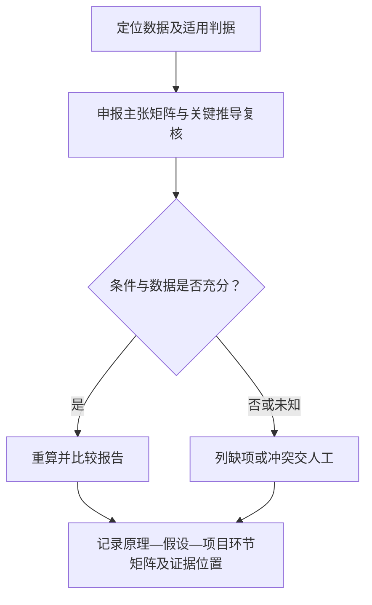


**TRL1-HW-1/C5/P3　人工兜底｜待审核**

这一路线接受本检查点的全部相关材料，也承接其他候选无法处理或结果冲突的情况。评价员先收集材料原理/方法正文、任务书技术问题与边界条件，连同已有抽取、计算或查询结果一起阅卷。没有自动结果也可以直接人工核验，不能因此要求补做一遍接口查询。

复核围绕“基本原理对项目研究的具体支撑”展开。评价员逐项回看原件，确认对象与时间范围，再请相应领域的技术专家解释技术含义。材料保管人协助说明来源、编号和版本。对“论证链语义审阅”、“申报主张矩阵与关键推导复核”产生的不同结果，先核各自前提和覆盖范围，再判断是材料冲突还是核验范围不同。

重点检查只有摘要口号、推导依赖未说明、计算范围超出论文条件。对疑点建立一条待核记录，写清相互矛盾的原文、可能解释和仍缺的依据。能从现有材料解决的，补上定位与理由。需要函询、现场观察或新增试验的，由评价员另行明确对象和范围，本轮不代为执行。

以下假设场景说明复核意见应达到的具体程度：假设文献模型仅在线性区成立而项目用于饱和区：系统指出条件冲突和两处页码，由专家判断是否有补充推导。

复核后形成原理—假设—项目环节矩阵、页段及反例。评价员逐项记录采纳、驳回或暂不能确认，并注明证据范围、复核人和日期。无法取得原始依据时继续保留未知。人工意见也需要说明依据，不能只写“专家认为通过”。

这一路线需要阅卷权限、材料保管人协助及相应领域的技术专家的工时。投入取决于材料数量、疑点复杂度和是否需要补证，当前不预设费用。系统仅协助整理证据位置、意见和修改记录。此前的自动结果保留，便于复查人工修改的原因。

**候选差异**：P1 依赖可读全文及项目问题描述；P2 依赖申报方给出原理页段、公式及项目参数。各路线形成各自范围内的事实，来源一致不能自动视为独立证明。P3 人工兜底始终保留，当前不选定或排列实施优先级。

**假设场景**：假设文献模型仅在线性区成立而项目用于饱和区：系统指出条件冲突和两处页码，由专家判断是否有补充推导。

**异常与边界**：只有摘要口号、推导依赖未说明、计算范围超出论文条件。正常结果仅对已核对象和范围有效；缺失与明确冲突分列。解析失败、查询超时、权限不足均记执行状态，不转成技术不满足。

**来源与接入状态**：R0（具体查阅日及状态见来源账本）。本检查点未取得真实受评材料，未完成实测。

**待讨论**：何种支撑充分性可以自动确认；是否要求申报方提供主张定位表？ **用户选择：未选择。**

**本条材料组合与结果汇总草案**
候选解释 A：一种资料充分支撑同一基本原理即可；解释 B：多种资料联合覆盖不同原理。二者均须完成实际使用材料的身份及内容核对。未用材料类型可不触发，不能强制论文+专利+报告全齐。申请已发生与“公布”是否满足分别裁定。

**对现有项目的 PRD 影响**
论文卡分别显示身份、载体、日期、版本、全文；专利卡分申请/公开/授权；增加项目来源角色和原理支撑位置。 记录绑定 CheckItem 快照、EvidenceFile 及其哈希，展示本条检查点与原文位置；复核采纳/覆盖理由进入 AuditLog。报告只引用已被评价员采纳的事实及其范围，不能由流程门禁推导技术满足。

**讨论状态与记录**
研究进度：方案已列齐；用户决策：待审核；已明确用户意见：连续研究、保留人工、不代选、不开发。各检查点具体方案无已确认选择。待决问题见各 C 项。本轮修改：2026-10-06，依据原表与来源账本展开候选；2026-10-07 统一质检。编号沿革见附录，未将历史用户决定转移至新方案。

### TRL1-HW-2　方案已列齐／待审核

**原表位置**：Sheet1!C9（原序号 2），条件 E9，材料 F9。

**条件原文**：
> 明确了基本原理的假设条件、应用范围

**支撑材料原文**：
> 项目任务书

**规则解释与差异**：“明确”包括可辨识的假设和应用范围，不自行要求 TRL1 完成实测。
与读取分支种子条件、材料文字一致（忽略空白）。

**1. 事实检查点拆解**

|编号|核验事实及原文对应|输入和触发范围|输出与可追溯证据|
|---|---|---|---|
|C1|假设条件已明确且与基本原理对应|本条申报该事实时；项目任务书原理章节、假设清单和引用原理|假设—原理矩阵及原文位置|
|C2|应用范围与排除边界明确|本条申报该事实时；任务书应用对象、工况、输入输出及排除说明|范围表、边界冲突及场景定位|

**2. TRL1-HW-2/C1：假设条件已明确且与基本原理对应**

**核验范围及前提**：项目任务书原理章节、假设清单和引用原理。输入清单表示该路线所需信息，不将全部文件名变成强制提交项；材料合并承载同一事实时保留页段对应。

**TRL1-HW-2/C1/P1　条件表结构比对｜待审核**

采用这一路线的前提是：假设按参数或约束列出。评价员先从项目任务书原理章节、假设清单和引用原理中确认本路线可用的证据，标明对象、版本及评价时点。输入不足时，先记录缺少哪项依据。

提取对象、变量、取值范围、约束。随后，关联原理表达式。最后，检查单位、定义和相互矛盾。

先确定材料中需要对应的对象及字段，把原始值和规范化值分开保存。按已有编号或明确引用建立关系，再逐项比较含义、范围与上下文；名称相近或字段同名时仍需确认其实际所指。

对无法对应和互相矛盾的项，返回两侧原始位置及差异说明。未声明的字段保持未知，不根据常用模板补齐；评价员确认对应关系后，结果仍只覆盖已经核对的对象。

结果整理为假设—原理矩阵及原文位置。每项结果同时给出原材料位置、使用的字段或记录及处理依据，区分支持、冲突和无法确认。针对将试验环境误当理论假设、隐含条件不能确定，保留异常所涉及的具体材料，交 TRL1-HW-2/C1/P3 复核。自动处理不替评价员作本条最终判断。

实施需评估解析/规则维护工时。表完整不保证假设科学正确。这些依赖尚未在本项目完成接入或样本验证，实际费用和工时按授权范围、材料规模另行评估。
**TRL1-HW-2/C1/P2　技术论证辅助审读｜待审核**

采用这一路线的前提是：假设散落在正文或公式中。评价员先从项目任务书原理章节、假设清单和引用原理中确认本路线可用的证据，标明对象、版本及评价时点。输入不足时，先记录缺少哪项依据。

按原理推导找隐含条件。随后，同任务书明示条件对照。最后，给出遗漏候选及所在推导步骤。

先把材料中的结论拆成可核对的主张，逐项摘录其假设、理由、依据和限制。辅助模型只能使用授权材料和已确认的项目背景，返回原文位置、可能反证及无法确定之处；公式和图中的含义需要回看原件。

专家沿“依据是否存在、前提是否适用、推导能否支持主张”的顺序复核。缺少依据时说明缺在哪一步，不凭模型常识补出论证；文字相似、表达流畅和多次生成一致均不作为充分性判据。

结果整理为假设—原理矩阵及原文位置。每项结果同时给出原材料位置、使用的字段或记录及处理依据，区分支持、冲突和无法确认。针对将试验环境误当理论假设、隐含条件不能确定，保留异常所涉及的具体材料，交 TRL1-HW-2/C1/P3 复核。自动处理不替评价员作本条最终判断。

实施需评估模型/专家工时。不得凭通用常识新增强制假设。这些依赖尚未在本项目完成接入或样本验证，实际费用和工时按授权范围、材料规模另行评估。

**TRL1-HW-2/C1/P3　人工兜底｜待审核**

这一路线接受本检查点的全部相关材料，也承接其他候选无法处理或结果冲突的情况。评价员先收集项目任务书原理章节、假设清单和引用原理，连同已有抽取、计算或查询结果一起阅卷。没有自动结果也可以直接人工核验，不能因此要求补做一遍接口查询。

复核围绕“假设条件已明确且与基本原理对应”展开。评价员逐项回看原件，确认对象与时间范围，再请相应领域的技术专家解释技术含义。材料保管人协助说明来源、编号和版本。对“条件表结构比对”、“技术论证辅助审读”产生的不同结果，先核各自前提和覆盖范围，再判断是材料冲突还是核验范围不同。

重点检查将试验环境误当理论假设、隐含条件不能确定。对疑点建立一条待核记录，写清相互矛盾的原文、可能解释和仍缺的依据。能从现有材料解决的，补上定位与理由。需要函询、现场观察或新增试验的，由评价员另行明确对象和范围，本轮不代为执行。

以下假设场景说明复核意见应达到的具体程度：假设任务书写“线性关系”而实验章节涉及饱和：标条件待澄清，专家决定边界。

复核后形成假设—原理矩阵及原文位置。评价员逐项记录采纳、驳回或暂不能确认，并注明证据范围、复核人和日期。无法取得原始依据时继续保留未知。人工意见也需要说明依据，不能只写“专家认为通过”。

这一路线需要阅卷权限、材料保管人协助及相应领域的技术专家的工时。投入取决于材料数量、疑点复杂度和是否需要补证，当前不预设费用。系统仅协助整理证据位置、意见和修改记录。此前的自动结果保留，便于复查人工修改的原因。

**候选差异**：P1 依赖假设按参数或约束列出；P2 依赖假设散落在正文或公式中。各路线形成各自范围内的事实，来源一致不能自动视为独立证明。P3 人工兜底始终保留，当前不选定或排列实施优先级。

**假设场景**：假设任务书写“线性关系”而实验章节涉及饱和：标条件待澄清，专家决定边界。

**异常与边界**：将试验环境误当理论假设、隐含条件不能确定。正常结果仅对已核对象和范围有效；缺失与明确冲突分列。解析失败、查询超时、权限不足均记执行状态，不转成技术不满足。

**来源与接入状态**：R0（具体查阅日及状态见来源账本）。本检查点未取得真实受评材料，未完成实测。

**待讨论**：假设完整性以哪份原理定义为基准？ **用户选择：未选择。**

**3. TRL1-HW-2/C2：应用范围与排除边界明确**

**核验范围及前提**：任务书应用对象、工况、输入输出及排除说明。输入清单表示该路线所需信息，不将全部文件名变成强制提交项；材料合并承载同一事实时保留页段对应。

**TRL1-HW-2/C2/P1　应用场景覆盖表｜待审核**

采用这一路线的前提是：任务书有场景和参数范围。评价员先从任务书应用对象、工况、输入输出及排除说明中确认本路线可用的证据，标明对象、版本及评价时点。输入不足时，先记录缺少哪项依据。

按对象/工况/边界提取范围。随后，与假设条件联结。最后，识别范围交集为空或超出已述条件。

先从已有依据中取得本检查点的适用清单，并保留每项的来源位置。将清单逐项对应到材料中的实现、安排或验证证据；一个附件覆盖多项时，分别标出支持各项的具体内容。

没有对应证据的条目列为缺项，材料明确排除的条目同时保留排除依据。自动匹配只生成对应候选，专家仍需判断证据能否回答该项事实；链接存在或清单数量相同均不能替代覆盖判断。

结果整理为范围表、边界冲突及场景定位。每项结果同时给出原材料位置、使用的字段或记录及处理依据，区分支持、冲突和无法确认。针对应用范围仅有行业名、上下限无单位，保留异常所涉及的具体材料，交 TRL1-HW-2/C2/P3 复核。自动处理不替评价员作本条最终判断。

实施需评估本地抽取和口径维护。未定范围不能自动补成行业默认值。这些依赖尚未在本项目完成接入或样本验证，实际费用和工时按授权范围、材料规模另行评估。
**TRL1-HW-2/C2/P2　反例驱动边界审阅｜待审核**

采用这一路线的前提是：提供代表应用场景及相邻不适用场景。评价员先从任务书应用对象、工况、输入输出及排除说明中确认本路线可用的证据，标明对象、版本及评价时点。输入不足时，先记录缺少哪项依据。

逐场景说明满足/违反哪个假设。随后，模型整理反例，领域专家核理由。系统留场景与依据映射。

先把材料中的结论拆成可核对的主张，逐项摘录其假设、理由、依据和限制。辅助模型只能使用授权材料和已确认的项目背景，返回原文位置、可能反证及无法确定之处；公式和图中的含义需要回看原件。

专家沿“依据是否存在、前提是否适用、推导能否支持主张”的顺序复核。缺少依据时说明缺在哪一步，不凭模型常识补出论证；文字相似、表达流畅和多次生成一致均不作为充分性判据。

结果整理为范围表、边界冲突及场景定位。每项结果同时给出原材料位置、使用的字段或记录及处理依据，区分支持、冲突和无法确认。针对应用范围仅有行业名、上下限无单位，保留异常所涉及的具体材料，交 TRL1-HW-2/C2/P3 复核。自动处理不替评价员作本条最终判断。

需要场景知识与复核工时。有限案例不能证明所有范围覆盖。这些依赖尚未在本项目完成接入或样本验证，实际费用和工时按授权范围、材料规模另行评估。

**TRL1-HW-2/C2/P3　人工兜底｜待审核**

这一路线接受本检查点的全部相关材料，也承接其他候选无法处理或结果冲突的情况。评价员先收集任务书应用对象、工况、输入输出及排除说明，连同已有抽取、计算或查询结果一起阅卷。没有自动结果也可以直接人工核验，不能因此要求补做一遍接口查询。

复核围绕“应用范围与排除边界明确”展开。评价员逐项回看原件，确认对象与时间范围，再请相应领域专家解释技术含义。材料保管人协助说明来源、编号和版本。对“应用场景覆盖表”、“反例驱动边界审阅”产生的不同结果，先核各自前提和覆盖范围，再判断是材料冲突还是核验范围不同。

重点检查应用范围仅有行业名、上下限无单位。对疑点建立一条待核记录，写清相互矛盾的原文、可能解释和仍缺的依据。能从现有材料解决的，补上定位与理由。需要函询、现场观察或新增试验的，由评价员另行明确对象和范围，本轮不代为执行。

以下假设场景说明复核意见应达到的具体程度：假设称“高温环境”但无温区：输出描述存在而可判边界不足，要求澄清温区，不能判技术失败。

复核后形成范围表、边界冲突及场景定位。评价员逐项记录采纳、驳回或暂不能确认，并注明证据范围、复核人和日期。无法取得原始依据时继续保留未知。人工意见也需要说明依据，不能只写“专家认为通过”。

这一路线需要阅卷权限、材料保管人协助及相应领域专家的工时。投入取决于材料数量、疑点复杂度和是否需要补证，当前不预设费用。系统仅协助整理证据位置、意见和修改记录。此前的自动结果保留，便于复查人工修改的原因。

**候选差异**：P1 依赖任务书有场景和参数范围；P2 依赖提供代表应用场景及相邻不适用场景。各路线形成各自范围内的事实，来源一致不能自动视为独立证明。P3 人工兜底始终保留，当前不选定或排列实施优先级。

**假设场景**：假设称“高温环境”但无温区：输出描述存在而可判边界不足，要求澄清温区，不能判技术失败。

**异常与边界**：应用范围仅有行业名、上下限无单位。正常结果仅对已核对象和范围有效；缺失与明确冲突分列。解析失败、查询超时、权限不足均记执行状态，不转成技术不满足。

**来源与接入状态**：R0（具体查阅日及状态见来源账本）。本检查点未取得真实受评材料，未完成实测。

**待讨论**：范围需要定量到何种粒度；暂不量化的边界如何审核？ **用户选择：未选择。**

**本条材料组合与结果汇总草案**
假设与范围是并列事实，候选为 AND；一份任务书可同时支持两点，原理引用作为补充，不强制另交试验报告。

**对现有项目的 PRD 影响**
表单增加假设、范围和不适用场景定位；专家可确认定性边界。 记录绑定 CheckItem 快照、EvidenceFile 及其哈希，展示本条检查点与原文位置；复核采纳/覆盖理由进入 AuditLog。报告只引用已被评价员采纳的事实及其范围，不能由流程门禁推导技术满足。

**讨论状态与记录**
研究进度：方案已列齐；用户决策：待审核；已明确用户意见：连续研究、保留人工、不代选、不开发。各检查点具体方案无已确认选择。待决问题见各 C 项。本轮修改：2026-10-06，依据原表与来源账本展开候选；2026-10-07 统一质检。编号沿革见附录，未将历史用户决定转移至新方案。

### TRL1-SW-3　方案已列齐／待审核

**原表位置**：Sheet1!C10（原序号 3），条件 E10，材料 F10。

**条件原文**：
> 正确识别该技术的关键问题和技术挑战

**支撑材料原文**：
> 项目任务书

**规则解释与差异**：核实问题识别与挑战分析，不要求此级已经解决挑战。
与读取分支种子条件、材料文字一致（忽略空白）。

**1. 事实检查点拆解**

|编号|核验事实及原文对应|输入和触发范围|输出与可追溯证据|
|---|---|---|---|
|C1|关键问题与需求目标之间存在明确关系|本条申报该事实时；任务书目标、现状问题、约束与需求来源|问题—目标—来源表与冲突位置|
|C2|技术挑战被具体识别且有分析理由|本条申报该事实时；任务书技术难点、现有方案限制、资源及风险分析|挑战—约束—理由证据链|

**2. TRL1-SW-3/C1：关键问题与需求目标之间存在明确关系**

**核验范围及前提**：任务书目标、现状问题、约束与需求来源。输入清单表示该路线所需信息，不将全部文件名变成强制提交项；材料合并承载同一事实时保留页段对应。

**TRL1-SW-3/C1/P1　问题—目标可追溯对照｜待审核**

采用这一路线的前提是：问题和目标有编号或可标注段落。评价员先从任务书目标、现状问题、约束与需求来源中确认本路线可用的证据，标明对象、版本及评价时点。输入不足时，先记录缺少哪项依据。

将每个问题关联目标及受影响对象。随后，检查无目标关联、目标重复或语义矛盾。

先选定一个明确对象，用材料已有的编号、版本和时间关联各环节记录。每条关联保留两端的原始定位；同名、相近时间或单方填报只能作为线索，不能直接当作同一事件。

遇到缺少中间记录、一对多映射或前后版本不一致时，保留各条可能关系并指出断点。原系统标为完成只说明该状态被记录，是否实际完成还要看交付、执行或验证依据。

结果整理为问题—目标—来源表与冲突位置。每项结果同时给出原材料位置、使用的字段或记录及处理依据，区分支持、冲突和无法确认。针对把解决手段写成问题、需求来源与项目无关，保留异常所涉及的具体材料，交 TRL1-SW-3/C1/P3 复核。自动处理不替评价员作本条最终判断。

实施需评估解析及需求映射工时。有链接不等于识别正确。这些依赖尚未在本项目完成接入或样本验证，实际费用和工时按授权范围、材料规模另行评估。
**TRL1-SW-3/C1/P2　原始需求证据交叉核对｜待审核**

采用这一路线的前提是：有访谈、现状案例或失败记录。评价员先从任务书目标、现状问题、约束与需求来源中确认本路线可用的证据，标明对象、版本及评价时点。输入不足时，先记录缺少哪项依据。

提取痛点表现与使用情境。随后，对照任务书问题描述，列失真概括及遗漏，模型提供证据摘要。

先确定材料中需要对应的对象及字段，把原始值和规范化值分开保存。按已有编号或明确引用建立关系，再逐项比较含义、范围与上下文；名称相近或字段同名时仍需确认其实际所指。

对无法对应和互相矛盾的项，返回两侧原始位置及差异说明。未声明的字段保持未知，不根据常用模板补齐；评价员确认对应关系后，结果仍只覆盖已经核对的对象。

结果整理为问题—目标—来源表与冲突位置。每项结果同时给出原材料位置、使用的字段或记录及处理依据，区分支持、冲突和无法确认。针对把解决手段写成问题、需求来源与项目无关，保留异常所涉及的具体材料，交 TRL1-SW-3/C1/P3 复核。自动处理不替评价员作本条最终判断。

需求原始材料授权及复核成本。少量访谈不代表全部用户。这些依赖尚未在本项目完成接入或样本验证，实际费用和工时按授权范围、材料规模另行评估。

**TRL1-SW-3/C1/P3　人工兜底｜待审核**

这一路线接受本检查点的全部相关材料，也承接其他候选无法处理或结果冲突的情况。评价员先收集任务书目标、现状问题、约束与需求来源，连同已有抽取、计算或查询结果一起阅卷。没有自动结果也可以直接人工核验，不能因此要求补做一遍接口查询。

复核围绕“关键问题与需求目标之间存在明确关系”展开。评价员逐项回看原件，确认对象与时间范围，再请软件或测试专家解释技术含义。材料保管人协助说明来源、编号和版本。对“问题—目标可追溯对照”、“原始需求证据交叉核对”产生的不同结果，先核各自前提和覆盖范围，再判断是材料冲突还是核验范围不同。

重点检查把解决手段写成问题、需求来源与项目无关。对疑点建立一条待核记录，写清相互矛盾的原文、可能解释和仍缺的依据。能从现有材料解决的，补上定位与理由。需要函询、现场观察或新增试验的，由评价员另行明确对象和范围，本轮不代为执行。

以下假设场景说明复核意见应达到的具体程度：假设目标为实时检测而关键问题仅描述界面颜色：系统提示支撑薄弱，专家确认是否遗漏时延问题。

复核后形成问题—目标—来源表与冲突位置。评价员逐项记录采纳、驳回或暂不能确认，并注明证据范围、复核人和日期。无法取得原始依据时继续保留未知。人工意见也需要说明依据，不能只写“专家认为通过”。

这一路线需要阅卷权限、材料保管人协助及软件或测试专家的工时。投入取决于材料数量、疑点复杂度和是否需要补证，当前不预设费用。系统仅协助整理证据位置、意见和修改记录。此前的自动结果保留，便于复查人工修改的原因。

**候选差异**：P1 依赖问题和目标有编号或可标注段落；P2 依赖有访谈、现状案例或失败记录。各路线形成各自范围内的事实，来源一致不能自动视为独立证明。P3 人工兜底始终保留，当前不选定或排列实施优先级。

**假设场景**：假设目标为实时检测而关键问题仅描述界面颜色：系统提示支撑薄弱，专家确认是否遗漏时延问题。

**异常与边界**：把解决手段写成问题、需求来源与项目无关。正常结果仅对已核对象和范围有效；缺失与明确冲突分列。解析失败、查询超时、权限不足均记执行状态，不转成技术不满足。

**来源与接入状态**：R0（具体查阅日及状态见来源账本）。本检查点未取得真实受评材料，未完成实测。

**待讨论**：“关键”的排序依据与问题覆盖边界如何确定？ **用户选择：未选择。**

**3. TRL1-SW-3/C2：技术挑战被具体识别且有分析理由**

**核验范围及前提**：任务书技术难点、现有方案限制、资源及风险分析。输入清单表示该路线所需信息，不将全部文件名变成强制提交项；材料合并承载同一事实时保留页段对应。

**TRL1-SW-3/C2/P1　约束与挑战量化对照｜待审核**

采用这一路线的前提是：有时延、算力、数据或算法约束。评价员先从任务书技术难点、现有方案限制、资源及风险分析中确认本路线可用的证据，标明对象、版本及评价时点。输入不足时，先记录缺少哪项依据。

关联挑战到至少一个具体约束。随后，检查预算/目标间矛盾和缺定义项。数值取任务书。

先把每项技术挑战对应到任务书明确的时延、资源、数据或算法约束，再核这些约束的对象、单位和条件。若同一目标在不同章节使用不同口径，先列出差异，不能挑选更容易满足的写法。

有可计算预算时，保留需求、现有能力和差距的计算依据。该差距用于说明挑战为何存在；本条检查挑战是否识别清楚，不要求当前资源已经满足未来目标。

结果整理为挑战—约束—理由证据链。每项结果同时给出原材料位置、使用的字段或记录及处理依据，区分支持、冲突和无法确认。针对泛称“创新难度大”、只列进度风险，保留异常所涉及的具体材料，交 TRL1-SW-3/C2/P3 复核。自动处理不替评价员作本条最终判断。

实施需评估计算及领域口径维护。当前资源不满足不等于挑战识别错误。这些依赖尚未在本项目完成接入或样本验证，实际费用和工时按授权范围、材料规模另行评估。
**TRL1-SW-3/C2/P2　方案局限论证审阅｜待审核**

采用这一路线的前提是：有既有技术比较与失败案例。评价员先从任务书技术难点、现有方案限制、资源及风险分析中确认本路线可用的证据，标明对象、版本及评价时点。输入不足时，先记录缺少哪项依据。

对每个挑战提取为何现有方法不足及可能风险。随后，核对引用材料支持程度。最后，生成反问清单供专家。

先把材料中的结论拆成可核对的主张，逐项摘录其假设、理由、依据和限制。辅助模型只能使用授权材料和已确认的项目背景，返回原文位置、可能反证及无法确定之处；公式和图中的含义需要回看原件。

专家沿“依据是否存在、前提是否适用、推导能否支持主张”的顺序复核。缺少依据时说明缺在哪一步，不凭模型常识补出论证；文字相似、表达流畅和多次生成一致均不作为充分性判据。

结果整理为挑战—约束—理由证据链。每项结果同时给出原材料位置、使用的字段或记录及处理依据，区分支持、冲突和无法确认。针对泛称“创新难度大”、只列进度风险，保留异常所涉及的具体材料，交 TRL1-SW-3/C2/P3 复核。自动处理不替评价员作本条最终判断。

实施需评估模型与技术专家工时。不可把模型提出的新难点自动当漏项否决。这些依赖尚未在本项目完成接入或样本验证，实际费用和工时按授权范围、材料规模另行评估。

**TRL1-SW-3/C2/P3　人工兜底｜待审核**

这一路线接受本检查点的全部相关材料，也承接其他候选无法处理或结果冲突的情况。评价员先收集任务书技术难点、现有方案限制、资源及风险分析，连同已有抽取、计算或查询结果一起阅卷。没有自动结果也可以直接人工核验，不能因此要求补做一遍接口查询。

复核围绕“技术挑战被具体识别且有分析理由”展开。评价员逐项回看原件，确认对象与时间范围，再请相应领域专家解释技术含义。材料保管人协助说明来源、编号和版本。对“约束与挑战量化对照”、“方案局限论证审阅”产生的不同结果，先核各自前提和覆盖范围，再判断是材料冲突还是核验范围不同。

重点检查泛称“创新难度大”、只列进度风险。对疑点建立一条待核记录，写清相互矛盾的原文、可能解释和仍缺的依据。能从现有材料解决的，补上定位与理由。需要函询、现场观察或新增试验的，由评价员另行明确对象和范围，本轮不代为执行。

以下假设场景说明复核意见应达到的具体程度：假设任务书指出小样本识别难但没说明数据量：输出挑战已提及、规模依据不足，补样本来源。

复核后形成挑战—约束—理由证据链。评价员逐项记录采纳、驳回或暂不能确认，并注明证据范围、复核人和日期。无法取得原始依据时继续保留未知。人工意见也需要说明依据，不能只写“专家认为通过”。

这一路线需要阅卷权限、材料保管人协助及相应领域专家的工时。投入取决于材料数量、疑点复杂度和是否需要补证，当前不预设费用。系统仅协助整理证据位置、意见和修改记录。此前的自动结果保留，便于复查人工修改的原因。

**候选差异**：P1 依赖有时延、算力、数据或算法约束；P2 依赖有既有技术比较与失败案例。各路线形成各自范围内的事实，来源一致不能自动视为独立证明。P3 人工兜底始终保留，当前不选定或排列实施优先级。

**假设场景**：假设任务书指出小样本识别难但没说明数据量：输出挑战已提及、规模依据不足，补样本来源。

**异常与边界**：泛称“创新难度大”、只列进度风险。正常结果仅对已核对象和范围有效；缺失与明确冲突分列。解析失败、查询超时、权限不足均记执行状态，不转成技术不满足。

**来源与接入状态**：R0（具体查阅日及状态见来源账本）。本检查点未取得真实受评材料，未完成实测。

**待讨论**：挑战识别正确性由哪个专业角色确认？ **用户选择：未选择。**

**本条材料组合与结果汇总草案**
问题与挑战可在同一章节联合证明；不同需求源相互冲突保留，不按多数材料自动裁定。

**对现有项目的 PRD 影响**
展示问题/挑战分栏，允许专家增补质疑但不得改写正式规则。 记录绑定 CheckItem 快照、EvidenceFile 及其哈希，展示本条检查点与原文位置；复核采纳/覆盖理由进入 AuditLog。报告只引用已被评价员采纳的事实及其范围，不能由流程门禁推导技术满足。

**讨论状态与记录**
研究进度：方案已列齐；用户决策：待审核；已明确用户意见：连续研究、保留人工、不代选、不开发。各检查点具体方案无已确认选择。待决问题见各 C 项。本轮修改：2026-10-06，依据原表与来源账本展开候选；2026-10-07 统一质检。编号沿革见附录，未将历史用户决定转移至新方案。

### TRL1-SW-4　方案已列齐／待审核

**原表位置**：Sheet1!C11（原序号 4），条件 E11，材料 F11。

**条件原文**：
> 在学术刊物、会议论文、研究报告、专利申请等资料中公布了可作为项目研究基础

**支撑材料原文**：
> 论文、报告或专利等

**规则解释与差异**：E11 原文止于“项目研究基础”；系统补了“的基本算法”。本版两点仅核现有可读主张，算法专属判断以条件候选呈现。
仓库差异：条件改为“在学术刊物、会议论文、研究报告、专利申请等资料中公布了可作为项目研究基础的基本算法”。只记差异，不据此增加门槛。

**1. 事实检查点拆解**

|编号|核验事实及原文对应|输入和触发范围|输出与可追溯证据|
|---|---|---|---|
|C1|支撑资料的发表或出具事实可定位|本条申报该事实时；论文/专利/报告及其身份字段、基准日|资料身份、发表/出具日期和版本对照|
|C2|资料与申报软件研究基础的关系|本条申报该事实时；项目研究问题、材料相关章节、来源角色说明|研究基础映射及不能确定的残句影响|

**2. TRL1-SW-4/C1：支撑资料的发表或出具事实可定位**

**核验范围及前提**：论文/专利/报告及其身份字段、基准日。输入清单表示该路线所需信息，不将全部文件名变成强制提交项；材料合并承载同一事实时保留页段对应。

**TRL1-SW-4/C1/P1　来源记录回查｜待审核**

采用这一路线的前提是：材料有 DOI、申请号或报告号。评价员先从论文/专利/报告及其身份字段、基准日中确认本路线可用的证据，标明对象、版本及评价时点。输入不足时，先记录缺少哪项依据。

按材料类别分别回查书目、申请公开记录或机构档案。随后，核对题名主体日期与文件。分开记录接口故障和未命中。

查询前保留原始标识符和它在材料中的位置，再制作规范化检索值。每个返回候选分别保存来源与查询条件，先排除对象不一致的记录，再比较各字段。无法唯一对应时保留候选集合，不把排序第一条写成已确认身份。

查询结果还要标明实际覆盖范围。接口错误、没有访问权限和查询成功但未命中分别记录；来源没有提供的字段或原始内容，仍标为未核对。

结果整理为资料身份、发表/出具日期和版本对照。每项结果同时给出原材料位置、使用的字段或记录及处理依据，区分支持、冲突和无法确认。针对原文为残句导致公布对象不明确，保留异常所涉及的具体材料，交 TRL1-SW-4/C1/P3 复核。自动处理不替评价员作本条最终判断。

S1-S8 权限按类别取得，未实测。一种身份源不能核所有类型。这些依赖尚未在本项目完成接入或样本验证，实际费用和工时按授权范围、材料规模另行评估。


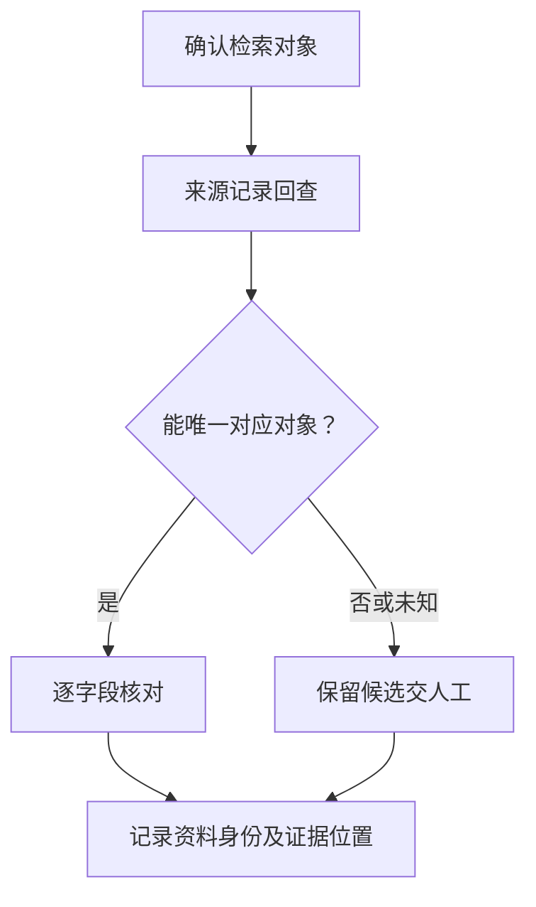

**TRL1-SW-4/C1/P2　原始发布版本比对｜待审核**

采用这一路线的前提是：有出版方正式稿、专利公开文献或机构发布原件。评价员先从论文/专利/报告及其身份字段、基准日中确认本路线可用的证据，标明对象、版本及评价时点。输入不足时，先记录缺少哪项依据。

比较正式原件与提交材料的首页、版本及关键段落。随后，注明是否核到全文。若仅有受理凭证只确认有限申请事实。

先列出被比较文件的对象、版本、生效范围和引用附件，再分别核对标识与实际内容。相同名称不自动合并，不同文件名也不自动认定为不同对象；无法读取的内容保留原件位置和解析失败原因。

比较结果区分排版差异、内容差异和引用缺失。若实际使用版本与声明基线不同，记录变化涉及的具体功能、参数或步骤，交评价员判断适用性，不能直接拿最新版本覆盖历史依据。

结果整理为资料身份、发表/出具日期和版本对照。每项结果同时给出原材料位置、使用的字段或记录及处理依据，区分支持、冲突和无法确认。针对原文为残句导致公布对象不明确，保留异常所涉及的具体材料，交 TRL1-SW-4/C1/P3 复核。自动处理不替评价员作本条最终判断。

实施需评估全文和内部原件权限成本。来源域名/归档导出可信性需人工核实。这些依赖尚未在本项目完成接入或样本验证，实际费用和工时按授权范围、材料规模另行评估。

**TRL1-SW-4/C1/P3　人工兜底｜待审核**

这一路线接受本检查点的全部相关材料，也承接其他候选无法处理或结果冲突的情况。评价员先收集论文/专利/报告及其身份字段、基准日，连同已有抽取、计算或查询结果一起阅卷。没有自动结果也可以直接人工核验，不能因此要求补做一遍接口查询。

复核围绕“支撑资料的发表或出具事实可定位”展开。评价员逐项回看原件，确认对象与时间范围，再请熟悉专利或成果来源的复核人员解释技术含义。材料保管人协助说明来源、编号和版本。对“来源记录回查”、“原始发布版本比对”产生的不同结果，先核各自前提和覆盖范围，再判断是材料冲突还是核验范围不同。

重点检查原文为残句导致公布对象不明确。对疑点建立一条待核记录，写清相互矛盾的原文、可能解释和仍缺的依据。能从现有材料解决的，补上定位与理由。需要函询、现场观察或新增试验的，由评价员另行明确对象和范围，本轮不代为执行。

以下假设场景说明复核意见应达到的具体程度：假设提交算法预印本：可核到其版本和日期，仍需决定本条接受的公布形式。

复核后形成资料身份、发表/出具日期和版本对照。评价员逐项记录采纳、驳回或暂不能确认，并注明证据范围、复核人和日期。无法取得原始依据时继续保留未知。人工意见也需要说明依据，不能只写“专家认为通过”。

这一路线需要阅卷权限、材料保管人协助及熟悉专利或成果来源的复核人员的工时。投入取决于材料数量、疑点复杂度和是否需要补证，当前不预设费用。系统仅协助整理证据位置、意见和修改记录。此前的自动结果保留，便于复查人工修改的原因。

**候选差异**：P1 依赖材料有 DOI、申请号或报告号；P2 依赖有出版方正式稿、专利公开文献或机构发布原件。各路线形成各自范围内的事实，来源一致不能自动视为独立证明。P3 人工兜底始终保留，当前不选定或排列实施优先级。

**假设场景**：假设提交算法预印本：可核到其版本和日期，仍需决定本条接受的公布形式。

**异常与边界**：原文为残句导致公布对象不明确。正常结果仅对已核对象和范围有效；缺失与明确冲突分列。解析失败、查询超时、权限不足均记执行状态，不转成技术不满足。

**来源与接入状态**：S1/S2/S3/S4/S6/S7/S8（具体查阅日及状态见来源账本）。本检查点未取得真实受评材料，未完成实测。

**待讨论**：原表残句应维持现义还是按种子“基本算法”解释？ **用户选择：未选择。**

**3. TRL1-SW-4/C2：资料与申报软件研究基础的关系**

**核验范围及前提**：项目研究问题、材料相关章节、来源角色说明。输入清单表示该路线所需信息，不将全部文件名变成强制提交项；材料合并承载同一事实时保留页段对应。

**TRL1-SW-4/C2/P1　研究基础论证矩阵｜待审核**

采用这一路线的前提是：能指出材料方法与软件任务对应位置。评价员先从项目研究问题、材料相关章节、来源角色说明中确认本路线可用的证据，标明对象、版本及评价时点。输入不足时，先记录缺少哪项依据。

提取输入假设、算法机理、输出及适用条件。随后，对应项目任务，标外部基础/项目成果。

先把材料中的结论拆成可核对的主张，逐项摘录其假设、理由、依据和限制。辅助模型只能使用授权材料和已确认的项目背景，返回原文位置、可能反证及无法确定之处；公式和图中的含义需要回看原件。

专家沿“依据是否存在、前提是否适用、推导能否支持主张”的顺序复核。缺少依据时说明缺在哪一步，不凭模型常识补出论证；文字相似、表达流畅和多次生成一致均不作为充分性判据。

结果整理为研究基础映射及不能确定的残句影响。每项结果同时给出原材料位置、使用的字段或记录及处理依据，区分支持、冲突和无法确认。针对引用材料只提软件名称而无方法，保留异常所涉及的具体材料，交 TRL1-SW-4/C2/P3 复核。自动处理不替评价员作本条最终判断。

实施需评估模型/专家复核成本。不以作者归属或相似度代替支撑判断。这些依赖尚未在本项目完成接入或样本验证，实际费用和工时按授权范围、材料规模另行评估。
**TRL1-SW-4/C2/P2　申报映射与例题复核｜待审核**

采用这一路线的前提是：提供基础方法页段及可复核示例。评价员先从项目研究问题、材料相关章节、来源角色说明中确认本路线可用的证据，标明对象、版本及评价时点。输入不足时，先记录缺少哪项依据。

核对页段内容。随后，以项目示例检查方法前提、输入输出对应。计算仅用于说明支撑，不要求此级代码实现。

先定位所引用基础方法的前提、输入和输出，再把申报方提供的例题参数逐项代入。记录哪一步直接使用来源方法，哪一步需要项目新增假设，以及这些假设是否已有说明。

例题中的计算保留过程与结果，无法计算的部分交算法专家解释。一个例题能说明某条对应关系，不能证明全部应用范围，也不能据此要求本级已经交付可运行代码。

结果整理为研究基础映射及不能确定的残句影响。每项结果同时给出原材料位置、使用的字段或记录及处理依据，区分支持、冲突和无法确认。针对引用材料只提软件名称而无方法，保留异常所涉及的具体材料，交 TRL1-SW-4/C2/P3 复核。自动处理不替评价员作本条最终判断。

需算法专家与示例数据。可计算示例不能证明总体可行。这些依赖尚未在本项目完成接入或样本验证，实际费用和工时按授权范围、材料规模另行评估。

**TRL1-SW-4/C2/P3　人工兜底｜待审核**

这一路线接受本检查点的全部相关材料，也承接其他候选无法处理或结果冲突的情况。评价员先收集项目研究问题、材料相关章节、来源角色说明，连同已有抽取、计算或查询结果一起阅卷。没有自动结果也可以直接人工核验，不能因此要求补做一遍接口查询。

复核围绕“资料与申报软件研究基础的关系”展开。评价员逐项回看原件，确认对象与时间范围，再请软件或测试专家解释技术含义。材料保管人协助说明来源、编号和版本。对“研究基础论证矩阵”、“申报映射与例题复核”产生的不同结果，先核各自前提和覆盖范围，再判断是材料冲突还是核验范围不同。

重点检查引用材料只提软件名称而无方法。对疑点建立一条待核记录，写清相互矛盾的原文、可能解释和仍缺的依据。能从现有材料解决的，补上定位与理由。需要函询、现场观察或新增试验的，由评价员另行明确对象和范围，本轮不代为执行。

以下假设场景说明复核意见应达到的具体程度：假设论文为静态图像算法而项目是连续信号：输出任务差异，专家看是否存在可解释的迁移。

复核后形成研究基础映射及不能确定的残句影响。评价员逐项记录采纳、驳回或暂不能确认，并注明证据范围、复核人和日期。无法取得原始依据时继续保留未知。人工意见也需要说明依据，不能只写“专家认为通过”。

这一路线需要阅卷权限、材料保管人协助及软件或测试专家的工时。投入取决于材料数量、疑点复杂度和是否需要补证，当前不预设费用。系统仅协助整理证据位置、意见和修改记录。此前的自动结果保留，便于复查人工修改的原因。

**候选差异**：P1 依赖能指出材料方法与软件任务对应位置；P2 依赖提供基础方法页段及可复核示例。各路线形成各自范围内的事实，来源一致不能自动视为独立证明。P3 人工兜底始终保留，当前不选定或排列实施优先级。

**假设场景**：假设论文为静态图像算法而项目是连续信号：输出任务差异，专家看是否存在可解释的迁移。

**异常与边界**：引用材料只提软件名称而无方法。正常结果仅对已核对象和范围有效；缺失与明确冲突分列。解析失败、查询超时、权限不足均记执行状态，不转成技术不满足。

**来源与接入状态**：R0（具体查阅日及状态见来源账本）。本检查点未取得真实受评材料，未完成实测。

**待讨论**：未补正残句前允许核实到“项目研究基础”还是暂停内容采纳？ **用户选择：未选择。**

**本条材料组合与结果汇总草案**
材料身份与项目关联可核；若用户选择补正为算法基础，须另核算法内容充分性再作最终评价，不把本研究当补正批准。

**对现有项目的 PRD 影响**
原文与种子并排显示，标明解释未定，允许事实结果存储但禁止自动推导整条满足。 记录绑定 CheckItem 快照、EvidenceFile 及其哈希，展示本条检查点与原文位置；复核采纳/覆盖理由进入 AuditLog。报告只引用已被评价员采纳的事实及其范围，不能由流程门禁推导技术满足。

**讨论状态与记录**
研究进度：方案已列齐；用户决策：待审核；已明确用户意见：连续研究、保留人工、不代选、不开发。各检查点具体方案无已确认选择。待决问题见各 C 项。本轮修改：2026-10-06，依据原表与来源账本展开候选；2026-10-07 统一质检。编号沿革见附录，未将历史用户决定转移至新方案。

### TRL1-SW-5　方案已列齐／待审核

**原表位置**：Sheet1!C12（原序号 5），条件 E12，材料 F12。

**条件原文**：
> 明确了基本算法的条件、应用范围，确定了整体工作的可行性

**支撑材料原文**：
> 可行性报告

**规则解释与差异**：条件、范围和整体可行性分别核实；不要求 TRL1 交付正式软件。
与读取分支种子条件、材料文字一致（忽略空白）。

**1. 事实检查点拆解**

|编号|核验事实及原文对应|输入和触发范围|输出与可追溯证据|
|---|---|---|---|
|C1|基本算法的成立条件明确|本条申报该事实时；可行性报告算法描述、数据假设、输入输出与资源约束|算法条件表和推导依据|
|C2|算法应用范围与项目场景对应|本条申报该事实时；可行性报告场景、数据类型、规模范围、排除项|场景对应矩阵与边界缺项|
|C3|整体工作可行性有充分论证|本条申报该事实时；可行性报告技术、数据、资源、集成和主要风险论证|可行性结论的依据链、敏感假设|

**2. TRL1-SW-5/C1：基本算法的成立条件明确**

**核验范围及前提**：可行性报告算法描述、数据假设、输入输出与资源约束。输入清单表示该路线所需信息，不将全部文件名变成强制提交项；材料合并承载同一事实时保留页段对应。

**TRL1-SW-5/C1/P1　算法契约结构检查｜待审核**

采用这一路线的前提是：有伪代码或数学描述与参数表。评价员先从可行性报告算法描述、数据假设、输入输出与资源约束中确认本路线可用的证据，标明对象、版本及评价时点。输入不足时，先记录缺少哪项依据。

提取定义域、前置条件、输出性质和复杂度主张。随后，核对符号单位与一致性。

先确定材料中需要对应的对象及字段，把原始值和规范化值分开保存。按已有编号或明确引用建立关系，再逐项比较含义、范围与上下文；名称相近或字段同名时仍需确认其实际所指。

对无法对应和互相矛盾的项，返回两侧原始位置及差异说明。未声明的字段保持未知，不根据常用模板补齐；评价员确认对应关系后，结果仍只覆盖已经核对的对象。

结果整理为算法条件表和推导依据。每项结果同时给出原材料位置、使用的字段或记录及处理依据，区分支持、冲突和无法确认。针对训练分布假设被遗漏、概率保证误当确定保证，保留异常所涉及的具体材料，交 TRL1-SW-5/C1/P3 复核。自动处理不替评价员作本条最终判断。

实施需评估本地分析/专家口径成本。静态检查不证明算法正确。这些依赖尚未在本项目完成接入或样本验证，实际费用和工时按授权范围、材料规模另行评估。
**TRL1-SW-5/C1/P2　论证与反例辅助分析｜待审核**

采用这一路线的前提是：有算法说明和典型边界案例。评价员先从可行性报告算法描述、数据假设、输入输出与资源约束中确认本路线可用的证据，标明对象、版本及评价时点。输入不足时，先记录缺少哪项依据。

逐个前提核推导或实验引用。随后，尝试构造违反条件的反例并标人工复核。

先把材料中的结论拆成可核对的主张，逐项摘录其假设、理由、依据和限制。辅助模型只能使用授权材料和已确认的项目背景，返回原文位置、可能反证及无法确定之处；公式和图中的含义需要回看原件。

专家沿“依据是否存在、前提是否适用、推导能否支持主张”的顺序复核。缺少依据时说明缺在哪一步，不凭模型常识补出论证；文字相似、表达流畅和多次生成一致均不作为充分性判据。

结果整理为算法条件表和推导依据。每项结果同时给出原材料位置、使用的字段或记录及处理依据，区分支持、冲突和无法确认。针对训练分布假设被遗漏、概率保证误当确定保证，保留异常所涉及的具体材料，交 TRL1-SW-5/C1/P3 复核。自动处理不替评价员作本条最终判断。

实施需评估模型可能构造无效反例，需数学/领域专家工时。这些依赖尚未在本项目完成接入或样本验证，实际费用和工时按授权范围、材料规模另行评估。

**TRL1-SW-5/C1/P3　人工兜底｜待审核**

这一路线接受本检查点的全部相关材料，也承接其他候选无法处理或结果冲突的情况。评价员先收集可行性报告算法描述、数据假设、输入输出与资源约束，连同已有抽取、计算或查询结果一起阅卷。没有自动结果也可以直接人工核验，不能因此要求补做一遍接口查询。

复核围绕“基本算法的成立条件明确”展开。评价员逐项回看原件，确认对象与时间范围，再请相应领域的技术专家解释技术含义。材料保管人协助说明来源、编号和版本。对“算法契约结构检查”、“论证与反例辅助分析”产生的不同结果，先核各自前提和覆盖范围，再判断是材料冲突还是核验范围不同。

重点检查训练分布假设被遗漏、概率保证误当确定保证。对疑点建立一条待核记录，写清相互矛盾的原文、可能解释和仍缺的依据。能从现有材料解决的，补上定位与理由。需要函询、现场观察或新增试验的，由评价员另行明确对象和范围，本轮不代为执行。

以下假设场景说明复核意见应达到的具体程度：假设算法依赖平稳输入而应用有突变：标前提待解释，专家核是否允许扩展。

复核后形成算法条件表和推导依据。评价员逐项记录采纳、驳回或暂不能确认，并注明证据范围、复核人和日期。无法取得原始依据时继续保留未知。人工意见也需要说明依据，不能只写“专家认为通过”。

这一路线需要阅卷权限、材料保管人协助及相应领域的技术专家的工时。投入取决于材料数量、疑点复杂度和是否需要补证，当前不预设费用。系统仅协助整理证据位置、意见和修改记录。此前的自动结果保留，便于复查人工修改的原因。

**候选差异**：P1 依赖有伪代码或数学描述与参数表；P2 依赖有算法说明和典型边界案例。各路线形成各自范围内的事实，来源一致不能自动视为独立证明。P3 人工兜底始终保留，当前不选定或排列实施优先级。

**假设场景**：假设算法依赖平稳输入而应用有突变：标前提待解释，专家核是否允许扩展。

**异常与边界**：训练分布假设被遗漏、概率保证误当确定保证。正常结果仅对已核对象和范围有效；缺失与明确冲突分列。解析失败、查询超时、权限不足均记执行状态，不转成技术不满足。

**来源与接入状态**：R0（具体查阅日及状态见来源账本）。本检查点未取得真实受评材料，未完成实测。

**待讨论**：随机性、数据分布和资源条件需描述到什么精度？ **用户选择：未选择。**

**3. TRL1-SW-5/C2：算法应用范围与项目场景对应**

**核验范围及前提**：可行性报告场景、数据类型、规模范围、排除项。输入清单表示该路线所需信息，不将全部文件名变成强制提交项；材料合并承载同一事实时保留页段对应。

**TRL1-SW-5/C2/P1　场景—输入域交叉校验｜待审核**

采用这一路线的前提是：场景可转换为算法输入约束。评价员先从可行性报告场景、数据类型、规模范围、排除项中确认本路线可用的证据，标明对象、版本及评价时点。输入不足时，先记录缺少哪项依据。

比对数据结构、量纲、规模和输出用途。随后，标不兼容及未说明范围。

先确定材料中需要对应的对象及字段，把原始值和规范化值分开保存。按已有编号或明确引用建立关系，再逐项比较含义、范围与上下文；名称相近或字段同名时仍需确认其实际所指。

对无法对应和互相矛盾的项，返回两侧原始位置及差异说明。未声明的字段保持未知，不根据常用模板补齐；评价员确认对应关系后，结果仍只覆盖已经核对的对象。

结果整理为场景对应矩阵与边界缺项。每项结果同时给出原材料位置、使用的字段或记录及处理依据，区分支持、冲突和无法确认。针对把演示规模当生产规模，保留异常所涉及的具体材料，交 TRL1-SW-5/C2/P3 复核。自动处理不替评价员作本条最终判断。

需字段映射维护，无法自动解释全部语义。这些依赖尚未在本项目完成接入或样本验证，实际费用和工时按授权范围、材料规模另行评估。
**TRL1-SW-5/C2/P2　场景样例覆盖审阅｜待审核**

采用这一路线的前提是：有典型及极端场景样例。评价员先从可行性报告场景、数据类型、规模范围、排除项中确认本路线可用的证据，标明对象、版本及评价时点。输入不足时，先记录缺少哪项依据。

按样例推演算法输入输出流程。随后，记录无法处理的边界，专家判断代表性。

先选取材料已经声明的场景，写明起点、输入、参与角色和预期终点。沿现有步骤逐步推演，在每次交接处核对前一步产出能否满足下一步前提；无法继续时停在具体步骤，记录所缺信息。

正常过程与材料涉及的异常过程分别记录。推演只说明设计或安排能否被理解和执行；如需观察实物、运行软件或新增试验，另行形成执行范围，本轮不把推演结果写成已发生的运行事实。

结果整理为场景对应矩阵与边界缺项。每项结果同时给出原材料位置、使用的字段或记录及处理依据，区分支持、冲突和无法确认。针对把演示规模当生产规模，保留异常所涉及的具体材料，交 TRL1-SW-5/C2/P3 复核。自动处理不替评价员作本条最终判断。

实施需评估样例采集和复核工时。不能以少量成功例概括全范围。这些依赖尚未在本项目完成接入或样本验证，实际费用和工时按授权范围、材料规模另行评估。


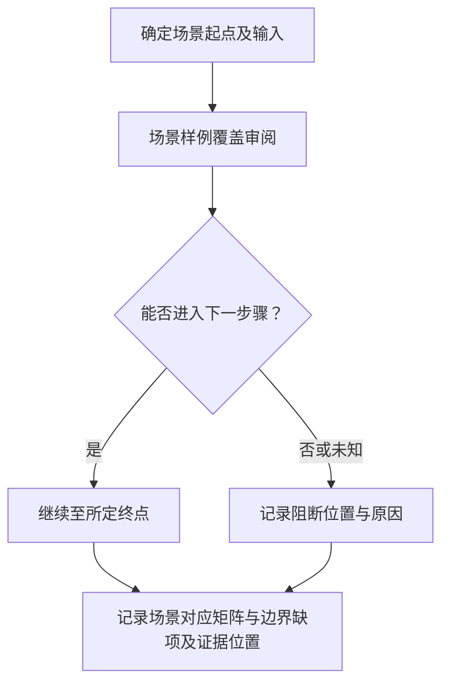


**TRL1-SW-5/C2/P3　人工兜底｜待审核**

这一路线接受本检查点的全部相关材料，也承接其他候选无法处理或结果冲突的情况。评价员先收集可行性报告场景、数据类型、规模范围、排除项，连同已有抽取、计算或查询结果一起阅卷。没有自动结果也可以直接人工核验，不能因此要求补做一遍接口查询。

复核围绕“算法应用范围与项目场景对应”展开。评价员逐项回看原件，确认对象与时间范围，再请相应领域的技术专家解释技术含义。材料保管人协助说明来源、编号和版本。对“场景—输入域交叉校验”、“场景样例覆盖审阅”产生的不同结果，先核各自前提和覆盖范围，再判断是材料冲突还是核验范围不同。

重点检查把演示规模当生产规模。对疑点建立一条待核记录，写清相互矛盾的原文、可能解释和仍缺的依据。能从现有材料解决的，补上定位与理由。需要函询、现场观察或新增试验的，由评价员另行明确对象和范围，本轮不代为执行。

以下假设场景说明复核意见应达到的具体程度：假设算法仅验证单设备而声称多设备融合：标范围扩展未有依据。

复核后形成场景对应矩阵与边界缺项。评价员逐项记录采纳、驳回或暂不能确认，并注明证据范围、复核人和日期。无法取得原始依据时继续保留未知。人工意见也需要说明依据，不能只写“专家认为通过”。

这一路线需要阅卷权限、材料保管人协助及相应领域的技术专家的工时。投入取决于材料数量、疑点复杂度和是否需要补证，当前不预设费用。系统仅协助整理证据位置、意见和修改记录。此前的自动结果保留，便于复查人工修改的原因。

**候选差异**：P1 依赖场景可转换为算法输入约束；P2 依赖有典型及极端场景样例。各路线形成各自范围内的事实，来源一致不能自动视为独立证明。P3 人工兜底始终保留，当前不选定或排列实施优先级。

**假设场景**：假设算法仅验证单设备而声称多设备融合：标范围扩展未有依据。

**异常与边界**：把演示规模当生产规模。正常结果仅对已核对象和范围有效；缺失与明确冲突分列。解析失败、查询超时、权限不足均记执行状态，不转成技术不满足。

**来源与接入状态**：R0（具体查阅日及状态见来源账本）。本检查点未取得真实受评材料，未完成实测。

**待讨论**：允许的范围是否含未来扩展，如何与当前可行性区分？ **用户选择：未选择。**

**4. TRL1-SW-5/C3：整体工作可行性有充分论证**

**核验范围及前提**：可行性报告技术、数据、资源、集成和主要风险论证。输入清单表示该路线所需信息，不将全部文件名变成强制提交项；材料合并承载同一事实时保留页段对应。

**TRL1-SW-5/C3/P1　预算与依赖计算｜待审核**

采用这一路线的前提是：有资源预算、输入规模及关键路径。评价员先从可行性报告技术、数据、资源、集成和主要风险论证中确认本路线可用的证据，标明对象、版本及评价时点。输入不足时，先记录缺少哪项依据。

核算算力/存储/时限等已声明预算。随后，找约束不相容或依赖无来源项。

先把材料中的待核数值定位到原始数据行或参数出处，核对单位、方向、对象版本和适用条件。再按材料中有依据的公式或判据重新计算，同时保留输入、换算和中间结果。判据缺失时可以核算结果，但不能据此判定达标。

报告值与计算值不一致时，先检查舍入、样本选择、统计窗口和单位换算。能够解释的差异保留说明，无法解释的差异交专家复核；不把精度不同直接当作内容造假。

结果整理为可行性结论的依据链、敏感假设。每项结果同时给出原材料位置、使用的字段或记录及处理依据，区分支持、冲突和无法确认。针对局部算法成立被当整体工程可行，保留异常所涉及的具体材料，交 TRL1-SW-5/C3/P3 复核。自动处理不替评价员作本条最终判断。

需公式和工程参数维护。估算不等于运行实绩。这些依赖尚未在本项目完成接入或样本验证，实际费用和工时按授权范围、材料规模另行评估。
**TRL1-SW-5/C3/P2　关键假设证据审阅｜待审核**

采用这一路线的前提是：以文字和前期结果论证整体方案。评价员先从可行性报告技术、数据、资源、集成和主要风险论证中确认本路线可用的证据，标明对象、版本及评价时点。输入不足时，先记录缺少哪项依据。

将整体结论拆为关键假设。随后，检查每项对应验证、先例或推导，列阻断性未知。

先把材料中的结论拆成可核对的主张，逐项摘录其假设、理由、依据和限制。辅助模型只能使用授权材料和已确认的项目背景，返回原文位置、可能反证及无法确定之处；公式和图中的含义需要回看原件。

专家沿“依据是否存在、前提是否适用、推导能否支持主张”的顺序复核。缺少依据时说明缺在哪一步，不凭模型常识补出论证；文字相似、表达流畅和多次生成一致均不作为充分性判据。

结果整理为可行性结论的依据链、敏感假设。每项结果同时给出原材料位置、使用的字段或记录及处理依据，区分支持、冲突和无法确认。针对局部算法成立被当整体工程可行，保留异常所涉及的具体材料，交 TRL1-SW-5/C3/P3 复核。自动处理不替评价员作本条最终判断。

实施需评估模型整理+跨专业专家工时。不可用乐观描述替代证据。这些依赖尚未在本项目完成接入或样本验证，实际费用和工时按授权范围、材料规模另行评估。

**TRL1-SW-5/C3/P3　人工兜底｜待审核**

这一路线接受本检查点的全部相关材料，也承接其他候选无法处理或结果冲突的情况。评价员先收集可行性报告技术、数据、资源、集成和主要风险论证，连同已有抽取、计算或查询结果一起阅卷。没有自动结果也可以直接人工核验，不能因此要求补做一遍接口查询。

复核围绕“整体工作可行性有充分论证”展开。评价员逐项回看原件，确认对象与时间范围，再请相应领域专家解释技术含义。材料保管人协助说明来源、编号和版本。对“预算与依赖计算”、“关键假设证据审阅”产生的不同结果，先核各自前提和覆盖范围，再判断是材料冲突还是核验范围不同。

重点检查局部算法成立被当整体工程可行。对疑点建立一条待核记录，写清相互矛盾的原文、可能解释和仍缺的依据。能从现有材料解决的，补上定位与理由。需要函询、现场观察或新增试验的，由评价员另行明确对象和范围，本轮不代为执行。

以下假设场景说明复核意见应达到的具体程度：假设计算预算充足但数据无法取得：报告技术可行与数据前置未落实分列，专家决定是否需补证。

复核后形成可行性结论的依据链、敏感假设。评价员逐项记录采纳、驳回或暂不能确认，并注明证据范围、复核人和日期。无法取得原始依据时继续保留未知。人工意见也需要说明依据，不能只写“专家认为通过”。

这一路线需要阅卷权限、材料保管人协助及相应领域专家的工时。投入取决于材料数量、疑点复杂度和是否需要补证，当前不预设费用。系统仅协助整理证据位置、意见和修改记录。此前的自动结果保留，便于复查人工修改的原因。

**候选差异**：P1 依赖有资源预算、输入规模及关键路径；P2 依赖以文字和前期结果论证整体方案。各路线形成各自范围内的事实，来源一致不能自动视为独立证明。P3 人工兜底始终保留，当前不选定或排列实施优先级。

**假设场景**：假设计算预算充足但数据无法取得：报告技术可行与数据前置未落实分列，专家决定是否需补证。

**异常与边界**：局部算法成立被当整体工程可行。正常结果仅对已核对象和范围有效；缺失与明确冲突分列。解析失败、查询超时、权限不足均记执行状态，不转成技术不满足。

**来源与接入状态**：R0（具体查阅日及状态见来源账本）。本检查点未取得真实受评材料，未完成实测。

**待讨论**：整体可行性应包括哪些非技术约束，哪些仅为风险提示？ **用户选择：未选择。**

**本条材料组合与结果汇总草案**
三个主张可由同一报告支持，候选 AND 但允许定性论证；仅“可行”结论句不能代替依据。

**对现有项目的 PRD 影响**
增加算法版本、可行性假设与风险卡，保存所用估算参数及专家接受理由。 记录绑定 CheckItem 快照、EvidenceFile 及其哈希，展示本条检查点与原文位置；复核采纳/覆盖理由进入 AuditLog。报告只引用已被评价员采纳的事实及其范围，不能由流程门禁推导技术满足。

**讨论状态与记录**
研究进度：方案已列齐；用户决策：待审核；已明确用户意见：连续研究、保留人工、不代选、不开发。各检查点具体方案无已确认选择。待决问题见各 C 项。本轮修改：2026-10-06，依据原表与来源账本展开候选；2026-10-07 统一质检。编号沿革见附录，未将历史用户决定转移至新方案。

### TRL2-HW-1　方案已列齐／待审核

**原表位置**：Sheet1!C15（原序号 1），条件 E15，材料 F15。

**条件原文**：
> 有明确的目标和指标要求、初步实施方案；明确研究技术的基本要素及构成特性

**支撑材料原文**：
> 技术分析文档、实施方案、项目任务书

**规则解释与差异**：复合条款含目标指标、初步实施方案、构成特性，三者不可压成单次 AI 评分。
与读取分支种子条件、材料文字一致（忽略空白）。

**1. 事实检查点拆解**

|编号|核验事实及原文对应|输入和触发范围|输出与可追溯证据|
|---|---|---|---|
|C1|目标与指标要求明确|本条申报该事实时；任务书目标和指标表、技术分析文档|目标—指标表、原文及缺项|
|C2|初步实施方案支持目标|本条申报该事实时；实施方案工作包、方法、资源和关键依赖|实施路径图的节点记录及缺口|
|C3|基本要素及构成特性明确|本条申报该事实时；技术分析中的组成、物理接口、工作机理|要素—特性—接口矩阵|

**2. TRL2-HW-1/C1：目标与指标要求明确**

**核验范围及前提**：任务书目标和指标表、技术分析文档。输入清单表示该路线所需信息，不将全部文件名变成强制提交项；材料合并承载同一事实时保留页段对应。

**TRL2-HW-1/C1/P1　指标契约校验｜待审核**

采用这一路线的前提是：存在指标清单。评价员先从任务书目标和指标表、技术分析文档中确认本路线可用的证据，标明对象、版本及评价时点。输入不足时，先记录缺少哪项依据。

提取指标对象、量纲、方向、目标值及条件，核对目标与指标映射和矛盾。

先从已有依据中取得本检查点的适用清单，并保留每项的来源位置。将清单逐项对应到材料中的实现、安排或验证证据；一个附件覆盖多项时，分别标出支持各项的具体内容。

没有对应证据的条目列为缺项，材料明确排除的条目同时保留排除依据。自动匹配只生成对应候选，专家仍需判断证据能否回答该项事实；链接存在或清单数量相同均不能替代覆盖判断。

结果整理为目标—指标表、原文及缺项。每项结果同时给出原材料位置、使用的字段或记录及处理依据，区分支持、冲突和无法确认。针对“高精度”无定义或混用最大/平均误差，保留异常所涉及的具体材料，交 TRL2-HW-1/C1/P3 复核。自动处理不替评价员作本条最终判断。

需解析/单位维护。无阈值不补行业默认值。这些依赖尚未在本项目完成接入或样本验证，实际费用和工时按授权范围、材料规模另行评估。
**TRL2-HW-1/C1/P2　需求论证审阅｜待审核**

采用这一路线的前提是：目标以自然语言表达。评价员先从任务书目标和指标表、技术分析文档中确认本路线可用的证据，标明对象、版本及评价时点。输入不足时，先记录缺少哪项依据。

将目标转成可观察主张并回查原句，模型列不可测或遗漏条件供专家确认。

先把材料中的结论拆成可核对的主张，逐项摘录其假设、理由、依据和限制。辅助模型只能使用授权材料和已确认的项目背景，返回原文位置、可能反证及无法确定之处；公式和图中的含义需要回看原件。

专家沿“依据是否存在、前提是否适用、推导能否支持主张”的顺序复核。缺少依据时说明缺在哪一步，不凭模型常识补出论证；文字相似、表达流畅和多次生成一致均不作为充分性判据。

结果整理为目标—指标表、原文及缺项。每项结果同时给出原材料位置、使用的字段或记录及处理依据，区分支持、冲突和无法确认。针对“高精度”无定义或混用最大/平均误差，保留异常所涉及的具体材料，交 TRL2-HW-1/C1/P3 复核。自动处理不替评价员作本条最终判断。

实施需评估模型与专家工时。形式可测不证明目标合理。这些依赖尚未在本项目完成接入或样本验证，实际费用和工时按授权范围、材料规模另行评估。

**TRL2-HW-1/C1/P3　人工兜底｜待审核**

这一路线接受本检查点的全部相关材料，也承接其他候选无法处理或结果冲突的情况。评价员先收集任务书目标和指标表、技术分析文档，连同已有抽取、计算或查询结果一起阅卷。没有自动结果也可以直接人工核验，不能因此要求补做一遍接口查询。

复核围绕“目标与指标要求明确”展开。评价员逐项回看原件，确认对象与时间范围，再请相应领域专家解释技术含义。材料保管人协助说明来源、编号和版本。对“指标契约校验”、“需求论证审阅”产生的不同结果，先核各自前提和覆盖范围，再判断是材料冲突还是核验范围不同。

重点检查“高精度”无定义或混用最大/平均误差。对疑点建立一条待核记录，写清相互矛盾的原文、可能解释和仍缺的依据。能从现有材料解决的，补上定位与理由。需要函询、现场观察或新增试验的，由评价员另行明确对象和范围，本轮不代为执行。

以下假设场景说明复核意见应达到的具体程度：假设目标为误差≤1% 而指标表写绝对误差 1：系统标口径冲突，请专家明确分母。

复核后形成目标—指标表、原文及缺项。评价员逐项记录采纳、驳回或暂不能确认，并注明证据范围、复核人和日期。无法取得原始依据时继续保留未知。人工意见也需要说明依据，不能只写“专家认为通过”。

这一路线需要阅卷权限、材料保管人协助及相应领域专家的工时。投入取决于材料数量、疑点复杂度和是否需要补证，当前不预设费用。系统仅协助整理证据位置、意见和修改记录。此前的自动结果保留，便于复查人工修改的原因。

**候选差异**：P1 依赖存在指标清单；P2 依赖目标以自然语言表达。各路线形成各自范围内的事实，来源一致不能自动视为独立证明。P3 人工兜底始终保留，当前不选定或排列实施优先级。

**假设场景**：假设目标为误差≤1% 而指标表写绝对误差 1：系统标口径冲突，请专家明确分母。

**异常与边界**：“高精度”无定义或混用最大/平均误差。正常结果仅对已核对象和范围有效；缺失与明确冲突分列。解析失败、查询超时、权限不足均记执行状态，不转成技术不满足。

**来源与接入状态**：R0（具体查阅日及状态见来源账本）。本检查点未取得真实受评材料，未完成实测。

**待讨论**：指标至少需要哪些字段，定性目标如何留待确认？ **用户选择：未选择。**

**3. TRL2-HW-1/C2：初步实施方案支持目标**

**核验范围及前提**：实施方案工作包、方法、资源和关键依赖。输入清单表示该路线所需信息，不将全部文件名变成强制提交项；材料合并承载同一事实时保留页段对应。

**TRL2-HW-1/C2/P1　计划关联核对｜待审核**

采用这一路线的前提是：有任务与目标对应。评价员先从实施方案工作包、方法、资源和关键依赖中确认本路线可用的证据，标明对象、版本及评价时点。输入不足时，先记录缺少哪项依据。

按工作包关联指标，检查无落实路径的目标和缺输入的任务。

先确定材料中需要对应的对象及字段，把原始值和规范化值分开保存。按已有编号或明确引用建立关系，再逐项比较含义、范围与上下文；名称相近或字段同名时仍需确认其实际所指。

对无法对应和互相矛盾的项，返回两侧原始位置及差异说明。未声明的字段保持未知，不根据常用模板补齐；评价员确认对应关系后，结果仍只覆盖已经核对的对象。

结果整理为实施路径图的节点记录及缺口。每项结果同时给出原材料位置、使用的字段或记录及处理依据，区分支持、冲突和无法确认。针对计划只有日期没有方法，保留异常所涉及的具体材料，交 TRL2-HW-1/C2/P3 复核。自动处理不替评价员作本条最终判断。

实施需评估映射维护成本。本级不要求执行记录。这些依赖尚未在本项目完成接入或样本验证，实际费用和工时按授权范围、材料规模另行评估。
**TRL2-HW-1/C2/P2　可行路径审阅｜待审核**

采用这一路线的前提是：方案以技术叙述呈现。评价员先从实施方案工作包、方法、资源和关键依赖中确认本路线可用的证据，标明对象、版本及评价时点。输入不足时，先记录缺少哪项依据。

提取输入—过程—输出链，核对关键假设和技术分析依据，标跳步。

先选取材料已经声明的场景，写明起点、输入、参与角色和预期终点。沿现有步骤逐步推演，在每次交接处核对前一步产出能否满足下一步前提；无法继续时停在具体步骤，记录所缺信息。

正常过程与材料涉及的异常过程分别记录。推演只说明设计或安排能否被理解和执行；如需观察实物、运行软件或新增试验，另行形成执行范围，本轮不把推演结果写成已发生的运行事实。

结果整理为实施路径图的节点记录及缺口。每项结果同时给出原材料位置、使用的字段或记录及处理依据，区分支持、冲突和无法确认。针对计划只有日期没有方法，保留异常所涉及的具体材料，交 TRL2-HW-1/C2/P3 复核。自动处理不替评价员作本条最终判断。

实施需评估领域专家/模型工时。不能因方案未详设即否定。这些依赖尚未在本项目完成接入或样本验证，实际费用和工时按授权范围、材料规模另行评估。


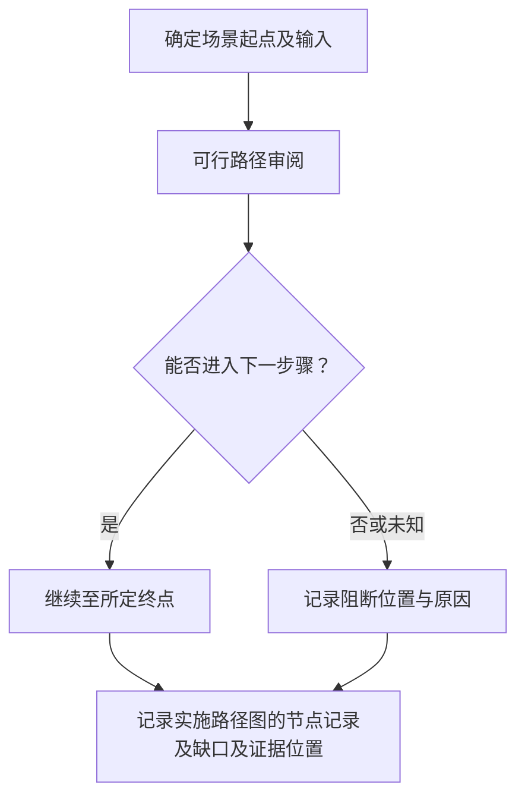


**TRL2-HW-1/C2/P3　人工兜底｜待审核**

这一路线接受本检查点的全部相关材料，也承接其他候选无法处理或结果冲突的情况。评价员先收集实施方案工作包、方法、资源和关键依赖，连同已有抽取、计算或查询结果一起阅卷。没有自动结果也可以直接人工核验，不能因此要求补做一遍接口查询。

复核围绕“初步实施方案支持目标”展开。评价员逐项回看原件，确认对象与时间范围，再请相应领域专家解释技术含义。材料保管人协助说明来源、编号和版本。对“计划关联核对”、“可行路径审阅”产生的不同结果，先核各自前提和覆盖范围，再判断是材料冲突还是核验范围不同。

重点检查计划只有日期没有方法。对疑点建立一条待核记录，写清相互矛盾的原文、可能解释和仍缺的依据。能从现有材料解决的，补上定位与理由。需要函询、现场观察或新增试验的，由评价员另行明确对象和范围，本轮不代为执行。

以下假设场景说明复核意见应达到的具体程度：假设要耐高温但方案未含材料/结构路径：列目标无实施依据，专家可接受后续研究安排或要求说明。

复核后形成实施路径图的节点记录及缺口。评价员逐项记录采纳、驳回或暂不能确认，并注明证据范围、复核人和日期。无法取得原始依据时继续保留未知。人工意见也需要说明依据，不能只写“专家认为通过”。

这一路线需要阅卷权限、材料保管人协助及相应领域专家的工时。投入取决于材料数量、疑点复杂度和是否需要补证，当前不预设费用。系统仅协助整理证据位置、意见和修改记录。此前的自动结果保留，便于复查人工修改的原因。

**候选差异**：P1 依赖有任务与目标对应；P2 依赖方案以技术叙述呈现。各路线形成各自范围内的事实，来源一致不能自动视为独立证明。P3 人工兜底始终保留，当前不选定或排列实施优先级。

**假设场景**：假设要耐高温但方案未含材料/结构路径：列目标无实施依据，专家可接受后续研究安排或要求说明。

**异常与边界**：计划只有日期没有方法。正常结果仅对已核对象和范围有效；缺失与明确冲突分列。解析失败、查询超时、权限不足均记执行状态，不转成技术不满足。

**来源与接入状态**：R0（具体查阅日及状态见来源账本）。本检查点未取得真实受评材料，未完成实测。

**待讨论**：初步方案与 TRL3 完善方案的审查深度如何区分？ **用户选择：未选择。**

**4. TRL2-HW-1/C3：基本要素及构成特性明确**

**核验范围及前提**：技术分析中的组成、物理接口、工作机理。输入清单表示该路线所需信息，不将全部文件名变成强制提交项；材料合并承载同一事实时保留页段对应。

**TRL2-HW-1/C3/P1　组成关系一致性｜待审核**

采用这一路线的前提是：有模块表和框图。评价员先从技术分析中的组成、物理接口、工作机理中确认本路线可用的证据，标明对象、版本及评价时点。输入不足时，先记录缺少哪项依据。

核对模块名称、接口和组成层次，找孤立项及规格冲突。

先确定材料中需要对应的对象及字段，把原始值和规范化值分开保存。按已有编号或明确引用建立关系，再逐项比较含义、范围与上下文；名称相近或字段同名时仍需确认其实际所指。

对无法对应和互相矛盾的项，返回两侧原始位置及差异说明。未声明的字段保持未知，不根据常用模板补齐；评价员确认对应关系后，结果仍只覆盖已经核对的对象。

结果整理为要素—特性—接口矩阵。每项结果同时给出原材料位置、使用的字段或记录及处理依据，区分支持、冲突和无法确认。针对把采购清单等同原理要素，保留异常所涉及的具体材料，交 TRL2-HW-1/C3/P3 复核。自动处理不替评价员作本条最终判断。

实施需评估图文解析成本。无法读图时补可读清单。这些依赖尚未在本项目完成接入或样本验证，实际费用和工时按授权范围、材料规模另行评估。
**TRL2-HW-1/C3/P2　机理分解审核｜待审核**

采用这一路线的前提是：有结构图与功能叙述。评价员先从技术分析中的组成、物理接口、工作机理中确认本路线可用的证据，标明对象、版本及评价时点。输入不足时，先记录缺少哪项依据。

按能量/物料/信号流追踪要素作用，专家确认关键要素是否被遗漏。

先把材料中的结论拆成可核对的主张，逐项摘录其假设、理由、依据和限制。辅助模型只能使用授权材料和已确认的项目背景，返回原文位置、可能反证及无法确定之处；公式和图中的含义需要回看原件。

专家沿“依据是否存在、前提是否适用、推导能否支持主张”的顺序复核。缺少依据时说明缺在哪一步，不凭模型常识补出论证；文字相似、表达流畅和多次生成一致均不作为充分性判据。

结果整理为要素—特性—接口矩阵。每项结果同时给出原材料位置、使用的字段或记录及处理依据，区分支持、冲突和无法确认。针对把采购清单等同原理要素，保留异常所涉及的具体材料，交 TRL2-HW-1/C3/P3 复核。自动处理不替评价员作本条最终判断。

需要领域解释。自动仅整理关系和疑点。这些依赖尚未在本项目完成接入或样本验证，实际费用和工时按授权范围、材料规模另行评估。

**TRL2-HW-1/C3/P3　人工兜底｜待审核**

这一路线接受本检查点的全部相关材料，也承接其他候选无法处理或结果冲突的情况。评价员先收集技术分析中的组成、物理接口、工作机理，连同已有抽取、计算或查询结果一起阅卷。没有自动结果也可以直接人工核验，不能因此要求补做一遍接口查询。

复核围绕“基本要素及构成特性明确”展开。评价员逐项回看原件，确认对象与时间范围，再请相应领域专家解释技术含义。材料保管人协助说明来源、编号和版本。对“组成关系一致性”、“机理分解审核”产生的不同结果，先核各自前提和覆盖范围，再判断是材料冲突还是核验范围不同。

重点检查把采购清单等同原理要素。对疑点建立一条待核记录，写清相互矛盾的原文、可能解释和仍缺的依据。能从现有材料解决的，补上定位与理由。需要函询、现场观察或新增试验的，由评价员另行明确对象和范围，本轮不代为执行。

以下假设场景说明复核意见应达到的具体程度：假设光学检测方案框图有光源而文字未说明波段：标构成特性未明，不自动填波段。

复核后形成要素—特性—接口矩阵。评价员逐项记录采纳、驳回或暂不能确认，并注明证据范围、复核人和日期。无法取得原始依据时继续保留未知。人工意见也需要说明依据，不能只写“专家认为通过”。

这一路线需要阅卷权限、材料保管人协助及相应领域专家的工时。投入取决于材料数量、疑点复杂度和是否需要补证，当前不预设费用。系统仅协助整理证据位置、意见和修改记录。此前的自动结果保留，便于复查人工修改的原因。

**候选差异**：P1 依赖有模块表和框图；P2 依赖有结构图与功能叙述。各路线形成各自范围内的事实，来源一致不能自动视为独立证明。P3 人工兜底始终保留，当前不选定或排列实施优先级。

**假设场景**：假设光学检测方案框图有光源而文字未说明波段：标构成特性未明，不自动填波段。

**异常与边界**：把采购清单等同原理要素。正常结果仅对已核对象和范围有效；缺失与明确冲突分列。解析失败、查询超时、权限不足均记执行状态，不转成技术不满足。

**来源与接入状态**：R0（具体查阅日及状态见来源账本）。本检查点未取得真实受评材料，未完成实测。

**待讨论**：基本要素粒度到子系统还是部件？ **用户选择：未选择。**

**本条材料组合与结果汇总草案**
三类事实候选 AND；材料名可合并承载，技术分析文档/方案/任务书是否要求独立三份待定；不同版本冲突先解版本。

**对现有项目的 PRD 影响**
新增目标与组件标识，显示跨文档差异和方案成熟度，不与后续试验通过混淆。 记录绑定 CheckItem 快照、EvidenceFile 及其哈希，展示本条检查点与原文位置；复核采纳/覆盖理由进入 AuditLog。报告只引用已被评价员采纳的事实及其范围，不能由流程门禁推导技术满足。

**讨论状态与记录**
研究进度：方案已列齐；用户决策：待审核；已明确用户意见：连续研究、保留人工、不代选、不开发。各检查点具体方案无已确认选择。待决问题见各 C 项。本轮修改：2026-10-06，依据原表与来源账本展开候选；2026-10-07 统一质检。编号沿革见附录，未将历史用户决定转移至新方案。

### TRL2-HW-2　方案已列齐／待审核

**原表位置**：Sheet1!C16（原序号 2），条件 E16，材料 F16。

**条件原文**：
> 初步明确技术可实现的主要功能

**支撑材料原文**：
> 项目任务书

**规则解释与差异**：“初步明确”指功能与技术路径已可识别，不提前要求实物或完成测试。
与读取分支种子条件、材料文字一致（忽略空白）。

**1. 事实检查点拆解**

|编号|核验事实及原文对应|输入和触发范围|输出与可追溯证据|
|---|---|---|---|
|C1|主要功能被清楚定义|本条申报该事实时；任务书功能、用户任务与输入输出|功能清单、任务关联及页段|
|C2|声称可实现的功能具有技术依据|本条申报该事实时；任务书功能清单、技术路线和原理引用|功能可行依据与条件矩阵|

**2. TRL2-HW-2/C1：主要功能被清楚定义**

**核验范围及前提**：任务书功能、用户任务与输入输出。输入清单表示该路线所需信息，不将全部文件名变成强制提交项；材料合并承载同一事实时保留页段对应。

**TRL2-HW-2/C1/P1　功能结构提取｜待审核**

采用这一路线的前提是：功能可编号。评价员先从任务书功能、用户任务与输入输出中确认本路线可用的证据，标明对象、版本及评价时点。输入不足时，先记录缺少哪项依据。

提取触发、输入、处理结果和异常边界，关联用户任务，列未定义输出。

先确定材料中需要对应的对象及字段，把原始值和规范化值分开保存。按已有编号或明确引用建立关系，再逐项比较含义、范围与上下文；名称相近或字段同名时仍需确认其实际所指。

对无法对应和互相矛盾的项，返回两侧原始位置及差异说明。未声明的字段保持未知，不根据常用模板补齐；评价员确认对应关系后，结果仍只覆盖已经核对的对象。

结果整理为功能清单、任务关联及页段。每项结果同时给出原材料位置、使用的字段或记录及处理依据，区分支持、冲突和无法确认。针对将性能数值当功能、无异常边界，保留异常所涉及的具体材料，交 TRL2-HW-2/C1/P3 复核。自动处理不替评价员作本条最终判断。

实施需评估解析和表单维护。不要求本级已有实现。这些依赖尚未在本项目完成接入或样本验证，实际费用和工时按授权范围、材料规模另行评估。
**TRL2-HW-2/C1/P2　场景推演审阅｜待审核**

采用这一路线的前提是：功能以场景叙述。评价员先从任务书功能、用户任务与输入输出中确认本路线可用的证据，标明对象、版本及评价时点。输入不足时，先记录缺少哪项依据。

沿正常/异常任务追踪功能，核对每一步有没有描述并生成疑问。

先选取材料已经声明的场景，写明起点、输入、参与角色和预期终点。沿现有步骤逐步推演，在每次交接处核对前一步产出能否满足下一步前提；无法继续时停在具体步骤，记录所缺信息。

正常过程与材料涉及的异常过程分别记录。推演只说明设计或安排能否被理解和执行；如需观察实物、运行软件或新增试验，另行形成执行范围，本轮不把推演结果写成已发生的运行事实。

结果整理为功能清单、任务关联及页段。每项结果同时给出原材料位置、使用的字段或记录及处理依据，区分支持、冲突和无法确认。针对将性能数值当功能、无异常边界，保留异常所涉及的具体材料，交 TRL2-HW-2/C1/P3 复核。自动处理不替评价员作本条最终判断。

实施需评估模型及领域工时。场景不是完整功能集。这些依赖尚未在本项目完成接入或样本验证，实际费用和工时按授权范围、材料规模另行评估。


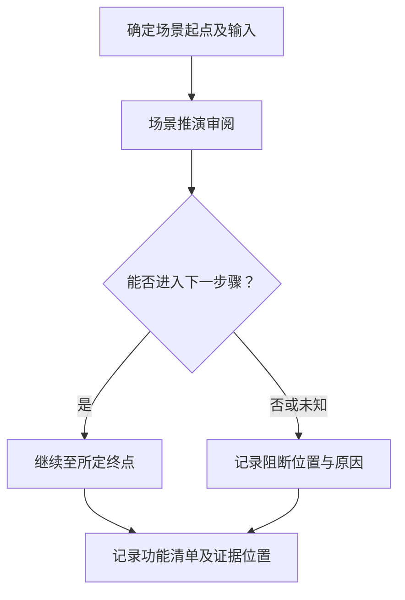


**TRL2-HW-2/C1/P3　人工兜底｜待审核**

这一路线接受本检查点的全部相关材料，也承接其他候选无法处理或结果冲突的情况。评价员先收集任务书功能、用户任务与输入输出，连同已有抽取、计算或查询结果一起阅卷。没有自动结果也可以直接人工核验，不能因此要求补做一遍接口查询。

复核围绕“主要功能被清楚定义”展开。评价员逐项回看原件，确认对象与时间范围，再请相应领域专家解释技术含义。材料保管人协助说明来源、编号和版本。对“功能结构提取”、“场景推演审阅”产生的不同结果，先核各自前提和覆盖范围，再判断是材料冲突还是核验范围不同。

重点检查将性能数值当功能、无异常边界。对疑点建立一条待核记录，写清相互矛盾的原文、可能解释和仍缺的依据。能从现有材料解决的，补上定位与理由。需要函询、现场观察或新增试验的，由评价员另行明确对象和范围，本轮不代为执行。

以下假设场景说明复核意见应达到的具体程度：假设只说“自动检测”，输出类型未定：系统提示需定义结果对象。

复核后形成功能清单、任务关联及页段。评价员逐项记录采纳、驳回或暂不能确认，并注明证据范围、复核人和日期。无法取得原始依据时继续保留未知。人工意见也需要说明依据，不能只写“专家认为通过”。

这一路线需要阅卷权限、材料保管人协助及相应领域专家的工时。投入取决于材料数量、疑点复杂度和是否需要补证，当前不预设费用。系统仅协助整理证据位置、意见和修改记录。此前的自动结果保留，便于复查人工修改的原因。

**候选差异**：P1 依赖功能可编号；P2 依赖功能以场景叙述。各路线形成各自范围内的事实，来源一致不能自动视为独立证明。P3 人工兜底始终保留，当前不选定或排列实施优先级。

**假设场景**：假设只说“自动检测”，输出类型未定：系统提示需定义结果对象。

**异常与边界**：将性能数值当功能、无异常边界。正常结果仅对已核对象和范围有效；缺失与明确冲突分列。解析失败、查询超时、权限不足均记执行状态，不转成技术不满足。

**来源与接入状态**：R0（具体查阅日及状态见来源账本）。本检查点未取得真实受评材料，未完成实测。

**待讨论**：“主要”功能的范围由谁确认？ **用户选择：未选择。**

**3. TRL2-HW-2/C2：声称可实现的功能具有技术依据**

**核验范围及前提**：任务书功能清单、技术路线和原理引用。输入清单表示该路线所需信息，不将全部文件名变成强制提交项；材料合并承载同一事实时保留页段对应。

**TRL2-HW-2/C2/P1　功能—技术要素匹配｜待审核**

采用这一路线的前提是：已明确要素。评价员先从任务书功能清单、技术路线和原理引用中确认本路线可用的证据，标明对象、版本及评价时点。输入不足时，先记录缺少哪项依据。

逐功能关联部件/机理和输入条件，检查缺依赖或物理不兼容。

先确定材料中需要对应的对象及字段，把原始值和规范化值分开保存。按已有编号或明确引用建立关系，再逐项比较含义、范围与上下文；名称相近或字段同名时仍需确认其实际所指。

对无法对应和互相矛盾的项，返回两侧原始位置及差异说明。未声明的字段保持未知，不根据常用模板补齐；评价员确认对应关系后，结果仍只覆盖已经核对的对象。

结果整理为功能可行依据与条件矩阵。每项结果同时给出原材料位置、使用的字段或记录及处理依据，区分支持、冲突和无法确认。针对用未来设想当既有事实，保留异常所涉及的具体材料，交 TRL2-HW-2/C2/P3 复核。自动处理不替评价员作本条最终判断。

实施需评估规则维护工时。匹配不等于实现验证。这些依赖尚未在本项目完成接入或样本验证，实际费用和工时按授权范围、材料规模另行评估。
**TRL2-HW-2/C2/P2　原理证据审阅｜待审核**

采用这一路线的前提是：有理论或前期研究依据。评价员先从任务书功能清单、技术路线和原理引用中确认本路线可用的证据，标明对象、版本及评价时点。输入不足时，先记录缺少哪项依据。

核对每个可实现主张的推导/引用及限制，列超出证据范围处。

先把材料中的结论拆成可核对的主张，逐项摘录其假设、理由、依据和限制。辅助模型只能使用授权材料和已确认的项目背景，返回原文位置、可能反证及无法确定之处；公式和图中的含义需要回看原件。

专家沿“依据是否存在、前提是否适用、推导能否支持主张”的顺序复核。缺少依据时说明缺在哪一步，不凭模型常识补出论证；文字相似、表达流畅和多次生成一致均不作为充分性判据。

结果整理为功能可行依据与条件矩阵。每项结果同时给出原材料位置、使用的字段或记录及处理依据，区分支持、冲突和无法确认。针对用未来设想当既有事实，保留异常所涉及的具体材料，交 TRL2-HW-2/C2/P3 复核。自动处理不替评价员作本条最终判断。

实施需评估专家工时。不增加 TRL3 试验门槛。这些依赖尚未在本项目完成接入或样本验证，实际费用和工时按授权范围、材料规模另行评估。

**TRL2-HW-2/C2/P3　人工兜底｜待审核**

这一路线接受本检查点的全部相关材料，也承接其他候选无法处理或结果冲突的情况。评价员先收集任务书功能清单、技术路线和原理引用，连同已有抽取、计算或查询结果一起阅卷。没有自动结果也可以直接人工核验，不能因此要求补做一遍接口查询。

复核围绕“声称可实现的功能具有技术依据”展开。评价员逐项回看原件，确认对象与时间范围，再请相应领域的技术专家解释技术含义。材料保管人协助说明来源、编号和版本。对“功能—技术要素匹配”、“原理证据审阅”产生的不同结果，先核各自前提和覆盖范围，再判断是材料冲突还是核验范围不同。

重点检查用未来设想当既有事实。对疑点建立一条待核记录，写清相互矛盾的原文、可能解释和仍缺的依据。能从现有材料解决的，补上定位与理由。需要函询、现场观察或新增试验的，由评价员另行明确对象和范围，本轮不代为执行。

以下假设场景说明复核意见应达到的具体程度：假设任务书引用单通道机理支撑多通道：指出额外耦合假设需解释。

复核后形成功能可行依据与条件矩阵。评价员逐项记录采纳、驳回或暂不能确认，并注明证据范围、复核人和日期。无法取得原始依据时继续保留未知。人工意见也需要说明依据，不能只写“专家认为通过”。

这一路线需要阅卷权限、材料保管人协助及相应领域的技术专家的工时。投入取决于材料数量、疑点复杂度和是否需要补证，当前不预设费用。系统仅协助整理证据位置、意见和修改记录。此前的自动结果保留，便于复查人工修改的原因。

**候选差异**：P1 依赖已明确要素；P2 依赖有理论或前期研究依据。各路线形成各自范围内的事实，来源一致不能自动视为独立证明。P3 人工兜底始终保留，当前不选定或排列实施优先级。

**假设场景**：假设任务书引用单通道机理支撑多通道：指出额外耦合假设需解释。

**异常与边界**：用未来设想当既有事实。正常结果仅对已核对象和范围有效；缺失与明确冲突分列。解析失败、查询超时、权限不足均记执行状态，不转成技术不满足。

**来源与接入状态**：R0（具体查阅日及状态见来源账本）。本检查点未取得真实受评材料，未完成实测。

**待讨论**：此级功能可行性允许何种理论证据？ **用户选择：未选择。**

**本条材料组合与结果汇总草案**
定义及技术依据共同支持本条；缺少细化异常流是否阻碍明确性待审，不机械要求全功能规格书。

**对现有项目的 PRD 影响**
功能卡记录初步/已确认范围，关联后续试验时使用稳定功能 ID。 记录绑定 CheckItem 快照、EvidenceFile 及其哈希，展示本条检查点与原文位置；复核采纳/覆盖理由进入 AuditLog。报告只引用已被评价员采纳的事实及其范围，不能由流程门禁推导技术满足。

**讨论状态与记录**
研究进度：方案已列齐；用户决策：待审核；已明确用户意见：连续研究、保留人工、不代选、不开发。各检查点具体方案无已确认选择。待决问题见各 C 项。本轮修改：2026-10-06，依据原表与来源账本展开候选；2026-10-07 统一质检。编号沿革见附录，未将历史用户决定转移至新方案。

### TRL2-HW-3　方案已列齐／待审核

**原表位置**：Sheet1!C17（原序号 3），条件 E17，材料 F17。

**条件原文**：
> 明确产品预期应用环境

**支撑材料原文**：
> 项目任务书、环境分析文档

**规则解释与差异**：环境描述是预期条件，不是已经在该环境试验通过。
与读取分支种子条件、材料文字一致（忽略空白）。

**1. 事实检查点拆解**

|编号|核验事实及原文对应|输入和触发范围|输出与可追溯证据|
|---|---|---|---|
|C1|预期应用环境已定义|本条申报该事实时；任务书、环境分析的地点场景和温湿振动等相关因素|环境包络及来源位置|
|C2|环境范围来源与产品对象相符|本条申报该事实时；预期用户工况资料、部署条件、型号用途|环境范围证据和标准适用差异|

**2. TRL2-HW-3/C1：预期应用环境已定义**

**核验范围及前提**：任务书、环境分析的地点场景和温湿振动等相关因素。输入清单表示该路线所需信息，不将全部文件名变成强制提交项；材料合并承载同一事实时保留页段对应。

**TRL2-HW-3/C1/P1　环境参数表核对｜待审核**

采用这一路线的前提是：已有环境清单。评价员先从任务书、环境分析的地点场景和温湿振动等相关因素中确认本路线可用的证据，标明对象、版本及评价时点。输入不足时，先记录缺少哪项依据。

提取因素、范围、单位、持续时间和组合条件，核对任务书与分析文档一致。

先从任务书和环境分析中分别提取适用的环境因素，记录运行、运输或存储等阶段。将范围、单位、持续时间与组合条件逐项对应，缺少上下限或单位时指向具体原句。

本条核对预期环境的定义，不要求已经取得运行日志。多个环境因素之间存在同时作用或互斥条件时，保留组合关系；不能把某产品不涉及的因素也强制列为缺项。

结果整理为环境包络及来源位置。每项结果同时给出原材料位置、使用的字段或记录及处理依据，区分支持、冲突和无法确认。针对存储运输与运行工况混淆，保留异常所涉及的具体材料，交 TRL2-HW-3/C1/P3 复核。自动处理不替评价员作本条最终判断。

实施需评估维护参数字典。不把全部环境因素强加所有产品。这些依赖尚未在本项目完成接入或样本验证，实际费用和工时按授权范围、材料规模另行评估。
**TRL2-HW-3/C1/P2　场景到环境分析｜待审核**

采用这一路线的前提是：有典型部署描述。评价员先从任务书、环境分析的地点场景和温湿振动等相关因素中确认本路线可用的证据，标明对象、版本及评价时点。输入不足时，先记录缺少哪项依据。

从运输/安装/使用场景提取暴露条件，专家核相关性与遗漏。

先把材料中的结论拆成可核对的主张，逐项摘录其假设、理由、依据和限制。辅助模型只能使用授权材料和已确认的项目背景，返回原文位置、可能反证及无法确定之处；公式和图中的含义需要回看原件。

专家沿“依据是否存在、前提是否适用、推导能否支持主张”的顺序复核。缺少依据时说明缺在哪一步，不凭模型常识补出论证；文字相似、表达流畅和多次生成一致均不作为充分性判据。

结果整理为环境包络及来源位置。每项结果同时给出原材料位置、使用的字段或记录及处理依据，区分支持、冲突和无法确认。针对存储运输与运行工况混淆，保留异常所涉及的具体材料，交 TRL2-HW-3/C1/P3 复核。自动处理不替评价员作本条最终判断。

实施需评估场景分析工时。模型不能凭行业常识生成有效门槛。这些依赖尚未在本项目完成接入或样本验证，实际费用和工时按授权范围、材料规模另行评估。

**TRL2-HW-3/C1/P3　人工兜底｜待审核**

这一路线接受本检查点的全部相关材料，也承接其他候选无法处理或结果冲突的情况。评价员先收集任务书、环境分析的地点场景和温湿振动等相关因素，连同已有抽取、计算或查询结果一起阅卷。没有自动结果也可以直接人工核验，不能因此要求补做一遍接口查询。

复核围绕“预期应用环境已定义”展开。评价员逐项回看原件，确认对象与时间范围，再请相应领域专家解释技术含义。材料保管人协助说明来源、编号和版本。对“环境参数表核对”、“场景到环境分析”产生的不同结果，先核各自前提和覆盖范围，再判断是材料冲突还是核验范围不同。

重点检查存储运输与运行工况混淆。对疑点建立一条待核记录，写清相互矛盾的原文、可能解释和仍缺的依据。能从现有材料解决的，补上定位与理由。需要函询、现场观察或新增试验的，由评价员另行明确对象和范围，本轮不代为执行。

以下假设场景说明复核意见应达到的具体程度：假设任务书室内而环境分析含户外淋雨：并列冲突，请确认场景。

复核后形成环境包络及来源位置。评价员逐项记录采纳、驳回或暂不能确认，并注明证据范围、复核人和日期。无法取得原始依据时继续保留未知。人工意见也需要说明依据，不能只写“专家认为通过”。

这一路线需要阅卷权限、材料保管人协助及相应领域专家的工时。投入取决于材料数量、疑点复杂度和是否需要补证，当前不预设费用。系统仅协助整理证据位置、意见和修改记录。此前的自动结果保留，便于复查人工修改的原因。

**候选差异**：P1 依赖已有环境清单；P2 依赖有典型部署描述。各路线形成各自范围内的事实，来源一致不能自动视为独立证明。P3 人工兜底始终保留，当前不选定或排列实施优先级。

**假设场景**：假设任务书室内而环境分析含户外淋雨：并列冲突，请确认场景。

**异常与边界**：存储运输与运行工况混淆。正常结果仅对已核对象和范围有效；缺失与明确冲突分列。解析失败、查询超时、权限不足均记执行状态，不转成技术不满足。

**来源与接入状态**：R0（具体查阅日及状态见来源账本）。本检查点未取得真实受评材料，未完成实测。

**待讨论**：需覆盖使用之外的运输和储存吗？ **用户选择：未选择。**

**3. TRL2-HW-3/C2：环境范围来源与产品对象相符**

**核验范围及前提**：预期用户工况资料、部署条件、型号用途。输入清单表示该路线所需信息，不将全部文件名变成强制提交项；材料合并承载同一事实时保留页段对应。

**TRL2-HW-3/C2/P1　需求源交叉比对｜待审核**

采用这一路线的前提是：有用户工况或任务要求。评价员先从预期用户工况资料、部署条件、型号用途中确认本路线可用的证据，标明对象、版本及评价时点。输入不足时，先记录缺少哪项依据。

把每个环境边界回指用户/场地资料并核型号用途，标无依据扩展。

先确定材料中需要对应的对象及字段，把原始值和规范化值分开保存。按已有编号或明确引用建立关系，再逐项比较含义、范围与上下文；名称相近或字段同名时仍需确认其实际所指。

对无法对应和互相矛盾的项，返回两侧原始位置及差异说明。未声明的字段保持未知，不根据常用模板补齐；评价员确认对应关系后，结果仍只覆盖已经核对的对象。

结果整理为环境范围证据和标准适用差异。每项结果同时给出原材料位置、使用的字段或记录及处理依据，区分支持、冲突和无法确认。针对标准被替代但项目基准日较早，保留异常所涉及的具体材料，交 TRL2-HW-3/C2/P3 复核。自动处理不替评价员作本条最终判断。

实施需评估只读数据权限/映射维护。用户陈述可有偏差。这些依赖尚未在本项目完成接入或样本验证，实际费用和工时按授权范围、材料规模另行评估。
**TRL2-HW-3/C2/P2　适用标准条款对照｜待审核**

采用这一路线的前提是：申报方声明使用标准。评价员先从预期用户工况资料、部署条件、型号用途中确认本路线可用的证据，标明对象、版本及评价时点。输入不足时，先记录缺少哪项依据。

查标准编号版本状态并定位环境条款，比较适用对象和项目范围。

先读取申报方实际采用的标准号、版本和环境条款，再从官方可核记录中确认版本状态及替代关系。标准全文需通过合法渠道取得；只有目录信息时，只确认书目信息，不推测条款内容。

把条款中的适用对象、环境范围和条件与项目逐项对应，并结合评价基准日解释版本差异。标准已经被替代不自动说明项目引用无效，是否适用及如何处理差异交专家审阅。

结果整理为环境范围证据和标准适用差异。每项结果同时给出原材料位置、使用的字段或记录及处理依据，区分支持、冲突和无法确认。针对标准被替代但项目基准日较早，保留异常所涉及的具体材料，交 TRL2-HW-3/C2/P3 复核。自动处理不替评价员作本条最终判断。

S11 仅网页核实。全文许可/专业适用性审查成本，不自动强制最新版本。这些依赖尚未在本项目完成接入或样本验证，实际费用和工时按授权范围、材料规模另行评估。

**TRL2-HW-3/C2/P3　人工兜底｜待审核**

这一路线接受本检查点的全部相关材料，也承接其他候选无法处理或结果冲突的情况。评价员先收集预期用户工况资料、部署条件、型号用途，连同已有抽取、计算或查询结果一起阅卷。没有自动结果也可以直接人工核验，不能因此要求补做一遍接口查询。

复核围绕“环境范围来源与产品对象相符”展开。评价员逐项回看原件，确认对象与时间范围，再请相应领域专家解释技术含义。材料保管人协助说明来源、编号和版本。对“需求源交叉比对”、“适用标准条款对照”产生的不同结果，先核各自前提和覆盖范围，再判断是材料冲突还是核验范围不同。

重点检查标准被替代但项目基准日较早。对疑点建立一条待核记录，写清相互矛盾的原文、可能解释和仍缺的依据。能从现有材料解决的，补上定位与理由。需要函询、现场观察或新增试验的，由评价员另行明确对象和范围，本轮不代为执行。

以下假设场景说明复核意见应达到的具体程度：假设按车载标准描述固定实验台：系统标对象不一致，专家判断是否借用合理。

复核后形成环境范围证据和标准适用差异。评价员逐项记录采纳、驳回或暂不能确认，并注明证据范围、复核人和日期。无法取得原始依据时继续保留未知。人工意见也需要说明依据，不能只写“专家认为通过”。

这一路线需要阅卷权限、材料保管人协助及相应领域专家的工时。投入取决于材料数量、疑点复杂度和是否需要补证，当前不预设费用。系统仅协助整理证据位置、意见和修改记录。此前的自动结果保留，便于复查人工修改的原因。

**候选差异**：P1 依赖有用户工况或任务要求；P2 依赖申报方声明使用标准。各路线形成各自范围内的事实，来源一致不能自动视为独立证明。P3 人工兜底始终保留，当前不选定或排列实施优先级。

**假设场景**：假设按车载标准描述固定实验台：系统标对象不一致，专家判断是否借用合理。

**异常与边界**：标准被替代但项目基准日较早。正常结果仅对已核对象和范围有效；缺失与明确冲突分列。解析失败、查询超时、权限不足均记执行状态，不转成技术不满足。

**来源与接入状态**：R0/S11（具体查阅日及状态见来源账本）。本检查点未取得真实受评材料，未完成实测。

**待讨论**：环境值来源优先关系和标准版本基准怎么定？ **用户选择：未选择。**

**本条材料组合与结果汇总草案**
场景、参数及来源可联合支持；标准不是原表强制材料，无适用标准可采用明确用户条件。

**对现有项目的 PRD 影响**
增加环境场景、参数与版本，供后续模拟/实际试验核对，不在此级提前判试验结果。 记录绑定 CheckItem 快照、EvidenceFile 及其哈希，展示本条检查点与原文位置；复核采纳/覆盖理由进入 AuditLog。报告只引用已被评价员采纳的事实及其范围，不能由流程门禁推导技术满足。

**讨论状态与记录**
研究进度：方案已列齐；用户决策：待审核；已明确用户意见：连续研究、保留人工、不代选、不开发。各检查点具体方案无已确认选择。待决问题见各 C 项。本轮修改：2026-10-06，依据原表与来源账本展开候选；2026-10-07 统一质检。编号沿革见附录，未将历史用户决定转移至新方案。

### TRL2-SW-4　方案已列齐／待审核

**原表位置**：Sheet1!C18（原序号 4），条件 E18，材料 F18。

**条件原文**：
> 完成系统的需求分析，获得潜在的需求 

**支撑材料原文**：
> 软件需求分析文档

**规则解释与差异**：潜在需求允许未定，重点是识别和分析过程，不把后续确认边界强加本级。
与读取分支种子条件、材料文字一致（忽略空白）。

**1. 事实检查点拆解**

|编号|核验事实及原文对应|输入和触发范围|输出与可追溯证据|
|---|---|---|---|
|C1|需求分析覆盖系统相关对象和任务|本条申报该事实时；软件需求分析文档、干系人及业务过程|需求—角色—任务表|
|C2|潜在需求已识别并区分确定性|本条申报该事实时；需求分析中的假设、未决需求及验证计划|潜在需求台账及依据|

**2. TRL2-SW-4/C1：需求分析覆盖系统相关对象和任务**

**核验范围及前提**：软件需求分析文档、干系人及业务过程。输入清单表示该路线所需信息，不将全部文件名变成强制提交项；材料合并承载同一事实时保留页段对应。

**TRL2-SW-4/C1/P1　需求项结构与覆盖｜待审核**

采用这一路线的前提是：有需求清单和角色。评价员先从软件需求分析文档、干系人及业务过程中确认本路线可用的证据，标明对象、版本及评价时点。输入不足时，先记录缺少哪项依据。

按角色/任务/接口匹配需求，检查空白、重复及相互矛盾。

先从已有依据中取得本检查点的适用清单，并保留每项的来源位置。将清单逐项对应到材料中的实现、安排或验证证据；一个附件覆盖多项时，分别标出支持各项的具体内容。

没有对应证据的条目列为缺项，材料明确排除的条目同时保留排除依据。自动匹配只生成对应候选，专家仍需判断证据能否回答该项事实；链接存在或清单数量相同均不能替代覆盖判断。

结果整理为需求—角色—任务表。每项结果同时给出原材料位置、使用的字段或记录及处理依据，区分支持、冲突和无法确认。针对把设计功能当全部需求，保留异常所涉及的具体材料，交 TRL2-SW-4/C1/P3 复核。自动处理不替评价员作本条最终判断。

实施需评估本地解析维护。完整清单需人确认。这些依赖尚未在本项目完成接入或样本验证，实际费用和工时按授权范围、材料规模另行评估。
**TRL2-SW-4/C1/P2　原始业务证据比对｜待审核**

采用这一路线的前提是：有访谈或操作案例。评价员先从软件需求分析文档、干系人及业务过程中确认本路线可用的证据，标明对象、版本及评价时点。输入不足时，先记录缺少哪项依据。

提取真实任务和痛点。随后，对照文档需求。最后，生成遗漏/过度推断候选。

先确定材料中需要对应的对象及字段，把原始值和规范化值分开保存。按已有编号或明确引用建立关系，再逐项比较含义、范围与上下文；名称相近或字段同名时仍需确认其实际所指。

对无法对应和互相矛盾的项，返回两侧原始位置及差异说明。未声明的字段保持未知，不根据常用模板补齐；评价员确认对应关系后，结果仍只覆盖已经核对的对象。

结果整理为需求—角色—任务表。每项结果同时给出原材料位置、使用的字段或记录及处理依据，区分支持、冲突和无法确认。针对把设计功能当全部需求，保留异常所涉及的具体材料，交 TRL2-SW-4/C1/P3 复核。自动处理不替评价员作本条最终判断。

实施需评估访谈授权和专家工时。不能以单个用户代表总体。这些依赖尚未在本项目完成接入或样本验证，实际费用和工时按授权范围、材料规模另行评估。

**TRL2-SW-4/C1/P3　人工兜底｜待审核**

这一路线接受本检查点的全部相关材料，也承接其他候选无法处理或结果冲突的情况。评价员先收集软件需求分析文档、干系人及业务过程，连同已有抽取、计算或查询结果一起阅卷。没有自动结果也可以直接人工核验，不能因此要求补做一遍接口查询。

复核围绕“需求分析覆盖系统相关对象和任务”展开。评价员逐项回看原件，确认对象与时间范围，再请软件或测试专家解释技术含义。材料保管人协助说明来源、编号和版本。对“需求项结构与覆盖”、“原始业务证据比对”产生的不同结果，先核各自前提和覆盖范围，再判断是材料冲突还是核验范围不同。

重点检查把设计功能当全部需求。对疑点建立一条待核记录，写清相互矛盾的原文、可能解释和仍缺的依据。能从现有材料解决的，补上定位与理由。需要函询、现场观察或新增试验的，由评价员另行明确对象和范围，本轮不代为执行。

以下假设场景说明复核意见应达到的具体程度：假设用户需离线作业而文档默认联网：输出约束冲突与访谈位置。

复核后形成需求—角色—任务表。评价员逐项记录采纳、驳回或暂不能确认，并注明证据范围、复核人和日期。无法取得原始依据时继续保留未知。人工意见也需要说明依据，不能只写“专家认为通过”。

这一路线需要阅卷权限、材料保管人协助及软件或测试专家的工时。投入取决于材料数量、疑点复杂度和是否需要补证，当前不预设费用。系统仅协助整理证据位置、意见和修改记录。此前的自动结果保留，便于复查人工修改的原因。

**候选差异**：P1 依赖有需求清单和角色；P2 依赖有访谈或操作案例。各路线形成各自范围内的事实，来源一致不能自动视为独立证明。P3 人工兜底始终保留，当前不选定或排列实施优先级。

**假设场景**：假设用户需离线作业而文档默认联网：输出约束冲突与访谈位置。

**异常与边界**：把设计功能当全部需求。正常结果仅对已核对象和范围有效；缺失与明确冲突分列。解析失败、查询超时、权限不足均记执行状态，不转成技术不满足。

**来源与接入状态**：R0（具体查阅日及状态见来源账本）。本检查点未取得真实受评材料，未完成实测。

**待讨论**：潜在需求的来源证据需要到何种程度？ **用户选择：未选择。**

**3. TRL2-SW-4/C2：潜在需求已识别并区分确定性**

**核验范围及前提**：需求分析中的假设、未决需求及验证计划。输入清单表示该路线所需信息，不将全部文件名变成强制提交项；材料合并承载同一事实时保留页段对应。

**TRL2-SW-4/C2/P1　需求状态规则检查｜待审核**

采用这一路线的前提是：存在需求状态记录。评价员先从需求分析中的假设、未决需求及验证计划中确认本路线可用的证据，标明对象、版本及评价时点。输入不足时，先记录缺少哪项依据。

区分确认/推测/待验证，核对每项潜在需求依据和负责人，列无来源断言。

先确定材料中需要对应的对象及字段，把原始值和规范化值分开保存。按已有编号或明确引用建立关系，再逐项比较含义、范围与上下文；名称相近或字段同名时仍需确认其实际所指。

对无法对应和互相矛盾的项，返回两侧原始位置及差异说明。未声明的字段保持未知，不根据常用模板补齐；评价员确认对应关系后，结果仍只覆盖已经核对的对象。

结果整理为潜在需求台账及依据。每项结果同时给出原材料位置、使用的字段或记录及处理依据，区分支持、冲突和无法确认。针对把所有潜在需求强制变成当前范围，保留异常所涉及的具体材料，交 TRL2-SW-4/C2/P3 复核。自动处理不替评价员作本条最终判断。

实施需评估表单维护成本。状态填写不证明有效性。这些依赖尚未在本项目完成接入或样本验证，实际费用和工时按授权范围、材料规模另行评估。
**TRL2-SW-4/C2/P2　情境推演发现需求｜待审核**

采用这一路线的前提是：有业务场景与约束。评价员先从需求分析中的假设、未决需求及验证计划中确认本路线可用的证据，标明对象、版本及评价时点。输入不足时，先记录缺少哪项依据。

模拟正常/故障/角色转换的需求问题，核对文档是否记录，保留推演依据。

先选取材料已经声明的场景，写明起点、输入、参与角色和预期终点。沿现有步骤逐步推演，在每次交接处核对前一步产出能否满足下一步前提；无法继续时停在具体步骤，记录所缺信息。

正常过程与材料涉及的异常过程分别记录。推演只说明设计或安排能否被理解和执行；如需观察实物、运行软件或新增试验，另行形成执行范围，本轮不把推演结果写成已发生的运行事实。

结果整理为潜在需求台账及依据。每项结果同时给出原材料位置、使用的字段或记录及处理依据，区分支持、冲突和无法确认。针对把所有潜在需求强制变成当前范围，保留异常所涉及的具体材料，交 TRL2-SW-4/C2/P3 复核。自动处理不替评价员作本条最终判断。

实施需评估模型与用户代表复核工时。生成需求不能自动纳入批准范围。这些依赖尚未在本项目完成接入或样本验证，实际费用和工时按授权范围、材料规模另行评估。


**TRL2-SW-4/C2/P3　人工兜底｜待审核**

这一路线接受本检查点的全部相关材料，也承接其他候选无法处理或结果冲突的情况。评价员先收集需求分析中的假设、未决需求及验证计划，连同已有抽取、计算或查询结果一起阅卷。没有自动结果也可以直接人工核验，不能因此要求补做一遍接口查询。

复核围绕“潜在需求已识别并区分确定性”展开。评价员逐项回看原件，确认对象与时间范围，再请软件或测试专家解释技术含义。材料保管人协助说明来源、编号和版本。对“需求状态规则检查”、“情境推演发现需求”产生的不同结果，先核各自前提和覆盖范围，再判断是材料冲突还是核验范围不同。

重点检查把所有潜在需求强制变成当前范围。对疑点建立一条待核记录，写清相互矛盾的原文、可能解释和仍缺的依据。能从现有材料解决的，补上定位与理由。需要函询、现场观察或新增试验的，由评价员另行明确对象和范围，本轮不代为执行。

以下假设场景说明复核意见应达到的具体程度：假设提出多语言为潜在需求：只记录出处和待验证，不能判缺实现不通过。

复核后形成潜在需求台账及依据。评价员逐项记录采纳、驳回或暂不能确认，并注明证据范围、复核人和日期。无法取得原始依据时继续保留未知。人工意见也需要说明依据，不能只写“专家认为通过”。

这一路线需要阅卷权限、材料保管人协助及软件或测试专家的工时。投入取决于材料数量、疑点复杂度和是否需要补证，当前不预设费用。系统仅协助整理证据位置、意见和修改记录。此前的自动结果保留，便于复查人工修改的原因。

**候选差异**：P1 依赖存在需求状态记录；P2 依赖有业务场景与约束。各路线形成各自范围内的事实，来源一致不能自动视为独立证明。P3 人工兜底始终保留，当前不选定或排列实施优先级。

**假设场景**：假设提出多语言为潜在需求：只记录出处和待验证，不能判缺实现不通过。

**异常与边界**：把所有潜在需求强制变成当前范围。正常结果仅对已核对象和范围有效；缺失与明确冲突分列。解析失败、查询超时、权限不足均记执行状态，不转成技术不满足。

**来源与接入状态**：R0（具体查阅日及状态见来源账本）。本检查点未取得真实受评材料，未完成实测。

**待讨论**：何种“获得”足以满足本条：识别记录还是客户确认？ **用户选择：未选择。**

**本条材料组合与结果汇总草案**
分析覆盖和潜在需求识别并列；访谈等是可选补充，不要求所有方法同时采用。

**对现有项目的 PRD 影响**
需求卡区分潜在、已确认与排除，避免 AI 建议直接进入正式需求。 记录绑定 CheckItem 快照、EvidenceFile 及其哈希，展示本条检查点与原文位置；复核采纳/覆盖理由进入 AuditLog。报告只引用已被评价员采纳的事实及其范围，不能由流程门禁推导技术满足。

**讨论状态与记录**
研究进度：方案已列齐；用户决策：待审核；已明确用户意见：连续研究、保留人工、不代选、不开发。各检查点具体方案无已确认选择。待决问题见各 C 项。本轮修改：2026-10-06，依据原表与来源账本展开候选；2026-10-07 统一质检。编号沿革见附录，未将历史用户决定转移至新方案。

### TRL2-SW-5　方案已列齐／待审核

**原表位置**：Sheet1!C19（原序号 5），条件 E19，材料 F19。

**条件原文**：
> 确定拟采用的技术路线 

**支撑材料原文**：
> 软件设计文档

**规则解释与差异**：原表不指定具体厂商、语言或框架；用户偏好的 pi-agent 可在将来智能体选型讨论，不作为受评软件技术门槛。
与读取分支种子条件、材料文字一致（忽略空白）。

**1. 事实检查点拆解**

|编号|核验事实及原文对应|输入和触发范围|输出与可追溯证据|
|---|---|---|---|
|C1|拟采用技术路线明确且版本一致|本条申报该事实时；软件设计的路线说明、架构、关键选型及决策记录|技术路线与决策位置|
|C2|技术路线与需求、约束相匹配|本条申报该事实时；设计方案、需求分析及关键约束|路线支持矩阵与风险项|

**2. TRL2-SW-5/C1：拟采用技术路线明确且版本一致**

**核验范围及前提**：软件设计的路线说明、架构、关键选型及决策记录。输入清单表示该路线所需信息，不将全部文件名变成强制提交项；材料合并承载同一事实时保留页段对应。

**TRL2-SW-5/C1/P1　路线版本核对｜待审核**

采用这一路线的前提是：设计中有组件与选型表。评价员先从软件设计的路线说明、架构、关键选型及决策记录中确认本路线可用的证据，标明对象、版本及评价时点。输入不足时，先记录缺少哪项依据。

提取关键方案、依赖和版本，比较各处引用及有效决策，识别仍互斥未定项。

先列出被比较文件的对象、版本、生效范围和引用附件，再分别核对标识与实际内容。相同名称不自动合并，不同文件名也不自动认定为不同对象；无法读取的内容保留原件位置和解析失败原因。

比较结果区分排版差异、内容差异和引用缺失。若实际使用版本与声明基线不同，记录变化涉及的具体功能、参数或步骤，交评价员判断适用性，不能直接拿最新版本覆盖历史依据。

结果整理为技术路线与决策位置。每项结果同时给出原材料位置、使用的字段或记录及处理依据，区分支持、冲突和无法确认。针对将候选清单误作已确定路线，保留异常所涉及的具体材料，交 TRL2-SW-5/C1/P3 复核。自动处理不替评价员作本条最终判断。

实施需评估版本映射维护。不要求所有库版本本级冻结。这些依赖尚未在本项目完成接入或样本验证，实际费用和工时按授权范围、材料规模另行评估。
**TRL2-SW-5/C1/P2　决策过程重建｜待审核**

采用这一路线的前提是：有备选比较与评审记录。评价员先从软件设计的路线说明、架构、关键选型及决策记录中确认本路线可用的证据，标明对象、版本及评价时点。输入不足时，先记录缺少哪项依据。

按技术问题—候选—采用理由重建路径，找结论缺失或与正文冲突。

先确定材料中需要对应的对象及字段，把原始值和规范化值分开保存。按已有编号或明确引用建立关系，再逐项比较含义、范围与上下文；名称相近或字段同名时仍需确认其实际所指。

对无法对应和互相矛盾的项，返回两侧原始位置及差异说明。未声明的字段保持未知，不根据常用模板补齐；评价员确认对应关系后，结果仍只覆盖已经核对的对象。

结果整理为技术路线与决策位置。每项结果同时给出原材料位置、使用的字段或记录及处理依据，区分支持、冲突和无法确认。针对将候选清单误作已确定路线，保留异常所涉及的具体材料，交 TRL2-SW-5/C1/P3 复核。自动处理不替评价员作本条最终判断。

实施需评估档案权限/专家工时。会议通过不证明路线技术合理。这些依赖尚未在本项目完成接入或样本验证，实际费用和工时按授权范围、材料规模另行评估。

**TRL2-SW-5/C1/P3　人工兜底｜待审核**

这一路线接受本检查点的全部相关材料，也承接其他候选无法处理或结果冲突的情况。评价员先收集软件设计的路线说明、架构、关键选型及决策记录，连同已有抽取、计算或查询结果一起阅卷。没有自动结果也可以直接人工核验，不能因此要求补做一遍接口查询。

复核围绕“拟采用技术路线明确且版本一致”展开。评价员逐项回看原件，确认对象与时间范围，再请软件或测试专家解释技术含义。材料保管人协助说明来源、编号和版本。对“路线版本核对”、“决策过程重建”产生的不同结果，先核各自前提和覆盖范围，再判断是材料冲突还是核验范围不同。

重点检查将候选清单误作已确定路线。对疑点建立一条待核记录，写清相互矛盾的原文、可能解释和仍缺的依据。能从现有材料解决的，补上定位与理由。需要函询、现场观察或新增试验的，由评价员另行明确对象和范围，本轮不代为执行。

以下假设场景说明复核意见应达到的具体程度：假设正文选本地部署，决策记录选云服务：标技术路线冲突，请确认有效版本。

复核后形成技术路线与决策位置。评价员逐项记录采纳、驳回或暂不能确认，并注明证据范围、复核人和日期。无法取得原始依据时继续保留未知。人工意见也需要说明依据，不能只写“专家认为通过”。

这一路线需要阅卷权限、材料保管人协助及软件或测试专家的工时。投入取决于材料数量、疑点复杂度和是否需要补证，当前不预设费用。系统仅协助整理证据位置、意见和修改记录。此前的自动结果保留，便于复查人工修改的原因。

**候选差异**：P1 依赖设计中有组件与选型表；P2 依赖有备选比较与评审记录。各路线形成各自范围内的事实，来源一致不能自动视为独立证明。P3 人工兜底始终保留，当前不选定或排列实施优先级。

**假设场景**：假设正文选本地部署，决策记录选云服务：标技术路线冲突，请确认有效版本。

**异常与边界**：将候选清单误作已确定路线。正常结果仅对已核对象和范围有效；缺失与明确冲突分列。解析失败、查询超时、权限不足均记执行状态，不转成技术不满足。

**来源与接入状态**：R0（具体查阅日及状态见来源账本）。本检查点未取得真实受评材料，未完成实测。

**待讨论**：“拟采用”允许保留哪些可替换组件？ **用户选择：未选择。**

**3. TRL2-SW-5/C2：技术路线与需求、约束相匹配**

**核验范围及前提**：设计方案、需求分析及关键约束。输入清单表示该路线所需信息，不将全部文件名变成强制提交项；材料合并承载同一事实时保留页段对应。

**TRL2-SW-5/C2/P1　需求—架构分配核对｜待审核**

采用这一路线的前提是：有需求与模块对应。评价员先从设计方案、需求分析及关键约束中确认本路线可用的证据，标明对象、版本及评价时点。输入不足时，先记录缺少哪项依据。

逐项核功能和非功能约束的承载模块，找遗漏与资源矛盾。

先从已有依据中取得本检查点的适用清单，并保留每项的来源位置。将清单逐项对应到材料中的实现、安排或验证证据；一个附件覆盖多项时，分别标出支持各项的具体内容。

没有对应证据的条目列为缺项，材料明确排除的条目同时保留排除依据。自动匹配只生成对应候选，专家仍需判断证据能否回答该项事实；链接存在或清单数量相同均不能替代覆盖判断。

结果整理为路线支持矩阵与风险项。每项结果同时给出原材料位置、使用的字段或记录及处理依据，区分支持、冲突和无法确认。针对选型名词齐全但无业务映射，保留异常所涉及的具体材料，交 TRL2-SW-5/C2/P3 复核。自动处理不替评价员作本条最终判断。

实施需评估映射/预算模型维护。不等于验证可运行。这些依赖尚未在本项目完成接入或样本验证，实际费用和工时按授权范围、材料规模另行评估。
**TRL2-SW-5/C2/P2　关键风险推演｜待审核**

采用这一路线的前提是：有路线理由与前期依据。评价员先从设计方案、需求分析及关键约束中确认本路线可用的证据，标明对象、版本及评价时点。输入不足时，先记录缺少哪项依据。

沿最关键业务流检查输入、接口、依赖和退化路径，专家核可行性。

先选取材料已经声明的场景，写明起点、输入、参与角色和预期终点。沿现有步骤逐步推演，在每次交接处核对前一步产出能否满足下一步前提；无法继续时停在具体步骤，记录所缺信息。

正常过程与材料涉及的异常过程分别记录。推演只说明设计或安排能否被理解和执行；如需观察实物、运行软件或新增试验，另行形成执行范围，本轮不把推演结果写成已发生的运行事实。

结果整理为路线支持矩阵与风险项。每项结果同时给出原材料位置、使用的字段或记录及处理依据，区分支持、冲突和无法确认。针对选型名词齐全但无业务映射，保留异常所涉及的具体材料，交 TRL2-SW-5/C2/P3 复核。自动处理不替评价员作本条最终判断。

实施需评估模型/专家工时。避免将理想架构当必需标准。这些依赖尚未在本项目完成接入或样本验证，实际费用和工时按授权范围、材料规模另行评估。


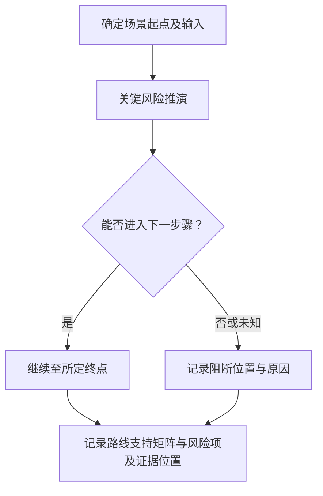


**TRL2-SW-5/C2/P3　人工兜底｜待审核**

这一路线接受本检查点的全部相关材料，也承接其他候选无法处理或结果冲突的情况。评价员先收集设计方案、需求分析及关键约束，连同已有抽取、计算或查询结果一起阅卷。没有自动结果也可以直接人工核验，不能因此要求补做一遍接口查询。

复核围绕“技术路线与需求、约束相匹配”展开。评价员逐项回看原件，确认对象与时间范围，再请软件或测试专家解释技术含义。材料保管人协助说明来源、编号和版本。对“需求—架构分配核对”、“关键风险推演”产生的不同结果，先核各自前提和覆盖范围，再判断是材料冲突还是核验范围不同。

重点检查选型名词齐全但无业务映射。对疑点建立一条待核记录，写清相互矛盾的原文、可能解释和仍缺的依据。能从现有材料解决的，补上定位与理由。需要函询、现场观察或新增试验的，由评价员另行明确对象和范围，本轮不代为执行。

以下假设场景说明复核意见应达到的具体程度：假设断网需求由纯在线服务承载：输出具体依赖冲突，专家审备份路径。

复核后形成路线支持矩阵与风险项。评价员逐项记录采纳、驳回或暂不能确认，并注明证据范围、复核人和日期。无法取得原始依据时继续保留未知。人工意见也需要说明依据，不能只写“专家认为通过”。

这一路线需要阅卷权限、材料保管人协助及软件或测试专家的工时。投入取决于材料数量、疑点复杂度和是否需要补证，当前不预设费用。系统仅协助整理证据位置、意见和修改记录。此前的自动结果保留，便于复查人工修改的原因。

**候选差异**：P1 依赖有需求与模块对应；P2 依赖有路线理由与前期依据。各路线形成各自范围内的事实，来源一致不能自动视为独立证明。P3 人工兜底始终保留，当前不选定或排列实施优先级。

**假设场景**：假设断网需求由纯在线服务承载：输出具体依赖冲突，专家审备份路径。

**异常与边界**：选型名词齐全但无业务映射。正常结果仅对已核对象和范围有效；缺失与明确冲突分列。解析失败、查询超时、权限不足均记执行状态，不转成技术不满足。

**来源与接入状态**：R0（具体查阅日及状态见来源账本）。本检查点未取得真实受评材料，未完成实测。

**待讨论**：路线合理性需论证到何种深度？ **用户选择：未选择。**

**本条材料组合与结果汇总草案**
明确路线和需求对应共同支撑；不要求当前完成研发。

**对现有项目的 PRD 影响**
界面保存技术路线版本及备选状态，区分受评项目选择和本系统核验方案选择。 记录绑定 CheckItem 快照、EvidenceFile 及其哈希，展示本条检查点与原文位置；复核采纳/覆盖理由进入 AuditLog。报告只引用已被评价员采纳的事实及其范围，不能由流程门禁推导技术满足。

**讨论状态与记录**
研究进度：方案已列齐；用户决策：待审核；已明确用户意见：连续研究、保留人工、不代选、不开发。各检查点具体方案无已确认选择。待决问题见各 C 项。本轮修改：2026-10-06，依据原表与来源账本展开候选；2026-10-07 统一质检。编号沿革见附录，未将历史用户决定转移至新方案。

### TRL2-SW-6　方案已列齐／待审核

**原表位置**：Sheet1!C20（原序号 4），条件 E20，材料 F20。

**条件原文**：
> 完成技术路线相关的技术准备 

**支撑材料原文**：
> 软件设计文档

**规则解释与差异**：原 C20 序号 4 映射为 SW-6；原表只写软件设计文档，种子“软件技术准备报告”不是新增必交件。
仓库差异：材料改为“软件技术准备报告”。只记差异，不据此增加门槛。

**1. 事实检查点拆解**

|编号|核验事实及原文对应|输入和触发范围|输出与可追溯证据|
|---|---|---|---|
|C1|技术准备范围对应拟采用路线|本条申报该事实时；设计文档路线、依赖、技能/工具/数据准备清单|路线—准备项映射|
|C2|相关准备实际完成而非只有计划|本条申报该事实时；设计文档准备记录、预研产物、环境或数据获取证据|准备完成证据与未闭环依赖|

**2. TRL2-SW-6/C1：技术准备范围对应拟采用路线**

**核验范围及前提**：设计文档路线、依赖、技能/工具/数据准备清单。输入清单表示该路线所需信息，不将全部文件名变成强制提交项；材料合并承载同一事实时保留页段对应。

**TRL2-SW-6/C1/P1　依赖准备矩阵｜待审核**

采用这一路线的前提是：路线和清单可逐项关联。评价员先从设计文档路线、依赖、技能/工具/数据准备清单中确认本路线可用的证据，标明对象、版本及评价时点。输入不足时，先记录缺少哪项依据。

提取必要组件/数据/环境/能力，比较清单覆盖并标未知。

先从已有依据中取得本检查点的适用清单，并保留每项的来源位置。将清单逐项对应到材料中的实现、安排或验证证据；一个附件覆盖多项时，分别标出支持各项的具体内容。

没有对应证据的条目列为缺项，材料明确排除的条目同时保留排除依据。自动匹配只生成对应候选，专家仍需判断证据能否回答该项事实；链接存在或清单数量相同均不能替代覆盖判断。

结果整理为路线—准备项映射。每项结果同时给出原材料位置、使用的字段或记录及处理依据，区分支持、冲突和无法确认。针对准备清单与已选路线版本不同，保留异常所涉及的具体材料，交 TRL2-SW-6/C1/P3 复核。自动处理不替评价员作本条最终判断。

实施需评估本地映射成本。不按行业通用清单新增强制项。这些依赖尚未在本项目完成接入或样本验证，实际费用和工时按授权范围、材料规模另行评估。
**TRL2-SW-6/C1/P2　关键路径准备审阅｜待审核**

采用这一路线的前提是：有预研与风险分析。评价员先从设计文档路线、依赖、技能/工具/数据准备清单中确认本路线可用的证据，标明对象、版本及评价时点。输入不足时，先记录缺少哪项依据。

沿拟采用方案实施路径分析前置依赖，核对准备说明是否提供支撑。

先选取材料已经声明的场景，写明起点、输入、参与角色和预期终点。沿现有步骤逐步推演，在每次交接处核对前一步产出能否满足下一步前提；无法继续时停在具体步骤，记录所缺信息。

正常过程与材料涉及的异常过程分别记录。推演只说明设计或安排能否被理解和执行；如需观察实物、运行软件或新增试验，另行形成执行范围，本轮不把推演结果写成已发生的运行事实。

结果整理为路线—准备项映射。每项结果同时给出原材料位置、使用的字段或记录及处理依据，区分支持、冲突和无法确认。针对准备清单与已选路线版本不同，保留异常所涉及的具体材料，交 TRL2-SW-6/C1/P3 复核。自动处理不替评价员作本条最终判断。

实施需评估模型/专家工时。不能自行把非关键工具当否决条件。这些依赖尚未在本项目完成接入或样本验证，实际费用和工时按授权范围、材料规模另行评估。


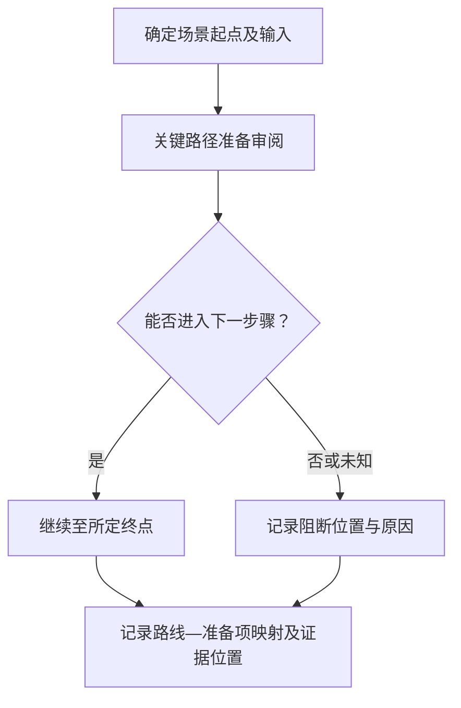


**TRL2-SW-6/C1/P3　人工兜底｜待审核**

这一路线接受本检查点的全部相关材料，也承接其他候选无法处理或结果冲突的情况。评价员先收集设计文档路线、依赖、技能/工具/数据准备清单，连同已有抽取、计算或查询结果一起阅卷。没有自动结果也可以直接人工核验，不能因此要求补做一遍接口查询。

复核围绕“技术准备范围对应拟采用路线”展开。评价员逐项回看原件，确认对象与时间范围，再请相应领域专家解释技术含义。材料保管人协助说明来源、编号和版本。对“依赖准备矩阵”、“关键路径准备审阅”产生的不同结果，先核各自前提和覆盖范围，再判断是材料冲突还是核验范围不同。

重点检查准备清单与已选路线版本不同。对疑点建立一条待核记录，写清相互矛盾的原文、可能解释和仍缺的依据。能从现有材料解决的，补上定位与理由。需要函询、现场观察或新增试验的，由评价员另行明确对象和范围，本轮不代为执行。

以下假设场景说明复核意见应达到的具体程度：假设路线换模型但数据准备仍按旧输入格式：标对应关系失效。

复核后形成路线—准备项映射。评价员逐项记录采纳、驳回或暂不能确认，并注明证据范围、复核人和日期。无法取得原始依据时继续保留未知。人工意见也需要说明依据，不能只写“专家认为通过”。

这一路线需要阅卷权限、材料保管人协助及相应领域专家的工时。投入取决于材料数量、疑点复杂度和是否需要补证，当前不预设费用。系统仅协助整理证据位置、意见和修改记录。此前的自动结果保留，便于复查人工修改的原因。

**候选差异**：P1 依赖路线和清单可逐项关联；P2 依赖有预研与风险分析。各路线形成各自范围内的事实，来源一致不能自动视为独立证明。P3 人工兜底始终保留，当前不选定或排列实施优先级。

**假设场景**：假设路线换模型但数据准备仍按旧输入格式：标对应关系失效。

**异常与边界**：准备清单与已选路线版本不同。正常结果仅对已核对象和范围有效；缺失与明确冲突分列。解析失败、查询超时、权限不足均记执行状态，不转成技术不满足。

**来源与接入状态**：R0（具体查阅日及状态见来源账本）。本检查点未取得真实受评材料，未完成实测。

**待讨论**：技术准备是否包含人员能力和授权资源？ **用户选择：未选择。**

**3. TRL2-SW-6/C2：相关准备实际完成而非只有计划**

**核验范围及前提**：设计文档准备记录、预研产物、环境或数据获取证据。输入清单表示该路线所需信息，不将全部文件名变成强制提交项；材料合并承载同一事实时保留页段对应。

**TRL2-SW-6/C2/P1　原始制品与环境记录｜待审核**

采用这一路线的前提是：有导出日志或准备产物。评价员先从设计文档准备记录、预研产物、环境或数据获取证据中确认本路线可用的证据，标明对象、版本及评价时点。输入不足时，先记录缺少哪项依据。

核对安装/配置/数据到位记录与依赖版本、时间。受控读取只输出可观测准备事实。

先确定材料中需要对应的对象及字段，把原始值和规范化值分开保存。按已有编号或明确引用建立关系，再逐项比较含义、范围与上下文；名称相近或字段同名时仍需确认其实际所指。

对无法对应和互相矛盾的项，返回两侧原始位置及差异说明。未声明的字段保持未知，不根据常用模板补齐；评价员确认对应关系后，结果仍只覆盖已经核对的对象。

结果整理为准备完成证据与尚未完成处理与复核依赖。每项结果同时给出原材料位置、使用的字段或记录及处理依据，区分支持、冲突和无法确认。针对采购意向当到位、空目录当数据准备，保留异常所涉及的具体材料，交 TRL2-SW-6/C2/P3 复核。自动处理不替评价员作本条最终判断。

实施需评估只读权限与工具适配成本。日志可被修改，截图不能独立证明环境可用。这些依赖尚未在本项目完成接入或样本验证，实际费用和工时按授权范围、材料规模另行评估。
**TRL2-SW-6/C2/P2　准备任务完成记录核验｜待审核**

采用这一路线的前提是：有预研任务与评审附件。评价员先从设计文档准备记录、预研产物、环境或数据获取证据中确认本路线可用的证据，标明对象、版本及评价时点。输入不足时，先记录缺少哪项依据。

关联完成记录、交付物、验证结果及遗留项，列仅标完成但无交付证据项。

先选定一个明确对象，用材料已有的编号、版本和时间关联各环节记录。每条关联保留两端的原始定位；同名、相近时间或单方填报只能作为线索，不能直接当作同一事件。

遇到缺少中间记录、一对多映射或前后版本不一致时，保留各条可能关系并指出断点。原系统标为完成只说明该状态被记录，是否实际完成还要看交付、执行或验证依据。

结果整理为准备完成证据与尚未完成处理与复核依赖。每项结果同时给出原材料位置、使用的字段或记录及处理依据，区分支持、冲突和无法确认。针对采购意向当到位、空目录当数据准备，保留异常所涉及的具体材料，交 TRL2-SW-6/C2/P3 复核。自动处理不替评价员作本条最终判断。

实施需评估文档解析/人工核实来源工时。不运行不受信任代码。这些依赖尚未在本项目完成接入或样本验证，实际费用和工时按授权范围、材料规模另行评估。

**TRL2-SW-6/C2/P3　人工兜底｜待审核**

这一路线接受本检查点的全部相关材料，也承接其他候选无法处理或结果冲突的情况。评价员先收集设计文档准备记录、预研产物、环境或数据获取证据，连同已有抽取、计算或查询结果一起阅卷。没有自动结果也可以直接人工核验，不能因此要求补做一遍接口查询。

复核围绕“相关准备实际完成而非只有计划”展开。评价员逐项回看原件，确认对象与时间范围，再请相应领域专家解释技术含义。材料保管人协助说明来源、编号和版本。对“原始制品与环境记录”、“准备任务完成记录核验”产生的不同结果，先核各自前提和覆盖范围，再判断是材料冲突还是核验范围不同。

重点检查采购意向当到位、空目录当数据准备。对疑点建立一条待核记录，写清相互矛盾的原文、可能解释和仍缺的依据。能从现有材料解决的，补上定位与理由。需要函询、现场观察或新增试验的，由评价员另行明确对象和范围，本轮不代为执行。

以下假设场景说明复核意见应达到的具体程度：假设工具采购完成但许可证未生效：列授权未落实，由专家判断是否阻断技术路线。

复核后形成准备完成证据与尚未完成处理与复核依赖。评价员逐项记录采纳、驳回或暂不能确认，并注明证据范围、复核人和日期。无法取得原始依据时继续保留未知。人工意见也需要说明依据，不能只写“专家认为通过”。

这一路线需要阅卷权限、材料保管人协助及相应领域专家的工时。投入取决于材料数量、疑点复杂度和是否需要补证，当前不预设费用。系统仅协助整理证据位置、意见和修改记录。此前的自动结果保留，便于复查人工修改的原因。

**候选差异**：P1 依赖有导出日志或准备产物；P2 依赖有预研任务与评审附件。各路线形成各自范围内的事实，来源一致不能自动视为独立证明。P3 人工兜底始终保留，当前不选定或排列实施优先级。

**假设场景**：假设工具采购完成但许可证未生效：列授权未落实，由专家判断是否阻断技术路线。

**异常与边界**：采购意向当到位、空目录当数据准备。正常结果仅对已核对象和范围有效；缺失与明确冲突分列。解析失败、查询超时、权限不足均记执行状态，不转成技术不满足。

**来源与接入状态**：R0（具体查阅日及状态见来源账本）。本检查点未取得真实受评材料，未完成实测。

**待讨论**：哪些准备项必须实际验证，哪些文档承诺可接受？ **用户选择：未选择。**

**本条材料组合与结果汇总草案**
范围对应与实际完成共同核；设计文档可内含准备结果，独立报告为替代载体候选。

**对现有项目的 PRD 影响**
增加准备状态、证据类别与关键依赖，不把任务完成勾选当完成事实。 记录绑定 CheckItem 快照、EvidenceFile 及其哈希，展示本条检查点与原文位置；复核采纳/覆盖理由进入 AuditLog。报告只引用已被评价员采纳的事实及其范围，不能由流程门禁推导技术满足。

**讨论状态与记录**
研究进度：方案已列齐；用户决策：待审核；已明确用户意见：连续研究、保留人工、不代选、不开发。各检查点具体方案无已确认选择。待决问题见各 C 项。本轮修改：2026-10-06，依据原表与来源账本展开候选；2026-10-07 统一质检。编号沿革见附录，未将历史用户决定转移至新方案。

### TRL2-SW-7　方案已列齐／待审核

**原表位置**：Sheet1!C21（原序号 5），条件 E21，材料 F21。

**条件原文**：
> 形成系统的概要设计

**支撑材料原文**：
> 软件设计文档

**规则解释与差异**：原 C21 序号 5 映射 SW-7；种子更名概要设计说明书不强制另建文件。
仓库差异：材料改为“概要设计说明书”。只记差异，不据此增加门槛。

**1. 事实检查点拆解**

|编号|核验事实及原文对应|输入和触发范围|输出与可追溯证据|
|---|---|---|---|
|C1|系统总体结构与职责已形成|本条申报该事实时；软件设计文档的模块、职责、部署和依赖|总体结构—职责及场景映射|
|C2|主要接口和数据流可辨识|本条申报该事实时；接口说明、数据流图、外部系统边界|接口/数据流位置及不闭合处|

**2. TRL2-SW-7/C1：系统总体结构与职责已形成**

**核验范围及前提**：软件设计文档的模块、职责、部署和依赖。输入清单表示该路线所需信息，不将全部文件名变成强制提交项；材料合并承载同一事实时保留页段对应。

**TRL2-SW-7/C1/P1　架构一致性核对｜待审核**

采用这一路线的前提是：有模块表/架构图。评价员先从软件设计文档的模块、职责、部署和依赖中确认本路线可用的证据，标明对象、版本及评价时点。输入不足时，先记录缺少哪项依据。

比对模块命名、边界、依赖关系与需求分配，检查未解释组件及环路。

先确定材料中需要对应的对象及字段，把原始值和规范化值分开保存。按已有编号或明确引用建立关系，再逐项比较含义、范围与上下文；名称相近或字段同名时仍需确认其实际所指。

对无法对应和互相矛盾的项，返回两侧原始位置及差异说明。未声明的字段保持未知，不根据常用模板补齐；评价员确认对应关系后，结果仍只覆盖已经核对的对象。

结果整理为总体结构—职责及场景映射。每项结果同时给出原材料位置、使用的字段或记录及处理依据，区分支持、冲突和无法确认。针对图与文字对应不了，保留异常所涉及的具体材料，交 TRL2-SW-7/C1/P3 复核。自动处理不替评价员作本条最终判断。

实施需评估图文解析成本。环路不必然设计错误。这些依赖尚未在本项目完成接入或样本验证，实际费用和工时按授权范围、材料规模另行评估。
**TRL2-SW-7/C1/P2　端到端业务流审阅｜待审核**

采用这一路线的前提是：有主要场景与架构叙述。评价员先从软件设计文档的模块、职责、部署和依赖中确认本路线可用的证据，标明对象、版本及评价时点。输入不足时，先记录缺少哪项依据。

逐场景追踪经过模块、数据和外部服务，专家核结构是否足以说明总体方案。

先选取材料已经声明的场景，写明起点、输入、参与角色和预期终点。沿现有步骤逐步推演，在每次交接处核对前一步产出能否满足下一步前提；无法继续时停在具体步骤，记录所缺信息。

正常过程与材料涉及的异常过程分别记录。推演只说明设计或安排能否被理解和执行；如需观察实物、运行软件或新增试验，另行形成执行范围，本轮不把推演结果写成已发生的运行事实。

结果整理为总体结构—职责及场景映射。每项结果同时给出原材料位置、使用的字段或记录及处理依据，区分支持、冲突和无法确认。针对图与文字对应不了，保留异常所涉及的具体材料，交 TRL2-SW-7/C1/P3 复核。自动处理不替评价员作本条最终判断。

实施需评估模型与架构专家工时。不强制详细设计粒度。这些依赖尚未在本项目完成接入或样本验证，实际费用和工时按授权范围、材料规模另行评估。


**TRL2-SW-7/C1/P3　人工兜底｜待审核**

这一路线接受本检查点的全部相关材料，也承接其他候选无法处理或结果冲突的情况。评价员先收集软件设计文档的模块、职责、部署和依赖，连同已有抽取、计算或查询结果一起阅卷。没有自动结果也可以直接人工核验，不能因此要求补做一遍接口查询。

复核围绕“系统总体结构与职责已形成”展开。评价员逐项回看原件，确认对象与时间范围，再请软件或测试专家解释技术含义。材料保管人协助说明来源、编号和版本。对“架构一致性核对”、“端到端业务流审阅”产生的不同结果，先核各自前提和覆盖范围，再判断是材料冲突还是核验范围不同。

重点检查图与文字对应不了。对疑点建立一条待核记录，写清相互矛盾的原文、可能解释和仍缺的依据。能从现有材料解决的，补上定位与理由。需要函询、现场观察或新增试验的，由评价员另行明确对象和范围，本轮不代为执行。

以下假设场景说明复核意见应达到的具体程度：假设数据采集有模块但无存储/处理归属：提示总体设计责任缺口。

复核后形成总体结构—职责及场景映射。评价员逐项记录采纳、驳回或暂不能确认，并注明证据范围、复核人和日期。无法取得原始依据时继续保留未知。人工意见也需要说明依据，不能只写“专家认为通过”。

这一路线需要阅卷权限、材料保管人协助及软件或测试专家的工时。投入取决于材料数量、疑点复杂度和是否需要补证，当前不预设费用。系统仅协助整理证据位置、意见和修改记录。此前的自动结果保留，便于复查人工修改的原因。

**候选差异**：P1 依赖有模块表/架构图；P2 依赖有主要场景与架构叙述。各路线形成各自范围内的事实，来源一致不能自动视为独立证明。P3 人工兜底始终保留，当前不选定或排列实施优先级。

**假设场景**：假设数据采集有模块但无存储/处理归属：提示总体设计责任缺口。

**异常与边界**：图与文字对应不了。正常结果仅对已核对象和范围有效；缺失与明确冲突分列。解析失败、查询超时、权限不足均记执行状态，不转成技术不满足。

**来源与接入状态**：R0（具体查阅日及状态见来源账本）。本检查点未取得真实受评材料，未完成实测。

**待讨论**：概要设计需包含哪些视图，哪些可后续详设？ **用户选择：未选择。**

**3. TRL2-SW-7/C2：主要接口和数据流可辨识**

**核验范围及前提**：接口说明、数据流图、外部系统边界。输入清单表示该路线所需信息，不将全部文件名变成强制提交项；材料合并承载同一事实时保留页段对应。

**TRL2-SW-7/C2/P1　接口契约交叉检查｜待审核**

采用这一路线的前提是：接口有两端与字段。评价员先从接口说明、数据流图、外部系统边界中确认本路线可用的证据，标明对象、版本及评价时点。输入不足时，先记录缺少哪项依据。

检查发送接收角色、输入输出、协议/数据格式的一致性，列未定义边界。

先确定材料中需要对应的对象及字段，把原始值和规范化值分开保存。按已有编号或明确引用建立关系，再逐项比较含义、范围与上下文；名称相近或字段同名时仍需确认其实际所指。

对无法对应和互相矛盾的项，返回两侧原始位置及差异说明。未声明的字段保持未知，不根据常用模板补齐；评价员确认对应关系后，结果仍只覆盖已经核对的对象。

结果整理为接口/数据流位置及未形成完整处理过程的位置。每项结果同时给出原材料位置、使用的字段或记录及处理依据，区分支持、冲突和无法确认。针对外部系统能力被假定已具备，保留异常所涉及的具体材料，交 TRL2-SW-7/C2/P3 复核。自动处理不替评价员作本条最终判断。

实施需评估接口字典维护。初级设计不要求全部字段冻结。这些依赖尚未在本项目完成接入或样本验证，实际费用和工时按授权范围、材料规模另行评估。
**TRL2-SW-7/C2/P2　业务场景接口推演｜待审核**

采用这一路线的前提是：接口多为文字描述。评价员先从接口说明、数据流图、外部系统边界中确认本路线可用的证据，标明对象、版本及评价时点。输入不足时，先记录缺少哪项依据。

沿关键交易/处理链标注跨模块数据与错误返回，专家核是否能闭合。

先选取材料已经声明的场景，写明起点、输入、参与角色和预期终点。沿现有步骤逐步推演，在每次交接处核对前一步产出能否满足下一步前提；无法继续时停在具体步骤，记录所缺信息。

正常过程与材料涉及的异常过程分别记录。推演只说明设计或安排能否被理解和执行；如需观察实物、运行软件或新增试验，另行形成执行范围，本轮不把推演结果写成已发生的运行事实。

结果整理为接口/数据流位置及未形成完整处理过程的位置。每项结果同时给出原材料位置、使用的字段或记录及处理依据，区分支持、冲突和无法确认。针对外部系统能力被假定已具备，保留异常所涉及的具体材料，交 TRL2-SW-7/C2/P3 复核。自动处理不替评价员作本条最终判断。

实施需评估专家工时。缺异常细节的影响按概要成熟度裁定。这些依赖尚未在本项目完成接入或样本验证，实际费用和工时按授权范围、材料规模另行评估。


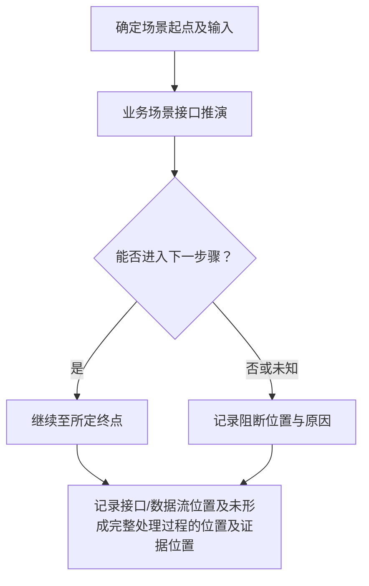


**TRL2-SW-7/C2/P3　人工兜底｜待审核**

这一路线接受本检查点的全部相关材料，也承接其他候选无法处理或结果冲突的情况。评价员先收集接口说明、数据流图、外部系统边界，连同已有抽取、计算或查询结果一起阅卷。没有自动结果也可以直接人工核验，不能因此要求补做一遍接口查询。

复核围绕“主要接口和数据流可辨识”展开。评价员逐项回看原件，确认对象与时间范围，再请相应领域专家解释技术含义。材料保管人协助说明来源、编号和版本。对“接口契约交叉检查”、“业务场景接口推演”产生的不同结果，先核各自前提和覆盖范围，再判断是材料冲突还是核验范围不同。

重点检查外部系统能力被假定已具备。对疑点建立一条待核记录，写清相互矛盾的原文、可能解释和仍缺的依据。能从现有材料解决的，补上定位与理由。需要函询、现场观察或新增试验的，由评价员另行明确对象和范围，本轮不代为执行。

以下假设场景说明复核意见应达到的具体程度：假设设计依赖外部实时数据却只有批量文件入口：标接口假设冲突。

复核后形成接口/数据流位置及未形成完整处理过程的位置。评价员逐项记录采纳、驳回或暂不能确认，并注明证据范围、复核人和日期。无法取得原始依据时继续保留未知。人工意见也需要说明依据，不能只写“专家认为通过”。

这一路线需要阅卷权限、材料保管人协助及相应领域专家的工时。投入取决于材料数量、疑点复杂度和是否需要补证，当前不预设费用。系统仅协助整理证据位置、意见和修改记录。此前的自动结果保留，便于复查人工修改的原因。

**候选差异**：P1 依赖接口有两端与字段；P2 依赖接口多为文字描述。各路线形成各自范围内的事实，来源一致不能自动视为独立证明。P3 人工兜底始终保留，当前不选定或排列实施优先级。

**假设场景**：假设设计依赖外部实时数据却只有批量文件入口：标接口假设冲突。

**异常与边界**：外部系统能力被假定已具备。正常结果仅对已核对象和范围有效；缺失与明确冲突分列。解析失败、查询超时、权限不足均记执行状态，不转成技术不满足。

**来源与接入状态**：R0（具体查阅日及状态见来源账本）。本检查点未取得真实受评材料，未完成实测。

**待讨论**：主要接口的最小定义范围是什么？ **用户选择：未选择。**

**本条材料组合与结果汇总草案**
结构职责和接口数据流作为共同证据；正文、图表可组合，不要求指定建模语言。

**对现有项目的 PRD 影响**
提供架构图定位与接口对照卡，为后续详细设计保留需求关联。 记录绑定 CheckItem 快照、EvidenceFile 及其哈希，展示本条检查点与原文位置；复核采纳/覆盖理由进入 AuditLog。报告只引用已被评价员采纳的事实及其范围，不能由流程门禁推导技术满足。

**讨论状态与记录**
研究进度：方案已列齐；用户决策：待审核；已明确用户意见：连续研究、保留人工、不代选、不开发。各检查点具体方案无已确认选择。待决问题见各 C 项。本轮修改：2026-10-06，依据原表与来源账本展开候选；2026-10-07 统一质检。编号沿革见附录，未将历史用户决定转移至新方案。

### TRL3-HW-1　方案已列齐／待审核

**原表位置**：Sheet1!C24（原序号 1），条件 E24，材料 F24。

**条件原文**：
> 形成完善的实施方案

**支撑材料原文**：
> 实施方案

**规则解释与差异**：完善为评价概念，候选检查维度不能直接变成正式强制清单。
与读取分支种子条件、材料文字一致（忽略空白）。

**1. 事实检查点拆解**

|编号|核验事实及原文对应|输入和触发范围|输出与可追溯证据|
|---|---|---|---|
|C1|实施方案覆盖目标、技术任务和交付|本条申报该事实时；实施方案、目标及技术任务清单|工作包覆盖和技术链缺口|
|C2|方案的资源、进度与风险安排可执行|本条申报该事实时；实施方案资源表、阶段计划及风险处置|资源冲突、关键依赖及应对记录|

**2. TRL3-HW-1/C1：实施方案覆盖目标、技术任务和交付**

**核验范围及前提**：实施方案、目标及技术任务清单。输入清单表示该路线所需信息，不将全部文件名变成强制提交项；材料合并承载同一事实时保留页段对应。

**TRL3-HW-1/C1/P1　任务分解覆盖｜待审核**

采用这一路线的前提是：目标和工作包可编号。评价员先从实施方案、目标及技术任务清单中确认本路线可用的证据，标明对象、版本及评价时点。输入不足时，先记录缺少哪项依据。

关联目标—任务—交付物—验证方式，列悬空目标与重复责任。

先从已有依据中取得本检查点的适用清单，并保留每项的来源位置。将清单逐项对应到材料中的实现、安排或验证证据；一个附件覆盖多项时，分别标出支持各项的具体内容。

没有对应证据的条目列为缺项，材料明确排除的条目同时保留排除依据。自动匹配只生成对应候选，专家仍需判断证据能否回答该项事实；链接存在或清单数量相同均不能替代覆盖判断。

结果整理为工作包覆盖和技术链缺口。每项结果同时给出原材料位置、使用的字段或记录及处理依据，区分支持、冲突和无法确认。针对方案沿用旧目标或只列口号，保留异常所涉及的具体材料，交 TRL3-HW-1/C1/P3 复核。自动处理不替评价员作本条最终判断。

实施需评估映射维护工时。完整模板不证明方案完善。这些依赖尚未在本项目完成接入或样本验证，实际费用和工时按授权范围、材料规模另行评估。
**TRL3-HW-1/C1/P2　技术依赖论证｜待审核**

采用这一路线的前提是：有端到端实施路线。评价员先从实施方案、目标及技术任务清单中确认本路线可用的证据，标明对象、版本及评价时点。输入不足时，先记录缺少哪项依据。

沿关键技术链逐步核输入、实现方法和证据，专家评遗漏环节。

先把材料中的结论拆成可核对的主张，逐项摘录其假设、理由、依据和限制。辅助模型只能使用授权材料和已确认的项目背景，返回原文位置、可能反证及无法确定之处；公式和图中的含义需要回看原件。

专家沿“依据是否存在、前提是否适用、推导能否支持主张”的顺序复核。缺少依据时说明缺在哪一步，不凭模型常识补出论证；文字相似、表达流畅和多次生成一致均不作为充分性判据。

结果整理为工作包覆盖和技术链缺口。每项结果同时给出原材料位置、使用的字段或记录及处理依据，区分支持、冲突和无法确认。针对方案沿用旧目标或只列口号，保留异常所涉及的具体材料，交 TRL3-HW-1/C1/P3 复核。自动处理不替评价员作本条最终判断。

实施需评估专家/模型成本。不得自动按章节数评分。这些依赖尚未在本项目完成接入或样本验证，实际费用和工时按授权范围、材料规模另行评估。

**TRL3-HW-1/C1/P3　人工兜底｜待审核**

这一路线接受本检查点的全部相关材料，也承接其他候选无法处理或结果冲突的情况。评价员先收集实施方案、目标及技术任务清单，连同已有抽取、计算或查询结果一起阅卷。没有自动结果也可以直接人工核验，不能因此要求补做一遍接口查询。

复核围绕“实施方案覆盖目标、技术任务和交付”展开。评价员逐项回看原件，确认对象与时间范围，再请相应领域专家解释技术含义。材料保管人协助说明来源、编号和版本。对“任务分解覆盖”、“技术依赖论证”产生的不同结果，先核各自前提和覆盖范围，再判断是材料冲突还是核验范围不同。

重点检查方案沿用旧目标或只列口号。对疑点建立一条待核记录，写清相互矛盾的原文、可能解释和仍缺的依据。能从现有材料解决的，补上定位与理由。需要函询、现场观察或新增试验的，由评价员另行明确对象和范围，本轮不代为执行。

以下假设场景说明复核意见应达到的具体程度：假设系统要求抗干扰却无相关任务：标目标覆盖缺口，请补充安排或解释。

复核后形成工作包覆盖和技术链缺口。评价员逐项记录采纳、驳回或暂不能确认，并注明证据范围、复核人和日期。无法取得原始依据时继续保留未知。人工意见也需要说明依据，不能只写“专家认为通过”。

这一路线需要阅卷权限、材料保管人协助及相应领域专家的工时。投入取决于材料数量、疑点复杂度和是否需要补证，当前不预设费用。系统仅协助整理证据位置、意见和修改记录。此前的自动结果保留，便于复查人工修改的原因。

**候选差异**：P1 依赖目标和工作包可编号；P2 依赖有端到端实施路线。各路线形成各自范围内的事实，来源一致不能自动视为独立证明。P3 人工兜底始终保留，当前不选定或排列实施优先级。

**假设场景**：假设系统要求抗干扰却无相关任务：标目标覆盖缺口，请补充安排或解释。

**异常与边界**：方案沿用旧目标或只列口号。正常结果仅对已核对象和范围有效；缺失与明确冲突分列。解析失败、查询超时、权限不足均记执行状态，不转成技术不满足。

**来源与接入状态**：R0（具体查阅日及状态见来源账本）。本检查点未取得真实受评材料，未完成实测。

**待讨论**：“完善”以哪些维度和范围评审？ **用户选择：未选择。**

**3. TRL3-HW-1/C2：方案的资源、进度与风险安排可执行**

**核验范围及前提**：实施方案资源表、阶段计划及风险处置。输入清单表示该路线所需信息，不将全部文件名变成强制提交项；材料合并承载同一事实时保留页段对应。

**TRL3-HW-1/C2/P1　资源时序一致性｜待审核**

采用这一路线的前提是：有资源与工期数据。评价员先从实施方案资源表、阶段计划及风险处置中确认本路线可用的证据，标明对象、版本及评价时点。输入不足时，先记录缺少哪项依据。

检查依赖先后、资源重叠及交付节点，按明确预算算缺口。

先把任务起止、前置关系和资源占用放到同一时间口径下。逐条检查先后顺序与可用窗口；如果发现环路或超占，返回具体任务及时间段，说明冲突由哪项依赖产生。

估算工期和已承诺时间分别记录。存在不确定等待或资源尚未落实时，列出受影响的后续任务，不自行缩短工期，也不把计划表中的排期当作资源已经到位。

结果整理为资源冲突、关键依赖及应对记录。每项结果同时给出原材料位置、使用的字段或记录及处理依据，区分支持、冲突和无法确认。针对有风险名无处理、资源承诺未落实，保留异常所涉及的具体材料，交 TRL3-HW-1/C2/P3 复核。自动处理不替评价员作本条最终判断。

实施需评估本地计划计算。估时不确定不能硬判不可行。这些依赖尚未在本项目完成接入或样本验证，实际费用和工时按授权范围、材料规模另行评估。


```mermaid
flowchart TD
  A["统一任务及时间口径"] --> B["资源时序一致性"]
  B --> C{"发现顺序或资源冲突？"}
  C -->|是| D["定位受影响任务"]
  C -->|否或未知| E["保留可核的计划关系"]
  D --> F["记录资源冲突及证据位置"]
  E --> F
```

**TRL3-HW-1/C2/P2　风险处置安排审阅｜待审核**

采用这一路线的前提是：有关键风险与备用路径。评价员先从实施方案资源表、阶段计划及风险处置中确认本路线可用的证据，标明对象、版本及评价时点。输入不足时，先记录缺少哪项依据。

逐风险核触发条件、责任、处置及对目标影响，专家判剩余风险。

先把材料中的结论拆成可核对的主张，逐项摘录其假设、理由、依据和限制。辅助模型只能使用授权材料和已确认的项目背景，返回原文位置、可能反证及无法确定之处；公式和图中的含义需要回看原件。

专家沿“依据是否存在、前提是否适用、推导能否支持主张”的顺序复核。缺少依据时说明缺在哪一步，不凭模型常识补出论证；文字相似、表达流畅和多次生成一致均不作为充分性判据。

结果整理为资源冲突、关键依赖及应对记录。每项结果同时给出原材料位置、使用的字段或记录及处理依据，区分支持、冲突和无法确认。针对有风险名无处理、资源承诺未落实，保留异常所涉及的具体材料，交 TRL3-HW-1/C2/P3 复核。自动处理不替评价员作本条最终判断。

实施需评估领域专家工时。不要求风险为零。这些依赖尚未在本项目完成接入或样本验证，实际费用和工时按授权范围、材料规模另行评估。

**TRL3-HW-1/C2/P3　人工兜底｜待审核**

这一路线接受本检查点的全部相关材料，也承接其他候选无法处理或结果冲突的情况。评价员先收集实施方案资源表、阶段计划及风险处置，连同已有抽取、计算或查询结果一起阅卷。没有自动结果也可以直接人工核验，不能因此要求补做一遍接口查询。

复核围绕“方案的资源、进度与风险安排可执行”展开。评价员逐项回看原件，确认对象与时间范围，再请相应领域专家解释技术含义。材料保管人协助说明来源、编号和版本。对“资源时序一致性”、“风险处置安排审阅”产生的不同结果，先核各自前提和覆盖范围，再判断是材料冲突还是核验范围不同。

重点检查有风险名无处理、资源承诺未落实。对疑点建立一条待核记录，写清相互矛盾的原文、可能解释和仍缺的依据。能从现有材料解决的，补上定位与理由。需要函询、现场观察或新增试验的，由评价员另行明确对象和范围，本轮不代为执行。

以下假设场景说明复核意见应达到的具体程度：假设唯一试验台被两工作包同时占用：系统报冲突，人工调整解释，不替用户制定执行计划。

复核后形成资源冲突、关键依赖及应对记录。评价员逐项记录采纳、驳回或暂不能确认，并注明证据范围、复核人和日期。无法取得原始依据时继续保留未知。人工意见也需要说明依据，不能只写“专家认为通过”。

这一路线需要阅卷权限、材料保管人协助及相应领域专家的工时。投入取决于材料数量、疑点复杂度和是否需要补证，当前不预设费用。系统仅协助整理证据位置、意见和修改记录。此前的自动结果保留，便于复查人工修改的原因。

**候选差异**：P1 依赖有资源与工期数据；P2 依赖有关键风险与备用路径。各路线形成各自范围内的事实，来源一致不能自动视为独立证明。P3 人工兜底始终保留，当前不选定或排列实施优先级。

**假设场景**：假设唯一试验台被两工作包同时占用：系统报冲突，人工调整解释，不替用户制定执行计划。

**异常与边界**：有风险名无处理、资源承诺未落实。正常结果仅对已核对象和范围有效；缺失与明确冲突分列。解析失败、查询超时、权限不足均记执行状态，不转成技术不满足。

**来源与接入状态**：R0（具体查阅日及状态见来源账本）。本检查点未取得真实受评材料，未完成实测。

**待讨论**：资源可获得性需何种证据，备用路径是否必须？ **用户选择：未选择。**

**本条材料组合与结果汇总草案**
目标覆盖与执行安排联合判断；批准章只证审批，不替代技术内容。

**对现有项目的 PRD 影响**
显示实施任务与风险定位，人工可说明特定维度不适用。 记录绑定 CheckItem 快照、EvidenceFile 及其哈希，展示本条检查点与原文位置；复核采纳/覆盖理由进入 AuditLog。报告只引用已被评价员采纳的事实及其范围，不能由流程门禁推导技术满足。

**讨论状态与记录**
研究进度：方案已列齐；用户决策：待审核；已明确用户意见：连续研究、保留人工、不代选、不开发。各检查点具体方案无已确认选择。待决问题见各 C 项。本轮修改：2026-10-06，依据原表与来源账本展开候选；2026-10-07 统一质检。编号沿革见附录，未将历史用户决定转移至新方案。

### TRL3-HW-2　方案已列齐／待审核

**原表位置**：Sheet1!C25（原序号 2），条件 E25，材料 F25。

**条件原文**：
> 通过试验或仿真分析手段验证了关键功能的可行性

**支撑材料原文**：
> 试验或仿真报告

**规则解释与差异**：本级验证关键功能可行性，不能自动升级为成品性能全部通过。
与读取分支种子条件、材料文字一致（忽略空白）。

**1. 事实检查点拆解**

|编号|核验事实及原文对应|输入和触发范围|输出与可追溯证据|
|---|---|---|---|
|C1|关键功能和试验/仿真对象对应|本条申报该事实时；功能清单、对象配置、试验或模型说明|功能覆盖及对象/模型配置|
|C2|结果支持关键功能可行性|本条申报该事实时；报告数据、目标判据、模型或试验原始输出|指标结果、原始行/任务ID及差异|
|C3|验证结论可追溯且适用边界明确|本条申报该事实时；报告结论、试验/仿真条件和限制|可行范围及反证位置|

**2. TRL3-HW-2/C1：关键功能和试验/仿真对象对应**

**核验范围及前提**：功能清单、对象配置、试验或模型说明。输入清单表示该路线所需信息，不将全部文件名变成强制提交项；材料合并承载同一事实时保留页段对应。

**TRL3-HW-2/C1/P1　配置与覆盖矩阵｜待审核**

采用这一路线的前提是：功能和样件/模型可标识。评价员先从功能清单、对象配置、试验或模型说明中确认本路线可用的证据，标明对象、版本及评价时点。输入不足时，先记录缺少哪项依据。

匹配关键功能—对象—用例，核对模型版本和输入参数。

先从已有依据中取得本检查点的适用清单，并保留每项的来源位置。将清单逐项对应到材料中的实现、安排或验证证据；一个附件覆盖多项时，分别标出支持各项的具体内容。

没有对应证据的条目列为缺项，材料明确排除的条目同时保留排除依据。自动匹配只生成对应候选，专家仍需判断证据能否回答该项事实；链接存在或清单数量相同均不能替代覆盖判断。

结果整理为功能覆盖及对象/模型配置。每项结果同时给出原材料位置、使用的字段或记录及处理依据，区分支持、冲突和无法确认。针对用相似型号替代申报对象无解释，保留异常所涉及的具体材料，交 TRL3-HW-2/C1/P3 复核。自动处理不替评价员作本条最终判断。

实施需评估配置映射成本。只报总体成功不能覆盖遗漏功能。这些依赖尚未在本项目完成接入或样本验证，实际费用和工时按授权范围、材料规模另行评估。
**TRL3-HW-2/C1/P2　验证设计论证｜待审核**

采用这一路线的前提是：有试验原理或模型假设。评价员先从功能清单、对象配置、试验或模型说明中确认本路线可用的证据，标明对象、版本及评价时点。输入不足时，先记录缺少哪项依据。

审查验证手段为何可观察该功能，比较模型假设与技术概念。

先把材料中的结论拆成可核对的主张，逐项摘录其假设、理由、依据和限制。辅助模型只能使用授权材料和已确认的项目背景，返回原文位置、可能反证及无法确定之处；公式和图中的含义需要回看原件。

专家沿“依据是否存在、前提是否适用、推导能否支持主张”的顺序复核。缺少依据时说明缺在哪一步，不凭模型常识补出论证；文字相似、表达流畅和多次生成一致均不作为充分性判据。

结果整理为功能覆盖及对象/模型配置。每项结果同时给出原材料位置、使用的字段或记录及处理依据，区分支持、冲突和无法确认。针对用相似型号替代申报对象无解释，保留异常所涉及的具体材料，交 TRL3-HW-2/C1/P3 复核。自动处理不替评价员作本条最终判断。

实施需评估专家工时。模型完整不等于物理真实。这些依赖尚未在本项目完成接入或样本验证，实际费用和工时按授权范围、材料规模另行评估。

**TRL3-HW-2/C1/P3　人工兜底｜待审核**

这一路线接受本检查点的全部相关材料，也承接其他候选无法处理或结果冲突的情况。评价员先收集功能清单、对象配置、试验或模型说明，连同已有抽取、计算或查询结果一起阅卷。没有自动结果也可以直接人工核验，不能因此要求补做一遍接口查询。

复核围绕“关键功能和试验/仿真对象对应”展开。评价员逐项回看原件，确认对象与时间范围，再请相应领域专家解释技术含义。材料保管人协助说明来源、编号和版本。对“配置与覆盖矩阵”、“验证设计论证”产生的不同结果，先核各自前提和覆盖范围，再判断是材料冲突还是核验范围不同。

重点检查用相似型号替代申报对象无解释。对疑点建立一条待核记录，写清相互矛盾的原文、可能解释和仍缺的依据。能从现有材料解决的，补上定位与理由。需要函询、现场观察或新增试验的，由评价员另行明确对象和范围，本轮不代为执行。

以下假设场景说明复核意见应达到的具体程度：假设只验证采集而未验证反馈：列关键功能覆盖缺口。

复核后形成功能覆盖及对象/模型配置。评价员逐项记录采纳、驳回或暂不能确认，并注明证据范围、复核人和日期。无法取得原始依据时继续保留未知。人工意见也需要说明依据，不能只写“专家认为通过”。

这一路线需要阅卷权限、材料保管人协助及相应领域专家的工时。投入取决于材料数量、疑点复杂度和是否需要补证，当前不预设费用。系统仅协助整理证据位置、意见和修改记录。此前的自动结果保留，便于复查人工修改的原因。

**候选差异**：P1 依赖功能和样件/模型可标识；P2 依赖有试验原理或模型假设。各路线形成各自范围内的事实，来源一致不能自动视为独立证明。P3 人工兜底始终保留，当前不选定或排列实施优先级。

**假设场景**：假设只验证采集而未验证反馈：列关键功能覆盖缺口。

**异常与边界**：用相似型号替代申报对象无解释。正常结果仅对已核对象和范围有效；缺失与明确冲突分列。解析失败、查询超时、权限不足均记执行状态，不转成技术不满足。

**来源与接入状态**：R0（具体查阅日及状态见来源账本）。本检查点未取得真实受评材料，未完成实测。

**待讨论**：关键功能清单和试验/仿真替代范围由谁确认？ **用户选择：未选择。**

**3. TRL3-HW-2/C2：结果支持关键功能可行性**

**核验范围及前提**：报告数据、目标判据、模型或试验原始输出。输入清单表示该路线所需信息，不将全部文件名变成强制提交项；材料合并承载同一事实时保留页段对应。

**TRL3-HW-2/C2/P1　数据重新计算｜待审核**

采用这一路线的前提是：有数据和判据。评价员先从报告数据、目标判据、模型或试验原始输出中确认本路线可用的证据，标明对象、版本及评价时点。输入不足时，先记录缺少哪项依据。

核对单位条件与方向。随后，重算指标及判据。最后，保留失败样本和计算明细。

先把材料中的待核数值定位到原始数据行或参数出处，核对单位、方向、对象版本和适用条件。再按材料中有依据的公式或判据重新计算，同时保留输入、换算和中间结果。判据缺失时可以核算结果，但不能据此判定达标。

报告值与计算值不一致时，先检查舍入、样本选择、统计窗口和单位换算。能够解释的差异保留说明，无法解释的差异交专家复核；不把精度不同直接当作内容造假。

结果整理为指标结果、原始行/任务 ID 及差异。每项结果同时给出原材料位置、使用的字段或记录及处理依据，区分支持、冲突和无法确认。针对仅给成功截图、仿真未收敛却取末值，保留异常所涉及的具体材料，交 TRL3-HW-2/C2/P3 复核。自动处理不替评价员作本条最终判断。

需数据授权与公式维护。不能补造缺失数据。这些依赖尚未在本项目完成接入或样本验证，实际费用和工时按授权范围、材料规模另行评估。


```mermaid
flowchart TD
  A["定位数据及适用判据"] --> B["数据重新计算"]
  B --> C{"条件与数据是否充分？"}
  C -->|是| D["重算并比较报告"]
  C -->|否或未知| E["列缺项或冲突交人工"]
  D --> F["记录指标结果及证据位置"]
  E --> F
```

**TRL3-HW-2/C2/P2　原始运行追溯｜待审核**

采用这一路线的前提是：可提供仪器日志或仿真任务文件。评价员先从报告数据、目标判据、模型或试验原始输出中确认本路线可用的证据，标明对象、版本及评价时点。输入不足时，先记录缺少哪项依据。

核对运行配置、输入和输出与报告的对应关系。只读核日志，未来授权复现另立任务。

先选定一个明确对象，用材料已有的编号、版本和时间关联各环节记录。每条关联保留两端的原始定位；同名、相近时间或单方填报只能作为线索，不能直接当作同一事件。

遇到缺少中间记录、一对多映射或前后版本不一致时，保留各条可能关系并指出断点。原系统标为完成只说明该状态被记录，是否实际完成还要看交付、执行或验证依据。

结果整理为指标结果、原始行/任务 ID 及差异。每项结果同时给出原材料位置、使用的字段或记录及处理依据，区分支持、冲突和无法确认。针对仅给成功截图、仿真未收敛却取末值，保留异常所涉及的具体材料，交 TRL3-HW-2/C2/P3 复核。自动处理不替评价员作本条最终判断。

实施需评估原系统权限/仿真许可成本。日志真实性与模型有效性仍需核。这些依赖尚未在本项目完成接入或样本验证，实际费用和工时按授权范围、材料规模另行评估。

**TRL3-HW-2/C2/P3　人工兜底｜待审核**

这一路线接受本检查点的全部相关材料，也承接其他候选无法处理或结果冲突的情况。评价员先收集报告数据、目标判据、模型或试验原始输出，连同已有抽取、计算或查询结果一起阅卷。没有自动结果也可以直接人工核验，不能因此要求补做一遍接口查询。

复核围绕“结果支持关键功能可行性”展开。评价员逐项回看原件，确认对象与时间范围，再请相应领域专家解释技术含义。材料保管人协助说明来源、编号和版本。对“数据重新计算”、“原始运行追溯”产生的不同结果，先核各自前提和覆盖范围，再判断是材料冲突还是核验范围不同。

重点检查仅给成功截图、仿真未收敛却取末值。对疑点建立一条待核记录，写清相互矛盾的原文、可能解释和仍缺的依据。能从现有材料解决的，补上定位与理由。需要函询、现场观察或新增试验的，由评价员另行明确对象和范围，本轮不代为执行。

以下假设场景说明复核意见应达到的具体程度：假设报告称可行但原始波形未达到触发条件：标结果依据冲突，专家审判据和试验配置。

复核后形成指标结果、原始行/任务 ID 及差异。评价员逐项记录采纳、驳回或暂不能确认，并注明证据范围、复核人和日期。无法取得原始依据时继续保留未知。人工意见也需要说明依据，不能只写“专家认为通过”。

这一路线需要阅卷权限、材料保管人协助及相应领域专家的工时。投入取决于材料数量、疑点复杂度和是否需要补证，当前不预设费用。系统仅协助整理证据位置、意见和修改记录。此前的自动结果保留，便于复查人工修改的原因。

**候选差异**：P1 依赖有数据和判据；P2 依赖可提供仪器日志或仿真任务文件。各路线形成各自范围内的事实，来源一致不能自动视为独立证明。P3 人工兜底始终保留，当前不选定或排列实施优先级。

**假设场景**：假设报告称可行但原始波形未达到触发条件：标结果依据冲突，专家审判据和试验配置。

**异常与边界**：仅给成功截图、仿真未收敛却取末值。正常结果仅对已核对象和范围有效；缺失与明确冲突分列。解析失败、查询超时、权限不足均记执行状态，不转成技术不满足。

**来源与接入状态**：R0（具体查阅日及状态见来源账本）。本检查点未取得真实受评材料，未完成实测。

**待讨论**：可行性判据如何确定；失败或边界样本怎么纳入？ **用户选择：未选择。**

**4. TRL3-HW-2/C3：验证结论可追溯且适用边界明确**

**核验范围及前提**：报告结论、试验/仿真条件和限制。输入清单表示该路线所需信息，不将全部文件名变成强制提交项；材料合并承载同一事实时保留页段对应。

**TRL3-HW-2/C3/P1　条件到结论范围比对｜待审核**

采用这一路线的前提是：报告给出条件和结论。评价员先从报告结论、试验/仿真条件和限制中确认本路线可用的证据，标明对象、版本及评价时点。输入不足时，先记录缺少哪项依据。

提取验证区间并对照结论主张，标从单点外推全范围。

先确定材料中需要对应的对象及字段，把原始值和规范化值分开保存。按已有编号或明确引用建立关系，再逐项比较含义、范围与上下文；名称相近或字段同名时仍需确认其实际所指。

对无法对应和互相矛盾的项，返回两侧原始位置及差异说明。未声明的字段保持未知，不根据常用模板补齐；评价员确认对应关系后，结果仍只覆盖已经核对的对象。

结果整理为可行范围及反证位置。每项结果同时给出原材料位置、使用的字段或记录及处理依据，区分支持、冲突和无法确认。针对单次成功被写成稳定可行，保留异常所涉及的具体材料，交 TRL3-HW-2/C3/P3 复核。自动处理不替评价员作本条最终判断。

实施需评估抽取维护成本。结论语义需复核。这些依赖尚未在本项目完成接入或样本验证，实际费用和工时按授权范围、材料规模另行评估。
**TRL3-HW-2/C3/P2　独立分析交叉核查｜待审核**

采用这一路线的前提是：有理论估计或另一验证证据。评价员先从报告结论、试验/仿真条件和限制中确认本路线可用的证据，标明对象、版本及评价时点。输入不足时，先记录缺少哪项依据。

比较趋势和数量级，核对差异是否由模型/试验条件导致，专家给可接受解释。

先把材料中的结论拆成可核对的主张，逐项摘录其假设、理由、依据和限制。辅助模型只能使用授权材料和已确认的项目背景，返回原文位置、可能反证及无法确定之处；公式和图中的含义需要回看原件。

专家沿“依据是否存在、前提是否适用、推导能否支持主张”的顺序复核。缺少依据时说明缺在哪一步，不凭模型常识补出论证；文字相似、表达流畅和多次生成一致均不作为充分性判据。

结果整理为可行范围及反证位置。每项结果同时给出原材料位置、使用的字段或记录及处理依据，区分支持、冲突和无法确认。针对单次成功被写成稳定可行，保留异常所涉及的具体材料，交 TRL3-HW-2/C3/P3 复核。自动处理不替评价员作本条最终判断。

实施需评估额外证据与专家成本。不是强制再做一套试验。这些依赖尚未在本项目完成接入或样本验证，实际费用和工时按授权范围、材料规模另行评估。

**TRL3-HW-2/C3/P3　人工兜底｜待审核**

这一路线接受本检查点的全部相关材料，也承接其他候选无法处理或结果冲突的情况。评价员先收集报告结论、试验/仿真条件和限制，连同已有抽取、计算或查询结果一起阅卷。没有自动结果也可以直接人工核验，不能因此要求补做一遍接口查询。

复核围绕“验证结论可追溯且适用边界明确”展开。评价员逐项回看原件，确认对象与时间范围，再请相应领域专家解释技术含义。材料保管人协助说明来源、编号和版本。对“条件到结论范围比对”、“独立分析交叉核查”产生的不同结果，先核各自前提和覆盖范围，再判断是材料冲突还是核验范围不同。

重点检查单次成功被写成稳定可行。对疑点建立一条待核记录，写清相互矛盾的原文、可能解释和仍缺的依据。能从现有材料解决的，补上定位与理由。需要函询、现场观察或新增试验的，由评价员另行明确对象和范围，本轮不代为执行。

以下假设场景说明复核意见应达到的具体程度：假设只在低负荷成功却称全负荷成立：保留成功事实，限制结论范围。

复核后形成可行范围及反证位置。评价员逐项记录采纳、驳回或暂不能确认，并注明证据范围、复核人和日期。无法取得原始依据时继续保留未知。人工意见也需要说明依据，不能只写“专家认为通过”。

这一路线需要阅卷权限、材料保管人协助及相应领域专家的工时。投入取决于材料数量、疑点复杂度和是否需要补证，当前不预设费用。系统仅协助整理证据位置、意见和修改记录。此前的自动结果保留，便于复查人工修改的原因。

**候选差异**：P1 依赖报告给出条件和结论；P2 依赖有理论估计或另一验证证据。各路线形成各自范围内的事实，来源一致不能自动视为独立证明。P3 人工兜底始终保留，当前不选定或排列实施优先级。

**假设场景**：假设只在低负荷成功却称全负荷成立：保留成功事实，限制结论范围。

**异常与边界**：单次成功被写成稳定可行。正常结果仅对已核对象和范围有效；缺失与明确冲突分列。解析失败、查询超时、权限不足均记执行状态，不转成技术不满足。

**来源与接入状态**：R0（具体查阅日及状态见来源账本）。本检查点未取得真实受评材料，未完成实测。

**待讨论**：验证结果允许外推多远，何时需补试验？ **用户选择：未选择。**

**本条材料组合与结果汇总草案**
试验 OR 仿真是原文明确可选；功能覆盖、结果与边界联合审核。多项独立报告可共同覆盖，未覆盖功能保持未知。

**对现有项目的 PRD 影响**
结果卡分“报告声称”“复算结果”“原始运行对应”，配置与功能可点击追溯。 记录绑定 CheckItem 快照、EvidenceFile 及其哈希，展示本条检查点与原文位置；复核采纳/覆盖理由进入 AuditLog。报告只引用已被评价员采纳的事实及其范围，不能由流程门禁推导技术满足。

**讨论状态与记录**
研究进度：方案已列齐；用户决策：待审核；已明确用户意见：连续研究、保留人工、不代选、不开发。各检查点具体方案无已确认选择。待决问题见各 C 项。本轮修改：2026-10-06，依据原表与来源账本展开候选；2026-10-07 统一质检。编号沿革见附录，未将历史用户决定转移至新方案。

### TRL3-HW-3　方案已列齐／待审核

**原表位置**：Sheet1!C26（原序号 3），条件 E26，材料 F26。

**条件原文**：
> 理论分析了系统集成方案的可行性

**支撑材料原文**：
> 系统集成可行性分析文档

**规则解释与差异**：原文要求理论分析，不能强加已集成实物。
与读取分支种子条件、材料文字一致（忽略空白）。

**1. 事实检查点拆解**

|编号|核验事实及原文对应|输入和触发范围|输出与可追溯证据|
|---|---|---|---|
|C1|系统集成接口与约束被理论分析|本条申报该事实时；集成方案部件/接口、信号能量资源预算|接口冲突/余量与理论位置|
|C2|理论结论覆盖申报集成方案及边界|本条申报该事实时；理论模型、方案版本、敏感性/风险分析|适用边界、敏感参数与待证明项|

**2. TRL3-HW-3/C1：系统集成接口与约束被理论分析**

**核验范围及前提**：集成方案部件/接口、信号能量资源预算。输入清单表示该路线所需信息，不将全部文件名变成强制提交项；材料合并承载同一事实时保留页段对应。

**TRL3-HW-3/C1/P1　接口兼容与预算核算｜待审核**

采用这一路线的前提是：有接口参数和预算。评价员先从集成方案部件/接口、信号能量资源预算中确认本路线可用的证据，标明对象、版本及评价时点。输入不足时，先记录缺少哪项依据。

核对输入输出范围、时序、供电/带宽等兼容并计算余量。

先把材料中的待核数值定位到原始数据行或参数出处，核对单位、方向、对象版本和适用条件。再按材料中有依据的公式或判据重新计算，同时保留输入、换算和中间结果。判据缺失时可以核算结果，但不能据此判定达标。

报告值与计算值不一致时，先检查舍入、样本选择、统计窗口和单位换算。能够解释的差异保留说明，无法解释的差异交专家复核；不把精度不同直接当作内容造假。

结果整理为接口冲突/余量与理论位置。每项结果同时给出原材料位置、使用的字段或记录及处理依据，区分支持、冲突和无法确认。针对单部件可行直接推整体可行，保留异常所涉及的具体材料，交 TRL3-HW-3/C1/P3 复核。自动处理不替评价员作本条最终判断。

实施需评估模型和单位维护。按相关接口选项，不要求所有产品相同。这些依赖尚未在本项目完成接入或样本验证，实际费用和工时按授权范围、材料规模另行评估。


```mermaid
flowchart TD
  A["定位数据及适用判据"] --> B["接口兼容与预算核算"]
  B --> C{"条件与数据是否充分？"}
  C -->|是| D["重算并比较报告"]
  C -->|否或未知| E["列缺项或冲突交人工"]
  D --> F["记录接口冲突/余量与理论位置及证据位置"]
  E --> F
```

**TRL3-HW-3/C1/P2　系统机理论证｜待审核**

采用这一路线的前提是：主要依据文字及框图。评价员先从集成方案部件/接口、信号能量资源预算中确认本路线可用的证据，标明对象、版本及评价时点。输入不足时，先记录缺少哪项依据。

沿关键闭环识别耦合、假设与失效传播，核对论证是否成立。

先把材料中的结论拆成可核对的主张，逐项摘录其假设、理由、依据和限制。辅助模型只能使用授权材料和已确认的项目背景，返回原文位置、可能反证及无法确定之处；公式和图中的含义需要回看原件。

专家沿“依据是否存在、前提是否适用、推导能否支持主张”的顺序复核。缺少依据时说明缺在哪一步，不凭模型常识补出论证；文字相似、表达流畅和多次生成一致均不作为充分性判据。

结果整理为接口冲突/余量与理论位置。每项结果同时给出原材料位置、使用的字段或记录及处理依据，区分支持、冲突和无法确认。针对单部件可行直接推整体可行，保留异常所涉及的具体材料，交 TRL3-HW-3/C1/P3 复核。自动处理不替评价员作本条最终判断。

实施需评估领域专家与模型辅助成本。图连通不能证明可行。这些依赖尚未在本项目完成接入或样本验证，实际费用和工时按授权范围、材料规模另行评估。

**TRL3-HW-3/C1/P3　人工兜底｜待审核**

这一路线接受本检查点的全部相关材料，也承接其他候选无法处理或结果冲突的情况。评价员先收集集成方案部件/接口、信号能量资源预算，连同已有抽取、计算或查询结果一起阅卷。没有自动结果也可以直接人工核验，不能因此要求补做一遍接口查询。

复核围绕“系统集成接口与约束被理论分析”展开。评价员逐项回看原件，确认对象与时间范围，再请相应领域专家解释技术含义。材料保管人协助说明来源、编号和版本。对“接口兼容与预算核算”、“系统机理论证”产生的不同结果，先核各自前提和覆盖范围，再判断是材料冲突还是核验范围不同。

重点检查单部件可行直接推整体可行。对疑点建立一条待核记录，写清相互矛盾的原文、可能解释和仍缺的依据。能从现有材料解决的，补上定位与理由。需要函询、现场观察或新增试验的，由评价员另行明确对象和范围，本轮不代为执行。

以下假设场景说明复核意见应达到的具体程度：假设两模块采样时钟不兼容：系统提示时序缺口，专家核同步方案。

复核后形成接口冲突/余量与理论位置。评价员逐项记录采纳、驳回或暂不能确认，并注明证据范围、复核人和日期。无法取得原始依据时继续保留未知。人工意见也需要说明依据，不能只写“专家认为通过”。

这一路线需要阅卷权限、材料保管人协助及相应领域专家的工时。投入取决于材料数量、疑点复杂度和是否需要补证，当前不预设费用。系统仅协助整理证据位置、意见和修改记录。此前的自动结果保留，便于复查人工修改的原因。

**候选差异**：P1 依赖有接口参数和预算；P2 依赖主要依据文字及框图。各路线形成各自范围内的事实，来源一致不能自动视为独立证明。P3 人工兜底始终保留，当前不选定或排列实施优先级。

**假设场景**：假设两模块采样时钟不兼容：系统提示时序缺口，专家核同步方案。

**异常与边界**：单部件可行直接推整体可行。正常结果仅对已核对象和范围有效；缺失与明确冲突分列。解析失败、查询超时、权限不足均记执行状态，不转成技术不满足。

**来源与接入状态**：R0（具体查阅日及状态见来源账本）。本检查点未取得真实受评材料，未完成实测。

**待讨论**：哪些耦合风险是本系统集成必须论证的？ **用户选择：未选择。**

**3. TRL3-HW-3/C2：理论结论覆盖申报集成方案及边界**

**核验范围及前提**：理论模型、方案版本、敏感性/风险分析。输入清单表示该路线所需信息，不将全部文件名变成强制提交项；材料合并承载同一事实时保留页段对应。

**TRL3-HW-3/C2/P1　模型参数与方案匹配｜待审核**

采用这一路线的前提是：公式参数可追溯。评价员先从理论模型、方案版本、敏感性/风险分析中确认本路线可用的证据，标明对象、版本及评价时点。输入不足时，先记录缺少哪项依据。

把关键假设和模型参数映射到部件规格，做声明范围内敏感性重新计算。

先把模型每个关键参数对应到方案版本、部件规格或明确假设。保留单位及允许范围，核旧版参数是否仍适用；尚未确定的参数标明出处缺失，不代入理想值来取得有利结果。

敏感性分析只在申报材料声明的范围内改变参数，记录其余条件及结果变化。若某个小变化会改变结论，指出该参数的依据和不确定性，交专家判断模型能支持多大的集成范围。

结果整理为适用边界、敏感参数与待证明项。每项结果同时给出原材料位置、使用的字段或记录及处理依据，区分支持、冲突和无法确认。针对采用旧版本参数或忽略耦合，保留异常所涉及的具体材料，交 TRL3-HW-3/C2/P3 复核。自动处理不替评价员作本条最终判断。

实施需评估计算和专家审式成本。参数未知不以理想值填充。这些依赖尚未在本项目完成接入或样本验证，实际费用和工时按授权范围、材料规模另行评估。


```mermaid
flowchart TD
  A["定位数据及适用判据"] --> B["模型参数与方案匹配"]
  B --> C{"条件与数据是否充分？"}
  C -->|是| D["重算并比较报告"]
  C -->|否或未知| E["列缺项或冲突交人工"]
  D --> F["记录适用边界及证据位置"]
  E --> F
```

**TRL3-HW-3/C2/P2　已有系统证据对照｜待审核**

采用这一路线的前提是：有同类集成/分系统证据。评价员先从理论模型、方案版本、敏感性/风险分析中确认本路线可用的证据，标明对象、版本及评价时点。输入不足时，先记录缺少哪项依据。

逐差异比较接口和规模，判断哪些经验可借用、哪些需独立推导。

先确定材料中需要对应的对象及字段，把原始值和规范化值分开保存。按已有编号或明确引用建立关系，再逐项比较含义、范围与上下文；名称相近或字段同名时仍需确认其实际所指。

对无法对应和互相矛盾的项，返回两侧原始位置及差异说明。未声明的字段保持未知，不根据常用模板补齐；评价员确认对应关系后，结果仍只覆盖已经核对的对象。

结果整理为适用边界、敏感参数与待证明项。每项结果同时给出原材料位置、使用的字段或记录及处理依据，区分支持、冲突和无法确认。针对采用旧版本参数或忽略耦合，保留异常所涉及的具体材料，交 TRL3-HW-3/C2/P3 复核。自动处理不替评价员作本条最终判断。

实施需评估证据授权/专家工时。相似不等价。这些依赖尚未在本项目完成接入或样本验证，实际费用和工时按授权范围、材料规模另行评估。

**TRL3-HW-3/C2/P3　人工兜底｜待审核**

这一路线接受本检查点的全部相关材料，也承接其他候选无法处理或结果冲突的情况。评价员先收集理论模型、方案版本、敏感性/风险分析，连同已有抽取、计算或查询结果一起阅卷。没有自动结果也可以直接人工核验，不能因此要求补做一遍接口查询。

复核围绕“理论结论覆盖申报集成方案及边界”展开。评价员逐项回看原件，确认对象与时间范围，再请相应领域专家解释技术含义。材料保管人协助说明来源、编号和版本。对“模型参数与方案匹配”、“已有系统证据对照”产生的不同结果，先核各自前提和覆盖范围，再判断是材料冲突还是核验范围不同。

重点检查采用旧版本参数或忽略耦合。对疑点建立一条待核记录，写清相互矛盾的原文、可能解释和仍缺的依据。能从现有材料解决的，补上定位与理由。需要函询、现场观察或新增试验的，由评价员另行明确对象和范围，本轮不代为执行。

以下假设场景说明复核意见应达到的具体程度：假设预算刚好满足但关键参数误差未计：输出敏感项，专家决定需否余量论证。

复核后形成适用边界、敏感参数与待证明项。评价员逐项记录采纳、驳回或暂不能确认，并注明证据范围、复核人和日期。无法取得原始依据时继续保留未知。人工意见也需要说明依据，不能只写“专家认为通过”。

这一路线需要阅卷权限、材料保管人协助及相应领域专家的工时。投入取决于材料数量、疑点复杂度和是否需要补证，当前不预设费用。系统仅协助整理证据位置、意见和修改记录。此前的自动结果保留，便于复查人工修改的原因。

**候选差异**：P1 依赖公式参数可追溯；P2 依赖有同类集成/分系统证据。各路线形成各自范围内的事实，来源一致不能自动视为独立证明。P3 人工兜底始终保留，当前不选定或排列实施优先级。

**假设场景**：假设预算刚好满足但关键参数误差未计：输出敏感项，专家决定需否余量论证。

**异常与边界**：采用旧版本参数或忽略耦合。正常结果仅对已核对象和范围有效；缺失与明确冲突分列。解析失败、查询超时、权限不足均记执行状态，不转成技术不满足。

**来源与接入状态**：R0（具体查阅日及状态见来源账本）。本检查点未取得真实受评材料，未完成实测。

**待讨论**：理论可行的充分性与实物集成验证如何区分？ **用户选择：未选择。**

**本条材料组合与结果汇总草案**
接口论证和模型适用范围共同支撑；同类证据只补充，不能以同行成功替代本方案解释。

**对现有项目的 PRD 影响**
增加集成版本和参数来源，复算展示公式、单位及假设。 记录绑定 CheckItem 快照、EvidenceFile 及其哈希，展示本条检查点与原文位置；复核采纳/覆盖理由进入 AuditLog。报告只引用已被评价员采纳的事实及其范围，不能由流程门禁推导技术满足。

**讨论状态与记录**
研究进度：方案已列齐；用户决策：待审核；已明确用户意见：连续研究、保留人工、不代选、不开发。各检查点具体方案无已确认选择。待决问题见各 C 项。本轮修改：2026-10-06，依据原表与来源账本展开候选；2026-10-07 统一质检。编号沿革见附录，未将历史用户决定转移至新方案。

### TRL3-HW-4　方案已列齐／待审核

**原表位置**：Sheet1!C27（原序号 4），条件 E27，材料 F27。

**条件原文**：
> 形成完善的项目开发计划

**支撑材料原文**：
> 项目开发计划

**规则解释与差异**：开发计划与实施方案用途不同：本条聚焦任务、时序、责任及交付管理。
与读取分支种子条件、材料文字一致（忽略空白）。

**1. 事实检查点拆解**

|编号|核验事实及原文对应|输入和触发范围|输出与可追溯证据|
|---|---|---|---|
|C1|项目开发任务与交付安排完整|本条申报该事实时；开发计划工作包、里程碑、责任及交付物|任务和交付缺口及页段|
|C2|进度、资源和风险约束协调|本条申报该事实时；任务工期、依赖、人员设备和风险缓冲|排程冲突与假设记录|

**2. TRL3-HW-4/C1：项目开发任务与交付安排完整**

**核验范围及前提**：开发计划工作包、里程碑、责任及交付物。输入清单表示该路线所需信息，不将全部文件名变成强制提交项；材料合并承载同一事实时保留页段对应。

**TRL3-HW-4/C1/P1　计划追踪矩阵｜待审核**

采用这一路线的前提是：有结构化任务表。评价员先从开发计划工作包、里程碑、责任及交付物中确认本路线可用的证据，标明对象、版本及评价时点。输入不足时，先记录缺少哪项依据。

关联需求—任务—责任—交付—验收，定位无人负责或无产物任务。

先选定一个明确对象，用材料已有的编号、版本和时间关联各环节记录。每条关联保留两端的原始定位；同名、相近时间或单方填报只能作为线索，不能直接当作同一事件。

遇到缺少中间记录、一对多映射或前后版本不一致时，保留各条可能关系并指出断点。原系统标为完成只说明该状态被记录，是否实际完成还要看交付、执行或验证依据。

结果整理为任务和交付缺口及页段。每项结果同时给出原材料位置、使用的字段或记录及处理依据，区分支持、冲突和无法确认。针对只列总工期无阶段产物，保留异常所涉及的具体材料，交 TRL3-HW-4/C1/P3 复核。自动处理不替评价员作本条最终判断。

实施需评估计划解析工时。分解粒度需人定。这些依赖尚未在本项目完成接入或样本验证，实际费用和工时按授权范围、材料规模另行评估。
**TRL3-HW-4/C1/P2　生命周期场景审阅｜待审核**

采用这一路线的前提是：计划为章节叙述。评价员先从开发计划工作包、里程碑、责任及交付物中确认本路线可用的证据，标明对象、版本及评价时点。输入不足时，先记录缺少哪项依据。

按项目实际阶段核设计/采购/验证等活动是否有安排，标理由不足的跳跃。

先选取材料已经声明的场景，写明起点、输入、参与角色和预期终点。沿现有步骤逐步推演，在每次交接处核对前一步产出能否满足下一步前提；无法继续时停在具体步骤，记录所缺信息。

正常过程与材料涉及的异常过程分别记录。推演只说明设计或安排能否被理解和执行；如需观察实物、运行软件或新增试验，另行形成执行范围，本轮不把推演结果写成已发生的运行事实。

结果整理为任务和交付缺口及页段。每项结果同时给出原材料位置、使用的字段或记录及处理依据，区分支持、冲突和无法确认。针对只列总工期无阶段产物，保留异常所涉及的具体材料，交 TRL3-HW-4/C1/P3 复核。自动处理不替评价员作本条最终判断。

实施需评估专家工时。不把通用瀑布阶段强制用于所有项目。这些依赖尚未在本项目完成接入或样本验证，实际费用和工时按授权范围、材料规模另行评估。


```mermaid
flowchart TD
  A["确定场景起点及输入"] --> B["生命周期场景审阅"]
  B --> C{"能否进入下一步骤？"}
  C -->|是| D["继续至所定终点"]
  C -->|否或未知| E["记录阻断位置与原因"]
  D --> F["记录任务和交付缺口及页段及证据位置"]
  E --> F
```


**TRL3-HW-4/C1/P3　人工兜底｜待审核**

这一路线接受本检查点的全部相关材料，也承接其他候选无法处理或结果冲突的情况。评价员先收集开发计划工作包、里程碑、责任及交付物，连同已有抽取、计算或查询结果一起阅卷。没有自动结果也可以直接人工核验，不能因此要求补做一遍接口查询。

复核围绕“项目开发任务与交付安排完整”展开。评价员逐项回看原件，确认对象与时间范围，再请相应领域专家解释技术含义。材料保管人协助说明来源、编号和版本。对“计划追踪矩阵”、“生命周期场景审阅”产生的不同结果，先核各自前提和覆盖范围，再判断是材料冲突还是核验范围不同。

重点检查只列总工期无阶段产物。对疑点建立一条待核记录，写清相互矛盾的原文、可能解释和仍缺的依据。能从现有材料解决的，补上定位与理由。需要函询、现场观察或新增试验的，由评价员另行明确对象和范围，本轮不代为执行。

以下假设场景说明复核意见应达到的具体程度：假设安排设计测试但无试制任务：提示链条缺环，专家核是否外包或不适用。

复核后形成任务和交付缺口及页段。评价员逐项记录采纳、驳回或暂不能确认，并注明证据范围、复核人和日期。无法取得原始依据时继续保留未知。人工意见也需要说明依据，不能只写“专家认为通过”。

这一路线需要阅卷权限、材料保管人协助及相应领域专家的工时。投入取决于材料数量、疑点复杂度和是否需要补证，当前不预设费用。系统仅协助整理证据位置、意见和修改记录。此前的自动结果保留，便于复查人工修改的原因。

**候选差异**：P1 依赖有结构化任务表；P2 依赖计划为章节叙述。各路线形成各自范围内的事实，来源一致不能自动视为独立证明。P3 人工兜底始终保留，当前不选定或排列实施优先级。

**假设场景**：假设安排设计测试但无试制任务：提示链条缺环，专家核是否外包或不适用。

**异常与边界**：只列总工期无阶段产物。正常结果仅对已核对象和范围有效；缺失与明确冲突分列。解析失败、查询超时、权限不足均记执行状态，不转成技术不满足。

**来源与接入状态**：R0（具体查阅日及状态见来源账本）。本检查点未取得真实受评材料，未完成实测。

**待讨论**：开发计划“完善”的最小可执行粒度是什么？ **用户选择：未选择。**

**3. TRL3-HW-4/C2：进度、资源和风险约束协调**

**核验范围及前提**：任务工期、依赖、人员设备和风险缓冲。输入清单表示该路线所需信息，不将全部文件名变成强制提交项；材料合并承载同一事实时保留页段对应。

**TRL3-HW-4/C2/P1　依赖网络分析｜待审核**

采用这一路线的前提是：有时间与资源表。评价员先从任务工期、依赖、人员设备和风险缓冲中确认本路线可用的证据，标明对象、版本及评价时点。输入不足时，先记录缺少哪项依据。

检查前置环、时间倒置和资源超占，计算声明工期的关键路径。

先把任务起止、前置关系和资源占用放到同一时间口径下。逐条检查先后顺序与可用窗口；如果发现环路或超占，返回具体任务及时间段，说明冲突由哪项依赖产生。

估算工期和已承诺时间分别记录。存在不确定等待或资源尚未落实时，列出受影响的后续任务，不自行缩短工期，也不把计划表中的排期当作资源已经到位。

结果整理为排程冲突与假设记录。每项结果同时给出原材料位置、使用的字段或记录及处理依据，区分支持、冲突和无法确认。针对采购周期缺失、资源未承诺，保留异常所涉及的具体材料，交 TRL3-HW-4/C2/P3 复核。自动处理不替评价员作本条最终判断。

需计划口径/算法维护。估算误差须注明。这些依赖尚未在本项目完成接入或样本验证，实际费用和工时按授权范围、材料规模另行评估。


```mermaid
flowchart TD
  A["统一任务及时间口径"] --> B["依赖网络分析"]
  B --> C{"发现顺序或资源冲突？"}
  C -->|是| D["定位受影响任务"]
  C -->|否或未知| E["保留可核的计划关系"]
  D --> F["记录排程冲突与假设记录及证据位置"]
  E --> F
```

**TRL3-HW-4/C2/P2　交付承诺证据核对｜待审核**

采用这一路线的前提是：有资源承诺及供应周期材料。评价员先从任务工期、依赖、人员设备和风险缓冲中确认本路线可用的证据，标明对象、版本及评价时点。输入不足时，先记录缺少哪项依据。

对关键任务核人员/设备/供应可获得时间，比较计划假设。

先确定材料中需要对应的对象及字段，把原始值和规范化值分开保存。按已有编号或明确引用建立关系，再逐项比较含义、范围与上下文；名称相近或字段同名时仍需确认其实际所指。

对无法对应和互相矛盾的项，返回两侧原始位置及差异说明。未声明的字段保持未知，不根据常用模板补齐；评价员确认对应关系后，结果仍只覆盖已经核对的对象。

结果整理为排程冲突与假设记录。每项结果同时给出原材料位置、使用的字段或记录及处理依据，区分支持、冲突和无法确认。针对采购周期缺失、资源未承诺，保留异常所涉及的具体材料，交 TRL3-HW-4/C2/P3 复核。自动处理不替评价员作本条最终判断。

需内部资料权限与人工核实来源，不能以排期表证明资源已落实。这些依赖尚未在本项目完成接入或样本验证，实际费用和工时按授权范围、材料规模另行评估。

**TRL3-HW-4/C2/P3　人工兜底｜待审核**

这一路线接受本检查点的全部相关材料，也承接其他候选无法处理或结果冲突的情况。评价员先收集任务工期、依赖、人员设备和风险缓冲，连同已有抽取、计算或查询结果一起阅卷。没有自动结果也可以直接人工核验，不能因此要求补做一遍接口查询。

复核围绕“进度、资源和风险约束协调”展开。评价员逐项回看原件，确认对象与时间范围，再请相应领域专家解释技术含义。材料保管人协助说明来源、编号和版本。对“依赖网络分析”、“交付承诺证据核对”产生的不同结果，先核各自前提和覆盖范围，再判断是材料冲突还是核验范围不同。

重点检查采购周期缺失、资源未承诺。对疑点建立一条待核记录，写清相互矛盾的原文、可能解释和仍缺的依据。能从现有材料解决的，补上定位与理由。需要函询、现场观察或新增试验的，由评价员另行明确对象和范围，本轮不代为执行。

以下假设场景说明复核意见应达到的具体程度：假设长交期部件晚于集成开始：自动报前置未满足，人工核替代条件。

复核后形成排程冲突与假设记录。评价员逐项记录采纳、驳回或暂不能确认，并注明证据范围、复核人和日期。无法取得原始依据时继续保留未知。人工意见也需要说明依据，不能只写“专家认为通过”。

这一路线需要阅卷权限、材料保管人协助及相应领域专家的工时。投入取决于材料数量、疑点复杂度和是否需要补证，当前不预设费用。系统仅协助整理证据位置、意见和修改记录。此前的自动结果保留，便于复查人工修改的原因。

**候选差异**：P1 依赖有时间与资源表；P2 依赖有资源承诺及供应周期材料。各路线形成各自范围内的事实，来源一致不能自动视为独立证明。P3 人工兜底始终保留，当前不选定或排列实施优先级。

**假设场景**：假设长交期部件晚于集成开始：自动报前置未满足，人工核替代条件。

**异常与边界**：采购周期缺失、资源未承诺。正常结果仅对已核对象和范围有效；缺失与明确冲突分列。解析失败、查询超时、权限不足均记执行状态，不转成技术不满足。

**来源与接入状态**：R0（具体查阅日及状态见来源账本）。本检查点未取得真实受评材料，未完成实测。

**待讨论**：风险缓冲与外部依赖需要哪些证明？ **用户选择：未选择。**

**本条材料组合与结果汇总草案**
覆盖与协调性共同审阅；不要求已有实际完成记录，不按模板页数认定完善。

**对现有项目的 PRD 影响**
进度表可展示依赖和责任，未来实际进度不覆盖评审时计划版本。 记录绑定 CheckItem 快照、EvidenceFile 及其哈希，展示本条检查点与原文位置；复核采纳/覆盖理由进入 AuditLog。报告只引用已被评价员采纳的事实及其范围，不能由流程门禁推导技术满足。

**讨论状态与记录**
研究进度：方案已列齐；用户决策：待审核；已明确用户意见：连续研究、保留人工、不代选、不开发。各检查点具体方案无已确认选择。待决问题见各 C 项。本轮修改：2026-10-06，依据原表与来源账本展开候选；2026-10-07 统一质检。编号沿革见附录，未将历史用户决定转移至新方案。

### TRL3-HW-5　方案已列齐／待审核

**原表位置**：Sheet1!C28（原序号 5），条件 E28，材料 F28。

**条件原文**：
> 评估产品预期需要的制造条件和现有的制造能力

**支撑材料原文**：
> 报告

**规则解释与差异**：本条评估需要与现有能力，不要求此级所有差距已经消除。
与读取分支种子条件、材料文字一致（忽略空白）。

**1. 事实检查点拆解**

|编号|核验事实及原文对应|输入和触发范围|输出与可追溯证据|
|---|---|---|---|
|C1|预期制造条件已从产品需求识别|本条申报该事实时；制造评估报告、设计材料、公差/工艺需求|制造条件需求及设计依据|
|C2|现有制造能力与需求差距已评估|本条申报该事实时；现有设备/人员/工艺能力、外协能力及制造需求|能力差距、依据和补足假设|

**2. TRL3-HW-5/C1：预期制造条件已从产品需求识别**

**核验范围及前提**：制造评估报告、设计材料、公差/工艺需求。输入清单表示该路线所需信息，不将全部文件名变成强制提交项；材料合并承载同一事实时保留页段对应。

**TRL3-HW-5/C1/P1　制造需求映射｜待审核**

采用这一路线的前提是：有部件技术特征。评价员先从制造评估报告、设计材料、公差/工艺需求中确认本路线可用的证据，标明对象、版本及评价时点。输入不足时，先记录缺少哪项依据。

将材料、精度、批量假设对应工序、设备和检测需求，核对遗漏特征。

先确定材料中需要对应的对象及字段，把原始值和规范化值分开保存。按已有编号或明确引用建立关系，再逐项比较含义、范围与上下文；名称相近或字段同名时仍需确认其实际所指。

对无法对应和互相矛盾的项，返回两侧原始位置及差异说明。未声明的字段保持未知，不根据常用模板补齐；评价员确认对应关系后，结果仍只覆盖已经核对的对象。

结果整理为制造条件需求及设计依据。每项结果同时给出原材料位置、使用的字段或记录及处理依据，区分支持、冲突和无法确认。针对把预计设备清单当工艺分析，保留异常所涉及的具体材料，交 TRL3-HW-5/C1/P3 复核。自动处理不替评价员作本条最终判断。

实施需评估制造知识规则和专家维护成本。不强制某特定工艺。这些依赖尚未在本项目完成接入或样本验证，实际费用和工时按授权范围、材料规模另行评估。
**TRL3-HW-5/C1/P2　可制造性专家辅助审阅｜待审核**

采用这一路线的前提是：主要是设计图和工艺设想。评价员先从制造评估报告、设计材料、公差/工艺需求中确认本路线可用的证据，标明对象、版本及评价时点。输入不足时，先记录缺少哪项依据。

逐关键结构分析加工/装配/检验难点，整理原图位置与依据。

先把材料中的结论拆成可核对的主张，逐项摘录其假设、理由、依据和限制。辅助模型只能使用授权材料和已确认的项目背景，返回原文位置、可能反证及无法确定之处；公式和图中的含义需要回看原件。

专家沿“依据是否存在、前提是否适用、推导能否支持主张”的顺序复核。缺少依据时说明缺在哪一步，不凭模型常识补出论证；文字相似、表达流畅和多次生成一致均不作为充分性判据。

结果整理为制造条件需求及设计依据。每项结果同时给出原材料位置、使用的字段或记录及处理依据，区分支持、冲突和无法确认。针对把预计设备清单当工艺分析，保留异常所涉及的具体材料，交 TRL3-HW-5/C1/P3 复核。自动处理不替评价员作本条最终判断。

实施需评估图纸权限/专家工时。模型读图需复核。这些依赖尚未在本项目完成接入或样本验证，实际费用和工时按授权范围、材料规模另行评估。

**TRL3-HW-5/C1/P3　人工兜底｜待审核**

这一路线接受本检查点的全部相关材料，也承接其他候选无法处理或结果冲突的情况。评价员先收集制造评估报告、设计材料、公差/工艺需求，连同已有抽取、计算或查询结果一起阅卷。没有自动结果也可以直接人工核验，不能因此要求补做一遍接口查询。

复核围绕“预期制造条件已从产品需求识别”展开。评价员逐项回看原件，确认对象与时间范围，再请制造、质量或计量专家解释技术含义。材料保管人协助说明来源、编号和版本。对“制造需求映射”、“可制造性专家辅助审阅”产生的不同结果，先核各自前提和覆盖范围，再判断是材料冲突还是核验范围不同。

重点检查把预计设备清单当工艺分析。对疑点建立一条待核记录，写清相互矛盾的原文、可能解释和仍缺的依据。能从现有材料解决的，补上定位与理由。需要函询、现场观察或新增试验的，由评价员另行明确对象和范围，本轮不代为执行。

以下假设场景说明复核意见应达到的具体程度：假设深孔尺寸超出现有加工行程：提取条件冲突供工艺专家确认。

复核后形成制造条件需求及设计依据。评价员逐项记录采纳、驳回或暂不能确认，并注明证据范围、复核人和日期。无法取得原始依据时继续保留未知。人工意见也需要说明依据，不能只写“专家认为通过”。

这一路线需要阅卷权限、材料保管人协助及制造、质量或计量专家的工时。投入取决于材料数量、疑点复杂度和是否需要补证，当前不预设费用。系统仅协助整理证据位置、意见和修改记录。此前的自动结果保留，便于复查人工修改的原因。

**候选差异**：P1 依赖有部件技术特征；P2 依赖主要是设计图和工艺设想。各路线形成各自范围内的事实，来源一致不能自动视为独立证明。P3 人工兜底始终保留，当前不选定或排列实施优先级。

**假设场景**：假设深孔尺寸超出现有加工行程：提取条件冲突供工艺专家确认。

**异常与边界**：把预计设备清单当工艺分析。正常结果仅对已核对象和范围有效；缺失与明确冲突分列。解析失败、查询超时、权限不足均记执行状态，不转成技术不满足。

**来源与接入状态**：R0（具体查阅日及状态见来源账本）。本检查点未取得真实受评材料，未完成实测。

**待讨论**：预期制造条件按什么产品版本和批量假设？ **用户选择：未选择。**

**3. TRL3-HW-5/C2：现有制造能力与需求差距已评估**

**核验范围及前提**：现有设备/人员/工艺能力、外协能力及制造需求。输入清单表示该路线所需信息，不将全部文件名变成强制提交项；材料合并承载同一事实时保留页段对应。

**TRL3-HW-5/C2/P1　能力台账对照｜待审核**

采用这一路线的前提是：可取得设备参数与能力记录。评价员先从现有设备/人员/工艺能力、外协能力及制造需求中确认本路线可用的证据，标明对象、版本及评价时点。输入不足时，先记录缺少哪项依据。

逐需求比对范围精度产能和可用性，列有能力/缺口/未知。

先从已有依据中取得本检查点的适用清单，并保留每项的来源位置。将清单逐项对应到材料中的实现、安排或验证证据；一个附件覆盖多项时，分别标出支持各项的具体内容。

没有对应证据的条目列为缺项，材料明确排除的条目同时保留排除依据。自动匹配只生成对应候选，专家仍需判断证据能否回答该项事实；链接存在或清单数量相同均不能替代覆盖判断。

结果整理为能力差距、依据和补足假设。每项结果同时给出原材料位置、使用的字段或记录及处理依据，区分支持、冲突和无法确认。针对以外协意向替代可用能力、设备精度与加工精度混淆，保留异常所涉及的具体材料，交 TRL3-HW-5/C2/P3 复核。自动处理不替评价员作本条最终判断。

实施需评估内部权限和字段适配成本。铭牌额定值不等于实际能力。这些依赖尚未在本项目完成接入或样本验证，实际费用和工时按授权范围、材料规模另行评估。
**TRL3-HW-5/C2/P2　历史加工记录追溯｜待审核**

采用这一路线的前提是：有相近零件的加工检验记录。评价员先从现有设备/人员/工艺能力、外协能力及制造需求中确认本路线可用的证据，标明对象、版本及评价时点。输入不足时，先记录缺少哪项依据。

关联设备工艺批次与实测能力，比较与目标零件差异并形成待补能力清单。

先选定一个明确对象，用材料已有的编号、版本和时间关联各环节记录。每条关联保留两端的原始定位；同名、相近时间或单方填报只能作为线索，不能直接当作同一事件。

遇到缺少中间记录、一对多映射或前后版本不一致时，保留各条可能关系并指出断点。原系统标为完成只说明该状态被记录，是否实际完成还要看交付、执行或验证依据。

结果整理为能力差距、依据和补足假设。每项结果同时给出原材料位置、使用的字段或记录及处理依据，区分支持、冲突和无法确认。针对以外协意向替代可用能力、设备精度与加工精度混淆，保留异常所涉及的具体材料，交 TRL3-HW-5/C2/P3 复核。自动处理不替评价员作本条最终判断。

实施需评估制造记录授权/专家工时。历史成功不能保证新材料新结构。这些依赖尚未在本项目完成接入或样本验证，实际费用和工时按授权范围、材料规模另行评估。

**TRL3-HW-5/C2/P3　人工兜底｜待审核**

这一路线接受本检查点的全部相关材料，也承接其他候选无法处理或结果冲突的情况。评价员先收集现有设备/人员/工艺能力、外协能力及制造需求，连同已有抽取、计算或查询结果一起阅卷。没有自动结果也可以直接人工核验，不能因此要求补做一遍接口查询。

复核围绕“现有制造能力与需求差距已评估”展开。评价员逐项回看原件，确认对象与时间范围，再请制造、质量或计量专家解释技术含义。材料保管人协助说明来源、编号和版本。对“能力台账对照”、“历史加工记录追溯”产生的不同结果，先核各自前提和覆盖范围，再判断是材料冲突还是核验范围不同。

重点检查以外协意向替代可用能力、设备精度与加工精度混淆。对疑点建立一条待核记录，写清相互矛盾的原文、可能解释和仍缺的依据。能从现有材料解决的，补上定位与理由。需要函询、现场观察或新增试验的，由评价员另行明确对象和范围，本轮不代为执行。

以下假设场景说明复核意见应达到的具体程度：假设设备能加工但无相应检验手段：输出检测能力缺口，不声称必须采购指定设备。

复核后形成能力差距、依据和补足假设。评价员逐项记录采纳、驳回或暂不能确认，并注明证据范围、复核人和日期。无法取得原始依据时继续保留未知。人工意见也需要说明依据，不能只写“专家认为通过”。

这一路线需要阅卷权限、材料保管人协助及制造、质量或计量专家的工时。投入取决于材料数量、疑点复杂度和是否需要补证，当前不预设费用。系统仅协助整理证据位置、意见和修改记录。此前的自动结果保留，便于复查人工修改的原因。

**候选差异**：P1 依赖可取得设备参数与能力记录；P2 依赖有相近零件的加工检验记录。各路线形成各自范围内的事实，来源一致不能自动视为独立证明。P3 人工兜底始终保留，当前不选定或排列实施优先级。

**假设场景**：假设设备能加工但无相应检验手段：输出检测能力缺口，不声称必须采购指定设备。

**异常与边界**：以外协意向替代可用能力、设备精度与加工精度混淆。正常结果仅对已核对象和范围有效；缺失与明确冲突分列。解析失败、查询超时、权限不足均记执行状态，不转成技术不满足。

**来源与接入状态**：R0（具体查阅日及状态见来源账本）。本检查点未取得真实受评材料，未完成实测。

**待讨论**：外协能力是否纳入现有能力，需什么可获得性证据？ **用户选择：未选择。**

**本条材料组合与结果汇总草案**
需求与现状需同一技术状态比较；存在差距但如实评估不等于条款不满足。

**对现有项目的 PRD 影响**
能力矩阵记录自有/外协、设计版本和缺口解释，展示评估完成与能力具备两个结论。 记录绑定 CheckItem 快照、EvidenceFile 及其哈希，展示本条检查点与原文位置；复核采纳/覆盖理由进入 AuditLog。报告只引用已被评价员采纳的事实及其范围，不能由流程门禁推导技术满足。

**讨论状态与记录**
研究进度：方案已列齐；用户决策：待审核；已明确用户意见：连续研究、保留人工、不代选、不开发。各检查点具体方案无已确认选择。待决问题见各 C 项。本轮修改：2026-10-06，依据原表与来源账本展开候选；2026-10-07 统一质检。编号沿革见附录，未将历史用户决定转移至新方案。

### TRL3-SW-6　方案已列齐／待审核

**原表位置**：Sheet1!C29（原序号 6），条件 E29，材料 F29。

**条件原文**：
> 确定需求边界

**支撑材料原文**：
> 报告

**规则解释与差异**：原表材料是报告，种子需求规格说明书可作为载体但不是唯一形式。
仓库差异：材料改为“需求规格说明书”。只记差异，不据此增加门槛。

**1. 事实检查点拆解**

|编号|核验事实及原文对应|输入和触发范围|输出与可追溯证据|
|---|---|---|---|
|C1|需求范围及排除边界已确定|本条申报该事实时；需求边界报告、需求清单和项目目标|范围/排除项及边界问题|
|C2|边界有可追溯确认依据|本条申报该事实时；评审记录、需求变更及有效需求版本|确认记录、版本链及冲突|

**2. TRL3-SW-6/C1：需求范围及排除边界已确定**

**核验范围及前提**：需求边界报告、需求清单和项目目标。输入清单表示该路线所需信息，不将全部文件名变成强制提交项；材料合并承载同一事实时保留页段对应。

**TRL3-SW-6/C1/P1　范围基线差异｜待审核**

采用这一路线的前提是：有需求清单和纳入排除状态。评价员先从需求边界报告、需求清单和项目目标中确认本路线可用的证据，标明对象、版本及评价时点。输入不足时，先记录缺少哪项依据。

核对功能、非功能、外部依赖的范围标记和版本，找互斥或未定项。

先列出被比较文件的对象、版本、生效范围和引用附件，再分别核对标识与实际内容。相同名称不自动合并，不同文件名也不自动认定为不同对象；无法读取的内容保留原件位置和解析失败原因。

比较结果区分排版差异、内容差异和引用缺失。若实际使用版本与声明基线不同，记录变化涉及的具体功能、参数或步骤，交评价员判断适用性，不能直接拿最新版本覆盖历史依据。

结果整理为范围/排除项及边界问题。每项结果同时给出原材料位置、使用的字段或记录及处理依据，区分支持、冲突和无法确认。针对把未实现误标范围外，保留异常所涉及的具体材料，交 TRL3-SW-6/C1/P3 复核。自动处理不替评价员作本条最终判断。

需求映射维护。未定项影响需专家判断。这些依赖尚未在本项目完成接入或样本验证，实际费用和工时按授权范围、材料规模另行评估。
**TRL3-SW-6/C1/P2　业务边界审阅｜待审核**

采用这一路线的前提是：有场景与角色接口。评价员先从需求边界报告、需求清单和项目目标中确认本路线可用的证据，标明对象、版本及评价时点。输入不足时，先记录缺少哪项依据。

沿业务起止、责任交接与异常处理，核对边界是否可辨别。

先把材料中的结论拆成可核对的主张，逐项摘录其假设、理由、依据和限制。辅助模型只能使用授权材料和已确认的项目背景，返回原文位置、可能反证及无法确定之处；公式和图中的含义需要回看原件。

专家沿“依据是否存在、前提是否适用、推导能否支持主张”的顺序复核。缺少依据时说明缺在哪一步，不凭模型常识补出论证；文字相似、表达流畅和多次生成一致均不作为充分性判据。

结果整理为范围/排除项及边界问题。每项结果同时给出原材料位置、使用的字段或记录及处理依据，区分支持、冲突和无法确认。针对把未实现误标范围外，保留异常所涉及的具体材料，交 TRL3-SW-6/C1/P3 复核。自动处理不替评价员作本条最终判断。

实施需评估模型/专家工时。不自动扩大用户未提出的需求。这些依赖尚未在本项目完成接入或样本验证，实际费用和工时按授权范围、材料规模另行评估。

**TRL3-SW-6/C1/P3　人工兜底｜待审核**

这一路线接受本检查点的全部相关材料，也承接其他候选无法处理或结果冲突的情况。评价员先收集需求边界报告、需求清单和项目目标，连同已有抽取、计算或查询结果一起阅卷。没有自动结果也可以直接人工核验，不能因此要求补做一遍接口查询。

复核围绕“需求范围及排除边界已确定”展开。评价员逐项回看原件，确认对象与时间范围，再请软件或测试专家解释技术含义。材料保管人协助说明来源、编号和版本。对“范围基线差异”、“业务边界审阅”产生的不同结果，先核各自前提和覆盖范围，再判断是材料冲突还是核验范围不同。

重点检查把未实现误标范围外。对疑点建立一条待核记录，写清相互矛盾的原文、可能解释和仍缺的依据。能从现有材料解决的，补上定位与理由。需要函询、现场观察或新增试验的，由评价员另行明确对象和范围，本轮不代为执行。

以下假设场景说明复核意见应达到的具体程度：假设报告排除数据备份但部署约束要求恢复：标范围冲突，人工确认约定。

复核后形成范围/排除项及边界问题。评价员逐项记录采纳、驳回或暂不能确认，并注明证据范围、复核人和日期。无法取得原始依据时继续保留未知。人工意见也需要说明依据，不能只写“专家认为通过”。

这一路线需要阅卷权限、材料保管人协助及软件或测试专家的工时。投入取决于材料数量、疑点复杂度和是否需要补证，当前不预设费用。系统仅协助整理证据位置、意见和修改记录。此前的自动结果保留，便于复查人工修改的原因。

**候选差异**：P1 依赖有需求清单和纳入排除状态；P2 依赖有场景与角色接口。各路线形成各自范围内的事实，来源一致不能自动视为独立证明。P3 人工兜底始终保留，当前不选定或排列实施优先级。

**假设场景**：假设报告排除数据备份但部署约束要求恢复：标范围冲突，人工确认约定。

**异常与边界**：把未实现误标范围外。正常结果仅对已核对象和范围有效；缺失与明确冲突分列。解析失败、查询超时、权限不足均记执行状态，不转成技术不满足。

**来源与接入状态**：R0（具体查阅日及状态见来源账本）。本检查点未取得真实受评材料，未完成实测。

**待讨论**：范围外与后续版本如何标识，哪些未决项允许保留？ **用户选择：未选择。**

**3. TRL3-SW-6/C2：边界有可追溯确认依据**

**核验范围及前提**：评审记录、需求变更及有效需求版本。输入清单表示该路线所需信息，不将全部文件名变成强制提交项；材料合并承载同一事实时保留页段对应。

**TRL3-SW-6/C2/P1　批准与变更链｜待审核**

采用这一路线的前提是：有评审/变更档案。评价员先从评审记录、需求变更及有效需求版本中确认本路线可用的证据，标明对象、版本及评价时点。输入不足时，先记录缺少哪项依据。

关联边界版本、决议和变更影响，列无来源的删改。

先选定一个明确对象，用材料已有的编号、版本和时间关联各环节记录。每条关联保留两端的原始定位；同名、相近时间或单方填报只能作为线索，不能直接当作同一事件。

遇到缺少中间记录、一对多映射或前后版本不一致时，保留各条可能关系并指出断点。原系统标为完成只说明该状态被记录，是否实际完成还要看交付、执行或验证依据。

结果整理为确认记录、版本链及冲突。每项结果同时给出原材料位置、使用的字段或记录及处理依据，区分支持、冲突和无法确认。针对过期会议纪要确认新版，保留异常所涉及的具体材料，交 TRL3-SW-6/C2/P3 复核。自动处理不替评价员作本条最终判断。

实施需评估档案权限/工时。签字不证明需求正确。这些依赖尚未在本项目完成接入或样本验证，实际费用和工时按授权范围、材料规模另行评估。


```mermaid
flowchart TD
  A["锁定对象编号与版本"] --> B["批准与变更链"]
  B --> C{"对应关系是否明确？"}
  C -->|是| D["汇集可追溯事实"]
  C -->|否或未知| E["保留断点和多重候选"]
  D --> F["记录确认记录及证据位置"]
  E --> F
```

**TRL3-SW-6/C2/P2　多方需求冲突核对｜待审核**

采用这一路线的前提是：有用户/研发/接口方输入。评价员先从评审记录、需求变更及有效需求版本中确认本路线可用的证据，标明对象、版本及评价时点。输入不足时，先记录缺少哪项依据。

对照不同方对责任范围的说法，生成冲突清单供评价员确认。

先确定材料中需要对应的对象及字段，把原始值和规范化值分开保存。按已有编号或明确引用建立关系，再逐项比较含义、范围与上下文；名称相近或字段同名时仍需确认其实际所指。

对无法对应和互相矛盾的项，返回两侧原始位置及差异说明。未声明的字段保持未知，不根据常用模板补齐；评价员确认对应关系后，结果仍只覆盖已经核对的对象。

结果整理为确认记录、版本链及冲突。每项结果同时给出原材料位置、使用的字段或记录及处理依据，区分支持、冲突和无法确认。针对过期会议纪要确认新版，保留异常所涉及的具体材料，交 TRL3-SW-6/C2/P3 复核。自动处理不替评价员作本条最终判断。

实施需评估沟通记录授权与复核成本。本轮不自动联系人员。这些依赖尚未在本项目完成接入或样本验证，实际费用和工时按授权范围、材料规模另行评估。

**TRL3-SW-6/C2/P3　人工兜底｜待审核**

这一路线接受本检查点的全部相关材料，也承接其他候选无法处理或结果冲突的情况。评价员先收集评审记录、需求变更及有效需求版本，连同已有抽取、计算或查询结果一起阅卷。没有自动结果也可以直接人工核验，不能因此要求补做一遍接口查询。

复核围绕“边界有可追溯确认依据”展开。评价员逐项回看原件，确认对象与时间范围，再请软件或测试专家解释技术含义。材料保管人协助说明来源、编号和版本。对“批准与变更链”、“多方需求冲突核对”产生的不同结果，先核各自前提和覆盖范围，再判断是材料冲突还是核验范围不同。

重点检查过期会议纪要确认新版。对疑点建立一条待核记录，写清相互矛盾的原文、可能解释和仍缺的依据。能从现有材料解决的，补上定位与理由。需要函询、现场观察或新增试验的，由评价员另行明确对象和范围，本轮不代为执行。

以下假设场景说明复核意见应达到的具体程度：假设最新边界减少一功能而仅旧版本签字：输出新版确认不足，不直接否定技术。

复核后形成确认记录、版本链及冲突。评价员逐项记录采纳、驳回或暂不能确认，并注明证据范围、复核人和日期。无法取得原始依据时继续保留未知。人工意见也需要说明依据，不能只写“专家认为通过”。

这一路线需要阅卷权限、材料保管人协助及软件或测试专家的工时。投入取决于材料数量、疑点复杂度和是否需要补证，当前不预设费用。系统仅协助整理证据位置、意见和修改记录。此前的自动结果保留，便于复查人工修改的原因。

**候选差异**：P1 依赖有评审/变更档案；P2 依赖有用户/研发/接口方输入。各路线形成各自范围内的事实，来源一致不能自动视为独立证明。P3 人工兜底始终保留，当前不选定或排列实施优先级。

**假设场景**：假设最新边界减少一功能而仅旧版本签字：输出新版确认不足，不直接否定技术。

**异常与边界**：过期会议纪要确认新版。正常结果仅对已核对象和范围有效；缺失与明确冲突分列。解析失败、查询超时、权限不足均记执行状态，不转成技术不满足。

**来源与接入状态**：R0（具体查阅日及状态见来源账本）。本检查点未取得真实受评材料，未完成实测。

**待讨论**：谁有权确认边界，何种确认形式有效？ **用户选择：未选择。**

**本条材料组合与结果汇总草案**
范围内容与有效确认候选联合；原文是否强制签批未明，签批仅一种可追溯路线。

**对现有项目的 PRD 影响**
记录边界版本与确认范围，不能自动以“有签章”认定全需求有效。 记录绑定 CheckItem 快照、EvidenceFile 及其哈希，展示本条检查点与原文位置；复核采纳/覆盖理由进入 AuditLog。报告只引用已被评价员采纳的事实及其范围，不能由流程门禁推导技术满足。

**讨论状态与记录**
研究进度：方案已列齐；用户决策：待审核；已明确用户意见：连续研究、保留人工、不代选、不开发。各检查点具体方案无已确认选择。待决问题见各 C 项。本轮修改：2026-10-06，依据原表与来源账本展开候选；2026-10-07 统一质检。编号沿革见附录，未将历史用户决定转移至新方案。

### TRL3-SW-7　方案已列齐／待审核

**原表位置**：Sheet1!C30（原序号 7），条件 E30，材料 F30。

**条件原文**：
> 完成关键技术的验证

**支撑材料原文**：
> 验证报告

**规则解释与差异**：关键技术验证与全系统测试不同；只核所识别技术风险及其证据。
仓库差异：材料改为“关键技术验证报告”。只记差异，不据此增加门槛。

**1. 事实检查点拆解**

|编号|核验事实及原文对应|输入和触发范围|输出与可追溯证据|
|---|---|---|---|
|C1|关键技术及验证对象明确|本条申报该事实时；验证报告、关键技术清单、代码/模型/数据版本|关键技术覆盖与方法依据|
|C2|验证执行和结果有原始依据|本条申报该事实时；验证数据、运行日志、判据和报告|计算明细与运行对应|

**2. TRL3-SW-7/C1：关键技术及验证对象明确**

**核验范围及前提**：验证报告、关键技术清单、代码/模型/数据版本。输入清单表示该路线所需信息，不将全部文件名变成强制提交项；材料合并承载同一事实时保留页段对应。

**TRL3-SW-7/C1/P1　技术—用例映射｜待审核**

采用这一路线的前提是：有清单和验证项。评价员先从验证报告、关键技术清单、代码/模型/数据版本中确认本路线可用的证据，标明对象、版本及评价时点。输入不足时，先记录缺少哪项依据。

核对每项关键技术的验证对象、输入数据和判据，标遗漏和版本冲突。

先确定材料中需要对应的对象及字段，把原始值和规范化值分开保存。按已有编号或明确引用建立关系，再逐项比较含义、范围与上下文；名称相近或字段同名时仍需确认其实际所指。

对无法对应和互相矛盾的项，返回两侧原始位置及差异说明。未声明的字段保持未知，不根据常用模板补齐；评价员确认对应关系后，结果仍只覆盖已经核对的对象。

结果整理为关键技术覆盖与方法依据。每项结果同时给出原材料位置、使用的字段或记录及处理依据，区分支持、冲突和无法确认。针对验证对象是替代库而非申报技术，保留异常所涉及的具体材料，交 TRL3-SW-7/C1/P3 复核。自动处理不替评价员作本条最终判断。

实施需评估映射维护成本。用例数量不能替代覆盖。这些依赖尚未在本项目完成接入或样本验证，实际费用和工时按授权范围、材料规模另行评估。
**TRL3-SW-7/C1/P2　技术风险与方法审阅｜待审核**

采用这一路线的前提是：有关键性理由和实验设计。评价员先从验证报告、关键技术清单、代码/模型/数据版本中确认本路线可用的证据，标明对象、版本及评价时点。输入不足时，先记录缺少哪项依据。

检查验证为何能回答该技术风险，核对假设、对照和适用范围。

先把材料中的结论拆成可核对的主张，逐项摘录其假设、理由、依据和限制。辅助模型只能使用授权材料和已确认的项目背景，返回原文位置、可能反证及无法确定之处；公式和图中的含义需要回看原件。

专家沿“依据是否存在、前提是否适用、推导能否支持主张”的顺序复核。缺少依据时说明缺在哪一步，不凭模型常识补出论证；文字相似、表达流畅和多次生成一致均不作为充分性判据。

结果整理为关键技术覆盖与方法依据。每项结果同时给出原材料位置、使用的字段或记录及处理依据，区分支持、冲突和无法确认。针对验证对象是替代库而非申报技术，保留异常所涉及的具体材料，交 TRL3-SW-7/C1/P3 复核。自动处理不替评价员作本条最终判断。

实施需评估算法/软件专家工时。不要求全部软件完成。这些依赖尚未在本项目完成接入或样本验证，实际费用和工时按授权范围、材料规模另行评估。

**TRL3-SW-7/C1/P3　人工兜底｜待审核**

这一路线接受本检查点的全部相关材料，也承接其他候选无法处理或结果冲突的情况。评价员先收集验证报告、关键技术清单、代码/模型/数据版本，连同已有抽取、计算或查询结果一起阅卷。没有自动结果也可以直接人工核验，不能因此要求补做一遍接口查询。

复核围绕“关键技术及验证对象明确”展开。评价员逐项回看原件，确认对象与时间范围，再请软件或测试专家解释技术含义。材料保管人协助说明来源、编号和版本。对“技术—用例映射”、“技术风险与方法审阅”产生的不同结果，先核各自前提和覆盖范围，再判断是材料冲突还是核验范围不同。

重点检查验证对象是替代库而非申报技术。对疑点建立一条待核记录，写清相互矛盾的原文、可能解释和仍缺的依据。能从现有材料解决的，补上定位与理由。需要函询、现场观察或新增试验的，由评价员另行明确对象和范围，本轮不代为执行。

以下假设场景说明复核意见应达到的具体程度：假设验证压缩算法却使用未说明商业模块：标对象归属和范围待澄清。

复核后形成关键技术覆盖与方法依据。评价员逐项记录采纳、驳回或暂不能确认，并注明证据范围、复核人和日期。无法取得原始依据时继续保留未知。人工意见也需要说明依据，不能只写“专家认为通过”。

这一路线需要阅卷权限、材料保管人协助及软件或测试专家的工时。投入取决于材料数量、疑点复杂度和是否需要补证，当前不预设费用。系统仅协助整理证据位置、意见和修改记录。此前的自动结果保留，便于复查人工修改的原因。

**候选差异**：P1 依赖有清单和验证项；P2 依赖有关键性理由和实验设计。各路线形成各自范围内的事实，来源一致不能自动视为独立证明。P3 人工兜底始终保留，当前不选定或排列实施优先级。

**假设场景**：假设验证压缩算法却使用未说明商业模块：标对象归属和范围待澄清。

**异常与边界**：验证对象是替代库而非申报技术。正常结果仅对已核对象和范围有效；缺失与明确冲突分列。解析失败、查询超时、权限不足均记执行状态，不转成技术不满足。

**来源与接入状态**：R0（具体查阅日及状态见来源账本）。本检查点未取得真实受评材料，未完成实测。

**待讨论**：关键技术识别与验证判据由什么基线确定？ **用户选择：未选择。**

**3. TRL3-SW-7/C2：验证执行和结果有原始依据**

**核验范围及前提**：验证数据、运行日志、判据和报告。输入清单表示该路线所需信息，不将全部文件名变成强制提交项；材料合并承载同一事实时保留页段对应。

**TRL3-SW-7/C2/P1　结果重新计算｜待审核**

采用这一路线的前提是：有原始数据。评价员先从验证数据、运行日志、判据和报告中确认本路线可用的证据，标明对象、版本及评价时点。输入不足时，先记录缺少哪项依据。

核对指标单位/统计方式/样本，重新算结果并核失败与缺失记录。

先把材料中的待核数值定位到原始数据行或参数出处，核对单位、方向、对象版本和适用条件。再按材料中有依据的公式或判据重新计算，同时保留输入、换算和中间结果。判据缺失时可以核算结果，但不能据此判定达标。

报告值与计算值不一致时，先检查舍入、样本选择、统计窗口和单位换算。能够解释的差异保留说明，无法解释的差异交专家复核；不把精度不同直接当作内容造假。

结果整理为计算明细与运行对应。每项结果同时给出原材料位置、使用的字段或记录及处理依据，区分支持、冲突和无法确认。针对训练测试泄漏、只留最佳一次，保留异常所涉及的具体材料，交 TRL3-SW-7/C2/P3 复核。自动处理不替评价员作本条最终判断。

实施需评估数据授权/计算工时。不把平均值当最坏值。这些依赖尚未在本项目完成接入或样本验证，实际费用和工时按授权范围、材料规模另行评估。


```mermaid
flowchart TD
  A["定位数据及适用判据"] --> B["结果重新计算"]
  B --> C{"条件与数据是否充分？"}
  C -->|是| D["重算并比较报告"]
  C -->|否或未知| E["列缺项或冲突交人工"]
  D --> F["记录计算明细与运行对应及证据位置"]
  E --> F
```

**TRL3-SW-7/C2/P2　版本化实验追溯｜待审核**

采用这一路线的前提是：有代码提交和运行产物。评价员先从验证数据、运行日志、判据和报告中确认本路线可用的证据，标明对象、版本及评价时点。输入不足时，先记录缺少哪项依据。

绑定提交、依赖、数据摘要与运行 ID，对照报告记录。将来复现须独立隔离授权。

先选定一个明确对象，用材料已有的编号、版本和时间关联各环节记录。每条关联保留两端的原始定位；同名、相近时间或单方填报只能作为线索，不能直接当作同一事件。

遇到缺少中间记录、一对多映射或前后版本不一致时，保留各条可能关系并指出断点。原系统标为完成只说明该状态被记录，是否实际完成还要看交付、执行或验证依据。

结果整理为计算明细与运行对应。每项结果同时给出原材料位置、使用的字段或记录及处理依据，区分支持、冲突和无法确认。针对训练测试泄漏、只留最佳一次，保留异常所涉及的具体材料，交 TRL3-SW-7/C2/P3 复核。自动处理不替评价员作本条最终判断。

实施需评估工具适配成本。提交存在不证明实验已执行。这些依赖尚未在本项目完成接入或样本验证，实际费用和工时按授权范围、材料规模另行评估。


```mermaid
flowchart TD
  A["锁定对象编号与版本"] --> B["版本化实验追溯"]
  B --> C{"对应关系是否明确？"}
  C -->|是| D["汇集可追溯事实"]
  C -->|否或未知| E["保留断点和多重候选"]
  D --> F["记录计算明细与运行对应及证据位置"]
  E --> F
```


**TRL3-SW-7/C2/P3　人工兜底｜待审核**

这一路线接受本检查点的全部相关材料，也承接其他候选无法处理或结果冲突的情况。评价员先收集验证数据、运行日志、判据和报告，连同已有抽取、计算或查询结果一起阅卷。没有自动结果也可以直接人工核验，不能因此要求补做一遍接口查询。

复核围绕“验证执行和结果有原始依据”展开。评价员逐项回看原件，确认对象与时间范围，再请相应领域专家解释技术含义。材料保管人协助说明来源、编号和版本。对“结果重新计算”、“版本化实验追溯”产生的不同结果，先核各自前提和覆盖范围，再判断是材料冲突还是核验范围不同。

重点检查训练测试泄漏、只留最佳一次。对疑点建立一条待核记录，写清相互矛盾的原文、可能解释和仍缺的依据。能从现有材料解决的，补上定位与理由。需要函询、现场观察或新增试验的，由评价员另行明确对象和范围，本轮不代为执行。

以下假设场景说明复核意见应达到的具体程度：假设报告准确率来自训练集：标数据用途冲突，专家核验证设计。

复核后形成计算明细与运行对应。评价员逐项记录采纳、驳回或暂不能确认，并注明证据范围、复核人和日期。无法取得原始依据时继续保留未知。人工意见也需要说明依据，不能只写“专家认为通过”。

这一路线需要阅卷权限、材料保管人协助及相应领域专家的工时。投入取决于材料数量、疑点复杂度和是否需要补证，当前不预设费用。系统仅协助整理证据位置、意见和修改记录。此前的自动结果保留，便于复查人工修改的原因。

**候选差异**：P1 依赖有原始数据；P2 依赖有代码提交和运行产物。各路线形成各自范围内的事实，来源一致不能自动视为独立证明。P3 人工兜底始终保留，当前不选定或排列实施优先级。

**假设场景**：假设报告准确率来自训练集：标数据用途冲突，专家核验证设计。

**异常与边界**：训练测试泄漏、只留最佳一次。正常结果仅对已核对象和范围有效；缺失与明确冲突分列。解析失败、查询超时、权限不足均记执行状态，不转成技术不满足。

**来源与接入状态**：R0（具体查阅日及状态见来源账本）。本检查点未取得真实受评材料，未完成实测。

**待讨论**：验证成功要求、数据隔离和重复运行口径如何定？ **用户选择：未选择。**

**本条材料组合与结果汇总草案**
清单覆盖和结果成立共同核；报告可以引用受控原始记录，截图不足以证明全部执行。

**对现有项目的 PRD 影响**
增加数据/代码/环境版本与实验 ID，显示报告结论和复算结果。 记录绑定 CheckItem 快照、EvidenceFile 及其哈希，展示本条检查点与原文位置；复核采纳/覆盖理由进入 AuditLog。报告只引用已被评价员采纳的事实及其范围，不能由流程门禁推导技术满足。

**讨论状态与记录**
研究进度：方案已列齐；用户决策：待审核；已明确用户意见：连续研究、保留人工、不代选、不开发。各检查点具体方案无已确认选择。待决问题见各 C 项。本轮修改：2026-10-06，依据原表与来源账本展开候选；2026-10-07 统一质检。编号沿革见附录，未将历史用户决定转移至新方案。

### TRL3-SW-8　方案已列齐／待审核

**原表位置**：Sheet1!C31（原序号 8），条件 E31，材料 F31。

**条件原文**：
> 完成详细设计

**支撑材料原文**：
> 设计文档

**规则解释与差异**：完成详细设计不要求指定建模工具或本级全部编码。
仓库差异：材料改为“详细设计文档”。只记差异，不据此增加门槛。

**1. 事实检查点拆解**

|编号|核验事实及原文对应|输入和触发范围|输出与可追溯证据|
|---|---|---|---|
|C1|详细设计可落实到模块内部职责与逻辑|本条申报该事实时；设计文档、概要设计、模块算法/状态/异常说明|设计覆盖与流程歧义定位|
|C2|接口、数据及并发约束在设计中一致|本条申报该事实时；接口契约、数据模型、状态和并发约束|接口/状态差异与设计位置|

**2. TRL3-SW-8/C1：详细设计可落实到模块内部职责与逻辑**

**核验范围及前提**：设计文档、概要设计、模块算法/状态/异常说明。输入清单表示该路线所需信息，不将全部文件名变成强制提交项；材料合并承载同一事实时保留页段对应。

**TRL3-SW-8/C1/P1　设计分解追踪｜待审核**

采用这一路线的前提是：有模块和需求 ID。评价员先从设计文档、概要设计、模块算法/状态/异常说明中确认本路线可用的证据，标明对象、版本及评价时点。输入不足时，先记录缺少哪项依据。

核对概要模块到详细单元的覆盖、输入输出和异常分支，标无实现逻辑的占位。

先选定一个明确对象，用材料已有的编号、版本和时间关联各环节记录。每条关联保留两端的原始定位；同名、相近时间或单方填报只能作为线索，不能直接当作同一事件。

遇到缺少中间记录、一对多映射或前后版本不一致时，保留各条可能关系并指出断点。原系统标为完成只说明该状态被记录，是否实际完成还要看交付、执行或验证依据。

结果整理为设计覆盖与流程歧义定位。每项结果同时给出原材料位置、使用的字段或记录及处理依据，区分支持、冲突和无法确认。针对细设只有类名无行为，保留异常所涉及的具体材料，交 TRL3-SW-8/C1/P3 复核。自动处理不替评价员作本条最终判断。

实施需评估解析及架构映射成本。不规定统一章节模板。这些依赖尚未在本项目完成接入或样本验证，实际费用和工时按授权范围、材料规模另行评估。


```mermaid
flowchart TD
  A["锁定对象编号与版本"] --> B["设计分解追踪"]
  B --> C{"对应关系是否明确？"}
  C -->|是| D["汇集可追溯事实"]
  C -->|否或未知| E["保留断点和多重候选"]
  D --> F["记录设计覆盖与流程歧义定位及证据位置"]
  E --> F
```

**TRL3-SW-8/C1/P2　关键流程走查｜待审核**

采用这一路线的前提是：有算法/状态描述。评价员先从设计文档、概要设计、模块算法/状态/异常说明中确认本路线可用的证据，标明对象、版本及评价时点。输入不足时，先记录缺少哪项依据。

选择关键业务及故障流，按设计推演状态与处理结果，专家核歧义。

先选取材料已经声明的场景，写明起点、输入、参与角色和预期终点。沿现有步骤逐步推演，在每次交接处核对前一步产出能否满足下一步前提；无法继续时停在具体步骤，记录所缺信息。

正常过程与材料涉及的异常过程分别记录。推演只说明设计或安排能否被理解和执行；如需观察实物、运行软件或新增试验，另行形成执行范围，本轮不把推演结果写成已发生的运行事实。

结果整理为设计覆盖与流程歧义定位。每项结果同时给出原材料位置、使用的字段或记录及处理依据，区分支持、冲突和无法确认。针对细设只有类名无行为，保留异常所涉及的具体材料，交 TRL3-SW-8/C1/P3 复核。自动处理不替评价员作本条最终判断。

实施需评估领域专家/模型成本。有限走查不能证明设计无缺陷。这些依赖尚未在本项目完成接入或样本验证，实际费用和工时按授权范围、材料规模另行评估。


```mermaid
flowchart TD
  A["确定场景起点及输入"] --> B["关键流程走查"]
  B --> C{"能否进入下一步骤？"}
  C -->|是| D["继续至所定终点"]
  C -->|否或未知| E["记录阻断位置与原因"]
  D --> F["记录设计覆盖与流程歧义定位及证据位置"]
  E --> F
```


**TRL3-SW-8/C1/P3　人工兜底｜待审核**

这一路线接受本检查点的全部相关材料，也承接其他候选无法处理或结果冲突的情况。评价员先收集设计文档、概要设计、模块算法/状态/异常说明，连同已有抽取、计算或查询结果一起阅卷。没有自动结果也可以直接人工核验，不能因此要求补做一遍接口查询。

复核围绕“详细设计可落实到模块内部职责与逻辑”展开。评价员逐项回看原件，确认对象与时间范围，再请相应领域的技术专家解释技术含义。材料保管人协助说明来源、编号和版本。对“设计分解追踪”、“关键流程走查”产生的不同结果，先核各自前提和覆盖范围，再判断是材料冲突还是核验范围不同。

重点检查细设只有类名无行为。对疑点建立一条待核记录，写清相互矛盾的原文、可能解释和仍缺的依据。能从现有材料解决的，补上定位与理由。需要函询、现场观察或新增试验的，由评价员另行明确对象和范围，本轮不代为执行。

以下假设场景说明复核意见应达到的具体程度：假设超时后状态未定义：输出设计缺口，请设计者说明。

复核后形成设计覆盖与流程歧义定位。评价员逐项记录采纳、驳回或暂不能确认，并注明证据范围、复核人和日期。无法取得原始依据时继续保留未知。人工意见也需要说明依据，不能只写“专家认为通过”。

这一路线需要阅卷权限、材料保管人协助及相应领域的技术专家的工时。投入取决于材料数量、疑点复杂度和是否需要补证，当前不预设费用。系统仅协助整理证据位置、意见和修改记录。此前的自动结果保留，便于复查人工修改的原因。

**候选差异**：P1 依赖有模块和需求 ID；P2 依赖有算法/状态描述。各路线形成各自范围内的事实，来源一致不能自动视为独立证明。P3 人工兜底始终保留，当前不选定或排列实施优先级。

**假设场景**：假设超时后状态未定义：输出设计缺口，请设计者说明。

**异常与边界**：细设只有类名无行为。正常结果仅对已核对象和范围有效；缺失与明确冲突分列。解析失败、查询超时、权限不足均记执行状态，不转成技术不满足。

**来源与接入状态**：R0（具体查阅日及状态见来源账本）。本检查点未取得真实受评材料，未完成实测。

**待讨论**：详细设计需细到函数还是模块，按何种项目复杂度区分？ **用户选择：未选择。**

**3. TRL3-SW-8/C2：接口、数据及并发约束在设计中一致**

**核验范围及前提**：接口契约、数据模型、状态和并发约束。输入清单表示该路线所需信息，不将全部文件名变成强制提交项；材料合并承载同一事实时保留页段对应。

**TRL3-SW-8/C2/P1　契约一致性检查｜待审核**

采用这一路线的前提是：有结构化接口/字段。评价员先从接口契约、数据模型、状态和并发约束中确认本路线可用的证据，标明对象、版本及评价时点。输入不足时，先记录缺少哪项依据。

比较调用与实现两端的类型、错误码、事务约束及状态转移，标不一致。

先确定材料中需要对应的对象及字段，把原始值和规范化值分开保存。按已有编号或明确引用建立关系，再逐项比较含义、范围与上下文；名称相近或字段同名时仍需确认其实际所指。

对无法对应和互相矛盾的项，返回两侧原始位置及差异说明。未声明的字段保持未知，不根据常用模板补齐；评价员确认对应关系后，结果仍只覆盖已经核对的对象。

结果整理为接口/状态差异与设计位置。每项结果同时给出原材料位置、使用的字段或记录及处理依据，区分支持、冲突和无法确认。针对数据字段同名不同义、错误恢复遗漏，保留异常所涉及的具体材料，交 TRL3-SW-8/C2/P3 复核。自动处理不替评价员作本条最终判断。

实施需评估 schema 适配工时。静态一致不证明业务正确。这些依赖尚未在本项目完成接入或样本验证，实际费用和工时按授权范围、材料规模另行评估。
**TRL3-SW-8/C2/P2　跨模块情境分析｜待审核**

采用这一路线的前提是：多模块共享数据或状态。评价员先从接口契约、数据模型、状态和并发约束中确认本路线可用的证据，标明对象、版本及评价时点。输入不足时，先记录缺少哪项依据。

沿竞争、重试和失败恢复场景核数据归属与同步假设，专家评缺项。

先把材料中的结论拆成可核对的主张，逐项摘录其假设、理由、依据和限制。辅助模型只能使用授权材料和已确认的项目背景，返回原文位置、可能反证及无法确定之处；公式和图中的含义需要回看原件。

专家沿“依据是否存在、前提是否适用、推导能否支持主张”的顺序复核。缺少依据时说明缺在哪一步，不凭模型常识补出论证；文字相似、表达流畅和多次生成一致均不作为充分性判据。

结果整理为接口/状态差异与设计位置。每项结果同时给出原材料位置、使用的字段或记录及处理依据，区分支持、冲突和无法确认。针对数据字段同名不同义、错误恢复遗漏，保留异常所涉及的具体材料，交 TRL3-SW-8/C2/P3 复核。自动处理不替评价员作本条最终判断。

实施需评估专家工时。不强加分布式方案于单机系统。这些依赖尚未在本项目完成接入或样本验证，实际费用和工时按授权范围、材料规模另行评估。

**TRL3-SW-8/C2/P3　人工兜底｜待审核**

这一路线接受本检查点的全部相关材料，也承接其他候选无法处理或结果冲突的情况。评价员先收集接口契约、数据模型、状态和并发约束，连同已有抽取、计算或查询结果一起阅卷。没有自动结果也可以直接人工核验，不能因此要求补做一遍接口查询。

复核围绕“接口、数据及并发约束在设计中一致”展开。评价员逐项回看原件，确认对象与时间范围，再请相应领域专家解释技术含义。材料保管人协助说明来源、编号和版本。对“契约一致性检查”、“跨模块情境分析”产生的不同结果，先核各自前提和覆盖范围，再判断是材料冲突还是核验范围不同。

重点检查数据字段同名不同义、错误恢复遗漏。对疑点建立一条待核记录，写清相互矛盾的原文、可能解释和仍缺的依据。能从现有材料解决的，补上定位与理由。需要函询、现场观察或新增试验的，由评价员另行明确对象和范围，本轮不代为执行。

以下假设场景说明复核意见应达到的具体程度：假设重试会重复扣减计数而无幂等说明：标设计疑点，不直接执行代码。

复核后形成接口/状态差异与设计位置。评价员逐项记录采纳、驳回或暂不能确认，并注明证据范围、复核人和日期。无法取得原始依据时继续保留未知。人工意见也需要说明依据，不能只写“专家认为通过”。

这一路线需要阅卷权限、材料保管人协助及相应领域专家的工时。投入取决于材料数量、疑点复杂度和是否需要补证，当前不预设费用。系统仅协助整理证据位置、意见和修改记录。此前的自动结果保留，便于复查人工修改的原因。

**候选差异**：P1 依赖有结构化接口/字段；P2 依赖多模块共享数据或状态。各路线形成各自范围内的事实，来源一致不能自动视为独立证明。P3 人工兜底始终保留，当前不选定或排列实施优先级。

**假设场景**：假设重试会重复扣减计数而无幂等说明：标设计疑点，不直接执行代码。

**异常与边界**：数据字段同名不同义、错误恢复遗漏。正常结果仅对已核对象和范围有效；缺失与明确冲突分列。解析失败、查询超时、权限不足均记执行状态，不转成技术不满足。

**来源与接入状态**：R0（具体查阅日及状态见来源账本）。本检查点未取得真实受评材料，未完成实测。

**待讨论**：哪些异常及并发场景属于本项目必要覆盖？ **用户选择：未选择。**

**本条材料组合与结果汇总草案**
模块行为与接口数据一致性共同支持；图表与文本可互补，设计签审不能代替内容。

**对现有项目的 PRD 影响**
展示概要到详细设计追踪及差异，保留人工对粒度充分性的判断。 记录绑定 CheckItem 快照、EvidenceFile 及其哈希，展示本条检查点与原文位置；复核采纳/覆盖理由进入 AuditLog。报告只引用已被评价员采纳的事实及其范围，不能由流程门禁推导技术满足。

**讨论状态与记录**
研究进度：方案已列齐；用户决策：待审核；已明确用户意见：连续研究、保留人工、不代选、不开发。各检查点具体方案无已确认选择。待决问题见各 C 项。本轮修改：2026-10-06，依据原表与来源账本展开候选；2026-10-07 统一质检。编号沿革见附录，未将历史用户决定转移至新方案。

### TRL4-HW-1　方案已列齐／待审核

**原表位置**：Sheet1!C34（原序号 1），条件 E34，材料 F34。

**条件原文**：
> 完成基础关键功能试样/模块/部件的开发，形成论文、著作、知识产权、研究报告并被引用或采纳

**支撑材料原文**：
> 开发文档、知识产权或研究报告文档、引用或采纳证明文件

**规则解释与差异**：本条比 TRL1 多了本项目开发成果和引用/采纳事实。种子材料漏掉引用或采纳证明不能据此删除原表要求。
仓库差异：材料改为“开发文档、知识产权或研究报告”。只记差异，不据此增加门槛。

**1. 事实检查点拆解**

|编号|核验事实及原文对应|输入和触发范围|输出与可追溯证据|
|---|---|---|---|
|C1|基础关键功能试样/模块/部件开发完成|本条申报该事实时；开发文档、关键功能清单、样件配置及交付记录|样件—功能—开发产物对应|
|C2|形成的论文/著作/知识产权/报告对应开发成果|本条申报该事实时；成果原件、书目信息/申请登记号、开发内容及来源关系|成果身份与研发对应页段|
|C3|成果确被引用或采纳且时间可追溯|本条申报该事实时；引证文献、采纳文件、成果标识与基准日|引用关系/采纳范围和日期证据|

**2. TRL4-HW-1/C1：基础关键功能试样/模块/部件开发完成**

**核验范围及前提**：开发文档、关键功能清单、样件配置及交付记录。输入清单表示该路线所需信息，不将全部文件名变成强制提交项；材料合并承载同一事实时保留页段对应。

**TRL4-HW-1/C1/P1　开发交付追溯｜待审核**

采用这一路线的前提是：有设计发布和试制交接记录。评价员先从开发文档、关键功能清单、样件配置及交付记录中确认本路线可用的证据，标明对象、版本及评价时点。输入不足时，先记录缺少哪项依据。

按部件号关联设计版本、试制任务和交付状态，检查关键功能承载件遗漏。

先选定一个明确对象，用材料已有的编号、版本和时间关联各环节记录。每条关联保留两端的原始定位；同名、相近时间或单方填报只能作为线索，不能直接当作同一事件。

遇到缺少中间记录、一对多映射或前后版本不一致时，保留各条可能关系并指出断点。原系统标为完成只说明该状态被记录，是否实际完成还要看交付、执行或验证依据。

结果整理为样件—功能—开发产物对应。每项结果同时给出原材料位置、使用的字段或记录及处理依据，区分支持、冲突和无法确认。针对只有 CAD 图或采购意向，保留异常所涉及的具体材料，交 TRL4-HW-1/C1/P3 复核。自动处理不替评价员作本条最终判断。

实施需评估内部只读权限/映射工时。任务关闭不保证样件存在。这些依赖尚未在本项目完成接入或样本验证，实际费用和工时按授权范围、材料规模另行评估。


```mermaid
flowchart TD
  A["锁定对象编号与版本"] --> B["开发交付追溯"]
  B --> C{"对应关系是否明确？"}
  C -->|是| D["汇集可追溯事实"]
  C -->|否或未知| E["保留断点和多重候选"]
  D --> F["记录样件—功能—开发产物对应及证据位置"]
  E --> F
```

**TRL4-HW-1/C1/P2　受控实物见证整理｜待审核**

采用这一路线的前提是：可安排样件标识与功能演示。评价员先从开发文档、关键功能清单、样件配置及交付记录中确认本路线可用的证据，标明对象、版本及评价时点。输入不足时，先记录缺少哪项依据。

将见证序列、部件标识和开发说明对应，自动整理观察记录与功能覆盖。

先明确需要观察的对象、标识、配置和现象，并约定哪些部分能够观察。实际见证时由获授权人员操作，记录观察者、时间、条件及原始照片、视频或日志位置，系统只整理这些观察与核验项的对应关系。

未展示、不可见和观察失败分别记录。历史记录审阅不能改写成亲自见证；若只有演示片段，结论限定于该片段及其来源能支持的事实。新增现场活动或运行操作需另行安排。

结果整理为样件—功能—开发产物对应。每项结果同时给出原材料位置、使用的字段或记录及处理依据，区分支持、冲突和无法确认。针对只有 CAD 图或采购意向，保留异常所涉及的具体材料，交 TRL4-HW-1/C1/P3 复核。自动处理不替评价员作本条最终判断。

实施需评估现场人员成本。视频仅证明观察范围，EXIF 不能单独证明时间。这些依赖尚未在本项目完成接入或样本验证，实际费用和工时按授权范围、材料规模另行评估。

**TRL4-HW-1/C1/P3　人工兜底｜待审核**

这一路线接受本检查点的全部相关材料，也承接其他候选无法处理或结果冲突的情况。评价员先收集开发文档、关键功能清单、样件配置及交付记录，连同已有抽取、计算或查询结果一起阅卷。没有自动结果也可以直接人工核验，不能因此要求补做一遍接口查询。

复核围绕“基础关键功能试样/模块/部件开发完成”展开。评价员逐项回看原件，确认对象与时间范围，再请相应领域专家解释技术含义。材料保管人协助说明来源、编号和版本。对“开发交付追溯”、“受控实物见证整理”产生的不同结果，先核各自前提和覆盖范围，再判断是材料冲突还是核验范围不同。

重点检查只有 CAD 图或采购意向。对疑点建立一条待核记录，写清相互矛盾的原文、可能解释和仍缺的依据。能从现有材料解决的，补上定位与理由。需要函询、现场观察或新增试验的，由评价员另行明确对象和范围，本轮不代为执行。

以下假设场景说明复核意见应达到的具体程度：假设报告称两模块完成但仅见一个：保留可见模块事实，另一个待补证。

复核后形成样件—功能—开发产物对应。评价员逐项记录采纳、驳回或暂不能确认，并注明证据范围、复核人和日期。无法取得原始依据时继续保留未知。人工意见也需要说明依据，不能只写“专家认为通过”。

这一路线需要阅卷权限、材料保管人协助及相应领域专家的工时。投入取决于材料数量、疑点复杂度和是否需要补证，当前不预设费用。系统仅协助整理证据位置、意见和修改记录。此前的自动结果保留，便于复查人工修改的原因。

**候选差异**：P1 依赖有设计发布和试制交接记录；P2 依赖可安排样件标识与功能演示。各路线形成各自范围内的事实，来源一致不能自动视为独立证明。P3 人工兜底始终保留，当前不选定或排列实施优先级。

**假设场景**：假设报告称两模块完成但仅见一个：保留可见模块事实，另一个待补证。

**异常与边界**：只有 CAD 图或采购意向。正常结果仅对已核对象和范围有效；缺失与明确冲突分列。解析失败、查询超时、权限不足均记执行状态，不转成技术不满足。

**来源与接入状态**：R0（具体查阅日及状态见来源账本）。本检查点未取得真实受评材料，未完成实测。

**待讨论**：“完成开发”需要哪些交付及功能证据？ **用户选择：未选择。**

**3. TRL4-HW-1/C2：形成的论文/著作/知识产权/报告对应开发成果**

**核验范围及前提**：成果原件、书目信息/申请登记号、开发内容及来源关系。输入清单表示该路线所需信息，不将全部文件名变成强制提交项；材料合并承载同一事实时保留页段对应。

**TRL4-HW-1/C2/P1　外部记录定位｜待审核**

采用这一路线的前提是：成果有公开标识或机构档案。评价员先从成果原件、书目信息/申请登记号、开发内容及来源关系中确认本路线可用的证据，标明对象、版本及评价时点。输入不足时，先记录缺少哪项依据。

分别回查论文、专利或报告记录，核对日期版本及开发内容对应，不把申请当授权。

查询前保留原始标识符和它在材料中的位置，再制作规范化检索值。每个返回候选分别保存来源与查询条件，先排除对象不一致的记录，再比较各字段。无法唯一对应时保留候选集合，不把排序第一条写成已确认身份。

查询结果还要标明实际覆盖范围。接口错误、没有访问权限和查询成功但未命中分别记录；来源没有提供的字段或原始内容，仍标为未核对。

结果整理为成果身份与研发对应页段。每项结果同时给出原材料位置、使用的字段或记录及处理依据，区分支持、冲突和无法确认。针对引用他人成果冒充本项目形成、成果时间不符，保留异常所涉及的具体材料，交 TRL4-HW-1/C2/P3 复核。自动处理不替评价员作本条最终判断。

S1-S10 各类授权不同。书籍/软著专用 API 未确认，保留人工。这些依赖尚未在本项目完成接入或样本验证，实际费用和工时按授权范围、材料规模另行评估。
**TRL4-HW-1/C2/P2　成果内容与开发链核对｜待审核**

采用这一路线的前提是：有原始成果文件和研发过程记录。评价员先从成果原件、书目信息/申请登记号、开发内容及来源关系中确认本路线可用的证据，标明对象、版本及评价时点。输入不足时，先记录缺少哪项依据。

比较成果技术主题、图表、样件版本与研发产出，核对是否来自所述开发。

先确定材料中需要对应的对象及字段，把原始值和规范化值分开保存。按已有编号或明确引用建立关系，再逐项比较含义、范围与上下文；名称相近或字段同名时仍需确认其实际所指。

对无法对应和互相矛盾的项，返回两侧原始位置及差异说明。未声明的字段保持未知，不根据常用模板补齐；评价员确认对应关系后，结果仍只覆盖已经核对的对象。

结果整理为成果身份与研发对应页段。每项结果同时给出原材料位置、使用的字段或记录及处理依据，区分支持、冲突和无法确认。针对引用他人成果冒充本项目形成、成果时间不符，保留异常所涉及的具体材料，交 TRL4-HW-1/C2/P3 复核。自动处理不替评价员作本条最终判断。

实施需评估资料权限/专家工时。相关内容不能单独证明权属或公开。这些依赖尚未在本项目完成接入或样本验证，实际费用和工时按授权范围、材料规模另行评估。

**TRL4-HW-1/C2/P3　人工兜底｜待审核**

这一路线接受本检查点的全部相关材料，也承接其他候选无法处理或结果冲突的情况。评价员先收集成果原件、书目信息/申请登记号、开发内容及来源关系，连同已有抽取、计算或查询结果一起阅卷。没有自动结果也可以直接人工核验，不能因此要求补做一遍接口查询。

复核围绕“形成的论文/著作/知识产权/报告对应开发成果”展开。评价员逐项回看原件，确认对象与时间范围，再请相应领域专家解释技术含义。材料保管人协助说明来源、编号和版本。对“外部记录定位”、“成果内容与开发链核对”产生的不同结果，先核各自前提和覆盖范围，再判断是材料冲突还是核验范围不同。

重点检查引用他人成果冒充本项目形成、成果时间不符。对疑点建立一条待核记录，写清相互矛盾的原文、可能解释和仍缺的依据。能从现有材料解决的，补上定位与理由。需要函询、现场观察或新增试验的，由评价员另行明确对象和范围，本轮不代为执行。

以下假设场景说明复核意见应达到的具体程度：假设使用外部原理论文而称为本条研发成果：标来源角色不符，专家审是否有本项目成果。

复核后形成成果身份与研发对应页段。评价员逐项记录采纳、驳回或暂不能确认，并注明证据范围、复核人和日期。无法取得原始依据时继续保留未知。人工意见也需要说明依据，不能只写“专家认为通过”。

这一路线需要阅卷权限、材料保管人协助及相应领域专家的工时。投入取决于材料数量、疑点复杂度和是否需要补证，当前不预设费用。系统仅协助整理证据位置、意见和修改记录。此前的自动结果保留，便于复查人工修改的原因。

**候选差异**：P1 依赖成果有公开标识或机构档案；P2 依赖有原始成果文件和研发过程记录。各路线形成各自范围内的事实，来源一致不能自动视为独立证明。P3 人工兜底始终保留，当前不选定或排列实施优先级。

**假设场景**：假设使用外部原理论文而称为本条研发成果：标来源角色不符，专家审是否有本项目成果。

**异常与边界**：引用他人成果冒充本项目形成、成果时间不符。正常结果仅对已核对象和范围有效；缺失与明确冲突分列。解析失败、查询超时、权限不足均记执行状态，不转成技术不满足。

**来源与接入状态**：S1/S2/S6/S7/S8/S10/S15（具体查阅日及状态见来源账本）。本检查点未取得真实受评材料，未完成实测。

**待讨论**：“形成论文、著作、知识产权、研究报告”是类别任选还是有组合要求？ **用户选择：未选择。**

**4. TRL4-HW-1/C3：成果确被引用或采纳且时间可追溯**

**核验范围及前提**：引证文献、采纳文件、成果标识与基准日。输入清单表示该路线所需信息，不将全部文件名变成强制提交项；材料合并承载同一事实时保留页段对应。

**TRL4-HW-1/C3/P1　引文链核验｜待审核**

采用这一路线的前提是：有可检索引用记录。评价员先从引证文献、采纳文件、成果标识与基准日中确认本路线可用的证据，标明对象、版本及评价时点。输入不足时，先记录缺少哪项依据。

定位引用方文献。随后，核对其参考文献/正文指向本成果。最后，核对引用日期。计数只作召回线索。

先用成果标识召回可能的引证文献，再取得获准访问的参考文献表或正文。逐一确认引用确实指向本成果，记录引用位置及引用方的发表时间，排除同名成果和仅出现在检索摘要中的误匹配。

被引计数用于发现候选，具体引用事实以可核文献为依据。当前计数不能倒推评价基准日前已有多少引用；日期只精确到年份时，保留时间范围和尚不能确认的部分。

结果整理为引用关系/采纳范围和日期证据。每项结果同时给出原材料位置、使用的字段或记录及处理依据，区分支持、冲突和无法确认。针对同名成果误引、采纳意向冒充采纳，保留异常所涉及的具体材料，交 TRL4-HW-1/C3/P3 复核。自动处理不替评价员作本条最终判断。

S1/S2 等覆盖有限，需全文许可。当前被引数不能证明历史已有引用。这些依赖尚未在本项目完成接入或样本验证，实际费用和工时按授权范围、材料规模另行评估。
**TRL4-HW-1/C3/P2　采纳业务记录关联｜待审核**

采用这一路线的前提是：有采纳方技术文件或项目记录。评价员先从引证文献、采纳文件、成果标识与基准日中确认本路线可用的证据，标明对象、版本及评价时点。输入不足时，先记录缺少哪项依据。

核对采纳对象、具体内容、使用版本和批准/执行时间。关联变更/实施记录区分意向与采纳。

先选定一个明确对象，用材料已有的编号、版本和时间关联各环节记录。每条关联保留两端的原始定位；同名、相近时间或单方填报只能作为线索，不能直接当作同一事件。

遇到缺少中间记录、一对多映射或前后版本不一致时，保留各条可能关系并指出断点。原系统标为完成只说明该状态被记录，是否实际完成还要看交付、执行或验证依据。

结果整理为引用关系/采纳范围和日期证据。每项结果同时给出原材料位置、使用的字段或记录及处理依据，区分支持、冲突和无法确认。针对同名成果误引、采纳意向冒充采纳，保留异常所涉及的具体材料，交 TRL4-HW-1/C3/P3 复核。自动处理不替评价员作本条最终判断。

实施需评估内部资料与第三方授权工时。本轮不函询，印章不单独证明真实。这些依赖尚未在本项目完成接入或样本验证，实际费用和工时按授权范围、材料规模另行评估。


```mermaid
flowchart TD
  A["锁定对象编号与版本"] --> B["采纳业务记录关联"]
  B --> C{"对应关系是否明确？"}
  C -->|是| D["汇集可追溯事实"]
  C -->|否或未知| E["保留断点和多重候选"]
  D --> F["记录引用关系/采纳范围和日期证据及证据位置"]
  E --> F
```


**TRL4-HW-1/C3/P3　人工兜底｜待审核**

这一路线接受本检查点的全部相关材料，也承接其他候选无法处理或结果冲突的情况。评价员先收集引证文献、采纳文件、成果标识与基准日，连同已有抽取、计算或查询结果一起阅卷。没有自动结果也可以直接人工核验，不能因此要求补做一遍接口查询。

复核围绕“成果确被引用或采纳且时间可追溯”展开。评价员逐项回看原件，确认对象与时间范围，再请相应领域专家解释技术含义。材料保管人协助说明来源、编号和版本。对“引文链核验”、“采纳业务记录关联”产生的不同结果，先核各自前提和覆盖范围，再判断是材料冲突还是核验范围不同。

重点检查同名成果误引、采纳意向冒充采纳。对疑点建立一条待核记录，写清相互矛盾的原文、可能解释和仍缺的依据。能从现有材料解决的，补上定位与理由。需要函询、现场观察或新增试验的，由评价员另行明确对象和范围，本轮不代为执行。

以下假设场景说明复核意见应达到的具体程度：假设引用发生在基准日以后：保留引用事实但标时间不支持，人工核评价日期口径。

复核后形成引用关系/采纳范围和日期证据。评价员逐项记录采纳、驳回或暂不能确认，并注明证据范围、复核人和日期。无法取得原始依据时继续保留未知。人工意见也需要说明依据，不能只写“专家认为通过”。

这一路线需要阅卷权限、材料保管人协助及相应领域专家的工时。投入取决于材料数量、疑点复杂度和是否需要补证，当前不预设费用。系统仅协助整理证据位置、意见和修改记录。此前的自动结果保留，便于复查人工修改的原因。

**候选差异**：P1 依赖有可检索引用记录；P2 依赖有采纳方技术文件或项目记录。各路线形成各自范围内的事实，来源一致不能自动视为独立证明。P3 人工兜底始终保留，当前不选定或排列实施优先级。

**假设场景**：假设引用发生在基准日以后：保留引用事实但标时间不支持，人工核评价日期口径。

**异常与边界**：同名成果误引、采纳意向冒充采纳。正常结果仅对已核对象和范围有效；缺失与明确冲突分列。解析失败、查询超时、权限不足均记执行状态，不转成技术不满足。

**来源与接入状态**：R0/S1/S2（具体查阅日及状态见来源账本）。本检查点未取得真实受评材料，未完成实测。

**待讨论**：自引是否接受；采纳证明需要实施到何种程度？ **用户选择：未选择。**

**本条材料组合与结果汇总草案**
开发完成、形成成果、被引用 OR 采纳三个主张联合；成果类型间 AND/OR 存在歧义待定，不因缺某一种成果自动否定。

**对现有项目的 PRD 影响**
成果身份、开发关联、引用/采纳分卡；保留引用方证据与事件日期。 记录绑定 CheckItem 快照、EvidenceFile 及其哈希，展示本条检查点与原文位置；复核采纳/覆盖理由进入 AuditLog。报告只引用已被评价员采纳的事实及其范围，不能由流程门禁推导技术满足。

**讨论状态与记录**
研究进度：方案已列齐；用户决策：待审核；已明确用户意见：连续研究、保留人工、不代选、不开发。各检查点具体方案无已确认选择。待决问题见各 C 项。本轮修改：2026-10-06，依据原表与来源账本展开候选；2026-10-07 统一质检。编号沿革见附录，未将历史用户决定转移至新方案。

### TRL4-HW-2　方案已列齐／待审核

**原表位置**：Sheet1!C35（原序号 2），条件 E35，材料 F35。

**条件原文**：
> 在实验室环境下通过各基础关键功能试样/模块/部件的功能、性能试验或仿真验证

**支撑材料原文**：
> 测试或仿真报告

**规则解释与差异**：分清覆盖、环境、结果；机构资质仅在明确适用时核，不自行增加 CMA/CNAS 门槛。
与读取分支种子条件、材料文字一致（忽略空白）。

**1. 事实检查点拆解**

|编号|核验事实及原文对应|输入和触发范围|输出与可追溯证据|
|---|---|---|---|
|C1|实验室验证对象覆盖各基础关键功能部件|本条申报该事实时；测试/仿真报告、关键部件清单、配置和用例|部件覆盖矩阵及方法依据|
|C2|验证条件确属所声明实验室条件|本条申报该事实时；实验环境记录、设备设置、仿真边界及报告条件|环境范围、运行关联和缺失区间|
|C3|功能性能结果达到本阶段验证要求|本条申报该事实时；报告指标、任务书判据、原始数据/仿真输出|指标对照、原始行和执行异常|

**2. TRL4-HW-2/C1：实验室验证对象覆盖各基础关键功能部件**

**核验范围及前提**：测试/仿真报告、关键部件清单、配置和用例。输入清单表示该路线所需信息，不将全部文件名变成强制提交项；材料合并承载同一事实时保留页段对应。

**TRL4-HW-2/C1/P1　部件—用例覆盖｜待审核**

采用这一路线的前提是：有清单与测试配置。评价员先从测试/仿真报告、关键部件清单、配置和用例中确认本路线可用的证据，标明对象、版本及评价时点。输入不足时，先记录缺少哪项依据。

逐部件匹配功能、性能项和对象编号，核对版本及未测项。

先从已有依据中取得本检查点的适用清单，并保留每项的来源位置。将清单逐项对应到材料中的实现、安排或验证证据；一个附件覆盖多项时，分别标出支持各项的具体内容。

没有对应证据的条目列为缺项，材料明确排除的条目同时保留排除依据。自动匹配只生成对应候选，专家仍需判断证据能否回答该项事实；链接存在或清单数量相同均不能替代覆盖判断。

结果整理为部件覆盖矩阵及方法依据。每项结果同时给出原材料位置、使用的字段或记录及处理依据，区分支持、冲突和无法确认。针对仿真模型省略关键部件，保留异常所涉及的具体材料，交 TRL4-HW-2/C1/P3 复核。自动处理不替评价员作本条最终判断。

实施需评估映射成本。一份系统报告不必覆盖每件部件。这些依赖尚未在本项目完成接入或样本验证，实际费用和工时按授权范围、材料规模另行评估。
**TRL4-HW-2/C1/P2　方法适用审阅｜待审核**

采用这一路线的前提是：有试验方案/模型描述。评价员先从测试/仿真报告、关键部件清单、配置和用例中确认本路线可用的证据，标明对象、版本及评价时点。输入不足时，先记录缺少哪项依据。

按关键机理检查试验或仿真能否观察对应功能性能，列方法限制。

先把材料中的结论拆成可核对的主张，逐项摘录其假设、理由、依据和限制。辅助模型只能使用授权材料和已确认的项目背景，返回原文位置、可能反证及无法确定之处；公式和图中的含义需要回看原件。

专家沿“依据是否存在、前提是否适用、推导能否支持主张”的顺序复核。缺少依据时说明缺在哪一步，不凭模型常识补出论证；文字相似、表达流畅和多次生成一致均不作为充分性判据。

结果整理为部件覆盖矩阵及方法依据。每项结果同时给出原材料位置、使用的字段或记录及处理依据，区分支持、冲突和无法确认。针对仿真模型省略关键部件，保留异常所涉及的具体材料，交 TRL4-HW-2/C1/P3 复核。自动处理不替评价员作本条最终判断。

实施需评估专家工时。原文允许仿真，不强制实测替代。这些依赖尚未在本项目完成接入或样本验证，实际费用和工时按授权范围、材料规模另行评估。

**TRL4-HW-2/C1/P3　人工兜底｜待审核**

这一路线接受本检查点的全部相关材料，也承接其他候选无法处理或结果冲突的情况。评价员先收集测试/仿真报告、关键部件清单、配置和用例，连同已有抽取、计算或查询结果一起阅卷。没有自动结果也可以直接人工核验，不能因此要求补做一遍接口查询。

复核围绕“实验室验证对象覆盖各基础关键功能部件”展开。评价员逐项回看原件，确认对象与时间范围，再请相应领域专家解释技术含义。材料保管人协助说明来源、编号和版本。对“部件—用例覆盖”、“方法适用审阅”产生的不同结果，先核各自前提和覆盖范围，再判断是材料冲突还是核验范围不同。

重点检查仿真模型省略关键部件。对疑点建立一条待核记录，写清相互矛盾的原文、可能解释和仍缺的依据。能从现有材料解决的，补上定位与理由。需要函询、现场观察或新增试验的，由评价员另行明确对象和范围，本轮不代为执行。

以下假设场景说明复核意见应达到的具体程度：假设报告只给整机输出而一关键模块无验证对应：提示覆盖待说明。

复核后形成部件覆盖矩阵及方法依据。评价员逐项记录采纳、驳回或暂不能确认，并注明证据范围、复核人和日期。无法取得原始依据时继续保留未知。人工意见也需要说明依据，不能只写“专家认为通过”。

这一路线需要阅卷权限、材料保管人协助及相应领域专家的工时。投入取决于材料数量、疑点复杂度和是否需要补证，当前不预设费用。系统仅协助整理证据位置、意见和修改记录。此前的自动结果保留，便于复查人工修改的原因。

**候选差异**：P1 依赖有清单与测试配置；P2 依赖有试验方案/模型描述。各路线形成各自范围内的事实，来源一致不能自动视为独立证明。P3 人工兜底始终保留，当前不选定或排列实施优先级。

**假设场景**：假设报告只给整机输出而一关键模块无验证对应：提示覆盖待说明。

**异常与边界**：仿真模型省略关键部件。正常结果仅对已核对象和范围有效；缺失与明确冲突分列。解析失败、查询超时、权限不足均记执行状态，不转成技术不满足。

**来源与接入状态**：R0（具体查阅日及状态见来源账本）。本检查点未取得真实受评材料，未完成实测。

**待讨论**：“各”按哪个部件基线，仿真可覆盖哪些指标？ **用户选择：未选择。**

**3. TRL4-HW-2/C2：验证条件确属所声明实验室条件**

**核验范围及前提**：实验环境记录、设备设置、仿真边界及报告条件。输入清单表示该路线所需信息，不将全部文件名变成强制提交项；材料合并承载同一事实时保留页段对应。

**TRL4-HW-2/C2/P1　环境日志比对｜待审核**

采用这一路线的前提是：有时间序列或设备配置导出。评价员先从实验环境记录、设备设置、仿真边界及报告条件中确认本路线可用的证据，标明对象、版本及评价时点。输入不足时，先记录缺少哪项依据。

关联运行时间、温湿度/供电等相关条件及报告标注，核对超界区段。

先把材料中的场地、配置、负载和环境参数与具体运行窗口对应。设置值、实际观测值和模型边界分开保存；各参数只在同一对象和时间范围内比较，不能拼接互不重合的条件来声称完整覆盖。

对无法对应的时段或参数，注明缺失和对主张范围的影响。数值接近是否具有工程代表性，由领域专家结合用途解释；未经说明的简化条件不能自动继承为实际环境结论。

结果整理为环境范围、运行关联和缺失区间。每项结果同时给出原材料位置、使用的字段或记录及处理依据，区分支持、冲突和无法确认。针对仿真理想边界当实测环境，保留异常所涉及的具体材料，交 TRL4-HW-2/C2/P3 复核。自动处理不替评价员作本条最终判断。

实施需评估日志接口/时间核对成本。设置值不等于实际值。这些依赖尚未在本项目完成接入或样本验证，实际费用和工时按授权范围、材料规模另行评估。


```mermaid
flowchart TD
  A["关联环境与运行窗口"] --> B["环境日志比对"]
  B --> C{"条件能否代表所称环境？"}
  C -->|是| D["记录覆盖范围"]
  C -->|否或未知| E["列偏差交专家解释"]
  D --> F["记录环境范围及证据位置"]
  E --> F
```

**TRL4-HW-2/C2/P2　现场/原始记录见证｜待审核**

采用这一路线的前提是：缺机器日志但有受控试验记录。评价员先从实验环境记录、设备设置、仿真边界及报告条件中确认本路线可用的证据，标明对象、版本及评价时点。输入不足时，先记录缺少哪项依据。

核对试验场地、仪器和模型参数来源，自动整理见证时序和缺字段。

先明确需要观察的对象、标识、配置和现象，并约定哪些部分能够观察。实际见证时由获授权人员操作，记录观察者、时间、条件及原始照片、视频或日志位置，系统只整理这些观察与核验项的对应关系。

未展示、不可见和观察失败分别记录。历史记录审阅不能改写成亲自见证；若只有演示片段，结论限定于该片段及其来源能支持的事实。新增现场活动或运行操作需另行安排。

结果整理为环境范围、运行关联和缺失区间。每项结果同时给出原材料位置、使用的字段或记录及处理依据，区分支持、冲突和无法确认。针对仿真理想边界当实测环境，保留异常所涉及的具体材料，交 TRL4-HW-2/C2/P3 复核。自动处理不替评价员作本条最终判断。

实施需评估见证人工成本。不得以实验室名称推定所有条件满足。这些依赖尚未在本项目完成接入或样本验证，实际费用和工时按授权范围、材料规模另行评估。

**TRL4-HW-2/C2/P3　人工兜底｜待审核**

这一路线接受本检查点的全部相关材料，也承接其他候选无法处理或结果冲突的情况。评价员先收集实验环境记录、设备设置、仿真边界及报告条件，连同已有抽取、计算或查询结果一起阅卷。没有自动结果也可以直接人工核验，不能因此要求补做一遍接口查询。

复核围绕“验证条件确属所声明实验室条件”展开。评价员逐项回看原件，确认对象与时间范围，再请相应领域专家解释技术含义。材料保管人协助说明来源、编号和版本。对“环境日志比对”、“现场/原始记录见证”产生的不同结果，先核各自前提和覆盖范围，再判断是材料冲突还是核验范围不同。

重点检查仿真理想边界当实测环境。对疑点建立一条待核记录，写清相互矛盾的原文、可能解释和仍缺的依据。能从现有材料解决的，补上定位与理由。需要函询、现场观察或新增试验的，由评价员另行明确对象和范围，本轮不代为执行。

以下假设场景说明复核意见应达到的具体程度：假设报告写恒温而日志漂移明显：标环境差异，专家核对指标影响。

复核后形成环境范围、运行关联和缺失区间。评价员逐项记录采纳、驳回或暂不能确认，并注明证据范围、复核人和日期。无法取得原始依据时继续保留未知。人工意见也需要说明依据，不能只写“专家认为通过”。

这一路线需要阅卷权限、材料保管人协助及相应领域专家的工时。投入取决于材料数量、疑点复杂度和是否需要补证，当前不预设费用。系统仅协助整理证据位置、意见和修改记录。此前的自动结果保留，便于复查人工修改的原因。

**候选差异**：P1 依赖有时间序列或设备配置导出；P2 依赖缺机器日志但有受控试验记录。各路线形成各自范围内的事实，来源一致不能自动视为独立证明。P3 人工兜底始终保留，当前不选定或排列实施优先级。

**假设场景**：假设报告写恒温而日志漂移明显：标环境差异，专家核对指标影响。

**异常与边界**：仿真理想边界当实测环境。正常结果仅对已核对象和范围有效；缺失与明确冲突分列。解析失败、查询超时、权限不足均记执行状态，不转成技术不满足。

**来源与接入状态**：R0（具体查阅日及状态见来源账本）。本检查点未取得真实受评材料，未完成实测。

**待讨论**：实验室条件的有效范围及仿真假设如何定？ **用户选择：未选择。**

**4. TRL4-HW-2/C3：功能性能结果达到本阶段验证要求**

**核验范围及前提**：报告指标、任务书判据、原始数据/仿真输出。输入清单表示该路线所需信息，不将全部文件名变成强制提交项；材料合并承载同一事实时保留页段对应。

**TRL4-HW-2/C3/P1　结果重新计算｜待审核**

采用这一路线的前提是：可获得原始结果与判据。评价员先从报告指标、任务书判据、原始数据/仿真输出中确认本路线可用的证据，标明对象、版本及评价时点。输入不足时，先记录缺少哪项依据。

统一单位方向和统计口径。随后，逐指标重新计算。最后，列达到/冲突/未知及失败样本。

先把材料中的待核数值定位到原始数据行或参数出处，核对单位、方向、对象版本和适用条件。再按材料中有依据的公式或判据重新计算，同时保留输入、换算和中间结果。判据缺失时可以核算结果，但不能据此判定达标。

报告值与计算值不一致时，先检查舍入、样本选择、统计窗口和单位换算。能够解释的差异保留说明，无法解释的差异交专家复核；不把精度不同直接当作内容造假。

结果整理为指标对照、原始行和执行异常。每项结果同时给出原材料位置、使用的字段或记录及处理依据，区分支持、冲突和无法确认。针对只留最好结果、最大值与平均值混用，保留异常所涉及的具体材料，交 TRL4-HW-2/C3/P3 复核。自动处理不替评价员作本条最终判断。

实施需评估公式维护/数据权限成本。不将缺失算通过。这些依赖尚未在本项目完成接入或样本验证，实际费用和工时按授权范围、材料规模另行评估。


```mermaid
flowchart TD
  A["定位数据及适用判据"] --> B["结果重新计算"]
  B --> C{"条件与数据是否充分？"}
  C -->|是| D["重算并比较报告"]
  C -->|否或未知| E["列缺项或冲突交人工"]
  D --> F["记录指标对照及证据位置"]
  E --> F
```

**TRL4-HW-2/C3/P2　运行全过程证据核对｜待审核**

采用这一路线的前提是：可追溯仪器或仿真作业。评价员先从报告指标、任务书判据、原始数据/仿真输出中确认本路线可用的证据，标明对象、版本及评价时点。输入不足时，先记录缺少哪项依据。

以任务 ID/样件号联结输入、执行、输出和报告，对异常终止/未收敛单列。

先选定一个明确对象，用材料已有的编号、版本和时间关联各环节记录。每条关联保留两端的原始定位；同名、相近时间或单方填报只能作为线索，不能直接当作同一事件。

遇到缺少中间记录、一对多映射或前后版本不一致时，保留各条可能关系并指出断点。原系统标为完成只说明该状态被记录，是否实际完成还要看交付、执行或验证依据。

结果整理为指标对照、原始行和执行异常。每项结果同时给出原材料位置、使用的字段或记录及处理依据，区分支持、冲突和无法确认。针对只留最好结果、最大值与平均值混用，保留异常所涉及的具体材料，交 TRL4-HW-2/C3/P3 复核。自动处理不替评价员作本条最终判断。

实施需评估工具/许可证适配工时。日志匹配不证明测量方法有效。这些依赖尚未在本项目完成接入或样本验证，实际费用和工时按授权范围、材料规模另行评估。


```mermaid
flowchart TD
  A["锁定对象编号与版本"] --> B["运行全过程证据核对"]
  B --> C{"对应关系是否明确？"}
  C -->|是| D["汇集可追溯事实"]
  C -->|否或未知| E["保留断点和多重候选"]
  D --> F["记录指标对照及证据位置"]
  E --> F
```


**TRL4-HW-2/C3/P3　人工兜底｜待审核**

这一路线接受本检查点的全部相关材料，也承接其他候选无法处理或结果冲突的情况。评价员先收集报告指标、任务书判据、原始数据/仿真输出，连同已有抽取、计算或查询结果一起阅卷。没有自动结果也可以直接人工核验，不能因此要求补做一遍接口查询。

复核围绕“功能性能结果达到本阶段验证要求”展开。评价员逐项回看原件，确认对象与时间范围，再请相应领域专家解释技术含义。材料保管人协助说明来源、编号和版本。对“结果重新计算”、“运行全过程证据核对”产生的不同结果，先核各自前提和覆盖范围，再判断是材料冲突还是核验范围不同。

重点检查只留最好结果、最大值与平均值混用。对疑点建立一条待核记录，写清相互矛盾的原文、可能解释和仍缺的依据。能从现有材料解决的，补上定位与理由。需要函询、现场观察或新增试验的，由评价员另行明确对象和范围，本轮不代为执行。

以下假设场景说明复核意见应达到的具体程度：假设平均误差满足而要求为最大误差：系统拒绝同口径比较，请补最大误差数据。

复核后形成指标对照、原始行和执行异常。评价员逐项记录采纳、驳回或暂不能确认，并注明证据范围、复核人和日期。无法取得原始依据时继续保留未知。人工意见也需要说明依据，不能只写“专家认为通过”。

这一路线需要阅卷权限、材料保管人协助及相应领域专家的工时。投入取决于材料数量、疑点复杂度和是否需要补证，当前不预设费用。系统仅协助整理证据位置、意见和修改记录。此前的自动结果保留，便于复查人工修改的原因。

**候选差异**：P1 依赖可获得原始结果与判据；P2 依赖可追溯仪器或仿真作业。各路线形成各自范围内的事实，来源一致不能自动视为独立证明。P3 人工兜底始终保留，当前不选定或排列实施优先级。

**假设场景**：假设平均误差满足而要求为最大误差：系统拒绝同口径比较，请补最大误差数据。

**异常与边界**：只留最好结果、最大值与平均值混用。正常结果仅对已核对象和范围有效；缺失与明确冲突分列。解析失败、查询超时、权限不足均记执行状态，不转成技术不满足。

**来源与接入状态**：R0（具体查阅日及状态见来源账本）。本检查点未取得真实受评材料，未完成实测。

**待讨论**：判据以哪版目标为准，不确定度和重复试验如何处理？ **用户选择：未选择。**

**本条材料组合与结果汇总草案**
试验 OR 仿真；各适用关键部件的功能性能验证共同汇总，缺测保持未知，不能把所有软件/整机指标搬进本条。

**对现有项目的 PRD 影响**
增加样件与模型版本、环境段和判据来源，报告结果可追到原始行。 记录绑定 CheckItem 快照、EvidenceFile 及其哈希，展示本条检查点与原文位置；复核采纳/覆盖理由进入 AuditLog。报告只引用已被评价员采纳的事实及其范围，不能由流程门禁推导技术满足。

**讨论状态与记录**
研究进度：方案已列齐；用户决策：待审核；已明确用户意见：连续研究、保留人工、不代选、不开发。各检查点具体方案无已确认选择。待决问题见各 C 项。本轮修改：2026-10-06，依据原表与来源账本展开候选；2026-10-07 统一质检。编号沿革见附录，未将历史用户决定转移至新方案。

### TRL4-HW-3　方案已列齐／待审核

**原表位置**：Sheet1!C36（原序号 3），条件 E36，材料 F36。

**条件原文**：
> 试制了关键功能试样/模块/部件

**支撑材料原文**：
> 实物、文档

**规则解释与差异**：本条核试制，不重复强加本级其他功能性能测试要求。
与读取分支种子条件、材料文字一致（忽略空白）。

**1. 事实检查点拆解**

|编号|核验事实及原文对应|输入和触发范围|输出与可追溯证据|
|---|---|---|---|
|C1|关键部件实物存在且与申报对象一致|本条申报该事实时；实物标识、图纸/BOM、样件照片及试制记录|样件身份及实物/设计对应|
|C2|试制活动及完成状态可追溯|本条申报该事实时；工艺步骤、试制时间、加工装配记录和遗留问题|试制步骤证据及遗留影响|

**2. TRL4-HW-3/C1：关键部件实物存在且与申报对象一致**

**核验范围及前提**：实物标识、图纸/BOM、样件照片及试制记录。输入清单表示该路线所需信息，不将全部文件名变成强制提交项；材料合并承载同一事实时保留页段对应。

**TRL4-HW-3/C1/P1　试制记录链｜待审核**

采用这一路线的前提是：有工单、领料、检验和交接。评价员先从实物标识、图纸/BOM、样件照片及试制记录中确认本路线可用的证据，标明对象、版本及评价时点。输入不足时，先记录缺少哪项依据。

按样件序号关联全过程记录，核对部件构型与图纸版本，列断链。

先选定一个明确对象，用材料已有的编号、版本和时间关联各环节记录。每条关联保留两端的原始定位；同名、相近时间或单方填报只能作为线索，不能直接当作同一事件。

遇到缺少中间记录、一对多映射或前后版本不一致时，保留各条可能关系并指出断点。原系统标为完成只说明该状态被记录，是否实际完成还要看交付、执行或验证依据。

结果整理为样件身份及实物/设计对应。每项结果同时给出原材料位置、使用的字段或记录及处理依据，区分支持、冲突和无法确认。针对买来的相近部件被称试制品，保留异常所涉及的具体材料，交 TRL4-HW-3/C1/P3 复核。自动处理不替评价员作本条最终判断。

实施需评估制造系统授权/适配工时。完整记录仍需核实来源。这些依赖尚未在本项目完成接入或样本验证，实际费用和工时按授权范围、材料规模另行评估。


```mermaid
flowchart TD
  A["锁定对象编号与版本"] --> B["试制记录链"]
  B --> C{"对应关系是否明确？"}
  C -->|是| D["汇集可追溯事实"]
  C -->|否或未知| E["保留断点和多重候选"]
  D --> F["记录样件身份及实物/设计对应及证据位置"]
  E --> F
```

**TRL4-HW-3/C1/P2　受控实物核查｜待审核**

采用这一路线的前提是：能够查看或现场展示实物。评价员先从实物标识、图纸/BOM、样件照片及试制记录中确认本路线可用的证据，标明对象、版本及评价时点。输入不足时，先记录缺少哪项依据。

核对铭牌、结构、关键尺寸与设计，自动关联照片/视频帧和核查项。

先明确需要观察的对象、标识、配置和现象，并约定哪些部分能够观察。实际见证时由获授权人员操作，记录观察者、时间、条件及原始照片、视频或日志位置，系统只整理这些观察与核验项的对应关系。

未展示、不可见和观察失败分别记录。历史记录审阅不能改写成亲自见证；若只有演示片段，结论限定于该片段及其来源能支持的事实。新增现场活动或运行操作需另行安排。

结果整理为样件身份及实物/设计对应。每项结果同时给出原材料位置、使用的字段或记录及处理依据，区分支持、冲突和无法确认。针对买来的相近部件被称试制品，保留异常所涉及的具体材料，交 TRL4-HW-3/C1/P3 复核。自动处理不替评价员作本条最终判断。

实施需评估现场人工/测量成本。图像不能证明内部结构或制作时间。这些依赖尚未在本项目完成接入或样本验证，实际费用和工时按授权范围、材料规模另行评估。

**TRL4-HW-3/C1/P3　人工兜底｜待审核**

这一路线接受本检查点的全部相关材料，也承接其他候选无法处理或结果冲突的情况。评价员先收集实物标识、图纸/BOM、样件照片及试制记录，连同已有抽取、计算或查询结果一起阅卷。没有自动结果也可以直接人工核验，不能因此要求补做一遍接口查询。

复核围绕“关键部件实物存在且与申报对象一致”展开。评价员逐项回看原件，确认对象与时间范围，再请相应领域专家解释技术含义。材料保管人协助说明来源、编号和版本。对“试制记录链”、“受控实物核查”产生的不同结果，先核各自前提和覆盖范围，再判断是材料冲突还是核验范围不同。

重点检查买来的相近部件被称试制品。对疑点建立一条待核记录，写清相互矛盾的原文、可能解释和仍缺的依据。能从现有材料解决的，补上定位与理由。需要函询、现场观察或新增试验的，由评价员另行明确对象和范围，本轮不代为执行。

以下假设场景说明复核意见应达到的具体程度：假设实物编号与试制工单不同：显示冲突，由专家核改号或替代记录。

复核后形成样件身份及实物/设计对应。评价员逐项记录采纳、驳回或暂不能确认，并注明证据范围、复核人和日期。无法取得原始依据时继续保留未知。人工意见也需要说明依据，不能只写“专家认为通过”。

这一路线需要阅卷权限、材料保管人协助及相应领域专家的工时。投入取决于材料数量、疑点复杂度和是否需要补证，当前不预设费用。系统仅协助整理证据位置、意见和修改记录。此前的自动结果保留，便于复查人工修改的原因。

**候选差异**：P1 依赖有工单、领料、检验和交接；P2 依赖能够查看或现场展示实物。各路线形成各自范围内的事实，来源一致不能自动视为独立证明。P3 人工兜底始终保留，当前不选定或排列实施优先级。

**假设场景**：假设实物编号与试制工单不同：显示冲突，由专家核改号或替代记录。

**异常与边界**：买来的相近部件被称试制品。正常结果仅对已核对象和范围有效；缺失与明确冲突分列。解析失败、查询超时、权限不足均记执行状态，不转成技术不满足。

**来源与接入状态**：R0（具体查阅日及状态见来源账本）。本检查点未取得真实受评材料，未完成实测。

**待讨论**：关键样件识别需到序列号还是批次？ **用户选择：未选择。**

**3. TRL4-HW-3/C2：试制活动及完成状态可追溯**

**核验范围及前提**：工艺步骤、试制时间、加工装配记录和遗留问题。输入清单表示该路线所需信息，不将全部文件名变成强制提交项；材料合并承载同一事实时保留页段对应。

**TRL4-HW-3/C2/P1　工序完成分析｜待审核**

采用这一路线的前提是：有工序记录。评价员先从工艺步骤、试制时间、加工装配记录和遗留问题中确认本路线可用的证据，标明对象、版本及评价时点。输入不足时，先记录缺少哪项依据。

检查关键工序顺序、完成量和未完成项，关联成品交接。

先选定一个明确对象，用材料已有的编号、版本和时间关联各环节记录。每条关联保留两端的原始定位；同名、相近时间或单方填报只能作为线索，不能直接当作同一事件。

遇到缺少中间记录、一对多映射或前后版本不一致时，保留各条可能关系并指出断点。原系统标为完成只说明该状态被记录，是否实际完成还要看交付、执行或验证依据。

结果整理为试制步骤证据及遗留影响。每项结果同时给出原材料位置、使用的字段或记录及处理依据，区分支持、冲突和无法确认。针对只完成毛坯却称部件完成，保留异常所涉及的具体材料，交 TRL4-HW-3/C2/P3 复核。自动处理不替评价员作本条最终判断。

实施需评估数据适配成本。盖章/勾选不能保证实际执行。这些依赖尚未在本项目完成接入或样本验证，实际费用和工时按授权范围、材料规模另行评估。


```mermaid
flowchart TD
  A["锁定对象编号与版本"] --> B["工序完成分析"]
  B --> C{"对应关系是否明确？"}
  C -->|是| D["汇集可追溯事实"]
  C -->|否或未知| E["保留断点和多重候选"]
  D --> F["记录试制步骤证据及遗留影响及证据位置"]
  E --> F
```

**TRL4-HW-3/C2/P2　加工数据与成品特征比对｜待审核**

采用这一路线的前提是：有设备加工记录或关键尺寸检验。评价员先从工艺步骤、试制时间、加工装配记录和遗留问题中确认本路线可用的证据，标明对象、版本及评价时点。输入不足时，先记录缺少哪项依据。

将加工任务、材料批次、测量特征与成品对应，输出可观察完成事实。

先确定材料中需要对应的对象及字段，把原始值和规范化值分开保存。按已有编号或明确引用建立关系，再逐项比较含义、范围与上下文；名称相近或字段同名时仍需确认其实际所指。

对无法对应和互相矛盾的项，返回两侧原始位置及差异说明。未声明的字段保持未知，不根据常用模板补齐；评价员确认对应关系后，结果仍只覆盖已经核对的对象。

结果整理为试制步骤证据及遗留影响。每项结果同时给出原材料位置、使用的字段或记录及处理依据，区分支持、冲突和无法确认。针对只完成毛坯却称部件完成，保留异常所涉及的具体材料，交 TRL4-HW-3/C2/P3 复核。自动处理不替评价员作本条最终判断。

实施需评估原始数据授权/专家工时。不能从少数尺寸确认全部工序。这些依赖尚未在本项目完成接入或样本验证，实际费用和工时按授权范围、材料规模另行评估。

**TRL4-HW-3/C2/P3　人工兜底｜待审核**

这一路线接受本检查点的全部相关材料，也承接其他候选无法处理或结果冲突的情况。评价员先收集工艺步骤、试制时间、加工装配记录和遗留问题，连同已有抽取、计算或查询结果一起阅卷。没有自动结果也可以直接人工核验，不能因此要求补做一遍接口查询。

复核围绕“试制活动及完成状态可追溯”展开。评价员逐项回看原件，确认对象与时间范围，再请制造、质量或计量专家解释技术含义。材料保管人协助说明来源、编号和版本。对“工序完成分析”、“加工数据与成品特征比对”产生的不同结果，先核各自前提和覆盖范围，再判断是材料冲突还是核验范围不同。

重点检查只完成毛坯却称部件完成。对疑点建立一条待核记录，写清相互矛盾的原文、可能解释和仍缺的依据。能从现有材料解决的，补上定位与理由。需要函询、现场观察或新增试验的，由评价员另行明确对象和范围，本轮不代为执行。

以下假设场景说明复核意见应达到的具体程度：假设完成加工但关键封装未做：系统标阶段状态，专家决定是否已构成本条试样。

复核后形成试制步骤证据及遗留影响。评价员逐项记录采纳、驳回或暂不能确认，并注明证据范围、复核人和日期。无法取得原始依据时继续保留未知。人工意见也需要说明依据，不能只写“专家认为通过”。

这一路线需要阅卷权限、材料保管人协助及制造、质量或计量专家的工时。投入取决于材料数量、疑点复杂度和是否需要补证，当前不预设费用。系统仅协助整理证据位置、意见和修改记录。此前的自动结果保留，便于复查人工修改的原因。

**候选差异**：P1 依赖有工序记录；P2 依赖有设备加工记录或关键尺寸检验。各路线形成各自范围内的事实，来源一致不能自动视为独立证明。P3 人工兜底始终保留，当前不选定或排列实施优先级。

**假设场景**：假设完成加工但关键封装未做：系统标阶段状态，专家决定是否已构成本条试样。

**异常与边界**：只完成毛坯却称部件完成。正常结果仅对已核对象和范围有效；缺失与明确冲突分列。解析失败、查询超时、权限不足均记执行状态，不转成技术不满足。

**来源与接入状态**：R0（具体查阅日及状态见来源账本）。本检查点未取得真实受评材料，未完成实测。

**待讨论**：试样允许何种未完项，不要求批量工艺到位吗？ **用户选择：未选择。**

**本条材料组合与结果汇总草案**
实物与文档相互印证；仅文档不能自动确认实物，仅照片不能确认申报对象及试制过程。

**对现有项目的 PRD 影响**
实物证据新增对象标识、见证范围和试制阶段，保留补证入口。 记录绑定 CheckItem 快照、EvidenceFile 及其哈希，展示本条检查点与原文位置；复核采纳/覆盖理由进入 AuditLog。报告只引用已被评价员采纳的事实及其范围，不能由流程门禁推导技术满足。

**讨论状态与记录**
研究进度：方案已列齐；用户决策：待审核；已明确用户意见：连续研究、保留人工、不代选、不开发。各检查点具体方案无已确认选择。待决问题见各 C 项。本轮修改：2026-10-06，依据原表与来源账本展开候选；2026-10-07 统一质检。编号沿革见附录，未将历史用户决定转移至新方案。

### TRL4-HW-4　方案已列齐／待审核

**原表位置**：Sheet1!C37（原序号 4），条件 E37，材料 F37。

**条件原文**：
> 对各关键功能试样/模块/部件进行系统集成

**支撑材料原文**：
> 报告

**规则解释与差异**：“进行系统集成”的完成口径需明确；不能仅由框图认定，也不直接要求成品全部测试通过。
与读取分支种子条件、材料文字一致（忽略空白）。

**1. 事实检查点拆解**

|编号|核验事实及原文对应|输入和触发范围|输出与可追溯证据|
|---|---|---|---|
|C1|各关键部件已按方案完成系统连接|本条申报该事实时；集成报告、部件清单、接口方案与实际构型|实际构型、连接关系与差异|
|C2|集成后的接口协同有执行依据|本条申报该事实时；联调记录、端到端链路或信号记录、故障处理|接口协同事实及故障位置|

**2. TRL4-HW-4/C1：各关键部件已按方案完成系统连接**

**核验范围及前提**：集成报告、部件清单、接口方案与实际构型。输入清单表示该路线所需信息，不将全部文件名变成强制提交项；材料合并承载同一事实时保留页段对应。

**TRL4-HW-4/C1/P1　装配/配置关系核对｜待审核**

采用这一路线的前提是：有集成配置表。评价员先从集成报告、部件清单、接口方案与实际构型中确认本路线可用的证据，标明对象、版本及评价时点。输入不足时，先记录缺少哪项依据。

核对关键部件实际装入/连接状态与接口清单，找缺件和替代件。

先确定材料中需要对应的对象及字段，把原始值和规范化值分开保存。按已有编号或明确引用建立关系，再逐项比较含义、范围与上下文；名称相近或字段同名时仍需确认其实际所指。

对无法对应和互相矛盾的项，返回两侧原始位置及差异说明。未声明的字段保持未知，不根据常用模板补齐；评价员确认对应关系后，结果仍只覆盖已经核对的对象。

结果整理为实际构型、连接关系与差异。每项结果同时给出原材料位置、使用的字段或记录及处理依据，区分支持、冲突和无法确认。针对方案框图冒充已集成状态，保留异常所涉及的具体材料，交 TRL4-HW-4/C1/P3 复核。自动处理不替评价员作本条最终判断。

实施需评估配置数据适配。装配记录不能单独证明接通。这些依赖尚未在本项目完成接入或样本验证，实际费用和工时按授权范围、材料规模另行评估。
**TRL4-HW-4/C1/P2　受控联机拓扑观察｜待审核**

采用这一路线的前提是：有现场连接展示或设备发现日志。评价员先从集成报告、部件清单、接口方案与实际构型中确认本路线可用的证据，标明对象、版本及评价时点。输入不足时，先记录缺少哪项依据。

将实际端口/设备标识/连接关系映射方案，自动整理连通差异。

先明确需要观察的对象、标识、配置和现象，并约定哪些部分能够观察。实际见证时由获授权人员操作，记录观察者、时间、条件及原始照片、视频或日志位置，系统只整理这些观察与核验项的对应关系。

未展示、不可见和观察失败分别记录。历史记录审阅不能改写成亲自见证；若只有演示片段，结论限定于该片段及其来源能支持的事实。新增现场活动或运行操作需另行安排。

结果整理为实际构型、连接关系与差异。每项结果同时给出原材料位置、使用的字段或记录及处理依据，区分支持、冲突和无法确认。针对方案框图冒充已集成状态，保留异常所涉及的具体材料，交 TRL4-HW-4/C1/P3 复核。自动处理不替评价员作本条最终判断。

实施需评估现场权限及设备适配成本。网络发现不代表物理全部部件。这些依赖尚未在本项目完成接入或样本验证，实际费用和工时按授权范围、材料规模另行评估。

**TRL4-HW-4/C1/P3　人工兜底｜待审核**

这一路线接受本检查点的全部相关材料，也承接其他候选无法处理或结果冲突的情况。评价员先收集集成报告、部件清单、接口方案与实际构型，连同已有抽取、计算或查询结果一起阅卷。没有自动结果也可以直接人工核验，不能因此要求补做一遍接口查询。

复核围绕“各关键部件已按方案完成系统连接”展开。评价员逐项回看原件，确认对象与时间范围，再请相应领域专家解释技术含义。材料保管人协助说明来源、编号和版本。对“装配/配置关系核对”、“受控联机拓扑观察”产生的不同结果，先核各自前提和覆盖范围，再判断是材料冲突还是核验范围不同。

重点检查方案框图冒充已集成状态。对疑点建立一条待核记录，写清相互矛盾的原文、可能解释和仍缺的依据。能从现有材料解决的，补上定位与理由。需要函询、现场观察或新增试验的，由评价员另行明确对象和范围，本轮不代为执行。

以下假设场景说明复核意见应达到的具体程度：假设框图三模块而日志仅两模块：提示第三模块是否离线/未装，需补证。

复核后形成实际构型、连接关系与差异。评价员逐项记录采纳、驳回或暂不能确认，并注明证据范围、复核人和日期。无法取得原始依据时继续保留未知。人工意见也需要说明依据，不能只写“专家认为通过”。

这一路线需要阅卷权限、材料保管人协助及相应领域专家的工时。投入取决于材料数量、疑点复杂度和是否需要补证，当前不预设费用。系统仅协助整理证据位置、意见和修改记录。此前的自动结果保留，便于复查人工修改的原因。

**候选差异**：P1 依赖有集成配置表；P2 依赖有现场连接展示或设备发现日志。各路线形成各自范围内的事实，来源一致不能自动视为独立证明。P3 人工兜底始终保留，当前不选定或排列实施优先级。

**假设场景**：假设框图三模块而日志仅两模块：提示第三模块是否离线/未装，需补证。

**异常与边界**：方案框图冒充已集成状态。正常结果仅对已核对象和范围有效；缺失与明确冲突分列。解析失败、查询超时、权限不足均记执行状态，不转成技术不满足。

**来源与接入状态**：R0（具体查阅日及状态见来源账本）。本检查点未取得真实受评材料，未完成实测。

**待讨论**：系统集成要求覆盖到哪些物理/功能接口？ **用户选择：未选择。**

**3. TRL4-HW-4/C2：集成后的接口协同有执行依据**

**核验范围及前提**：联调记录、端到端链路或信号记录、故障处理。输入清单表示该路线所需信息，不将全部文件名变成强制提交项；材料合并承载同一事实时保留页段对应。

**TRL4-HW-4/C2/P1　接口日志关联｜待审核**

采用这一路线的前提是：可获得多端日志。评价员先从联调记录、端到端链路或信号记录、故障处理中确认本路线可用的证据，标明对象、版本及评价时点。输入不足时，先记录缺少哪项依据。

按事件/时间/序号比对发送接收与处理结果，检查丢失、时序和协议冲突。

先选定一个明确对象，用材料已有的编号、版本和时间关联各环节记录。每条关联保留两端的原始定位；同名、相近时间或单方填报只能作为线索，不能直接当作同一事件。

遇到缺少中间记录、一对多映射或前后版本不一致时，保留各条可能关系并指出断点。原系统标为完成只说明该状态被记录，是否实际完成还要看交付、执行或验证依据。

结果整理为接口协同事实及故障位置。每项结果同时给出原材料位置、使用的字段或记录及处理依据，区分支持、冲突和无法确认。针对连接存在但没有有效数据交互，保留异常所涉及的具体材料，交 TRL4-HW-4/C2/P3 复核。自动处理不替评价员作本条最终判断。

实施需评估时间同步/日志解析工时。不自动要求全部性能达标。这些依赖尚未在本项目完成接入或样本验证，实际费用和工时按授权范围、材料规模另行评估。
**TRL4-HW-4/C2/P2　集成场景见证｜待审核**

采用这一路线的前提是：可按批准脚本观察关键链路。评价员先从联调记录、端到端链路或信号记录、故障处理中确认本路线可用的证据，标明对象、版本及评价时点。输入不足时，先记录缺少哪项依据。

记录输入、跨部件响应、最终输出与人工观察，系统形成链路证据卡。

先明确需要观察的对象、标识、配置和现象，并约定哪些部分能够观察。实际见证时由获授权人员操作，记录观察者、时间、条件及原始照片、视频或日志位置，系统只整理这些观察与核验项的对应关系。

未展示、不可见和观察失败分别记录。历史记录审阅不能改写成亲自见证；若只有演示片段，结论限定于该片段及其来源能支持的事实。新增现场活动或运行操作需另行安排。

结果整理为接口协同事实及故障位置。每项结果同时给出原材料位置、使用的字段或记录及处理依据，区分支持、冲突和无法确认。针对连接存在但没有有效数据交互，保留异常所涉及的具体材料，交 TRL4-HW-4/C2/P3 复核。自动处理不替评价员作本条最终判断。

实施需评估见证与专家成本。一次演示不能证明长期稳定。这些依赖尚未在本项目完成接入或样本验证，实际费用和工时按授权范围、材料规模另行评估。

**TRL4-HW-4/C2/P3　人工兜底｜待审核**

这一路线接受本检查点的全部相关材料，也承接其他候选无法处理或结果冲突的情况。评价员先收集联调记录、端到端链路或信号记录、故障处理，连同已有抽取、计算或查询结果一起阅卷。没有自动结果也可以直接人工核验，不能因此要求补做一遍接口查询。

复核围绕“集成后的接口协同有执行依据”展开。评价员逐项回看原件，确认对象与时间范围，再请相应领域专家解释技术含义。材料保管人协助说明来源、编号和版本。对“接口日志关联”、“集成场景见证”产生的不同结果，先核各自前提和覆盖范围，再判断是材料冲突还是核验范围不同。

重点检查连接存在但没有有效数据交互。对疑点建立一条待核记录，写清相互矛盾的原文、可能解释和仍缺的依据。能从现有材料解决的，补上定位与理由。需要函询、现场观察或新增试验的，由评价员另行明确对象和范围，本轮不代为执行。

以下假设场景说明复核意见应达到的具体程度：假设端口有连接但帧格式不兼容：系统保留物理连接事实，标协同未证。

复核后形成接口协同事实及故障位置。评价员逐项记录采纳、驳回或暂不能确认，并注明证据范围、复核人和日期。无法取得原始依据时继续保留未知。人工意见也需要说明依据，不能只写“专家认为通过”。

这一路线需要阅卷权限、材料保管人协助及相应领域专家的工时。投入取决于材料数量、疑点复杂度和是否需要补证，当前不预设费用。系统仅协助整理证据位置、意见和修改记录。此前的自动结果保留，便于复查人工修改的原因。

**候选差异**：P1 依赖可获得多端日志；P2 依赖可按批准脚本观察关键链路。各路线形成各自范围内的事实，来源一致不能自动视为独立证明。P3 人工兜底始终保留，当前不选定或排列实施优先级。

**假设场景**：假设端口有连接但帧格式不兼容：系统保留物理连接事实，标协同未证。

**异常与边界**：连接存在但没有有效数据交互。正常结果仅对已核对象和范围有效；缺失与明确冲突分列。解析失败、查询超时、权限不足均记执行状态，不转成技术不满足。

**来源与接入状态**：R0（具体查阅日及状态见来源账本）。本检查点未取得真实受评材料，未完成实测。

**待讨论**：完成集成是否必须有最小端到端运行，未闭环问题怎么计？ **用户选择：未选择。**

**本条材料组合与结果汇总草案**
构型和接口协同作为候选共同证据；需要人工确定集成活动完成度。

**对现有项目的 PRD 影响**
分开显示已装配、已连通、已协同，不折成一个布尔值。 记录绑定 CheckItem 快照、EvidenceFile 及其哈希，展示本条检查点与原文位置；复核采纳/覆盖理由进入 AuditLog。报告只引用已被评价员采纳的事实及其范围，不能由流程门禁推导技术满足。

**讨论状态与记录**
研究进度：方案已列齐；用户决策：待审核；已明确用户意见：连续研究、保留人工、不代选、不开发。各检查点具体方案无已确认选择。待决问题见各 C 项。本轮修改：2026-10-06，依据原表与来源账本展开候选；2026-10-07 统一质检。编号沿革见附录，未将历史用户决定转移至新方案。

### TRL4-HW-5　方案已列齐／待审核

**原表位置**：Sheet1!C38（原序号 5），条件 E38，材料 F38。

**条件原文**：
> 评估关键制造工艺

**支撑材料原文**：
> 报告

**规则解释与差异**：评估与验证通过区分，本条允许识别尚未解决的制造风险。
与读取分支种子条件、材料文字一致（忽略空白）。

**1. 事实检查点拆解**

|编号|核验事实及原文对应|输入和触发范围|输出与可追溯证据|
|---|---|---|---|
|C1|关键制造工艺识别与产品特征对应|本条申报该事实时；工艺评估报告、部件设计和关键质量特征|关键工艺清单及依据|
|C2|工艺能力、风险及改进需求被评估|本条申报该事实时；试制数据、参数窗口、能力分析和改进计划|能力边界、风险及证据位置|

**2. TRL4-HW-5/C1：关键制造工艺识别与产品特征对应**

**核验范围及前提**：工艺评估报告、部件设计和关键质量特征。输入清单表示该路线所需信息，不将全部文件名变成强制提交项；材料合并承载同一事实时保留页段对应。

**TRL4-HW-5/C1/P1　特征—工序矩阵｜待审核**

采用这一路线的前提是：有设计特征及流程。评价员先从工艺评估报告、部件设计和关键质量特征中确认本路线可用的证据，标明对象、版本及评价时点。输入不足时，先记录缺少哪项依据。

关联精度/材料/特殊过程与制造工序，核对关键性理由和遗漏。

先从已有依据中取得本检查点的适用清单，并保留每项的来源位置。将清单逐项对应到材料中的实现、安排或验证证据；一个附件覆盖多项时，分别标出支持各项的具体内容。

没有对应证据的条目列为缺项，材料明确排除的条目同时保留排除依据。自动匹配只生成对应候选，专家仍需判断证据能否回答该项事实；链接存在或清单数量相同均不能替代覆盖判断。

结果整理为关键工艺清单及依据。每项结果同时给出原材料位置、使用的字段或记录及处理依据，区分支持、冲突和无法确认。针对只列设备型号没评工艺，保留异常所涉及的具体材料，交 TRL4-HW-5/C1/P3 复核。自动处理不替评价员作本条最终判断。

实施需评估工艺知识维护成本。不自动套用所有行业工艺。这些依赖尚未在本项目完成接入或样本验证，实际费用和工时按授权范围、材料规模另行评估。
**TRL4-HW-5/C1/P2　失效机制审阅｜待审核**

采用这一路线的前提是：有工艺风险或前期经验。评价员先从工艺评估报告、部件设计和关键质量特征中确认本路线可用的证据，标明对象、版本及评价时点。输入不足时，先记录缺少哪项依据。

按缺陷成因追溯工艺控制因素，专家确认哪些工序关键。

先把材料中的结论拆成可核对的主张，逐项摘录其假设、理由、依据和限制。辅助模型只能使用授权材料和已确认的项目背景，返回原文位置、可能反证及无法确定之处；公式和图中的含义需要回看原件。

专家沿“依据是否存在、前提是否适用、推导能否支持主张”的顺序复核。缺少依据时说明缺在哪一步，不凭模型常识补出论证；文字相似、表达流畅和多次生成一致均不作为充分性判据。

结果整理为关键工艺清单及依据。每项结果同时给出原材料位置、使用的字段或记录及处理依据，区分支持、冲突和无法确认。针对只列设备型号没评工艺，保留异常所涉及的具体材料，交 TRL4-HW-5/C1/P3 复核。自动处理不替评价员作本条最终判断。

实施需评估专家/模型工时。风险评分无校准不做硬门槛。这些依赖尚未在本项目完成接入或样本验证，实际费用和工时按授权范围、材料规模另行评估。

**TRL4-HW-5/C1/P3　人工兜底｜待审核**

这一路线接受本检查点的全部相关材料，也承接其他候选无法处理或结果冲突的情况。评价员先收集工艺评估报告、部件设计和关键质量特征，连同已有抽取、计算或查询结果一起阅卷。没有自动结果也可以直接人工核验，不能因此要求补做一遍接口查询。

复核围绕“关键制造工艺识别与产品特征对应”展开。评价员逐项回看原件，确认对象与时间范围，再请制造、质量或计量专家解释技术含义。材料保管人协助说明来源、编号和版本。对“特征—工序矩阵”、“失效机制审阅”产生的不同结果，先核各自前提和覆盖范围，再判断是材料冲突还是核验范围不同。

重点检查只列设备型号没评工艺。对疑点建立一条待核记录，写清相互矛盾的原文、可能解释和仍缺的依据。能从现有材料解决的，补上定位与理由。需要函询、现场观察或新增试验的，由评价员另行明确对象和范围，本轮不代为执行。

以下假设场景说明复核意见应达到的具体程度：假设焊接影响密封却未纳入关键工艺：标理由待核。

复核后形成关键工艺清单及依据。评价员逐项记录采纳、驳回或暂不能确认，并注明证据范围、复核人和日期。无法取得原始依据时继续保留未知。人工意见也需要说明依据，不能只写“专家认为通过”。

这一路线需要阅卷权限、材料保管人协助及制造、质量或计量专家的工时。投入取决于材料数量、疑点复杂度和是否需要补证，当前不预设费用。系统仅协助整理证据位置、意见和修改记录。此前的自动结果保留，便于复查人工修改的原因。

**候选差异**：P1 依赖有设计特征及流程；P2 依赖有工艺风险或前期经验。各路线形成各自范围内的事实，来源一致不能自动视为独立证明。P3 人工兜底始终保留，当前不选定或排列实施优先级。

**假设场景**：假设焊接影响密封却未纳入关键工艺：标理由待核。

**异常与边界**：只列设备型号没评工艺。正常结果仅对已核对象和范围有效；缺失与明确冲突分列。解析失败、查询超时、权限不足均记执行状态，不转成技术不满足。

**来源与接入状态**：R0（具体查阅日及状态见来源账本）。本检查点未取得真实受评材料，未完成实测。

**待讨论**：关键性如何定义，是否接受定性评估？ **用户选择：未选择。**

**3. TRL4-HW-5/C2：工艺能力、风险及改进需求被评估**

**核验范围及前提**：试制数据、参数窗口、能力分析和改进计划。输入清单表示该路线所需信息，不将全部文件名变成强制提交项；材料合并承载同一事实时保留页段对应。

**TRL4-HW-5/C2/P1　工艺数据重算｜待审核**

采用这一路线的前提是：有过程参数与质量结果。评价员先从试制数据、参数窗口、能力分析和改进计划中确认本路线可用的证据，标明对象、版本及评价时点。输入不足时，先记录缺少哪项依据。

比较参数变化与缺陷，重算报告采用的统计量并核样本/批次。

先把材料中的待核数值定位到原始数据行或参数出处，核对单位、方向、对象版本和适用条件。再按材料中有依据的公式或判据重新计算，同时保留输入、换算和中间结果。判据缺失时可以核算结果，但不能据此判定达标。

报告值与计算值不一致时，先检查舍入、样本选择、统计窗口和单位换算。能够解释的差异保留说明，无法解释的差异交专家复核；不把精度不同直接当作内容造假。

结果整理为能力边界、风险及证据位置。每项结果同时给出原材料位置、使用的字段或记录及处理依据，区分支持、冲突和无法确认。针对评估结论只有“成熟”，保留异常所涉及的具体材料，交 TRL4-HW-5/C2/P3 复核。自动处理不替评价员作本条最终判断。

实施需评估计算与数据权限成本。小样本不自动估稳定能力指数。这些依赖尚未在本项目完成接入或样本验证，实际费用和工时按授权范围、材料规模另行评估。


```mermaid
flowchart TD
  A["定位数据及适用判据"] --> B["工艺数据重算"]
  B --> C{"条件与数据是否充分？"}
  C -->|是| D["重算并比较报告"]
  C -->|否或未知| E["列缺项或冲突交人工"]
  D --> F["记录能力边界及证据位置"]
  E --> F
```

**TRL4-HW-5/C2/P2　工艺评审依据链｜待审核**

采用这一路线的前提是：仅有试制经验和评审记录。评价员先从试制数据、参数窗口、能力分析和改进计划中确认本路线可用的证据，标明对象、版本及评价时点。输入不足时，先记录缺少哪项依据。

逐工艺核可行依据、风险、控制办法与未验证事项，形成可追问清单。

先把材料中的结论拆成可核对的主张，逐项摘录其假设、理由、依据和限制。辅助模型只能使用授权材料和已确认的项目背景，返回原文位置、可能反证及无法确定之处；公式和图中的含义需要回看原件。

专家沿“依据是否存在、前提是否适用、推导能否支持主张”的顺序复核。缺少依据时说明缺在哪一步，不凭模型常识补出论证；文字相似、表达流畅和多次生成一致均不作为充分性判据。

结果整理为能力边界、风险及证据位置。每项结果同时给出原材料位置、使用的字段或记录及处理依据，区分支持、冲突和无法确认。针对评估结论只有“成熟”，保留异常所涉及的具体材料，交 TRL4-HW-5/C2/P3 复核。自动处理不替评价员作本条最终判断。

实施需评估专家工时。评估不等于工艺已稳定或验证合格。这些依赖尚未在本项目完成接入或样本验证，实际费用和工时按授权范围、材料规模另行评估。

**TRL4-HW-5/C2/P3　人工兜底｜待审核**

这一路线接受本检查点的全部相关材料，也承接其他候选无法处理或结果冲突的情况。评价员先收集试制数据、参数窗口、能力分析和改进计划，连同已有抽取、计算或查询结果一起阅卷。没有自动结果也可以直接人工核验，不能因此要求补做一遍接口查询。

复核围绕“工艺能力、风险及改进需求被评估”展开。评价员逐项回看原件，确认对象与时间范围，再请制造、质量或计量专家解释技术含义。材料保管人协助说明来源、编号和版本。对“工艺数据重算”、“工艺评审依据链”产生的不同结果，先核各自前提和覆盖范围，再判断是材料冲突还是核验范围不同。

重点检查评估结论只有“成熟”。对疑点建立一条待核记录，写清相互矛盾的原文、可能解释和仍缺的依据。能从现有材料解决的，补上定位与理由。需要函询、现场观察或新增试验的，由评价员另行明确对象和范围，本轮不代为执行。

以下假设场景说明复核意见应达到的具体程度：假设三件试样全合格却称批量稳定：保留试样结果，标外推依据不足。

复核后形成能力边界、风险及证据位置。评价员逐项记录采纳、驳回或暂不能确认，并注明证据范围、复核人和日期。无法取得原始依据时继续保留未知。人工意见也需要说明依据，不能只写“专家认为通过”。

这一路线需要阅卷权限、材料保管人协助及制造、质量或计量专家的工时。投入取决于材料数量、疑点复杂度和是否需要补证，当前不预设费用。系统仅协助整理证据位置、意见和修改记录。此前的自动结果保留，便于复查人工修改的原因。

**候选差异**：P1 依赖有过程参数与质量结果；P2 依赖仅有试制经验和评审记录。各路线形成各自范围内的事实，来源一致不能自动视为独立证明。P3 人工兜底始终保留，当前不选定或排列实施优先级。

**假设场景**：假设三件试样全合格却称批量稳定：保留试样结果，标外推依据不足。

**异常与边界**：评估结论只有“成熟”。正常结果仅对已核对象和范围有效；缺失与明确冲突分列。解析失败、查询超时、权限不足均记执行状态，不转成技术不满足。

**来源与接入状态**：R0（具体查阅日及状态见来源账本）。本检查点未取得真实受评材料，未完成实测。

**待讨论**：当前阶段能力评估需要统计证据还是可用工程分析？ **用户选择：未选择。**

**本条材料组合与结果汇总草案**
关键工艺识别与评估依据共同支持，参数窗口/统计分析按材料实际存在，不强制指定指数。

**对现有项目的 PRD 影响**
呈现评估结论及证据强度，避免把风险未消除当未做评估。 记录绑定 CheckItem 快照、EvidenceFile 及其哈希，展示本条检查点与原文位置；复核采纳/覆盖理由进入 AuditLog。报告只引用已被评价员采纳的事实及其范围，不能由流程门禁推导技术满足。

**讨论状态与记录**
研究进度：方案已列齐；用户决策：待审核；已明确用户意见：连续研究、保留人工、不代选、不开发。各检查点具体方案无已确认选择。待决问题见各 C 项。本轮修改：2026-10-06，依据原表与来源账本展开候选；2026-10-07 统一质检。编号沿革见附录，未将历史用户决定转移至新方案。

### TRL4-HW-6　方案已列齐／待审核

**原表位置**：Sheet1!C39（原序号 6），条件 E39，材料 F39。

**条件原文**：
> 关键功能试样/模块/部件设计过程文档清晰

**支撑材料原文**：
> 设计过程文档

**规则解释与差异**：范围限关键功能试样/模块/部件；后级扩展功能部件和系统设计时需独立核对象。
与读取分支种子条件、材料文字一致（忽略空白）。

**1. 事实检查点拆解**

|编号|核验事实及原文对应|输入和触发范围|输出与可追溯证据|
|---|---|---|---|
|C1|关键部件设计过程链条可辨识|本条申报该事实时；设计输入、方案、图纸计算、评审及变更记录|设计过程时间线和依据位置|
|C2|过程文档可读且对应当前关键部件|本条申报该事实时；文档清单、对象编号、图文内容和引用附件|文档完整性与可复核路径|

**2. TRL4-HW-6/C1：关键部件设计过程链条可辨识**

**核验范围及前提**：设计输入、方案、图纸计算、评审及变更记录。输入清单表示该路线所需信息，不将全部文件名变成强制提交项；材料合并承载同一事实时保留页段对应。

**TRL4-HW-6/C1/P1　过程版本追踪｜待审核**

采用这一路线的前提是：设计资料有版本与引用。评价员先从设计输入、方案、图纸计算、评审及变更记录中确认本路线可用的证据，标明对象、版本及评价时点。输入不足时，先记录缺少哪项依据。

关联需求—设计—评审—修改，检查缺版、引用失效和时间矛盾。

先选定一个明确对象，用材料已有的编号、版本和时间关联各环节记录。每条关联保留两端的原始定位；同名、相近时间或单方填报只能作为线索，不能直接当作同一事件。

遇到缺少中间记录、一对多映射或前后版本不一致时，保留各条可能关系并指出断点。原系统标为完成只说明该状态被记录，是否实际完成还要看交付、执行或验证依据。

结果整理为设计过程时间线和依据位置。每项结果同时给出原材料位置、使用的字段或记录及处理依据，区分支持、冲突和无法确认。针对只给最终图纸、无关键变更原因，保留异常所涉及的具体材料，交 TRL4-HW-6/C1/P3 复核。自动处理不替评价员作本条最终判断。

实施需评估档案解析成本。文件时间戳可变不能单独证明过程。这些依赖尚未在本项目完成接入或样本验证，实际费用和工时按授权范围、材料规模另行评估。


```mermaid
flowchart TD
  A["锁定对象编号与版本"] --> B["过程版本追踪"]
  B --> C{"对应关系是否明确？"}
  C -->|是| D["汇集可追溯事实"]
  C -->|否或未知| E["保留断点和多重候选"]
  D --> F["记录设计过程时间线和依据位置及证据位置"]
  E --> F
```

**TRL4-HW-6/C1/P2　关键设计决策审阅｜待审核**

采用这一路线的前提是：设计过程散落多文档。评价员先从设计输入、方案、图纸计算、评审及变更记录中确认本路线可用的证据，标明对象、版本及评价时点。输入不足时，先记录缺少哪项依据。

按关键部件重建为何这样设计及依据，模型摘要并返回原段。

先把材料中的结论拆成可核对的主张，逐项摘录其假设、理由、依据和限制。辅助模型只能使用授权材料和已确认的项目背景，返回原文位置、可能反证及无法确定之处；公式和图中的含义需要回看原件。

专家沿“依据是否存在、前提是否适用、推导能否支持主张”的顺序复核。缺少依据时说明缺在哪一步，不凭模型常识补出论证；文字相似、表达流畅和多次生成一致均不作为充分性判据。

结果整理为设计过程时间线和依据位置。每项结果同时给出原材料位置、使用的字段或记录及处理依据，区分支持、冲突和无法确认。针对只给最终图纸、无关键变更原因，保留异常所涉及的具体材料，交 TRL4-HW-6/C1/P3 复核。自动处理不替评价员作本条最终判断。

实施需评估专家/模型工时。清晰不等于技术最优。这些依赖尚未在本项目完成接入或样本验证，实际费用和工时按授权范围、材料规模另行评估。

**TRL4-HW-6/C1/P3　人工兜底｜待审核**

这一路线接受本检查点的全部相关材料，也承接其他候选无法处理或结果冲突的情况。评价员先收集设计输入、方案、图纸计算、评审及变更记录，连同已有抽取、计算或查询结果一起阅卷。没有自动结果也可以直接人工核验，不能因此要求补做一遍接口查询。

复核围绕“关键部件设计过程链条可辨识”展开。评价员逐项回看原件，确认对象与时间范围，再请相应领域专家解释技术含义。材料保管人协助说明来源、编号和版本。对“过程版本追踪”、“关键设计决策审阅”产生的不同结果，先核各自前提和覆盖范围，再判断是材料冲突还是核验范围不同。

重点检查只给最终图纸、无关键变更原因。对疑点建立一条待核记录，写清相互矛盾的原文、可能解释和仍缺的依据。能从现有材料解决的，补上定位与理由。需要函询、现场观察或新增试验的，由评价员另行明确对象和范围，本轮不代为执行。

以下假设场景说明复核意见应达到的具体程度：假设尺寸改变而计算书未更新：标依据链断点，人工核后续复核。

复核后形成设计过程时间线和依据位置。评价员逐项记录采纳、驳回或暂不能确认，并注明证据范围、复核人和日期。无法取得原始依据时继续保留未知。人工意见也需要说明依据，不能只写“专家认为通过”。

这一路线需要阅卷权限、材料保管人协助及相应领域专家的工时。投入取决于材料数量、疑点复杂度和是否需要补证，当前不预设费用。系统仅协助整理证据位置、意见和修改记录。此前的自动结果保留，便于复查人工修改的原因。

**候选差异**：P1 依赖设计资料有版本与引用；P2 依赖设计过程散落多文档。各路线形成各自范围内的事实，来源一致不能自动视为独立证明。P3 人工兜底始终保留，当前不选定或排列实施优先级。

**假设场景**：假设尺寸改变而计算书未更新：标依据链断点，人工核后续复核。

**异常与边界**：只给最终图纸、无关键变更原因。正常结果仅对已核对象和范围有效；缺失与明确冲突分列。解析失败、查询超时、权限不足均记执行状态，不转成技术不满足。

**来源与接入状态**：R0（具体查阅日及状态见来源账本）。本检查点未取得真实受评材料，未完成实测。

**待讨论**：过程清晰最少需要哪些阶段和决策证据？ **用户选择：未选择。**

**3. TRL4-HW-6/C2：过程文档可读且对应当前关键部件**

**核验范围及前提**：文档清单、对象编号、图文内容和引用附件。输入清单表示该路线所需信息，不将全部文件名变成强制提交项；材料合并承载同一事实时保留页段对应。

**TRL4-HW-6/C2/P1　文档引用完整性｜待审核**

采用这一路线的前提是：有文件清单和附件。评价员先从文档清单、对象编号、图文内容和引用附件中确认本路线可用的证据，标明对象、版本及评价时点。输入不足时，先记录缺少哪项依据。

检查可读性、对象/版本、附件存在和图表交叉引用，定位断链。

先列出被比较文件的对象、版本、生效范围和引用附件，再分别核对标识与实际内容。相同名称不自动合并，不同文件名也不自动认定为不同对象；无法读取的内容保留原件位置和解析失败原因。

比较结果区分排版差异、内容差异和引用缺失。若实际使用版本与声明基线不同，记录变化涉及的具体功能、参数或步骤，交评价员判断适用性，不能直接拿最新版本覆盖历史依据。

结果整理为文档完整性与可复核路径。每项结果同时给出原材料位置、使用的字段或记录及处理依据，区分支持、冲突和无法确认。针对扫描不可读、同名不同版，保留异常所涉及的具体材料，交 TRL4-HW-6/C2/P3 复核。自动处理不替评价员作本条最终判断。

实施需评估解析适配工时。不按字数页数衡量清晰。这些依赖尚未在本项目完成接入或样本验证，实际费用和工时按授权范围、材料规模另行评估。
**TRL4-HW-6/C2/P2　复核者任务走查｜待审核**

采用这一路线的前提是：可提供指定部件设计问题。评价员先从文档清单、对象编号、图文内容和引用附件中确认本路线可用的证据，标明对象、版本及评价时点。输入不足时，先记录缺少哪项依据。

让复核者按文档找输入、选择、输出和变更，系统记录可定位证据与障碍。

先选取材料已经声明的场景，写明起点、输入、参与角色和预期终点。沿现有步骤逐步推演，在每次交接处核对前一步产出能否满足下一步前提；无法继续时停在具体步骤，记录所缺信息。

正常过程与材料涉及的异常过程分别记录。推演只说明设计或安排能否被理解和执行；如需观察实物、运行软件或新增试验，另行形成执行范围，本轮不把推演结果写成已发生的运行事实。

结果整理为文档完整性与可复核路径。每项结果同时给出原材料位置、使用的字段或记录及处理依据，区分支持、冲突和无法确认。针对扫描不可读、同名不同版，保留异常所涉及的具体材料，交 TRL4-HW-6/C2/P3 复核。自动处理不替评价员作本条最终判断。

实施需评估专家工时。主观阅读意见需具体定位。这些依赖尚未在本项目完成接入或样本验证，实际费用和工时按授权范围、材料规模另行评估。


```mermaid
flowchart TD
  A["确定场景起点及输入"] --> B["复核者任务走查"]
  B --> C{"能否进入下一步骤？"}
  C -->|是| D["继续至所定终点"]
  C -->|否或未知| E["记录阻断位置与原因"]
  D --> F["记录文档完整性与可复核路径及证据位置"]
  E --> F
```


**TRL4-HW-6/C2/P3　人工兜底｜待审核**

这一路线接受本检查点的全部相关材料，也承接其他候选无法处理或结果冲突的情况。评价员先收集文档清单、对象编号、图文内容和引用附件，连同已有抽取、计算或查询结果一起阅卷。没有自动结果也可以直接人工核验，不能因此要求补做一遍接口查询。

复核围绕“过程文档可读且对应当前关键部件”展开。评价员逐项回看原件，确认对象与时间范围，再请相应领域专家解释技术含义。材料保管人协助说明来源、编号和版本。对“文档引用完整性”、“复核者任务走查”产生的不同结果，先核各自前提和覆盖范围，再判断是材料冲突还是核验范围不同。

重点检查扫描不可读、同名不同版。对疑点建立一条待核记录，写清相互矛盾的原文、可能解释和仍缺的依据。能从现有材料解决的，补上定位与理由。需要函询、现场观察或新增试验的，由评价员另行明确对象和范围，本轮不代为执行。

以下假设场景说明复核意见应达到的具体程度：假设图纸引用附件 B 缺失：输出缺件和影响部件，请补正确版本。

复核后形成文档完整性与可复核路径。评价员逐项记录采纳、驳回或暂不能确认，并注明证据范围、复核人和日期。无法取得原始依据时继续保留未知。人工意见也需要说明依据，不能只写“专家认为通过”。

这一路线需要阅卷权限、材料保管人协助及相应领域专家的工时。投入取决于材料数量、疑点复杂度和是否需要补证，当前不预设费用。系统仅协助整理证据位置、意见和修改记录。此前的自动结果保留，便于复查人工修改的原因。

**候选差异**：P1 依赖有文件清单和附件；P2 依赖可提供指定部件设计问题。各路线形成各自范围内的事实，来源一致不能自动视为独立证明。P3 人工兜底始终保留，当前不选定或排列实施优先级。

**假设场景**：假设图纸引用附件 B 缺失：输出缺件和影响部件，请补正确版本。

**异常与边界**：扫描不可读、同名不同版。正常结果仅对已核对象和范围有效；缺失与明确冲突分列。解析失败、查询超时、权限不足均记执行状态，不转成技术不满足。

**来源与接入状态**：R0（具体查阅日及状态见来源账本）。本检查点未取得真实受评材料，未完成实测。

**待讨论**：定性清晰度如何记录可审核理由？ **用户选择：未选择。**

**本条材料组合与结果汇总草案**
过程证据与可读对应共同支持；审批不等于清晰，格式美观不作技术门槛。

**对现有项目的 PRD 影响**
提供版本链和原页跳转，复核理由指向具体断点。 记录绑定 CheckItem 快照、EvidenceFile 及其哈希，展示本条检查点与原文位置；复核采纳/覆盖理由进入 AuditLog。报告只引用已被评价员采纳的事实及其范围，不能由流程门禁推导技术满足。

**讨论状态与记录**
研究进度：方案已列齐；用户决策：待审核；已明确用户意见：连续研究、保留人工、不代选、不开发。各检查点具体方案无已确认选择。待决问题见各 C 项。本轮修改：2026-10-06，依据原表与来源账本展开候选；2026-10-07 统一质检。编号沿革见附录，未将历史用户决定转移至新方案。

### TRL4-SW-7　方案已列齐／待审核

**原表位置**：Sheet1!C40（原序号 7），条件 E40，材料 F40。

**条件原文**：
> 完成研发实施方案及进度计划 

**支撑材料原文**：
> 文档

**规则解释与差异**：本条核方案及进度计划完成，不要求实际研发已经全部按期交付。
仓库差异：材料改为“研发实施方案文档”。只记差异，不据此增加门槛。

**1. 事实检查点拆解**

|编号|核验事实及原文对应|输入和触发范围|输出与可追溯证据|
|---|---|---|---|
|C1|研发实施方案已覆盖研发活动|本条申报该事实时；研发文档、需求范围、开发测试发布任务|方案覆盖与交付链|
|C2|进度计划与研发资源依赖一致|本条申报该事实时；进度、工期、责任、外部依赖及版本节点|进度冲突及版本/假设表|

**2. TRL4-SW-7/C1：研发实施方案已覆盖研发活动**

**核验范围及前提**：研发文档、需求范围、开发测试发布任务。输入清单表示该路线所需信息，不将全部文件名变成强制提交项；材料合并承载同一事实时保留页段对应。

**TRL4-SW-7/C1/P1　需求—活动追踪｜待审核**

采用这一路线的前提是：有需求和任务表。评价员先从研发文档、需求范围、开发测试发布任务中确认本路线可用的证据，标明对象、版本及评价时点。输入不足时，先记录缺少哪项依据。

匹配研发活动、交付与验证责任，列遗漏及无依据新增范围。

先选定一个明确对象，用材料已有的编号、版本和时间关联各环节记录。每条关联保留两端的原始定位；同名、相近时间或单方填报只能作为线索，不能直接当作同一事件。

遇到缺少中间记录、一对多映射或前后版本不一致时，保留各条可能关系并指出断点。原系统标为完成只说明该状态被记录，是否实际完成还要看交付、执行或验证依据。

结果整理为方案覆盖与交付链。每项结果同时给出原材料位置、使用的字段或记录及处理依据，区分支持、冲突和无法确认。针对只写采用敏捷而无活动安排，保留异常所涉及的具体材料，交 TRL4-SW-7/C1/P3 复核。自动处理不替评价员作本条最终判断。

实施需评估计划映射成本。任务有记录不等于已完成。这些依赖尚未在本项目完成接入或样本验证，实际费用和工时按授权范围、材料规模另行评估。
**TRL4-SW-7/C1/P2　关键交付路径审阅｜待审核**

采用这一路线的前提是：方案为叙述文档。评价员先从研发文档、需求范围、开发测试发布任务中确认本路线可用的证据，标明对象、版本及评价时点。输入不足时，先记录缺少哪项依据。

从目标版本倒推设计、实现、集成、测试准备与依赖，核对方案可执行性。

先选取材料已经声明的场景，写明起点、输入、参与角色和预期终点。沿现有步骤逐步推演，在每次交接处核对前一步产出能否满足下一步前提；无法继续时停在具体步骤，记录所缺信息。

正常过程与材料涉及的异常过程分别记录。推演只说明设计或安排能否被理解和执行；如需观察实物、运行软件或新增试验，另行形成执行范围，本轮不把推演结果写成已发生的运行事实。

结果整理为方案覆盖与交付链。每项结果同时给出原材料位置、使用的字段或记录及处理依据，区分支持、冲突和无法确认。针对只写采用敏捷而无活动安排，保留异常所涉及的具体材料，交 TRL4-SW-7/C1/P3 复核。自动处理不替评价员作本条最终判断。

实施需评估专家/模型工时。不强制开发方法论。这些依赖尚未在本项目完成接入或样本验证，实际费用和工时按授权范围、材料规模另行评估。


```mermaid
flowchart TD
  A["确定场景起点及输入"] --> B["关键交付路径审阅"]
  B --> C{"能否进入下一步骤？"}
  C -->|是| D["继续至所定终点"]
  C -->|否或未知| E["记录阻断位置与原因"]
  D --> F["记录方案覆盖与交付链及证据位置"]
  E --> F
```


**TRL4-SW-7/C1/P3　人工兜底｜待审核**

这一路线接受本检查点的全部相关材料，也承接其他候选无法处理或结果冲突的情况。评价员先收集研发文档、需求范围、开发测试发布任务，连同已有抽取、计算或查询结果一起阅卷。没有自动结果也可以直接人工核验，不能因此要求补做一遍接口查询。

复核围绕“研发实施方案已覆盖研发活动”展开。评价员逐项回看原件，确认对象与时间范围，再请软件或测试专家解释技术含义。材料保管人协助说明来源、编号和版本。对“需求—活动追踪”、“关键交付路径审阅”产生的不同结果，先核各自前提和覆盖范围，再判断是材料冲突还是核验范围不同。

重点检查只写采用敏捷而无活动安排。对疑点建立一条待核记录，写清相互矛盾的原文、可能解释和仍缺的依据。能从现有材料解决的，补上定位与理由。需要函询、现场观察或新增试验的，由评价员另行明确对象和范围，本轮不代为执行。

以下假设场景说明复核意见应达到的具体程度：假设依赖第三方接口却无联调安排：列方案缺口。

复核后形成方案覆盖与交付链。评价员逐项记录采纳、驳回或暂不能确认，并注明证据范围、复核人和日期。无法取得原始依据时继续保留未知。人工意见也需要说明依据，不能只写“专家认为通过”。

这一路线需要阅卷权限、材料保管人协助及软件或测试专家的工时。投入取决于材料数量、疑点复杂度和是否需要补证，当前不预设费用。系统仅协助整理证据位置、意见和修改记录。此前的自动结果保留，便于复查人工修改的原因。

**候选差异**：P1 依赖有需求和任务表；P2 依赖方案为叙述文档。各路线形成各自范围内的事实，来源一致不能自动视为独立证明。P3 人工兜底始终保留，当前不选定或排列实施优先级。

**假设场景**：假设依赖第三方接口却无联调安排：列方案缺口。

**异常与边界**：只写采用敏捷而无活动安排。正常结果仅对已核对象和范围有效；缺失与明确冲突分列。解析失败、查询超时、权限不足均记执行状态，不转成技术不满足。

**来源与接入状态**：R0（具体查阅日及状态见来源账本）。本检查点未取得真实受评材料，未完成实测。

**待讨论**：实施方案完成的评审口径及必要内容是什么？ **用户选择：未选择。**

**3. TRL4-SW-7/C2：进度计划与研发资源依赖一致**

**核验范围及前提**：进度、工期、责任、外部依赖及版本节点。输入清单表示该路线所需信息，不将全部文件名变成强制提交项；材料合并承载同一事实时保留页段对应。

**TRL4-SW-7/C2/P1　排程规则核对｜待审核**

采用这一路线的前提是：有日期和依赖。评价员先从进度、工期、责任、外部依赖及版本节点中确认本路线可用的证据，标明对象、版本及评价时点。输入不足时，先记录缺少哪项依据。

检查依赖环、里程碑倒置、资源超占与交付时间，输出冲突。

先把任务起止、前置关系和资源占用放到同一时间口径下。逐条检查先后顺序与可用窗口；如果发现环路或超占，返回具体任务及时间段，说明冲突由哪项依赖产生。

估算工期和已承诺时间分别记录。存在不确定等待或资源尚未落实时，列出受影响的后续任务，不自行缩短工期，也不把计划表中的排期当作资源已经到位。

结果整理为进度冲突及版本/假设表。每项结果同时给出原材料位置、使用的字段或记录及处理依据，区分支持、冲突和无法确认。针对排期未含测试或接口等待，保留异常所涉及的具体材料，交 TRL4-SW-7/C2/P3 复核。自动处理不替评价员作本条最终判断。

实施需评估计划算法维护。估时不等于承诺。这些依赖尚未在本项目完成接入或样本验证，实际费用和工时按授权范围、材料规模另行评估。


```mermaid
flowchart TD
  A["统一任务及时间口径"] --> B["排程规则核对"]
  B --> C{"发现顺序或资源冲突？"}
  C -->|是| D["定位受影响任务"]
  C -->|否或未知| E["保留可核的计划关系"]
  D --> F["记录进度冲突及版本/假设表及证据位置"]
  E --> F
```

**TRL4-SW-7/C2/P2　项目档案佐证｜待审核**

采用这一路线的前提是：有评审和资源安排。评价员先从进度、工期、责任、外部依赖及版本节点中确认本路线可用的证据，标明对象、版本及评价时点。输入不足时，先记录缺少哪项依据。

比对计划版本、人员/环境可用窗口及决议，列未确认假设。

先确定材料中需要对应的对象及字段，把原始值和规范化值分开保存。按已有编号或明确引用建立关系，再逐项比较含义、范围与上下文；名称相近或字段同名时仍需确认其实际所指。

对无法对应和互相矛盾的项，返回两侧原始位置及差异说明。未声明的字段保持未知，不根据常用模板补齐；评价员确认对应关系后，结果仍只覆盖已经核对的对象。

结果整理为进度冲突及版本/假设表。每项结果同时给出原材料位置、使用的字段或记录及处理依据，区分支持、冲突和无法确认。针对排期未含测试或接口等待，保留异常所涉及的具体材料，交 TRL4-SW-7/C2/P3 复核。自动处理不替评价员作本条最终判断。

实施需评估内部权限和人工核实来源成本。不以签批代替排程合理性。这些依赖尚未在本项目完成接入或样本验证，实际费用和工时按授权范围、材料规模另行评估。

**TRL4-SW-7/C2/P3　人工兜底｜待审核**

这一路线接受本检查点的全部相关材料，也承接其他候选无法处理或结果冲突的情况。评价员先收集进度、工期、责任、外部依赖及版本节点，连同已有抽取、计算或查询结果一起阅卷。没有自动结果也可以直接人工核验，不能因此要求补做一遍接口查询。

复核围绕“进度计划与研发资源依赖一致”展开。评价员逐项回看原件，确认对象与时间范围，再请相应领域专家解释技术含义。材料保管人协助说明来源、编号和版本。对“排程规则核对”、“项目档案佐证”产生的不同结果，先核各自前提和覆盖范围，再判断是材料冲突还是核验范围不同。

重点检查排期未含测试或接口等待。对疑点建立一条待核记录，写清相互矛盾的原文、可能解释和仍缺的依据。能从现有材料解决的，补上定位与理由。需要函询、现场观察或新增试验的，由评价员另行明确对象和范围，本轮不代为执行。

以下假设场景说明复核意见应达到的具体程度：假设测试开始早于环境交付：输出依赖冲突供修正说明。

复核后形成进度冲突及版本/假设表。评价员逐项记录采纳、驳回或暂不能确认，并注明证据范围、复核人和日期。无法取得原始依据时继续保留未知。人工意见也需要说明依据，不能只写“专家认为通过”。

这一路线需要阅卷权限、材料保管人协助及相应领域专家的工时。投入取决于材料数量、疑点复杂度和是否需要补证，当前不预设费用。系统仅协助整理证据位置、意见和修改记录。此前的自动结果保留，便于复查人工修改的原因。

**候选差异**：P1 依赖有日期和依赖；P2 依赖有评审和资源安排。各路线形成各自范围内的事实，来源一致不能自动视为独立证明。P3 人工兜底始终保留，当前不选定或排列实施优先级。

**假设场景**：假设测试开始早于环境交付：输出依赖冲突供修正说明。

**异常与边界**：排期未含测试或接口等待。正常结果仅对已核对象和范围有效；缺失与明确冲突分列。解析失败、查询超时、权限不足均记执行状态，不转成技术不满足。

**来源与接入状态**：R0（具体查阅日及状态见来源账本）。本检查点未取得真实受评材料，未完成实测。

**待讨论**：计划是否需正式批准，资源未落实可否列风险？ **用户选择：未选择。**

**本条材料组合与结果汇总草案**
方案与计划候选 AND，可合成一份文档；若存在迭代计划须明确本级审查范围。

**对现有项目的 PRD 影响**
方案与实际执行状态分开；显示进度假设和采纳理由。 记录绑定 CheckItem 快照、EvidenceFile 及其哈希，展示本条检查点与原文位置；复核采纳/覆盖理由进入 AuditLog。报告只引用已被评价员采纳的事实及其范围，不能由流程门禁推导技术满足。

**讨论状态与记录**
研究进度：方案已列齐；用户决策：待审核；已明确用户意见：连续研究、保留人工、不代选、不开发。各检查点具体方案无已确认选择。待决问题见各 C 项。本轮修改：2026-10-06，依据原表与来源账本展开候选；2026-10-07 统一质检。编号沿革见附录，未将历史用户决定转移至新方案。

### TRL4-SW-8　方案已列齐／待审核

**原表位置**：Sheet1!C41（原序号 8），条件 E41，材料 F41。

**条件原文**：
> 完成主框架的研发及原型系统的思想 

**支撑材料原文**：
> 文档

**规则解释与差异**：原文“完成主框架的研发及原型系统的思想”保留；两种解释互为条件候选，不代用户修正。
仓库差异：材料改为“主框架代码与原型设计文档”。只记差异，不据此增加门槛。

**1. 事实检查点拆解**

|编号|核验事实及原文对应|输入和触发范围|输出与可追溯证据|
|---|---|---|---|
|C1|主框架研发有可识别工程产物|本条申报该事实时；主框架设计、源码/构建物、版本及运行说明|框架构件与产物/运行对应|
|C2|原型相关主张有材料且含义可核|本条申报该事实时；原表“原型系统的思想”、设计文档与原型说明|原型思想/实现两种解释下的独立证据|

**2. TRL4-SW-8/C1：主框架研发有可识别工程产物**

**核验范围及前提**：主框架设计、源码/构建物、版本及运行说明。输入清单表示该路线所需信息，不将全部文件名变成强制提交项；材料合并承载同一事实时保留页段对应。

**TRL4-SW-8/C1/P1　工程制品静态追踪｜待审核**

采用这一路线的前提是：有只读源码和构建记录。评价员先从主框架设计、源码/构建物、版本及运行说明中确认本路线可用的证据，标明对象、版本及评价时点。输入不足时，先记录缺少哪项依据。

关联架构模块、提交、构建产物和版本，核对主框架构件存在及状态。

先选定一个明确对象，用材料已有的编号、版本和时间关联各环节记录。每条关联保留两端的原始定位；同名、相近时间或单方填报只能作为线索，不能直接当作同一事件。

遇到缺少中间记录、一对多映射或前后版本不一致时，保留各条可能关系并指出断点。原系统标为完成只说明该状态被记录，是否实际完成还要看交付、执行或验证依据。

结果整理为框架构件与产物/运行对应。每项结果同时给出原材料位置、使用的字段或记录及处理依据，区分支持、冲突和无法确认。针对只有设计图或空目录，保留异常所涉及的具体材料，交 TRL4-SW-8/C1/P3 复核。自动处理不替评价员作本条最终判断。

实施需评估源码授权/适配成本。代码行数不证明研发完成。这些依赖尚未在本项目完成接入或样本验证，实际费用和工时按授权范围、材料规模另行评估。


```mermaid
flowchart TD
  A["锁定对象编号与版本"] --> B["工程制品静态追踪"]
  B --> C{"对应关系是否明确？"}
  C -->|是| D["汇集可追溯事实"]
  C -->|否或未知| E["保留断点和多重候选"]
  D --> F["记录框架构件与产物/运行对应及证据位置"]
  E --> F
```

**TRL4-SW-8/C1/P2　受控框架演示取证｜待审核**

采用这一路线的前提是：可在隔离环境展示构建/启动。评价员先从主框架设计、源码/构建物、版本及运行说明中确认本路线可用的证据，标明对象、版本及评价时点。输入不足时，先记录缺少哪项依据。

记录配置、制品哈希、启动和关键调用路径。自动整理日志，观察范围限定。

先明确需要观察的对象、标识、配置和现象，并约定哪些部分能够观察。实际见证时由获授权人员操作，记录观察者、时间、条件及原始照片、视频或日志位置，系统只整理这些观察与核验项的对应关系。

未展示、不可见和观察失败分别记录。历史记录审阅不能改写成亲自见证；若只有演示片段，结论限定于该片段及其来源能支持的事实。新增现场活动或运行操作需另行安排。

结果整理为框架构件与产物/运行对应。每项结果同时给出原材料位置、使用的字段或记录及处理依据，区分支持、冲突和无法确认。针对只有设计图或空目录，保留异常所涉及的具体材料，交 TRL4-SW-8/C1/P3 复核。自动处理不替评价员作本条最终判断。

实施需评估隔离环境和操作工时。本轮只设计，不执行受评代码。这些依赖尚未在本项目完成接入或样本验证，实际费用和工时按授权范围、材料规模另行评估。

**TRL4-SW-8/C1/P3　人工兜底｜待审核**

这一路线接受本检查点的全部相关材料，也承接其他候选无法处理或结果冲突的情况。评价员先收集主框架设计、源码/构建物、版本及运行说明，连同已有抽取、计算或查询结果一起阅卷。没有自动结果也可以直接人工核验，不能因此要求补做一遍接口查询。

复核围绕“主框架研发有可识别工程产物”展开。评价员逐项回看原件，确认对象与时间范围，再请相应领域专家解释技术含义。材料保管人协助说明来源、编号和版本。对“工程制品静态追踪”、“受控框架演示取证”产生的不同结果，先核各自前提和覆盖范围，再判断是材料冲突还是核验范围不同。

重点检查只有设计图或空目录。对疑点建立一条待核记录，写清相互矛盾的原文、可能解释和仍缺的依据。能从现有材料解决的，补上定位与理由。需要函询、现场观察或新增试验的，由评价员另行明确对象和范围，本轮不代为执行。

以下假设场景说明复核意见应达到的具体程度：假设仓库有框架目录但无可用构件：输出工程产物不足，专家核开发状态。

复核后形成框架构件与产物/运行对应。评价员逐项记录采纳、驳回或暂不能确认，并注明证据范围、复核人和日期。无法取得原始依据时继续保留未知。人工意见也需要说明依据，不能只写“专家认为通过”。

这一路线需要阅卷权限、材料保管人协助及相应领域专家的工时。投入取决于材料数量、疑点复杂度和是否需要补证，当前不预设费用。系统仅协助整理证据位置、意见和修改记录。此前的自动结果保留，便于复查人工修改的原因。

**候选差异**：P1 依赖有只读源码和构建记录；P2 依赖可在隔离环境展示构建/启动。各路线形成各自范围内的事实，来源一致不能自动视为独立证明。P3 人工兜底始终保留，当前不选定或排列实施优先级。

**假设场景**：假设仓库有框架目录但无可用构件：输出工程产物不足，专家核开发状态。

**异常与边界**：只有设计图或空目录。正常结果仅对已核对象和范围有效；缺失与明确冲突分列。解析失败、查询超时、权限不足均记执行状态，不转成技术不满足。

**来源与接入状态**：R0（具体查阅日及状态见来源账本）。本检查点未取得真实受评材料，未完成实测。

**待讨论**：主框架完成以什么功能骨架为界？ **用户选择：未选择。**

**3. TRL4-SW-8/C2：原型相关主张有材料且含义可核**

**核验范围及前提**：原表“原型系统的思想”、设计文档与原型说明。输入清单表示该路线所需信息，不将全部文件名变成强制提交项；材料合并承载同一事实时保留页段对应。

**TRL4-SW-8/C2/P1　按原文核思想表达｜待审核**

采用这一路线的前提是：用户尚未补正原文。评价员先从原表“原型系统的思想”、设计文档与原型说明中确认本路线可用的证据，标明对象、版本及评价时点。输入不足时，先记录缺少哪项依据。

提取原型目的、方案构想与主框架关系，核对有无对应描述，只确认表达存在。

先保留原表“原型系统的思想”的写法，再从设计文档中定位原型目的、方案构想和主框架关系。分别记录已有表达、含义不清和没有对应描述的部分。

当前只核思想是否表达及其与项目的关系。文档中提及未来开发不等于原型已经实现；若评价员认为原表存在错字，应先处理规则解释，再决定是否启用实现产物核验。

结果整理为原型思想/实现两种解释下的独立证据。每项结果同时给出原材料位置、使用的字段或记录及处理依据，区分支持、冲突和无法确认。针对“思想”疑似错字、种子修订不代表批准，保留异常所涉及的具体材料，交 TRL4-SW-8/C2/P3 复核。自动处理不替评价员作本条最终判断。

实施需评估文档分析工时。不能由此认定原型实现。这些依赖尚未在本项目完成接入或样本验证，实际费用和工时按授权范围、材料规模另行评估。
**TRL4-SW-8/C2/P2　按条件解释核实现产物｜待审核**

采用这一路线的前提是：仅当后续确认原意为实现/研制。评价员先从原表“原型系统的思想”、设计文档与原型说明中确认本路线可用的证据，标明对象、版本及评价时点。输入不足时，先记录缺少哪项依据。

对照原型范围核制品、运行记录与代表场景。输出实现证据但标依赖解释批准。

先检查原文解释是否已经得到明确确认。当前该前提尚未满足，因此本方案仅保留为条件候选，不产生本条必须有可运行原型的要求。

若后续确认原意为实现或研制，再按确认范围关联原型制品、版本、运行记录和代表场景。每项实现事实都应绑定材料位置；确认原文含义与确认制品已经实现仍是两项独立判断。

结果整理为原型思想/实现两种解释下的独立证据。每项结果同时给出原材料位置、使用的字段或记录及处理依据，区分支持、冲突和无法确认。针对“思想”疑似错字、种子修订不代表批准，保留异常所涉及的具体材料，交 TRL4-SW-8/C2/P3 复核。自动处理不替评价员作本条最终判断。

实施需评估工程权限/专家工时。当前不得将此解释变正式规则。这些依赖尚未在本项目完成接入或样本验证，实际费用和工时按授权范围、材料规模另行评估。

**TRL4-SW-8/C2/P3　人工兜底｜待审核**

这一路线接受本检查点的全部相关材料，也承接其他候选无法处理或结果冲突的情况。评价员先收集原表“原型系统的思想”、设计文档与原型说明，连同已有抽取、计算或查询结果一起阅卷。没有自动结果也可以直接人工核验，不能因此要求补做一遍接口查询。

复核围绕“原型相关主张有材料且含义可核”展开。评价员逐项回看原件，确认对象与时间范围，再请相应领域专家解释技术含义。材料保管人协助说明来源、编号和版本。对“按原文核思想表达”、“按条件解释核实现产物”产生的不同结果，先核各自前提和覆盖范围，再判断是材料冲突还是核验范围不同。

重点检查“思想”疑似错字、种子修订不代表批准。对疑点建立一条待核记录，写清相互矛盾的原文、可能解释和仍缺的依据。能从现有材料解决的，补上定位与理由。需要函询、现场观察或新增试验的，由评价员另行明确对象和范围，本轮不代为执行。

以下假设场景说明复核意见应达到的具体程度：假设有原型设计无可运行软件：在思想解释下可审内容，在实现解释下证据不足，系统并列呈现。

复核后形成原型思想/实现两种解释下的独立证据。评价员逐项记录采纳、驳回或暂不能确认，并注明证据范围、复核人和日期。无法取得原始依据时继续保留未知。人工意见也需要说明依据，不能只写“专家认为通过”。

这一路线需要阅卷权限、材料保管人协助及相应领域专家的工时。投入取决于材料数量、疑点复杂度和是否需要补证，当前不预设费用。系统仅协助整理证据位置、意见和修改记录。此前的自动结果保留，便于复查人工修改的原因。

**候选差异**：P1 依赖用户尚未补正原文；P2 依赖仅当后续确认原意为实现/研制。各路线形成各自范围内的事实，来源一致不能自动视为独立证明。P3 人工兜底始终保留，当前不选定或排列实施优先级。

**假设场景**：假设有原型设计无可运行软件：在思想解释下可审内容，在实现解释下证据不足，系统并列呈现。

**异常与边界**：“思想”疑似错字、种子修订不代表批准。正常结果仅对已核对象和范围有效；缺失与明确冲突分列。解析失败、查询超时、权限不足均记执行状态，不转成技术不满足。

**来源与接入状态**：R0（具体查阅日及状态见来源账本）。本检查点未取得真实受评材料，未完成实测。

**待讨论**：E41 是否应修订，准确原意是什么？ **用户选择：未选择。**

**本条材料组合与结果汇总草案**
主框架事实可继续核；原型部分在解释确认前不自动汇总为满足或不满足。

**对现有项目的 PRD 影响**
原文歧义醒目标记，分支解释与证据绑定，不改种子。 记录绑定 CheckItem 快照、EvidenceFile 及其哈希，展示本条检查点与原文位置；复核采纳/覆盖理由进入 AuditLog。报告只引用已被评价员采纳的事实及其范围，不能由流程门禁推导技术满足。

**讨论状态与记录**
研究进度：方案已列齐；用户决策：待审核；已明确用户意见：连续研究、保留人工、不代选、不开发。各检查点具体方案无已确认选择。待决问题见各 C 项。本轮修改：2026-10-06，依据原表与来源账本展开候选；2026-10-07 统一质检。编号沿革见附录，未将历史用户决定转移至新方案。

### TRL4-SW-9　方案已列齐／待审核

**原表位置**：Sheet1!C42（原序号 9），条件 E42，材料 F42。

**条件原文**：
> 基于原型系统开展相应的验证分析

**支撑材料原文**：
> 报告

**规则解释与差异**：核“基于原型开展验证分析”，不偷换为正式版本全功能通过。
仓库差异：材料改为“原型验证分析报告”。只记差异，不据此增加门槛。

**1. 事实检查点拆解**

|编号|核验事实及原文对应|输入和触发范围|输出与可追溯证据|
|---|---|---|---|
|C1|验证确基于所述原型版本|本条申报该事实时；原型配置、验证报告、运行数据与场景|原型—验证任务映射|
|C2|验证分析覆盖目标并解释结果|本条申报该事实时；验证目标、用例、数据、问题及分析结论|目标—结果—问题分析证据|

**2. TRL4-SW-9/C1：验证确基于所述原型版本**

**核验范围及前提**：原型配置、验证报告、运行数据与场景。输入清单表示该路线所需信息，不将全部文件名变成强制提交项；材料合并承载同一事实时保留页段对应。

**TRL4-SW-9/C1/P1　版本与运行关联｜待审核**

采用这一路线的前提是：有制品哈希和运行记录。评价员先从原型配置、验证报告、运行数据与场景中确认本路线可用的证据，标明对象、版本及评价时点。输入不足时，先记录缺少哪项依据。

关联原型版本、配置、输入及验证任务，查报告与实际运行是否一致。

先列出被比较文件的对象、版本、生效范围和引用附件，再分别核对标识与实际内容。相同名称不自动合并，不同文件名也不自动认定为不同对象；无法读取的内容保留原件位置和解析失败原因。

比较结果区分排版差异、内容差异和引用缺失。若实际使用版本与声明基线不同，记录变化涉及的具体功能、参数或步骤，交评价员判断适用性，不能直接拿最新版本覆盖历史依据。

结果整理为原型—验证任务映射。每项结果同时给出原材料位置、使用的字段或记录及处理依据，区分支持、冲突和无法确认。针对最终版结果替代原型期结果，保留异常所涉及的具体材料，交 TRL4-SW-9/C1/P3 复核。自动处理不替评价员作本条最终判断。

实施需评估工程日志适配成本。哈希不证明结果正确。这些依赖尚未在本项目完成接入或样本验证，实际费用和工时按授权范围、材料规模另行评估。
**TRL4-SW-9/C1/P2　原型验证现场记录｜待审核**

采用这一路线的前提是：有受控演示或原始试验记录。评价员先从原型配置、验证报告、运行数据与场景中确认本路线可用的证据，标明对象、版本及评价时点。输入不足时，先记录缺少哪项依据。

按场景观察原型输入输出，系统保存运行对象与报告位置对应。

先明确需要观察的对象、标识、配置和现象，并约定哪些部分能够观察。实际见证时由获授权人员操作，记录观察者、时间、条件及原始照片、视频或日志位置，系统只整理这些观察与核验项的对应关系。

未展示、不可见和观察失败分别记录。历史记录审阅不能改写成亲自见证；若只有演示片段，结论限定于该片段及其来源能支持的事实。新增现场活动或运行操作需另行安排。

结果整理为原型—验证任务映射。每项结果同时给出原材料位置、使用的字段或记录及处理依据，区分支持、冲突和无法确认。针对最终版结果替代原型期结果，保留异常所涉及的具体材料，交 TRL4-SW-9/C1/P3 复核。自动处理不替评价员作本条最终判断。

实施需评估见证/隔离环境工时。演示不能替代所有历史执行。这些依赖尚未在本项目完成接入或样本验证，实际费用和工时按授权范围、材料规模另行评估。

**TRL4-SW-9/C1/P3　人工兜底｜待审核**

这一路线接受本检查点的全部相关材料，也承接其他候选无法处理或结果冲突的情况。评价员先收集原型配置、验证报告、运行数据与场景，连同已有抽取、计算或查询结果一起阅卷。没有自动结果也可以直接人工核验，不能因此要求补做一遍接口查询。

复核围绕“验证确基于所述原型版本”展开。评价员逐项回看原件，确认对象与时间范围，再请相应领域专家解释技术含义。材料保管人协助说明来源、编号和版本。对“版本与运行关联”、“原型验证现场记录”产生的不同结果，先核各自前提和覆盖范围，再判断是材料冲突还是核验范围不同。

重点检查最终版结果替代原型期结果。对疑点建立一条待核记录，写清相互矛盾的原文、可能解释和仍缺的依据。能从现有材料解决的，补上定位与理由。需要函询、现场观察或新增试验的，由评价员另行明确对象和范围，本轮不代为执行。

以下假设场景说明复核意见应达到的具体程度：假设报告写 v0.2 而运行日志 v0.1：标版本差异，专家判断相关性。

复核后形成原型—验证任务映射。评价员逐项记录采纳、驳回或暂不能确认，并注明证据范围、复核人和日期。无法取得原始依据时继续保留未知。人工意见也需要说明依据，不能只写“专家认为通过”。

这一路线需要阅卷权限、材料保管人协助及相应领域专家的工时。投入取决于材料数量、疑点复杂度和是否需要补证，当前不预设费用。系统仅协助整理证据位置、意见和修改记录。此前的自动结果保留，便于复查人工修改的原因。

**候选差异**：P1 依赖有制品哈希和运行记录；P2 依赖有受控演示或原始试验记录。各路线形成各自范围内的事实，来源一致不能自动视为独立证明。P3 人工兜底始终保留，当前不选定或排列实施优先级。

**假设场景**：假设报告写 v0.2 而运行日志 v0.1：标版本差异，专家判断相关性。

**异常与边界**：最终版结果替代原型期结果。正常结果仅对已核对象和范围有效；缺失与明确冲突分列。解析失败、查询超时、权限不足均记执行状态，不转成技术不满足。

**来源与接入状态**：R0（具体查阅日及状态见来源账本）。本检查点未取得真实受评材料，未完成实测。

**待讨论**：原型最低场景范围和版本证据是什么？ **用户选择：未选择。**

**3. TRL4-SW-9/C2：验证分析覆盖目标并解释结果**

**核验范围及前提**：验证目标、用例、数据、问题及分析结论。输入清单表示该路线所需信息，不将全部文件名变成强制提交项；材料合并承载同一事实时保留页段对应。

**TRL4-SW-9/C2/P1　数据与目标重算｜待审核**

采用这一路线的前提是：有结果表和原始数据。评价员先从验证目标、用例、数据、问题及分析结论中确认本路线可用的证据，标明对象、版本及评价时点。输入不足时，先记录缺少哪项依据。

按目标对应测试项。随后，重新计算指标。最后，核对分析结论与失败/异常一致。

先把材料中的待核数值定位到原始数据行或参数出处，核对单位、方向、对象版本和适用条件。再按材料中有依据的公式或判据重新计算，同时保留输入、换算和中间结果。判据缺失时可以核算结果，但不能据此判定达标。

报告值与计算值不一致时，先检查舍入、样本选择、统计窗口和单位换算。能够解释的差异保留说明，无法解释的差异交专家复核；不把精度不同直接当作内容造假。

结果整理为目标—结果—问题分析证据。每项结果同时给出原材料位置、使用的字段或记录及处理依据，区分支持、冲突和无法确认。针对只输出测试成功无分析，保留异常所涉及的具体材料，交 TRL4-SW-9/C2/P3 复核。自动处理不替评价员作本条最终判断。

实施需评估计算口径维护。不能删除不利结果。这些依赖尚未在本项目完成接入或样本验证，实际费用和工时按授权范围、材料规模另行评估。


```mermaid
flowchart TD
  A["定位数据及适用判据"] --> B["数据与目标重算"]
  B --> C{"条件与数据是否充分？"}
  C -->|是| D["重算并比较报告"]
  C -->|否或未知| E["列缺项或冲突交人工"]
  D --> F["记录目标—结果—问题分析证据及证据位置"]
  E --> F
```

**TRL4-SW-9/C2/P2　设计假设检验审阅｜待审核**

采用这一路线的前提是：结果主要是观察记录。评价员先从验证目标、用例、数据、问题及分析结论中确认本路线可用的证据，标明对象、版本及评价时点。输入不足时，先记录缺少哪项依据。

将验证观察映射原型假设，识别支持、反证与未验证项，专家审解释。

先把材料中的结论拆成可核对的主张，逐项摘录其假设、理由、依据和限制。辅助模型只能使用授权材料和已确认的项目背景，返回原文位置、可能反证及无法确定之处；公式和图中的含义需要回看原件。

专家沿“依据是否存在、前提是否适用、推导能否支持主张”的顺序复核。缺少依据时说明缺在哪一步，不凭模型常识补出论证；文字相似、表达流畅和多次生成一致均不作为充分性判据。

结果整理为目标—结果—问题分析证据。每项结果同时给出原材料位置、使用的字段或记录及处理依据，区分支持、冲突和无法确认。针对只输出测试成功无分析，保留异常所涉及的具体材料，交 TRL4-SW-9/C2/P3 复核。自动处理不替评价员作本条最终判断。

实施需评估模型/专家工时。原型问题被发现不必然本条不满足。这些依赖尚未在本项目完成接入或样本验证，实际费用和工时按授权范围、材料规模另行评估。

**TRL4-SW-9/C2/P3　人工兜底｜待审核**

这一路线接受本检查点的全部相关材料，也承接其他候选无法处理或结果冲突的情况。评价员先收集验证目标、用例、数据、问题及分析结论，连同已有抽取、计算或查询结果一起阅卷。没有自动结果也可以直接人工核验，不能因此要求补做一遍接口查询。

复核围绕“验证分析覆盖目标并解释结果”展开。评价员逐项回看原件，确认对象与时间范围，再请相应领域专家解释技术含义。材料保管人协助说明来源、编号和版本。对“数据与目标重算”、“设计假设检验审阅”产生的不同结果，先核各自前提和覆盖范围，再判断是材料冲突还是核验范围不同。

重点检查只输出测试成功无分析。对疑点建立一条待核记录，写清相互矛盾的原文、可能解释和仍缺的依据。能从现有材料解决的，补上定位与理由。需要函询、现场观察或新增试验的，由评价员另行明确对象和范围，本轮不代为执行。

以下假设场景说明复核意见应达到的具体程度：假设原型发现时延过大并分析瓶颈：可确认开展分析，技术是否达标另行判断。

复核后形成目标—结果—问题分析证据。评价员逐项记录采纳、驳回或暂不能确认，并注明证据范围、复核人和日期。无法取得原始依据时继续保留未知。人工意见也需要说明依据，不能只写“专家认为通过”。

这一路线需要阅卷权限、材料保管人协助及相应领域专家的工时。投入取决于材料数量、疑点复杂度和是否需要补证，当前不预设费用。系统仅协助整理证据位置、意见和修改记录。此前的自动结果保留，便于复查人工修改的原因。

**候选差异**：P1 依赖有结果表和原始数据；P2 依赖结果主要是观察记录。各路线形成各自范围内的事实，来源一致不能自动视为独立证明。P3 人工兜底始终保留，当前不选定或排列实施优先级。

**假设场景**：假设原型发现时延过大并分析瓶颈：可确认开展分析，技术是否达标另行判断。

**异常与边界**：只输出测试成功无分析。正常结果仅对已核对象和范围有效；缺失与明确冲突分列。解析失败、查询超时、权限不足均记执行状态，不转成技术不满足。

**来源与接入状态**：R0（具体查阅日及状态见来源账本）。本检查点未取得真实受评材料，未完成实测。

**待讨论**：本条要求开展分析还是必须所有结果达标？ **用户选择：未选择。**

**本条材料组合与结果汇总草案**
原型对应与分析实质共同支持；失败验证也可能证明开展了分析，最终条件解释待审。

**对现有项目的 PRD 影响**
展示验证活动完成与目标达成两个维度，保留原型问题和后续改进关联。 记录绑定 CheckItem 快照、EvidenceFile 及其哈希，展示本条检查点与原文位置；复核采纳/覆盖理由进入 AuditLog。报告只引用已被评价员采纳的事实及其范围，不能由流程门禁推导技术满足。

**讨论状态与记录**
研究进度：方案已列齐；用户决策：待审核；已明确用户意见：连续研究、保留人工、不代选、不开发。各检查点具体方案无已确认选择。待决问题见各 C 项。本轮修改：2026-10-06，依据原表与来源账本展开候选；2026-10-07 统一质检。编号沿革见附录，未将历史用户决定转移至新方案。

### TRL5-HW-1　方案已列齐／待审核

**原表位置**：Sheet1!C45（原序号 1），条件 E45，材料 F45。

**条件原文**：
> 完成各功能部件开发，形成产品初样

**支撑材料原文**：
> 产品初样

**规则解释与差异**：范围从关键部件扩展到各功能部件和产品初样，不推定本条已测试通过。
与读取分支种子条件、材料文字一致（忽略空白）。

**1. 事实检查点拆解**

|编号|核验事实及原文对应|输入和触发范围|输出与可追溯证据|
|---|---|---|---|
|C1|各功能部件开发范围已完成|本条申报该事实时；全功能部件清单、设计发布和开发交付记录|全功能部件覆盖及未完项|
|C2|产品初样实物形成且构型可确认|本条申报该事实时；初样实物、配置/BOM、装配记录及标识|初样存在范围及构型证据|

**2. TRL5-HW-1/C1：各功能部件开发范围已完成**

**核验范围及前提**：全功能部件清单、设计发布和开发交付记录。输入清单表示该路线所需信息，不将全部文件名变成强制提交项；材料合并承载同一事实时保留页段对应。

**TRL5-HW-1/C1/P1　功能部件交付矩阵｜待审核**

采用这一路线的前提是：有部件及交付清单。评价员先从全功能部件清单、设计发布和开发交付记录中确认本路线可用的证据，标明对象、版本及评价时点。输入不足时，先记录缺少哪项依据。

逐功能关联承载部件、有效版本、开发产物与未完项。对比初样组成。

先从已有依据中取得本检查点的适用清单，并保留每项的来源位置。将清单逐项对应到材料中的实现、安排或验证证据；一个附件覆盖多项时，分别标出支持各项的具体内容。

没有对应证据的条目列为缺项，材料明确排除的条目同时保留排除依据。自动匹配只生成对应候选，专家仍需判断证据能否回答该项事实；链接存在或清单数量相同均不能替代覆盖判断。

结果整理为全功能部件覆盖及未完项。每项结果同时给出原材料位置、使用的字段或记录及处理依据，区分支持、冲突和无法确认。针对非关键部件被省略、外购件无对应说明，保留异常所涉及的具体材料，交 TRL5-HW-1/C1/P3 复核。自动处理不替评价员作本条最终判断。

实施需评估配置维护工时。不能只检查 TRL4 关键部件。这些依赖尚未在本项目完成接入或样本验证，实际费用和工时按授权范围、材料规模另行评估。
**TRL5-HW-1/C1/P2　原始开发档案追溯｜待审核**

采用这一路线的前提是：有设计、试制和检验记录。评价员先从全功能部件清单、设计发布和开发交付记录中确认本路线可用的证据，标明对象、版本及评价时点。输入不足时，先记录缺少哪项依据。

按部件号串联设计发布、加工装配及交接，核对替代件和延期件影响。

先选定一个明确对象，用材料已有的编号、版本和时间关联各环节记录。每条关联保留两端的原始定位；同名、相近时间或单方填报只能作为线索，不能直接当作同一事件。

遇到缺少中间记录、一对多映射或前后版本不一致时，保留各条可能关系并指出断点。原系统标为完成只说明该状态被记录，是否实际完成还要看交付、执行或验证依据。

结果整理为全功能部件覆盖及未完项。每项结果同时给出原材料位置、使用的字段或记录及处理依据，区分支持、冲突和无法确认。针对非关键部件被省略、外购件无对应说明，保留异常所涉及的具体材料，交 TRL5-HW-1/C1/P3 复核。自动处理不替评价员作本条最终判断。

实施需评估内部权限/专家成本。文件记录完整不单独证明功能可用。这些依赖尚未在本项目完成接入或样本验证，实际费用和工时按授权范围、材料规模另行评估。

**TRL5-HW-1/C1/P3　人工兜底｜待审核**

这一路线接受本检查点的全部相关材料，也承接其他候选无法处理或结果冲突的情况。评价员先收集全功能部件清单、设计发布和开发交付记录，连同已有抽取、计算或查询结果一起阅卷。没有自动结果也可以直接人工核验，不能因此要求补做一遍接口查询。

复核围绕“各功能部件开发范围已完成”展开。评价员逐项回看原件，确认对象与时间范围，再请相应领域专家解释技术含义。材料保管人协助说明来源、编号和版本。对“功能部件交付矩阵”、“原始开发档案追溯”产生的不同结果，先核各自前提和覆盖范围，再判断是材料冲突还是核验范围不同。

重点检查非关键部件被省略、外购件无对应说明。对疑点建立一条待核记录，写清相互矛盾的原文、可能解释和仍缺的依据。能从现有材料解决的，补上定位与理由。需要函询、现场观察或新增试验的，由评价员另行明确对象和范围，本轮不代为执行。

以下假设场景说明复核意见应达到的具体程度：假设关键模块齐全而电源部件未完成：列全功能范围缺口，由专家审临时替代是否允许。

复核后形成全功能部件覆盖及未完项。评价员逐项记录采纳、驳回或暂不能确认，并注明证据范围、复核人和日期。无法取得原始依据时继续保留未知。人工意见也需要说明依据，不能只写“专家认为通过”。

这一路线需要阅卷权限、材料保管人协助及相应领域专家的工时。投入取决于材料数量、疑点复杂度和是否需要补证，当前不预设费用。系统仅协助整理证据位置、意见和修改记录。此前的自动结果保留，便于复查人工修改的原因。

**候选差异**：P1 依赖有部件及交付清单；P2 依赖有设计、试制和检验记录。各路线形成各自范围内的事实，来源一致不能自动视为独立证明。P3 人工兜底始终保留，当前不选定或排列实施优先级。

**假设场景**：假设关键模块齐全而电源部件未完成：列全功能范围缺口，由专家审临时替代是否允许。

**异常与边界**：非关键部件被省略、外购件无对应说明。正常结果仅对已核对象和范围有效；缺失与明确冲突分列。解析失败、查询超时、权限不足均记执行状态，不转成技术不满足。

**来源与接入状态**：R0（具体查阅日及状态见来源账本）。本检查点未取得真实受评材料，未完成实测。

**待讨论**：“各功能部件”基线及允许的临时替代是什么？ **用户选择：未选择。**

**3. TRL5-HW-1/C2：产品初样实物形成且构型可确认**

**核验范围及前提**：初样实物、配置/BOM、装配记录及标识。输入清单表示该路线所需信息，不将全部文件名变成强制提交项；材料合并承载同一事实时保留页段对应。

**TRL5-HW-1/C2/P1　初样构型追溯｜待审核**

采用这一路线的前提是：有装配和实物交接记录。评价员先从初样实物、配置/BOM、装配记录及标识中确认本路线可用的证据，标明对象、版本及评价时点。输入不足时，先记录缺少哪项依据。

关联初样编号到部件 BOM 和装配状态，识别仅有部件未组成初样。

先选定一个明确对象，用材料已有的编号、版本和时间关联各环节记录。每条关联保留两端的原始定位；同名、相近时间或单方填报只能作为线索，不能直接当作同一事件。

遇到缺少中间记录、一对多映射或前后版本不一致时，保留各条可能关系并指出断点。原系统标为完成只说明该状态被记录，是否实际完成还要看交付、执行或验证依据。

结果整理为初样存在范围及构型证据。每项结果同时给出原材料位置、使用的字段或记录及处理依据，区分支持、冲突和无法确认。针对效果图代替实物、样机串号不符，保留异常所涉及的具体材料，交 TRL5-HW-1/C2/P3 复核。自动处理不替评价员作本条最终判断。

实施需评估制造记录适配成本。系统状态不能单独证明实物。这些依赖尚未在本项目完成接入或样本验证，实际费用和工时按授权范围、材料规模另行评估。
**TRL5-HW-1/C2/P2　受控初样观察｜待审核**

采用这一路线的前提是：能现场或远程见证初样。评价员先从初样实物、配置/BOM、装配记录及标识中确认本路线可用的证据，标明对象、版本及评价时点。输入不足时，先记录缺少哪项依据。

核对外观标识、结构和基本组成，自动整理观察帧与配置差异。

先明确需要观察的对象、标识、配置和现象，并约定哪些部分能够观察。实际见证时由获授权人员操作，记录观察者、时间、条件及原始照片、视频或日志位置，系统只整理这些观察与核验项的对应关系。

未展示、不可见和观察失败分别记录。历史记录审阅不能改写成亲自见证；若只有演示片段，结论限定于该片段及其来源能支持的事实。新增现场活动或运行操作需另行安排。

结果整理为初样存在范围及构型证据。每项结果同时给出原材料位置、使用的字段或记录及处理依据，区分支持、冲突和无法确认。针对效果图代替实物、样机串号不符，保留异常所涉及的具体材料，交 TRL5-HW-1/C2/P3 复核。自动处理不替评价员作本条最终判断。

实施需评估见证工时。内部不可见部分需文件或拆检补证。这些依赖尚未在本项目完成接入或样本验证，实际费用和工时按授权范围、材料规模另行评估。

**TRL5-HW-1/C2/P3　人工兜底｜待审核**

这一路线接受本检查点的全部相关材料，也承接其他候选无法处理或结果冲突的情况。评价员先收集初样实物、配置/BOM、装配记录及标识，连同已有抽取、计算或查询结果一起阅卷。没有自动结果也可以直接人工核验，不能因此要求补做一遍接口查询。

复核围绕“产品初样实物形成且构型可确认”展开。评价员逐项回看原件，确认对象与时间范围，再请相应领域专家解释技术含义。材料保管人协助说明来源、编号和版本。对“初样构型追溯”、“受控初样观察”产生的不同结果，先核各自前提和覆盖范围，再判断是材料冲突还是核验范围不同。

重点检查效果图代替实物、样机串号不符。对疑点建立一条待核记录，写清相互矛盾的原文、可能解释和仍缺的依据。能从现有材料解决的，补上定位与理由。需要函询、现场观察或新增试验的，由评价员另行明确对象和范围，本轮不代为执行。

以下假设场景说明复核意见应达到的具体程度：假设视频样机与配置表外形一致但序号不同：保留相似性，身份转人工。

复核后形成初样存在范围及构型证据。评价员逐项记录采纳、驳回或暂不能确认，并注明证据范围、复核人和日期。无法取得原始依据时继续保留未知。人工意见也需要说明依据，不能只写“专家认为通过”。

这一路线需要阅卷权限、材料保管人协助及相应领域专家的工时。投入取决于材料数量、疑点复杂度和是否需要补证，当前不预设费用。系统仅协助整理证据位置、意见和修改记录。此前的自动结果保留，便于复查人工修改的原因。

**候选差异**：P1 依赖有装配和实物交接记录；P2 依赖能现场或远程见证初样。各路线形成各自范围内的事实，来源一致不能自动视为独立证明。P3 人工兜底始终保留，当前不选定或排列实施优先级。

**假设场景**：假设视频样机与配置表外形一致但序号不同：保留相似性，身份转人工。

**异常与边界**：效果图代替实物、样机串号不符。正常结果仅对已核对象和范围有效；缺失与明确冲突分列。解析失败、查询超时、权限不足均记执行状态，不转成技术不满足。

**来源与接入状态**：R0（具体查阅日及状态见来源账本）。本检查点未取得真实受评材料，未完成实测。

**待讨论**：初样形成的最低装配和展示要求是什么？ **用户选择：未选择。**

**本条材料组合与结果汇总草案**
部件开发与初样形成候选 AND；同一交付记录可支持两点但须区分观察事实。

**对现有项目的 PRD 影响**
初样对象作为后续测试关联基线，未完项及替代件单列。 记录绑定 CheckItem 快照、EvidenceFile 及其哈希，展示本条检查点与原文位置；复核采纳/覆盖理由进入 AuditLog。报告只引用已被评价员采纳的事实及其范围，不能由流程门禁推导技术满足。

**讨论状态与记录**
研究进度：方案已列齐；用户决策：待审核；已明确用户意见：连续研究、保留人工、不代选、不开发。各检查点具体方案无已确认选择。待决问题见各 C 项。本轮修改：2026-10-07，依据原表与来源账本展开候选；2026-10-07 统一质检。编号沿革见附录，未将历史用户决定转移至新方案。

### TRL5-HW-2　方案已列齐／待审核

**原表位置**：Sheet1!C46（原序号 2），条件 E46，材料 F46。

**条件原文**：
> 在模拟使用环境条件下完成产品初样的功能、性能试验或仿真验证

**支撑材料原文**：
> 测试或仿真报告

**规则解释与差异**：原文允许试验或仿真；不把“完成”直接改成所有指标必然通过，需协调等级总述。
与读取分支种子条件、材料文字一致（忽略空白）。

**1. 事实检查点拆解**

|编号|核验事实及原文对应|输入和触发范围|输出与可追溯证据|
|---|---|---|---|
|C1|测试对象为所申报初样并覆盖功能性能|本条申报该事实时；初样配置、功能性能基线和测试/仿真用例|初样覆盖矩阵与方法边界|
|C2|模拟使用环境与预期应用条件有对应|本条申报该事实时；预期环境分析、模拟方案、环境设置及实际记录|模拟—预期环境差异表|
|C3|功能性能试验或仿真已完成且结果可复核|本条申报该事实时；原始输出、试验计划、报告判据和异常记录|完成矩阵、结果明细及异常|

**2. TRL5-HW-2/C1：测试对象为所申报初样并覆盖功能性能**

**核验范围及前提**：初样配置、功能性能基线和测试/仿真用例。输入清单表示该路线所需信息，不将全部文件名变成强制提交项；材料合并承载同一事实时保留页段对应。

**TRL5-HW-2/C1/P1　对象覆盖比对｜待审核**

采用这一路线的前提是：有配置与用例表。评价员先从初样配置、功能性能基线和测试/仿真用例中确认本路线可用的证据，标明对象、版本及评价时点。输入不足时，先记录缺少哪项依据。

核对型号版本、部件替代及每项功能性能的验证对应。

先从已有依据中取得本检查点的适用清单，并保留每项的来源位置。将清单逐项对应到材料中的实现、安排或验证证据；一个附件覆盖多项时，分别标出支持各项的具体内容。

没有对应证据的条目列为缺项，材料明确排除的条目同时保留排除依据。自动匹配只生成对应候选，专家仍需判断证据能否回答该项事实；链接存在或清单数量相同均不能替代覆盖判断。

结果整理为初样覆盖矩阵与方法边界。每项结果同时给出原材料位置、使用的字段或记录及处理依据，区分支持、冲突和无法确认。针对测试样机在中途改版，保留异常所涉及的具体材料，交 TRL5-HW-2/C1/P3 复核。自动处理不替评价员作本条最终判断。

实施需评估映射工时。不能用 TRL4 单部件结果直接覆盖整机。这些依赖尚未在本项目完成接入或样本验证，实际费用和工时按授权范围、材料规模另行评估。
**TRL5-HW-2/C1/P2　验证方法适用审查｜待审核**

采用这一路线的前提是：有试验原理/仿真模型。评价员先从初样配置、功能性能基线和测试/仿真用例中确认本路线可用的证据，标明对象、版本及评价时点。输入不足时，先记录缺少哪项依据。

按整机功能链检查测试点和模型覆盖，核对未模拟耦合及替代假设。

先把材料中的结论拆成可核对的主张，逐项摘录其假设、理由、依据和限制。辅助模型只能使用授权材料和已确认的项目背景，返回原文位置、可能反证及无法确定之处；公式和图中的含义需要回看原件。

专家沿“依据是否存在、前提是否适用、推导能否支持主张”的顺序复核。缺少依据时说明缺在哪一步，不凭模型常识补出论证；文字相似、表达流畅和多次生成一致均不作为充分性判据。

结果整理为初样覆盖矩阵与方法边界。每项结果同时给出原材料位置、使用的字段或记录及处理依据，区分支持、冲突和无法确认。针对测试样机在中途改版，保留异常所涉及的具体材料，交 TRL5-HW-2/C1/P3 复核。自动处理不替评价员作本条最终判断。

实施需评估领域专家成本。仿真通过不等于实物实测。这些依赖尚未在本项目完成接入或样本验证，实际费用和工时按授权范围、材料规模另行评估。

**TRL5-HW-2/C1/P3　人工兜底｜待审核**

这一路线接受本检查点的全部相关材料，也承接其他候选无法处理或结果冲突的情况。评价员先收集初样配置、功能性能基线和测试/仿真用例，连同已有抽取、计算或查询结果一起阅卷。没有自动结果也可以直接人工核验，不能因此要求补做一遍接口查询。

复核围绕“测试对象为所申报初样并覆盖功能性能”展开。评价员逐项回看原件，确认对象与时间范围，再请相应领域专家解释技术含义。材料保管人协助说明来源、编号和版本。对“对象覆盖比对”、“验证方法适用审查”产生的不同结果，先核各自前提和覆盖范围，再判断是材料冲突还是核验范围不同。

重点检查测试样机在中途改版。对疑点建立一条待核记录，写清相互矛盾的原文、可能解释和仍缺的依据。能从现有材料解决的，补上定位与理由。需要函询、现场观察或新增试验的，由评价员另行明确对象和范围，本轮不代为执行。

以下假设场景说明复核意见应达到的具体程度：假设报告前后两版混用：按数据段分版本，专家判断能否联合覆盖。

复核后形成初样覆盖矩阵与方法边界。评价员逐项记录采纳、驳回或暂不能确认，并注明证据范围、复核人和日期。无法取得原始依据时继续保留未知。人工意见也需要说明依据，不能只写“专家认为通过”。

这一路线需要阅卷权限、材料保管人协助及相应领域专家的工时。投入取决于材料数量、疑点复杂度和是否需要补证，当前不预设费用。系统仅协助整理证据位置、意见和修改记录。此前的自动结果保留，便于复查人工修改的原因。

**候选差异**：P1 依赖有配置与用例表；P2 依赖有试验原理/仿真模型。各路线形成各自范围内的事实，来源一致不能自动视为独立证明。P3 人工兜底始终保留，当前不选定或排列实施优先级。

**假设场景**：假设报告前后两版混用：按数据段分版本，专家判断能否联合覆盖。

**异常与边界**：测试样机在中途改版。正常结果仅对已核对象和范围有效；缺失与明确冲突分列。解析失败、查询超时、权限不足均记执行状态，不转成技术不满足。

**来源与接入状态**：R0（具体查阅日及状态见来源账本）。本检查点未取得真实受评材料，未完成实测。

**待讨论**：初样改动后哪些结果可继承？ **用户选择：未选择。**

**3. TRL5-HW-2/C2：模拟使用环境与预期应用条件有对应**

**核验范围及前提**：预期环境分析、模拟方案、环境设置及实际记录。输入清单表示该路线所需信息，不将全部文件名变成强制提交项；材料合并承载同一事实时保留页段对应。

**TRL5-HW-2/C2/P1　环境参数映射｜待审核**

采用这一路线的前提是：有环境包络和日志。评价员先从预期环境分析、模拟方案、环境设置及实际记录中确认本路线可用的证据，标明对象、版本及评价时点。输入不足时，先记录缺少哪项依据。

比较温湿/负载/电源等相关范围与模拟值，分设置、实测、未覆盖项。

先把材料中的场地、配置、负载和环境参数与具体运行窗口对应。设置值、实际观测值和模型边界分开保存；各参数只在同一对象和时间范围内比较，不能拼接互不重合的条件来声称完整覆盖。

对无法对应的时段或参数，注明缺失和对主张范围的影响。数值接近是否具有工程代表性，由领域专家结合用途解释；未经说明的简化条件不能自动继承为实际环境结论。

结果整理为模拟—预期环境差异表。每项结果同时给出原材料位置、使用的字段或记录及处理依据，区分支持、冲突和无法确认。针对实验室常温被当模拟所有工况，保留异常所涉及的具体材料，交 TRL5-HW-2/C2/P3 复核。自动处理不替评价员作本条最终判断。

实施需评估采集适配成本。相同参数不能保证所有耦合逼真。这些依赖尚未在本项目完成接入或样本验证，实际费用和工时按授权范围、材料规模另行评估。


```mermaid
flowchart TD
  A["关联环境与运行窗口"] --> B["环境参数映射"]
  B --> C{"条件能否代表所称环境？"}
  C -->|是| D["记录覆盖范围"]
  C -->|否或未知| E["列偏差交专家解释"]
  D --> F["记录模拟—预期环境差异表及证据位置"]
  E --> F
```

**TRL5-HW-2/C2/P2　模拟代表性论证｜待审核**

采用这一路线的前提是：有模拟原理和场景选择。评价员先从预期环境分析、模拟方案、环境设置及实际记录中确认本路线可用的证据，标明对象、版本及评价时点。输入不足时，先记录缺少哪项依据。

核对场景为何代表预期使用、简化假设及影响，专家审可接受性。

先把材料中的结论拆成可核对的主张，逐项摘录其假设、理由、依据和限制。辅助模型只能使用授权材料和已确认的项目背景，返回原文位置、可能反证及无法确定之处；公式和图中的含义需要回看原件。

专家沿“依据是否存在、前提是否适用、推导能否支持主张”的顺序复核。缺少依据时说明缺在哪一步，不凭模型常识补出论证；文字相似、表达流畅和多次生成一致均不作为充分性判据。

结果整理为模拟—预期环境差异表。每项结果同时给出原材料位置、使用的字段或记录及处理依据，区分支持、冲突和无法确认。针对实验室常温被当模拟所有工况，保留异常所涉及的具体材料，交 TRL5-HW-2/C2/P3 复核。自动处理不替评价员作本条最终判断。

实施需评估专家工时。不自行设固定覆盖率。这些依赖尚未在本项目完成接入或样本验证，实际费用和工时按授权范围、材料规模另行评估。

**TRL5-HW-2/C2/P3　人工兜底｜待审核**

这一路线接受本检查点的全部相关材料，也承接其他候选无法处理或结果冲突的情况。评价员先收集预期环境分析、模拟方案、环境设置及实际记录，连同已有抽取、计算或查询结果一起阅卷。没有自动结果也可以直接人工核验，不能因此要求补做一遍接口查询。

复核围绕“模拟使用环境与预期应用条件有对应”展开。评价员逐项回看原件，确认对象与时间范围，再请相应领域专家解释技术含义。材料保管人协助说明来源、编号和版本。对“环境参数映射”、“模拟代表性论证”产生的不同结果，先核各自前提和覆盖范围，再判断是材料冲突还是核验范围不同。

重点检查实验室常温被当模拟所有工况。对疑点建立一条待核记录，写清相互矛盾的原文、可能解释和仍缺的依据。能从现有材料解决的，补上定位与理由。需要函询、现场观察或新增试验的，由评价员另行明确对象和范围，本轮不代为执行。

以下假设场景说明复核意见应达到的具体程度：假设模拟只覆盖静态负载而使用有冲击：标未覆盖，不把环境名称相同当一致。

复核后形成模拟—预期环境差异表。评价员逐项记录采纳、驳回或暂不能确认，并注明证据范围、复核人和日期。无法取得原始依据时继续保留未知。人工意见也需要说明依据，不能只写“专家认为通过”。

这一路线需要阅卷权限、材料保管人协助及相应领域专家的工时。投入取决于材料数量、疑点复杂度和是否需要补证，当前不预设费用。系统仅协助整理证据位置、意见和修改记录。此前的自动结果保留，便于复查人工修改的原因。

**候选差异**：P1 依赖有环境包络和日志；P2 依赖有模拟原理和场景选择。各路线形成各自范围内的事实，来源一致不能自动视为独立证明。P3 人工兜底始终保留，当前不选定或排列实施优先级。

**假设场景**：假设模拟只覆盖静态负载而使用有冲击：标未覆盖，不把环境名称相同当一致。

**异常与边界**：实验室常温被当模拟所有工况。正常结果仅对已核对象和范围有效；缺失与明确冲突分列。解析失败、查询超时、权限不足均记执行状态，不转成技术不满足。

**来源与接入状态**：R0（具体查阅日及状态见来源账本）。本检查点未取得真实受评材料，未完成实测。

**待讨论**：模拟代表性和可接受简化由谁判定？ **用户选择：未选择。**

**4. TRL5-HW-2/C3：功能性能试验或仿真已完成且结果可复核**

**核验范围及前提**：原始输出、试验计划、报告判据和异常记录。输入清单表示该路线所需信息，不将全部文件名变成强制提交项；材料合并承载同一事实时保留页段对应。

**TRL5-HW-2/C3/P1　指标重新计算与完成核对｜待审核**

采用这一路线的前提是：有原始数据和计划。评价员先从原始输出、试验计划、报告判据和异常记录中确认本路线可用的证据，标明对象、版本及评价时点。输入不足时，先记录缺少哪项依据。

核对计划执行状态。随后，统一单位统计口径。最后，重新计算结果，区分完成与达标。

先把材料中的待核数值定位到原始数据行或参数出处，核对单位、方向、对象版本和适用条件。再按材料中有依据的公式或判据重新计算，同时保留输入、换算和中间结果。判据缺失时可以核算结果，但不能据此判定达标。

报告值与计算值不一致时，先检查舍入、样本选择、统计窗口和单位换算。能够解释的差异保留说明，无法解释的差异交专家复核；不把精度不同直接当作内容造假。

结果整理为完成矩阵、结果明细及异常。每项结果同时给出原材料位置、使用的字段或记录及处理依据，区分支持、冲突和无法确认。针对只交汇总合格结论，保留异常所涉及的具体材料，交 TRL5-HW-2/C3/P3 复核。自动处理不替评价员作本条最终判断。

实施需评估计算维护成本。原文“完成”与级别总述“通过”的关系待定。这些依赖尚未在本项目完成接入或样本验证，实际费用和工时按授权范围、材料规模另行评估。


```mermaid
flowchart TD
  A["定位数据及适用判据"] --> B["指标重新计算与完成核对"]
  B --> C{"条件与数据是否充分？"}
  C -->|是| D["重算并比较报告"]
  C -->|否或未知| E["列缺项或冲突交人工"]
  D --> F["记录完成矩阵及证据位置"]
  E --> F
```

**TRL5-HW-2/C3/P2　作业/试验记录追溯｜待审核**

采用这一路线的前提是：有仪器日志或仿真任务记录。评价员先从原始输出、试验计划、报告判据和异常记录中确认本路线可用的证据，标明对象、版本及评价时点。输入不足时，先记录缺少哪项依据。

串联对象、输入、运行、输出和报告，识别终止/失败/重跑。

先选定一个明确对象，用材料已有的编号、版本和时间关联各环节记录。每条关联保留两端的原始定位；同名、相近时间或单方填报只能作为线索，不能直接当作同一事件。

遇到缺少中间记录、一对多映射或前后版本不一致时，保留各条可能关系并指出断点。原系统标为完成只说明该状态被记录，是否实际完成还要看交付、执行或验证依据。

结果整理为完成矩阵、结果明细及异常。每项结果同时给出原材料位置、使用的字段或记录及处理依据，区分支持、冲突和无法确认。针对只交汇总合格结论，保留异常所涉及的具体材料，交 TRL5-HW-2/C3/P3 复核。自动处理不替评价员作本条最终判断。

实施需评估原系统权限/许可证工时。只读追溯不证明模型有效。这些依赖尚未在本项目完成接入或样本验证，实际费用和工时按授权范围、材料规模另行评估。


```mermaid
flowchart TD
  A["锁定对象编号与版本"] --> B["作业/试验记录追溯"]
  B --> C{"对应关系是否明确？"}
  C -->|是| D["汇集可追溯事实"]
  C -->|否或未知| E["保留断点和多重候选"]
  D --> F["记录完成矩阵及证据位置"]
  E --> F
```


**TRL5-HW-2/C3/P3　人工兜底｜待审核**

这一路线接受本检查点的全部相关材料，也承接其他候选无法处理或结果冲突的情况。评价员先收集原始输出、试验计划、报告判据和异常记录，连同已有抽取、计算或查询结果一起阅卷。没有自动结果也可以直接人工核验，不能因此要求补做一遍接口查询。

复核围绕“功能性能试验或仿真已完成且结果可复核”展开。评价员逐项回看原件，确认对象与时间范围，再请相应领域专家解释技术含义。材料保管人协助说明来源、编号和版本。对“指标重新计算与完成核对”、“作业/试验记录追溯”产生的不同结果，先核各自前提和覆盖范围，再判断是材料冲突还是核验范围不同。

重点检查只交汇总合格结论。对疑点建立一条待核记录，写清相互矛盾的原文、可能解释和仍缺的依据。能从现有材料解决的，补上定位与理由。需要函询、现场观察或新增试验的，由评价员另行明确对象和范围，本轮不代为执行。

以下假设场景说明复核意见应达到的具体程度：假设完成试验但有一指标未达标：系统两栏显示，交专家按确认口径评定。

复核后形成完成矩阵、结果明细及异常。评价员逐项记录采纳、驳回或暂不能确认，并注明证据范围、复核人和日期。无法取得原始依据时继续保留未知。人工意见也需要说明依据，不能只写“专家认为通过”。

这一路线需要阅卷权限、材料保管人协助及相应领域专家的工时。投入取决于材料数量、疑点复杂度和是否需要补证，当前不预设费用。系统仅协助整理证据位置、意见和修改记录。此前的自动结果保留，便于复查人工修改的原因。

**候选差异**：P1 依赖有原始数据和计划；P2 依赖有仪器日志或仿真任务记录。各路线形成各自范围内的事实，来源一致不能自动视为独立证明。P3 人工兜底始终保留，当前不选定或排列实施优先级。

**假设场景**：假设完成试验但有一指标未达标：系统两栏显示，交专家按确认口径评定。

**异常与边界**：只交汇总合格结论。正常结果仅对已核对象和范围有效；缺失与明确冲突分列。解析失败、查询超时、权限不足均记执行状态，不转成技术不满足。

**来源与接入状态**：R0（具体查阅日及状态见来源账本）。本检查点未取得真实受评材料，未完成实测。

**待讨论**：本条“完成”是否同时要求各结果通过，判据来源是什么？ **用户选择：未选择。**

**本条材料组合与结果汇总草案**
对象、环境、执行结果联合；不要求试验与仿真同时具备，失效/缺失证据分别处理。

**对现有项目的 PRD 影响**
增加模拟代表性、对象变更和完成/达标分栏。 记录绑定 CheckItem 快照、EvidenceFile 及其哈希，展示本条检查点与原文位置；复核采纳/覆盖理由进入 AuditLog。报告只引用已被评价员采纳的事实及其范围，不能由流程门禁推导技术满足。

**讨论状态与记录**
研究进度：方案已列齐；用户决策：待审核；已明确用户意见：连续研究、保留人工、不代选、不开发。各检查点具体方案无已确认选择。待决问题见各 C 项。本轮修改：2026-10-07，依据原表与来源账本展开候选；2026-10-07 统一质检。编号沿革见附录，未将历史用户决定转移至新方案。

### TRL5-HW-3　方案已列齐／待审核

**原表位置**：Sheet1!C47（原序号 3），条件 E47，材料 F47。

**条件原文**：
> 功能部件设计过程文档清晰

**支撑材料原文**：
> 设计过程文档

**规则解释与差异**：沿用设计追溯能力但本条明确覆盖各功能部件与初样，不以 TRL4 记录自动通过。
与读取分支种子条件、材料文字一致（忽略空白）。

**1. 事实检查点拆解**

|编号|核验事实及原文对应|输入和触发范围|输出与可追溯证据|
|---|---|---|---|
|C1|各功能部件设计过程有完整可追踪链|本条申报该事实时；全功能部件清单、设计输入输出、评审与变更|部件过程链及缺口|
|C2|设计文档清晰且对应初样构型|本条申报该事实时；图纸、接口表、BOM和初样配置|构型差异和可定位依据|

**2. TRL5-HW-3/C1：各功能部件设计过程有完整可追踪链**

**核验范围及前提**：全功能部件清单、设计输入输出、评审与变更。输入清单表示该路线所需信息，不将全部文件名变成强制提交项；材料合并承载同一事实时保留页段对应。

**TRL5-HW-3/C1/P1　部件设计链比对｜待审核**

采用这一路线的前提是：有编号及版本记录。评价员先从全功能部件清单、设计输入输出、评审与变更中确认本路线可用的证据，标明对象、版本及评价时点。输入不足时，先记录缺少哪项依据。

将每个部件关联输入、图纸计算、评审和变更，找只覆盖关键件的遗漏。

先选定一个明确对象，用材料已有的编号、版本和时间关联各环节记录。每条关联保留两端的原始定位；同名、相近时间或单方填报只能作为线索，不能直接当作同一事件。

遇到缺少中间记录、一对多映射或前后版本不一致时，保留各条可能关系并指出断点。原系统标为完成只说明该状态被记录，是否实际完成还要看交付、执行或验证依据。

结果整理为部件过程链及缺口。每项结果同时给出原材料位置、使用的字段或记录及处理依据，区分支持、冲突和无法确认。针对非关键部件没有设计依据，保留异常所涉及的具体材料，交 TRL5-HW-3/C1/P3 复核。自动处理不替评价员作本条最终判断。

实施需评估文档解析成本。不强制每件相同文档数量。这些依赖尚未在本项目完成接入或样本验证，实际费用和工时按授权范围、材料规模另行评估。


```mermaid
flowchart TD
  A["锁定对象编号与版本"] --> B["部件设计链比对"]
  B --> C{"对应关系是否明确？"}
  C -->|是| D["汇集可追溯事实"]
  C -->|否或未知| E["保留断点和多重候选"]
  D --> F["记录部件过程链及缺口及证据位置"]
  E --> F
```

**TRL5-HW-3/C1/P2　关键决策重建｜待审核**

采用这一路线的前提是：过程为分散档案。评价员先从全功能部件清单、设计输入输出、评审与变更中确认本路线可用的证据，标明对象、版本及评价时点。输入不足时，先记录缺少哪项依据。

按部件解释设计选择、接口及变更理由，返回原文和未能解释处。

先把材料中的结论拆成可核对的主张，逐项摘录其假设、理由、依据和限制。辅助模型只能使用授权材料和已确认的项目背景，返回原文位置、可能反证及无法确定之处；公式和图中的含义需要回看原件。

专家沿“依据是否存在、前提是否适用、推导能否支持主张”的顺序复核。缺少依据时说明缺在哪一步，不凭模型常识补出论证；文字相似、表达流畅和多次生成一致均不作为充分性判据。

结果整理为部件过程链及缺口。每项结果同时给出原材料位置、使用的字段或记录及处理依据，区分支持、冲突和无法确认。针对非关键部件没有设计依据，保留异常所涉及的具体材料，交 TRL5-HW-3/C1/P3 复核。自动处理不替评价员作本条最终判断。

实施需评估专家/模型工时。摘要流畅不等于过程真实。这些依赖尚未在本项目完成接入或样本验证，实际费用和工时按授权范围、材料规模另行评估。

**TRL5-HW-3/C1/P3　人工兜底｜待审核**

这一路线接受本检查点的全部相关材料，也承接其他候选无法处理或结果冲突的情况。评价员先收集全功能部件清单、设计输入输出、评审与变更，连同已有抽取、计算或查询结果一起阅卷。没有自动结果也可以直接人工核验，不能因此要求补做一遍接口查询。

复核围绕“各功能部件设计过程有完整可追踪链”展开。评价员逐项回看原件，确认对象与时间范围，再请相应领域专家解释技术含义。材料保管人协助说明来源、编号和版本。对“部件设计链比对”、“关键决策重建”产生的不同结果，先核各自前提和覆盖范围，再判断是材料冲突还是核验范围不同。

重点检查非关键部件没有设计依据。对疑点建立一条待核记录，写清相互矛盾的原文、可能解释和仍缺的依据。能从现有材料解决的，补上定位与理由。需要函询、现场观察或新增试验的，由评价员另行明确对象和范围，本轮不代为执行。

以下假设场景说明复核意见应达到的具体程度：假设控制模块记录齐全而结构件仅最终图纸：标结构件过程待说明。

复核后形成部件过程链及缺口。评价员逐项记录采纳、驳回或暂不能确认，并注明证据范围、复核人和日期。无法取得原始依据时继续保留未知。人工意见也需要说明依据，不能只写“专家认为通过”。

这一路线需要阅卷权限、材料保管人协助及相应领域专家的工时。投入取决于材料数量、疑点复杂度和是否需要补证，当前不预设费用。系统仅协助整理证据位置、意见和修改记录。此前的自动结果保留，便于复查人工修改的原因。

**候选差异**：P1 依赖有编号及版本记录；P2 依赖过程为分散档案。各路线形成各自范围内的事实，来源一致不能自动视为独立证明。P3 人工兜底始终保留，当前不选定或排列实施优先级。

**假设场景**：假设控制模块记录齐全而结构件仅最终图纸：标结构件过程待说明。

**异常与边界**：非关键部件没有设计依据。正常结果仅对已核对象和范围有效；缺失与明确冲突分列。解析失败、查询超时、权限不足均记执行状态，不转成技术不满足。

**来源与接入状态**：R0（具体查阅日及状态见来源账本）。本检查点未取得真实受评材料，未完成实测。

**待讨论**：对标准外购件的设计过程可用何种选型证据替代？ **用户选择：未选择。**

**3. TRL5-HW-3/C2：设计文档清晰且对应初样构型**

**核验范围及前提**：图纸、接口表、BOM 和初样配置。输入清单表示该路线所需信息，不将全部文件名变成强制提交项；材料合并承载同一事实时保留页段对应。

**TRL5-HW-3/C2/P1　版本/引用一致性｜待审核**

采用这一路线的前提是：有文档清单。评价员先从图纸、接口表、BOM 和初样配置中确认本路线可用的证据，标明对象、版本及评价时点。输入不足时，先记录缺少哪项依据。

核对象编号、接口尺寸、附件引用和初样实际版本，列失效引用。

先列出被比较文件的对象、版本、生效范围和引用附件，再分别核对标识与实际内容。相同名称不自动合并，不同文件名也不自动认定为不同对象；无法读取的内容保留原件位置和解析失败原因。

比较结果区分排版差异、内容差异和引用缺失。若实际使用版本与声明基线不同，记录变化涉及的具体功能、参数或步骤，交评价员判断适用性，不能直接拿最新版本覆盖历史依据。

结果整理为构型差异和可定位依据。每项结果同时给出原材料位置、使用的字段或记录及处理依据，区分支持、冲突和无法确认。针对图纸与初样材料不一致，保留异常所涉及的具体材料，交 TRL5-HW-3/C2/P3 复核。自动处理不替评价员作本条最终判断。

实施需评估解析维护成本。一致性不单独证明合理性。这些依赖尚未在本项目完成接入或样本验证，实际费用和工时按授权范围、材料规模另行评估。
**TRL5-HW-3/C2/P2　设计问题检索走查｜待审核**

采用这一路线的前提是：能提供部件评审问题。评价员先从图纸、接口表、BOM 和初样配置中确认本路线可用的证据，标明对象、版本及评价时点。输入不足时，先记录缺少哪项依据。

让复核者从文档定位设计理由、计算与变更，系统记录位置和阻碍。

先选取材料已经声明的场景，写明起点、输入、参与角色和预期终点。沿现有步骤逐步推演，在每次交接处核对前一步产出能否满足下一步前提；无法继续时停在具体步骤，记录所缺信息。

正常过程与材料涉及的异常过程分别记录。推演只说明设计或安排能否被理解和执行；如需观察实物、运行软件或新增试验，另行形成执行范围，本轮不把推演结果写成已发生的运行事实。

结果整理为构型差异和可定位依据。每项结果同时给出原材料位置、使用的字段或记录及处理依据，区分支持、冲突和无法确认。针对图纸与初样材料不一致，保留异常所涉及的具体材料，交 TRL5-HW-3/C2/P3 复核。自动处理不替评价员作本条最终判断。

实施需评估专家工时。不按版式美观评分。这些依赖尚未在本项目完成接入或样本验证，实际费用和工时按授权范围、材料规模另行评估。


```mermaid
flowchart TD
  A["确定场景起点及输入"] --> B["设计问题检索走查"]
  B --> C{"能否进入下一步骤？"}
  C -->|是| D["继续至所定终点"]
  C -->|否或未知| E["记录阻断位置与原因"]
  D --> F["记录构型差异和可定位依据及证据位置"]
  E --> F
```


**TRL5-HW-3/C2/P3　人工兜底｜待审核**

这一路线接受本检查点的全部相关材料，也承接其他候选无法处理或结果冲突的情况。评价员先收集图纸、接口表、BOM 和初样配置，连同已有抽取、计算或查询结果一起阅卷。没有自动结果也可以直接人工核验，不能因此要求补做一遍接口查询。

复核围绕“设计文档清晰且对应初样构型”展开。评价员逐项回看原件，确认对象与时间范围，再请相应领域专家解释技术含义。材料保管人协助说明来源、编号和版本。对“版本/引用一致性”、“设计问题检索走查”产生的不同结果，先核各自前提和覆盖范围，再判断是材料冲突还是核验范围不同。

重点检查图纸与初样材料不一致。对疑点建立一条待核记录，写清相互矛盾的原文、可能解释和仍缺的依据。能从现有材料解决的，补上定位与理由。需要函询、现场观察或新增试验的，由评价员另行明确对象和范围，本轮不代为执行。

以下假设场景说明复核意见应达到的具体程度：假设初样改材料而计算未更新：显示影响范围，专家审是否需补算。

复核后形成构型差异和可定位依据。评价员逐项记录采纳、驳回或暂不能确认，并注明证据范围、复核人和日期。无法取得原始依据时继续保留未知。人工意见也需要说明依据，不能只写“专家认为通过”。

这一路线需要阅卷权限、材料保管人协助及相应领域专家的工时。投入取决于材料数量、疑点复杂度和是否需要补证，当前不预设费用。系统仅协助整理证据位置、意见和修改记录。此前的自动结果保留，便于复查人工修改的原因。

**候选差异**：P1 依赖有文档清单；P2 依赖能提供部件评审问题。各路线形成各自范围内的事实，来源一致不能自动视为独立证明。P3 人工兜底始终保留，当前不选定或排列实施优先级。

**假设场景**：假设初样改材料而计算未更新：显示影响范围，专家审是否需补算。

**异常与边界**：图纸与初样材料不一致。正常结果仅对已核对象和范围有效；缺失与明确冲突分列。解析失败、查询超时、权限不足均记执行状态，不转成技术不满足。

**来源与接入状态**：R0（具体查阅日及状态见来源账本）。本检查点未取得真实受评材料，未完成实测。

**待讨论**：清晰度和配置一致的最低可复核要求是什么？ **用户选择：未选择。**

**本条材料组合与结果汇总草案**
过程链与当前构型关联共同审核；外购件允许候选选型/接口依据，是否充分待审。

**对现有项目的 PRD 影响**
提供关键/其他部件过滤、设计版本和初样差异。 记录绑定 CheckItem 快照、EvidenceFile 及其哈希，展示本条检查点与原文位置；复核采纳/覆盖理由进入 AuditLog。报告只引用已被评价员采纳的事实及其范围，不能由流程门禁推导技术满足。

**讨论状态与记录**
研究进度：方案已列齐；用户决策：待审核；已明确用户意见：连续研究、保留人工、不代选、不开发。各检查点具体方案无已确认选择。待决问题见各 C 项。本轮修改：2026-10-07，依据原表与来源账本展开候选；2026-10-07 统一质检。编号沿革见附录，未将历史用户决定转移至新方案。

### TRL5-HW-4　方案已列齐／待审核

**原表位置**：Sheet1!C48（原序号 4），条件 E48，材料 F48。

**条件原文**：
> 确定部件生产所需机械设备、测试工装夹具、人员技能等

**支撑材料原文**：
> 文档

**规则解释与差异**：“确定”资源需求与已具备资源分开；原文的“等”不授权无限扩充硬门槛。
与读取分支种子条件、材料文字一致（忽略空白）。

**1. 事实检查点拆解**

|编号|核验事实及原文对应|输入和触发范围|输出与可追溯证据|
|---|---|---|---|
|C1|生产机械设备及工装夹具需求已确定|本条申报该事实时；部件工艺、设备与测试工装夹具清单|工序—设备—工装能力表|
|C2|人员技能要求与部件生产任务对应|本条申报该事实时；工序说明、岗位能力及培训/资格要求|技能—任务映射及依据|

**2. TRL5-HW-4/C1：生产机械设备及工装夹具需求已确定**

**核验范围及前提**：部件工艺、设备与测试工装夹具清单。输入清单表示该路线所需信息，不将全部文件名变成强制提交项；材料合并承载同一事实时保留页段对应。

**TRL5-HW-4/C1/P1　工序资源分配｜待审核**

采用这一路线的前提是：有工序和资源参数。评价员先从部件工艺、设备与测试工装夹具清单中确认本路线可用的证据，标明对象、版本及评价时点。输入不足时，先记录缺少哪项依据。

逐工序匹配设备范围精度、夹具接口、测试能力，检查未分配或不兼容项。

先从已有依据中取得本检查点的适用清单，并保留每项的来源位置。将清单逐项对应到材料中的实现、安排或验证证据；一个附件覆盖多项时，分别标出支持各项的具体内容。

没有对应证据的条目列为缺项，材料明确排除的条目同时保留排除依据。自动匹配只生成对应候选，专家仍需判断证据能否回答该项事实；链接存在或清单数量相同均不能替代覆盖判断。

结果整理为工序—设备—工装能力表。每项结果同时给出原材料位置、使用的字段或记录及处理依据，区分支持、冲突和无法确认。针对生产夹具与测试夹具混淆，保留异常所涉及的具体材料，交 TRL5-HW-4/C1/P3 复核。自动处理不替评价员作本条最终判断。

实施需评估工艺知识维护。本条确定需求不等于设备已到位。这些依赖尚未在本项目完成接入或样本验证，实际费用和工时按授权范围、材料规模另行评估。
**TRL5-HW-4/C1/P2　工艺场景审阅｜待审核**

采用这一路线的前提是：有图纸与作业步骤。评价员先从部件工艺、设备与测试工装夹具清单中确认本路线可用的证据，标明对象、版本及评价时点。输入不足时，先记录缺少哪项依据。

按加工/装夹/检测流程核所列资源能否支撑，列安全和可达性疑点。

先把材料中的结论拆成可核对的主张，逐项摘录其假设、理由、依据和限制。辅助模型只能使用授权材料和已确认的项目背景，返回原文位置、可能反证及无法确定之处；公式和图中的含义需要回看原件。

专家沿“依据是否存在、前提是否适用、推导能否支持主张”的顺序复核。缺少依据时说明缺在哪一步，不凭模型常识补出论证；文字相似、表达流畅和多次生成一致均不作为充分性判据。

结果整理为工序—设备—工装能力表。每项结果同时给出原材料位置、使用的字段或记录及处理依据，区分支持、冲突和无法确认。针对生产夹具与测试夹具混淆，保留异常所涉及的具体材料，交 TRL5-HW-4/C1/P3 复核。自动处理不替评价员作本条最终判断。

实施需评估制造专家工时。不自动新增具体品牌设备。这些依赖尚未在本项目完成接入或样本验证，实际费用和工时按授权范围、材料规模另行评估。

**TRL5-HW-4/C1/P3　人工兜底｜待审核**

这一路线接受本检查点的全部相关材料，也承接其他候选无法处理或结果冲突的情况。评价员先收集部件工艺、设备与测试工装夹具清单，连同已有抽取、计算或查询结果一起阅卷。没有自动结果也可以直接人工核验，不能因此要求补做一遍接口查询。

复核围绕“生产机械设备及工装夹具需求已确定”展开。评价员逐项回看原件，确认对象与时间范围，再请制造、质量或计量专家解释技术含义。材料保管人协助说明来源、编号和版本。对“工序资源分配”、“工艺场景审阅”产生的不同结果，先核各自前提和覆盖范围，再判断是材料冲突还是核验范围不同。

重点检查生产夹具与测试夹具混淆。对疑点建立一条待核记录，写清相互矛盾的原文、可能解释和仍缺的依据。能从现有材料解决的，补上定位与理由。需要函询、现场观察或新增试验的，由评价员另行明确对象和范围，本轮不代为执行。

以下假设场景说明复核意见应达到的具体程度：假设加工设备足够但检测夹具量程不足：标资源条件矛盾。

复核后形成工序—设备—工装能力表。评价员逐项记录采纳、驳回或暂不能确认，并注明证据范围、复核人和日期。无法取得原始依据时继续保留未知。人工意见也需要说明依据，不能只写“专家认为通过”。

这一路线需要阅卷权限、材料保管人协助及制造、质量或计量专家的工时。投入取决于材料数量、疑点复杂度和是否需要补证，当前不预设费用。系统仅协助整理证据位置、意见和修改记录。此前的自动结果保留，便于复查人工修改的原因。

**候选差异**：P1 依赖有工序和资源参数；P2 依赖有图纸与作业步骤。各路线形成各自范围内的事实，来源一致不能自动视为独立证明。P3 人工兜底始终保留，当前不选定或排列实施优先级。

**假设场景**：假设加工设备足够但检测夹具量程不足：标资源条件矛盾。

**异常与边界**：生产夹具与测试夹具混淆。正常结果仅对已核对象和范围有效；缺失与明确冲突分列。解析失败、查询超时、权限不足均记执行状态，不转成技术不满足。

**来源与接入状态**：R0（具体查阅日及状态见来源账本）。本检查点未取得真实受评材料，未完成实测。

**待讨论**：设备与夹具确定到规格还是具体型号？ **用户选择：未选择。**

**3. TRL5-HW-4/C2：人员技能要求与部件生产任务对应**

**核验范围及前提**：工序说明、岗位能力及培训/资格要求。输入清单表示该路线所需信息，不将全部文件名变成强制提交项；材料合并承载同一事实时保留页段对应。

**TRL5-HW-4/C2/P1　岗位能力矩阵｜待审核**

采用这一路线的前提是：有技能清单。评价员先从工序说明、岗位能力及培训/资格要求中确认本路线可用的证据，标明对象、版本及评价时点。输入不足时，先记录缺少哪项依据。

关联工序、操作难点和岗位技能，核对无人承接或描述空泛项。

先从已有依据中取得本检查点的适用清单，并保留每项的来源位置。将清单逐项对应到材料中的实现、安排或验证证据；一个附件覆盖多项时，分别标出支持各项的具体内容。

没有对应证据的条目列为缺项，材料明确排除的条目同时保留排除依据。自动匹配只生成对应候选，专家仍需判断证据能否回答该项事实；链接存在或清单数量相同均不能替代覆盖判断。

结果整理为技能—任务映射及依据。每项结果同时给出原材料位置、使用的字段或记录及处理依据，区分支持、冲突和无法确认。针对写“熟练工”没有技能内容，保留异常所涉及的具体材料，交 TRL5-HW-4/C2/P3 复核。自动处理不替评价员作本条最终判断。

实施需评估表单维护成本。不自行要求特定证书。这些依赖尚未在本项目完成接入或样本验证，实际费用和工时按授权范围、材料规模另行评估。
**TRL5-HW-4/C2/P2　作业任务分解审阅｜待审核**

采用这一路线的前提是：有作业示例与技能分析。评价员先从工序说明、岗位能力及培训/资格要求中确认本路线可用的证据，标明对象、版本及评价时点。输入不足时，先记录缺少哪项依据。

按操作判断/调机/检验任务识别技能要求，专家比较清单合理性。

先选取材料已经声明的场景，写明起点、输入、参与角色和预期终点。沿现有步骤逐步推演，在每次交接处核对前一步产出能否满足下一步前提；无法继续时停在具体步骤，记录所缺信息。

正常过程与材料涉及的异常过程分别记录。推演只说明设计或安排能否被理解和执行；如需观察实物、运行软件或新增试验，另行形成执行范围，本轮不把推演结果写成已发生的运行事实。

结果整理为技能—任务映射及依据。每项结果同时给出原材料位置、使用的字段或记录及处理依据，区分支持、冲突和无法确认。针对写“熟练工”没有技能内容，保留异常所涉及的具体材料，交 TRL5-HW-4/C2/P3 复核。自动处理不替评价员作本条最终判断。

实施需评估专家成本。行业资格仅在确认适用时加入。这些依赖尚未在本项目完成接入或样本验证，实际费用和工时按授权范围、材料规模另行评估。


```mermaid
flowchart TD
  A["确定场景起点及输入"] --> B["作业任务分解审阅"]
  B --> C{"能否进入下一步骤？"}
  C -->|是| D["继续至所定终点"]
  C -->|否或未知| E["记录阻断位置与原因"]
  D --> F["记录技能—任务映射及依据及证据位置"]
  E --> F
```


**TRL5-HW-4/C2/P3　人工兜底｜待审核**

这一路线接受本检查点的全部相关材料，也承接其他候选无法处理或结果冲突的情况。评价员先收集工序说明、岗位能力及培训/资格要求，连同已有抽取、计算或查询结果一起阅卷。没有自动结果也可以直接人工核验，不能因此要求补做一遍接口查询。

复核围绕“人员技能要求与部件生产任务对应”展开。评价员逐项回看原件，确认对象与时间范围，再请相应领域专家解释技术含义。材料保管人协助说明来源、编号和版本。对“岗位能力矩阵”、“作业任务分解审阅”产生的不同结果，先核各自前提和覆盖范围，再判断是材料冲突还是核验范围不同。

重点检查写“熟练工”没有技能内容。对疑点建立一条待核记录，写清相互矛盾的原文、可能解释和仍缺的依据。能从现有材料解决的，补上定位与理由。需要函询、现场观察或新增试验的，由评价员另行明确对象和范围，本轮不代为执行。

以下假设场景说明复核意见应达到的具体程度：假设精密装配需调校而岗位只列机械安装：输出技能缺口。

复核后形成技能—任务映射及依据。评价员逐项记录采纳、驳回或暂不能确认，并注明证据范围、复核人和日期。无法取得原始依据时继续保留未知。人工意见也需要说明依据，不能只写“专家认为通过”。

这一路线需要阅卷权限、材料保管人协助及相应领域专家的工时。投入取决于材料数量、疑点复杂度和是否需要补证，当前不预设费用。系统仅协助整理证据位置、意见和修改记录。此前的自动结果保留，便于复查人工修改的原因。

**候选差异**：P1 依赖有技能清单；P2 依赖有作业示例与技能分析。各路线形成各自范围内的事实，来源一致不能自动视为独立证明。P3 人工兜底始终保留，当前不选定或排列实施优先级。

**假设场景**：假设精密装配需调校而岗位只列机械安装：输出技能缺口。

**异常与边界**：写“熟练工”没有技能内容。正常结果仅对已核对象和范围有效；缺失与明确冲突分列。解析失败、查询超时、权限不足均记执行状态，不转成技术不满足。

**来源与接入状态**：R0（具体查阅日及状态见来源账本）。本检查点未取得真实受评材料，未完成实测。

**待讨论**：技能需达到何种可验证描述，资格要求依据是什么？ **用户选择：未选择。**

**本条材料组合与结果汇总草案**
设备、测试工装和技能是不同资源维度，联合说明；资源可能共用但须能力相符。

**对现有项目的 PRD 影响**
需求规格和到位状态分栏，本条不自动核采购完成。 记录绑定 CheckItem 快照、EvidenceFile 及其哈希，展示本条检查点与原文位置；复核采纳/覆盖理由进入 AuditLog。报告只引用已被评价员采纳的事实及其范围，不能由流程门禁推导技术满足。

**讨论状态与记录**
研究进度：方案已列齐；用户决策：待审核；已明确用户意见：连续研究、保留人工、不代选、不开发。各检查点具体方案无已确认选择。待决问题见各 C 项。本轮修改：2026-10-07，依据原表与来源账本展开候选；2026-10-07 统一质检。编号沿革见附录，未将历史用户决定转移至新方案。

### TRL5-HW-5　方案已列齐／待审核

**原表位置**：Sheet1!C49（原序号 5），条件 E49，材料 F49。

**条件原文**：
> 确定部件关键制造工艺和部件集成所需的装配条件

**支撑材料原文**：
> 文档

**规则解释与差异**：从 TRL4 工艺评估进到工艺和装配条件确定，不跳到验证通过。
与读取分支种子条件、材料文字一致（忽略空白）。

**1. 事实检查点拆解**

|编号|核验事实及原文对应|输入和触发范围|输出与可追溯证据|
|---|---|---|---|
|C1|部件关键制造工艺已确定|本条申报该事实时；部件设计、工艺路线、关键参数与评审记录|关键工艺基线及选择依据|
|C2|部件集成装配条件已确定|本条申报该事实时；装配顺序、接口公差、工装及环境要求|装配条件与设计对应、冲突位置|

**2. TRL5-HW-5/C1：部件关键制造工艺已确定**

**核验范围及前提**：部件设计、工艺路线、关键参数与评审记录。输入清单表示该路线所需信息，不将全部文件名变成强制提交项；材料合并承载同一事实时保留页段对应。

**TRL5-HW-5/C1/P1　工艺基线一致性｜待审核**

采用这一路线的前提是：有工艺卡和设计版本。评价员先从部件设计、工艺路线、关键参数与评审记录中确认本路线可用的证据，标明对象、版本及评价时点。输入不足时，先记录缺少哪项依据。

按部件核关键工序/参数窗口、选择状态和有效版本，找互斥未定项。

先列出被比较文件的对象、版本、生效范围和引用附件，再分别核对标识与实际内容。相同名称不自动合并，不同文件名也不自动认定为不同对象；无法读取的内容保留原件位置和解析失败原因。

比较结果区分排版差异、内容差异和引用缺失。若实际使用版本与声明基线不同，记录变化涉及的具体功能、参数或步骤，交评价员判断适用性，不能直接拿最新版本覆盖历史依据。

结果整理为关键工艺基线及选择依据。每项结果同时给出原材料位置、使用的字段或记录及处理依据，区分支持、冲突和无法确认。针对多个候选工艺无有效选定记录，保留异常所涉及的具体材料，交 TRL5-HW-5/C1/P3 复核。自动处理不替评价员作本条最终判断。

实施需评估制造数据适配。不要求工艺已量产稳定。这些依赖尚未在本项目完成接入或样本验证，实际费用和工时按授权范围、材料规模另行评估。
**TRL5-HW-5/C1/P2　技术选择依据审阅｜待审核**

采用这一路线的前提是：有工艺比较及试制经验。评价员先从部件设计、工艺路线、关键参数与评审记录中确认本路线可用的证据，标明对象、版本及评价时点。输入不足时，先记录缺少哪项依据。

核对为什么该工艺适用于材料和特征，列未解决的选择问题。

先把材料中的结论拆成可核对的主张，逐项摘录其假设、理由、依据和限制。辅助模型只能使用授权材料和已确认的项目背景，返回原文位置、可能反证及无法确定之处；公式和图中的含义需要回看原件。

专家沿“依据是否存在、前提是否适用、推导能否支持主张”的顺序复核。缺少依据时说明缺在哪一步，不凭模型常识补出论证；文字相似、表达流畅和多次生成一致均不作为充分性判据。

结果整理为关键工艺基线及选择依据。每项结果同时给出原材料位置、使用的字段或记录及处理依据，区分支持、冲突和无法确认。针对多个候选工艺无有效选定记录，保留异常所涉及的具体材料，交 TRL5-HW-5/C1/P3 复核。自动处理不替评价员作本条最终判断。

实施需评估领域专家成本。有推荐不等于已确定。这些依赖尚未在本项目完成接入或样本验证，实际费用和工时按授权范围、材料规模另行评估。

**TRL5-HW-5/C1/P3　人工兜底｜待审核**

这一路线接受本检查点的全部相关材料，也承接其他候选无法处理或结果冲突的情况。评价员先收集部件设计、工艺路线、关键参数与评审记录，连同已有抽取、计算或查询结果一起阅卷。没有自动结果也可以直接人工核验，不能因此要求补做一遍接口查询。

复核围绕“部件关键制造工艺已确定”展开。评价员逐项回看原件，确认对象与时间范围，再请制造、质量或计量专家解释技术含义。材料保管人协助说明来源、编号和版本。对“工艺基线一致性”、“技术选择依据审阅”产生的不同结果，先核各自前提和覆盖范围，再判断是材料冲突还是核验范围不同。

重点检查多个候选工艺无有效选定记录。对疑点建立一条待核记录，写清相互矛盾的原文、可能解释和仍缺的依据。能从现有材料解决的，补上定位与理由。需要函询、现场观察或新增试验的，由评价员另行明确对象和范围，本轮不代为执行。

以下假设场景说明复核意见应达到的具体程度：假设正文推荐粘接但工艺卡仍写焊接：标决策冲突。

复核后形成关键工艺基线及选择依据。评价员逐项记录采纳、驳回或暂不能确认，并注明证据范围、复核人和日期。无法取得原始依据时继续保留未知。人工意见也需要说明依据，不能只写“专家认为通过”。

这一路线需要阅卷权限、材料保管人协助及制造、质量或计量专家的工时。投入取决于材料数量、疑点复杂度和是否需要补证，当前不预设费用。系统仅协助整理证据位置、意见和修改记录。此前的自动结果保留，便于复查人工修改的原因。

**候选差异**：P1 依赖有工艺卡和设计版本；P2 依赖有工艺比较及试制经验。各路线形成各自范围内的事实，来源一致不能自动视为独立证明。P3 人工兜底始终保留，当前不选定或排列实施优先级。

**假设场景**：假设正文推荐粘接但工艺卡仍写焊接：标决策冲突。

**异常与边界**：多个候选工艺无有效选定记录。正常结果仅对已核对象和范围有效；缺失与明确冲突分列。解析失败、查询超时、权限不足均记执行状态，不转成技术不满足。

**来源与接入状态**：R0（具体查阅日及状态见来源账本）。本检查点未取得真实受评材料，未完成实测。

**待讨论**：确定工艺需要何种确认记录及参数粒度？ **用户选择：未选择。**

**3. TRL5-HW-5/C2：部件集成装配条件已确定**

**核验范围及前提**：装配顺序、接口公差、工装及环境要求。输入清单表示该路线所需信息，不将全部文件名变成强制提交项；材料合并承载同一事实时保留页段对应。

**TRL5-HW-5/C2/P1　装配约束核对｜待审核**

采用这一路线的前提是：有装配技术要求。评价员先从装配顺序、接口公差、工装及环境要求中确认本路线可用的证据，标明对象、版本及评价时点。输入不足时，先记录缺少哪项依据。

检查接口尺寸、公差链、顺序和工具/环境条件之间的可兼容性。

先确定材料中需要对应的对象及字段，把原始值和规范化值分开保存。按已有编号或明确引用建立关系，再逐项比较含义、范围与上下文；名称相近或字段同名时仍需确认其实际所指。

对无法对应和互相矛盾的项，返回两侧原始位置及差异说明。未声明的字段保持未知，不根据常用模板补齐；评价员确认对应关系后，结果仍只覆盖已经核对的对象。

结果整理为装配条件与设计对应、冲突位置。每项结果同时给出原材料位置、使用的字段或记录及处理依据，区分支持、冲突和无法确认。针对只定义连接形式未定义调校条件，保留异常所涉及的具体材料，交 TRL5-HW-5/C2/P3 复核。自动处理不替评价员作本条最终判断。

实施需评估计算和图纸解析成本。理论兼容不证明已装配成功。这些依赖尚未在本项目完成接入或样本验证，实际费用和工时按授权范围、材料规模另行评估。
**TRL5-HW-5/C2/P2　装配过程推演｜待审核**

采用这一路线的前提是：有三维/二维设计和流程说明。评价员先从装配顺序、接口公差、工装及环境要求中确认本路线可用的证据，标明对象、版本及评价时点。输入不足时，先记录缺少哪项依据。

按关键连接逐步评估可达性、定位、紧固/调校条件，专家核遗漏。

先选取材料已经声明的场景，写明起点、输入、参与角色和预期终点。沿现有步骤逐步推演，在每次交接处核对前一步产出能否满足下一步前提；无法继续时停在具体步骤，记录所缺信息。

正常过程与材料涉及的异常过程分别记录。推演只说明设计或安排能否被理解和执行；如需观察实物、运行软件或新增试验，另行形成执行范围，本轮不把推演结果写成已发生的运行事实。

结果整理为装配条件与设计对应、冲突位置。每项结果同时给出原材料位置、使用的字段或记录及处理依据，区分支持、冲突和无法确认。针对只定义连接形式未定义调校条件，保留异常所涉及的具体材料，交 TRL5-HW-5/C2/P3 复核。自动处理不替评价员作本条最终判断。

实施需评估制造专家工时。模型看图可能漏遮挡。这些依赖尚未在本项目完成接入或样本验证，实际费用和工时按授权范围、材料规模另行评估。


```mermaid
flowchart TD
  A["确定场景起点及输入"] --> B["装配过程推演"]
  B --> C{"能否进入下一步骤？"}
  C -->|是| D["继续至所定终点"]
  C -->|否或未知| E["记录阻断位置与原因"]
  D --> F["记录装配条件与设计对应及证据位置"]
  E --> F
```


**TRL5-HW-5/C2/P3　人工兜底｜待审核**

这一路线接受本检查点的全部相关材料，也承接其他候选无法处理或结果冲突的情况。评价员先收集装配顺序、接口公差、工装及环境要求，连同已有抽取、计算或查询结果一起阅卷。没有自动结果也可以直接人工核验，不能因此要求补做一遍接口查询。

复核围绕“部件集成装配条件已确定”展开。评价员逐项回看原件，确认对象与时间范围，再请制造、质量或计量专家解释技术含义。材料保管人协助说明来源、编号和版本。对“装配约束核对”、“装配过程推演”产生的不同结果，先核各自前提和覆盖范围，再判断是材料冲突还是核验范围不同。

重点检查只定义连接形式未定义调校条件。对疑点建立一条待核记录，写清相互矛盾的原文、可能解释和仍缺的依据。能从现有材料解决的，补上定位与理由。需要函询、现场观察或新增试验的，由评价员另行明确对象和范围，本轮不代为执行。

以下假设场景说明复核意见应达到的具体程度：假设组装后调节螺钉不可达：系统标步骤/结构疑点，专家判断需否改顺序。

复核后形成装配条件与设计对应、冲突位置。评价员逐项记录采纳、驳回或暂不能确认，并注明证据范围、复核人和日期。无法取得原始依据时继续保留未知。人工意见也需要说明依据，不能只写“专家认为通过”。

这一路线需要阅卷权限、材料保管人协助及制造、质量或计量专家的工时。投入取决于材料数量、疑点复杂度和是否需要补证，当前不预设费用。系统仅协助整理证据位置、意见和修改记录。此前的自动结果保留，便于复查人工修改的原因。

**候选差异**：P1 依赖有装配技术要求；P2 依赖有三维/二维设计和流程说明。各路线形成各自范围内的事实，来源一致不能自动视为独立证明。P3 人工兜底始终保留，当前不选定或排列实施优先级。

**假设场景**：假设组装后调节螺钉不可达：系统标步骤/结构疑点，专家判断需否改顺序。

**异常与边界**：只定义连接形式未定义调校条件。正常结果仅对已核对象和范围有效；缺失与明确冲突分列。解析失败、查询超时、权限不足均记执行状态，不转成技术不满足。

**来源与接入状态**：R0（具体查阅日及状态见来源账本）。本检查点未取得真实受评材料，未完成实测。

**待讨论**：哪些装配条件必须定量，哪些可由工艺说明承载？ **用户选择：未选择。**

**本条材料组合与结果汇总草案**
工艺与装配条件共同支持；工艺卡、设计文档可合并提交，材料份数不作门槛。

**对现有项目的 PRD 影响**
保留工艺候选/已确定状态及装配条件版本。 记录绑定 CheckItem 快照、EvidenceFile 及其哈希，展示本条检查点与原文位置；复核采纳/覆盖理由进入 AuditLog。报告只引用已被评价员采纳的事实及其范围，不能由流程门禁推导技术满足。

**讨论状态与记录**
研究进度：方案已列齐；用户决策：待审核；已明确用户意见：连续研究、保留人工、不代选、不开发。各检查点具体方案无已确认选择。待决问题见各 C 项。本轮修改：2026-10-07，依据原表与来源账本展开候选；2026-10-07 统一质检。编号沿革见附录，未将历史用户决定转移至新方案。

### TRL5-SW-6　方案已列齐／待审核

**原表位置**：Sheet1!C50（原序号 6），条件 E50，材料 F50。

**条件原文**：
> 改善原型系统，完成测试版本研发 

**支撑材料原文**：
> 测试版本软件

**规则解释与差异**：测试版尚非正式版；改善和产物形成分别核，不要求本条所有测试已经通过。
仓库差异：材料改为“测试版本安装包与受控证明”。只记差异，不据此增加门槛。

**1. 事实检查点拆解**

|编号|核验事实及原文对应|输入和触发范围|输出与可追溯证据|
|---|---|---|---|
|C1|原型问题得到改善且变更可追溯|本条申报该事实时；原型验证问题、改进记录、代码/设计差异|改进证据和未解决问题|
|C2|测试版本研发产物形成并可识别|本条申报该事实时；测试版制品、版本说明、构建与配置记录|测试版身份、交付范围和观察记录|

**2. TRL5-SW-6/C1：原型问题得到改善且变更可追溯**

**核验范围及前提**：原型验证问题、改进记录、代码/设计差异。输入清单表示该路线所需信息，不将全部文件名变成强制提交项；材料合并承载同一事实时保留页段对应。

**TRL5-SW-6/C1/P1　问题—变更关联｜待审核**

采用这一路线的前提是：有问题号和提交/设计版本。评价员先从原型验证问题、改进记录、代码/设计差异中确认本路线可用的证据，标明对象、版本及评价时点。输入不足时，先记录缺少哪项依据。

匹配问题、处理方式、变更文件和测试记录，标只关闭无证据项。

先选定一个明确对象，用材料已有的编号、版本和时间关联各环节记录。每条关联保留两端的原始定位；同名、相近时间或单方填报只能作为线索，不能直接当作同一事件。

遇到缺少中间记录、一对多映射或前后版本不一致时，保留各条可能关系并指出断点。原系统标为完成只说明该状态被记录，是否实际完成还要看交付、执行或验证依据。

结果整理为改进证据和未解决问题。每项结果同时给出原材料位置、使用的字段或记录及处理依据，区分支持、冲突和无法确认。针对重命名版本当改善，保留异常所涉及的具体材料，交 TRL5-SW-6/C1/P3 复核。自动处理不替评价员作本条最终判断。

实施需评估工程接口适配工时。提交存在不保证问题解决。这些依赖尚未在本项目完成接入或样本验证，实际费用和工时按授权范围、材料规模另行评估。


```mermaid
flowchart TD
  A["锁定对象编号与版本"] --> B["问题—变更关联"]
  B --> C{"对应关系是否明确？"}
  C -->|是| D["汇集可追溯事实"]
  C -->|否或未知| E["保留断点和多重候选"]
  D --> F["记录改进证据和未解决问题及证据位置"]
  E --> F
```

**TRL5-SW-6/C1/P2　原型与测试版行为对照｜待审核**

采用这一路线的前提是：有同场景的前后结果。评价员先从原型验证问题、改进记录、代码/设计差异中确认本路线可用的证据，标明对象、版本及评价时点。输入不足时，先记录缺少哪项依据。

比较改进前后功能/性能现象与原型缺陷，核对退化或新限制。

先确定材料中需要对应的对象及字段，把原始值和规范化值分开保存。按已有编号或明确引用建立关系，再逐项比较含义、范围与上下文；名称相近或字段同名时仍需确认其实际所指。

对无法对应和互相矛盾的项，返回两侧原始位置及差异说明。未声明的字段保持未知，不根据常用模板补齐；评价员确认对应关系后，结果仍只覆盖已经核对的对象。

结果整理为改进证据和未解决问题。每项结果同时给出原材料位置、使用的字段或记录及处理依据，区分支持、冲突和无法确认。针对重命名版本当改善，保留异常所涉及的具体材料，交 TRL5-SW-6/C1/P3 复核。自动处理不替评价员作本条最终判断。

实施需评估测试记录权限/专家成本。场景有限不代表全面提升。这些依赖尚未在本项目完成接入或样本验证，实际费用和工时按授权范围、材料规模另行评估。

**TRL5-SW-6/C1/P3　人工兜底｜待审核**

这一路线接受本检查点的全部相关材料，也承接其他候选无法处理或结果冲突的情况。评价员先收集原型验证问题、改进记录、代码/设计差异，连同已有抽取、计算或查询结果一起阅卷。没有自动结果也可以直接人工核验，不能因此要求补做一遍接口查询。

复核围绕“原型问题得到改善且变更可追溯”展开。评价员逐项回看原件，确认对象与时间范围，再请软件或测试专家解释技术含义。材料保管人协助说明来源、编号和版本。对“问题—变更关联”、“原型与测试版行为对照”产生的不同结果，先核各自前提和覆盖范围，再判断是材料冲突还是核验范围不同。

重点检查重命名版本当改善。对疑点建立一条待核记录，写清相互矛盾的原文、可能解释和仍缺的依据。能从现有材料解决的，补上定位与理由。需要函询、现场观察或新增试验的，由评价员另行明确对象和范围，本轮不代为执行。

以下假设场景说明复核意见应达到的具体程度：假设界面更新而原型崩溃问题未处理：列改进与目标不对应。

复核后形成改进证据和未解决问题。评价员逐项记录采纳、驳回或暂不能确认，并注明证据范围、复核人和日期。无法取得原始依据时继续保留未知。人工意见也需要说明依据，不能只写“专家认为通过”。

这一路线需要阅卷权限、材料保管人协助及软件或测试专家的工时。投入取决于材料数量、疑点复杂度和是否需要补证，当前不预设费用。系统仅协助整理证据位置、意见和修改记录。此前的自动结果保留，便于复查人工修改的原因。

**候选差异**：P1 依赖有问题号和提交/设计版本；P2 依赖有同场景的前后结果。各路线形成各自范围内的事实，来源一致不能自动视为独立证明。P3 人工兜底始终保留，当前不选定或排列实施优先级。

**假设场景**：假设界面更新而原型崩溃问题未处理：列改进与目标不对应。

**异常与边界**：重命名版本当改善。正常结果仅对已核对象和范围有效；缺失与明确冲突分列。解析失败、查询超时、权限不足均记执行状态，不转成技术不满足。

**来源与接入状态**：R0（具体查阅日及状态见来源账本）。本检查点未取得真实受评材料，未完成实测。

**待讨论**：哪些原型问题必须在测试版解决，遗留项如何处理？ **用户选择：未选择。**

**3. TRL5-SW-6/C2：测试版本研发产物形成并可识别**

**核验范围及前提**：测试版制品、版本说明、构建与配置记录。输入清单表示该路线所需信息，不将全部文件名变成强制提交项；材料合并承载同一事实时保留页段对应。

**TRL5-SW-6/C2/P1　发布制品链｜待审核**

采用这一路线的前提是：有构建产物及发布清单。评价员先从测试版制品、版本说明、构建与配置记录中确认本路线可用的证据，标明对象、版本及评价时点。输入不足时，先记录缺少哪项依据。

关联提交、构建、包哈希和测试版本说明，核对依赖/配置与范围。

先选定一个明确对象，用材料已有的编号、版本和时间关联各环节记录。每条关联保留两端的原始定位；同名、相近时间或单方填报只能作为线索，不能直接当作同一事件。

遇到缺少中间记录、一对多映射或前后版本不一致时，保留各条可能关系并指出断点。原系统标为完成只说明该状态被记录，是否实际完成还要看交付、执行或验证依据。

结果整理为测试版身份、交付范围和观察记录。每项结果同时给出原材料位置、使用的字段或记录及处理依据，区分支持、冲突和无法确认。针对演示视频属于别的版本，保留异常所涉及的具体材料，交 TRL5-SW-6/C2/P3 复核。自动处理不替评价员作本条最终判断。

实施需评估工程权限/适配工时。发布标签不等于可运行。这些依赖尚未在本项目完成接入或样本验证，实际费用和工时按授权范围、材料规模另行评估。


```mermaid
flowchart TD
  A["锁定对象编号与版本"] --> B["发布制品链"]
  B --> C{"对应关系是否明确？"}
  C -->|是| D["汇集可追溯事实"]
  C -->|否或未知| E["保留断点和多重候选"]
  D --> F["记录测试版身份及证据位置"]
  E --> F
```

**TRL5-SW-6/C2/P2　隔离环境运行见证｜待审核**

采用这一路线的前提是：可提供批准的测试版演示。评价员先从测试版制品、版本说明、构建与配置记录中确认本路线可用的证据，标明对象、版本及评价时点。输入不足时，先记录缺少哪项依据。

记录安装启动和约定功能骨架，核对观察版本与制品一致。

先明确需要观察的对象、标识、配置和现象，并约定哪些部分能够观察。实际见证时由获授权人员操作，记录观察者、时间、条件及原始照片、视频或日志位置，系统只整理这些观察与核验项的对应关系。

未展示、不可见和观察失败分别记录。历史记录审阅不能改写成亲自见证；若只有演示片段，结论限定于该片段及其来源能支持的事实。新增现场活动或运行操作需另行安排。

结果整理为测试版身份、交付范围和观察记录。每项结果同时给出原材料位置、使用的字段或记录及处理依据，区分支持、冲突和无法确认。针对演示视频属于别的版本，保留异常所涉及的具体材料，交 TRL5-SW-6/C2/P3 复核。自动处理不替评价员作本条最终判断。

实施需评估隔离环境/见证成本。当前不运行受评软件，不将演示当全测。这些依赖尚未在本项目完成接入或样本验证，实际费用和工时按授权范围、材料规模另行评估。

**TRL5-SW-6/C2/P3　人工兜底｜待审核**

这一路线接受本检查点的全部相关材料，也承接其他候选无法处理或结果冲突的情况。评价员先收集测试版制品、版本说明、构建与配置记录，连同已有抽取、计算或查询结果一起阅卷。没有自动结果也可以直接人工核验，不能因此要求补做一遍接口查询。

复核围绕“测试版本研发产物形成并可识别”展开。评价员逐项回看原件，确认对象与时间范围，再请相应领域专家解释技术含义。材料保管人协助说明来源、编号和版本。对“发布制品链”、“隔离环境运行见证”产生的不同结果，先核各自前提和覆盖范围，再判断是材料冲突还是核验范围不同。

重点检查演示视频属于别的版本。对疑点建立一条待核记录，写清相互矛盾的原文、可能解释和仍缺的依据。能从现有材料解决的，补上定位与理由。需要函询、现场观察或新增试验的，由评价员另行明确对象和范围，本轮不代为执行。

以下假设场景说明复核意见应达到的具体程度：假设包为 v0.5 而说明为 v0.4：显示发布不一致，人工核适用说明。

复核后形成测试版身份、交付范围和观察记录。评价员逐项记录采纳、驳回或暂不能确认，并注明证据范围、复核人和日期。无法取得原始依据时继续保留未知。人工意见也需要说明依据，不能只写“专家认为通过”。

这一路线需要阅卷权限、材料保管人协助及相应领域专家的工时。投入取决于材料数量、疑点复杂度和是否需要补证，当前不预设费用。系统仅协助整理证据位置、意见和修改记录。此前的自动结果保留，便于复查人工修改的原因。

**候选差异**：P1 依赖有构建产物及发布清单；P2 依赖可提供批准的测试版演示。各路线形成各自范围内的事实，来源一致不能自动视为独立证明。P3 人工兜底始终保留，当前不选定或排列实施优先级。

**假设场景**：假设包为 v0.5 而说明为 v0.4：显示发布不一致，人工核适用说明。

**异常与边界**：演示视频属于别的版本。正常结果仅对已核对象和范围有效；缺失与明确冲突分列。解析失败、查询超时、权限不足均记执行状态，不转成技术不满足。

**来源与接入状态**：R0（具体查阅日及状态见来源账本）。本检查点未取得真实受评材料，未完成实测。

**待讨论**：测试版本完成边界和必要可运行证据是什么？ **用户选择：未选择。**

**本条材料组合与结果汇总草案**
原型改进与测试版产物联合；改进数据可复用但版本必须明确。

**对现有项目的 PRD 影响**
添加原型问题到版本变更关系，显示遗留限制。 记录绑定 CheckItem 快照、EvidenceFile 及其哈希，展示本条检查点与原文位置；复核采纳/覆盖理由进入 AuditLog。报告只引用已被评价员采纳的事实及其范围，不能由流程门禁推导技术满足。

**讨论状态与记录**
研究进度：方案已列齐；用户决策：待审核；已明确用户意见：连续研究、保留人工、不代选、不开发。各检查点具体方案无已确认选择。待决问题见各 C 项。本轮修改：2026-10-07，依据原表与来源账本展开候选；2026-10-07 统一质检。编号沿革见附录，未将历史用户决定转移至新方案。

### TRL5-SW-7　方案已列齐／待审核

**原表位置**：Sheet1!C51（原序号 7），条件 E51，材料 F51。

**条件原文**：
> 完成测试设计

**支撑材料原文**：
> 测试设计文档

**规则解释与差异**：核设计完成，不将实际执行作为本条必需，但执行经验可作证据。
仓库差异：材料改为“测试方案与测试用例设计文档”。只记差异，不据此增加门槛。

**1. 事实检查点拆解**

|编号|核验事实及原文对应|输入和触发范围|输出与可追溯证据|
|---|---|---|---|
|C1|测试设计覆盖需求和质量目标|本条申报该事实时；测试设计文档、需求基线和风险清单|覆盖矩阵及漏测风险|
|C2|用例、环境、数据和判据足以执行|本条申报该事实时；用例步骤、预期结果、测试数据/环境设计|用例可执行性缺口|

**2. TRL5-SW-7/C1：测试设计覆盖需求和质量目标**

**核验范围及前提**：测试设计文档、需求基线和风险清单。输入清单表示该路线所需信息，不将全部文件名变成强制提交项；材料合并承载同一事实时保留页段对应。

**TRL5-SW-7/C1/P1　需求—用例覆盖｜待审核**

采用这一路线的前提是：有需求与用例标识。评价员先从测试设计文档、需求基线和风险清单中确认本路线可用的证据，标明对象、版本及评价时点。输入不足时，先记录缺少哪项依据。

匹配功能、性能、安全等适用要求与正常/异常场景，列空白。

先从已有依据中取得本检查点的适用清单，并保留每项的来源位置。将清单逐项对应到材料中的实现、安排或验证证据；一个附件覆盖多项时，分别标出支持各项的具体内容。

没有对应证据的条目列为缺项，材料明确排除的条目同时保留排除依据。自动匹配只生成对应候选，专家仍需判断证据能否回答该项事实；链接存在或清单数量相同均不能替代覆盖判断。

结果整理为覆盖矩阵及漏测风险。每项结果同时给出原材料位置、使用的字段或记录及处理依据，区分支持、冲突和无法确认。针对仅有正向功能用例，保留异常所涉及的具体材料，交 TRL5-SW-7/C1/P3 复核。自动处理不替评价员作本条最终判断。

需求映射维护。100% 链接不等于有效覆盖。这些依赖尚未在本项目完成接入或样本验证，实际费用和工时按授权范围、材料规模另行评估。
**TRL5-SW-7/C1/P2　风险场景审阅｜待审核**

采用这一路线的前提是：有架构与失效风险。评价员先从测试设计文档、需求基线和风险清单中确认本路线可用的证据，标明对象、版本及评价时点。输入不足时，先记录缺少哪项依据。

按关键业务、权限边界和资源瓶颈检查测试场景是否能暴露风险。

先把材料中的结论拆成可核对的主张，逐项摘录其假设、理由、依据和限制。辅助模型只能使用授权材料和已确认的项目背景，返回原文位置、可能反证及无法确定之处；公式和图中的含义需要回看原件。

专家沿“依据是否存在、前提是否适用、推导能否支持主张”的顺序复核。缺少依据时说明缺在哪一步，不凭模型常识补出论证；文字相似、表达流畅和多次生成一致均不作为充分性判据。

结果整理为覆盖矩阵及漏测风险。每项结果同时给出原材料位置、使用的字段或记录及处理依据，区分支持、冲突和无法确认。针对仅有正向功能用例，保留异常所涉及的具体材料，交 TRL5-SW-7/C1/P3 复核。自动处理不替评价员作本条最终判断。

实施需评估专家工时。不自动把通用安全清单全设门槛。这些依赖尚未在本项目完成接入或样本验证，实际费用和工时按授权范围、材料规模另行评估。

**TRL5-SW-7/C1/P3　人工兜底｜待审核**

这一路线接受本检查点的全部相关材料，也承接其他候选无法处理或结果冲突的情况。评价员先收集测试设计文档、需求基线和风险清单，连同已有抽取、计算或查询结果一起阅卷。没有自动结果也可以直接人工核验，不能因此要求补做一遍接口查询。

复核围绕“测试设计覆盖需求和质量目标”展开。评价员逐项回看原件，确认对象与时间范围，再请制造、质量或计量专家解释技术含义。材料保管人协助说明来源、编号和版本。对“需求—用例覆盖”、“风险场景审阅”产生的不同结果，先核各自前提和覆盖范围，再判断是材料冲突还是核验范围不同。

重点检查仅有正向功能用例。对疑点建立一条待核记录，写清相互矛盾的原文、可能解释和仍缺的依据。能从现有材料解决的，补上定位与理由。需要函询、现场观察或新增试验的，由评价员另行明确对象和范围，本轮不代为执行。

以下假设场景说明复核意见应达到的具体程度：假设有登录测试却无未授权访问场景：标安全测试设计待审。

复核后形成覆盖矩阵及漏测风险。评价员逐项记录采纳、驳回或暂不能确认，并注明证据范围、复核人和日期。无法取得原始依据时继续保留未知。人工意见也需要说明依据，不能只写“专家认为通过”。

这一路线需要阅卷权限、材料保管人协助及制造、质量或计量专家的工时。投入取决于材料数量、疑点复杂度和是否需要补证，当前不预设费用。系统仅协助整理证据位置、意见和修改记录。此前的自动结果保留，便于复查人工修改的原因。

**候选差异**：P1 依赖有需求与用例标识；P2 依赖有架构与失效风险。各路线形成各自范围内的事实，来源一致不能自动视为独立证明。P3 人工兜底始终保留，当前不选定或排列实施优先级。

**假设场景**：假设有登录测试却无未授权访问场景：标安全测试设计待审。

**异常与边界**：仅有正向功能用例。正常结果仅对已核对象和范围有效；缺失与明确冲突分列。解析失败、查询超时、权限不足均记执行状态，不转成技术不满足。

**来源与接入状态**：R0（具体查阅日及状态见来源账本）。本检查点未取得真实受评材料，未完成实测。

**待讨论**：测试范围和必要异常场景由什么依据约束？ **用户选择：未选择。**

**3. TRL5-SW-7/C2：用例、环境、数据和判据足以执行**

**核验范围及前提**：用例步骤、预期结果、测试数据/环境设计。输入清单表示该路线所需信息，不将全部文件名变成强制提交项；材料合并承载同一事实时保留页段对应。

**TRL5-SW-7/C2/P1　可执行性结构校验｜待审核**

采用这一路线的前提是：用例结构化。评价员先从用例步骤、预期结果、测试数据/环境设计中确认本路线可用的证据，标明对象、版本及评价时点。输入不足时，先记录缺少哪项依据。

检查前置条件、步骤、输入、预期、清理及环境引用，核对数值判据单位。

先确定材料中需要对应的对象及字段，把原始值和规范化值分开保存。按已有编号或明确引用建立关系，再逐项比较含义、范围与上下文；名称相近或字段同名时仍需确认其实际所指。

对无法对应和互相矛盾的项，返回两侧原始位置及差异说明。未声明的字段保持未知，不根据常用模板补齐；评价员确认对应关系后，结果仍只覆盖已经核对的对象。

结果整理为用例可执行性缺口。每项结果同时给出原材料位置、使用的字段或记录及处理依据，区分支持、冲突和无法确认。针对写“结果正常”无判据，保留异常所涉及的具体材料，交 TRL5-SW-7/C2/P3 复核。自动处理不替评价员作本条最终判断。

实施需评估解析维护成本。字段齐全不代表测试正确。这些依赖尚未在本项目完成接入或样本验证，实际费用和工时按授权范围、材料规模另行评估。
**TRL5-SW-7/C2/P2　独立走读推演｜待审核**

采用这一路线的前提是：有完整测试说明。评价员先从用例步骤、预期结果、测试数据/环境设计中确认本路线可用的证据，标明对象、版本及评价时点。输入不足时，先记录缺少哪项依据。

由测试专家按设计推演执行，记录无法确定操作或判定的位置，系统整理问题。

先选取材料已经声明的场景，写明起点、输入、参与角色和预期终点。沿现有步骤逐步推演，在每次交接处核对前一步产出能否满足下一步前提；无法继续时停在具体步骤，记录所缺信息。

正常过程与材料涉及的异常过程分别记录。推演只说明设计或安排能否被理解和执行；如需观察实物、运行软件或新增试验，另行形成执行范围，本轮不把推演结果写成已发生的运行事实。

结果整理为用例可执行性缺口。每项结果同时给出原材料位置、使用的字段或记录及处理依据，区分支持、冲突和无法确认。针对写“结果正常”无判据，保留异常所涉及的具体材料，交 TRL5-SW-7/C2/P3 复核。自动处理不替评价员作本条最终判断。

实施需评估专家工时。不要求此级已执行全套用例。这些依赖尚未在本项目完成接入或样本验证，实际费用和工时按授权范围、材料规模另行评估。


```mermaid
flowchart TD
  A["确定场景起点及输入"] --> B["独立走读推演"]
  B --> C{"能否进入下一步骤？"}
  C -->|是| D["继续至所定终点"]
  C -->|否或未知| E["记录阻断位置与原因"]
  D --> F["记录用例可执行性缺口及证据位置"]
  E --> F
```


**TRL5-SW-7/C2/P3　人工兜底｜待审核**

这一路线接受本检查点的全部相关材料，也承接其他候选无法处理或结果冲突的情况。评价员先收集用例步骤、预期结果、测试数据/环境设计，连同已有抽取、计算或查询结果一起阅卷。没有自动结果也可以直接人工核验，不能因此要求补做一遍接口查询。

复核围绕“用例、环境、数据和判据足以执行”展开。评价员逐项回看原件，确认对象与时间范围，再请相应领域专家解释技术含义。材料保管人协助说明来源、编号和版本。对“可执行性结构校验”、“独立走读推演”产生的不同结果，先核各自前提和覆盖范围，再判断是材料冲突还是核验范围不同。

重点检查写“结果正常”无判据。对疑点建立一条待核记录，写清相互矛盾的原文、可能解释和仍缺的依据。能从现有材料解决的，补上定位与理由。需要函询、现场观察或新增试验的，由评价员另行明确对象和范围，本轮不代为执行。

以下假设场景说明复核意见应达到的具体程度：假设性能测试无并发量和统计窗口：输出不可判定项，要求明确。

复核后形成用例可执行性缺口。评价员逐项记录采纳、驳回或暂不能确认，并注明证据范围、复核人和日期。无法取得原始依据时继续保留未知。人工意见也需要说明依据，不能只写“专家认为通过”。

这一路线需要阅卷权限、材料保管人协助及相应领域专家的工时。投入取决于材料数量、疑点复杂度和是否需要补证，当前不预设费用。系统仅协助整理证据位置、意见和修改记录。此前的自动结果保留，便于复查人工修改的原因。

**候选差异**：P1 依赖用例结构化；P2 依赖有完整测试说明。各路线形成各自范围内的事实，来源一致不能自动视为独立证明。P3 人工兜底始终保留，当前不选定或排列实施优先级。

**假设场景**：假设性能测试无并发量和统计窗口：输出不可判定项，要求明确。

**异常与边界**：写“结果正常”无判据。正常结果仅对已核对象和范围有效；缺失与明确冲突分列。解析失败、查询超时、权限不足均记执行状态，不转成技术不满足。

**来源与接入状态**：R0（具体查阅日及状态见来源账本）。本检查点未取得真实受评材料，未完成实测。

**待讨论**：测试设计完成是否必须通过评审，采用哪些可执行性口径？ **用户选择：未选择。**

**本条材料组合与结果汇总草案**
覆盖与可执行性共同审阅，测试设计可分文件管理，只需版本关系明确。

**对现有项目的 PRD 影响**
用例卡留前提和判据，显示“设计存在”与“测试执行”区别。 记录绑定 CheckItem 快照、EvidenceFile 及其哈希，展示本条检查点与原文位置；复核采纳/覆盖理由进入 AuditLog。报告只引用已被评价员采纳的事实及其范围，不能由流程门禁推导技术满足。

**讨论状态与记录**
研究进度：方案已列齐；用户决策：待审核；已明确用户意见：连续研究、保留人工、不代选、不开发。各检查点具体方案无已确认选择。待决问题见各 C 项。本轮修改：2026-10-07，依据原表与来源账本展开候选；2026-10-07 统一质检。编号沿革见附录，未将历史用户决定转移至新方案。

### TRL5-SW-8　方案已列齐／待审核

**原表位置**：Sheet1!C52（原序号 8），条件 E52，材料 F52。

**条件原文**：
> 开展功能、性能和安全性等测试 

**支撑材料原文**：
> 测试分析报告

**规则解释与差异**：“开展”与全部通过不混同；安全性没有通用零漏洞标准可自动添加。
仓库差异：材料改为“专项测试记录”。只记差异，不据此增加门槛。

**1. 事实检查点拆解**

|编号|核验事实及原文对应|输入和触发范围|输出与可追溯证据|
|---|---|---|---|
|C1|功能、性能、安全性等适用测试实际开展|本条申报该事实时；测试分析报告、需求基线、用例与执行记录|分类执行矩阵和证据|
|C2|测试方法、环境和结果可解释|本条申报该事实时；测试设计、负载模型、攻击/权限场景、日志及报告|方法局限、结果对照及缺陷依据|

**2. TRL5-SW-8/C1：功能、性能、安全性等适用测试实际开展**

**核验范围及前提**：测试分析报告、需求基线、用例与执行记录。输入清单表示该路线所需信息，不将全部文件名变成强制提交项；材料合并承载同一事实时保留页段对应。

**TRL5-SW-8/C1/P1　执行覆盖核对｜待审核**

采用这一路线的前提是：有测试管理或日志导出。评价员先从测试分析报告、需求基线、用例与执行记录中确认本路线可用的证据，标明对象、版本及评价时点。输入不足时，先记录缺少哪项依据。

逐适用测试类别匹配执行 ID、对象版本与结果，区分未执行/跳过/失败。

先从已有依据中取得本检查点的适用清单，并保留每项的来源位置。将清单逐项对应到材料中的实现、安排或验证证据；一个附件覆盖多项时，分别标出支持各项的具体内容。

没有对应证据的条目列为缺项，材料明确排除的条目同时保留排除依据。自动匹配只生成对应候选，专家仍需判断证据能否回答该项事实；链接存在或清单数量相同均不能替代覆盖判断。

结果整理为分类执行矩阵和证据。每项结果同时给出原材料位置、使用的字段或记录及处理依据，区分支持、冲突和无法确认。针对安全性只写无漏洞而无测试内容，保留异常所涉及的具体材料，交 TRL5-SW-8/C1/P3 复核。自动处理不替评价员作本条最终判断。

实施需评估工具适配权限成本。运行次数不能替代覆盖。这些依赖尚未在本项目完成接入或样本验证，实际费用和工时按授权范围、材料规模另行评估。
**TRL5-SW-8/C1/P2　原始运行证据核验｜待审核**

采用这一路线的前提是：有日志、流量或测试产物。评价员先从测试分析报告、需求基线、用例与执行记录中确认本路线可用的证据，标明对象、版本及评价时点。输入不足时，先记录缺少哪项依据。

关联输入与响应/资源记录、执行时间和版本，核对报告声称的测试类型。

先选定一个明确对象，用材料已有的编号、版本和时间关联各环节记录。每条关联保留两端的原始定位；同名、相近时间或单方填报只能作为线索，不能直接当作同一事件。

遇到缺少中间记录、一对多映射或前后版本不一致时，保留各条可能关系并指出断点。原系统标为完成只说明该状态被记录，是否实际完成还要看交付、执行或验证依据。

结果整理为分类执行矩阵和证据。每项结果同时给出原材料位置、使用的字段或记录及处理依据，区分支持、冲突和无法确认。针对安全性只写无漏洞而无测试内容，保留异常所涉及的具体材料，交 TRL5-SW-8/C1/P3 复核。自动处理不替评价员作本条最终判断。

实施需评估原始数据权限/专家工时。日志来源需核，不主动扫描外部系统。这些依赖尚未在本项目完成接入或样本验证，实际费用和工时按授权范围、材料规模另行评估。


```mermaid
flowchart TD
  A["锁定对象编号与版本"] --> B["原始运行证据核验"]
  B --> C{"对应关系是否明确？"}
  C -->|是| D["汇集可追溯事实"]
  C -->|否或未知| E["保留断点和多重候选"]
  D --> F["记录分类执行矩阵和证据及证据位置"]
  E --> F
```


**TRL5-SW-8/C1/P3　人工兜底｜待审核**

这一路线接受本检查点的全部相关材料，也承接其他候选无法处理或结果冲突的情况。评价员先收集测试分析报告、需求基线、用例与执行记录，连同已有抽取、计算或查询结果一起阅卷。没有自动结果也可以直接人工核验，不能因此要求补做一遍接口查询。

复核围绕“功能、性能、安全性等适用测试实际开展”展开。评价员逐项回看原件，确认对象与时间范围，再请安全专家解释技术含义。材料保管人协助说明来源、编号和版本。对“执行覆盖核对”、“原始运行证据核验”产生的不同结果，先核各自前提和覆盖范围，再判断是材料冲突还是核验范围不同。

重点检查安全性只写无漏洞而无测试内容。对疑点建立一条待核记录，写清相互矛盾的原文、可能解释和仍缺的依据。能从现有材料解决的，补上定位与理由。需要函询、现场观察或新增试验的，由评价员另行明确对象和范围，本轮不代为执行。

以下假设场景说明复核意见应达到的具体程度：假设只跑功能用例却结论全类测试完成：列性能/安全证据空白。

复核后形成分类执行矩阵和证据。评价员逐项记录采纳、驳回或暂不能确认，并注明证据范围、复核人和日期。无法取得原始依据时继续保留未知。人工意见也需要说明依据，不能只写“专家认为通过”。

这一路线需要阅卷权限、材料保管人协助及安全专家的工时。投入取决于材料数量、疑点复杂度和是否需要补证，当前不预设费用。系统仅协助整理证据位置、意见和修改记录。此前的自动结果保留，便于复查人工修改的原因。

**候选差异**：P1 依赖有测试管理或日志导出；P2 依赖有日志、流量或测试产物。各路线形成各自范围内的事实，来源一致不能自动视为独立证明。P3 人工兜底始终保留，当前不选定或排列实施优先级。

**假设场景**：假设只跑功能用例却结论全类测试完成：列性能/安全证据空白。

**异常与边界**：安全性只写无漏洞而无测试内容。正常结果仅对已核对象和范围有效；缺失与明确冲突分列。解析失败、查询超时、权限不足均记执行状态，不转成技术不满足。

**来源与接入状态**：R0（具体查阅日及状态见来源账本）。本检查点未取得真实受评材料，未完成实测。

**待讨论**：“等”包括哪些项目相关测试类别？ **用户选择：未选择。**

**3. TRL5-SW-8/C2：测试方法、环境和结果可解释**

**核验范围及前提**：测试设计、负载模型、攻击/权限场景、日志及报告。输入清单表示该路线所需信息，不将全部文件名变成强制提交项；材料合并承载同一事实时保留页段对应。

**TRL5-SW-8/C2/P1　方法口径与结果重新计算｜待审核**

采用这一路线的前提是：有原始数据。评价员先从测试设计、负载模型、攻击/权限场景、日志及报告中确认本路线可用的证据，标明对象、版本及评价时点。输入不足时，先记录缺少哪项依据。

核对功能判据、性能统计窗口/分位数及安全测试覆盖，重新计算可计算结果。

先把材料中的待核数值定位到原始数据行或参数出处，核对单位、方向、对象版本和适用条件。再按材料中有依据的公式或判据重新计算，同时保留输入、换算和中间结果。判据缺失时可以核算结果，但不能据此判定达标。

报告值与计算值不一致时，先检查舍入、样本选择、统计窗口和单位换算。能够解释的差异保留说明，无法解释的差异交专家复核；不把精度不同直接当作内容造假。

结果整理为方法局限、结果对照及缺陷依据。每项结果同时给出原材料位置、使用的字段或记录及处理依据，区分支持、冲突和无法确认。针对测试环境比生产资源高却无说明，保留异常所涉及的具体材料，交 TRL5-SW-8/C2/P3 复核。自动处理不替评价员作本条最终判断。

实施需评估计算/测试专业工时。零发现不证明无漏洞。这些依赖尚未在本项目完成接入或样本验证，实际费用和工时按授权范围、材料规模另行评估。


```mermaid
flowchart TD
  A["定位数据及适用判据"] --> B["方法口径与结果重新计算"]
  B --> C{"条件与数据是否充分？"}
  C -->|是| D["重算并比较报告"]
  C -->|否或未知| E["列缺项或冲突交人工"]
  D --> F["记录方法局限及证据位置"]
  E --> F
```

**TRL5-SW-8/C2/P2　独立测试分析复核｜待审核**

采用这一路线的前提是：有测试设计与缺陷明细。评价员先从测试设计、负载模型、攻击/权限场景、日志及报告中确认本路线可用的证据，标明对象、版本及评价时点。输入不足时，先记录缺少哪项依据。

检查所用方法是否能回答声明问题，核对环境差异、误报和遗漏风险。

先把材料中的结论拆成可核对的主张，逐项摘录其假设、理由、依据和限制。辅助模型只能使用授权材料和已确认的项目背景，返回原文位置、可能反证及无法确定之处；公式和图中的含义需要回看原件。

专家沿“依据是否存在、前提是否适用、推导能否支持主张”的顺序复核。缺少依据时说明缺在哪一步，不凭模型常识补出论证；文字相似、表达流畅和多次生成一致均不作为充分性判据。

结果整理为方法局限、结果对照及缺陷依据。每项结果同时给出原材料位置、使用的字段或记录及处理依据，区分支持、冲突和无法确认。针对测试环境比生产资源高却无说明，保留异常所涉及的具体材料，交 TRL5-SW-8/C2/P3 复核。自动处理不替评价员作本条最终判断。

实施需评估专家成本。本轮不执行渗透或生产测试。这些依赖尚未在本项目完成接入或样本验证，实际费用和工时按授权范围、材料规模另行评估。

**TRL5-SW-8/C2/P3　人工兜底｜待审核**

这一路线接受本检查点的全部相关材料，也承接其他候选无法处理或结果冲突的情况。评价员先收集测试设计、负载模型、攻击/权限场景、日志及报告，连同已有抽取、计算或查询结果一起阅卷。没有自动结果也可以直接人工核验，不能因此要求补做一遍接口查询。

复核围绕“测试方法、环境和结果可解释”展开。评价员逐项回看原件，确认对象与时间范围，再请相应领域专家解释技术含义。材料保管人协助说明来源、编号和版本。对“方法口径与结果重新计算”、“独立测试分析复核”产生的不同结果，先核各自前提和覆盖范围，再判断是材料冲突还是核验范围不同。

重点检查测试环境比生产资源高却无说明。对疑点建立一条待核记录，写清相互矛盾的原文、可能解释和仍缺的依据。能从现有材料解决的，补上定位与理由。需要函询、现场观察或新增试验的，由评价员另行明确对象和范围，本轮不代为执行。

以下假设场景说明复核意见应达到的具体程度：假设性能结果以单用户均值支撑并发目标：标方法不支持结论。

复核后形成方法局限、结果对照及缺陷依据。评价员逐项记录采纳、驳回或暂不能确认，并注明证据范围、复核人和日期。无法取得原始依据时继续保留未知。人工意见也需要说明依据，不能只写“专家认为通过”。

这一路线需要阅卷权限、材料保管人协助及相应领域专家的工时。投入取决于材料数量、疑点复杂度和是否需要补证，当前不预设费用。系统仅协助整理证据位置、意见和修改记录。此前的自动结果保留，便于复查人工修改的原因。

**候选差异**：P1 依赖有原始数据；P2 依赖有测试设计与缺陷明细。各路线形成各自范围内的事实，来源一致不能自动视为独立证明。P3 人工兜底始终保留，当前不选定或排列实施优先级。

**假设场景**：假设性能结果以单用户均值支撑并发目标：标方法不支持结论。

**异常与边界**：测试环境比生产资源高却无说明。正常结果仅对已核对象和范围有效；缺失与明确冲突分列。解析失败、查询超时、权限不足均记执行状态，不转成技术不满足。

**来源与接入状态**：R0（具体查阅日及状态见来源账本）。本检查点未取得真实受评材料，未完成实测。

**待讨论**：开展测试是否要求通过，安全测试深度按何种依据？ **用户选择：未选择。**

**本条材料组合与结果汇总草案**
各适用类别开展证据联合；不适用须说明，失败结果仍可证明开展活动。

**对现有项目的 PRD 影响**
按类别展示执行和结果，敏感安全材料访问受控，保留覆盖边界。 记录绑定 CheckItem 快照、EvidenceFile 及其哈希，展示本条检查点与原文位置；复核采纳/覆盖理由进入 AuditLog。报告只引用已被评价员采纳的事实及其范围，不能由流程门禁推导技术满足。

**讨论状态与记录**
研究进度：方案已列齐；用户决策：待审核；已明确用户意见：连续研究、保留人工、不代选、不开发。各检查点具体方案无已确认选择。待决问题见各 C 项。本轮修改：2026-10-07，依据原表与来源账本展开候选；2026-10-07 统一质检。编号沿革见附录，未将历史用户决定转移至新方案。

### TRL5-SW-9　方案已列齐／待审核

**原表位置**：Sheet1!C53（原序号 9），条件 E53，材料 F53。

**条件原文**：
> 对测试结果进行分析，形成测试分析报告

**支撑材料原文**：
> 测试分析报告

**规则解释与差异**：与开展测试分开：本条核分析过程和报告，不要求所有问题已解决。
仓库差异：材料改为“系统测试分析报告”。只记差异，不据此增加门槛。

**1. 事实检查点拆解**

|编号|核验事实及原文对应|输入和触发范围|输出与可追溯证据|
|---|---|---|---|
|C1|测试分析报告与实际测试结果一致|本条申报该事实时；分析报告、原始结果、缺陷清单与版本|统计明细及遗漏/重复项|
|C2|结果分析解释问题及其影响|本条申报该事实时；报告分析、缺陷复现、根因/风险与改进建议|分析证据、反例与未决问题|

**2. TRL5-SW-9/C1：测试分析报告与实际测试结果一致**

**核验范围及前提**：分析报告、原始结果、缺陷清单与版本。输入清单表示该路线所需信息，不将全部文件名变成强制提交项；材料合并承载同一事实时保留页段对应。

**TRL5-SW-9/C1/P1　结果重算与汇总核对｜待审核**

采用这一路线的前提是：有明细数据。评价员先从分析报告、原始结果、缺陷清单与版本中确认本路线可用的证据，标明对象、版本及评价时点。输入不足时，先记录缺少哪项依据。

核对测试总数、状态、指标统计和异常剔除，追到运行 ID。

先把材料中的待核数值定位到原始数据行或参数出处，核对单位、方向、对象版本和适用条件。再按材料中有依据的公式或判据重新计算，同时保留输入、换算和中间结果。判据缺失时可以核算结果，但不能据此判定达标。

报告值与计算值不一致时，先检查舍入、样本选择、统计窗口和单位换算。能够解释的差异保留说明，无法解释的差异交专家复核；不把精度不同直接当作内容造假。

结果整理为统计明细及遗漏/重复项。每项结果同时给出原材料位置、使用的字段或记录及处理依据，区分支持、冲突和无法确认。针对只统计已通过用例，保留异常所涉及的具体材料，交 TRL5-SW-9/C1/P3 复核。自动处理不替评价员作本条最终判断。

实施需评估计算维护工时。分母定义需明确，重跑不能重复计通过。这些依赖尚未在本项目完成接入或样本验证，实际费用和工时按授权范围、材料规模另行评估。


```mermaid
flowchart TD
  A["定位数据及适用判据"] --> B["结果重算与汇总核对"]
  B --> C{"条件与数据是否充分？"}
  C -->|是| D["重算并比较报告"]
  C -->|否或未知| E["列缺项或冲突交人工"]
  D --> F["记录统计明细及遗漏/重复项及证据位置"]
  E --> F
```

**TRL5-SW-9/C1/P2　原系统结果比对｜待审核**

采用这一路线的前提是：可访问测试管理导出。评价员先从分析报告、原始结果、缺陷清单与版本中确认本路线可用的证据，标明对象、版本及评价时点。输入不足时，先记录缺少哪项依据。

对照报告与执行/缺陷状态，核对缺失失败项及版本错配。

先选定一个明确对象，用材料已有的编号、版本和时间关联各环节记录。每条关联保留两端的原始定位；同名、相近时间或单方填报只能作为线索，不能直接当作同一事件。

遇到缺少中间记录、一对多映射或前后版本不一致时，保留各条可能关系并指出断点。原系统标为完成只说明该状态被记录，是否实际完成还要看交付、执行或验证依据。

结果整理为统计明细及遗漏/重复项。每项结果同时给出原材料位置、使用的字段或记录及处理依据，区分支持、冲突和无法确认。针对只统计已通过用例，保留异常所涉及的具体材料，交 TRL5-SW-9/C1/P3 复核。自动处理不替评价员作本条最终判断。

实施需评估接口权限/适配成本。原系统填报也需核来源。这些依赖尚未在本项目完成接入或样本验证，实际费用和工时按授权范围、材料规模另行评估。


```mermaid
flowchart TD
  A["锁定对象编号与版本"] --> B["原系统结果比对"]
  B --> C{"对应关系是否明确？"}
  C -->|是| D["汇集可追溯事实"]
  C -->|否或未知| E["保留断点和多重候选"]
  D --> F["记录统计明细及遗漏/重复项及证据位置"]
  E --> F
```


**TRL5-SW-9/C1/P3　人工兜底｜待审核**

这一路线接受本检查点的全部相关材料，也承接其他候选无法处理或结果冲突的情况。评价员先收集分析报告、原始结果、缺陷清单与版本，连同已有抽取、计算或查询结果一起阅卷。没有自动结果也可以直接人工核验，不能因此要求补做一遍接口查询。

复核围绕“测试分析报告与实际测试结果一致”展开。评价员逐项回看原件，确认对象与时间范围，再请相应领域专家解释技术含义。材料保管人协助说明来源、编号和版本。对“结果重算与汇总核对”、“原系统结果比对”产生的不同结果，先核各自前提和覆盖范围，再判断是材料冲突还是核验范围不同。

重点检查只统计已通过用例。对疑点建立一条待核记录，写清相互矛盾的原文、可能解释和仍缺的依据。能从现有材料解决的，补上定位与理由。需要函询、现场观察或新增试验的，由评价员另行明确对象和范围，本轮不代为执行。

以下假设场景说明复核意见应达到的具体程度：假设 100 用例仅 90 执行却写 100% 通过：输出执行率与已执行通过率分开。

复核后形成统计明细及遗漏/重复项。评价员逐项记录采纳、驳回或暂不能确认，并注明证据范围、复核人和日期。无法取得原始依据时继续保留未知。人工意见也需要说明依据，不能只写“专家认为通过”。

这一路线需要阅卷权限、材料保管人协助及相应领域专家的工时。投入取决于材料数量、疑点复杂度和是否需要补证，当前不预设费用。系统仅协助整理证据位置、意见和修改记录。此前的自动结果保留，便于复查人工修改的原因。

**候选差异**：P1 依赖有明细数据；P2 依赖可访问测试管理导出。各路线形成各自范围内的事实，来源一致不能自动视为独立证明。P3 人工兜底始终保留，当前不选定或排列实施优先级。

**假设场景**：假设 100 用例仅 90 执行却写 100% 通过：输出执行率与已执行通过率分开。

**异常与边界**：只统计已通过用例。正常结果仅对已核对象和范围有效；缺失与明确冲突分列。解析失败、查询超时、权限不足均记执行状态，不转成技术不满足。

**来源与接入状态**：R0（具体查阅日及状态见来源账本）。本检查点未取得真实受评材料，未完成实测。

**待讨论**：统计分母、重跑和跳过用例如何计？ **用户选择：未选择。**

**3. TRL5-SW-9/C2：结果分析解释问题及其影响**

**核验范围及前提**：报告分析、缺陷复现、根因/风险与改进建议。输入清单表示该路线所需信息，不将全部文件名变成强制提交项；材料合并承载同一事实时保留页段对应。

**TRL5-SW-9/C2/P1　问题因果链审阅｜待审核**

采用这一路线的前提是：有分析叙述。评价员先从报告分析、缺陷复现、根因/风险与改进建议中确认本路线可用的证据，标明对象、版本及评价时点。输入不足时，先记录缺少哪项依据。

将现象—证据—解释—影响逐项对应，识别无依据根因及未处理异常。

先把材料中的结论拆成可核对的主张，逐项摘录其假设、理由、依据和限制。辅助模型只能使用授权材料和已确认的项目背景，返回原文位置、可能反证及无法确定之处；公式和图中的含义需要回看原件。

专家沿“依据是否存在、前提是否适用、推导能否支持主张”的顺序复核。缺少依据时说明缺在哪一步，不凭模型常识补出论证；文字相似、表达流畅和多次生成一致均不作为充分性判据。

结果整理为分析证据、反例与未决问题。每项结果同时给出原材料位置、使用的字段或记录及处理依据，区分支持、冲突和无法确认。针对只粘贴测试输出无解释，保留异常所涉及的具体材料，交 TRL5-SW-9/C2/P3 复核。自动处理不替评价员作本条最终判断。

实施需评估专家/模型工时。相关性不能自动当因果。这些依赖尚未在本项目完成接入或样本验证，实际费用和工时按授权范围、材料规模另行评估。
**TRL5-SW-9/C2/P2　多运行对照分析｜待审核**

采用这一路线的前提是：有跨版本/场景测试明细。评价员先从报告分析、缺陷复现、根因/风险与改进建议中确认本路线可用的证据，标明对象、版本及评价时点。输入不足时，先记录缺少哪项依据。

比较失败聚类、负载条件与变更，验证报告解释的适用范围。

先按版本、测试场景和负载条件整理各次运行，保留失败、重跑与异常记录。只有条件可比的记录才能放在同一组，其他记录单列并解释差异。

针对报告中的每项解释，查找能够支持它以及与它矛盾的运行证据。相同现象可能来自多种原因，变量同时变化时只记录关联，不能把某次改版后的改善直接判为该改动造成。

结果整理为分析证据、反例与未决问题。每项结果同时给出原材料位置、使用的字段或记录及处理依据，区分支持、冲突和无法确认。针对只粘贴测试输出无解释，保留异常所涉及的具体材料，交 TRL5-SW-9/C2/P3 复核。自动处理不替评价员作本条最终判断。

实施需评估数据分析成本。混杂条件或样本偏差需专家处理。这些依赖尚未在本项目完成接入或样本验证，实际费用和工时按授权范围、材料规模另行评估。


```mermaid
flowchart TD
  A["核观测窗口与分母"] --> B["多运行对照分析"]
  B --> C{"数据支持所用方法？"}
  C -->|是| D["分组计算并解释"]
  C -->|否或未知| E["限定描述交专家"]
  D --> F["记录分析证据及证据位置"]
  E --> F
```


**TRL5-SW-9/C2/P3　人工兜底｜待审核**

这一路线接受本检查点的全部相关材料，也承接其他候选无法处理或结果冲突的情况。评价员先收集报告分析、缺陷复现、根因/风险与改进建议，连同已有抽取、计算或查询结果一起阅卷。没有自动结果也可以直接人工核验，不能因此要求补做一遍接口查询。

复核围绕“结果分析解释问题及其影响”展开。评价员逐项回看原件，确认对象与时间范围，再请相应领域专家解释技术含义。材料保管人协助说明来源、编号和版本。对“问题因果链审阅”、“多运行对照分析”产生的不同结果，先核各自前提和覆盖范围，再判断是材料冲突还是核验范围不同。

重点检查只粘贴测试输出无解释。对疑点建立一条待核记录，写清相互矛盾的原文、可能解释和仍缺的依据。能从现有材料解决的，补上定位与理由。需要函询、现场观察或新增试验的，由评价员另行明确对象和范围，本轮不代为执行。

以下假设场景说明复核意见应达到的具体程度：假设高负载失败被归因网络但无网络证据：标原因假设而非结论。

复核后形成分析证据、反例与未决问题。评价员逐项记录采纳、驳回或暂不能确认，并注明证据范围、复核人和日期。无法取得原始依据时继续保留未知。人工意见也需要说明依据，不能只写“专家认为通过”。

这一路线需要阅卷权限、材料保管人协助及相应领域专家的工时。投入取决于材料数量、疑点复杂度和是否需要补证，当前不预设费用。系统仅协助整理证据位置、意见和修改记录。此前的自动结果保留，便于复查人工修改的原因。

**候选差异**：P1 依赖有分析叙述；P2 依赖有跨版本/场景测试明细。各路线形成各自范围内的事实，来源一致不能自动视为独立证明。P3 人工兜底始终保留，当前不选定或排列实施优先级。

**假设场景**：假设高负载失败被归因网络但无网络证据：标原因假设而非结论。

**异常与边界**：只粘贴测试输出无解释。正常结果仅对已核对象和范围有效；缺失与明确冲突分列。解析失败、查询超时、权限不足均记执行状态，不转成技术不满足。

**来源与接入状态**：R0（具体查阅日及状态见来源账本）。本检查点未取得真实受评材料，未完成实测。

**待讨论**：分析充分性要求到根因还是现象及影响即可？ **用户选择：未选择。**

**本条材料组合与结果汇总草案**
结果一致性与解释实质联合；允许解释暂为假设但必须明确。

**对现有项目的 PRD 影响**
报告卡链接原始运行和缺陷，显示已证根因/待查假设。 记录绑定 CheckItem 快照、EvidenceFile 及其哈希，展示本条检查点与原文位置；复核采纳/覆盖理由进入 AuditLog。报告只引用已被评价员采纳的事实及其范围，不能由流程门禁推导技术满足。

**讨论状态与记录**
研究进度：方案已列齐；用户决策：待审核；已明确用户意见：连续研究、保留人工、不代选、不开发。各检查点具体方案无已确认选择。待决问题见各 C 项。本轮修改：2026-10-07，依据原表与来源账本展开候选；2026-10-07 统一质检。编号沿革见附录，未将历史用户决定转移至新方案。

### TRL5-SW-10　方案已列齐／待审核

**原表位置**：Sheet1!C54（原序号 10），条件 E54，材料 F54。

**条件原文**：
> 规范管理研发过程中的代码、文档等

**支撑材料原文**：
> 管理文档

**规则解释与差异**：代码、文档及相关制品均需考虑，不以采用版本控制工具本身认定规范。
仓库差异：材料改为“配置管理与代码审计文档”。只记差异，不据此增加门槛。

**1. 事实检查点拆解**

|编号|核验事实及原文对应|输入和触发范围|输出与可追溯证据|
|---|---|---|---|
|C1|代码、文档等管理规则明确|本条申报该事实时；管理文档、版本命名、权限、评审和发布规则|管理范围、责任与过程路径|
|C2|管理规则在代码与文档上实际执行|本条申报该事实时；只读仓库/文档版本记录、评审与发布样本|制度—执行差异和样本边界|

**2. TRL5-SW-10/C1：代码、文档等管理规则明确**

**核验范围及前提**：管理文档、版本命名、权限、评审和发布规则。输入清单表示该路线所需信息，不将全部文件名变成强制提交项；材料合并承载同一事实时保留页段对应。

**TRL5-SW-10/C1/P1　管理规则覆盖｜待审核**

采用这一路线的前提是：有制度与制品分类。评价员先从管理文档、版本命名、权限、评审和发布规则中确认本路线可用的证据，标明对象、版本及评价时点。输入不足时，先记录缺少哪项依据。

核对代码/文档各自的版本、变更、访问、发布和归档责任，列缺项。

先从已有依据中取得本检查点的适用清单，并保留每项的来源位置。将清单逐项对应到材料中的实现、安排或验证证据；一个附件覆盖多项时，分别标出支持各项的具体内容。

没有对应证据的条目列为缺项，材料明确排除的条目同时保留排除依据。自动匹配只生成对应候选，专家仍需判断证据能否回答该项事实；链接存在或清单数量相同均不能替代覆盖判断。

结果整理为管理范围、责任与过程路径。每项结果同时给出原材料位置、使用的字段或记录及处理依据，区分支持、冲突和无法确认。针对只写“统一管理”无行为规定，保留异常所涉及的具体材料，交 TRL5-SW-10/C1/P3 复核。自动处理不替评价员作本条最终判断。

实施需评估规则解析工时。不强制 Git 或某平台。这些依赖尚未在本项目完成接入或样本验证，实际费用和工时按授权范围、材料规模另行评估。
**TRL5-SW-10/C1/P2　过程任务走读｜待审核**

采用这一路线的前提是：有研发活动和角色说明。评价员先从管理文档、版本命名、权限、评审和发布规则中确认本路线可用的证据，标明对象、版本及评价时点。输入不足时，先记录缺少哪项依据。

沿一次变更从申请到发布核规定是否可操作，专家审断点。

先选取材料已经声明的场景，写明起点、输入、参与角色和预期终点。沿现有步骤逐步推演，在每次交接处核对前一步产出能否满足下一步前提；无法继续时停在具体步骤，记录所缺信息。

正常过程与材料涉及的异常过程分别记录。推演只说明设计或安排能否被理解和执行；如需观察实物、运行软件或新增试验，另行形成执行范围，本轮不把推演结果写成已发生的运行事实。

结果整理为管理范围、责任与过程路径。每项结果同时给出原材料位置、使用的字段或记录及处理依据，区分支持、冲突和无法确认。针对只写“统一管理”无行为规定，保留异常所涉及的具体材料，交 TRL5-SW-10/C1/P3 复核。自动处理不替评价员作本条最终判断。

实施需评估专家工时。制度存在不证明执行。这些依赖尚未在本项目完成接入或样本验证，实际费用和工时按授权范围、材料规模另行评估。


```mermaid
flowchart TD
  A["确定场景起点及输入"] --> B["过程任务走读"]
  B --> C{"能否进入下一步骤？"}
  C -->|是| D["继续至所定终点"]
  C -->|否或未知| E["记录阻断位置与原因"]
  D --> F["记录管理范围及证据位置"]
  E --> F
```


**TRL5-SW-10/C1/P3　人工兜底｜待审核**

这一路线接受本检查点的全部相关材料，也承接其他候选无法处理或结果冲突的情况。评价员先收集管理文档、版本命名、权限、评审和发布规则，连同已有抽取、计算或查询结果一起阅卷。没有自动结果也可以直接人工核验，不能因此要求补做一遍接口查询。

复核围绕“代码、文档等管理规则明确”展开。评价员逐项回看原件，确认对象与时间范围，再请软件或测试专家解释技术含义。材料保管人协助说明来源、编号和版本。对“管理规则覆盖”、“过程任务走读”产生的不同结果，先核各自前提和覆盖范围，再判断是材料冲突还是核验范围不同。

重点检查只写“统一管理”无行为规定。对疑点建立一条待核记录，写清相互矛盾的原文、可能解释和仍缺的依据。能从现有材料解决的，补上定位与理由。需要函询、现场观察或新增试验的，由评价员另行明确对象和范围，本轮不代为执行。

以下假设场景说明复核意见应达到的具体程度：假设文档可任意覆盖而无版本规定：标管理规则缺口。

复核后形成管理范围、责任与过程路径。评价员逐项记录采纳、驳回或暂不能确认，并注明证据范围、复核人和日期。无法取得原始依据时继续保留未知。人工意见也需要说明依据，不能只写“专家认为通过”。

这一路线需要阅卷权限、材料保管人协助及软件或测试专家的工时。投入取决于材料数量、疑点复杂度和是否需要补证，当前不预设费用。系统仅协助整理证据位置、意见和修改记录。此前的自动结果保留，便于复查人工修改的原因。

**候选差异**：P1 依赖有制度与制品分类；P2 依赖有研发活动和角色说明。各路线形成各自范围内的事实，来源一致不能自动视为独立证明。P3 人工兜底始终保留，当前不选定或排列实施优先级。

**假设场景**：假设文档可任意覆盖而无版本规定：标管理规则缺口。

**异常与边界**：只写“统一管理”无行为规定。正常结果仅对已核对象和范围有效；缺失与明确冲突分列。解析失败、查询超时、权限不足均记执行状态，不转成技术不满足。

**来源与接入状态**：R0（具体查阅日及状态见来源账本）。本检查点未取得真实受评材料，未完成实测。

**待讨论**：“规范”依据内部制度还是另有外部规范？ **用户选择：未选择。**

**3. TRL5-SW-10/C2：管理规则在代码与文档上实际执行**

**核验范围及前提**：只读仓库/文档版本记录、评审与发布样本。输入清单表示该路线所需信息，不将全部文件名变成强制提交项；材料合并承载同一事实时保留页段对应。

**TRL5-SW-10/C2/P1　过程日志一致性｜待审核**

采用这一路线的前提是：有变更/权限/发布记录。评价员先从只读仓库/文档版本记录、评审与发布样本中确认本路线可用的证据，标明对象、版本及评价时点。输入不足时，先记录缺少哪项依据。

检查抽取样本的版本、评审和发布关系，列绕过或断链。

先选定一个明确对象，用材料已有的编号、版本和时间关联各环节记录。每条关联保留两端的原始定位；同名、相近时间或单方填报只能作为线索，不能直接当作同一事件。

遇到缺少中间记录、一对多映射或前后版本不一致时，保留各条可能关系并指出断点。原系统标为完成只说明该状态被记录，是否实际完成还要看交付、执行或验证依据。

结果整理为制度—执行差异和样本边界。每项结果同时给出原材料位置、使用的字段或记录及处理依据，区分支持、冲突和无法确认。针对代码管理规范但文档散失，保留异常所涉及的具体材料，交 TRL5-SW-10/C2/P3 复核。自动处理不替评价员作本条最终判断。

实施需评估原系统授权/适配成本。提交量不能证明规范性。这些依赖尚未在本项目完成接入或样本验证，实际费用和工时按授权范围、材料规模另行评估。


```mermaid
flowchart TD
  A["锁定对象编号与版本"] --> B["过程日志一致性"]
  B --> C{"对应关系是否明确？"}
  C -->|是| D["汇集可追溯事实"]
  C -->|否或未知| E["保留断点和多重候选"]
  D --> F["记录制度—执行差异和样本边界及证据位置"]
  E --> F
```

**TRL5-SW-10/C2/P2　跨制品版本追溯｜待审核**

采用这一路线的前提是：有发布包、说明书和需求版本。评价员先从只读仓库/文档版本记录、评审与发布样本中确认本路线可用的证据，标明对象、版本及评价时点。输入不足时，先记录缺少哪项依据。

核对同次发布引用的代码与文档是否一致并可回溯，专家审例外理由。

先选定一个明确对象，用材料已有的编号、版本和时间关联各环节记录。每条关联保留两端的原始定位；同名、相近时间或单方填报只能作为线索，不能直接当作同一事件。

遇到缺少中间记录、一对多映射或前后版本不一致时，保留各条可能关系并指出断点。原系统标为完成只说明该状态被记录，是否实际完成还要看交付、执行或验证依据。

结果整理为制度—执行差异和样本边界。每项结果同时给出原材料位置、使用的字段或记录及处理依据，区分支持、冲突和无法确认。针对代码管理规范但文档散失，保留异常所涉及的具体材料，交 TRL5-SW-10/C2/P3 复核。自动处理不替评价员作本条最终判断。

实施需评估材料整理工时。抽样不能证明所有历史活动。这些依赖尚未在本项目完成接入或样本验证，实际费用和工时按授权范围、材料规模另行评估。


```mermaid
flowchart TD
  A["锁定对象编号与版本"] --> B["跨制品版本追溯"]
  B --> C{"对应关系是否明确？"}
  C -->|是| D["汇集可追溯事实"]
  C -->|否或未知| E["保留断点和多重候选"]
  D --> F["记录制度—执行差异和样本边界及证据位置"]
  E --> F
```


**TRL5-SW-10/C2/P3　人工兜底｜待审核**

这一路线接受本检查点的全部相关材料，也承接其他候选无法处理或结果冲突的情况。评价员先收集只读仓库/文档版本记录、评审与发布样本，连同已有抽取、计算或查询结果一起阅卷。没有自动结果也可以直接人工核验，不能因此要求补做一遍接口查询。

复核围绕“管理规则在代码与文档上实际执行”展开。评价员逐项回看原件，确认对象与时间范围，再请软件或测试专家解释技术含义。材料保管人协助说明来源、编号和版本。对“过程日志一致性”、“跨制品版本追溯”产生的不同结果，先核各自前提和覆盖范围，再判断是材料冲突还是核验范围不同。

重点检查代码管理规范但文档散失。对疑点建立一条待核记录，写清相互矛盾的原文、可能解释和仍缺的依据。能从现有材料解决的，补上定位与理由。需要函询、现场观察或新增试验的，由评价员另行明确对象和范围，本轮不代为执行。

以下假设场景说明复核意见应达到的具体程度：假设发布 v1 而说明书引用旧接口：标跨制品不同步，查变更审批。

复核后形成制度—执行差异和样本边界。评价员逐项记录采纳、驳回或暂不能确认，并注明证据范围、复核人和日期。无法取得原始依据时继续保留未知。人工意见也需要说明依据，不能只写“专家认为通过”。

这一路线需要阅卷权限、材料保管人协助及软件或测试专家的工时。投入取决于材料数量、疑点复杂度和是否需要补证，当前不预设费用。系统仅协助整理证据位置、意见和修改记录。此前的自动结果保留，便于复查人工修改的原因。

**候选差异**：P1 依赖有变更/权限/发布记录；P2 依赖有发布包、说明书和需求版本。各路线形成各自范围内的事实，来源一致不能自动视为独立证明。P3 人工兜底始终保留，当前不选定或排列实施优先级。

**假设场景**：假设发布 v1 而说明书引用旧接口：标跨制品不同步，查变更审批。

**异常与边界**：代码管理规范但文档散失。正常结果仅对已核对象和范围有效；缺失与明确冲突分列。解析失败、查询超时、权限不足均记执行状态，不转成技术不满足。

**来源与接入状态**：R0（具体查阅日及状态见来源账本）。本检查点未取得真实受评材料，未完成实测。

**待讨论**：抽样范围及允许例外如何确定？ **用户选择：未选择。**

**本条材料组合与结果汇总草案**
制度与执行候选联合，执行证据可来自任何可追溯系统；不得强迫用指定平台。

**对现有项目的 PRD 影响**
新增管理规则版本与抽样记录，不用提交数量作为成熟度评分。 记录绑定 CheckItem 快照、EvidenceFile 及其哈希，展示本条检查点与原文位置；复核采纳/覆盖理由进入 AuditLog。报告只引用已被评价员采纳的事实及其范围，不能由流程门禁推导技术满足。

**讨论状态与记录**
研究进度：方案已列齐；用户决策：待审核；已明确用户意见：连续研究、保留人工、不代选、不开发。各检查点具体方案无已确认选择。待决问题见各 C 项。本轮修改：2026-10-07，依据原表与来源账本展开候选；2026-10-07 统一质检。编号沿革见附录，未将历史用户决定转移至新方案。

### TRL6-HW-1　方案已列齐／待审核

**原表位置**：Sheet1!C57（原序号 1），条件 E57，材料 F57。

**条件原文**：
> 形成产品正样，产品/样机技术状态接近最终状态

**支撑材料原文**：
> 产品样机

**规则解释与差异**：形成正样和接近最终状态是两个事实，不按名称自动定成熟度。
与读取分支种子条件、材料文字一致（忽略空白）。

**1. 事实检查点拆解**

|编号|核验事实及原文对应|输入和触发范围|输出与可追溯证据|
|---|---|---|---|
|C1|产品正样实物及配置已经形成|本条申报该事实时；样机、正样BOM、装配交接和配置记录|正样身份与构型差异|
|C2|技术状态接近最终状态且差距明确|本条申报该事实时；正样配置、拟最终设计、差异与变更计划|技术状态差异和影响范围|

**2. TRL6-HW-1/C1：产品正样实物及配置已经形成**

**核验范围及前提**：样机、正样 BOM、装配交接和配置记录。输入清单表示该路线所需信息，不将全部文件名变成强制提交项；材料合并承载同一事实时保留页段对应。

**TRL6-HW-1/C1/P1　正样配置追溯｜待审核**

采用这一路线的前提是：有序列号和装配记录。评价员先从样机、正样 BOM、装配交接和配置记录中确认本路线可用的证据，标明对象、版本及评价时点。输入不足时，先记录缺少哪项依据。

串联正样编号、部件版本、装配和交付，核对临时件与未完项。

先选定一个明确对象，用材料已有的编号、版本和时间关联各环节记录。每条关联保留两端的原始定位；同名、相近时间或单方填报只能作为线索，不能直接当作同一事件。

遇到缺少中间记录、一对多映射或前后版本不一致时，保留各条可能关系并指出断点。原系统标为完成只说明该状态被记录，是否实际完成还要看交付、执行或验证依据。

结果整理为正样身份与构型差异。每项结果同时给出原材料位置、使用的字段或记录及处理依据，区分支持、冲突和无法确认。针对初样改名为正样、配置无基线，保留异常所涉及的具体材料，交 TRL6-HW-1/C1/P3 复核。自动处理不替评价员作本条最终判断。

实施需评估生产记录权限/适配成本。交付状态不能单独证明实物。这些依赖尚未在本项目完成接入或样本验证，实际费用和工时按授权范围、材料规模另行评估。


```mermaid
flowchart TD
  A["锁定对象编号与版本"] --> B["正样配置追溯"]
  B --> C{"对应关系是否明确？"}
  C -->|是| D["汇集可追溯事实"]
  C -->|否或未知| E["保留断点和多重候选"]
  D --> F["记录正样身份与构型差异及证据位置"]
  E --> F
```

**TRL6-HW-1/C1/P2　受控实物构型核查｜待审核**

采用这一路线的前提是：可见证正样。评价员先从样机、正样 BOM、装配交接和配置记录中确认本路线可用的证据，标明对象、版本及评价时点。输入不足时，先记录缺少哪项依据。

核对关键标识、部件和接口与正样定义一致，自动整理观察范围和不可见部分。

先明确需要观察的对象、标识、配置和现象，并约定哪些部分能够观察。实际见证时由获授权人员操作，记录观察者、时间、条件及原始照片、视频或日志位置，系统只整理这些观察与核验项的对应关系。

未展示、不可见和观察失败分别记录。历史记录审阅不能改写成亲自见证；若只有演示片段，结论限定于该片段及其来源能支持的事实。新增现场活动或运行操作需另行安排。

结果整理为正样身份与构型差异。每项结果同时给出原材料位置、使用的字段或记录及处理依据，区分支持、冲突和无法确认。针对初样改名为正样、配置无基线，保留异常所涉及的具体材料，交 TRL6-HW-1/C1/P3 复核。自动处理不替评价员作本条最终判断。

实施需评估现场专家成本。照片不能证明内部全部配置。这些依赖尚未在本项目完成接入或样本验证，实际费用和工时按授权范围、材料规模另行评估。

**TRL6-HW-1/C1/P3　人工兜底｜待审核**

这一路线接受本检查点的全部相关材料，也承接其他候选无法处理或结果冲突的情况。评价员先收集样机、正样 BOM、装配交接和配置记录，连同已有抽取、计算或查询结果一起阅卷。没有自动结果也可以直接人工核验，不能因此要求补做一遍接口查询。

复核围绕“产品正样实物及配置已经形成”展开。评价员逐项回看原件，确认对象与时间范围，再请相应领域专家解释技术含义。材料保管人协助说明来源、编号和版本。对“正样配置追溯”、“受控实物构型核查”产生的不同结果，先核各自前提和覆盖范围，再判断是材料冲突还是核验范围不同。

重点检查初样改名为正样、配置无基线。对疑点建立一条待核记录，写清相互矛盾的原文、可能解释和仍缺的依据。能从现有材料解决的，补上定位与理由。需要函询、现场观察或新增试验的，由评价员另行明确对象和范围，本轮不代为执行。

以下假设场景说明复核意见应达到的具体程度：假设正样仍用外接临时电源：记录事实，专家判断是否影响正样身份。

复核后形成正样身份与构型差异。评价员逐项记录采纳、驳回或暂不能确认，并注明证据范围、复核人和日期。无法取得原始依据时继续保留未知。人工意见也需要说明依据，不能只写“专家认为通过”。

这一路线需要阅卷权限、材料保管人协助及相应领域专家的工时。投入取决于材料数量、疑点复杂度和是否需要补证，当前不预设费用。系统仅协助整理证据位置、意见和修改记录。此前的自动结果保留，便于复查人工修改的原因。

**候选差异**：P1 依赖有序列号和装配记录；P2 依赖可见证正样。各路线形成各自范围内的事实，来源一致不能自动视为独立证明。P3 人工兜底始终保留，当前不选定或排列实施优先级。

**假设场景**：假设正样仍用外接临时电源：记录事实，专家判断是否影响正样身份。

**异常与边界**：初样改名为正样、配置无基线。正常结果仅对已核对象和范围有效；缺失与明确冲突分列。解析失败、查询超时、权限不足均记执行状态，不转成技术不满足。

**来源与接入状态**：R0（具体查阅日及状态见来源账本）。本检查点未取得真实受评材料，未完成实测。

**待讨论**：正样定义和允许临时件范围是什么？ **用户选择：未选择。**

**3. TRL6-HW-1/C2：技术状态接近最终状态且差距明确**

**核验范围及前提**：正样配置、拟最终设计、差异与变更计划。输入清单表示该路线所需信息，不将全部文件名变成强制提交项；材料合并承载同一事实时保留页段对应。

**TRL6-HW-1/C2/P1　配置差异分析｜待审核**

采用这一路线的前提是：有当前与目标基线。评价员先从正样配置、拟最终设计、差异与变更计划中确认本路线可用的证据，标明对象、版本及评价时点。输入不足时，先记录缺少哪项依据。

逐部件/接口/材料比对，列影响功能、性能、制造的差异及未定项。

先列出被比较文件的对象、版本、生效范围和引用附件，再分别核对标识与实际内容。相同名称不自动合并，不同文件名也不自动认定为不同对象；无法读取的内容保留原件位置和解析失败原因。

比较结果区分排版差异、内容差异和引用缺失。若实际使用版本与声明基线不同，记录变化涉及的具体功能、参数或步骤，交评价员判断适用性，不能直接拿最新版本覆盖历史依据。

结果整理为技术状态差异和影响范围。每项结果同时给出原材料位置、使用的字段或记录及处理依据，区分支持、冲突和无法确认。针对目标最终状态本身未定义，保留异常所涉及的具体材料，交 TRL6-HW-1/C2/P3 复核。自动处理不替评价员作本条最终判断。

实施需评估配置映射工时。不得自定 90% 接近阈值。这些依赖尚未在本项目完成接入或样本验证，实际费用和工时按授权范围、材料规模另行评估。
**TRL6-HW-1/C2/P2　工程影响评审｜待审核**

采用这一路线的前提是：有残余变更说明。评价员先从正样配置、拟最终设计、差异与变更计划中确认本路线可用的证据，标明对象、版本及评价时点。输入不足时，先记录缺少哪项依据。

核对每项变化是否需要重设计/验证，专家评“接近”的实质和证据。

先把材料中的结论拆成可核对的主张，逐项摘录其假设、理由、依据和限制。辅助模型只能使用授权材料和已确认的项目背景，返回原文位置、可能反证及无法确定之处；公式和图中的含义需要回看原件。

专家沿“依据是否存在、前提是否适用、推导能否支持主张”的顺序复核。缺少依据时说明缺在哪一步，不凭模型常识补出论证；文字相似、表达流畅和多次生成一致均不作为充分性判据。

结果整理为技术状态差异和影响范围。每项结果同时给出原材料位置、使用的字段或记录及处理依据，区分支持、冲突和无法确认。针对目标最终状态本身未定义，保留异常所涉及的具体材料，交 TRL6-HW-1/C2/P3 复核。自动处理不替评价员作本条最终判断。

实施需评估领域专家成本。变更数量少不代表影响小。这些依赖尚未在本项目完成接入或样本验证，实际费用和工时按授权范围、材料规模另行评估。

**TRL6-HW-1/C2/P3　人工兜底｜待审核**

这一路线接受本检查点的全部相关材料，也承接其他候选无法处理或结果冲突的情况。评价员先收集正样配置、拟最终设计、差异与变更计划，连同已有抽取、计算或查询结果一起阅卷。没有自动结果也可以直接人工核验，不能因此要求补做一遍接口查询。

复核围绕“技术状态接近最终状态且差距明确”展开。评价员逐项回看原件，确认对象与时间范围，再请相应领域专家解释技术含义。材料保管人协助说明来源、编号和版本。对“配置差异分析”、“工程影响评审”产生的不同结果，先核各自前提和覆盖范围，再判断是材料冲突还是核验范围不同。

重点检查目标最终状态本身未定义。对疑点建立一条待核记录，写清相互矛盾的原文、可能解释和仍缺的依据。能从现有材料解决的，补上定位与理由。需要函询、现场观察或新增试验的，由评价员另行明确对象和范围，本轮不代为执行。

以下假设场景说明复核意见应达到的具体程度：假设只差外壳颜色与更换核心传感器各一项：系统不按数量等价，专家审功能影响。

复核后形成技术状态差异和影响范围。评价员逐项记录采纳、驳回或暂不能确认，并注明证据范围、复核人和日期。无法取得原始依据时继续保留未知。人工意见也需要说明依据，不能只写“专家认为通过”。

这一路线需要阅卷权限、材料保管人协助及相应领域专家的工时。投入取决于材料数量、疑点复杂度和是否需要补证，当前不预设费用。系统仅协助整理证据位置、意见和修改记录。此前的自动结果保留，便于复查人工修改的原因。

**候选差异**：P1 依赖有当前与目标基线；P2 依赖有残余变更说明。各路线形成各自范围内的事实，来源一致不能自动视为独立证明。P3 人工兜底始终保留，当前不选定或排列实施优先级。

**假设场景**：假设只差外壳颜色与更换核心传感器各一项：系统不按数量等价，专家审功能影响。

**异常与边界**：目标最终状态本身未定义。正常结果仅对已核对象和范围有效；缺失与明确冲突分列。解析失败、查询超时、权限不足均记执行状态，不转成技术不满足。

**来源与接入状态**：R0（具体查阅日及状态见来源账本）。本检查点未取得真实受评材料，未完成实测。

**待讨论**：“接近最终”按哪些维度判定，容许什么重大变更？ **用户选择：未选择。**

**本条材料组合与结果汇总草案**
实物配置与目标差距联合审核，最终基线尚未定时接近性保持未知。

**对现有项目的 PRD 影响**
正样与初样建立继承关系，记录残余变更及评价时版本。 记录绑定 CheckItem 快照、EvidenceFile 及其哈希，展示本条检查点与原文位置；复核采纳/覆盖理由进入 AuditLog。报告只引用已被评价员采纳的事实及其范围，不能由流程门禁推导技术满足。

**讨论状态与记录**
研究进度：方案已列齐；用户决策：待审核；已明确用户意见：连续研究、保留人工、不代选、不开发。各检查点具体方案无已确认选择。待决问题见各 C 项。本轮修改：2026-10-07，依据原表与来源账本展开候选；2026-10-07 统一质检。编号沿革见附录，未将历史用户决定转移至新方案。

### TRL6-HW-2　方案已列齐／待审核

**原表位置**：Sheet1!C58（原序号 2），条件 E58，材料 F58。

**条件原文**：
> 在高逼真度的模拟使用环境下通过系统产品/样机的功能、性能试验或仿真验证

**支撑材料原文**：
> 测试或仿真报告

**规则解释与差异**：明确“通过”且环境是高逼真度模拟；不能把 TRL5 普通模拟证据无条件沿用。
与读取分支种子条件、材料文字一致（忽略空白）。

**1. 事实检查点拆解**

|编号|核验事实及原文对应|输入和触发范围|输出与可追溯证据|
|---|---|---|---|
|C1|系统样机及验证覆盖对应当前正样|本条申报该事实时；正样配置、系统功能性能清单及验证用例|系统覆盖及版本映射|
|C2|模拟环境达到所需高逼真度|本条申报该事实时；实际环境需求、模拟设计、相关性证据与日志|逼真度证据及无法外推的条件|
|C3|系统功能性能在该环境下通过验证|本条申报该事实时；目标判据、原始数据、环境段和报告|通过范围、原始行及异常明细|

**2. TRL6-HW-2/C1：系统样机及验证覆盖对应当前正样**

**核验范围及前提**：正样配置、系统功能性能清单及验证用例。输入清单表示该路线所需信息，不将全部文件名变成强制提交项；材料合并承载同一事实时保留页段对应。

**TRL6-HW-2/C1/P1　系统覆盖映射｜待审核**

采用这一路线的前提是：有配置和用例。评价员先从正样配置、系统功能性能清单及验证用例中确认本路线可用的证据，标明对象、版本及评价时点。输入不足时，先记录缺少哪项依据。

关联系统级指标到正样与用例，核对全部申报范围和版本变化。

先从已有依据中取得本检查点的适用清单，并保留每项的来源位置。将清单逐项对应到材料中的实现、安排或验证证据；一个附件覆盖多项时，分别标出支持各项的具体内容。

没有对应证据的条目列为缺项，材料明确排除的条目同时保留排除依据。自动匹配只生成对应候选，专家仍需判断证据能否回答该项事实；链接存在或清单数量相同均不能替代覆盖判断。

结果整理为系统覆盖及版本映射。每项结果同时给出原材料位置、使用的字段或记录及处理依据，区分支持、冲突和无法确认。针对报告采用旧初样或删去失败指标，保留异常所涉及的具体材料，交 TRL6-HW-2/C1/P3 复核。自动处理不替评价员作本条最终判断。

实施需评估映射维护工时。不得用部件测试简单代替系统协同。这些依赖尚未在本项目完成接入或样本验证，实际费用和工时按授权范围、材料规模另行评估。
**TRL6-HW-2/C1/P2　验证设计审查｜待审核**

采用这一路线的前提是：有试验或模型说明。评价员先从正样配置、系统功能性能清单及验证用例中确认本路线可用的证据，标明对象、版本及评价时点。输入不足时，先记录缺少哪项依据。

检查系统耦合、关键链路、边界工况是否由方法覆盖，列限制。

先把材料中的结论拆成可核对的主张，逐项摘录其假设、理由、依据和限制。辅助模型只能使用授权材料和已确认的项目背景，返回原文位置、可能反证及无法确定之处；公式和图中的含义需要回看原件。

专家沿“依据是否存在、前提是否适用、推导能否支持主张”的顺序复核。缺少依据时说明缺在哪一步，不凭模型常识补出论证；文字相似、表达流畅和多次生成一致均不作为充分性判据。

结果整理为系统覆盖及版本映射。每项结果同时给出原材料位置、使用的字段或记录及处理依据，区分支持、冲突和无法确认。针对报告采用旧初样或删去失败指标，保留异常所涉及的具体材料，交 TRL6-HW-2/C1/P3 复核。自动处理不替评价员作本条最终判断。

实施需评估领域专家成本。模型复杂度不能代表有效性。这些依赖尚未在本项目完成接入或样本验证，实际费用和工时按授权范围、材料规模另行评估。

**TRL6-HW-2/C1/P3　人工兜底｜待审核**

这一路线接受本检查点的全部相关材料，也承接其他候选无法处理或结果冲突的情况。评价员先收集正样配置、系统功能性能清单及验证用例，连同已有抽取、计算或查询结果一起阅卷。没有自动结果也可以直接人工核验，不能因此要求补做一遍接口查询。

复核围绕“系统样机及验证覆盖对应当前正样”展开。评价员逐项回看原件，确认对象与时间范围，再请相应领域专家解释技术含义。材料保管人协助说明来源、编号和版本。对“系统覆盖映射”、“验证设计审查”产生的不同结果，先核各自前提和覆盖范围，再判断是材料冲突还是核验范围不同。

重点检查报告采用旧初样或删去失败指标。对疑点建立一条待核记录，写清相互矛盾的原文、可能解释和仍缺的依据。能从现有材料解决的，补上定位与理由。需要函询、现场观察或新增试验的，由评价员另行明确对象和范围，本轮不代为执行。

以下假设场景说明复核意见应达到的具体程度：假设正样改热管理而报告仍引用初样热测试：标继承需论证。

复核后形成系统覆盖及版本映射。评价员逐项记录采纳、驳回或暂不能确认，并注明证据范围、复核人和日期。无法取得原始依据时继续保留未知。人工意见也需要说明依据，不能只写“专家认为通过”。

这一路线需要阅卷权限、材料保管人协助及相应领域专家的工时。投入取决于材料数量、疑点复杂度和是否需要补证，当前不预设费用。系统仅协助整理证据位置、意见和修改记录。此前的自动结果保留，便于复查人工修改的原因。

**候选差异**：P1 依赖有配置和用例；P2 依赖有试验或模型说明。各路线形成各自范围内的事实，来源一致不能自动视为独立证明。P3 人工兜底始终保留，当前不选定或排列实施优先级。

**假设场景**：假设正样改热管理而报告仍引用初样热测试：标继承需论证。

**异常与边界**：报告采用旧初样或删去失败指标。正常结果仅对已核对象和范围有效；缺失与明确冲突分列。解析失败、查询超时、权限不足均记执行状态，不转成技术不满足。

**来源与接入状态**：R0（具体查阅日及状态见来源账本）。本检查点未取得真实受评材料，未完成实测。

**待讨论**：系统指标基线及继承测试的条件是什么？ **用户选择：未选择。**

**3. TRL6-HW-2/C2：模拟环境达到所需高逼真度**

**核验范围及前提**：实际环境需求、模拟设计、相关性证据与日志。输入清单表示该路线所需信息，不将全部文件名变成强制提交项；材料合并承载同一事实时保留页段对应。

**TRL6-HW-2/C2/P1　多维环境对照｜待审核**

采用这一路线的前提是：有环境参数和关联记录。评价员先从实际环境需求、模拟设计、相关性证据与日志中确认本路线可用的证据，标明对象、版本及评价时点。输入不足时，先记录缺少哪项依据。

比较范围、动态变化、组合工况及负载谱，分列已覆盖与偏差。

先把材料中的场地、配置、负载和环境参数与具体运行窗口对应。设置值、实际观测值和模型边界分开保存；各参数只在同一对象和时间范围内比较，不能拼接互不重合的条件来声称完整覆盖。

对无法对应的时段或参数，注明缺失和对主张范围的影响。数值接近是否具有工程代表性，由领域专家结合用途解释；未经说明的简化条件不能自动继承为实际环境结论。

结果整理为逼真度证据及无法外推的条件。每项结果同时给出原材料位置、使用的字段或记录及处理依据，区分支持、冲突和无法确认。针对只在单因素高温测试却称真实综合环境，保留异常所涉及的具体材料，交 TRL6-HW-2/C2/P3 复核。自动处理不替评价员作本条最终判断。

实施需评估日志/参数适配成本。数值接近不必然等效。这些依赖尚未在本项目完成接入或样本验证，实际费用和工时按授权范围、材料规模另行评估。


```mermaid
flowchart TD
  A["关联环境与运行窗口"] --> B["多维环境对照"]
  B --> C{"条件能否代表所称环境？"}
  C -->|是| D["记录覆盖范围"]
  C -->|否或未知| E["列偏差交专家解释"]
  D --> F["记录逼真度证据及无法外推的条件及证据位置"]
  E --> F
```

**TRL6-HW-2/C2/P2　模拟有效性论证｜待审核**

采用这一路线的前提是：有校准/相关性或物理模型依据。评价员先从实际环境需求、模拟设计、相关性证据与日志中确认本路线可用的证据，标明对象、版本及评价时点。输入不足时，先记录缺少哪项依据。

核对模拟机制与实际作用机制、误差和简化影响，专家评逼真度。

先把材料中的结论拆成可核对的主张，逐项摘录其假设、理由、依据和限制。辅助模型只能使用授权材料和已确认的项目背景，返回原文位置、可能反证及无法确定之处；公式和图中的含义需要回看原件。

专家沿“依据是否存在、前提是否适用、推导能否支持主张”的顺序复核。缺少依据时说明缺在哪一步，不凭模型常识补出论证；文字相似、表达流畅和多次生成一致均不作为充分性判据。

结果整理为逼真度证据及无法外推的条件。每项结果同时给出原材料位置、使用的字段或记录及处理依据，区分支持、冲突和无法确认。针对只在单因素高温测试却称真实综合环境，保留异常所涉及的具体材料，交 TRL6-HW-2/C2/P3 复核。自动处理不替评价员作本条最终判断。

实施需评估专项试验/专家成本。无固定通用逼真度百分比。这些依赖尚未在本项目完成接入或样本验证，实际费用和工时按授权范围、材料规模另行评估。

**TRL6-HW-2/C2/P3　人工兜底｜待审核**

这一路线接受本检查点的全部相关材料，也承接其他候选无法处理或结果冲突的情况。评价员先收集实际环境需求、模拟设计、相关性证据与日志，连同已有抽取、计算或查询结果一起阅卷。没有自动结果也可以直接人工核验，不能因此要求补做一遍接口查询。

复核围绕“模拟环境达到所需高逼真度”展开。评价员逐项回看原件，确认对象与时间范围，再请软件或测试专家解释技术含义。材料保管人协助说明来源、编号和版本。对“多维环境对照”、“模拟有效性论证”产生的不同结果，先核各自前提和覆盖范围，再判断是材料冲突还是核验范围不同。

重点检查只在单因素高温测试却称真实综合环境。对疑点建立一条待核记录，写清相互矛盾的原文、可能解释和仍缺的依据。能从现有材料解决的，补上定位与理由。需要函询、现场观察或新增试验的，由评价员另行明确对象和范围，本轮不代为执行。

以下假设场景说明复核意见应达到的具体程度：假设温度范围匹配但振动耦合缺失：标联合工况未证，专家裁代表性。

复核后形成逼真度证据及无法外推的条件。评价员逐项记录采纳、驳回或暂不能确认，并注明证据范围、复核人和日期。无法取得原始依据时继续保留未知。人工意见也需要说明依据，不能只写“专家认为通过”。

这一路线需要阅卷权限、材料保管人协助及软件或测试专家的工时。投入取决于材料数量、疑点复杂度和是否需要补证，当前不预设费用。系统仅协助整理证据位置、意见和修改记录。此前的自动结果保留，便于复查人工修改的原因。

**候选差异**：P1 依赖有环境参数和关联记录；P2 依赖有校准/相关性或物理模型依据。各路线形成各自范围内的事实，来源一致不能自动视为独立证明。P3 人工兜底始终保留，当前不选定或排列实施优先级。

**假设场景**：假设温度范围匹配但振动耦合缺失：标联合工况未证，专家裁代表性。

**异常与边界**：只在单因素高温测试却称真实综合环境。正常结果仅对已核对象和范围有效；缺失与明确冲突分列。解析失败、查询超时、权限不足均记执行状态，不转成技术不满足。

**来源与接入状态**：R0（具体查阅日及状态见来源账本）。本检查点未取得真实受评材料，未完成实测。

**待讨论**：高逼真度需要哪些相关性证据和容差？ **用户选择：未选择。**

**4. TRL6-HW-2/C3：系统功能性能在该环境下通过验证**

**核验范围及前提**：目标判据、原始数据、环境段和报告。输入清单表示该路线所需信息，不将全部文件名变成强制提交项；材料合并承载同一事实时保留页段对应。

**TRL6-HW-2/C3/P1　条件化指标重新计算｜待审核**

采用这一路线的前提是：有数据与明确判据。评价员先从目标判据、原始数据、环境段和报告中确认本路线可用的证据，标明对象、版本及评价时点。输入不足时，先记录缺少哪项依据。

按有效环境时间段计算系统指标，核对方向单位统计及失败/异常。

先把材料中的待核数值定位到原始数据行或参数出处，核对单位、方向、对象版本和适用条件。再按材料中有依据的公式或判据重新计算，同时保留输入、换算和中间结果。判据缺失时可以核算结果，但不能据此判定达标。

报告值与计算值不一致时，先检查舍入、样本选择、统计窗口和单位换算。能够解释的差异保留说明，无法解释的差异交专家复核；不把精度不同直接当作内容造假。

结果整理为通过范围、原始行及异常明细。每项结果同时给出原材料位置、使用的字段或记录及处理依据，区分支持、冲突和无法确认。针对仿真未收敛、统计窗口不符，保留异常所涉及的具体材料，交 TRL6-HW-2/C3/P3 复核。自动处理不替评价员作本条最终判断。

实施需评估计算维护工时。不删超界或失败段来制造通过。这些依赖尚未在本项目完成接入或样本验证，实际费用和工时按授权范围、材料规模另行评估。


```mermaid
flowchart TD
  A["定位数据及适用判据"] --> B["条件化指标重新计算"]
  B --> C{"条件与数据是否充分？"}
  C -->|是| D["重算并比较报告"]
  C -->|否或未知| E["列缺项或冲突交人工"]
  D --> F["记录通过范围及证据位置"]
  E --> F
```

**TRL6-HW-2/C3/P2　执行证据与独立结果复核｜待审核**

采用这一路线的前提是：有作业日志和第三方/见证报告。评价员先从目标判据、原始数据、环境段和报告中确认本路线可用的证据，标明对象、版本及评价时点。输入不足时，先记录缺少哪项依据。

核对象、方法、环境、原始输出与通过结论一致。人工复核来源和异常。

先选定一个明确对象，用材料已有的编号、版本和时间关联各环节记录。每条关联保留两端的原始定位；同名、相近时间或单方填报只能作为线索，不能直接当作同一事件。

遇到缺少中间记录、一对多映射或前后版本不一致时，保留各条可能关系并指出断点。原系统标为完成只说明该状态被记录，是否实际完成还要看交付、执行或验证依据。

结果整理为通过范围、原始行及异常明细。每项结果同时给出原材料位置、使用的字段或记录及处理依据，区分支持、冲突和无法确认。针对仿真未收敛、统计窗口不符，保留异常所涉及的具体材料，交 TRL6-HW-2/C3/P3 复核。自动处理不替评价员作本条最终判断。

实施需评估原系统/第三方权限成本。第三方名称不保证报告真伪。这些依赖尚未在本项目完成接入或样本验证，实际费用和工时按授权范围、材料规模另行评估。


```mermaid
flowchart TD
  A["锁定对象编号与版本"] --> B["执行证据与独立结果复核"]
  B --> C{"对应关系是否明确？"}
  C -->|是| D["汇集可追溯事实"]
  C -->|否或未知| E["保留断点和多重候选"]
  D --> F["记录通过范围及证据位置"]
  E --> F
```


**TRL6-HW-2/C3/P3　人工兜底｜待审核**

这一路线接受本检查点的全部相关材料，也承接其他候选无法处理或结果冲突的情况。评价员先收集目标判据、原始数据、环境段和报告，连同已有抽取、计算或查询结果一起阅卷。没有自动结果也可以直接人工核验，不能因此要求补做一遍接口查询。

复核围绕“系统功能性能在该环境下通过验证”展开。评价员逐项回看原件，确认对象与时间范围，再请相应领域专家解释技术含义。材料保管人协助说明来源、编号和版本。对“条件化指标重新计算”、“执行证据与独立结果复核”产生的不同结果，先核各自前提和覆盖范围，再判断是材料冲突还是核验范围不同。

重点检查仿真未收敛、统计窗口不符。对疑点建立一条待核记录，写清相互矛盾的原文、可能解释和仍缺的依据。能从现有材料解决的，补上定位与理由。需要函询、现场观察或新增试验的，由评价员另行明确对象和范围，本轮不代为执行。

以下假设场景说明复核意见应达到的具体程度：假设环境达到要求但结果超限：系统分别确认环境事实和结果冲突，转技术专家。

复核后形成通过范围、原始行及异常明细。评价员逐项记录采纳、驳回或暂不能确认，并注明证据范围、复核人和日期。无法取得原始依据时继续保留未知。人工意见也需要说明依据，不能只写“专家认为通过”。

这一路线需要阅卷权限、材料保管人协助及相应领域专家的工时。投入取决于材料数量、疑点复杂度和是否需要补证，当前不预设费用。系统仅协助整理证据位置、意见和修改记录。此前的自动结果保留，便于复查人工修改的原因。

**候选差异**：P1 依赖有数据与明确判据；P2 依赖有作业日志和第三方/见证报告。各路线形成各自范围内的事实，来源一致不能自动视为独立证明。P3 人工兜底始终保留，当前不选定或排列实施优先级。

**假设场景**：假设环境达到要求但结果超限：系统分别确认环境事实和结果冲突，转技术专家。

**异常与边界**：仿真未收敛、统计窗口不符。正常结果仅对已核对象和范围有效；缺失与明确冲突分列。解析失败、查询超时、权限不足均记执行状态，不转成技术不满足。

**来源与接入状态**：R0（具体查阅日及状态见来源账本）。本检查点未取得真实受评材料，未完成实测。

**待讨论**：不确定度、异常剔除和部分通过怎么处理？ **用户选择：未选择。**

**本条材料组合与结果汇总草案**
对象覆盖、环境有效性、结果通过候选联合；试验 OR 仿真，是否部分指标必须实测另由依据确认。

**对现有项目的 PRD 影响**
增加模拟相关性证据和有效环境段，支持结果按条件过滤但保留全部数据。 记录绑定 CheckItem 快照、EvidenceFile 及其哈希，展示本条检查点与原文位置；复核采纳/覆盖理由进入 AuditLog。报告只引用已被评价员采纳的事实及其范围，不能由流程门禁推导技术满足。

**讨论状态与记录**
研究进度：方案已列齐；用户决策：待审核；已明确用户意见：连续研究、保留人工、不代选、不开发。各检查点具体方案无已确认选择。待决问题见各 C 项。本轮修改：2026-10-07，依据原表与来源账本展开候选；2026-10-07 统一质检。编号沿革见附录，未将历史用户决定转移至新方案。

### TRL6-HW-3　方案已列齐／待审核

**原表位置**：Sheet1!C59（原序号 3），条件 E59，材料 F59。

**条件原文**：
> 设计工程试验验证及应用方案

**支撑材料原文**：
> 试验大纲

**规则解释与差异**：设计大纲与应用方案，不将未来工程试验已经完成作为本条条件。
与读取分支种子条件、材料文字一致（忽略空白）。

**1. 事实检查点拆解**

|编号|核验事实及原文对应|输入和触发范围|输出与可追溯证据|
|---|---|---|---|
|C1|工程试验验证大纲具备目标、方法和判据|本条申报该事实时；试验大纲、工程验证目标、对象和条件|大纲覆盖、可执行性与依据|
|C2|应用方案明确实施场景及组织条件|本条申报该事实时；应用方案、用户场景、部署/保障和风险安排|应用路径、条件和待落实项|

**2. TRL6-HW-3/C1：工程试验验证大纲具备目标、方法和判据**

**核验范围及前提**：试验大纲、工程验证目标、对象和条件。输入清单表示该路线所需信息，不将全部文件名变成强制提交项；材料合并承载同一事实时保留页段对应。

**TRL6-HW-3/C1/P1　大纲执行性核对｜待审核**

采用这一路线的前提是：有结构化试验项。评价员先从试验大纲、工程验证目标、对象和条件中确认本路线可用的证据，标明对象、版本及评价时点。输入不足时，先记录缺少哪项依据。

核对象/工况/步骤/测量/判据/异常处置与目标映射，列缺项。

先确定材料中需要对应的对象及字段，把原始值和规范化值分开保存。按已有编号或明确引用建立关系，再逐项比较含义、范围与上下文；名称相近或字段同名时仍需确认其实际所指。

对无法对应和互相矛盾的项，返回两侧原始位置及差异说明。未声明的字段保持未知，不根据常用模板补齐；评价员确认对应关系后，结果仍只覆盖已经核对的对象。

结果整理为大纲覆盖、可执行性与依据。每项结果同时给出原材料位置、使用的字段或记录及处理依据，区分支持、冲突和无法确认。针对有目标无测试方法，保留异常所涉及的具体材料，交 TRL6-HW-3/C1/P3 复核。自动处理不替评价员作本条最终判断。

实施需评估解析与试验规则维护。本条不要求实际执行。这些依赖尚未在本项目完成接入或样本验证，实际费用和工时按授权范围、材料规模另行评估。
**TRL6-HW-3/C1/P2　工程风险覆盖审阅｜待审核**

采用这一路线的前提是：有使用场景与失效分析。评价员先从试验大纲、工程验证目标、对象和条件中确认本路线可用的证据，标明对象、版本及评价时点。输入不足时，先记录缺少哪项依据。

检查验证方案能否暴露工程风险并解释选样和边界，专家审充分性。

先从已有依据中取得本检查点的适用清单，并保留每项的来源位置。将清单逐项对应到材料中的实现、安排或验证证据；一个附件覆盖多项时，分别标出支持各项的具体内容。

没有对应证据的条目列为缺项，材料明确排除的条目同时保留排除依据。自动匹配只生成对应候选，专家仍需判断证据能否回答该项事实；链接存在或清单数量相同均不能替代覆盖判断。

结果整理为大纲覆盖、可执行性与依据。每项结果同时给出原材料位置、使用的字段或记录及处理依据，区分支持、冲突和无法确认。针对有目标无测试方法，保留异常所涉及的具体材料，交 TRL6-HW-3/C1/P3 复核。自动处理不替评价员作本条最终判断。

实施需评估工程专家成本。不自行指定样本数。这些依赖尚未在本项目完成接入或样本验证，实际费用和工时按授权范围、材料规模另行评估。

**TRL6-HW-3/C1/P3　人工兜底｜待审核**

这一路线接受本检查点的全部相关材料，也承接其他候选无法处理或结果冲突的情况。评价员先收集试验大纲、工程验证目标、对象和条件，连同已有抽取、计算或查询结果一起阅卷。没有自动结果也可以直接人工核验，不能因此要求补做一遍接口查询。

复核围绕“工程试验验证大纲具备目标、方法和判据”展开。评价员逐项回看原件，确认对象与时间范围，再请相应领域专家解释技术含义。材料保管人协助说明来源、编号和版本。对“大纲执行性核对”、“工程风险覆盖审阅”产生的不同结果，先核各自前提和覆盖范围，再判断是材料冲突还是核验范围不同。

重点检查有目标无测试方法。对疑点建立一条待核记录，写清相互矛盾的原文、可能解释和仍缺的依据。能从现有材料解决的，补上定位与理由。需要函询、现场观察或新增试验的，由评价员另行明确对象和范围，本轮不代为执行。

以下假设场景说明复核意见应达到的具体程度：假设要验证运输后功能但未写运输条件：输出设计缺口。

复核后形成大纲覆盖、可执行性与依据。评价员逐项记录采纳、驳回或暂不能确认，并注明证据范围、复核人和日期。无法取得原始依据时继续保留未知。人工意见也需要说明依据，不能只写“专家认为通过”。

这一路线需要阅卷权限、材料保管人协助及相应领域专家的工时。投入取决于材料数量、疑点复杂度和是否需要补证，当前不预设费用。系统仅协助整理证据位置、意见和修改记录。此前的自动结果保留，便于复查人工修改的原因。

**候选差异**：P1 依赖有结构化试验项；P2 依赖有使用场景与失效分析。各路线形成各自范围内的事实，来源一致不能自动视为独立证明。P3 人工兜底始终保留，当前不选定或排列实施优先级。

**假设场景**：假设要验证运输后功能但未写运输条件：输出设计缺口。

**异常与边界**：有目标无测试方法。正常结果仅对已核对象和范围有效；缺失与明确冲突分列。解析失败、查询超时、权限不足均记执行状态，不转成技术不满足。

**来源与接入状态**：R0（具体查阅日及状态见来源账本）。本检查点未取得真实受评材料，未完成实测。

**待讨论**：工程试验范围、选样和判据由什么依据确定？ **用户选择：未选择。**

**3. TRL6-HW-3/C2：应用方案明确实施场景及组织条件**

**核验范围及前提**：应用方案、用户场景、部署/保障和风险安排。输入清单表示该路线所需信息，不将全部文件名变成强制提交项；材料合并承载同一事实时保留页段对应。

**TRL6-HW-3/C2/P1　应用任务分配｜待审核**

采用这一路线的前提是：有场景与资源表。评价员先从应用方案、用户场景、部署/保障和风险安排中确认本路线可用的证据，标明对象、版本及评价时点。输入不足时，先记录缺少哪项依据。

核对地点对象、实施步骤、责任、配套资源和结束条件，列无承接任务。

先从已有依据中取得本检查点的适用清单，并保留每项的来源位置。将清单逐项对应到材料中的实现、安排或验证证据；一个附件覆盖多项时，分别标出支持各项的具体内容。

没有对应证据的条目列为缺项，材料明确排除的条目同时保留排除依据。自动匹配只生成对应候选，专家仍需判断证据能否回答该项事实；链接存在或清单数量相同均不能替代覆盖判断。

结果整理为应用路径、条件和待落实项。每项结果同时给出原材料位置、使用的字段或记录及处理依据，区分支持、冲突和无法确认。针对实验室方案直接复制到现场，保留异常所涉及的具体材料，交 TRL6-HW-3/C2/P3 复核。自动处理不替评价员作本条最终判断。

实施需评估文档映射成本。计划存在不证明现场已准备。这些依赖尚未在本项目完成接入或样本验证，实际费用和工时按授权范围、材料规模另行评估。
**TRL6-HW-3/C2/P2　场景推演与约束对照｜待审核**

采用这一路线的前提是：有典型应用流程。评价员先从应用方案、用户场景、部署/保障和风险安排中确认本路线可用的证据，标明对象、版本及评价时点。输入不足时，先记录缺少哪项依据。

按安装、使用、异常和撤场等适用活动核依赖及边界，专家审可操作性。

先选取材料已经声明的场景，写明起点、输入、参与角色和预期终点。沿现有步骤逐步推演，在每次交接处核对前一步产出能否满足下一步前提；无法继续时停在具体步骤，记录所缺信息。

正常过程与材料涉及的异常过程分别记录。推演只说明设计或安排能否被理解和执行；如需观察实物、运行软件或新增试验，另行形成执行范围，本轮不把推演结果写成已发生的运行事实。

结果整理为应用路径、条件和待落实项。每项结果同时给出原材料位置、使用的字段或记录及处理依据，区分支持、冲突和无法确认。针对实验室方案直接复制到现场，保留异常所涉及的具体材料，交 TRL6-HW-3/C2/P3 复核。自动处理不替评价员作本条最终判断。

实施需评估专家工时。只研究方案不安排现场。这些依赖尚未在本项目完成接入或样本验证，实际费用和工时按授权范围、材料规模另行评估。


```mermaid
flowchart TD
  A["确定场景起点及输入"] --> B["场景推演与约束对照"]
  B --> C{"能否进入下一步骤？"}
  C -->|是| D["继续至所定终点"]
  C -->|否或未知| E["记录阻断位置与原因"]
  D --> F["记录应用路径及证据位置"]
  E --> F
```


**TRL6-HW-3/C2/P3　人工兜底｜待审核**

这一路线接受本检查点的全部相关材料，也承接其他候选无法处理或结果冲突的情况。评价员先收集应用方案、用户场景、部署/保障和风险安排，连同已有抽取、计算或查询结果一起阅卷。没有自动结果也可以直接人工核验，不能因此要求补做一遍接口查询。

复核围绕“应用方案明确实施场景及组织条件”展开。评价员逐项回看原件，确认对象与时间范围，再请相应领域专家解释技术含义。材料保管人协助说明来源、编号和版本。对“应用任务分配”、“场景推演与约束对照”产生的不同结果，先核各自前提和覆盖范围，再判断是材料冲突还是核验范围不同。

重点检查实验室方案直接复制到现场。对疑点建立一条待核记录，写清相互矛盾的原文、可能解释和仍缺的依据。能从现有材料解决的，补上定位与理由。需要函询、现场观察或新增试验的，由评价员另行明确对象和范围，本轮不代为执行。

以下假设场景说明复核意见应达到的具体程度：假设应用地无所需供电：标条件缺口，人工审配套方案。

复核后形成应用路径、条件和待落实项。评价员逐项记录采纳、驳回或暂不能确认，并注明证据范围、复核人和日期。无法取得原始依据时继续保留未知。人工意见也需要说明依据，不能只写“专家认为通过”。

这一路线需要阅卷权限、材料保管人协助及相应领域专家的工时。投入取决于材料数量、疑点复杂度和是否需要补证，当前不预设费用。系统仅协助整理证据位置、意见和修改记录。此前的自动结果保留，便于复查人工修改的原因。

**候选差异**：P1 依赖有场景与资源表；P2 依赖有典型应用流程。各路线形成各自范围内的事实，来源一致不能自动视为独立证明。P3 人工兜底始终保留，当前不选定或排列实施优先级。

**假设场景**：假设应用地无所需供电：标条件缺口，人工审配套方案。

**异常与边界**：实验室方案直接复制到现场。正常结果仅对已核对象和范围有效；缺失与明确冲突分列。解析失败、查询超时、权限不足均记执行状态，不转成技术不满足。

**来源与接入状态**：R0（具体查阅日及状态见来源账本）。本检查点未取得真实受评材料，未完成实测。

**待讨论**：应用方案需用户确认到何种程度？ **用户选择：未选择。**

**本条材料组合与结果汇总草案**
验证方案及应用方案共同核；一个文件可承载两部分，批准记录仅补充。

**对现有项目的 PRD 影响**
记录大纲版本、应用场景与未来执行关联，不自动发起试验。 记录绑定 CheckItem 快照、EvidenceFile 及其哈希，展示本条检查点与原文位置；复核采纳/覆盖理由进入 AuditLog。报告只引用已被评价员采纳的事实及其范围，不能由流程门禁推导技术满足。

**讨论状态与记录**
研究进度：方案已列齐；用户决策：待审核；已明确用户意见：连续研究、保留人工、不代选、不开发。各检查点具体方案无已确认选择。待决问题见各 C 项。本轮修改：2026-10-07，依据原表与来源账本展开候选；2026-10-07 统一质检。编号沿革见附录，未将历史用户决定转移至新方案。

### TRL6-HW-4　方案已列齐／待审核

**原表位置**：Sheet1!C60（原序号 4），条件 E60，材料 F60。

**条件原文**：
> 系统设计过程文档清晰，完成需求检验

**支撑材料原文**：
> 设计过程文档、需求检验文档

**规则解释与差异**：系统设计清晰与完成需求检验分别展开；不直接据等级标题添加未写出的判据。
与读取分支种子条件、材料文字一致（忽略空白）。

**1. 事实检查点拆解**

|编号|核验事实及原文对应|输入和触发范围|输出与可追溯证据|
|---|---|---|---|
|C1|系统设计过程清晰且可追溯|本条申报该事实时；系统设计输入、架构、分配、评审和变更记录|系统设计链及关键决策依据|
|C2|需求检验覆盖范围和方法明确|本条申报该事实时；需求检验文档、有效需求基线、检验计划|需求—方法—结果映射|
|C3|需求检验已完成并有结果依据|本条申报该事实时；检验记录、原始数据、结果和问题处理|完成范围、检验结果与未闭环项|

**2. TRL6-HW-4/C1：系统设计过程清晰且可追溯**

**核验范围及前提**：系统设计输入、架构、分配、评审和变更记录。输入清单表示该路线所需信息，不将全部文件名变成强制提交项；材料合并承载同一事实时保留页段对应。

**TRL6-HW-4/C1/P1　系统设计链追踪｜待审核**

采用这一路线的前提是：有需求与配置编号。评价员先从系统设计输入、架构、分配、评审和变更记录中确认本路线可用的证据，标明对象、版本及评价时点。输入不足时，先记录缺少哪项依据。

关联系统需求到分系统设计、接口、评审和变更，核对版本断链。

先选定一个明确对象，用材料已有的编号、版本和时间关联各环节记录。每条关联保留两端的原始定位；同名、相近时间或单方填报只能作为线索，不能直接当作同一事件。

遇到缺少中间记录、一对多映射或前后版本不一致时，保留各条可能关系并指出断点。原系统标为完成只说明该状态被记录，是否实际完成还要看交付、执行或验证依据。

结果整理为系统设计链及关键决策依据。每项结果同时给出原材料位置、使用的字段或记录及处理依据，区分支持、冲突和无法确认。针对系统分配指标与部件目标不一致，保留异常所涉及的具体材料，交 TRL6-HW-4/C1/P3 复核。自动处理不替评价员作本条最终判断。

实施需评估档案适配工时。部件文档齐全不代表系统关系清晰。这些依赖尚未在本项目完成接入或样本验证，实际费用和工时按授权范围、材料规模另行评估。


```mermaid
flowchart TD
  A["锁定对象编号与版本"] --> B["系统设计链追踪"]
  B --> C{"对应关系是否明确？"}
  C -->|是| D["汇集可追溯事实"]
  C -->|否或未知| E["保留断点和多重候选"]
  D --> F["记录系统设计链及关键决策依据及证据位置"]
  E --> F
```

**TRL6-HW-4/C1/P2　跨系统设计决策审阅｜待审核**

采用这一路线的前提是：有系统权衡与集成说明。评价员先从系统设计输入、架构、分配、评审和变更记录中确认本路线可用的证据，标明对象、版本及评价时点。输入不足时，先记录缺少哪项依据。

重建关键设计选择和相互约束，标缺理由或相互矛盾处。

先把材料中的结论拆成可核对的主张，逐项摘录其假设、理由、依据和限制。辅助模型只能使用授权材料和已确认的项目背景，返回原文位置、可能反证及无法确定之处；公式和图中的含义需要回看原件。

专家沿“依据是否存在、前提是否适用、推导能否支持主张”的顺序复核。缺少依据时说明缺在哪一步，不凭模型常识补出论证；文字相似、表达流畅和多次生成一致均不作为充分性判据。

结果整理为系统设计链及关键决策依据。每项结果同时给出原材料位置、使用的字段或记录及处理依据，区分支持、冲突和无法确认。针对系统分配指标与部件目标不一致，保留异常所涉及的具体材料，交 TRL6-HW-4/C1/P3 复核。自动处理不替评价员作本条最终判断。

实施需评估系统专家/模型成本。不评价文风作为技术门槛。这些依赖尚未在本项目完成接入或样本验证，实际费用和工时按授权范围、材料规模另行评估。

**TRL6-HW-4/C1/P3　人工兜底｜待审核**

这一路线接受本检查点的全部相关材料，也承接其他候选无法处理或结果冲突的情况。评价员先收集系统设计输入、架构、分配、评审和变更记录，连同已有抽取、计算或查询结果一起阅卷。没有自动结果也可以直接人工核验，不能因此要求补做一遍接口查询。

复核围绕“系统设计过程清晰且可追溯”展开。评价员逐项回看原件，确认对象与时间范围，再请软件或测试专家解释技术含义。材料保管人协助说明来源、编号和版本。对“系统设计链追踪”、“跨系统设计决策审阅”产生的不同结果，先核各自前提和覆盖范围，再判断是材料冲突还是核验范围不同。

重点检查系统分配指标与部件目标不一致。对疑点建立一条待核记录，写清相互矛盾的原文、可能解释和仍缺的依据。能从现有材料解决的，补上定位与理由。需要函询、现场观察或新增试验的，由评价员另行明确对象和范围，本轮不代为执行。

以下假设场景说明复核意见应达到的具体程度：假设整机功耗预算与子系统合计不符：系统计算差异，专家核分配。

复核后形成系统设计链及关键决策依据。评价员逐项记录采纳、驳回或暂不能确认，并注明证据范围、复核人和日期。无法取得原始依据时继续保留未知。人工意见也需要说明依据，不能只写“专家认为通过”。

这一路线需要阅卷权限、材料保管人协助及软件或测试专家的工时。投入取决于材料数量、疑点复杂度和是否需要补证，当前不预设费用。系统仅协助整理证据位置、意见和修改记录。此前的自动结果保留，便于复查人工修改的原因。

**候选差异**：P1 依赖有需求与配置编号；P2 依赖有系统权衡与集成说明。各路线形成各自范围内的事实，来源一致不能自动视为独立证明。P3 人工兜底始终保留，当前不选定或排列实施优先级。

**假设场景**：假设整机功耗预算与子系统合计不符：系统计算差异，专家核分配。

**异常与边界**：系统分配指标与部件目标不一致。正常结果仅对已核对象和范围有效；缺失与明确冲突分列。解析失败、查询超时、权限不足均记执行状态，不转成技术不满足。

**来源与接入状态**：R0（具体查阅日及状态见来源账本）。本检查点未取得真实受评材料，未完成实测。

**待讨论**：系统级过程清晰与前级部件文档的差别怎样验收？ **用户选择：未选择。**

**3. TRL6-HW-4/C2：需求检验覆盖范围和方法明确**

**核验范围及前提**：需求检验文档、有效需求基线、检验计划。输入清单表示该路线所需信息，不将全部文件名变成强制提交项；材料合并承载同一事实时保留页段对应。

**TRL6-HW-4/C2/P1　需求检验矩阵｜待审核**

采用这一路线的前提是：有需求 ID 与检验项。评价员先从需求检验文档、有效需求基线、检验计划中确认本路线可用的证据，标明对象、版本及评价时点。输入不足时，先记录缺少哪项依据。

核对每项适用需求的检查方法、对象版本和证据位置，列未覆盖/不适用理由。

先从已有依据中取得本检查点的适用清单，并保留每项的来源位置。将清单逐项对应到材料中的实现、安排或验证证据；一个附件覆盖多项时，分别标出支持各项的具体内容。

没有对应证据的条目列为缺项，材料明确排除的条目同时保留排除依据。自动匹配只生成对应候选，专家仍需判断证据能否回答该项事实；链接存在或清单数量相同均不能替代覆盖判断。

结果整理为需求—方法—结果映射。每项结果同时给出原材料位置、使用的字段或记录及处理依据，区分支持、冲突和无法确认。针对只检功能漏非功能约束，保留异常所涉及的具体材料，交 TRL6-HW-4/C2/P3 复核。自动处理不替评价员作本条最终判断。

需求映射维护。链接不证明检验有效。这些依赖尚未在本项目完成接入或样本验证，实际费用和工时按授权范围、材料规模另行评估。
**TRL6-HW-4/C2/P2　检验方法适用评审｜待审核**

采用这一路线的前提是：有需求表述和检验说明。评价员先从需求检验文档、有效需求基线、检验计划中确认本路线可用的证据，标明对象、版本及评价时点。输入不足时，先记录缺少哪项依据。

审查检查/分析/演示/测试等方法是否能回答各需求，核对不可判项。

先把材料中的结论拆成可核对的主张，逐项摘录其假设、理由、依据和限制。辅助模型只能使用授权材料和已确认的项目背景，返回原文位置、可能反证及无法确定之处；公式和图中的含义需要回看原件。

专家沿“依据是否存在、前提是否适用、推导能否支持主张”的顺序复核。缺少依据时说明缺在哪一步，不凭模型常识补出论证；文字相似、表达流畅和多次生成一致均不作为充分性判据。

结果整理为需求—方法—结果映射。每项结果同时给出原材料位置、使用的字段或记录及处理依据，区分支持、冲突和无法确认。针对只检功能漏非功能约束，保留异常所涉及的具体材料，交 TRL6-HW-4/C2/P3 复核。自动处理不替评价员作本条最终判断。

实施需评估专业专家成本。不把所有需求强制变成数值测试。这些依赖尚未在本项目完成接入或样本验证，实际费用和工时按授权范围、材料规模另行评估。

**TRL6-HW-4/C2/P3　人工兜底｜待审核**

这一路线接受本检查点的全部相关材料，也承接其他候选无法处理或结果冲突的情况。评价员先收集需求检验文档、有效需求基线、检验计划，连同已有抽取、计算或查询结果一起阅卷。没有自动结果也可以直接人工核验，不能因此要求补做一遍接口查询。

复核围绕“需求检验覆盖范围和方法明确”展开。评价员逐项回看原件，确认对象与时间范围，再请软件或测试专家解释技术含义。材料保管人协助说明来源、编号和版本。对“需求检验矩阵”、“检验方法适用评审”产生的不同结果，先核各自前提和覆盖范围，再判断是材料冲突还是核验范围不同。

重点检查只检功能漏非功能约束。对疑点建立一条待核记录，写清相互矛盾的原文、可能解释和仍缺的依据。能从现有材料解决的，补上定位与理由。需要函询、现场观察或新增试验的，由评价员另行明确对象和范围，本轮不代为执行。

以下假设场景说明复核意见应达到的具体程度：假设需求含接口兼容但仅测试精度：列需求检验缺口。

复核后形成需求—方法—结果映射。评价员逐项记录采纳、驳回或暂不能确认，并注明证据范围、复核人和日期。无法取得原始依据时继续保留未知。人工意见也需要说明依据，不能只写“专家认为通过”。

这一路线需要阅卷权限、材料保管人协助及软件或测试专家的工时。投入取决于材料数量、疑点复杂度和是否需要补证，当前不预设费用。系统仅协助整理证据位置、意见和修改记录。此前的自动结果保留，便于复查人工修改的原因。

**候选差异**：P1 依赖有需求 ID 与检验项；P2 依赖有需求表述和检验说明。各路线形成各自范围内的事实，来源一致不能自动视为独立证明。P3 人工兜底始终保留，当前不选定或排列实施优先级。

**假设场景**：假设需求含接口兼容但仅测试精度：列需求检验缺口。

**异常与边界**：只检功能漏非功能约束。正常结果仅对已核对象和范围有效；缺失与明确冲突分列。解析失败、查询超时、权限不足均记执行状态，不转成技术不满足。

**来源与接入状态**：R0（具体查阅日及状态见来源账本）。本检查点未取得真实受评材料，未完成实测。

**待讨论**：需求检验包含哪些需求类别，是否允许分析替代试验？ **用户选择：未选择。**

**4. TRL6-HW-4/C3：需求检验已完成并有结果依据**

**核验范围及前提**：检验记录、原始数据、结果和问题处理。输入清单表示该路线所需信息，不将全部文件名变成强制提交项；材料合并承载同一事实时保留页段对应。

**TRL6-HW-4/C3/P1　检验结果复核｜待审核**

采用这一路线的前提是：有明细和判据。评价员先从检验记录、原始数据、结果和问题处理中确认本路线可用的证据，标明对象、版本及评价时点。输入不足时，先记录缺少哪项依据。

对照完成状态、重新计算可量化项、核未知/失败及报告结论。

先把材料中的待核数值定位到原始数据行或参数出处，核对单位、方向、对象版本和适用条件。再按材料中有依据的公式或判据重新计算，同时保留输入、换算和中间结果。判据缺失时可以核算结果，但不能据此判定达标。

报告值与计算值不一致时，先检查舍入、样本选择、统计窗口和单位换算。能够解释的差异保留说明，无法解释的差异交专家复核；不把精度不同直接当作内容造假。

结果整理为完成范围、检验结果与尚未完成处理与复核项。每项结果同时给出原材料位置、使用的字段或记录及处理依据，区分支持、冲突和无法确认。针对未检需求被标通过，保留异常所涉及的具体材料，交 TRL6-HW-4/C3/P3 复核。自动处理不替评价员作本条最终判断。

实施需评估计算/数据权限成本。“完成”不等于全部通过。这些依赖尚未在本项目完成接入或样本验证，实际费用和工时按授权范围、材料规模另行评估。


```mermaid
flowchart TD
  A["定位数据及适用判据"] --> B["检验结果复核"]
  B --> C{"条件与数据是否充分？"}
  C -->|是| D["重算并比较报告"]
  C -->|否或未知| E["列缺项或冲突交人工"]
  D --> F["记录完成范围及证据位置"]
  E --> F
```

**TRL6-HW-4/C3/P2　原始检验过程追溯｜待审核**

采用这一路线的前提是：有检查单、见证或运行日志。评价员先从检验记录、原始数据、结果和问题处理中确认本路线可用的证据，标明对象、版本及评价时点。输入不足时，先记录缺少哪项依据。

核对检验人/时间/对象与证据对应，检查仅勾选无支撑项。

先选定一个明确对象，用材料已有的编号、版本和时间关联各环节记录。每条关联保留两端的原始定位；同名、相近时间或单方填报只能作为线索，不能直接当作同一事件。

遇到缺少中间记录、一对多映射或前后版本不一致时，保留各条可能关系并指出断点。原系统标为完成只说明该状态被记录，是否实际完成还要看交付、执行或验证依据。

结果整理为完成范围、检验结果与尚未完成处理与复核项。每项结果同时给出原材料位置、使用的字段或记录及处理依据，区分支持、冲突和无法确认。针对未检需求被标通过，保留异常所涉及的具体材料，交 TRL6-HW-4/C3/P3 复核。自动处理不替评价员作本条最终判断。

实施需评估档案权限及人工核实来源成本。不能以签字免除内容审查。这些依赖尚未在本项目完成接入或样本验证，实际费用和工时按授权范围、材料规模另行评估。

**TRL6-HW-4/C3/P3　人工兜底｜待审核**

这一路线接受本检查点的全部相关材料，也承接其他候选无法处理或结果冲突的情况。评价员先收集检验记录、原始数据、结果和问题处理，连同已有抽取、计算或查询结果一起阅卷。没有自动结果也可以直接人工核验，不能因此要求补做一遍接口查询。

复核围绕“需求检验已完成并有结果依据”展开。评价员逐项回看原件，确认对象与时间范围，再请软件或测试专家解释技术含义。材料保管人协助说明来源、编号和版本。对“检验结果复核”、“原始检验过程追溯”产生的不同结果，先核各自前提和覆盖范围，再判断是材料冲突还是核验范围不同。

重点检查未检需求被标通过。对疑点建立一条待核记录，写清相互矛盾的原文、可能解释和仍缺的依据。能从现有材料解决的，补上定位与理由。需要函询、现场观察或新增试验的，由评价员另行明确对象和范围，本轮不代为执行。

以下假设场景说明复核意见应达到的具体程度：假设一需求检验失败且已记录：确认完成该检验，达标结论另审。

复核后形成完成范围、检验结果与尚未完成处理与复核项。评价员逐项记录采纳、驳回或暂不能确认，并注明证据范围、复核人和日期。无法取得原始依据时继续保留未知。人工意见也需要说明依据，不能只写“专家认为通过”。

这一路线需要阅卷权限、材料保管人协助及软件或测试专家的工时。投入取决于材料数量、疑点复杂度和是否需要补证，当前不预设费用。系统仅协助整理证据位置、意见和修改记录。此前的自动结果保留，便于复查人工修改的原因。

**候选差异**：P1 依赖有明细和判据；P2 依赖有检查单、见证或运行日志。各路线形成各自范围内的事实，来源一致不能自动视为独立证明。P3 人工兜底始终保留，当前不选定或排列实施优先级。

**假设场景**：假设一需求检验失败且已记录：确认完成该检验，达标结论另审。

**异常与边界**：未检需求被标通过。正常结果仅对已核对象和范围有效；缺失与明确冲突分列。解析失败、查询超时、权限不足均记执行状态，不转成技术不满足。

**来源与接入状态**：R0（具体查阅日及状态见来源账本）。本检查点未取得真实受评材料，未完成实测。

**待讨论**：本条完成检验是否要求所有需求通过？ **用户选择：未选择。**

**本条材料组合与结果汇总草案**
过程文档和检验文档候选 AND，可交叉引用；完成/结果分列，材料无需重复上传。

**对现有项目的 PRD 影响**
系统级追踪矩阵链接检验卡，保留未检、失败与不适用区别。 记录绑定 CheckItem 快照、EvidenceFile 及其哈希，展示本条检查点与原文位置；复核采纳/覆盖理由进入 AuditLog。报告只引用已被评价员采纳的事实及其范围，不能由流程门禁推导技术满足。

**讨论状态与记录**
研究进度：方案已列齐；用户决策：待审核；已明确用户意见：连续研究、保留人工、不代选、不开发。各检查点具体方案无已确认选择。待决问题见各 C 项。本轮修改：2026-10-07，依据原表与来源账本展开候选；2026-10-07 统一质检。编号沿革见附录，未将历史用户决定转移至新方案。

### TRL6-HW-5　方案已列齐／待审核

**原表位置**：Sheet1!C61（原序号 5），条件 E61，材料 F61。

**条件原文**：
> 确定系统产品/样机的生产工艺及装配流程

**支撑材料原文**：
> 工艺、装配文档

**规则解释与差异**：系统层工艺及装配，不以部件工艺文件代替；确定与验证区分。
与读取分支种子条件、材料文字一致（忽略空白）。

**1. 事实检查点拆解**

|编号|核验事实及原文对应|输入和触发范围|输出与可追溯证据|
|---|---|---|---|
|C1|系统生产工艺已明确并对应正样|本条申报该事实时；正样BOM、系统工艺文件、工序和参数|系统工艺基线和衔接问题|
|C2|系统装配流程及检测节点已确定|本条申报该事实时；装配文件、接口、公差链与工装条件|装配流程、调校/检验定位|

**2. TRL6-HW-5/C1：系统生产工艺已明确并对应正样**

**核验范围及前提**：正样 BOM、系统工艺文件、工序和参数。输入清单表示该路线所需信息，不将全部文件名变成强制提交项；材料合并承载同一事实时保留页段对应。

**TRL6-HW-5/C1/P1　构型—工艺一致性｜待审核**

采用这一路线的前提是：有工艺流程及部件编号。评价员先从正样 BOM、系统工艺文件、工序和参数中确认本路线可用的证据，标明对象、版本及评价时点。输入不足时，先记录缺少哪项依据。

核对关键制造步骤、参数、质量点与系统配置对应，标缺工序和旧版。

先确定材料中需要对应的对象及字段，把原始值和规范化值分开保存。按已有编号或明确引用建立关系，再逐项比较含义、范围与上下文；名称相近或字段同名时仍需确认其实际所指。

对无法对应和互相矛盾的项，返回两侧原始位置及差异说明。未声明的字段保持未知，不根据常用模板补齐；评价员确认对应关系后，结果仍只覆盖已经核对的对象。

结果整理为系统工艺基线和衔接问题。每项结果同时给出原材料位置、使用的字段或记录及处理依据，区分支持、冲突和无法确认。针对沿用初样工艺不符正样，保留异常所涉及的具体材料，交 TRL6-HW-5/C1/P3 复核。自动处理不替评价员作本条最终判断。

实施需评估工艺适配成本。本级确定不等于已量产。这些依赖尚未在本项目完成接入或样本验证，实际费用和工时按授权范围、材料规模另行评估。
**TRL6-HW-5/C1/P2　工艺路线可执行审阅｜待审核**

采用这一路线的前提是：有流程和技术要求。评价员先从正样 BOM、系统工艺文件、工序和参数中确认本路线可用的证据，标明对象、版本及评价时点。输入不足时，先记录缺少哪项依据。

从投入到成品逐步检查输入、输出、工序衔接与返修路径。

先把材料中的结论拆成可核对的主张，逐项摘录其假设、理由、依据和限制。辅助模型只能使用授权材料和已确认的项目背景，返回原文位置、可能反证及无法确定之处；公式和图中的含义需要回看原件。

专家沿“依据是否存在、前提是否适用、推导能否支持主张”的顺序复核。缺少依据时说明缺在哪一步，不凭模型常识补出论证；文字相似、表达流畅和多次生成一致均不作为充分性判据。

结果整理为系统工艺基线和衔接问题。每项结果同时给出原材料位置、使用的字段或记录及处理依据，区分支持、冲突和无法确认。针对沿用初样工艺不符正样，保留异常所涉及的具体材料，交 TRL6-HW-5/C1/P3 复核。自动处理不替评价员作本条最终判断。

实施需评估工艺专家成本。不强制所有产品具有返修能力。这些依赖尚未在本项目完成接入或样本验证，实际费用和工时按授权范围、材料规模另行评估。

**TRL6-HW-5/C1/P3　人工兜底｜待审核**

这一路线接受本检查点的全部相关材料，也承接其他候选无法处理或结果冲突的情况。评价员先收集正样 BOM、系统工艺文件、工序和参数，连同已有抽取、计算或查询结果一起阅卷。没有自动结果也可以直接人工核验，不能因此要求补做一遍接口查询。

复核围绕“系统生产工艺已明确并对应正样”展开。评价员逐项回看原件，确认对象与时间范围，再请制造、质量或计量专家解释技术含义。材料保管人协助说明来源、编号和版本。对“构型—工艺一致性”、“工艺路线可执行审阅”产生的不同结果，先核各自前提和覆盖范围，再判断是材料冲突还是核验范围不同。

重点检查沿用初样工艺不符正样。对疑点建立一条待核记录，写清相互矛盾的原文、可能解释和仍缺的依据。能从现有材料解决的，补上定位与理由。需要函询、现场观察或新增试验的，由评价员另行明确对象和范围，本轮不代为执行。

以下假设场景说明复核意见应达到的具体程度：假设正样新增密封步骤但工艺无对应：标工艺遗漏。

复核后形成系统工艺基线和衔接问题。评价员逐项记录采纳、驳回或暂不能确认，并注明证据范围、复核人和日期。无法取得原始依据时继续保留未知。人工意见也需要说明依据，不能只写“专家认为通过”。

这一路线需要阅卷权限、材料保管人协助及制造、质量或计量专家的工时。投入取决于材料数量、疑点复杂度和是否需要补证，当前不预设费用。系统仅协助整理证据位置、意见和修改记录。此前的自动结果保留，便于复查人工修改的原因。

**候选差异**：P1 依赖有工艺流程及部件编号；P2 依赖有流程和技术要求。各路线形成各自范围内的事实，来源一致不能自动视为独立证明。P3 人工兜底始终保留，当前不选定或排列实施优先级。

**假设场景**：假设正样新增密封步骤但工艺无对应：标工艺遗漏。

**异常与边界**：沿用初样工艺不符正样。正常结果仅对已核对象和范围有效；缺失与明确冲突分列。解析失败、查询超时、权限不足均记执行状态，不转成技术不满足。

**来源与接入状态**：R0（具体查阅日及状态见来源账本）。本检查点未取得真实受评材料，未完成实测。

**待讨论**：生产工艺需确定到哪些控制参数？ **用户选择：未选择。**

**3. TRL6-HW-5/C2：系统装配流程及检测节点已确定**

**核验范围及前提**：装配文件、接口、公差链与工装条件。输入清单表示该路线所需信息，不将全部文件名变成强制提交项；材料合并承载同一事实时保留页段对应。

**TRL6-HW-5/C2/P1　装配关系约束核对｜待审核**

采用这一路线的前提是：有步骤和接口数据。评价员先从装配文件、接口、公差链与工装条件中确认本路线可用的证据，标明对象、版本及评价时点。输入不足时，先记录缺少哪项依据。

检查先后依赖、装配空间、调校顺序及检验节点与设计一致。

先确定材料中需要对应的对象及字段，把原始值和规范化值分开保存。按已有编号或明确引用建立关系，再逐项比较含义、范围与上下文；名称相近或字段同名时仍需确认其实际所指。

对无法对应和互相矛盾的项，返回两侧原始位置及差异说明。未声明的字段保持未知，不根据常用模板补齐；评价员确认对应关系后，结果仍只覆盖已经核对的对象。

结果整理为装配流程、调校/检验定位。每项结果同时给出原材料位置、使用的字段或记录及处理依据，区分支持、冲突和无法确认。针对总装后无法进行必需校准，保留异常所涉及的具体材料，交 TRL6-HW-5/C2/P3 复核。自动处理不替评价员作本条最终判断。

实施需评估工程计算/解析成本。几何兼容不证明执行成功。这些依赖尚未在本项目完成接入或样本验证，实际费用和工时按授权范围、材料规模另行评估。
**TRL6-HW-5/C2/P2　受控装配推演证据｜待审核**

采用这一路线的前提是：有试装记录或工程评审。评价员先从装配文件、接口、公差链与工装条件中确认本路线可用的证据，标明对象、版本及评价时点。输入不足时，先记录缺少哪项依据。

按步骤对照实际/推演困难和修改，核对最终流程是否吸收已知问题。

先选取材料已经声明的场景，写明起点、输入、参与角色和预期终点。沿现有步骤逐步推演，在每次交接处核对前一步产出能否满足下一步前提；无法继续时停在具体步骤，记录所缺信息。

正常过程与材料涉及的异常过程分别记录。推演只说明设计或安排能否被理解和执行；如需观察实物、运行软件或新增试验，另行形成执行范围，本轮不把推演结果写成已发生的运行事实。

结果整理为装配流程、调校/检验定位。每项结果同时给出原材料位置、使用的字段或记录及处理依据，区分支持、冲突和无法确认。针对总装后无法进行必需校准，保留异常所涉及的具体材料，交 TRL6-HW-5/C2/P3 复核。自动处理不替评价员作本条最终判断。

实施需评估试装证据权限/专家工时。原表未要求本条验证通过。这些依赖尚未在本项目完成接入或样本验证，实际费用和工时按授权范围、材料规模另行评估。


```mermaid
flowchart TD
  A["确定场景起点及输入"] --> B["受控装配推演证据"]
  B --> C{"能否进入下一步骤？"}
  C -->|是| D["继续至所定终点"]
  C -->|否或未知| E["记录阻断位置与原因"]
  D --> F["记录装配流程及证据位置"]
  E --> F
```


**TRL6-HW-5/C2/P3　人工兜底｜待审核**

这一路线接受本检查点的全部相关材料，也承接其他候选无法处理或结果冲突的情况。评价员先收集装配文件、接口、公差链与工装条件，连同已有抽取、计算或查询结果一起阅卷。没有自动结果也可以直接人工核验，不能因此要求补做一遍接口查询。

复核围绕“系统装配流程及检测节点已确定”展开。评价员逐项回看原件，确认对象与时间范围，再请制造、质量或计量专家解释技术含义。材料保管人协助说明来源、编号和版本。对“装配关系约束核对”、“受控装配推演证据”产生的不同结果，先核各自前提和覆盖范围，再判断是材料冲突还是核验范围不同。

重点检查总装后无法进行必需校准。对疑点建立一条待核记录，写清相互矛盾的原文、可能解释和仍缺的依据。能从现有材料解决的，补上定位与理由。需要函询、现场观察或新增试验的，由评价员另行明确对象和范围，本轮不代为执行。

以下假设场景说明复核意见应达到的具体程度：假设安装盖板后不能校准：标顺序矛盾，专家核流程。

复核后形成装配流程、调校/检验定位。评价员逐项记录采纳、驳回或暂不能确认，并注明证据范围、复核人和日期。无法取得原始依据时继续保留未知。人工意见也需要说明依据，不能只写“专家认为通过”。

这一路线需要阅卷权限、材料保管人协助及制造、质量或计量专家的工时。投入取决于材料数量、疑点复杂度和是否需要补证，当前不预设费用。系统仅协助整理证据位置、意见和修改记录。此前的自动结果保留，便于复查人工修改的原因。

**候选差异**：P1 依赖有步骤和接口数据；P2 依赖有试装记录或工程评审。各路线形成各自范围内的事实，来源一致不能自动视为独立证明。P3 人工兜底始终保留，当前不选定或排列实施优先级。

**假设场景**：假设安装盖板后不能校准：标顺序矛盾，专家核流程。

**异常与边界**：总装后无法进行必需校准。正常结果仅对已核对象和范围有效；缺失与明确冲突分列。解析失败、查询超时、权限不足均记执行状态，不转成技术不满足。

**来源与接入状态**：R0（具体查阅日及状态见来源账本）。本检查点未取得真实受评材料，未完成实测。

**待讨论**：装配流程允许保留哪些待试装确认项？ **用户选择：未选择。**

**本条材料组合与结果汇总草案**
两类事实共同支持，可共用工艺文件；需追踪系统配置而非只看文件标题。

**对现有项目的 PRD 影响**
工艺流程节点与系统版本关联，显示参数未定和流程未定。 记录绑定 CheckItem 快照、EvidenceFile 及其哈希，展示本条检查点与原文位置；复核采纳/覆盖理由进入 AuditLog。报告只引用已被评价员采纳的事实及其范围，不能由流程门禁推导技术满足。

**讨论状态与记录**
研究进度：方案已列齐；用户决策：待审核；已明确用户意见：连续研究、保留人工、不代选、不开发。各检查点具体方案无已确认选择。待决问题见各 C 项。本轮修改：2026-10-07，依据原表与来源账本展开候选；2026-10-07 统一质检。编号沿革见附录，未将历史用户决定转移至新方案。

### TRL6-HW-6　方案已列齐／待审核

**原表位置**：Sheet1!C62（原序号 6），条件 E62，材料 F62。

**条件原文**：
> 确定生产成本及投资需求

**支撑材料原文**：
> 文档

**规则解释与差异**：本条核成本和投资需求已明确，不评价投资收益或要求已融资。
与读取分支种子条件、材料文字一致（忽略空白）。

**1. 事实检查点拆解**

|编号|核验事实及原文对应|输入和触发范围|输出与可追溯证据|
|---|---|---|---|
|C1|生产成本构成与口径已确定|本条申报该事实时；成本文档、BOM报价、人工工时、制造费用及批量假设|成本拆分、计算过程与假设|
|C2|投资需求与产能资源方案对应|本条申报该事实时；投资估算、设备/场地/系统需求及现有资产|投资需求、产能假设与缺口|

**2. TRL6-HW-6/C1：生产成本构成与口径已确定**

**核验范围及前提**：成本文档、BOM 报价、人工工时、制造费用及批量假设。输入清单表示该路线所需信息，不将全部文件名变成强制提交项；材料合并承载同一事实时保留页段对应。

**TRL6-HW-6/C1/P1　成本模型重新计算｜待审核**

采用这一路线的前提是：有明细和计算口径。评价员先从成本文档、BOM 报价、人工工时、制造费用及批量假设中确认本路线可用的证据，标明对象、版本及评价时点。输入不足时，先记录缺少哪项依据。

核对币种税费、单价数量、损耗、工时费率及分摊，重算单位成本和敏感项。

先固定核算对象、数量或产能假设，再把明细中的数量、单价、工时和分摊依据逐项回指原始记录。未知价格与已确认价格分列，历史支出与未来估算分列；缺项不按零处理。

计算结果同时保留各项贡献和关键假设。若不同方案使用了不同批量、利用率或费用边界，先解释口径差异，再比较金额；未经确认的假设只形成待讨论情景。

结果整理为成本拆分、计算过程与假设。每项结果同时给出原材料位置、使用的字段或记录及处理依据，区分支持、冲突和无法确认。针对一次性研发费混入单位生产成本无说明，保留异常所涉及的具体材料，交 TRL6-HW-6/C1/P3 复核。自动处理不替评价员作本条最终判断。

实施需评估财务/制造资料权限及计算工时。报价不等于实际成交成本。这些依赖尚未在本项目完成接入或样本验证，实际费用和工时按授权范围、材料规模另行评估。


```mermaid
flowchart TD
  A["固定核算对象与口径"] --> B["成本模型重新计算"]
  B --> C{"关键参数是否有依据？"}
  C -->|是| D["计算并保留假设"]
  C -->|否或未知| E["列未知项和影响范围"]
  D --> F["记录成本拆分及证据位置"]
  E --> F
```

**TRL6-HW-6/C1/P2　实际试制成本映射｜待审核**

采用这一路线的前提是：有领料工时和试制支出记录。评价员先从成本文档、BOM 报价、人工工时、制造费用及批量假设中确认本路线可用的证据，标明对象、版本及评价时点。输入不足时，先记录缺少哪项依据。

按产品和批次归集成本，说明试制到生产的调整假设，对比估算。

先固定核算对象、数量或产能假设，再把明细中的数量、单价、工时和分摊依据逐项回指原始记录。未知价格与已确认价格分列，历史支出与未来估算分列；缺项不按零处理。

计算结果同时保留各项贡献和关键假设。若不同方案使用了不同批量、利用率或费用边界，先解释口径差异，再比较金额；未经确认的假设只形成待讨论情景。

结果整理为成本拆分、计算过程与假设。每项结果同时给出原材料位置、使用的字段或记录及处理依据，区分支持、冲突和无法确认。针对一次性研发费混入单位生产成本无说明，保留异常所涉及的具体材料，交 TRL6-HW-6/C1/P3 复核。自动处理不替评价员作本条最终判断。

实施需评估内部数据授权/专家成本。一次试制不能代表批量成本。这些依赖尚未在本项目完成接入或样本验证，实际费用和工时按授权范围、材料规模另行评估。


```mermaid
flowchart TD
  A["固定核算对象与口径"] --> B["实际试制成本映射"]
  B --> C{"关键参数是否有依据？"}
  C -->|是| D["计算并保留假设"]
  C -->|否或未知| E["列未知项和影响范围"]
  D --> F["记录成本拆分及证据位置"]
  E --> F
```


**TRL6-HW-6/C1/P3　人工兜底｜待审核**

这一路线接受本检查点的全部相关材料，也承接其他候选无法处理或结果冲突的情况。评价员先收集成本文档、BOM 报价、人工工时、制造费用及批量假设，连同已有抽取、计算或查询结果一起阅卷。没有自动结果也可以直接人工核验，不能因此要求补做一遍接口查询。

复核围绕“生产成本构成与口径已确定”展开。评价员逐项回看原件，确认对象与时间范围，再请财务或商业人员与工程专家解释技术含义。材料保管人协助说明来源、编号和版本。对“成本模型重新计算”、“实际试制成本映射”产生的不同结果，先核各自前提和覆盖范围，再判断是材料冲突还是核验范围不同。

重点检查一次性研发费混入单位生产成本无说明。对疑点建立一条待核记录，写清相互矛盾的原文、可能解释和仍缺的依据。能从现有材料解决的，补上定位与理由。需要函询、现场观察或新增试验的，由评价员另行明确对象和范围，本轮不代为执行。

以下假设场景说明复核意见应达到的具体程度：假设单位成本漏检验工时：系统列缺口，专家确认成本范围后补算。

复核后形成成本拆分、计算过程与假设。评价员逐项记录采纳、驳回或暂不能确认，并注明证据范围、复核人和日期。无法取得原始依据时继续保留未知。人工意见也需要说明依据，不能只写“专家认为通过”。

这一路线需要阅卷权限、材料保管人协助及财务或商业人员与工程专家的工时。投入取决于材料数量、疑点复杂度和是否需要补证，当前不预设费用。系统仅协助整理证据位置、意见和修改记录。此前的自动结果保留，便于复查人工修改的原因。

**候选差异**：P1 依赖有明细和计算口径；P2 依赖有领料工时和试制支出记录。各路线形成各自范围内的事实，来源一致不能自动视为独立证明。P3 人工兜底始终保留，当前不选定或排列实施优先级。

**假设场景**：假设单位成本漏检验工时：系统列缺口，专家确认成本范围后补算。

**异常与边界**：一次性研发费混入单位生产成本无说明。正常结果仅对已核对象和范围有效；缺失与明确冲突分列。解析失败、查询超时、权限不足均记执行状态，不转成技术不满足。

**来源与接入状态**：R0（具体查阅日及状态见来源账本）。本检查点未取得真实受评材料，未完成实测。

**待讨论**：成本按什么批量和核算边界，是否含研发摊销？ **用户选择：未选择。**

**3. TRL6-HW-6/C2：投资需求与产能资源方案对应**

**核验范围及前提**：投资估算、设备/场地/系统需求及现有资产。输入清单表示该路线所需信息，不将全部文件名变成强制提交项；材料合并承载同一事实时保留页段对应。

**TRL6-HW-6/C2/P1　投资资源匹配与重新计算｜待审核**

采用这一路线的前提是：有投资明细。评价员先从投资估算、设备/场地/系统需求及现有资产中确认本路线可用的证据，标明对象、版本及评价时点。输入不足时，先记录缺少哪项依据。

匹配新增资源、数量、价格区间和建设阶段，核对重复计算及漏项。

先固定核算对象、数量或产能假设，再把明细中的数量、单价、工时和分摊依据逐项回指原始记录。未知价格与已确认价格分列，历史支出与未来估算分列；缺项不按零处理。

计算结果同时保留各项贡献和关键假设。若不同方案使用了不同批量、利用率或费用边界，先解释口径差异，再比较金额；未经确认的假设只形成待讨论情景。

结果整理为投资需求、产能假设与缺口。每项结果同时给出原材料位置、使用的字段或记录及处理依据，区分支持、冲突和无法确认。针对采购清单未含配套设施，保留异常所涉及的具体材料，交 TRL6-HW-6/C2/P3 复核。自动处理不替评价员作本条最终判断。

实施需评估内部资料/估算工时。未报价项保留待询价。这些依赖尚未在本项目完成接入或样本验证，实际费用和工时按授权范围、材料规模另行评估。


```mermaid
flowchart TD
  A["固定核算对象与口径"] --> B["投资资源匹配与重新计算"]
  B --> C{"关键参数是否有依据？"}
  C -->|是| D["计算并保留假设"]
  C -->|否或未知| E["列未知项和影响范围"]
  D --> F["记录投资需求及证据位置"]
  E --> F
```

**TRL6-HW-6/C2/P2　产能约束反推｜待审核**

采用这一路线的前提是：有目标产能与资源能力。评价员先从投资估算、设备/场地/系统需求及现有资产中确认本路线可用的证据，标明对象、版本及评价时点。输入不足时，先记录缺少哪项依据。

按瓶颈工序、班次和利用率假设推资源缺口，比较投资是否支撑目标。

先明确目标产量及时间窗口，再逐工序核单次处理能力、节拍、班次、共享设备和利用率假设。把可用产能与需求对应，定位限制总体产出的工序，不能只按设备铭牌能力相加。

对发现的资源缺口，再回查投资明细是否包含设备、测试工位和必要配套。参数不确定时保留不同假设下的缺口范围；这只能说明投资与产能方案的对应关系，不替用户决定是否投资。

结果整理为投资需求、产能假设与缺口。每项结果同时给出原材料位置、使用的字段或记录及处理依据，区分支持、冲突和无法确认。针对采购清单未含配套设施，保留异常所涉及的具体材料，交 TRL6-HW-6/C2/P3 复核。自动处理不替评价员作本条最终判断。

实施需评估工业工程专家成本。假设不确定需区间，不代用户投资决策。这些依赖尚未在本项目完成接入或样本验证，实际费用和工时按授权范围、材料规模另行评估。


```mermaid
flowchart TD
  A["固定核算对象与口径"] --> B["产能约束反推"]
  B --> C{"关键参数是否有依据？"}
  C -->|是| D["计算并保留假设"]
  C -->|否或未知| E["列未知项和影响范围"]
  D --> F["记录投资需求及证据位置"]
  E --> F
```


**TRL6-HW-6/C2/P3　人工兜底｜待审核**

这一路线接受本检查点的全部相关材料，也承接其他候选无法处理或结果冲突的情况。评价员先收集投资估算、设备/场地/系统需求及现有资产，连同已有抽取、计算或查询结果一起阅卷。没有自动结果也可以直接人工核验，不能因此要求补做一遍接口查询。

复核围绕“投资需求与产能资源方案对应”展开。评价员逐项回看原件，确认对象与时间范围，再请财务或商业人员与工程专家解释技术含义。材料保管人协助说明来源、编号和版本。对“投资资源匹配与重新计算”、“产能约束反推”产生的不同结果，先核各自前提和覆盖范围，再判断是材料冲突还是核验范围不同。

重点检查采购清单未含配套设施。对疑点建立一条待核记录，写清相互矛盾的原文、可能解释和仍缺的依据。能从现有材料解决的，补上定位与理由。需要函询、现场观察或新增试验的，由评价员另行明确对象和范围，本轮不代为执行。

以下假设场景说明复核意见应达到的具体程度：假设设备够但测试工位不足：标投资/产能不匹配。

复核后形成投资需求、产能假设与缺口。评价员逐项记录采纳、驳回或暂不能确认，并注明证据范围、复核人和日期。无法取得原始依据时继续保留未知。人工意见也需要说明依据，不能只写“专家认为通过”。

这一路线需要阅卷权限、材料保管人协助及财务或商业人员与工程专家的工时。投入取决于材料数量、疑点复杂度和是否需要补证，当前不预设费用。系统仅协助整理证据位置、意见和修改记录。此前的自动结果保留，便于复查人工修改的原因。

**候选差异**：P1 依赖有投资明细；P2 依赖有目标产能与资源能力。各路线形成各自范围内的事实，来源一致不能自动视为独立证明。P3 人工兜底始终保留，当前不选定或排列实施优先级。

**假设场景**：假设设备够但测试工位不足：标投资/产能不匹配。

**异常与边界**：采购清单未含配套设施。正常结果仅对已核对象和范围有效；缺失与明确冲突分列。解析失败、查询超时、权限不足均记执行状态，不转成技术不满足。

**来源与接入状态**：R0（具体查阅日及状态见来源账本）。本检查点未取得真实受评材料，未完成实测。

**待讨论**：投资边界是否包含流动资金与外协，不同产量情景怎么报？ **用户选择：未选择。**

**本条材料组合与结果汇总草案**
两类估算联合，允许区间和未定报价但须揭示影响；本研究不提供财务投资建议。

**对现有项目的 PRD 影响**
记录成本口径、批量、估算日期和报价出处，模型变更留痕。 记录绑定 CheckItem 快照、EvidenceFile 及其哈希，展示本条检查点与原文位置；复核采纳/覆盖理由进入 AuditLog。报告只引用已被评价员采纳的事实及其范围，不能由流程门禁推导技术满足。

**讨论状态与记录**
研究进度：方案已列齐；用户决策：待审核；已明确用户意见：连续研究、保留人工、不代选、不开发。各检查点具体方案无已确认选择。待决问题见各 C 项。本轮修改：2026-10-07，依据原表与来源账本展开候选；2026-10-07 统一质检。编号沿革见附录，未将历史用户决定转移至新方案。

### TRL6-SW-7　方案已列齐／待审核

**原表位置**：Sheet1!C63（原序号 7），条件 E63，材料 F63。

**条件原文**：
> 完成正式版本软件研发 

**支撑材料原文**：
> 软件说明书

**规则解释与差异**：正式版研发与全功能测试、验收各有独立条款；不重复自动合并。
仓库差异：材料改为“正式版软件介质及说明书”。只记差异，不据此增加门槛。

**1. 事实检查点拆解**

|编号|核验事实及原文对应|输入和触发范围|输出与可追溯证据|
|---|---|---|---|
|C1|正式版本制品与发布状态可识别|本条申报该事实时；软件说明书、正式发布包、构建与版本记录|正式制品身份与发布证据|
|C2|软件说明书与正式版本功能配置一致|本条申报该事实时；说明书、功能基线、部署要求及已发布制品|说明书差异与操作定位|

**2. TRL6-SW-7/C1：正式版本制品与发布状态可识别**

**核验范围及前提**：软件说明书、正式发布包、构建与版本记录。输入清单表示该路线所需信息，不将全部文件名变成强制提交项；材料合并承载同一事实时保留页段对应。

**TRL6-SW-7/C1/P1　正式发布链核验｜待审核**

采用这一路线的前提是：有发布登记和制品。评价员先从软件说明书、正式发布包、构建与版本记录中确认本路线可用的证据，标明对象、版本及评价时点。输入不足时，先记录缺少哪项依据。

关联代码基线、构建、依赖、包哈希和版本说明，核对正式/测试标识及有效发布。

先选定一个明确对象，用材料已有的编号、版本和时间关联各环节记录。每条关联保留两端的原始定位；同名、相近时间或单方填报只能作为线索，不能直接当作同一事件。

遇到缺少中间记录、一对多映射或前后版本不一致时，保留各条可能关系并指出断点。原系统标为完成只说明该状态被记录，是否实际完成还要看交付、执行或验证依据。

结果整理为正式制品身份与发布证据。每项结果同时给出原材料位置、使用的字段或记录及处理依据，区分支持、冲突和无法确认。针对测试包换标签作为正式版，保留异常所涉及的具体材料，交 TRL6-SW-7/C1/P3 复核。自动处理不替评价员作本条最终判断。

实施需评估工程权限/适配成本。标签命名不单独证明完成。这些依赖尚未在本项目完成接入或样本验证，实际费用和工时按授权范围、材料规模另行评估。


```mermaid
flowchart TD
  A["锁定对象编号与版本"] --> B["正式发布链核验"]
  B --> C{"对应关系是否明确？"}
  C -->|是| D["汇集可追溯事实"]
  C -->|否或未知| E["保留断点和多重候选"]
  D --> F["记录正式制品身份与发布证据及证据位置"]
  E --> F
```

**TRL6-SW-7/C1/P2　隔离运行与发布物对照｜待审核**

采用这一路线的前提是：可见证正式包安装运行。评价员先从软件说明书、正式发布包、构建与版本记录中确认本路线可用的证据，标明对象、版本及评价时点。输入不足时，先记录缺少哪项依据。

核对版本、主要功能入口和说明书范围，自动整理操作日志和差异。

先明确需要观察的对象、标识、配置和现象，并约定哪些部分能够观察。实际见证时由获授权人员操作，记录观察者、时间、条件及原始照片、视频或日志位置，系统只整理这些观察与核验项的对应关系。

未展示、不可见和观察失败分别记录。历史记录审阅不能改写成亲自见证；若只有演示片段，结论限定于该片段及其来源能支持的事实。新增现场活动或运行操作需另行安排。

结果整理为正式制品身份与发布证据。每项结果同时给出原材料位置、使用的字段或记录及处理依据，区分支持、冲突和无法确认。针对测试包换标签作为正式版，保留异常所涉及的具体材料，交 TRL6-SW-7/C1/P3 复核。自动处理不替评价员作本条最终判断。

实施需评估隔离环境/人工工时。只观察已演示范围。这些依赖尚未在本项目完成接入或样本验证，实际费用和工时按授权范围、材料规模另行评估。

**TRL6-SW-7/C1/P3　人工兜底｜待审核**

这一路线接受本检查点的全部相关材料，也承接其他候选无法处理或结果冲突的情况。评价员先收集软件说明书、正式发布包、构建与版本记录，连同已有抽取、计算或查询结果一起阅卷。没有自动结果也可以直接人工核验，不能因此要求补做一遍接口查询。

复核围绕“正式版本制品与发布状态可识别”展开。评价员逐项回看原件，确认对象与时间范围，再请软件或测试专家解释技术含义。材料保管人协助说明来源、编号和版本。对“正式发布链核验”、“隔离运行与发布物对照”产生的不同结果，先核各自前提和覆盖范围，再判断是材料冲突还是核验范围不同。

重点检查测试包换标签作为正式版。对疑点建立一条待核记录，写清相互矛盾的原文、可能解释和仍缺的依据。能从现有材料解决的，补上定位与理由。需要函询、现场观察或新增试验的，由评价员另行明确对象和范围，本轮不代为执行。

以下假设场景说明复核意见应达到的具体程度：假设说明书称正式 v1 但安装包仍标 beta：输出状态冲突。

复核后形成正式制品身份与发布证据。评价员逐项记录采纳、驳回或暂不能确认，并注明证据范围、复核人和日期。无法取得原始依据时继续保留未知。人工意见也需要说明依据，不能只写“专家认为通过”。

这一路线需要阅卷权限、材料保管人协助及软件或测试专家的工时。投入取决于材料数量、疑点复杂度和是否需要补证，当前不预设费用。系统仅协助整理证据位置、意见和修改记录。此前的自动结果保留，便于复查人工修改的原因。

**候选差异**：P1 依赖有发布登记和制品；P2 依赖可见证正式包安装运行。各路线形成各自范围内的事实，来源一致不能自动视为独立证明。P3 人工兜底始终保留，当前不选定或排列实施优先级。

**假设场景**：假设说明书称正式 v1 但安装包仍标 beta：输出状态冲突。

**异常与边界**：测试包换标签作为正式版。正常结果仅对已核对象和范围有效；缺失与明确冲突分列。解析失败、查询超时、权限不足均记执行状态，不转成技术不满足。

**来源与接入状态**：R0（具体查阅日及状态见来源账本）。本检查点未取得真实受评材料，未完成实测。

**待讨论**：正式版本的发布确认和交付边界是什么？ **用户选择：未选择。**

**3. TRL6-SW-7/C2：软件说明书与正式版本功能配置一致**

**核验范围及前提**：说明书、功能基线、部署要求及已发布制品。输入清单表示该路线所需信息，不将全部文件名变成强制提交项；材料合并承载同一事实时保留页段对应。

**TRL6-SW-7/C2/P1　说明书覆盖比对｜待审核**

采用这一路线的前提是：有功能和配置清单。评价员先从说明书、功能基线、部署要求及已发布制品中确认本路线可用的证据，标明对象、版本及评价时点。输入不足时，先记录缺少哪项依据。

核对安装、功能、限制、接口和环境说明与正式版本相符，列旧功能/漏限制。

先列出被比较文件的对象、版本、生效范围和引用附件，再分别核对标识与实际内容。相同名称不自动合并，不同文件名也不自动认定为不同对象；无法读取的内容保留原件位置和解析失败原因。

比较结果区分排版差异、内容差异和引用缺失。若实际使用版本与声明基线不同，记录变化涉及的具体功能、参数或步骤，交评价员判断适用性，不能直接拿最新版本覆盖历史依据。

结果整理为说明书差异与操作定位。每项结果同时给出原材料位置、使用的字段或记录及处理依据，区分支持、冲突和无法确认。针对说明书截图属于旧版，保留异常所涉及的具体材料，交 TRL6-SW-7/C2/P3 复核。自动处理不替评价员作本条最终判断。

实施需评估文档解析工时。完整说明书不证明全部功能正确。这些依赖尚未在本项目完成接入或样本验证，实际费用和工时按授权范围、材料规模另行评估。
**TRL6-SW-7/C2/P2　用户任务走读｜待审核**

采用这一路线的前提是：有典型操作和版本展示。评价员先从说明书、功能基线、部署要求及已发布制品中确认本路线可用的证据，标明对象、版本及评价时点。输入不足时，先记录缺少哪项依据。

按说明书推演或受控演示关键任务，记录无法操作/不一致步骤。

先选取材料已经声明的场景，写明起点、输入、参与角色和预期终点。沿现有步骤逐步推演，在每次交接处核对前一步产出能否满足下一步前提；无法继续时停在具体步骤，记录所缺信息。

正常过程与材料涉及的异常过程分别记录。推演只说明设计或安排能否被理解和执行；如需观察实物、运行软件或新增试验，另行形成执行范围，本轮不把推演结果写成已发生的运行事实。

结果整理为说明书差异与操作定位。每项结果同时给出原材料位置、使用的字段或记录及处理依据，区分支持、冲突和无法确认。针对说明书截图属于旧版，保留异常所涉及的具体材料，交 TRL6-SW-7/C2/P3 复核。自动处理不替评价员作本条最终判断。

实施需评估测试/用户专家工时。不替代全功能测试。这些依赖尚未在本项目完成接入或样本验证，实际费用和工时按授权范围、材料规模另行评估。


```mermaid
flowchart TD
  A["确定场景起点及输入"] --> B["用户任务走读"]
  B --> C{"能否进入下一步骤？"}
  C -->|是| D["继续至所定终点"]
  C -->|否或未知| E["记录阻断位置与原因"]
  D --> F["记录说明书差异与操作定位及证据位置"]
  E --> F
```


**TRL6-SW-7/C2/P3　人工兜底｜待审核**

这一路线接受本检查点的全部相关材料，也承接其他候选无法处理或结果冲突的情况。评价员先收集说明书、功能基线、部署要求及已发布制品，连同已有抽取、计算或查询结果一起阅卷。没有自动结果也可以直接人工核验，不能因此要求补做一遍接口查询。

复核围绕“软件说明书与正式版本功能配置一致”展开。评价员逐项回看原件，确认对象与时间范围，再请软件或测试专家解释技术含义。材料保管人协助说明来源、编号和版本。对“说明书覆盖比对”、“用户任务走读”产生的不同结果，先核各自前提和覆盖范围，再判断是材料冲突还是核验范围不同。

重点检查说明书截图属于旧版。对疑点建立一条待核记录，写清相互矛盾的原文、可能解释和仍缺的依据。能从现有材料解决的，补上定位与理由。需要函询、现场观察或新增试验的，由评价员另行明确对象和范围，本轮不代为执行。

以下假设场景说明复核意见应达到的具体程度：假设安装依赖未写入说明：标交付文档不一致，补环境条件。

复核后形成说明书差异与操作定位。评价员逐项记录采纳、驳回或暂不能确认，并注明证据范围、复核人和日期。无法取得原始依据时继续保留未知。人工意见也需要说明依据，不能只写“专家认为通过”。

这一路线需要阅卷权限、材料保管人协助及软件或测试专家的工时。投入取决于材料数量、疑点复杂度和是否需要补证，当前不预设费用。系统仅协助整理证据位置、意见和修改记录。此前的自动结果保留，便于复查人工修改的原因。

**候选差异**：P1 依赖有功能和配置清单；P2 依赖有典型操作和版本展示。各路线形成各自范围内的事实，来源一致不能自动视为独立证明。P3 人工兜底始终保留，当前不选定或排列实施优先级。

**假设场景**：假设安装依赖未写入说明：标交付文档不一致，补环境条件。

**异常与边界**：说明书截图属于旧版。正常结果仅对已核对象和范围有效；缺失与明确冲突分列。解析失败、查询超时、权限不足均记执行状态，不转成技术不满足。

**来源与接入状态**：R0（具体查阅日及状态见来源账本）。本检查点未取得真实受评材料，未完成实测。

**待讨论**：说明书最低范围与允许遗留限制如何定义？ **用户选择：未选择。**

**本条材料组合与结果汇总草案**
正式制品和对应说明书共同支持；版本标签只是入口，需实际关联。

**对现有项目的 PRD 影响**
软件说明书、制品与发布记录绑定，区分正式状态和质量验证状态。 记录绑定 CheckItem 快照、EvidenceFile 及其哈希，展示本条检查点与原文位置；复核采纳/覆盖理由进入 AuditLog。报告只引用已被评价员采纳的事实及其范围，不能由流程门禁推导技术满足。

**讨论状态与记录**
研究进度：方案已列齐；用户决策：待审核；已明确用户意见：连续研究、保留人工、不代选、不开发。各检查点具体方案无已确认选择。待决问题见各 C 项。本轮修改：2026-10-07，依据原表与来源账本展开候选；2026-10-07 统一质检。编号沿革见附录，未将历史用户决定转移至新方案。

### TRL6-SW-8　方案已列齐／待审核

**原表位置**：Sheet1!C64（原序号 8），条件 E64，材料 F64。

**条件原文**：
> 通过全功能测试和质量验证，反馈的问题已经修改和完善 

**支撑材料原文**：
> 报告

**规则解释与差异**：通过验证与反馈问题闭环须分别证明，不把问题数为零作为默认标准。
仓库差异：材料改为“回归测试与缺陷关闭报告”。只记差异，不据此增加门槛。

**1. 事实检查点拆解**

|编号|核验事实及原文对应|输入和触发范围|输出与可追溯证据|
|---|---|---|---|
|C1|全功能测试及质量验证覆盖已确认范围|本条申报该事实时；需求基线、测试计划、质量目标和执行记录|适用范围、方法和执行缺口|
|C2|测试和质量验证结果达到要求|本条申报该事实时；判据、原始结果及质量验证报告|通过结果与原始依据|
|C3|反馈问题已修改完善且闭环可证|本条申报该事实时；问题清单、修复提交、回归结果和遗留说明|问题处置链及未闭环影响|

**2. TRL6-SW-8/C1：全功能测试及质量验证覆盖已确认范围**

**核验范围及前提**：需求基线、测试计划、质量目标和执行记录。输入清单表示该路线所需信息，不将全部文件名变成强制提交项；材料合并承载同一事实时保留页段对应。

**TRL6-SW-8/C1/P1　覆盖与执行矩阵｜待审核**

采用这一路线的前提是：有需求和质量项 ID。评价员先从需求基线、测试计划、质量目标和执行记录中确认本路线可用的证据，标明对象、版本及评价时点。输入不足时，先记录缺少哪项依据。

检查每项适用功能/质量要求对应执行和结果，不把未测写不适用。

先从已有依据中取得本检查点的适用清单，并保留每项的来源位置。将清单逐项对应到材料中的实现、安排或验证证据；一个附件覆盖多项时，分别标出支持各项的具体内容。

没有对应证据的条目列为缺项，材料明确排除的条目同时保留排除依据。自动匹配只生成对应候选，专家仍需判断证据能否回答该项事实；链接存在或清单数量相同均不能替代覆盖判断。

结果整理为适用范围、方法和执行缺口。每项结果同时给出原材料位置、使用的字段或记录及处理依据，区分支持、冲突和无法确认。针对只覆盖主路径声称全功能，保留异常所涉及的具体材料，交 TRL6-SW-8/C1/P3 复核。自动处理不替评价员作本条最终判断。

实施需评估映射工时。链接覆盖率不是技术通过率。这些依赖尚未在本项目完成接入或样本验证，实际费用和工时按授权范围、材料规模另行评估。
**TRL6-SW-8/C1/P2　验证方案充分性审阅｜待审核**

采用这一路线的前提是：有验证方法和风险说明。评价员先从需求基线、测试计划、质量目标和执行记录中确认本路线可用的证据，标明对象、版本及评价时点。输入不足时，先记录缺少哪项依据。

核对测试层级、数据与环境是否足以支持全功能及质量主张。

先把材料中的结论拆成可核对的主张，逐项摘录其假设、理由、依据和限制。辅助模型只能使用授权材料和已确认的项目背景，返回原文位置、可能反证及无法确定之处；公式和图中的含义需要回看原件。

专家沿“依据是否存在、前提是否适用、推导能否支持主张”的顺序复核。缺少依据时说明缺在哪一步，不凭模型常识补出论证；文字相似、表达流畅和多次生成一致均不作为充分性判据。

结果整理为适用范围、方法和执行缺口。每项结果同时给出原材料位置、使用的字段或记录及处理依据，区分支持、冲突和无法确认。针对只覆盖主路径声称全功能，保留异常所涉及的具体材料，交 TRL6-SW-8/C1/P3 复核。自动处理不替评价员作本条最终判断。

实施需评估软件/测试专家成本。不能强加未要求的证书。这些依赖尚未在本项目完成接入或样本验证，实际费用和工时按授权范围、材料规模另行评估。

**TRL6-SW-8/C1/P3　人工兜底｜待审核**

这一路线接受本检查点的全部相关材料，也承接其他候选无法处理或结果冲突的情况。评价员先收集需求基线、测试计划、质量目标和执行记录，连同已有抽取、计算或查询结果一起阅卷。没有自动结果也可以直接人工核验，不能因此要求补做一遍接口查询。

复核围绕“全功能测试及质量验证覆盖已确认范围”展开。评价员逐项回看原件，确认对象与时间范围，再请制造、质量或计量专家解释技术含义。材料保管人协助说明来源、编号和版本。对“覆盖与执行矩阵”、“验证方案充分性审阅”产生的不同结果，先核各自前提和覆盖范围，再判断是材料冲突还是核验范围不同。

重点检查只覆盖主路径声称全功能。对疑点建立一条待核记录，写清相互矛盾的原文、可能解释和仍缺的依据。能从现有材料解决的，补上定位与理由。需要函询、现场观察或新增试验的，由评价员另行明确对象和范围，本轮不代为执行。

以下假设场景说明复核意见应达到的具体程度：假设异常导入未测但报告称全功能通过：标具体缺项。

复核后形成适用范围、方法和执行缺口。评价员逐项记录采纳、驳回或暂不能确认，并注明证据范围、复核人和日期。无法取得原始依据时继续保留未知。人工意见也需要说明依据，不能只写“专家认为通过”。

这一路线需要阅卷权限、材料保管人协助及制造、质量或计量专家的工时。投入取决于材料数量、疑点复杂度和是否需要补证，当前不预设费用。系统仅协助整理证据位置、意见和修改记录。此前的自动结果保留，便于复查人工修改的原因。

**候选差异**：P1 依赖有需求和质量项 ID；P2 依赖有验证方法和风险说明。各路线形成各自范围内的事实，来源一致不能自动视为独立证明。P3 人工兜底始终保留，当前不选定或排列实施优先级。

**假设场景**：假设异常导入未测但报告称全功能通过：标具体缺项。

**异常与边界**：只覆盖主路径声称全功能。正常结果仅对已核对象和范围有效；缺失与明确冲突分列。解析失败、查询超时、权限不足均记执行状态，不转成技术不满足。

**来源与接入状态**：R0（具体查阅日及状态见来源账本）。本检查点未取得真实受评材料，未完成实测。

**待讨论**：“全功能”与质量验证的完整基线是什么？ **用户选择：未选择。**

**3. TRL6-SW-8/C2：测试和质量验证结果达到要求**

**核验范围及前提**：判据、原始结果及质量验证报告。输入清单表示该路线所需信息，不将全部文件名变成强制提交项；材料合并承载同一事实时保留页段对应。

**TRL6-SW-8/C2/P1　逐项结果重新计算｜待审核**

采用这一路线的前提是：有数值/状态明细。评价员先从判据、原始结果及质量验证报告中确认本路线可用的证据，标明对象、版本及评价时点。输入不足时，先记录缺少哪项依据。

重算指标、匹配判据与版本，区分失败/跳过/缺失/达到。

先把材料中的待核数值定位到原始数据行或参数出处，核对单位、方向、对象版本和适用条件。再按材料中有依据的公式或判据重新计算，同时保留输入、换算和中间结果。判据缺失时可以核算结果，但不能据此判定达标。

报告值与计算值不一致时，先检查舍入、样本选择、统计窗口和单位换算。能够解释的差异保留说明，无法解释的差异交专家复核；不把精度不同直接当作内容造假。

结果整理为通过结果与原始依据。每项结果同时给出原材料位置、使用的字段或记录及处理依据，区分支持、冲突和无法确认。针对复测后仅报告新结果抹去旧失败，保留异常所涉及的具体材料，交 TRL6-SW-8/C2/P3 复核。自动处理不替评价员作本条最终判断。

实施需评估数据权限和计算维护。不可平均掩盖关键失败。这些依赖尚未在本项目完成接入或样本验证，实际费用和工时按授权范围、材料规模另行评估。


```mermaid
flowchart TD
  A["定位数据及适用判据"] --> B["逐项结果重新计算"]
  B --> C{"条件与数据是否充分？"}
  C -->|是| D["重算并比较报告"]
  C -->|否或未知| E["列缺项或冲突交人工"]
  D --> F["记录通过结果与原始依据及证据位置"]
  E --> F
```

**TRL6-SW-8/C2/P2　独立原始结果审阅｜待审核**

采用这一路线的前提是：有测试管理和第三方记录。评价员先从判据、原始结果及质量验证报告中确认本路线可用的证据，标明对象、版本及评价时点。输入不足时，先记录缺少哪项依据。

核对出具对象、时间、方法及每项结论依据，检查选择性报告。

先把材料中的结论拆成可核对的主张，逐项摘录其假设、理由、依据和限制。辅助模型只能使用授权材料和已确认的项目背景，返回原文位置、可能反证及无法确定之处；公式和图中的含义需要回看原件。

专家沿“依据是否存在、前提是否适用、推导能否支持主张”的顺序复核。缺少依据时说明缺在哪一步，不凭模型常识补出论证；文字相似、表达流畅和多次生成一致均不作为充分性判据。

结果整理为通过结果与原始依据。每项结果同时给出原材料位置、使用的字段或记录及处理依据，区分支持、冲突和无法确认。针对复测后仅报告新结果抹去旧失败，保留异常所涉及的具体材料，交 TRL6-SW-8/C2/P3 复核。自动处理不替评价员作本条最终判断。

实施需评估资料授权/专家成本。第三方报告仍需核实来源。这些依赖尚未在本项目完成接入或样本验证，实际费用和工时按授权范围、材料规模另行评估。

**TRL6-SW-8/C2/P3　人工兜底｜待审核**

这一路线接受本检查点的全部相关材料，也承接其他候选无法处理或结果冲突的情况。评价员先收集判据、原始结果及质量验证报告，连同已有抽取、计算或查询结果一起阅卷。没有自动结果也可以直接人工核验，不能因此要求补做一遍接口查询。

复核围绕“测试和质量验证结果达到要求”展开。评价员逐项回看原件，确认对象与时间范围，再请制造、质量或计量专家解释技术含义。材料保管人协助说明来源、编号和版本。对“逐项结果重新计算”、“独立原始结果审阅”产生的不同结果，先核各自前提和覆盖范围，再判断是材料冲突还是核验范围不同。

重点检查复测后仅报告新结果抹去旧失败。对疑点建立一条待核记录，写清相互矛盾的原文、可能解释和仍缺的依据。能从现有材料解决的，补上定位与理由。需要函询、现场观察或新增试验的，由评价员另行明确对象和范围，本轮不代为执行。

以下假设场景说明复核意见应达到的具体程度：假设性能达标但安全授权用例失败：不合成平均分，分别交专家。

复核后形成通过结果与原始依据。评价员逐项记录采纳、驳回或暂不能确认，并注明证据范围、复核人和日期。无法取得原始依据时继续保留未知。人工意见也需要说明依据，不能只写“专家认为通过”。

这一路线需要阅卷权限、材料保管人协助及制造、质量或计量专家的工时。投入取决于材料数量、疑点复杂度和是否需要补证，当前不预设费用。系统仅协助整理证据位置、意见和修改记录。此前的自动结果保留，便于复查人工修改的原因。

**候选差异**：P1 依赖有数值/状态明细；P2 依赖有测试管理和第三方记录。各路线形成各自范围内的事实，来源一致不能自动视为独立证明。P3 人工兜底始终保留，当前不选定或排列实施优先级。

**假设场景**：假设性能达标但安全授权用例失败：不合成平均分，分别交专家。

**异常与边界**：复测后仅报告新结果抹去旧失败。正常结果仅对已核对象和范围有效；缺失与明确冲突分列。解析失败、查询超时、权限不足均记执行状态，不转成技术不满足。

**来源与接入状态**：R0（具体查阅日及状态见来源账本）。本检查点未取得真实受评材料，未完成实测。

**待讨论**：质量判据、不确定项和有条件通过如何认定？ **用户选择：未选择。**

**4. TRL6-SW-8/C3：反馈问题已修改完善且闭环可证**

**核验范围及前提**：问题清单、修复提交、回归结果和遗留说明。输入清单表示该路线所需信息，不将全部文件名变成强制提交项；材料合并承载同一事实时保留页段对应。

**TRL6-SW-8/C3/P1　缺陷处置记录关联｜待审核**

采用这一路线的前提是：有问题号与变更/测试 ID。评价员先从问题清单、修复提交、回归结果和遗留说明中确认本路线可用的证据，标明对象、版本及评价时点。输入不足时，先记录缺少哪项依据。

逐项匹配发现、修复、回归和发布版本，识别仅关闭未验证。

先选定一个明确对象，用材料已有的编号、版本和时间关联各环节记录。每条关联保留两端的原始定位；同名、相近时间或单方填报只能作为线索，不能直接当作同一事件。

遇到缺少中间记录、一对多映射或前后版本不一致时，保留各条可能关系并指出断点。原系统标为完成只说明该状态被记录，是否实际完成还要看交付、执行或验证依据。

结果整理为问题处置链及尚未完成处理与复核影响。每项结果同时给出原材料位置、使用的字段或记录及处理依据，区分支持、冲突和无法确认。针对关闭原因为延期却写已修复，保留异常所涉及的具体材料，交 TRL6-SW-8/C3/P3 复核。自动处理不替评价员作本条最终判断。

实施需评估工程接口工时。状态关闭可能是重复/不修复。这些依赖尚未在本项目完成接入或样本验证，实际费用和工时按授权范围、材料规模另行评估。


```mermaid
flowchart TD
  A["锁定对象编号与版本"] --> B["缺陷处置记录关联"]
  B --> C{"对应关系是否明确？"}
  C -->|是| D["汇集可追溯事实"]
  C -->|否或未知| E["保留断点和多重候选"]
  D --> F["记录问题处置链及尚未完成处理与复核影响及证据位置"]
  E --> F
```

**TRL6-SW-8/C3/P2　复现前后对照｜待审核**

采用这一路线的前提是：有缺陷输入与前后结果。评价员先从问题清单、修复提交、回归结果和遗留说明中确认本路线可用的证据，标明对象、版本及评价时点。输入不足时，先记录缺少哪项依据。

比较修复前后同场景及相关回归，核对问题不再出现和副作用。

先确定材料中需要对应的对象及字段，把原始值和规范化值分开保存。按已有编号或明确引用建立关系，再逐项比较含义、范围与上下文；名称相近或字段同名时仍需确认其实际所指。

对无法对应和互相矛盾的项，返回两侧原始位置及差异说明。未声明的字段保持未知，不根据常用模板补齐；评价员确认对应关系后，结果仍只覆盖已经核对的对象。

结果整理为问题处置链及尚未完成处理与复核影响。每项结果同时给出原材料位置、使用的字段或记录及处理依据，区分支持、冲突和无法确认。针对关闭原因为延期却写已修复，保留异常所涉及的具体材料，交 TRL6-SW-8/C3/P3 复核。自动处理不替评价员作本条最终判断。

实施需评估测试资料/专家成本。一次不复现不能证明彻底消除。这些依赖尚未在本项目完成接入或样本验证，实际费用和工时按授权范围、材料规模另行评估。

**TRL6-SW-8/C3/P3　人工兜底｜待审核**

这一路线接受本检查点的全部相关材料，也承接其他候选无法处理或结果冲突的情况。评价员先收集问题清单、修复提交、回归结果和遗留说明，连同已有抽取、计算或查询结果一起阅卷。没有自动结果也可以直接人工核验，不能因此要求补做一遍接口查询。

复核围绕“反馈问题已修改完善且处置和复核有据可查”展开。评价员逐项回看原件，确认对象与时间范围，再请用户研究人员与实际使用者代表解释技术含义。材料保管人协助说明来源、编号和版本。对“缺陷处置记录关联”、“复现前后对照”产生的不同结果，先核各自前提和覆盖范围，再判断是材料冲突还是核验范围不同。

重点检查关闭原因为延期却写已修复。对疑点建立一条待核记录，写清相互矛盾的原文、可能解释和仍缺的依据。能从现有材料解决的，补上定位与理由。需要函询、现场观察或新增试验的，由评价员另行明确对象和范围，本轮不代为执行。

以下假设场景说明复核意见应达到的具体程度：假设缺陷被标不会修复：系统不计修复，专家审核是否仍满足原文。

复核后形成问题处置链及尚未完成处理与复核影响。评价员逐项记录采纳、驳回或暂不能确认，并注明证据范围、复核人和日期。无法取得原始依据时继续保留未知。人工意见也需要说明依据，不能只写“专家认为通过”。

这一路线需要阅卷权限、材料保管人协助及用户研究人员与实际使用者代表的工时。投入取决于材料数量、疑点复杂度和是否需要补证，当前不预设费用。系统仅协助整理证据位置、意见和修改记录。此前的自动结果保留，便于复查人工修改的原因。

**候选差异**：P1 依赖有问题号与变更/测试 ID；P2 依赖有缺陷输入与前后结果。各路线形成各自范围内的事实，来源一致不能自动视为独立证明。P3 人工兜底始终保留，当前不选定或排列实施优先级。

**假设场景**：假设缺陷被标不会修复：系统不计修复，专家审核是否仍满足原文。

**异常与边界**：关闭原因为延期却写已修复。正常结果仅对已核对象和范围有效；缺失与明确冲突分列。解析失败、查询超时、权限不足均记执行状态，不转成技术不满足。

**来源与接入状态**：R0（具体查阅日及状态见来源账本）。本检查点未取得真实受评材料，未完成实测。

**待讨论**：允许遗留哪些问题，“完善”包含哪些回归范围？ **用户选择：未选择。**

**本条材料组合与结果汇总草案**
覆盖、结果、问题处置候选联合；缺陷延期/不适用需独立理由，不能自动视为修改完成。

**对现有项目的 PRD 影响**
界面链接缺陷到修复和回归；原结果不可覆盖，按版本保存通过范围。 记录绑定 CheckItem 快照、EvidenceFile 及其哈希，展示本条检查点与原文位置；复核采纳/覆盖理由进入 AuditLog。报告只引用已被评价员采纳的事实及其范围，不能由流程门禁推导技术满足。

**讨论状态与记录**
研究进度：方案已列齐；用户决策：待审核；已明确用户意见：连续研究、保留人工、不代选、不开发。各检查点具体方案无已确认选择。待决问题见各 C 项。本轮修改：2026-10-07，依据原表与来源账本展开候选；2026-10-07 统一质检。编号沿革见附录，未将历史用户决定转移至新方案。

### TRL6-SW-9　方案已列齐／待审核

**原表位置**：Sheet1!C65（原序号 9），条件 E65，材料 F65。

**条件原文**：
> 通过软件产品验收评审会，达到设计目标，可以交付外部用户试用

**支撑材料原文**：
> 验收评审证明

**规则解释与差异**：会议通过、目标达到、可以交付分为三个检查点，各自保留证据和结果。会议通过不能替代目标达到或交付就绪的核验。
仓库差异：材料改为“验收评审决议及试用审批”。只记差异，不据此增加门槛。

**1. 事实检查点拆解**

|编号|核验事实及原文对应|输入和触发范围|输出与可追溯证据|
|---|---|---|---|
|C1|软件产品验收评审会通过事实可核|本条申报该事实时；验收评审证明、会议记录、人员与版本、结论|评审通过范围和条件|
|C2|软件达到已确认设计目标|本条申报该事实时；设计目标基线、验收测试结果、原始数据和版本|目标达成范围、明细与证据位置|
|C3|软件已具备交付外部用户试用条件|本条申报该事实时；交付包、安装说明、用户环境、授权和已知限制|交付就绪范围及阻断条件|

**2. TRL6-SW-9/C1：软件产品验收评审会通过事实可核**

**核验范围及前提**：验收评审证明、会议记录、人员与版本、结论。输入清单表示该路线所需信息，不将全部文件名变成强制提交项；材料合并承载同一事实时保留页段对应。

**TRL6-SW-9/C1/P1　会议档案一致性｜待审核**

采用这一路线的前提是：有决议和归档记录。评价员先从验收评审证明、会议记录、人员与版本、结论中确认本路线可用的证据，标明对象、版本及评价时点。输入不足时，先记录缺少哪项依据。

核对会议对象、日期、参加人、版本与结论，区分有条件通过及整改项。

先确认会议审议的项目、软件版本、日期和参加人员，再读取完整结论及附带条件。通过、有条件通过、要求整改后复核等表述分别保留，不能只摘取结论中有利的字句。

将决议与会议档案及后续补充记录对应。有条件通过时，核条件是否已按记录完成；会议事实能被核实，也不能代替 C2 的设计目标证据或 C3 的交付准备证据。

结果整理为评审通过范围和条件。每项结果同时给出原材料位置、使用的字段或记录及处理依据，区分支持、冲突和无法确认。针对别项目会议纪要、条件通过被省略，保留异常所涉及的具体材料，交 TRL6-SW-9/C1/P3 复核。自动处理不替评价员作本条最终判断。

实施需评估档案权限/解析工时。签章图像不能单独证明会议真实。这些依赖尚未在本项目完成接入或样本验证，实际费用和工时按授权范围、材料规模另行评估。
**TRL6-SW-9/C1/P2　可信签署/确认记录核验｜待审核**

采用这一路线的前提是：有原始签名文件或审批系统导出。评价员先从验收评审证明、会议记录、人员与版本、结论中确认本路线可用的证据，标明对象、版本及评价时点。输入不足时，先记录缺少哪项依据。

验证签署覆盖/时间或流程身份，并与会议结论对应。

先区分证据是原始签名文件，还是审批系统导出。签名文件检查覆盖范围、签后修改、证书和可信时间；审批记录则核流程实例、参与身份、操作时间及其对应的会议结论。二者按各自能支持的事实分别输出。

如果两类证据并存，核它们是否指向同一项目、版本和决议。没有数字签名不自动否定审批记录；签署或审批有效也不说明软件目标已经达成，技术内容继续由相应检查点审查。

结果整理为评审通过范围和条件。每项结果同时给出原材料位置、使用的字段或记录及处理依据，区分支持、冲突和无法确认。针对别项目会议纪要、条件通过被省略，保留异常所涉及的具体材料，交 TRL6-SW-9/C1/P3 复核。自动处理不替评价员作本条最终判断。

S10 或内部系统授权成本。审批流程不证明技术目标达成。这些依赖尚未在本项目完成接入或样本验证，实际费用和工时按授权范围、材料规模另行评估。


```mermaid
flowchart TD
  A["确认会议对象与材料类型"] --> B{"证据来自哪里？"}
  B -->|签名文件| C["核签署覆盖证书及时间"]
  B -->|审批记录| D["核流程实例身份及操作时间"]
  C --> E["对应同一项目版本和决议"]
  D --> E
  E --> F["分别记录可核事实与未知"]
```


**TRL6-SW-9/C1/P3　人工兜底｜待审核**

这一路线接受本检查点的全部相关材料，也承接其他候选无法处理或结果冲突的情况。评价员先收集验收评审证明、会议记录、人员与版本、结论，连同已有抽取、计算或查询结果一起阅卷。没有自动结果也可以直接人工核验，不能因此要求补做一遍接口查询。

复核围绕“软件产品验收评审会通过事实可核”展开。评价员逐项回看原件，确认对象与时间范围，再请软件或测试专家解释技术含义。材料保管人协助说明来源、编号和版本。对“会议档案一致性”、“可信签署/确认记录核验”产生的不同结果，先核各自前提和覆盖范围，再判断是材料冲突还是核验范围不同。

重点检查别项目会议纪要、条件通过被省略。对疑点建立一条待核记录，写清相互矛盾的原文、可能解释和仍缺的依据。能从现有材料解决的，补上定位与理由。需要函询、现场观察或新增试验的，由评价员另行明确对象和范围，本轮不代为执行。

以下假设场景说明复核意见应达到的具体程度：假设纪要要求整改后通过而申请写已通过：标条件尚未完成处理与复核，人工确认。

复核后形成评审通过范围和条件。评价员逐项记录采纳、驳回或暂不能确认，并注明证据范围、复核人和日期。无法取得原始依据时继续保留未知。人工意见也需要说明依据，不能只写“专家认为通过”。

这一路线需要阅卷权限、材料保管人协助及软件或测试专家的工时。投入取决于材料数量、疑点复杂度和是否需要补证，当前不预设费用。系统仅协助整理证据位置、意见和修改记录。此前的自动结果保留，便于复查人工修改的原因。

```mermaid
flowchart TD
  A["汇集原件与已有核验结果"] --> B["核对象范围及具体疑点"]
  B --> C{"现有材料能否解决？"}
  C -->|能| D["逐项记录依据与复核意见"]
  C -->|不能| E["保留未知并明确补证范围"]
  E --> F["新增活动另行安排"]
  D --> G["保存人员日期及修改理由"]
  F --> G
```

**候选差异**：P1 依赖有决议和归档记录；P2 依赖有原始签名文件或审批系统导出。各路线形成各自范围内的事实，来源一致不能自动视为独立证明。P3 人工兜底始终保留，当前不选定或排列实施优先级。

**假设场景**：假设纪要要求整改后通过而申请写已通过：标条件未闭环，人工确认。

**异常与边界**：别项目会议纪要、条件通过被省略。正常结果仅对已核对象和范围有效；缺失与明确冲突分列。解析失败、查询超时、权限不足均记执行状态，不转成技术不满足。

**来源与接入状态**：R0/S10（具体查阅日及状态见来源账本）。本检查点未取得真实受评材料，未完成实测。

**待讨论**：何种验收主体及证明形式有效，有条件通过如何计？ **用户选择：未选择。**

**3. TRL6-SW-9/C2：软件达到已确认设计目标**

**核验范围及前提**：设计目标基线、验收测试结果、原始数据和版本。输入清单表示该路线所需信息，不将全部文件名变成强制提交项；材料合并承载同一事实时保留页段对应。

**TRL6-SW-9/C2/P1　目标—验收结果复核｜待审核**

采用这一路线的前提是：有逐项目标和结果。评价员先从设计目标基线、验收测试结果、原始数据和版本中确认本路线可用的证据，标明对象、版本及评价时点。输入不足时，先记录缺少哪项依据。

核对目标、指标口径、测试版本与原始数据，重新计算数值并标未验证或冲突项。

先把材料中的待核数值定位到原始数据行或参数出处，核对单位、方向、对象版本和适用条件。再按材料中有依据的公式或判据重新计算，同时保留输入、换算和中间结果。判据缺失时可以核算结果，但不能据此判定达标。

报告值与计算值不一致时，先检查舍入、样本选择、统计窗口和单位换算。能够解释的差异保留说明，无法解释的差异交专家复核；不把精度不同直接当作内容造假。

结果整理为目标达成范围、明细与证据位置。每项结果同时给出原材料位置、使用的字段或记录及处理依据，区分支持、冲突和无法确认。针对只用验收会议通过替代指标达成，保留异常所涉及的具体材料，交 TRL6-SW-9/C2/P3 复核。自动处理不替评价员作本条最终判断。

实施需评估数据/测试专业工时。会议结论不能替代目标证据。这些依赖尚未在本项目完成接入或样本验证，实际费用和工时按授权范围、材料规模另行评估。
**TRL6-SW-9/C2/P2　验收技术论证审阅｜待审核**

采用这一路线的前提是：目标包含定性要求。评价员先从设计目标基线、验收测试结果、原始数据和版本中确认本路线可用的证据，标明对象、版本及评价时点。输入不足时，先记录缺少哪项依据。

逐目标核演示、检查、分析或测试证据是否足以支撑，专家审适用范围。

先把材料中的结论拆成可核对的主张，逐项摘录其假设、理由、依据和限制。辅助模型只能使用授权材料和已确认的项目背景，返回原文位置、可能反证及无法确定之处；公式和图中的含义需要回看原件。

专家沿“依据是否存在、前提是否适用、推导能否支持主张”的顺序复核。缺少依据时说明缺在哪一步，不凭模型常识补出论证；文字相似、表达流畅和多次生成一致均不作为充分性判据。

结果整理为目标达成范围、明细与证据位置。每项结果同时给出原材料位置、使用的字段或记录及处理依据，区分支持、冲突和无法确认。针对只用验收会议通过替代指标达成，保留异常所涉及的具体材料，交 TRL6-SW-9/C2/P3 复核。自动处理不替评价员作本条最终判断。

实施需评估领域专家成本。签章或总评不能证明每项目标。这些依赖尚未在本项目完成接入或样本验证，实际费用和工时按授权范围、材料规模另行评估。

**TRL6-SW-9/C2/P3　人工兜底｜待审核**

这一路线接受本检查点的全部相关材料，也承接其他候选无法处理或结果冲突的情况。评价员先收集设计目标基线、验收测试结果、原始数据和版本，连同已有抽取、计算或查询结果一起阅卷。没有自动结果也可以直接人工核验，不能因此要求补做一遍接口查询。

复核围绕“软件达到已确认设计目标”展开。评价员逐项回看原件，确认对象与时间范围，再请软件或测试专家解释技术含义。材料保管人协助说明来源、编号和版本。对“目标—验收结果复核”、“验收技术论证审阅”产生的不同结果，先核各自前提和覆盖范围，再判断是材料冲突还是核验范围不同。

重点检查只用验收会议通过替代指标达成。对疑点建立一条待核记录，写清相互矛盾的原文、可能解释和仍缺的依据。能从现有材料解决的，补上定位与理由。需要函询、现场观察或新增试验的，由评价员另行明确对象和范围，本轮不代为执行。

以下假设场景说明复核意见应达到的具体程度：假设评审会通过但响应时间原始数据超标：分别记录流程事实与技术冲突，交专家解决。

复核后形成目标达成范围、明细与证据位置。评价员逐项记录采纳、驳回或暂不能确认，并注明证据范围、复核人和日期。无法取得原始依据时继续保留未知。人工意见也需要说明依据，不能只写“专家认为通过”。

这一路线需要阅卷权限、材料保管人协助及软件或测试专家的工时。投入取决于材料数量、疑点复杂度和是否需要补证，当前不预设费用。系统仅协助整理证据位置、意见和修改记录。此前的自动结果保留，便于复查人工修改的原因。

**候选差异**：P1 依赖有逐项目标和结果；P2 依赖目标包含定性要求。各路线形成各自范围内的事实，来源一致不能自动视为独立证明。P3 人工兜底始终保留，当前不选定或排列实施优先级。

**假设场景**：假设评审会通过但响应时间原始数据超标：分别记录流程事实与技术冲突，交专家解决。

**异常与边界**：只用验收会议通过替代指标达成。正常结果仅对已核对象和范围有效；缺失与明确冲突分列。解析失败、查询超时、权限不足均记执行状态，不转成技术不满足。

**来源与接入状态**：R0（具体查阅日及状态见来源账本）。本检查点未取得真实受评材料，未完成实测。

**待讨论**：设计目标以哪个版本为准，允许什么有条件达成？ **用户选择：未选择。**

**4. TRL6-SW-9/C3：软件已具备交付外部用户试用条件**

**核验范围及前提**：交付包、安装说明、用户环境、授权和已知限制。输入清单表示该路线所需信息，不将全部文件名变成强制提交项；材料合并承载同一事实时保留页段对应。

**TRL6-SW-9/C3/P1　交付依赖完整性｜待审核**

采用这一路线的前提是：有交付清单及用户条件。评价员先从交付包、安装说明、用户环境、授权和已知限制中确认本路线可用的证据，标明对象、版本及评价时点。输入不足时，先记录缺少哪项依据。

核对软件包、版本、配置、许可、数据/账户前置与说明，列缺失或只在内部可用的依赖。

先从已有依据中取得本检查点的适用清单，并保留每项的来源位置。将清单逐项对应到材料中的实现、安排或验证证据；一个附件覆盖多项时，分别标出支持各项的具体内容。

没有对应证据的条目列为缺项，材料明确排除的条目同时保留排除依据。自动匹配只生成对应候选，专家仍需判断证据能否回答该项事实；链接存在或清单数量相同均不能替代覆盖判断。

结果整理为交付就绪范围及阻断条件。每项结果同时给出原材料位置、使用的字段或记录及处理依据，区分支持、冲突和无法确认。针对设计目标满足但包无法给外部使用，保留异常所涉及的具体材料，交 TRL6-SW-9/C3/P3 复核。自动处理不替评价员作本条最终判断。

实施需评估交付资料权限/规则维护成本。清单齐全不证明实际可部署。这些依赖尚未在本项目完成接入或样本验证，实际费用和工时按授权范围、材料规模另行评估。
**TRL6-SW-9/C3/P2　外部场景准备走查｜待审核**

采用这一路线的前提是：有代表用户环境和受控试用脚本。评价员先从交付包、安装说明、用户环境、授权和已知限制中确认本路线可用的证据，标明对象、版本及评价时点。输入不足时，先记录缺少哪项依据。

按安装启动、关键任务及异常支持推演交付，核对内部依赖能否在外部满足。

先选取材料已经声明的场景，写明起点、输入、参与角色和预期终点。沿现有步骤逐步推演，在每次交接处核对前一步产出能否满足下一步前提；无法继续时停在具体步骤，记录所缺信息。

正常过程与材料涉及的异常过程分别记录。推演只说明设计或安排能否被理解和执行；如需观察实物、运行软件或新增试验，另行形成执行范围，本轮不把推演结果写成已发生的运行事实。

结果整理为交付就绪范围及阻断条件。每项结果同时给出原材料位置、使用的字段或记录及处理依据，区分支持、冲突和无法确认。针对设计目标满足但包无法给外部使用，保留异常所涉及的具体材料，交 TRL6-SW-9/C3/P3 复核。自动处理不替评价员作本条最终判断。

实施需评估测试/用户专家成本。本条不要求外部用户已经实际使用。这些依赖尚未在本项目完成接入或样本验证，实际费用和工时按授权范围、材料规模另行评估。


```mermaid
flowchart TD
  A["确定场景起点及输入"] --> B["外部场景准备走查"]
  B --> C{"能否进入下一步骤？"}
  C -->|是| D["继续至所定终点"]
  C -->|否或未知| E["记录阻断位置与原因"]
  D --> F["记录交付就绪范围及阻断条件及证据位置"]
  E --> F
```


**TRL6-SW-9/C3/P3　人工兜底｜待审核**

这一路线接受本检查点的全部相关材料，也承接其他候选无法处理或结果冲突的情况。评价员先收集交付包、安装说明、用户环境、授权和已知限制，连同已有抽取、计算或查询结果一起阅卷。没有自动结果也可以直接人工核验，不能因此要求补做一遍接口查询。

复核围绕“软件已具备交付外部用户试用条件”展开。评价员逐项回看原件，确认对象与时间范围，再请软件或测试专家解释技术含义。材料保管人协助说明来源、编号和版本。对“交付依赖完整性”、“外部场景准备走查”产生的不同结果，先核各自前提和覆盖范围，再判断是材料冲突还是核验范围不同。

重点检查设计目标满足但包无法给外部使用。对疑点建立一条待核记录，写清相互矛盾的原文、可能解释和仍缺的依据。能从现有材料解决的，补上定位与理由。需要函询、现场观察或新增试验的，由评价员另行明确对象和范围，本轮不代为执行。

以下假设场景说明复核意见应达到的具体程度：假设程序依赖仅内网可访问服务：标外部试用条件不足，需说明提供方式。

复核后形成交付就绪范围及阻断条件。评价员逐项记录采纳、驳回或暂不能确认，并注明证据范围、复核人和日期。无法取得原始依据时继续保留未知。人工意见也需要说明依据，不能只写“专家认为通过”。

这一路线需要阅卷权限、材料保管人协助及软件或测试专家的工时。投入取决于材料数量、疑点复杂度和是否需要补证，当前不预设费用。系统仅协助整理证据位置、意见和修改记录。此前的自动结果保留，便于复查人工修改的原因。

**候选差异**：P1 依赖有交付清单及用户条件；P2 依赖有代表用户环境和受控试用脚本。各路线形成各自范围内的事实，来源一致不能自动视为独立证明。P3 人工兜底始终保留，当前不选定或排列实施优先级。

**假设场景**：假设程序依赖仅内网可访问服务：标外部试用条件不足，需说明提供方式。

**异常与边界**：设计目标满足但包无法给外部使用。正常结果仅对已核对象和范围有效；缺失与明确冲突分列。解析失败、查询超时、权限不足均记执行状态，不转成技术不满足。

**来源与接入状态**：R0（具体查阅日及状态见来源账本）。本检查点未取得真实受评材料，未完成实测。

**待讨论**：可以交付的最小准备要求及许可边界是什么？ **用户选择：未选择。**

**本条材料组合与结果汇总草案**
评审事实与目标/交付依据联合；已交付不是原文必需，准备就绪可审。

**对现有项目的 PRD 影响**
会议结论、整改条件、设计目标和交付状态分别显示。 记录绑定 CheckItem 快照、EvidenceFile 及其哈希，展示本条检查点与原文位置；复核采纳/覆盖理由进入 AuditLog。报告只引用已被评价员采纳的事实及其范围，不能由流程门禁推导技术满足。

**讨论状态与记录**
研究进度：方案已列齐；用户决策：待审核；已明确用户意见：连续研究、保留人工、不代选、不开发。各检查点具体方案无已确认选择。待决问题见各 C 项。本轮修改：2026-10-07，依据原表与来源账本展开候选；2026-10-07 统一质检。编号沿革见附录，未将历史用户决定转移至新方案。

### TRL6-SW-10　方案已列齐／待审核

**原表位置**：Sheet1!C66（原序号 10），条件 E66，材料 F66。

**条件原文**：
> 整理各阶段问题，形成开发总结报告

**支撑材料原文**：
> 软件开发总结报告

**规则解释与差异**：整理与总结是本条核心，不增设论文/软著等无关产出。
与读取分支种子条件、材料文字一致（忽略空白）。

**1. 事实检查点拆解**

|编号|核验事实及原文对应|输入和触发范围|输出与可追溯证据|
|---|---|---|---|
|C1|各阶段问题被汇总且可追溯|本条申报该事实时；开发总结、阶段问题/缺陷/评审记录|阶段—问题—来源矩阵|
|C2|开发总结包含有依据的处置与经验|本条申报该事实时；总结报告、问题处理、版本演变和项目目标|总结依据链和未决事项|

**2. TRL6-SW-10/C1：各阶段问题被汇总且可追溯**

**核验范围及前提**：开发总结、阶段问题/缺陷/评审记录。输入清单表示该路线所需信息，不将全部文件名变成强制提交项；材料合并承载同一事实时保留页段对应。

**TRL6-SW-10/C1/P1　阶段问题覆盖核对｜待审核**

采用这一路线的前提是：有各阶段台账。评价员先从开发总结、阶段问题/缺陷/评审记录中确认本路线可用的证据，标明对象、版本及评价时点。输入不足时，先记录缺少哪项依据。

按需求设计开发测试等项目实际阶段对照问题清单，识别漏列、重复及时间断层。

先从已有依据中取得本检查点的适用清单，并保留每项的来源位置。将清单逐项对应到材料中的实现、安排或验证证据；一个附件覆盖多项时，分别标出支持各项的具体内容。

没有对应证据的条目列为缺项，材料明确排除的条目同时保留排除依据。自动匹配只生成对应候选，专家仍需判断证据能否回答该项事实；链接存在或清单数量相同均不能替代覆盖判断。

结果整理为阶段—问题—来源矩阵。每项结果同时给出原材料位置、使用的字段或记录及处理依据，区分支持、冲突和无法确认。针对只总结测试阶段漏需求问题，保留异常所涉及的具体材料，交 TRL6-SW-10/C1/P3 复核。自动处理不替评价员作本条最终判断。

实施需评估多系统适配成本。不能按固定阶段模板否定敏捷过程。这些依赖尚未在本项目完成接入或样本验证，实际费用和工时按授权范围、材料规模另行评估。
**TRL6-SW-10/C1/P2　阶段档案语义审阅｜待审核**

采用这一路线的前提是：问题散在纪要和报告。评价员先从开发总结、阶段问题/缺陷/评审记录中确认本路线可用的证据，标明对象、版本及评价时点。输入不足时，先记录缺少哪项依据。

提取问题、影响、处置与未决项并对照总结，返回来源段落。

先把材料中的结论拆成可核对的主张，逐项摘录其假设、理由、依据和限制。辅助模型只能使用授权材料和已确认的项目背景，返回原文位置、可能反证及无法确定之处；公式和图中的含义需要回看原件。

专家沿“依据是否存在、前提是否适用、推导能否支持主张”的顺序复核。缺少依据时说明缺在哪一步，不凭模型常识补出论证；文字相似、表达流畅和多次生成一致均不作为充分性判据。

结果整理为阶段—问题—来源矩阵。每项结果同时给出原材料位置、使用的字段或记录及处理依据，区分支持、冲突和无法确认。针对只总结测试阶段漏需求问题，保留异常所涉及的具体材料，交 TRL6-SW-10/C1/P3 复核。自动处理不替评价员作本条最终判断。

实施需评估模型/专家工时。模型不可生成不存在的问题记录。这些依赖尚未在本项目完成接入或样本验证，实际费用和工时按授权范围、材料规模另行评估。

**TRL6-SW-10/C1/P3　人工兜底｜待审核**

这一路线接受本检查点的全部相关材料，也承接其他候选无法处理或结果冲突的情况。评价员先收集开发总结、阶段问题/缺陷/评审记录，连同已有抽取、计算或查询结果一起阅卷。没有自动结果也可以直接人工核验，不能因此要求补做一遍接口查询。

复核围绕“各阶段问题被汇总且可追溯”展开。评价员逐项回看原件，确认对象与时间范围，再请相应领域专家解释技术含义。材料保管人协助说明来源、编号和版本。对“阶段问题覆盖核对”、“阶段档案语义审阅”产生的不同结果，先核各自前提和覆盖范围，再判断是材料冲突还是核验范围不同。

重点检查只总结测试阶段漏需求问题。对疑点建立一条待核记录，写清相互矛盾的原文、可能解释和仍缺的依据。能从现有材料解决的，补上定位与理由。需要函询、现场观察或新增试验的，由评价员另行明确对象和范围，本轮不代为执行。

以下假设场景说明复核意见应达到的具体程度：假设需求变更造成返工但总结只记代码 bug：标阶段覆盖不足。

复核后形成阶段—问题—来源矩阵。评价员逐项记录采纳、驳回或暂不能确认，并注明证据范围、复核人和日期。无法取得原始依据时继续保留未知。人工意见也需要说明依据，不能只写“专家认为通过”。

这一路线需要阅卷权限、材料保管人协助及相应领域专家的工时。投入取决于材料数量、疑点复杂度和是否需要补证，当前不预设费用。系统仅协助整理证据位置、意见和修改记录。此前的自动结果保留，便于复查人工修改的原因。

**候选差异**：P1 依赖有各阶段台账；P2 依赖问题散在纪要和报告。各路线形成各自范围内的事实，来源一致不能自动视为独立证明。P3 人工兜底始终保留，当前不选定或排列实施优先级。

**假设场景**：假设需求变更造成返工但总结只记代码 bug：标阶段覆盖不足。

**异常与边界**：只总结测试阶段漏需求问题。正常结果仅对已核对象和范围有效；缺失与明确冲突分列。解析失败、查询超时、权限不足均记执行状态，不转成技术不满足。

**来源与接入状态**：R0（具体查阅日及状态见来源账本）。本检查点未取得真实受评材料，未完成实测。

**待讨论**：各阶段范围和问题粒度如何确定？ **用户选择：未选择。**

**3. TRL6-SW-10/C2：开发总结包含有依据的处置与经验**

**核验范围及前提**：总结报告、问题处理、版本演变和项目目标。输入清单表示该路线所需信息，不将全部文件名变成强制提交项；材料合并承载同一事实时保留页段对应。

**TRL6-SW-10/C2/P1　问题结论一致性｜待审核**

采用这一路线的前提是：有处置明细和交付结果。评价员先从总结报告、问题处理、版本演变和项目目标中确认本路线可用的证据，标明对象、版本及评价时点。输入不足时，先记录缺少哪项依据。

核对问题状态、原因、措施与最终版本，标未解决却称已解决项。

先确定材料中需要对应的对象及字段，把原始值和规范化值分开保存。按已有编号或明确引用建立关系，再逐项比较含义、范围与上下文；名称相近或字段同名时仍需确认其实际所指。

对无法对应和互相矛盾的项，返回两侧原始位置及差异说明。未声明的字段保持未知，不根据常用模板补齐；评价员确认对应关系后，结果仍只覆盖已经核对的对象。

结果整理为总结依据链和未决事项。每项结果同时给出原材料位置、使用的字段或记录及处理依据，区分支持、冲突和无法确认。针对无事实的“项目圆满完成”，保留异常所涉及的具体材料，交 TRL6-SW-10/C2/P3 复核。自动处理不替评价员作本条最终判断。

实施需评估档案解析工时。本条不要求所有问题解决。这些依赖尚未在本项目完成接入或样本验证，实际费用和工时按授权范围、材料规模另行评估。
**TRL6-SW-10/C2/P2　复盘论证审阅｜待审核**

采用这一路线的前提是：有经验教训叙述。评价员先从总结报告、问题处理、版本演变和项目目标中确认本路线可用的证据，标明对象、版本及评价时点。输入不足时，先记录缺少哪项依据。

逐经验查对应事件和证据，区分观察、解释与建议，专家审过度归因。

先把材料中的结论拆成可核对的主张，逐项摘录其假设、理由、依据和限制。辅助模型只能使用授权材料和已确认的项目背景，返回原文位置、可能反证及无法确定之处；公式和图中的含义需要回看原件。

专家沿“依据是否存在、前提是否适用、推导能否支持主张”的顺序复核。缺少依据时说明缺在哪一步，不凭模型常识补出论证；文字相似、表达流畅和多次生成一致均不作为充分性判据。

结果整理为总结依据链和未决事项。每项结果同时给出原材料位置、使用的字段或记录及处理依据，区分支持、冲突和无法确认。针对无事实的“项目圆满完成”，保留异常所涉及的具体材料，交 TRL6-SW-10/C2/P3 复核。自动处理不替评价员作本条最终判断。

实施需评估专家/模型成本。总结不能凭文风或长度评分。这些依赖尚未在本项目完成接入或样本验证，实际费用和工时按授权范围、材料规模另行评估。

**TRL6-SW-10/C2/P3　人工兜底｜待审核**

这一路线接受本检查点的全部相关材料，也承接其他候选无法处理或结果冲突的情况。评价员先收集总结报告、问题处理、版本演变和项目目标，连同已有抽取、计算或查询结果一起阅卷。没有自动结果也可以直接人工核验，不能因此要求补做一遍接口查询。

复核围绕“开发总结包含有依据的处置与经验”展开。评价员逐项回看原件，确认对象与时间范围，再请相应领域专家解释技术含义。材料保管人协助说明来源、编号和版本。对“问题结论一致性”、“复盘论证审阅”产生的不同结果，先核各自前提和覆盖范围，再判断是材料冲突还是核验范围不同。

重点检查无事实的“项目圆满完成”。对疑点建立一条待核记录，写清相互矛盾的原文、可能解释和仍缺的依据。能从现有材料解决的，补上定位与理由。需要函询、现场观察或新增试验的，由评价员另行明确对象和范围，本轮不代为执行。

以下假设场景说明复核意见应达到的具体程度：假设总结称性能瓶颈消除但测试仍超时：输出冲突，要求解释版本范围。

复核后形成总结依据链和未决事项。评价员逐项记录采纳、驳回或暂不能确认，并注明证据范围、复核人和日期。无法取得原始依据时继续保留未知。人工意见也需要说明依据，不能只写“专家认为通过”。

这一路线需要阅卷权限、材料保管人协助及相应领域专家的工时。投入取决于材料数量、疑点复杂度和是否需要补证，当前不预设费用。系统仅协助整理证据位置、意见和修改记录。此前的自动结果保留，便于复查人工修改的原因。

**候选差异**：P1 依赖有处置明细和交付结果；P2 依赖有经验教训叙述。各路线形成各自范围内的事实，来源一致不能自动视为独立证明。P3 人工兜底始终保留，当前不选定或排列实施优先级。

**假设场景**：假设总结称性能瓶颈消除但测试仍超时：输出冲突，要求解释版本范围。

**异常与边界**：无事实的“项目圆满完成”。正常结果仅对已核对象和范围有效；缺失与明确冲突分列。解析失败、查询超时、权限不足均记执行状态，不转成技术不满足。

**来源与接入状态**：R0（具体查阅日及状态见来源账本）。本检查点未取得真实受评材料，未完成实测。

**待讨论**：总结需覆盖哪些教训和后续事项，结论由谁确认？ **用户选择：未选择。**

**本条材料组合与结果汇总草案**
阶段覆盖和总结内容相互支撑，一份报告可关联多台账，不强制材料重复。

**对现有项目的 PRD 影响**
总结卡可追到问题与版本，保存经验为候选知识而非自动规则。 记录绑定 CheckItem 快照、EvidenceFile 及其哈希，展示本条检查点与原文位置；复核采纳/覆盖理由进入 AuditLog。报告只引用已被评价员采纳的事实及其范围，不能由流程门禁推导技术满足。

**讨论状态与记录**
研究进度：方案已列齐；用户决策：待审核；已明确用户意见：连续研究、保留人工、不代选、不开发。各检查点具体方案无已确认选择。待决问题见各 C 项。本轮修改：2026-10-07，依据原表与来源账本展开候选；2026-10-07 统一质检。编号沿革见附录，未将历史用户决定转移至新方案。

### TRL7-HW-1　方案已列齐／待审核

**原表位置**：Sheet1!C69（原序号 1），条件 E69，材料 F69。

**条件原文**：
> 完成系统产品/样机的工程化开发，形成专利等知识产权

**支撑材料原文**：
> 产品样机、报告

**规则解释与差异**：本条明确形成知识产权，不能沿用 TRL1 外部基础关系替代本项目成果；但“形成”的具体法律事件待定。
与读取分支种子条件、材料文字一致（忽略空白）。

**1. 事实检查点拆解**

|编号|核验事实及原文对应|输入和触发范围|输出与可追溯证据|
|---|---|---|---|
|C1|系统样机工程化开发完成|本条申报该事实时；工程样机配置、设计更改、试制交付和工程问题清单|工程化任务、构型及完成证据|
|C2|形成的专利等知识产权与工程成果对应|本条申报该事实时；专利/其他知识产权证明、工程内容、申请与形成日期|知识产权事件与工程成果映射|

**2. TRL7-HW-1/C1：系统样机工程化开发完成**

**核验范围及前提**：工程样机配置、设计更改、试制交付和工程问题清单。输入清单表示该路线所需信息，不将全部文件名变成强制提交项；材料合并承载同一事实时保留页段对应。

**TRL7-HW-1/C1/P1　工程化变更及验证｜待审核**

采用这一路线的前提是：有正样到工程样机变更记录。评价员先从工程样机配置、设计更改、试制交付和工程问题清单中确认本路线可用的证据，标明对象、版本及评价时点。输入不足时，先记录缺少哪项依据。

核对可制造、可装配、使用维护等已声明工程化任务的产物和处置及验证，关联样机配置。

先选定一个明确对象，用材料已有的编号、版本和时间关联各环节记录。每条关联保留两端的原始定位；同名、相近时间或单方填报只能作为线索，不能直接当作同一事件。

遇到缺少中间记录、一对多映射或前后版本不一致时，保留各条可能关系并指出断点。原系统标为完成只说明该状态被记录，是否实际完成还要看交付、执行或验证依据。

结果整理为工程化任务、构型及完成证据。每项结果同时给出原材料位置、使用的字段或记录及处理依据，区分支持、冲突和无法确认。针对正样直接改名工程样机，保留异常所涉及的具体材料，交 TRL7-HW-1/C1/P3 复核。自动处理不替评价员作本条最终判断。

实施需评估工程资料权限/映射工时。不要求所有产品相同工程化项目。这些依赖尚未在本项目完成接入或样本验证，实际费用和工时按授权范围、材料规模另行评估。
**TRL7-HW-1/C1/P2　工程样机受控核查｜待审核**

采用这一路线的前提是：可查看样机和典型工程操作。评价员先从工程样机配置、设计更改、试制交付和工程问题清单中确认本路线可用的证据，标明对象、版本及评价时点。输入不足时，先记录缺少哪项依据。

比对实物、配置和工程开发目标，记录安装调试等观察结果及未见范围。

先明确需要观察的对象、标识、配置和现象，并约定哪些部分能够观察。实际见证时由获授权人员操作，记录观察者、时间、条件及原始照片、视频或日志位置，系统只整理这些观察与核验项的对应关系。

未展示、不可见和观察失败分别记录。历史记录审阅不能改写成亲自见证；若只有演示片段，结论限定于该片段及其来源能支持的事实。新增现场活动或运行操作需另行安排。

结果整理为工程化任务、构型及完成证据。每项结果同时给出原材料位置、使用的字段或记录及处理依据，区分支持、冲突和无法确认。针对正样直接改名工程样机，保留异常所涉及的具体材料，交 TRL7-HW-1/C1/P3 复核。自动处理不替评价员作本条最终判断。

实施需评估现场专家成本。演示不能证明全部工程性能。这些依赖尚未在本项目完成接入或样本验证，实际费用和工时按授权范围、材料规模另行评估。

**TRL7-HW-1/C1/P3　人工兜底｜待审核**

这一路线接受本检查点的全部相关材料，也承接其他候选无法处理或结果冲突的情况。评价员先收集工程样机配置、设计更改、试制交付和工程问题清单，连同已有抽取、计算或查询结果一起阅卷。没有自动结果也可以直接人工核验，不能因此要求补做一遍接口查询。

复核围绕“系统样机工程化开发完成”展开。评价员逐项回看原件，确认对象与时间范围，再请相应领域专家解释技术含义。材料保管人协助说明来源、编号和版本。对“工程化变更及验证”、“工程样机受控核查”产生的不同结果，先核各自前提和覆盖范围，再判断是材料冲突还是核验范围不同。

重点检查正样直接改名工程样机。对疑点建立一条待核记录，写清相互矛盾的原文、可能解释和仍缺的依据。能从现有材料解决的，补上定位与理由。需要函询、现场观察或新增试验的，由评价员另行明确对象和范围，本轮不代为执行。

以下假设场景说明复核意见应达到的具体程度：假设改进计划仍有关键散热结构未实现：标完成主张与产物冲突。

复核后形成工程化任务、构型及完成证据。评价员逐项记录采纳、驳回或暂不能确认，并注明证据范围、复核人和日期。无法取得原始依据时继续保留未知。人工意见也需要说明依据，不能只写“专家认为通过”。

这一路线需要阅卷权限、材料保管人协助及相应领域专家的工时。投入取决于材料数量、疑点复杂度和是否需要补证，当前不预设费用。系统仅协助整理证据位置、意见和修改记录。此前的自动结果保留，便于复查人工修改的原因。

**候选差异**：P1 依赖有正样到工程样机变更记录；P2 依赖可查看样机和典型工程操作。各路线形成各自范围内的事实，来源一致不能自动视为独立证明。P3 人工兜底始终保留，当前不选定或排列实施优先级。

**假设场景**：假设改进计划仍有关键散热结构未实现：标完成主张与产物冲突。

**异常与边界**：正样直接改名工程样机。正常结果仅对已核对象和范围有效；缺失与明确冲突分列。解析失败、查询超时、权限不足均记执行状态，不转成技术不满足。

**来源与接入状态**：R0（具体查阅日及状态见来源账本）。本检查点未取得真实受评材料，未完成实测。

**待讨论**：工程化开发完成的任务范围及允许遗留项是什么？ **用户选择：未选择。**

**3. TRL7-HW-1/C2：形成的专利等知识产权与工程成果对应**

**核验范围及前提**：专利/其他知识产权证明、工程内容、申请与形成日期。输入清单表示该路线所需信息，不将全部文件名变成强制提交项；材料合并承载同一事实时保留页段对应。

**TRL7-HW-1/C2/P1　官方/授权记录回查｜待审核**

采用这一路线的前提是：有申请公开号或登记标识。评价员先从专利/其他知识产权证明、工程内容、申请与形成日期中确认本路线可用的证据，标明对象、版本及评价时点。输入不足时，先记录缺少哪项依据。

按类别核号码、主体、名称及日期，区分申请公开授权。法律状态按评价时点记录。

查询前保留原始标识符和它在材料中的位置，再制作规范化检索值。每个返回候选分别保存来源与查询条件，先排除对象不一致的记录，再比较各字段。无法唯一对应时保留候选集合，不把排序第一条写成已确认身份。

查询结果还要标明实际覆盖范围。接口错误、没有访问权限和查询成功但未命中分别记录；来源没有提供的字段或原始内容，仍标为未核对。

结果整理为知识产权事件与工程成果映射。每项结果同时给出原材料位置、使用的字段或记录及处理依据，区分支持、冲突和无法确认。针对外购专利冒称本项目形成、授权日与申请日混淆，保留异常所涉及的具体材料，交 TRL7-HW-1/C2/P3 复核。自动处理不替评价员作本条最终判断。

S6-S9/S15 授权覆盖待核。未找到不等于不存在，软著 API 未确认。这些依赖尚未在本项目完成接入或样本验证，实际费用和工时按授权范围、材料规模另行评估。


```mermaid
flowchart TD
  A["确认检索对象"] --> B["官方/授权记录回查"]
  B --> C{"能唯一对应对象？"}
  C -->|是| D["逐字段核对"]
  C -->|否或未知| E["保留候选交人工"]
  D --> F["记录知识产权事件与工程成果映射及证据位置"]
  E --> F
```

**TRL7-HW-1/C2/P2　工程成果与权利文件对应｜待审核**

采用这一路线的前提是：有申请原件和研发档案。评价员先从专利/其他知识产权证明、工程内容、申请与形成日期中确认本路线可用的证据，标明对象、版本及评价时点。输入不足时，先记录缺少哪项依据。

对照权利描述/技术内容与工程样机，核对成果形成关系。未公开以授权回执与卷宗补证。

先确定材料中需要对应的对象及字段，把原始值和规范化值分开保存。按已有编号或明确引用建立关系，再逐项比较含义、范围与上下文；名称相近或字段同名时仍需确认其实际所指。

对无法对应和互相矛盾的项，返回两侧原始位置及差异说明。未声明的字段保持未知，不根据常用模板补齐；评价员确认对应关系后，结果仍只覆盖已经核对的对象。

结果整理为知识产权事件与工程成果映射。每项结果同时给出原材料位置、使用的字段或记录及处理依据，区分支持、冲突和无法确认。针对外购专利冒称本项目形成、授权日与申请日混淆，保留异常所涉及的具体材料，交 TRL7-HW-1/C2/P3 复核。自动处理不替评价员作本条最终判断。

实施需评估资料权限/专利专家成本。内容相近不证明权属，不自动作法律判断。这些依赖尚未在本项目完成接入或样本验证，实际费用和工时按授权范围、材料规模另行评估。

**TRL7-HW-1/C2/P3　人工兜底｜待审核**

这一路线接受本检查点的全部相关材料，也承接其他候选无法处理或结果冲突的情况。评价员先收集专利/其他知识产权证明、工程内容、申请与形成日期，连同已有抽取、计算或查询结果一起阅卷。没有自动结果也可以直接人工核验，不能因此要求补做一遍接口查询。

复核围绕“形成的专利等知识产权与工程成果对应”展开。评价员逐项回看原件，确认对象与时间范围，再请熟悉专利或成果来源的复核人员解释技术含义。材料保管人协助说明来源、编号和版本。对“官方/授权记录回查”、“工程成果与权利文件对应”产生的不同结果，先核各自前提和覆盖范围，再判断是材料冲突还是核验范围不同。

重点检查外购专利冒称本项目形成、授权日与申请日混淆。对疑点建立一条待核记录，写清相互矛盾的原文、可能解释和仍缺的依据。能从现有材料解决的，补上定位与理由。需要函询、现场观察或新增试验的，由评价员另行明确对象和范围，本轮不代为执行。

以下假设场景说明复核意见应达到的具体程度：假设只有受理凭证：标申请事实待核，不自动要求授权，但“形成”范围待审。

复核后形成知识产权事件与工程成果映射。评价员逐项记录采纳、驳回或暂不能确认，并注明证据范围、复核人和日期。无法取得原始依据时继续保留未知。人工意见也需要说明依据，不能只写“专家认为通过”。

这一路线需要阅卷权限、材料保管人协助及熟悉专利或成果来源的复核人员的工时。投入取决于材料数量、疑点复杂度和是否需要补证，当前不预设费用。系统仅协助整理证据位置、意见和修改记录。此前的自动结果保留，便于复查人工修改的原因。

**候选差异**：P1 依赖有申请公开号或登记标识；P2 依赖有申请原件和研发档案。各路线形成各自范围内的事实，来源一致不能自动视为独立证明。P3 人工兜底始终保留，当前不选定或排列实施优先级。

**假设场景**：假设只有受理凭证：标申请事实待核，不自动要求授权，但“形成”范围待审。

**异常与边界**：外购专利冒称本项目形成、授权日与申请日混淆。正常结果仅对已核对象和范围有效；缺失与明确冲突分列。解析失败、查询超时、权限不足均记执行状态，不转成技术不满足。

**来源与接入状态**：S6/S7/S8/S9/S15（具体查阅日及状态见来源账本）。本检查点未取得真实受评材料，未完成实测。

**待讨论**：本条接受申请还是必须授权；其他知识产权类别怎么定义？ **用户选择：未选择。**

**本条材料组合与结果汇总草案**
工程开发与知识产权形成候选 AND，知识产权类型为开放候选不限定必须专利授权。

**对现有项目的 PRD 影响**
工程化证据和知识产权卡分开，记录成果形成关系及事件时间。 记录绑定 CheckItem 快照、EvidenceFile 及其哈希，展示本条检查点与原文位置；复核采纳/覆盖理由进入 AuditLog。报告只引用已被评价员采纳的事实及其范围，不能由流程门禁推导技术满足。

**讨论状态与记录**
研究进度：方案已列齐；用户决策：待审核；已明确用户意见：连续研究、保留人工、不代选、不开发。各检查点具体方案无已确认选择。待决问题见各 C 项。本轮修改：2026-10-07，依据原表与来源账本展开候选；2026-10-07 统一质检。编号沿革见附录，未将历史用户决定转移至新方案。

### TRL7-HW-2　方案已列齐／待审核

**原表位置**：Sheet1!C70（原序号 2），条件 E70，材料 F70。

**条件原文**：
> 在实际使用环境下完成系统产品/样机的功能、性能试验验证

**支撑材料原文**：
> 检验报告

**规则解释与差异**：实际环境不同于高逼真模拟；原文检验报告不自动等于法定资质报告要求。
与读取分支种子条件、材料文字一致（忽略空白）。

**1. 事实检查点拆解**

|编号|核验事实及原文对应|输入和触发范围|输出与可追溯证据|
|---|---|---|---|
|C1|验证确在实际使用环境且对象一致|本条申报该事实时；检验报告、现场工况/部署记录、工程样机配置|实际环境、样机身份与报告来源|
|C2|功能性能试验验证完成且结果有依据|本条申报该事实时；试验计划、指标、原始数据和检验报告|试验覆盖、实测结果及记录定位|

**2. TRL7-HW-2/C1：验证确在实际使用环境且对象一致**

**核验范围及前提**：检验报告、现场工况/部署记录、工程样机配置。输入清单表示该路线所需信息，不将全部文件名变成强制提交项；材料合并承载同一事实时保留页段对应。

**TRL7-HW-2/C1/P1　现场数据关联｜待审核**

采用这一路线的前提是：有工况日志和设备标识。评价员先从检验报告、现场工况/部署记录、工程样机配置中确认本路线可用的证据，标明对象、版本及评价时点。输入不足时，先记录缺少哪项依据。

将检验时间、位置/工况、样机序列号与真实部署记录对照，区分模拟输入。

先把材料中的场地、配置、负载和环境参数与具体运行窗口对应。设置值、实际观测值和模型边界分开保存；各参数只在同一对象和时间范围内比较，不能拼接互不重合的条件来声称完整覆盖。

对无法对应的时段或参数，注明缺失和对主张范围的影响。数值接近是否具有工程代表性，由领域专家结合用途解释；未经说明的简化条件不能自动继承为实际环境结论。

结果整理为实际环境、样机身份与报告来源。每项结果同时给出原材料位置、使用的字段或记录及处理依据，区分支持、冲突和无法确认。针对在客户场地但测试条件仍完全模拟，保留异常所涉及的具体材料，交 TRL7-HW-2/C1/P3 复核。自动处理不替评价员作本条最终判断。

实施需评估现场数据权限/适配成本。GPS/EXIF 不能单独证明现场。这些依赖尚未在本项目完成接入或样本验证，实际费用和工时按授权范围、材料规模另行评估。


```mermaid
flowchart TD
  A["关联环境与运行窗口"] --> B["现场数据关联"]
  B --> C{"条件能否代表所称环境？"}
  C -->|是| D["记录覆盖范围"]
  C -->|否或未知| E["列偏差交专家解释"]
  D --> F["记录实际环境及证据位置"]
  E --> F
```

**TRL7-HW-2/C1/P2　第三方或受控现场见证｜待审核**

采用这一路线的前提是：有见证记录和可核报告来源。评价员先从检验报告、现场工况/部署记录、工程样机配置中确认本路线可用的证据，标明对象、版本及评价时点。输入不足时，先记录缺少哪项依据。

核对现场用途、对象和测试条件，自动整理观察与报告对应。机构资质仅在适用时核范围。

先明确需要观察的对象、标识、配置和现象，并约定哪些部分能够观察。实际见证时由获授权人员操作，记录观察者、时间、条件及原始照片、视频或日志位置，系统只整理这些观察与核验项的对应关系。

未展示、不可见和观察失败分别记录。历史记录审阅不能改写成亲自见证；若只有演示片段，结论限定于该片段及其来源能支持的事实。新增现场活动或运行操作需另行安排。

结果整理为实际环境、样机身份与报告来源。每项结果同时给出原材料位置、使用的字段或记录及处理依据，区分支持、冲突和无法确认。针对在客户场地但测试条件仍完全模拟，保留异常所涉及的具体材料，交 TRL7-HW-2/C1/P3 复核。自动处理不替评价员作本条最终判断。

S12/S13 或现场工时。机构资质不证明单份报告真实。这些依赖尚未在本项目完成接入或样本验证，实际费用和工时按授权范围、材料规模另行评估。

**TRL7-HW-2/C1/P3　人工兜底｜待审核**

这一路线接受本检查点的全部相关材料，也承接其他候选无法处理或结果冲突的情况。评价员先收集检验报告、现场工况/部署记录、工程样机配置，连同已有抽取、计算或查询结果一起阅卷。没有自动结果也可以直接人工核验，不能因此要求补做一遍接口查询。

复核围绕“验证确在实际使用环境且对象一致”展开。评价员逐项回看原件，确认对象与时间范围，再请相应领域专家解释技术含义。材料保管人协助说明来源、编号和版本。对“现场数据关联”、“第三方或受控现场见证”产生的不同结果，先核各自前提和覆盖范围，再判断是材料冲突还是核验范围不同。

重点检查在客户场地但测试条件仍完全模拟。对疑点建立一条待核记录，写清相互矛盾的原文、可能解释和仍缺的依据。能从现有材料解决的，补上定位与理由。需要函询、现场观察或新增试验的，由评价员另行明确对象和范围，本轮不代为执行。

以下假设场景说明复核意见应达到的具体程度：假设在工厂空闲设备上用合成负载测试：标实际场地与实际工况的区别供专家判断。

复核后形成实际环境、样机身份与报告来源。评价员逐项记录采纳、驳回或暂不能确认，并注明证据范围、复核人和日期。无法取得原始依据时继续保留未知。人工意见也需要说明依据，不能只写“专家认为通过”。

这一路线需要阅卷权限、材料保管人协助及相应领域专家的工时。投入取决于材料数量、疑点复杂度和是否需要补证，当前不预设费用。系统仅协助整理证据位置、意见和修改记录。此前的自动结果保留，便于复查人工修改的原因。

**候选差异**：P1 依赖有工况日志和设备标识；P2 依赖有见证记录和可核报告来源。各路线形成各自范围内的事实，来源一致不能自动视为独立证明。P3 人工兜底始终保留，当前不选定或排列实施优先级。

**假设场景**：假设在工厂空闲设备上用合成负载测试：标实际场地与实际工况的区别供专家判断。

**异常与边界**：在客户场地但测试条件仍完全模拟。正常结果仅对已核对象和范围有效；缺失与明确冲突分列。解析失败、查询超时、权限不足均记执行状态，不转成技术不满足。

**来源与接入状态**：R0/S12/S13（具体查阅日及状态见来源账本）。本检查点未取得真实受评材料，未完成实测。

**待讨论**：何种环境和负载可认作实际使用环境？ **用户选择：未选择。**

**3. TRL7-HW-2/C2：功能性能试验验证完成且结果有依据**

**核验范围及前提**：试验计划、指标、原始数据和检验报告。输入清单表示该路线所需信息，不将全部文件名变成强制提交项；材料合并承载同一事实时保留页段对应。

**TRL7-HW-2/C2/P1　指标与完成复核｜待审核**

采用这一路线的前提是：有数据和用例。评价员先从试验计划、指标、原始数据和检验报告中确认本路线可用的证据，标明对象、版本及评价时点。输入不足时，先记录缺少哪项依据。

按对象/环境核对判据，重新计算功能性能并列未测/失败项。

先把材料中的待核数值定位到原始数据行或参数出处，核对单位、方向、对象版本和适用条件。再按材料中有依据的公式或判据重新计算，同时保留输入、换算和中间结果。判据缺失时可以核算结果，但不能据此判定达标。

报告值与计算值不一致时，先检查舍入、样本选择、统计窗口和单位换算。能够解释的差异保留说明，无法解释的差异交专家复核；不把精度不同直接当作内容造假。

结果整理为试验覆盖、实测结果及记录定位。每项结果同时给出原材料位置、使用的字段或记录及处理依据，区分支持、冲突和无法确认。针对检验报告只有总评无明细，保留异常所涉及的具体材料，交 TRL7-HW-2/C2/P3 复核。自动处理不替评价员作本条最终判断。

实施需评估计算和映射成本。原文完成与等级总述合格关系待审。这些依赖尚未在本项目完成接入或样本验证，实际费用和工时按授权范围、材料规模另行评估。


```mermaid
flowchart TD
  A["定位数据及适用判据"] --> B["指标与完成复核"]
  B --> C{"条件与数据是否充分？"}
  C -->|是| D["重算并比较报告"]
  C -->|否或未知| E["列缺项或冲突交人工"]
  D --> F["记录试验覆盖及证据位置"]
  E --> F
```

**TRL7-HW-2/C2/P2　原始检验记录追溯｜待审核**

采用这一路线的前提是：有检验方原始记录或报告验证渠道。评价员先从试验计划、指标、原始数据和检验报告中确认本路线可用的证据，标明对象、版本及评价时点。输入不足时，先记录缺少哪项依据。

核对报告号、执行人/时间、对象及结果明细，比较报告与原始记录。

先选定一个明确对象，用材料已有的编号、版本和时间关联各环节记录。每条关联保留两端的原始定位；同名、相近时间或单方填报只能作为线索，不能直接当作同一事件。

遇到缺少中间记录、一对多映射或前后版本不一致时，保留各条可能关系并指出断点。原系统标为完成只说明该状态被记录，是否实际完成还要看交付、执行或验证依据。

结果整理为试验覆盖、实测结果及记录定位。每项结果同时给出原材料位置、使用的字段或记录及处理依据，区分支持、冲突和无法确认。针对检验报告只有总评无明细，保留异常所涉及的具体材料，交 TRL7-HW-2/C2/P3 复核。自动处理不替评价员作本条最终判断。

实施需评估报告查询权限/专家工时。未确认任何通用报告真伪 API。这些依赖尚未在本项目完成接入或样本验证，实际费用和工时按授权范围、材料规模另行评估。

**TRL7-HW-2/C2/P3　人工兜底｜待审核**

这一路线接受本检查点的全部相关材料，也承接其他候选无法处理或结果冲突的情况。评价员先收集试验计划、指标、原始数据和检验报告，连同已有抽取、计算或查询结果一起阅卷。没有自动结果也可以直接人工核验，不能因此要求补做一遍接口查询。

复核围绕“功能性能试验验证完成且结果有依据”展开。评价员逐项回看原件，确认对象与时间范围，再请相应领域专家解释技术含义。材料保管人协助说明来源、编号和版本。对“指标与完成复核”、“原始检验记录追溯”产生的不同结果，先核各自前提和覆盖范围，再判断是材料冲突还是核验范围不同。

重点检查检验报告只有总评无明细。对疑点建立一条待核记录，写清相互矛盾的原文、可能解释和仍缺的依据。能从现有材料解决的，补上定位与理由。需要函询、现场观察或新增试验的，由评价员另行明确对象和范围，本轮不代为执行。

以下假设场景说明复核意见应达到的具体程度：假设总评合格而某原始指标超限：列明确冲突，评价员查判据和例外。

复核后形成试验覆盖、实测结果及记录定位。评价员逐项记录采纳、驳回或暂不能确认，并注明证据范围、复核人和日期。无法取得原始依据时继续保留未知。人工意见也需要说明依据，不能只写“专家认为通过”。

这一路线需要阅卷权限、材料保管人协助及相应领域专家的工时。投入取决于材料数量、疑点复杂度和是否需要补证，当前不预设费用。系统仅协助整理证据位置、意见和修改记录。此前的自动结果保留，便于复查人工修改的原因。

**候选差异**：P1 依赖有数据和用例；P2 依赖有检验方原始记录或报告验证渠道。各路线形成各自范围内的事实，来源一致不能自动视为独立证明。P3 人工兜底始终保留，当前不选定或排列实施优先级。

**假设场景**：假设总评合格而某原始指标超限：列明确冲突，评价员查判据和例外。

**异常与边界**：检验报告只有总评无明细。正常结果仅对已核对象和范围有效；缺失与明确冲突分列。解析失败、查询超时、权限不足均记执行状态，不转成技术不满足。

**来源与接入状态**：R0（具体查阅日及状态见来源账本）。本检查点未取得真实受评材料，未完成实测。

**待讨论**：本条完成是否要求全部结果达到指标，哪些第三方证明必需？ **用户选择：未选择。**

**本条材料组合与结果汇总草案**
环境/对象及试验证据共同审核，不把现场照片替代数据，也不默认第三方强制。

**对现有项目的 PRD 影响**
检验卡显示环境性质、报告来源、机构范围与结果各自核实状态。 记录绑定 CheckItem 快照、EvidenceFile 及其哈希，展示本条检查点与原文位置；复核采纳/覆盖理由进入 AuditLog。报告只引用已被评价员采纳的事实及其范围，不能由流程门禁推导技术满足。

**讨论状态与记录**
研究进度：方案已列齐；用户决策：待审核；已明确用户意见：连续研究、保留人工、不代选、不开发。各检查点具体方案无已确认选择。待决问题见各 C 项。本轮修改：2026-10-07，依据原表与来源账本展开候选；2026-10-07 统一质检。编号沿革见附录，未将历史用户决定转移至新方案。

### TRL7-HW-3　方案已列齐／待审核

**原表位置**：Sheet1!C71（原序号 3），条件 E71，材料 F71。

**条件原文**：
> 系统产品/样机开展应用测试

**支撑材料原文**：
> 报告

**规则解释与差异**：开展活动与应用性能达标区分，本条不直接等同用户认可。
仓库差异：条件改为“系统产品/样机开展应用测试 (外部用户现场应用证明)”；材料改为“用户应用证明报告”。只记差异，不据此增加门槛。

**1. 事实检查点拆解**

|编号|核验事实及原文对应|输入和触发范围|输出与可追溯证据|
|---|---|---|---|
|C1|应用测试场景与样机实际用途对应|本条申报该事实时；应用测试报告、用户任务、样机配置及试验方案|应用覆盖和任务依据|
|C2|应用测试实际执行并记录结果|本条申报该事实时；操作记录、任务数据、用户或见证记录及问题|应用测试执行及发现问题|

**2. TRL7-HW-3/C1：应用测试场景与样机实际用途对应**

**核验范围及前提**：应用测试报告、用户任务、样机配置及试验方案。输入清单表示该路线所需信息，不将全部文件名变成强制提交项；材料合并承载同一事实时保留页段对应。

**TRL7-HW-3/C1/P1　场景—任务映射｜待审核**

采用这一路线的前提是：有应用任务和测试项。评价员先从应用测试报告、用户任务、样机配置及试验方案中确认本路线可用的证据，标明对象、版本及评价时点。输入不足时，先记录缺少哪项依据。

核对样机版本、用户操作及任务目标的对应，区分部件性能测试与应用任务测试。

先确定材料中需要对应的对象及字段，把原始值和规范化值分开保存。按已有编号或明确引用建立关系，再逐项比较含义、范围与上下文；名称相近或字段同名时仍需确认其实际所指。

对无法对应和互相矛盾的项，返回两侧原始位置及差异说明。未声明的字段保持未知，不根据常用模板补齐；评价员确认对应关系后，结果仍只覆盖已经核对的对象。

结果整理为应用覆盖和任务依据。每项结果同时给出原材料位置、使用的字段或记录及处理依据，区分支持、冲突和无法确认。针对纯实验室性能扫描被称应用测试，保留异常所涉及的具体材料，交 TRL7-HW-3/C1/P3 复核。自动处理不替评价员作本条最终判断。

实施需评估场景建模工时。不能仅用测试地点判断应用性。这些依赖尚未在本项目完成接入或样本验证，实际费用和工时按授权范围、材料规模另行评估。
**TRL7-HW-3/C1/P2　应用流程专家审阅｜待审核**

采用这一路线的前提是：有使用案例和步骤。评价员先从应用测试报告、用户任务、样机配置及试验方案中确认本路线可用的证据，标明对象、版本及评价时点。输入不足时，先记录缺少哪项依据。

沿真实任务输入、操作、输出及异常核试验设计是否回答应用问题。

先把材料中的结论拆成可核对的主张，逐项摘录其假设、理由、依据和限制。辅助模型只能使用授权材料和已确认的项目背景，返回原文位置、可能反证及无法确定之处；公式和图中的含义需要回看原件。

专家沿“依据是否存在、前提是否适用、推导能否支持主张”的顺序复核。缺少依据时说明缺在哪一步，不凭模型常识补出论证；文字相似、表达流畅和多次生成一致均不作为充分性判据。

结果整理为应用覆盖和任务依据。每项结果同时给出原材料位置、使用的字段或记录及处理依据，区分支持、冲突和无法确认。针对纯实验室性能扫描被称应用测试，保留异常所涉及的具体材料，交 TRL7-HW-3/C1/P3 复核。自动处理不替评价员作本条最终判断。

实施需评估用户/领域专家成本。不擅自增加全部用户场景。这些依赖尚未在本项目完成接入或样本验证，实际费用和工时按授权范围、材料规模另行评估。

**TRL7-HW-3/C1/P3　人工兜底｜待审核**

这一路线接受本检查点的全部相关材料，也承接其他候选无法处理或结果冲突的情况。评价员先收集应用测试报告、用户任务、样机配置及试验方案，连同已有抽取、计算或查询结果一起阅卷。没有自动结果也可以直接人工核验，不能因此要求补做一遍接口查询。

复核围绕“应用测试场景与样机实际用途对应”展开。评价员逐项回看原件，确认对象与时间范围，再请相应领域专家解释技术含义。材料保管人协助说明来源、编号和版本。对“场景—任务映射”、“应用流程专家审阅”产生的不同结果，先核各自前提和覆盖范围，再判断是材料冲突还是核验范围不同。

重点检查纯实验室性能扫描被称应用测试。对疑点建立一条待核记录，写清相互矛盾的原文、可能解释和仍缺的依据。能从现有材料解决的，补上定位与理由。需要函询、现场观察或新增试验的，由评价员另行明确对象和范围，本轮不代为执行。

以下假设场景说明复核意见应达到的具体程度：假设测量精度试验未含实际安装操作：标应用链覆盖待说明。

复核后形成应用覆盖和任务依据。评价员逐项记录采纳、驳回或暂不能确认，并注明证据范围、复核人和日期。无法取得原始依据时继续保留未知。人工意见也需要说明依据，不能只写“专家认为通过”。

这一路线需要阅卷权限、材料保管人协助及相应领域专家的工时。投入取决于材料数量、疑点复杂度和是否需要补证，当前不预设费用。系统仅协助整理证据位置、意见和修改记录。此前的自动结果保留，便于复查人工修改的原因。

**候选差异**：P1 依赖有应用任务和测试项；P2 依赖有使用案例和步骤。各路线形成各自范围内的事实，来源一致不能自动视为独立证明。P3 人工兜底始终保留，当前不选定或排列实施优先级。

**假设场景**：假设测量精度试验未含实际安装操作：标应用链覆盖待说明。

**异常与边界**：纯实验室性能扫描被称应用测试。正常结果仅对已核对象和范围有效；缺失与明确冲突分列。解析失败、查询超时、权限不足均记执行状态，不转成技术不满足。

**来源与接入状态**：R0（具体查阅日及状态见来源账本）。本检查点未取得真实受评材料，未完成实测。

**待讨论**：应用测试需覆盖哪些典型任务，和功能性能验证如何分界？ **用户选择：未选择。**

**3. TRL7-HW-3/C2：应用测试实际执行并记录结果**

**核验范围及前提**：操作记录、任务数据、用户或见证记录及问题。输入清单表示该路线所需信息，不将全部文件名变成强制提交项；材料合并承载同一事实时保留页段对应。

**TRL7-HW-3/C2/P1　任务执行日志核验｜待审核**

采用这一路线的前提是：有任务 ID 和设备数据。评价员先从操作记录、任务数据、用户或见证记录及问题中确认本路线可用的证据，标明对象、版本及评价时点。输入不足时，先记录缺少哪项依据。

关联任务开始结束、操作/输出和样机版本，核对缺失及异常，形成执行时间线。

先选定一个明确对象，用材料已有的编号、版本和时间关联各环节记录。每条关联保留两端的原始定位；同名、相近时间或单方填报只能作为线索，不能直接当作同一事件。

遇到缺少中间记录、一对多映射或前后版本不一致时，保留各条可能关系并指出断点。原系统标为完成只说明该状态被记录，是否实际完成还要看交付、执行或验证依据。

结果整理为应用测试执行及发现问题。每项结果同时给出原材料位置、使用的字段或记录及处理依据，区分支持、冲突和无法确认。针对只写拟开展、无执行证据，保留异常所涉及的具体材料，交 TRL7-HW-3/C2/P3 复核。自动处理不替评价员作本条最终判断。

实施需评估现场权限/时间核对成本。日志不直接证明用户体验。这些依赖尚未在本项目完成接入或样本验证，实际费用和工时按授权范围、材料规模另行评估。


```mermaid
flowchart TD
  A["锁定对象编号与版本"] --> B["任务执行日志核验"]
  B --> C{"对应关系是否明确？"}
  C -->|是| D["汇集可追溯事实"]
  C -->|否或未知| E["保留断点和多重候选"]
  D --> F["记录应用测试执行及发现问题及证据位置"]
  E --> F
```

**TRL7-HW-3/C2/P2　用户/见证记录交叉核对｜待审核**

采用这一路线的前提是：有报告和原始观察记录。评价员先从操作记录、任务数据、用户或见证记录及问题中确认本路线可用的证据，标明对象、版本及评价时点。输入不足时，先记录缺少哪项依据。

比对任务、场景、操作人及现象，保留一致/矛盾和未证部分。

先明确需要观察的对象、标识、配置和现象，并约定哪些部分能够观察。实际见证时由获授权人员操作，记录观察者、时间、条件及原始照片、视频或日志位置，系统只整理这些观察与核验项的对应关系。

未展示、不可见和观察失败分别记录。历史记录审阅不能改写成亲自见证；若只有演示片段，结论限定于该片段及其来源能支持的事实。新增现场活动或运行操作需另行安排。

结果整理为应用测试执行及发现问题。每项结果同时给出原材料位置、使用的字段或记录及处理依据，区分支持、冲突和无法确认。针对只写拟开展、无执行证据，保留异常所涉及的具体材料，交 TRL7-HW-3/C2/P3 复核。自动处理不替评价员作本条最终判断。

实施需评估人工核实来源工时。本轮不主动回访或发消息。这些依赖尚未在本项目完成接入或样本验证，实际费用和工时按授权范围、材料规模另行评估。

**TRL7-HW-3/C2/P3　人工兜底｜待审核**

这一路线接受本检查点的全部相关材料，也承接其他候选无法处理或结果冲突的情况。评价员先收集操作记录、任务数据、用户或见证记录及问题，连同已有抽取、计算或查询结果一起阅卷。没有自动结果也可以直接人工核验，不能因此要求补做一遍接口查询。

复核围绕“应用测试实际执行并记录结果”展开。评价员逐项回看原件，确认对象与时间范围，再请相应领域专家解释技术含义。材料保管人协助说明来源、编号和版本。对“任务执行日志核验”、“用户/见证记录交叉核对”产生的不同结果，先核各自前提和覆盖范围，再判断是材料冲突还是核验范围不同。

重点检查只写拟开展、无执行证据。对疑点建立一条待核记录，写清相互矛盾的原文、可能解释和仍缺的依据。能从现有材料解决的，补上定位与理由。需要函询、现场观察或新增试验的，由评价员另行明确对象和范围，本轮不代为执行。

以下假设场景说明复核意见应达到的具体程度：假设应用测试发现操作不便：可确认开展测试，不能自动称应用通过。

复核后形成应用测试执行及发现问题。评价员逐项记录采纳、驳回或暂不能确认，并注明证据范围、复核人和日期。无法取得原始依据时继续保留未知。人工意见也需要说明依据，不能只写“专家认为通过”。

这一路线需要阅卷权限、材料保管人协助及相应领域专家的工时。投入取决于材料数量、疑点复杂度和是否需要补证，当前不预设费用。系统仅协助整理证据位置、意见和修改记录。此前的自动结果保留，便于复查人工修改的原因。

**候选差异**：P1 依赖有任务 ID 和设备数据；P2 依赖有报告和原始观察记录。各路线形成各自范围内的事实，来源一致不能自动视为独立证明。P3 人工兜底始终保留，当前不选定或排列实施优先级。

**假设场景**：假设应用测试发现操作不便：可确认开展测试，不能自动称应用通过。

**异常与边界**：只写拟开展、无执行证据。正常结果仅对已核对象和范围有效；缺失与明确冲突分列。解析失败、查询超时、权限不足均记执行状态，不转成技术不满足。

**来源与接入状态**：R0（具体查阅日及状态见来源账本）。本检查点未取得真实受评材料，未完成实测。

**待讨论**：开展应用测试是否要求成功完成，失败任务如何记？ **用户选择：未选择。**

**本条材料组合与结果汇总草案**
场景适用与执行事实联合，可接受不同形式的可追溯原始记录。

**对现有项目的 PRD 影响**
应用任务独立编号，链接设备记录及用户观察，不合并成满意度。 记录绑定 CheckItem 快照、EvidenceFile 及其哈希，展示本条检查点与原文位置；复核采纳/覆盖理由进入 AuditLog。报告只引用已被评价员采纳的事实及其范围，不能由流程门禁推导技术满足。

**讨论状态与记录**
研究进度：方案已列齐；用户决策：待审核；已明确用户意见：连续研究、保留人工、不代选、不开发。各检查点具体方案无已确认选择。待决问题见各 C 项。本轮修改：2026-10-07，依据原表与来源账本展开候选；2026-10-07 统一质检。编号沿革见附录，未将历史用户决定转移至新方案。

### TRL7-HW-4　方案已列齐／待审核

**原表位置**：Sheet1!C72（原序号 4），条件 E72，材料 F72。

**条件原文**：
> 产品/样机生产装配流程、制造工艺和检测方法等通过验证

**支撑材料原文**：
> 报告

**规则解释与差异**：装配流程、制造工艺、检测方法是三个独立验证对象，不能只审工艺文件存在。
与读取分支种子条件、材料文字一致（忽略空白）。

**1. 事实检查点拆解**

|编号|核验事实及原文对应|输入和触发范围|输出与可追溯证据|
|---|---|---|---|
|C1|生产装配流程已通过验证|本条申报该事实时；装配基线、试制批次、执行记录及验证判据|装配验证范围和结果|
|C2|制造工艺验证结果支持要求|本条申报该事实时；工艺参数、验证样本、质量结果及工艺版本|工艺验证结论及参数边界|
|C3|检测方法经过验证且适合产品判定|本条申报该事实时；检测方法、参考样/校准记录、重复性和比较数据|检测能力、误差及适用范围|

**2. TRL7-HW-4/C1：生产装配流程已通过验证**

**核验范围及前提**：装配基线、试制批次、执行记录及验证判据。输入清单表示该路线所需信息，不将全部文件名变成强制提交项；材料合并承载同一事实时保留页段对应。

**TRL7-HW-4/C1/P1　装配流程数据核验｜待审核**

采用这一路线的前提是：有工序和检验记录。评价员先从装配基线、试制批次、执行记录及验证判据中确认本路线可用的证据，标明对象、版本及评价时点。输入不足时，先记录缺少哪项依据。

关联各步骤执行、返工/异常与成品结果，对照预定验证要求。

先确定材料中需要对应的对象及字段，把原始值和规范化值分开保存。按已有编号或明确引用建立关系，再逐项比较含义、范围与上下文；名称相近或字段同名时仍需确认其实际所指。

对无法对应和互相矛盾的项，返回两侧原始位置及差异说明。未声明的字段保持未知，不根据常用模板补齐；评价员确认对应关系后，结果仍只覆盖已经核对的对象。

结果整理为装配验证范围和结果。每项结果同时给出原材料位置、使用的字段或记录及处理依据，区分支持、冲突和无法确认。针对验证实际绕过规定工序，保留异常所涉及的具体材料，交 TRL7-HW-4/C1/P3 复核。自动处理不替评价员作本条最终判断。

实施需评估制造系统适配成本。无异常不代表没有漏报。这些依赖尚未在本项目完成接入或样本验证，实际费用和工时按授权范围、材料规模另行评估。
**TRL7-HW-4/C1/P2　受控装配见证｜待审核**

采用这一路线的前提是：有按正式流程的验证活动。评价员先从装配基线、试制批次、执行记录及验证判据中确认本路线可用的证据，标明对象、版本及评价时点。输入不足时，先记录缺少哪项依据。

记录关键装配、调校和检验节点是否可执行，核对工装与版本一致。

先明确需要观察的对象、标识、配置和现象，并约定哪些部分能够观察。实际见证时由获授权人员操作，记录观察者、时间、条件及原始照片、视频或日志位置，系统只整理这些观察与核验项的对应关系。

未展示、不可见和观察失败分别记录。历史记录审阅不能改写成亲自见证；若只有演示片段，结论限定于该片段及其来源能支持的事实。新增现场活动或运行操作需另行安排。

结果整理为装配验证范围和结果。每项结果同时给出原材料位置、使用的字段或记录及处理依据，区分支持、冲突和无法确认。针对验证实际绕过规定工序，保留异常所涉及的具体材料，交 TRL7-HW-4/C1/P3 复核。自动处理不替评价员作本条最终判断。

实施需评估现场专家成本。单次可行不能自动推批量稳定。这些依赖尚未在本项目完成接入或样本验证，实际费用和工时按授权范围、材料规模另行评估。

**TRL7-HW-4/C1/P3　人工兜底｜待审核**

这一路线接受本检查点的全部相关材料，也承接其他候选无法处理或结果冲突的情况。评价员先收集装配基线、试制批次、执行记录及验证判据，连同已有抽取、计算或查询结果一起阅卷。没有自动结果也可以直接人工核验，不能因此要求补做一遍接口查询。

复核围绕“生产装配流程已通过验证”展开。评价员逐项回看原件，确认对象与时间范围，再请相应领域专家解释技术含义。材料保管人协助说明来源、编号和版本。对“装配流程数据核验”、“受控装配见证”产生的不同结果，先核各自前提和覆盖范围，再判断是材料冲突还是核验范围不同。

重点检查验证实际绕过规定工序。对疑点建立一条待核记录，写清相互矛盾的原文、可能解释和仍缺的依据。能从现有材料解决的，补上定位与理由。需要函询、现场观察或新增试验的，由评价员另行明确对象和范围，本轮不代为执行。

以下假设场景说明复核意见应达到的具体程度：假设试装成功但使用临时夹具：标正式流程适用性需说明。

复核后形成装配验证范围和结果。评价员逐项记录采纳、驳回或暂不能确认，并注明证据范围、复核人和日期。无法取得原始依据时继续保留未知。人工意见也需要说明依据，不能只写“专家认为通过”。

这一路线需要阅卷权限、材料保管人协助及相应领域专家的工时。投入取决于材料数量、疑点复杂度和是否需要补证，当前不预设费用。系统仅协助整理证据位置、意见和修改记录。此前的自动结果保留，便于复查人工修改的原因。

**候选差异**：P1 依赖有工序和检验记录；P2 依赖有按正式流程的验证活动。各路线形成各自范围内的事实，来源一致不能自动视为独立证明。P3 人工兜底始终保留，当前不选定或排列实施优先级。

**假设场景**：假设试装成功但使用临时夹具：标正式流程适用性需说明。

**异常与边界**：验证实际绕过规定工序。正常结果仅对已核对象和范围有效；缺失与明确冲突分列。解析失败、查询超时、权限不足均记执行状态，不转成技术不满足。

**来源与接入状态**：R0（具体查阅日及状态见来源账本）。本检查点未取得真实受评材料，未完成实测。

**待讨论**：装配验证批次/样本及可接受偏离怎么定？ **用户选择：未选择。**

**3. TRL7-HW-4/C2：制造工艺验证结果支持要求**

**核验范围及前提**：工艺参数、验证样本、质量结果及工艺版本。输入清单表示该路线所需信息，不将全部文件名变成强制提交项；材料合并承载同一事实时保留页段对应。

**TRL7-HW-4/C2/P1　参数—质量结果重新计算｜待审核**

采用这一路线的前提是：有过程参数和检验明细。评价员先从工艺参数、验证样本、质量结果及工艺版本中确认本路线可用的证据，标明对象、版本及评价时点。输入不足时，先记录缺少哪项依据。

核对窗口、样本与缺陷关联，按已定方法重新计算能力/合格结果。

先把材料中的待核数值定位到原始数据行或参数出处，核对单位、方向、对象版本和适用条件。再按材料中有依据的公式或判据重新计算，同时保留输入、换算和中间结果。判据缺失时可以核算结果，但不能据此判定达标。

报告值与计算值不一致时，先检查舍入、样本选择、统计窗口和单位换算。能够解释的差异保留说明，无法解释的差异交专家复核；不把精度不同直接当作内容造假。

结果整理为工艺验证结论及参数边界。每项结果同时给出原材料位置、使用的字段或记录及处理依据，区分支持、冲突和无法确认。针对换材料后引用旧工艺验证，保留异常所涉及的具体材料，交 TRL7-HW-4/C2/P3 复核。自动处理不替评价员作本条最终判断。

实施需评估数据授权/统计工时。小样本不声称稳定量产能力。这些依赖尚未在本项目完成接入或样本验证，实际费用和工时按授权范围、材料规模另行评估。


```mermaid
flowchart TD
  A["定位数据及适用判据"] --> B["参数—质量结果重新计算"]
  B --> C{"条件与数据是否充分？"}
  C -->|是| D["重算并比较报告"]
  C -->|否或未知| E["列缺项或冲突交人工"]
  D --> F["记录工艺验证结论及参数边界及证据位置"]
  E --> F
```

**TRL7-HW-4/C2/P2　独立工艺验证报告核对｜待审核**

采用这一路线的前提是：有第三方或工艺专家原始报告。评价员先从工艺参数、验证样本、质量结果及工艺版本中确认本路线可用的证据，标明对象、版本及评价时点。输入不足时，先记录缺少哪项依据。

核对象、材料、参数、方法和结论，检查特定条件外推。

先确定材料中需要对应的对象及字段，把原始值和规范化值分开保存。按已有编号或明确引用建立关系，再逐项比较含义、范围与上下文；名称相近或字段同名时仍需确认其实际所指。

对无法对应和互相矛盾的项，返回两侧原始位置及差异说明。未声明的字段保持未知，不根据常用模板补齐；评价员确认对应关系后，结果仍只覆盖已经核对的对象。

结果整理为工艺验证结论及参数边界。每项结果同时给出原材料位置、使用的字段或记录及处理依据，区分支持、冲突和无法确认。针对换材料后引用旧工艺验证，保留异常所涉及的具体材料，交 TRL7-HW-4/C2/P3 复核。自动处理不替评价员作本条最终判断。

实施需评估专家和报告来源核查成本。签章不是技术充分性。这些依赖尚未在本项目完成接入或样本验证，实际费用和工时按授权范围、材料规模另行评估。

**TRL7-HW-4/C2/P3　人工兜底｜待审核**

这一路线接受本检查点的全部相关材料，也承接其他候选无法处理或结果冲突的情况。评价员先收集工艺参数、验证样本、质量结果及工艺版本，连同已有抽取、计算或查询结果一起阅卷。没有自动结果也可以直接人工核验，不能因此要求补做一遍接口查询。

复核围绕“制造工艺验证结果支持要求”展开。评价员逐项回看原件，确认对象与时间范围，再请制造、质量或计量专家解释技术含义。材料保管人协助说明来源、编号和版本。对“参数—质量结果重新计算”、“独立工艺验证报告核对”产生的不同结果，先核各自前提和覆盖范围，再判断是材料冲突还是核验范围不同。

重点检查换材料后引用旧工艺验证。对疑点建立一条待核记录，写清相互矛盾的原文、可能解释和仍缺的依据。能从现有材料解决的，补上定位与理由。需要函询、现场观察或新增试验的，由评价员另行明确对象和范围，本轮不代为执行。

以下假设场景说明复核意见应达到的具体程度：假设旧合金通过而新合金未验证：标适用范围冲突。

复核后形成工艺验证结论及参数边界。评价员逐项记录采纳、驳回或暂不能确认，并注明证据范围、复核人和日期。无法取得原始依据时继续保留未知。人工意见也需要说明依据，不能只写“专家认为通过”。

这一路线需要阅卷权限、材料保管人协助及制造、质量或计量专家的工时。投入取决于材料数量、疑点复杂度和是否需要补证，当前不预设费用。系统仅协助整理证据位置、意见和修改记录。此前的自动结果保留，便于复查人工修改的原因。

**候选差异**：P1 依赖有过程参数和检验明细；P2 依赖有第三方或工艺专家原始报告。各路线形成各自范围内的事实，来源一致不能自动视为独立证明。P3 人工兜底始终保留，当前不选定或排列实施优先级。

**假设场景**：假设旧合金通过而新合金未验证：标适用范围冲突。

**异常与边界**：换材料后引用旧工艺验证。正常结果仅对已核对象和范围有效；缺失与明确冲突分列。解析失败、查询超时、权限不足均记执行状态，不转成技术不满足。

**来源与接入状态**：R0（具体查阅日及状态见来源账本）。本检查点未取得真实受评材料，未完成实测。

**待讨论**：关键工艺是否必须覆盖参数窗口，工艺变更如何重验？ **用户选择：未选择。**

**4. TRL7-HW-4/C3：检测方法经过验证且适合产品判定**

**核验范围及前提**：检测方法、参考样/校准记录、重复性和比较数据。输入清单表示该路线所需信息，不将全部文件名变成强制提交项；材料合并承载同一事实时保留页段对应。

**TRL7-HW-4/C3/P1　测量方法数据分析｜待审核**

采用这一路线的前提是：有重复/参考比较数据。评价员先从检测方法、参考样/校准记录、重复性和比较数据中确认本路线可用的证据，标明对象、版本及评价时点。输入不足时，先记录缺少哪项依据。

按声明方法算偏差、重复性或方法一致性，核对量程/分辨率与判据。

先把材料中的待核数值定位到原始数据行或参数出处，核对单位、方向、对象版本和适用条件。再按材料中有依据的公式或判据重新计算，同时保留输入、换算和中间结果。判据缺失时可以核算结果，但不能据此判定达标。

报告值与计算值不一致时，先检查舍入、样本选择、统计窗口和单位换算。能够解释的差异保留说明，无法解释的差异交专家复核；不把精度不同直接当作内容造假。

结果整理为检测能力、误差及适用范围。每项结果同时给出原材料位置、使用的字段或记录及处理依据，区分支持、冲突和无法确认。针对只验证仪器开机无方法验证，保留异常所涉及的具体材料，交 TRL7-HW-4/C3/P3 复核。自动处理不替评价员作本条最终判断。

实施需评估计量/统计专家成本。校准证书不等于检测方法整体有效。这些依赖尚未在本项目完成接入或样本验证，实际费用和工时按授权范围、材料规模另行评估。


```mermaid
flowchart TD
  A["定位数据及适用判据"] --> B["测量方法数据分析"]
  B --> C{"条件与数据是否充分？"}
  C -->|是| D["重算并比较报告"]
  C -->|否或未知| E["列缺项或冲突交人工"]
  D --> F["记录检测能力及证据位置"]
  E --> F
```

**TRL7-HW-4/C3/P2　方法适用及独立对照｜待审核**

采用这一路线的前提是：有另一可信方法或有证参考材料。评价员先从检测方法、参考样/校准记录、重复性和比较数据中确认本路线可用的证据，标明对象、版本及评价时点。输入不足时，先记录缺少哪项依据。

比较同一对象同条件结果，核对差异来源和方法限制。

先把材料中的结论拆成可核对的主张，逐项摘录其假设、理由、依据和限制。辅助模型只能使用授权材料和已确认的项目背景，返回原文位置、可能反证及无法确定之处；公式和图中的含义需要回看原件。

专家沿“依据是否存在、前提是否适用、推导能否支持主张”的顺序复核。缺少依据时说明缺在哪一步，不凭模型常识补出论证；文字相似、表达流畅和多次生成一致均不作为充分性判据。

结果整理为检测能力、误差及适用范围。每项结果同时给出原材料位置、使用的字段或记录及处理依据，区分支持、冲突和无法确认。针对只验证仪器开机无方法验证，保留异常所涉及的具体材料，交 TRL7-HW-4/C3/P3 复核。自动处理不替评价员作本条最终判断。

实施需评估额外检测/材料授权成本。参考方法自身也有不确定度。这些依赖尚未在本项目完成接入或样本验证，实际费用和工时按授权范围、材料规模另行评估。

**TRL7-HW-4/C3/P3　人工兜底｜待审核**

这一路线接受本检查点的全部相关材料，也承接其他候选无法处理或结果冲突的情况。评价员先收集检测方法、参考样/校准记录、重复性和比较数据，连同已有抽取、计算或查询结果一起阅卷。没有自动结果也可以直接人工核验，不能因此要求补做一遍接口查询。

复核围绕“检测方法经过验证且适合产品判定”展开。评价员逐项回看原件，确认对象与时间范围，再请制造、质量或计量专家解释技术含义。材料保管人协助说明来源、编号和版本。对“测量方法数据分析”、“方法适用及独立对照”产生的不同结果，先核各自前提和覆盖范围，再判断是材料冲突还是核验范围不同。

重点检查只验证仪器开机无方法验证。对疑点建立一条待核记录，写清相互矛盾的原文、可能解释和仍缺的依据。能从现有材料解决的，补上定位与理由。需要函询、现场观察或新增试验的，由评价员另行明确对象和范围，本轮不代为执行。

以下假设场景说明复核意见应达到的具体程度：假设仪器已校准但夹具重复定位差：标方法层误差需评估。

复核后形成检测能力、误差及适用范围。评价员逐项记录采纳、驳回或暂不能确认，并注明证据范围、复核人和日期。无法取得原始依据时继续保留未知。人工意见也需要说明依据，不能只写“专家认为通过”。

这一路线需要阅卷权限、材料保管人协助及制造、质量或计量专家的工时。投入取决于材料数量、疑点复杂度和是否需要补证，当前不预设费用。系统仅协助整理证据位置、意见和修改记录。此前的自动结果保留，便于复查人工修改的原因。

**候选差异**：P1 依赖有重复/参考比较数据；P2 依赖有另一可信方法或有证参考材料。各路线形成各自范围内的事实，来源一致不能自动视为独立证明。P3 人工兜底始终保留，当前不选定或排列实施优先级。

**假设场景**：假设仪器已校准但夹具重复定位差：标方法层误差需评估。

**异常与边界**：只验证仪器开机无方法验证。正常结果仅对已核对象和范围有效；缺失与明确冲突分列。解析失败、查询超时、权限不足均记执行状态，不转成技术不满足。

**来源与接入状态**：R0（具体查阅日及状态见来源账本）。本检查点未取得真实受评材料，未完成实测。

**待讨论**：检测方法验证采用哪些指标与接受界限？ **用户选择：未选择。**

**本条材料组合与结果汇总草案**
三方面适用范围候选 AND；可由同一验证活动共同取证但结果须分项。

**对现有项目的 PRD 影响**
新增验证对象类型、参数窗口和方法有效性，保留不同验证基线。 记录绑定 CheckItem 快照、EvidenceFile 及其哈希，展示本条检查点与原文位置；复核采纳/覆盖理由进入 AuditLog。报告只引用已被评价员采纳的事实及其范围，不能由流程门禁推导技术满足。

**讨论状态与记录**
研究进度：方案已列齐；用户决策：待审核；已明确用户意见：连续研究、保留人工、不代选、不开发。各检查点具体方案无已确认选择。待决问题见各 C 项。本轮修改：2026-10-07，依据原表与来源账本展开候选；2026-10-07 统一质检。编号沿革见附录，未将历史用户决定转移至新方案。

### TRL7-HW-5　方案已列齐／待审核

**原表位置**：Sheet1!C73（原序号 5），条件 E73，材料 F73。

**条件原文**：
> 建立初步的产品/样机质量控制体系或标准

**支撑材料原文**：
> 文件/证书

**规则解释与差异**：“或”保留为体系/标准候选替代关系，不同时强制两者或第三方认证。
与读取分支种子条件、材料文字一致（忽略空白）。

**1. 事实检查点拆解**

|编号|核验事实及原文对应|输入和触发范围|输出与可追溯证据|
|---|---|---|---|
|C1|初步质量控制体系或标准已建立|本条申报该事实时；质量文件/证书、适用产品、职责与控制流程|体系/标准适用范围与缺项|
|C2|质量控制安排落实到产品/样机|本条申报该事实时；质量计划、检验记录、不合格处置和执行样本|产品控制点及活动证据|

**2. TRL7-HW-5/C1：初步质量控制体系或标准已建立**

**核验范围及前提**：质量文件/证书、适用产品、职责与控制流程。输入清单表示该路线所需信息，不将全部文件名变成强制提交项；材料合并承载同一事实时保留页段对应。

**TRL7-HW-5/C1/P1　内部质量体系覆盖｜待审核**

采用这一路线的前提是：有程序和控制文件。评价员先从质量文件/证书、适用产品、职责与控制流程中确认本路线可用的证据，标明对象、版本及评价时点。输入不足时，先记录缺少哪项依据。

核对产品范围、责任、关键质量点、记录及异常处理形成可执行关系。

先从已有依据中取得本检查点的适用清单，并保留每项的来源位置。将清单逐项对应到材料中的实现、安排或验证证据；一个附件覆盖多项时，分别标出支持各项的具体内容。

没有对应证据的条目列为缺项，材料明确排除的条目同时保留排除依据。自动匹配只生成对应候选，专家仍需判断证据能否回答该项事实；链接存在或清单数量相同均不能替代覆盖判断。

结果整理为体系/标准适用范围与缺项。每项结果同时给出原材料位置、使用的字段或记录及处理依据，区分支持、冲突和无法确认。针对母公司证书范围不含受评产品，保留异常所涉及的具体材料，交 TRL7-HW-5/C1/P3 复核。自动处理不替评价员作本条最终判断。

实施需评估文档/质量专家成本。不强制 ISO 证书。这些依赖尚未在本项目完成接入或样本验证，实际费用和工时按授权范围、材料规模另行评估。
**TRL7-HW-5/C1/P2　标准/证书适用核对｜待审核**

采用这一路线的前提是：以标准或证书为证明。评价员先从质量文件/证书、适用产品、职责与控制流程中确认本路线可用的证据，标明对象、版本及评价时点。输入不足时，先记录缺少哪项依据。

官方核编号版本/证书主体范围及有效期，比较产品和场所。标准采纳记录另核。

先确定提交的是标准采纳材料还是机构证书。标准核编号、版本、适用条款与采纳记录；证书核主体、范围附件、场所、有效期和官方可见状态，所需信息缺失时逐字段保留未知。

将查得范围与受评产品逐项对应，母公司或其他场所的证书不能自动覆盖本项目。即使证书真实有效，仍要由本条其他证据说明质量控制如何落实到产品，不把认证替代实际执行记录。

结果整理为体系/标准适用范围与缺项。每项结果同时给出原材料位置、使用的字段或记录及处理依据，区分支持、冲突和无法确认。针对母公司证书范围不含受评产品，保留异常所涉及的具体材料，交 TRL7-HW-5/C1/P3 复核。自动处理不替评价员作本条最终判断。

S11-S13 网页权限，未实测。证书存在不证明本产品执行。这些依赖尚未在本项目完成接入或样本验证，实际费用和工时按授权范围、材料规模另行评估。

**TRL7-HW-5/C1/P3　人工兜底｜待审核**

这一路线接受本检查点的全部相关材料，也承接其他候选无法处理或结果冲突的情况。评价员先收集质量文件/证书、适用产品、职责与控制流程，连同已有抽取、计算或查询结果一起阅卷。没有自动结果也可以直接人工核验，不能因此要求补做一遍接口查询。

复核围绕“初步质量控制体系或标准已建立”展开。评价员逐项回看原件，确认对象与时间范围，再请制造、质量或计量专家解释技术含义。材料保管人协助说明来源、编号和版本。对“内部质量体系覆盖”、“标准/证书适用核对”产生的不同结果，先核各自前提和覆盖范围，再判断是材料冲突还是核验范围不同。

重点检查母公司证书范围不含受评产品。对疑点建立一条待核记录，写清相互矛盾的原文、可能解释和仍缺的依据。能从现有材料解决的，补上定位与理由。需要函询、现场观察或新增试验的，由评价员另行明确对象和范围，本轮不代为执行。

以下假设场景说明复核意见应达到的具体程度：假设 ISO 证书只覆盖销售：系统不把它当制造质量体系证据。

复核后形成体系/标准适用范围与缺项。评价员逐项记录采纳、驳回或暂不能确认，并注明证据范围、复核人和日期。无法取得原始依据时继续保留未知。人工意见也需要说明依据，不能只写“专家认为通过”。

这一路线需要阅卷权限、材料保管人协助及制造、质量或计量专家的工时。投入取决于材料数量、疑点复杂度和是否需要补证，当前不预设费用。系统仅协助整理证据位置、意见和修改记录。此前的自动结果保留，便于复查人工修改的原因。

**候选差异**：P1 依赖有程序和控制文件；P2 依赖以标准或证书为证明。各路线形成各自范围内的事实，来源一致不能自动视为独立证明。P3 人工兜底始终保留，当前不选定或排列实施优先级。

**假设场景**：假设 ISO 证书只覆盖销售：系统不把它当制造质量体系证据。

**异常与边界**：母公司证书范围不含受评产品。正常结果仅对已核对象和范围有效；缺失与明确冲突分列。解析失败、查询超时、权限不足均记执行状态，不转成技术不满足。

**来源与接入状态**：R0/S11/S12/S13（具体查阅日及状态见来源账本）。本检查点未取得真实受评材料，未完成实测。

**待讨论**：“体系或标准”的替代关系及初步建立程度怎么定？ **用户选择：未选择。**

**3. TRL7-HW-5/C2：质量控制安排落实到产品/样机**

**核验范围及前提**：质量计划、检验记录、不合格处置和执行样本。输入清单表示该路线所需信息，不将全部文件名变成强制提交项；材料合并承载同一事实时保留页段对应。

**TRL7-HW-5/C2/P1　控制点记录关联｜待审核**

采用这一路线的前提是：有质量计划与检验记录。评价员先从质量计划、检验记录、不合格处置和执行样本中确认本路线可用的证据，标明对象、版本及评价时点。输入不足时，先记录缺少哪项依据。

逐控制点核执行对象、判据和责任，追异常处置，标只有制度无记录。

先选定一个明确对象，用材料已有的编号、版本和时间关联各环节记录。每条关联保留两端的原始定位；同名、相近时间或单方填报只能作为线索，不能直接当作同一事件。

遇到缺少中间记录、一对多映射或前后版本不一致时，保留各条可能关系并指出断点。原系统标为完成只说明该状态被记录，是否实际完成还要看交付、执行或验证依据。

结果整理为产品控制点及活动证据。每项结果同时给出原材料位置、使用的字段或记录及处理依据，区分支持、冲突和无法确认。针对证书替代全部实际控制证据，保留异常所涉及的具体材料，交 TRL7-HW-5/C2/P3 复核。自动处理不替评价员作本条最终判断。

实施需评估内部数据适配工时。本级初步不等同稳定运行多年。这些依赖尚未在本项目完成接入或样本验证，实际费用和工时按授权范围、材料规模另行评估。


```mermaid
flowchart TD
  A["锁定对象编号与版本"] --> B["控制点记录关联"]
  B --> C{"对应关系是否明确？"}
  C -->|是| D["汇集可追溯事实"]
  C -->|否或未知| E["保留断点和多重候选"]
  D --> F["记录产品控制点及活动证据及证据位置"]
  E --> F
```

**TRL7-HW-5/C2/P2　质量活动走查｜待审核**

采用这一路线的前提是：有具体批次/质量事件。评价员先从质量计划、检验记录、不合格处置和执行样本中确认本路线可用的证据，标明对象、版本及评价时点。输入不足时，先记录缺少哪项依据。

从问题发现到处置追踪职责与记录，系统整理证据链和断点。

先选取材料已经声明的场景，写明起点、输入、参与角色和预期终点。沿现有步骤逐步推演，在每次交接处核对前一步产出能否满足下一步前提；无法继续时停在具体步骤，记录所缺信息。

正常过程与材料涉及的异常过程分别记录。推演只说明设计或安排能否被理解和执行；如需观察实物、运行软件或新增试验，另行形成执行范围，本轮不把推演结果写成已发生的运行事实。

结果整理为产品控制点及活动证据。每项结果同时给出原材料位置、使用的字段或记录及处理依据，区分支持、冲突和无法确认。针对证书替代全部实际控制证据，保留异常所涉及的具体材料，交 TRL7-HW-5/C2/P3 复核。自动处理不替评价员作本条最终判断。

实施需评估质量专家工时。原文是否必需执行证据待审。这些依赖尚未在本项目完成接入或样本验证，实际费用和工时按授权范围、材料规模另行评估。


```mermaid
flowchart TD
  A["确定场景起点及输入"] --> B["质量活动走查"]
  B --> C{"能否进入下一步骤？"}
  C -->|是| D["继续至所定终点"]
  C -->|否或未知| E["记录阻断位置与原因"]
  D --> F["记录产品控制点及活动证据及证据位置"]
  E --> F
```


**TRL7-HW-5/C2/P3　人工兜底｜待审核**

这一路线接受本检查点的全部相关材料，也承接其他候选无法处理或结果冲突的情况。评价员先收集质量计划、检验记录、不合格处置和执行样本，连同已有抽取、计算或查询结果一起阅卷。没有自动结果也可以直接人工核验，不能因此要求补做一遍接口查询。

复核围绕“质量控制安排落实到产品/样机”展开。评价员逐项回看原件，确认对象与时间范围，再请制造、质量或计量专家解释技术含义。材料保管人协助说明来源、编号和版本。对“控制点记录关联”、“质量活动走查”产生的不同结果，先核各自前提和覆盖范围，再判断是材料冲突还是核验范围不同。

重点检查证书替代全部实际控制证据。对疑点建立一条待核记录，写清相互矛盾的原文、可能解释和仍缺的依据。能从现有材料解决的，补上定位与理由。需要函询、现场观察或新增试验的，由评价员另行明确对象和范围，本轮不代为执行。

以下假设场景说明复核意见应达到的具体程度：假设文件规定来料检验但样机无记录：列制度与执行差距，专家判断初步建立口径。

复核后形成产品控制点及活动证据。评价员逐项记录采纳、驳回或暂不能确认，并注明证据范围、复核人和日期。无法取得原始依据时继续保留未知。人工意见也需要说明依据，不能只写“专家认为通过”。

这一路线需要阅卷权限、材料保管人协助及制造、质量或计量专家的工时。投入取决于材料数量、疑点复杂度和是否需要补证，当前不预设费用。系统仅协助整理证据位置、意见和修改记录。此前的自动结果保留，便于复查人工修改的原因。

**候选差异**：P1 依赖有质量计划与检验记录；P2 依赖有具体批次/质量事件。各路线形成各自范围内的事实，来源一致不能自动视为独立证明。P3 人工兜底始终保留，当前不选定或排列实施优先级。

**假设场景**：假设文件规定来料检验但样机无记录：列制度与执行差距，专家判断初步建立口径。

**异常与边界**：证书替代全部实际控制证据。正常结果仅对已核对象和范围有效；缺失与明确冲突分列。解析失败、查询超时、权限不足均记执行状态，不转成技术不满足。

**来源与接入状态**：R0（具体查阅日及状态见来源账本）。本检查点未取得真实受评材料，未完成实测。

**待讨论**：建立是否必须有执行样本，最低样本范围是什么？ **用户选择：未选择。**

**本条材料组合与结果汇总草案**
内容/适用性是主事实，执行样本作为证明建立实质的候选要求，是否硬性必要待审。

**对现有项目的 PRD 影响**
内部体系与外部证书分卡，状态、范围、实施证据各自可审。 记录绑定 CheckItem 快照、EvidenceFile 及其哈希，展示本条检查点与原文位置；复核采纳/覆盖理由进入 AuditLog。报告只引用已被评价员采纳的事实及其范围，不能由流程门禁推导技术满足。

**讨论状态与记录**
研究进度：方案已列齐；用户决策：待审核；已明确用户意见：连续研究、保留人工、不代选、不开发。各检查点具体方案无已确认选择。待决问题见各 C 项。本轮修改：2026-10-07，依据原表与来源账本展开候选；2026-10-07 统一质检。编号沿革见附录，未将历史用户决定转移至新方案。

### TRL7-HW-6　方案已列齐／待审核

**原表位置**：Sheet1!C74（原序号 6），条件 E74，材料 F74。

**条件原文**：
> 验证目标成本设计

**支撑材料原文**：
> 报告

**规则解释与差异**：验证成本设计而非替用户作投资决策；合理的成本口径是可比前提。
与读取分支种子条件、材料文字一致（忽略空白）。

**1. 事实检查点拆解**

|编号|核验事实及原文对应|输入和触发范围|输出与可追溯证据|
|---|---|---|---|
|C1|目标成本设计基线和核算边界明确|本条申报该事实时；目标成本设计、产品配置、批量及成本口径|目标成本—设计措施矩阵|
|C2|验证结果支持目标成本设计|本条申报该事实时；实际/试制成本、报价、工时及敏感性分析|成本差异、假设及证据行|

**2. TRL7-HW-6/C1：目标成本设计基线和核算边界明确**

**核验范围及前提**：目标成本设计、产品配置、批量及成本口径。输入清单表示该路线所需信息，不将全部文件名变成强制提交项；材料合并承载同一事实时保留页段对应。

**TRL7-HW-6/C1/P1　目标成本模型核对｜待审核**

采用这一路线的前提是：有分项目标。评价员先从目标成本设计、产品配置、批量及成本口径中确认本路线可用的证据，标明对象、版本及评价时点。输入不足时，先记录缺少哪项依据。

核对目标分解、成本对象、批量与费用边界，重算汇总一致性。

先固定核算对象、数量或产能假设，再把明细中的数量、单价、工时和分摊依据逐项回指原始记录。未知价格与已确认价格分列，历史支出与未来估算分列；缺项不按零处理。

计算结果同时保留各项贡献和关键假设。若不同方案使用了不同批量、利用率或费用边界，先解释口径差异，再比较金额；未经确认的假设只形成待讨论情景。

结果整理为目标成本—设计措施矩阵。每项结果同时给出原材料位置、使用的字段或记录及处理依据，区分支持、冲突和无法确认。针对生产成本与销售价格混淆，保留异常所涉及的具体材料，交 TRL7-HW-6/C1/P3 复核。自动处理不替评价员作本条最终判断。

实施需评估财务/制造资料权限及计算工时。目标低不等于可实现。这些依赖尚未在本项目完成接入或样本验证，实际费用和工时按授权范围、材料规模另行评估。


```mermaid
flowchart TD
  A["固定核算对象与口径"] --> B["目标成本模型核对"]
  B --> C{"关键参数是否有依据？"}
  C -->|是| D["计算并保留假设"]
  C -->|否或未知| E["列未知项和影响范围"]
  D --> F["记录目标成本—设计措施矩阵及证据位置"]
  E --> F
```

**TRL7-HW-6/C1/P2　设计措施对应审阅｜待审核**

采用这一路线的前提是：有降本选择和技术方案。评价员先从目标成本设计、产品配置、批量及成本口径中确认本路线可用的证据，标明对象、版本及评价时点。输入不足时，先记录缺少哪项依据。

将成本目标对应设计材料、工艺或供应措施，检查性能约束和依据。

先把材料中的结论拆成可核对的主张，逐项摘录其假设、理由、依据和限制。辅助模型只能使用授权材料和已确认的项目背景，返回原文位置、可能反证及无法确定之处；公式和图中的含义需要回看原件。

专家沿“依据是否存在、前提是否适用、推导能否支持主张”的顺序复核。缺少依据时说明缺在哪一步，不凭模型常识补出论证；文字相似、表达流畅和多次生成一致均不作为充分性判据。

结果整理为目标成本—设计措施矩阵。每项结果同时给出原材料位置、使用的字段或记录及处理依据，区分支持、冲突和无法确认。针对生产成本与销售价格混淆，保留异常所涉及的具体材料，交 TRL7-HW-6/C1/P3 复核。自动处理不替评价员作本条最终判断。

实施需评估专家工时。不把成本压低自动当设计成功。这些依赖尚未在本项目完成接入或样本验证，实际费用和工时按授权范围、材料规模另行评估。

**TRL7-HW-6/C1/P3　人工兜底｜待审核**

这一路线接受本检查点的全部相关材料，也承接其他候选无法处理或结果冲突的情况。评价员先收集目标成本设计、产品配置、批量及成本口径，连同已有抽取、计算或查询结果一起阅卷。没有自动结果也可以直接人工核验，不能因此要求补做一遍接口查询。

复核围绕“目标成本设计基线和核算边界明确”展开。评价员逐项回看原件，确认对象与时间范围，再请财务或商业人员与工程专家解释技术含义。材料保管人协助说明来源、编号和版本。对“目标成本模型核对”、“设计措施对应审阅”产生的不同结果，先核各自前提和覆盖范围，再判断是材料冲突还是核验范围不同。

重点检查生产成本与销售价格混淆。对疑点建立一条待核记录，写清相互矛盾的原文、可能解释和仍缺的依据。能从现有材料解决的，补上定位与理由。需要函询、现场观察或新增试验的，由评价员另行明确对象和范围，本轮不代为执行。

以下假设场景说明复核意见应达到的具体程度：假设目标只包含材料而比较值含人工：标核算边界不同。

复核后形成目标成本—设计措施矩阵。评价员逐项记录采纳、驳回或暂不能确认，并注明证据范围、复核人和日期。无法取得原始依据时继续保留未知。人工意见也需要说明依据，不能只写“专家认为通过”。

这一路线需要阅卷权限、材料保管人协助及财务或商业人员与工程专家的工时。投入取决于材料数量、疑点复杂度和是否需要补证，当前不预设费用。系统仅协助整理证据位置、意见和修改记录。此前的自动结果保留，便于复查人工修改的原因。

**候选差异**：P1 依赖有分项目标；P2 依赖有降本选择和技术方案。各路线形成各自范围内的事实，来源一致不能自动视为独立证明。P3 人工兜底始终保留，当前不选定或排列实施优先级。

**假设场景**：假设目标只包含材料而比较值含人工：标核算边界不同。

**异常与边界**：生产成本与销售价格混淆。正常结果仅对已核对象和范围有效；缺失与明确冲突分列。解析失败、查询超时、权限不足均记执行状态，不转成技术不满足。

**来源与接入状态**：R0（具体查阅日及状态见来源账本）。本检查点未取得真实受评材料，未完成实测。

**待讨论**：验证目标按单位成本还是全生命周期成本？ **用户选择：未选择。**

**3. TRL7-HW-6/C2：验证结果支持目标成本设计**

**核验范围及前提**：实际/试制成本、报价、工时及敏感性分析。输入清单表示该路线所需信息，不将全部文件名变成强制提交项；材料合并承载同一事实时保留页段对应。

**TRL7-HW-6/C2/P1　同口径成本重新计算｜待审核**

采用这一路线的前提是：有实际明细。评价员先从实际/试制成本、报价、工时及敏感性分析中确认本路线可用的证据，标明对象、版本及评价时点。输入不足时，先记录缺少哪项依据。

按设计目标口径重算、分离试制特殊费用并揭示批量转换假设，比较差距。

先固定核算对象、数量或产能假设，再把明细中的数量、单价、工时和分摊依据逐项回指原始记录。未知价格与已确认价格分列，历史支出与未来估算分列；缺项不按零处理。

计算结果同时保留各项贡献和关键假设。若不同方案使用了不同批量、利用率或费用边界，先解释口径差异，再比较金额；未经确认的假设只形成待讨论情景。

结果整理为成本差异、假设及证据行。每项结果同时给出原材料位置、使用的字段或记录及处理依据，区分支持、冲突和无法确认。针对通过扩大产量假设掩盖超支，保留异常所涉及的具体材料，交 TRL7-HW-6/C2/P3 复核。自动处理不替评价员作本条最终判断。

实施需评估数据授权与计算成本。估算调整需透明。这些依赖尚未在本项目完成接入或样本验证，实际费用和工时按授权范围、材料规模另行评估。


```mermaid
flowchart TD
  A["固定核算对象与口径"] --> B["同口径成本重新计算"]
  B --> C{"关键参数是否有依据？"}
  C -->|是| D["计算并保留假设"]
  C -->|否或未知| E["列未知项和影响范围"]
  D --> F["记录成本差异及证据位置"]
  E --> F
```

**TRL7-HW-6/C2/P2　独立供应/工艺估算对照｜待审核**

采用这一路线的前提是：有可核报价和能力证据。评价员先从实际/试制成本、报价、工时及敏感性分析中确认本路线可用的证据，标明对象、版本及评价时点。输入不足时，先记录缺少哪项依据。

交叉检查关键材料工序成本及降本措施，给区间和不确定因素。

先固定核算对象、数量或产能假设，再把明细中的数量、单价、工时和分摊依据逐项回指原始记录。未知价格与已确认价格分列，历史支出与未来估算分列；缺项不按零处理。

计算结果同时保留各项贡献和关键假设。若不同方案使用了不同批量、利用率或费用边界，先解释口径差异，再比较金额；未经确认的假设只形成待讨论情景。

结果整理为成本差异、假设及证据行。每项结果同时给出原材料位置、使用的字段或记录及处理依据，区分支持、冲突和无法确认。针对通过扩大产量假设掩盖超支，保留异常所涉及的具体材料，交 TRL7-HW-6/C2/P3 复核。自动处理不替评价员作本条最终判断。

实施需评估报价/工程专家工时。非约束报价不能承诺未来成本。这些依赖尚未在本项目完成接入或样本验证，实际费用和工时按授权范围、材料规模另行评估。


```mermaid
flowchart TD
  A["固定核算对象与口径"] --> B["独立供应/工艺估算对照"]
  B --> C{"关键参数是否有依据？"}
  C -->|是| D["计算并保留假设"]
  C -->|否或未知| E["列未知项和影响范围"]
  D --> F["记录成本差异及证据位置"]
  E --> F
```


**TRL7-HW-6/C2/P3　人工兜底｜待审核**

这一路线接受本检查点的全部相关材料，也承接其他候选无法处理或结果冲突的情况。评价员先收集实际/试制成本、报价、工时及敏感性分析，连同已有抽取、计算或查询结果一起阅卷。没有自动结果也可以直接人工核验，不能因此要求补做一遍接口查询。

复核围绕“验证结果支持目标成本设计”展开。评价员逐项回看原件，确认对象与时间范围，再请财务或商业人员与工程专家解释技术含义。材料保管人协助说明来源、编号和版本。对“同口径成本重新计算”、“独立供应/工艺估算对照”产生的不同结果，先核各自前提和覆盖范围，再判断是材料冲突还是核验范围不同。

重点检查通过扩大产量假设掩盖超支。对疑点建立一条待核记录，写清相互矛盾的原文、可能解释和仍缺的依据。能从现有材料解决的，补上定位与理由。需要函询、现场观察或新增试验的，由评价员另行明确对象和范围，本轮不代为执行。

以下假设场景说明复核意见应达到的具体程度：假设仅在百万件产量才达目标：标达成条件，由专家核目标批量。

复核后形成成本差异、假设及证据行。评价员逐项记录采纳、驳回或暂不能确认，并注明证据范围、复核人和日期。无法取得原始依据时继续保留未知。人工意见也需要说明依据，不能只写“专家认为通过”。

这一路线需要阅卷权限、材料保管人协助及财务或商业人员与工程专家的工时。投入取决于材料数量、疑点复杂度和是否需要补证，当前不预设费用。系统仅协助整理证据位置、意见和修改记录。此前的自动结果保留，便于复查人工修改的原因。

**候选差异**：P1 依赖有实际明细；P2 依赖有可核报价和能力证据。各路线形成各自范围内的事实，来源一致不能自动视为独立证明。P3 人工兜底始终保留，当前不选定或排列实施优先级。

**假设场景**：假设仅在百万件产量才达目标：标达成条件，由专家核目标批量。

**异常与边界**：通过扩大产量假设掩盖超支。正常结果仅对已核对象和范围有效；缺失与明确冲突分列。解析失败、查询超时、权限不足均记执行状态，不转成技术不满足。

**来源与接入状态**：R0（具体查阅日及状态见来源账本）。本检查点未取得真实受评材料，未完成实测。

**待讨论**：成本达标容差、价格时点与产量假设如何确认？ **用户选择：未选择。**

**本条材料组合与结果汇总草案**
目标基线与验证证据联合，试制实际值和量产估算不得混写。

**对现有项目的 PRD 影响**
成本卡保留时点、批量、币种及调整，区间结果不压成单值。 记录绑定 CheckItem 快照、EvidenceFile 及其哈希，展示本条检查点与原文位置；复核采纳/覆盖理由进入 AuditLog。报告只引用已被评价员采纳的事实及其范围，不能由流程门禁推导技术满足。

**讨论状态与记录**
研究进度：方案已列齐；用户决策：待审核；已明确用户意见：连续研究、保留人工、不代选、不开发。各检查点具体方案无已确认选择。待决问题见各 C 项。本轮修改：2026-10-07，依据原表与来源账本展开候选；2026-10-07 统一质检。编号沿革见附录，未将历史用户决定转移至新方案。

### TRL7-SW-7　方案已列齐／待审核

**原表位置**：Sheet1!C75（原序号 7），条件 E75，材料 F75。

**条件原文**：
> 软件交付典型用户在受控规模内试用

**支撑材料原文**：
> 用户试用报告

**规则解释与差异**：与 TRL8 多个用户实际生产使用区分，本级可为有边界的试用。
仓库差异：材料改为“用户试用部署协议及报告”。只记差异，不据此增加门槛。

**1. 事实检查点拆解**

|编号|核验事实及原文对应|输入和触发范围|输出与可追溯证据|
|---|---|---|---|
|C1|软件已交付典型用户且对象/版本明确|本条申报该事实时；试用报告、交付记录、用户角色、软件版本|用户—版本—交付/部署事件|
|C2|试用确在受控规模内开展|本条申报该事实时；试用计划、用户/站点/并发规模、运行记录及限制|实际试用规模及控制证据|

**2. TRL7-SW-7/C1：软件已交付典型用户且对象/版本明确**

**核验范围及前提**：试用报告、交付记录、用户角色、软件版本。输入清单表示该路线所需信息，不将全部文件名变成强制提交项；材料合并承载同一事实时保留页段对应。

**TRL7-SW-7/C1/P1　交付链关联｜待审核**

采用这一路线的前提是：有交付/接收/部署记录。评价员先从试用报告、交付记录、用户角色、软件版本中确认本路线可用的证据，标明对象、版本及评价时点。输入不足时，先记录缺少哪项依据。

核对用户身份、接收时间、版本哈希和试用范围，区分寄出与接收部署。

先选定一个明确对象，用材料已有的编号、版本和时间关联各环节记录。每条关联保留两端的原始定位；同名、相近时间或单方填报只能作为线索，不能直接当作同一事件。

遇到缺少中间记录、一对多映射或前后版本不一致时，保留各条可能关系并指出断点。原系统标为完成只说明该状态被记录，是否实际完成还要看交付、执行或验证依据。

结果整理为用户—版本—交付/部署事件。每项结果同时给出原材料位置、使用的字段或记录及处理依据，区分支持、冲突和无法确认。针对给研发内部人员当典型用户，保留异常所涉及的具体材料，交 TRL7-SW-7/C1/P3 复核。自动处理不替评价员作本条最终判断。

实施需评估内部权限/身份核查工时。合同不证明实际试用。这些依赖尚未在本项目完成接入或样本验证，实际费用和工时按授权范围、材料规模另行评估。


```mermaid
flowchart TD
  A["锁定对象编号与版本"] --> B["交付链关联"]
  B --> C{"对应关系是否明确？"}
  C -->|是| D["汇集可追溯事实"]
  C -->|否或未知| E["保留断点和多重候选"]
  D --> F["记录用户—版本—交付/部署事件及证据位置"]
  E --> F
```

**TRL7-SW-7/C1/P2　用户侧运行证据｜待审核**

采用这一路线的前提是：有用户授权的日志或确认资料。评价员先从试用报告、交付记录、用户角色、软件版本中确认本路线可用的证据，标明对象、版本及评价时点。输入不足时，先记录缺少哪项依据。

比较部署配置、运行版本与报告，核实际用户场景及代表性说明。

先选定一个明确对象，用材料已有的编号、版本和时间关联各环节记录。每条关联保留两端的原始定位；同名、相近时间或单方填报只能作为线索，不能直接当作同一事件。

遇到缺少中间记录、一对多映射或前后版本不一致时，保留各条可能关系并指出断点。原系统标为完成只说明该状态被记录，是否实际完成还要看交付、执行或验证依据。

结果整理为用户—版本—交付/部署事件。每项结果同时给出原材料位置、使用的字段或记录及处理依据，区分支持、冲突和无法确认。针对给研发内部人员当典型用户，保留异常所涉及的具体材料，交 TRL7-SW-7/C1/P3 复核。自动处理不替评价员作本条最终判断。

实施需评估用户授权/适配成本。不自动外联或读取非授权数据。这些依赖尚未在本项目完成接入或样本验证，实际费用和工时按授权范围、材料规模另行评估。


```mermaid
flowchart TD
  A["锁定对象编号与版本"] --> B["用户侧运行证据"]
  B --> C{"对应关系是否明确？"}
  C -->|是| D["汇集可追溯事实"]
  C -->|否或未知| E["保留断点和多重候选"]
  D --> F["记录用户—版本—交付/部署事件及证据位置"]
  E --> F
```


**TRL7-SW-7/C1/P3　人工兜底｜待审核**

这一路线接受本检查点的全部相关材料，也承接其他候选无法处理或结果冲突的情况。评价员先收集试用报告、交付记录、用户角色、软件版本，连同已有抽取、计算或查询结果一起阅卷。没有自动结果也可以直接人工核验，不能因此要求补做一遍接口查询。

复核围绕“软件已交付典型用户且对象/版本明确”展开。评价员逐项回看原件，确认对象与时间范围，再请软件或测试专家解释技术含义。材料保管人协助说明来源、编号和版本。对“交付链关联”、“用户侧运行证据”产生的不同结果，先核各自前提和覆盖范围，再判断是材料冲突还是核验范围不同。

重点检查给研发内部人员当典型用户。对疑点建立一条待核记录，写清相互矛盾的原文、可能解释和仍缺的依据。能从现有材料解决的，补上定位与理由。需要函询、现场观察或新增试验的，由评价员另行明确对象和范围，本轮不代为执行。

以下假设场景说明复核意见应达到的具体程度：假设试用单位业务与目标用户不同：记录用户事实，代表性待专家审。

复核后形成用户—版本—交付/部署事件。评价员逐项记录采纳、驳回或暂不能确认，并注明证据范围、复核人和日期。无法取得原始依据时继续保留未知。人工意见也需要说明依据，不能只写“专家认为通过”。

这一路线需要阅卷权限、材料保管人协助及软件或测试专家的工时。投入取决于材料数量、疑点复杂度和是否需要补证，当前不预设费用。系统仅协助整理证据位置、意见和修改记录。此前的自动结果保留，便于复查人工修改的原因。

**候选差异**：P1 依赖有交付/接收/部署记录；P2 依赖有用户授权的日志或确认资料。各路线形成各自范围内的事实，来源一致不能自动视为独立证明。P3 人工兜底始终保留，当前不选定或排列实施优先级。

**假设场景**：假设试用单位业务与目标用户不同：记录用户事实，代表性待专家审。

**异常与边界**：给研发内部人员当典型用户。正常结果仅对已核对象和范围有效；缺失与明确冲突分列。解析失败、查询超时、权限不足均记执行状态，不转成技术不满足。

**来源与接入状态**：R0（具体查阅日及状态见来源账本）。本检查点未取得真实受评材料，未完成实测。

**待讨论**：典型用户如何定义，内部用户是否可接受？ **用户选择：未选择。**

**3. TRL7-SW-7/C2：试用确在受控规模内开展**

**核验范围及前提**：试用计划、用户/站点/并发规模、运行记录及限制。输入清单表示该路线所需信息，不将全部文件名变成强制提交项；材料合并承载同一事实时保留页段对应。

**TRL7-SW-7/C2/P1　规模与限制日志核对｜待审核**

采用这一路线的前提是：有计划边界和使用记录。评价员先从试用计划、用户/站点/并发规模、运行记录及限制中确认本路线可用的证据，标明对象、版本及评价时点。输入不足时，先记录缺少哪项依据。

比较实际账号/站点/负载/时间与试用控制条件，标越界或无法识别项。

先确定材料中需要对应的对象及字段，把原始值和规范化值分开保存。按已有编号或明确引用建立关系，再逐项比较含义、范围与上下文；名称相近或字段同名时仍需确认其实际所指。

对无法对应和互相矛盾的项，返回两侧原始位置及差异说明。未声明的字段保持未知，不根据常用模板补齐；评价员确认对应关系后，结果仍只覆盖已经核对的对象。

结果整理为实际试用规模及控制证据。每项结果同时给出原材料位置、使用的字段或记录及处理依据，区分支持、冲突和无法确认。针对安装未使用、规模只报注册数，保留异常所涉及的具体材料，交 TRL7-SW-7/C2/P3 复核。自动处理不替评价员作本条最终判断。

实施需评估日志隐私/去重工时。账号数不等于用户数。这些依赖尚未在本项目完成接入或样本验证，实际费用和工时按授权范围、材料规模另行评估。
**TRL7-SW-7/C2/P2　受控试用过程评估｜待审核**

采用这一路线的前提是：有试用组织及问题处理记录。评价员先从试用计划、用户/站点/并发规模、运行记录及限制中确认本路线可用的证据，标明对象、版本及评价时点。输入不足时，先记录缺少哪项依据。

核对准入、支持、回退/终止安排及执行，专家评是否足以控制范围。

先确定材料中需要对应的对象及字段，把原始值和规范化值分开保存。按已有编号或明确引用建立关系，再逐项比较含义、范围与上下文；名称相近或字段同名时仍需确认其实际所指。

对无法对应和互相矛盾的项，返回两侧原始位置及差异说明。未声明的字段保持未知，不根据常用模板补齐；评价员确认对应关系后，结果仍只覆盖已经核对的对象。

结果整理为实际试用规模及控制证据。每项结果同时给出原材料位置、使用的字段或记录及处理依据，区分支持、冲突和无法确认。针对安装未使用、规模只报注册数，保留异常所涉及的具体材料，交 TRL7-SW-7/C2/P3 复核。自动处理不替评价员作本条最终判断。

实施需评估用户/运维专家成本。制度存在不证明控制有效。这些依赖尚未在本项目完成接入或样本验证，实际费用和工时按授权范围、材料规模另行评估。

**TRL7-SW-7/C2/P3　人工兜底｜待审核**

这一路线接受本检查点的全部相关材料，也承接其他候选无法处理或结果冲突的情况。评价员先收集试用计划、用户/站点/并发规模、运行记录及限制，连同已有抽取、计算或查询结果一起阅卷。没有自动结果也可以直接人工核验，不能因此要求补做一遍接口查询。

复核围绕“试用确在受控规模内开展”展开。评价员逐项回看原件，确认对象与时间范围，再请相应领域专家解释技术含义。材料保管人协助说明来源、编号和版本。对“规模与限制日志核对”、“受控试用过程评估”产生的不同结果，先核各自前提和覆盖范围，再判断是材料冲突还是核验范围不同。

重点检查安装未使用、规模只报注册数。对疑点建立一条待核记录，写清相互矛盾的原文、可能解释和仍缺的依据。能从现有材料解决的，补上定位与理由。需要函询、现场观察或新增试验的，由评价员另行明确对象和范围，本轮不代为执行。

以下假设场景说明复核意见应达到的具体程度：假设 100 账号但仅 2 实际使用：分列注册与活跃证据，不宣称 100 用户试用。

复核后形成实际试用规模及控制证据。评价员逐项记录采纳、驳回或暂不能确认，并注明证据范围、复核人和日期。无法取得原始依据时继续保留未知。人工意见也需要说明依据，不能只写“专家认为通过”。

这一路线需要阅卷权限、材料保管人协助及相应领域专家的工时。投入取决于材料数量、疑点复杂度和是否需要补证，当前不预设费用。系统仅协助整理证据位置、意见和修改记录。此前的自动结果保留，便于复查人工修改的原因。

**候选差异**：P1 依赖有计划边界和使用记录；P2 依赖有试用组织及问题处理记录。各路线形成各自范围内的事实，来源一致不能自动视为独立证明。P3 人工兜底始终保留，当前不选定或排列实施优先级。

**假设场景**：假设 100 账号但仅 2 实际使用：分列注册与活跃证据，不宣称 100 用户试用。

**异常与边界**：安装未使用、规模只报注册数。正常结果仅对已核对象和范围有效；缺失与明确冲突分列。解析失败、查询超时、权限不足均记执行状态，不转成技术不满足。

**来源与接入状态**：R0（具体查阅日及状态见来源账本）。本检查点未取得真实受评材料，未完成实测。

**待讨论**：受控规模用哪些维度衡量及何种控制安排？ **用户选择：未选择。**

**本条材料组合与结果汇总草案**
交付对象及受控试用实际开展联合；典型性和规模口径须明确，不设任意人数门槛。

**对现有项目的 PRD 影响**
用户标识脱敏，版本与试用窗口绑定，避免将账号计为独立单位。 记录绑定 CheckItem 快照、EvidenceFile 及其哈希，展示本条检查点与原文位置；复核采纳/覆盖理由进入 AuditLog。报告只引用已被评价员采纳的事实及其范围，不能由流程门禁推导技术满足。

**讨论状态与记录**
研究进度：方案已列齐；用户决策：待审核；已明确用户意见：连续研究、保留人工、不代选、不开发。各检查点具体方案无已确认选择。待决问题见各 C 项。本轮修改：2026-10-07，依据原表与来源账本展开候选；2026-10-07 统一质检。编号沿革见附录，未将历史用户决定转移至新方案。

### TRL7-SW-8　方案已列齐／待审核

**原表位置**：Sheet1!C76（原序号 8），条件 E76，材料 F76。

**条件原文**：
> 软件运行环境与实际环境一致，运行正常

**支撑材料原文**：
> 试验与试用报告

**规则解释与差异**：环境一致与运行正常分别证实，不由“部署成功”推导两者。
仓库差异：材料改为“真实环境运行日志与监测报告”。只记差异，不据此增加门槛。

**1. 事实检查点拆解**

|编号|核验事实及原文对应|输入和触发范围|输出与可追溯证据|
|---|---|---|---|
|C1|运行环境与目标实际环境一致|本条申报该事实时；试验/试用报告、目标环境、部署软硬件和依赖配置|环境差异和业务工况对应|
|C2|软件在该环境中运行正常|本条申报该事实时；试用运行日志、业务结果、故障与报告判据|运行窗口、正常指标和异常|

**2. TRL7-SW-8/C1：运行环境与目标实际环境一致**

**核验范围及前提**：试验/试用报告、目标环境、部署软硬件和依赖配置。输入清单表示该路线所需信息，不将全部文件名变成强制提交项；材料合并承载同一事实时保留页段对应。

**TRL7-SW-8/C1/P1　环境差异核对｜待审核**

采用这一路线的前提是：有目标与现场配置导出。评价员先从试验/试用报告、目标环境、部署软硬件和依赖配置中确认本路线可用的证据，标明对象、版本及评价时点。输入不足时，先记录缺少哪项依据。

比较操作系统、资源、网络、数据和依赖等相关方面，列差异与未知。

先把材料中的场地、配置、负载和环境参数与具体运行窗口对应。设置值、实际观测值和模型边界分开保存；各参数只在同一对象和时间范围内比较，不能拼接互不重合的条件来声称完整覆盖。

对无法对应的时段或参数，注明缺失和对主张范围的影响。数值接近是否具有工程代表性，由领域专家结合用途解释；未经说明的简化条件不能自动继承为实际环境结论。

结果整理为环境差异和业务工况对应。每项结果同时给出原材料位置、使用的字段或记录及处理依据，区分支持、冲突和无法确认。针对开发机配置冒充真实部署，保留异常所涉及的具体材料，交 TRL7-SW-8/C1/P3 复核。自动处理不替评价员作本条最终判断。

实施需评估配置适配/权限工时。版本不同是否实质差异需专家判断。这些依赖尚未在本项目完成接入或样本验证，实际费用和工时按授权范围、材料规模另行评估。


```mermaid
flowchart TD
  A["关联环境与运行窗口"] --> B["环境差异核对"]
  B --> C{"条件能否代表所称环境？"}
  C -->|是| D["记录覆盖范围"]
  C -->|否或未知| E["列偏差交专家解释"]
  D --> F["记录环境差异和业务工况对应及证据位置"]
  E --> F
```

**TRL7-SW-8/C1/P2　业务负载代表性审阅｜待审核**

采用这一路线的前提是：有实际任务和运行工况。评价员先从试验/试用报告、目标环境、部署软硬件和依赖配置中确认本路线可用的证据，标明对象、版本及评价时点。输入不足时，先记录缺少哪项依据。

核对数据量、操作模式和外部系统条件是否对应真实用途，解释模拟与实际差异。

先把材料中的结论拆成可核对的主张，逐项摘录其假设、理由、依据和限制。辅助模型只能使用授权材料和已确认的项目背景，返回原文位置、可能反证及无法确定之处；公式和图中的含义需要回看原件。

专家沿“依据是否存在、前提是否适用、推导能否支持主张”的顺序复核。缺少依据时说明缺在哪一步，不凭模型常识补出论证；文字相似、表达流畅和多次生成一致均不作为充分性判据。

结果整理为环境差异和业务工况对应。每项结果同时给出原材料位置、使用的字段或记录及处理依据，区分支持、冲突和无法确认。针对开发机配置冒充真实部署，保留异常所涉及的具体材料，交 TRL7-SW-8/C1/P3 复核。自动处理不替评价员作本条最终判断。

实施需评估用户/工程专家成本。环境清单相同不代表负载相同。这些依赖尚未在本项目完成接入或样本验证，实际费用和工时按授权范围、材料规模另行评估。

**TRL7-SW-8/C1/P3　人工兜底｜待审核**

这一路线接受本检查点的全部相关材料，也承接其他候选无法处理或结果冲突的情况。评价员先收集试验/试用报告、目标环境、部署软硬件和依赖配置，连同已有抽取、计算或查询结果一起阅卷。没有自动结果也可以直接人工核验，不能因此要求补做一遍接口查询。

复核围绕“运行环境与目标实际环境一致”展开。评价员逐项回看原件，确认对象与时间范围，再请相应领域专家解释技术含义。材料保管人协助说明来源、编号和版本。对“环境差异核对”、“业务负载代表性审阅”产生的不同结果，先核各自前提和覆盖范围，再判断是材料冲突还是核验范围不同。

重点检查开发机配置冒充真实部署。对疑点建立一条待核记录，写清相互矛盾的原文、可能解释和仍缺的依据。能从现有材料解决的，补上定位与理由。需要函询、现场观察或新增试验的，由评价员另行明确对象和范围，本轮不代为执行。

以下假设场景说明复核意见应达到的具体程度：假设操作系统一致但生产数据规模十倍：标实际负载不一致。

复核后形成环境差异和业务工况对应。评价员逐项记录采纳、驳回或暂不能确认，并注明证据范围、复核人和日期。无法取得原始依据时继续保留未知。人工意见也需要说明依据，不能只写“专家认为通过”。

这一路线需要阅卷权限、材料保管人协助及相应领域专家的工时。投入取决于材料数量、疑点复杂度和是否需要补证，当前不预设费用。系统仅协助整理证据位置、意见和修改记录。此前的自动结果保留，便于复查人工修改的原因。

**候选差异**：P1 依赖有目标与现场配置导出；P2 依赖有实际任务和运行工况。各路线形成各自范围内的事实，来源一致不能自动视为独立证明。P3 人工兜底始终保留，当前不选定或排列实施优先级。

**假设场景**：假设操作系统一致但生产数据规模十倍：标实际负载不一致。

**异常与边界**：开发机配置冒充真实部署。正常结果仅对已核对象和范围有效；缺失与明确冲突分列。解析失败、查询超时、权限不足均记执行状态，不转成技术不满足。

**来源与接入状态**：R0（具体查阅日及状态见来源账本）。本检查点未取得真实受评材料，未完成实测。

**待讨论**：环境一致允许哪些等效差异？ **用户选择：未选择。**

**3. TRL7-SW-8/C2：软件在该环境中运行正常**

**核验范围及前提**：试用运行日志、业务结果、故障与报告判据。输入清单表示该路线所需信息，不将全部文件名变成强制提交项；材料合并承载同一事实时保留页段对应。

**TRL7-SW-8/C2/P1　运行数据分析｜待审核**

采用这一路线的前提是：有完整观察窗口。评价员先从试用运行日志、业务结果、故障与报告判据中确认本路线可用的证据，标明对象、版本及评价时点。输入不足时，先记录缺少哪项依据。

核对任务成功、错误、停机和资源情况，按约定正常标准统计并保留缺失段。

先核对观测单位、观察窗口、分组规则和有效分母，再处理重复、重测、缺失及异常记录。每项排除都保留理由和原记录；不能为得到更好结果而删除失败样本。

计算时保留各组结果和使用的方法，避免用一个总平均数掩盖组间差异。数据量、独立性或分组条件不足时，只报告现有数据能支持的描述，不强行给出稳定性或总体推断。

结果整理为运行窗口、正常指标和异常。每项结果同时给出原材料位置、使用的字段或记录及处理依据，区分支持、冲突和无法确认。针对只展示成功启动、删除停机时段，保留异常所涉及的具体材料，交 TRL7-SW-8/C2/P3 复核。自动处理不替评价员作本条最终判断。

实施需评估日志分析工时。无错误日志不等于无故障。这些依赖尚未在本项目完成接入或样本验证，实际费用和工时按授权范围、材料规模另行评估。


```mermaid
flowchart TD
  A["核观测窗口与分母"] --> B["运行数据分析"]
  B --> C{"数据支持所用方法？"}
  C -->|是| D["分组计算并解释"]
  C -->|否或未知| E["限定描述交专家"]
  D --> F["记录运行窗口及证据位置"]
  E --> F
```

**TRL7-SW-8/C2/P2　用户任务与运维记录交叉｜待审核**

采用这一路线的前提是：有用户结果和支持工单。评价员先从试用运行日志、业务结果、故障与报告判据中确认本路线可用的证据，标明对象、版本及评价时点。输入不足时，先记录缺少哪项依据。

比对正常业务产出及故障/恢复，核对报告结论是否覆盖异常。

先确定材料中需要对应的对象及字段，把原始值和规范化值分开保存。按已有编号或明确引用建立关系，再逐项比较含义、范围与上下文；名称相近或字段同名时仍需确认其实际所指。

对无法对应和互相矛盾的项，返回两侧原始位置及差异说明。未声明的字段保持未知，不根据常用模板补齐；评价员确认对应关系后，结果仍只覆盖已经核对的对象。

结果整理为运行窗口、正常指标和异常。每项结果同时给出原材料位置、使用的字段或记录及处理依据，区分支持、冲突和无法确认。针对只展示成功启动、删除停机时段，保留异常所涉及的具体材料，交 TRL7-SW-8/C2/P3 复核。自动处理不替评价员作本条最终判断。

实施需评估用户授权/人工复核成本。选择性反馈有偏差。这些依赖尚未在本项目完成接入或样本验证，实际费用和工时按授权范围、材料规模另行评估。

**TRL7-SW-8/C2/P3　人工兜底｜待审核**

这一路线接受本检查点的全部相关材料，也承接其他候选无法处理或结果冲突的情况。评价员先收集试用运行日志、业务结果、故障与报告判据，连同已有抽取、计算或查询结果一起阅卷。没有自动结果也可以直接人工核验，不能因此要求补做一遍接口查询。

复核围绕“软件在该环境中运行正常”展开。评价员逐项回看原件，确认对象与时间范围，再请软件或测试专家解释技术含义。材料保管人协助说明来源、编号和版本。对“运行数据分析”、“用户任务与运维记录交叉”产生的不同结果，先核各自前提和覆盖范围，再判断是材料冲突还是核验范围不同。

重点检查只展示成功启动、删除停机时段。对疑点建立一条待核记录，写清相互矛盾的原文、可能解释和仍缺的依据。能从现有材料解决的，补上定位与理由。需要函询、现场观察或新增试验的，由评价员另行明确对象和范围，本轮不代为执行。

以下假设场景说明复核意见应达到的具体程度：假设日志有每日重启但报告称连续正常：显示事件，专家按正常定义判断。

复核后形成运行窗口、正常指标和异常。评价员逐项记录采纳、驳回或暂不能确认，并注明证据范围、复核人和日期。无法取得原始依据时继续保留未知。人工意见也需要说明依据，不能只写“专家认为通过”。

这一路线需要阅卷权限、材料保管人协助及软件或测试专家的工时。投入取决于材料数量、疑点复杂度和是否需要补证，当前不预设费用。系统仅协助整理证据位置、意见和修改记录。此前的自动结果保留，便于复查人工修改的原因。

**候选差异**：P1 依赖有完整观察窗口；P2 依赖有用户结果和支持工单。各路线形成各自范围内的事实，来源一致不能自动视为独立证明。P3 人工兜底始终保留，当前不选定或排列实施优先级。

**假设场景**：假设日志有每日重启但报告称连续正常：显示事件，专家按正常定义判断。

**异常与边界**：只展示成功启动、删除停机时段。正常结果仅对已核对象和范围有效；缺失与明确冲突分列。解析失败、查询超时、权限不足均记执行状态，不转成技术不满足。

**来源与接入状态**：R0（具体查阅日及状态见来源账本）。本检查点未取得真实受评材料，未完成实测。

**待讨论**：正常运行需多久，故障和维护窗口如何计？ **用户选择：未选择。**

**本条材料组合与结果汇总草案**
环境适用与运行证据共同支持；观察窗口必须明确，短期正常不外推长期稳定。

**对现有项目的 PRD 影响**
显示环境快照、观察区间与日志完整性。 记录绑定 CheckItem 快照、EvidenceFile 及其哈希，展示本条检查点与原文位置；复核采纳/覆盖理由进入 AuditLog。报告只引用已被评价员采纳的事实及其范围，不能由流程门禁推导技术满足。

**讨论状态与记录**
研究进度：方案已列齐；用户决策：待审核；已明确用户意见：连续研究、保留人工、不代选、不开发。各检查点具体方案无已确认选择。待决问题见各 C 项。本轮修改：2026-10-07，依据原表与来源账本展开候选；2026-10-07 统一质检。编号沿革见附录，未将历史用户决定转移至新方案。

### TRL7-SW-9　方案已列齐／待审核

**原表位置**：Sheet1!C77（原序号 9），条件 E77，材料 F77。

**条件原文**：
> 软件的使用体验获得典型用户认同

**支撑材料原文**：
> 用户反馈

**规则解释与差异**：用户认可不能由模型情感评分或一段感谢语自动替代。
仓库差异：材料改为“典型用户体验认同证明盖章件”。只记差异，不据此增加门槛。

**1. 事实检查点拆解**

|编号|核验事实及原文对应|输入和触发范围|输出与可追溯证据|
|---|---|---|---|
|C1|反馈来自实际试用的典型用户|本条申报该事实时；用户反馈、试用名单、角色与使用记录|反馈来源、版本与场景对应|
|C2|使用体验获得认同且范围明确|本条申报该事实时；原始反馈、问卷/访谈问题、负面意见及场景|认可范围、负面意见与样本限制|

**2. TRL7-SW-9/C1：反馈来自实际试用的典型用户**

**核验范围及前提**：用户反馈、试用名单、角色与使用记录。输入清单表示该路线所需信息，不将全部文件名变成强制提交项；材料合并承载同一事实时保留页段对应。

**TRL7-SW-9/C1/P1　用户—试用匹配｜待审核**

采用这一路线的前提是：有反馈身份和试用记录。评价员先从用户反馈、试用名单、角色与使用记录中确认本路线可用的证据，标明对象、版本及评价时点。输入不足时，先记录缺少哪项依据。

匹配反馈人角色、使用版本/时间及典型场景，匿名用受控代号回指。

先区分法人、组织、站点、账号和实际使用者，再按已有的受控标识建立对应关系。名称相似只作为待核线索，合并或去重必须有材料依据；匿名记录可以保留受控代号及授权范围内的回指关系。

统计时分别展示不同口径的数量，以及各对象的使用范围和时间。身份能对应但使用事实未确认的记录单列，不能把采购、注册、安装或反馈中的任一项直接等同实际使用。

结果整理为反馈来源、版本与场景对应。每项结果同时给出原材料位置、使用的字段或记录及处理依据，区分支持、冲突和无法确认。针对供应商代填评价、无实际使用，保留异常所涉及的具体材料，交 TRL7-SW-9/C1/P3 复核。自动处理不替评价员作本条最终判断。

实施需评估隐私授权/身份核对工时。实名不等于真实使用。这些依赖尚未在本项目完成接入或样本验证，实际费用和工时按授权范围、材料规模另行评估。
**TRL7-SW-9/C1/P2　用户侧任务证据对照｜待审核**

采用这一路线的前提是：有反馈引用的操作场景或结果。评价员先从用户反馈、试用名单、角色与使用记录中确认本路线可用的证据，标明对象、版本及评价时点。输入不足时，先记录缺少哪项依据。

将意见关联实际任务与产物，核对明显不属于该软件的描述。

先确定材料中需要对应的对象及字段，把原始值和规范化值分开保存。按已有编号或明确引用建立关系，再逐项比较含义、范围与上下文；名称相近或字段同名时仍需确认其实际所指。

对无法对应和互相矛盾的项，返回两侧原始位置及差异说明。未声明的字段保持未知，不根据常用模板补齐；评价员确认对应关系后，结果仍只覆盖已经核对的对象。

结果整理为反馈来源、版本与场景对应。每项结果同时给出原材料位置、使用的字段或记录及处理依据，区分支持、冲突和无法确认。针对供应商代填评价、无实际使用，保留异常所涉及的具体材料，交 TRL7-SW-9/C1/P3 复核。自动处理不替评价员作本条最终判断。

实施需评估用户资料授权/专家工时。不自动联系用户。这些依赖尚未在本项目完成接入或样本验证，实际费用和工时按授权范围、材料规模另行评估。

**TRL7-SW-9/C1/P3　人工兜底｜待审核**

这一路线接受本检查点的全部相关材料，也承接其他候选无法处理或结果冲突的情况。评价员先收集用户反馈、试用名单、角色与使用记录，连同已有抽取、计算或查询结果一起阅卷。没有自动结果也可以直接人工核验，不能因此要求补做一遍接口查询。

复核围绕“反馈来自实际试用的典型用户”展开。评价员逐项回看原件，确认对象与时间范围，再请用户研究人员与实际使用者代表解释技术含义。材料保管人协助说明来源、编号和版本。对“用户—试用匹配”、“用户侧任务证据对照”产生的不同结果，先核各自前提和覆盖范围，再判断是材料冲突还是核验范围不同。

重点检查供应商代填评价、无实际使用。对疑点建立一条待核记录，写清相互矛盾的原文、可能解释和仍缺的依据。能从现有材料解决的，补上定位与理由。需要函询、现场观察或新增试验的，由评价员另行明确对象和范围，本轮不代为执行。

以下假设场景说明复核意见应达到的具体程度：假设反馈者只参加演示：标接触范围，是否典型使用者待审。

复核后形成反馈来源、版本与场景对应。评价员逐项记录采纳、驳回或暂不能确认，并注明证据范围、复核人和日期。无法取得原始依据时继续保留未知。人工意见也需要说明依据，不能只写“专家认为通过”。

这一路线需要阅卷权限、材料保管人协助及用户研究人员与实际使用者代表的工时。投入取决于材料数量、疑点复杂度和是否需要补证，当前不预设费用。系统仅协助整理证据位置、意见和修改记录。此前的自动结果保留，便于复查人工修改的原因。

**候选差异**：P1 依赖有反馈身份和试用记录；P2 依赖有反馈引用的操作场景或结果。各路线形成各自范围内的事实，来源一致不能自动视为独立证明。P3 人工兜底始终保留，当前不选定或排列实施优先级。

**假设场景**：假设反馈者只参加演示：标接触范围，是否典型使用者待审。

**异常与边界**：供应商代填评价、无实际使用。正常结果仅对已核对象和范围有效；缺失与明确冲突分列。解析失败、查询超时、权限不足均记执行状态，不转成技术不满足。

**来源与接入状态**：R0（具体查阅日及状态见来源账本）。本检查点未取得真实受评材料，未完成实测。

**待讨论**：典型用户与反馈身份应核到什么粒度？ **用户选择：未选择。**

**3. TRL7-SW-9/C2：使用体验获得认同且范围明确**

**核验范围及前提**：原始反馈、问卷/访谈问题、负面意见及场景。输入清单表示该路线所需信息，不将全部文件名变成强制提交项；材料合并承载同一事实时保留页段对应。

**TRL7-SW-9/C2/P1　反馈编码与分布｜待审核**

采用这一路线的前提是：有原始逐条意见。评价员先从原始反馈、问卷/访谈问题、负面意见及场景中确认本路线可用的证据，标明对象、版本及评价时点。输入不足时，先记录缺少哪项依据。

按易用/效率/满意等实际问题整理认可、中性、否定和缺失，保留原文及分母。

先保留每条意见的原话、问题上下文、使用任务和版本，再按本检查点关注的体验内容编码。认可、否定、中性和未回答分别记录；一个人反复表达同一意见时，保留原始次数，但不重复计为多个独立用户。

汇总时同时展示负面意见、样本来源及覆盖不到的角色。评价员查看原话后确认编码是否准确；主观评价与操作数据不一致时并列呈现，不能用情感分或任务完成率替换用户的原意。

结果整理为认可范围、负面意见与样本限制。每项结果同时给出原材料位置、使用的字段或记录及处理依据，区分支持、冲突和无法确认。针对只摘表扬、引导性问卷，保留异常所涉及的具体材料，交 TRL7-SW-9/C2/P3 复核。自动处理不替评价员作本条最终判断。

实施需评估编码/复核工时。情感分不能直接当认可门槛。这些依赖尚未在本项目完成接入或样本验证，实际费用和工时按授权范围、材料规模另行评估。
**TRL7-SW-9/C2/P2　任务表现与评价互证｜待审核**

采用这一路线的前提是：有任务完成、错误/求助记录和访谈。评价员先从原始反馈、问卷/访谈问题、负面意见及场景中确认本路线可用的证据，标明对象、版本及评价时点。输入不足时，先记录缺少哪项依据。

核对认可评价的具体对象与行为证据，解释主客观不一致。

先将每条认可或不认可的意见关联到具体任务、软件版本和操作情境，再对照完成、错误与求助记录。意见没有对应行为数据时，仍保留其主观内容，只说明佐证范围有限。

出现“完成快但不满意”或“需要帮助但仍认可”等差异时，回看访谈原话中的原因。用户研究人员解释主客观结果各自的含义，不把速度、完成率或情感分直接替换为体验认可。

结果整理为认可范围、负面意见与样本限制。每项结果同时给出原材料位置、使用的字段或记录及处理依据，区分支持、冲突和无法确认。针对只摘表扬、引导性问卷，保留异常所涉及的具体材料，交 TRL7-SW-9/C2/P3 复核。自动处理不替评价员作本条最终判断。

实施需评估用户研究专家成本。完成快不必然体验好。这些依赖尚未在本项目完成接入或样本验证，实际费用和工时按授权范围、材料规模另行评估。

**TRL7-SW-9/C2/P3　人工兜底｜待审核**

这一路线接受本检查点的全部相关材料，也承接其他候选无法处理或结果冲突的情况。评价员先收集原始反馈、问卷/访谈问题、负面意见及场景，连同已有抽取、计算或查询结果一起阅卷。没有自动结果也可以直接人工核验，不能因此要求补做一遍接口查询。

复核围绕“使用体验获得认同且范围明确”展开。评价员逐项回看原件，确认对象与时间范围，再请用户研究人员与实际使用者代表解释技术含义。材料保管人协助说明来源、编号和版本。对“反馈编码与分布”、“任务表现与评价互证”产生的不同结果，先核各自前提和覆盖范围，再判断是材料冲突还是核验范围不同。

重点检查只摘表扬、引导性问卷。对疑点建立一条待核记录，写清相互矛盾的原文、可能解释和仍缺的依据。能从现有材料解决的，补上定位与理由。需要函询、现场观察或新增试验的，由评价员另行明确对象和范围，本轮不代为执行。

以下假设场景说明复核意见应达到的具体程度：假设用户认可查询功能但否定导出：按功能分列，专家决定整体认同口径。

复核后形成认可范围、负面意见与样本限制。评价员逐项记录采纳、驳回或暂不能确认，并注明证据范围、复核人和日期。无法取得原始依据时继续保留未知。人工意见也需要说明依据，不能只写“专家认为通过”。

这一路线需要阅卷权限、材料保管人协助及用户研究人员与实际使用者代表的工时。投入取决于材料数量、疑点复杂度和是否需要补证，当前不预设费用。系统仅协助整理证据位置、意见和修改记录。此前的自动结果保留，便于复查人工修改的原因。

**候选差异**：P1 依赖有原始逐条意见；P2 依赖有任务完成、错误/求助记录和访谈。各路线形成各自范围内的事实，来源一致不能自动视为独立证明。P3 人工兜底始终保留，当前不选定或排列实施优先级。

**假设场景**：假设用户认可查询功能但否定导出：按功能分列，专家决定整体认同口径。

**异常与边界**：只摘表扬、引导性问卷。正常结果仅对已核对象和范围有效；缺失与明确冲突分列。解析失败、查询超时、权限不足均记执行状态，不转成技术不满足。

**来源与接入状态**：R0（具体查阅日及状态见来源账本）。本检查点未取得真实受评材料，未完成实测。

**待讨论**：认可按何种问题和标准认定，负面意见如何汇总？ **用户选择：未选择。**

**本条材料组合与结果汇总草案**
真实典型用户反馈与认可内容联合；行为证据可补充但不能取代用户评价。

**对现有项目的 PRD 影响**
保留反馈原句和异议，不做未经用户批准的统一满意度阈值。 记录绑定 CheckItem 快照、EvidenceFile 及其哈希，展示本条检查点与原文位置；复核采纳/覆盖理由进入 AuditLog。报告只引用已被评价员采纳的事实及其范围，不能由流程门禁推导技术满足。

**讨论状态与记录**
研究进度：方案已列齐；用户决策：待审核；已明确用户意见：连续研究、保留人工、不代选、不开发。各检查点具体方案无已确认选择。待决问题见各 C 项。本轮修改：2026-10-07，依据原表与来源账本展开候选；2026-10-07 统一质检。编号沿革见附录，未将历史用户决定转移至新方案。

### TRL8-HW-1　方案已列齐／待审核

**原表位置**：Sheet1!C80（原序号 1），条件 E80，材料 F80。

**条件原文**：
> 实际产品开发全部完成，技术状态固化

**支撑材料原文**：
> 产品样机、报告

**规则解释与差异**：技术固化不是永不修改；关键在有效基线与实际产品一致及受控变更。
仓库差异：材料改为“产品样机、定型报告”。只记差异，不据此增加门槛。

**1. 事实检查点拆解**

|编号|核验事实及原文对应|输入和触发范围|输出与可追溯证据|
|---|---|---|---|
|C1|实际产品开发范围全部完成|本条申报该事实时；产品配置、完整开发范围、交付和未完项清单|开发范围完成矩阵|
|C2|技术状态已固化并受变更控制|本条申报该事实时；定型配置、发布图纸/BOM/软件与变更记录|技术状态基线和实际引用差异|

**2. TRL8-HW-1/C1：实际产品开发范围全部完成**

**核验范围及前提**：产品配置、完整开发范围、交付和未完项清单。输入清单表示该路线所需信息，不将全部文件名变成强制提交项；材料合并承载同一事实时保留页段对应。

**TRL8-HW-1/C1/P1　开发范围完成记录核对｜待审核**

采用这一路线的前提是：有任务/需求与产物表。评价员先从产品配置、完整开发范围、交付和未完项清单中确认本路线可用的证据，标明对象、版本及评价时点。输入不足时，先记录缺少哪项依据。

逐项匹配开发产物、完成依据和遗留问题，核对遗漏或被改为范围外的项目。

先从已有依据中取得本检查点的适用清单，并保留每项的来源位置。将清单逐项对应到材料中的实现、安排或验证证据；一个附件覆盖多项时，分别标出支持各项的具体内容。

没有对应证据的条目列为缺项，材料明确排除的条目同时保留排除依据。自动匹配只生成对应候选，专家仍需判断证据能否回答该项事实；链接存在或清单数量相同均不能替代覆盖判断。

结果整理为开发范围完成矩阵。每项结果同时给出原材料位置、使用的字段或记录及处理依据，区分支持、冲突和无法确认。针对样机完成但生产版本仍缺部件，保留异常所涉及的具体材料，交 TRL8-HW-1/C1/P3 复核。自动处理不替评价员作本条最终判断。

实施需评估工程档案适配成本。任务全勾选不证明全部实际完成。这些依赖尚未在本项目完成接入或样本验证，实际费用和工时按授权范围、材料规模另行评估。
**TRL8-HW-1/C1/P2　成品与开发目标核查｜待审核**

采用这一路线的前提是：有实际产品及受控展示记录。评价员先从产品配置、完整开发范围、交付和未完项清单中确认本路线可用的证据，标明对象、版本及评价时点。输入不足时，先记录缺少哪项依据。

比较成品构型、功能范围与开发定义，记录不可观察或临时实现部分。

先明确需要观察的对象、标识、配置和现象，并约定哪些部分能够观察。实际见证时由获授权人员操作，记录观察者、时间、条件及原始照片、视频或日志位置，系统只整理这些观察与核验项的对应关系。

未展示、不可见和观察失败分别记录。历史记录审阅不能改写成亲自见证；若只有演示片段，结论限定于该片段及其来源能支持的事实。新增现场活动或运行操作需另行安排。

结果整理为开发范围完成矩阵。每项结果同时给出原材料位置、使用的字段或记录及处理依据，区分支持、冲突和无法确认。针对样机完成但生产版本仍缺部件，保留异常所涉及的具体材料，交 TRL8-HW-1/C1/P3 复核。自动处理不替评价员作本条最终判断。

实施需评估现场/产品专家工时。样品演示只证明所见范围。这些依赖尚未在本项目完成接入或样本验证，实际费用和工时按授权范围、材料规模另行评估。

**TRL8-HW-1/C1/P3　人工兜底｜待审核**

这一路线接受本检查点的全部相关材料，也承接其他候选无法处理或结果冲突的情况。评价员先收集产品配置、完整开发范围、交付和未完项清单，连同已有抽取、计算或查询结果一起阅卷。没有自动结果也可以直接人工核验，不能因此要求补做一遍接口查询。

复核围绕“实际产品开发范围全部完成”展开。评价员逐项回看原件，确认对象与时间范围，再请相应领域专家解释技术含义。材料保管人协助说明来源、编号和版本。对“开发范围完成记录核对”、“成品与开发目标核查”产生的不同结果，先核各自前提和覆盖范围，再判断是材料冲突还是核验范围不同。

重点检查样机完成但生产版本仍缺部件。对疑点建立一条待核记录，写清相互矛盾的原文、可能解释和仍缺的依据。能从现有材料解决的，补上定位与理由。需要函询、现场观察或新增试验的，由评价员另行明确对象和范围，本轮不代为执行。

以下假设场景说明复核意见应达到的具体程度：假设产品有临时外挂关键模块：显示构型事实，专家判断是否实际产品开发完成。

复核后形成开发范围完成矩阵。评价员逐项记录采纳、驳回或暂不能确认，并注明证据范围、复核人和日期。无法取得原始依据时继续保留未知。人工意见也需要说明依据，不能只写“专家认为通过”。

这一路线需要阅卷权限、材料保管人协助及相应领域专家的工时。投入取决于材料数量、疑点复杂度和是否需要补证，当前不预设费用。系统仅协助整理证据位置、意见和修改记录。此前的自动结果保留，便于复查人工修改的原因。

**候选差异**：P1 依赖有任务/需求与产物表；P2 依赖有实际产品及受控展示记录。各路线形成各自范围内的事实，来源一致不能自动视为独立证明。P3 人工兜底始终保留，当前不选定或排列实施优先级。

**假设场景**：假设产品有临时外挂关键模块：显示构型事实，专家判断是否实际产品开发完成。

**异常与边界**：样机完成但生产版本仍缺部件。正常结果仅对已核对象和范围有效；缺失与明确冲突分列。解析失败、查询超时、权限不足均记执行状态，不转成技术不满足。

**来源与接入状态**：R0（具体查阅日及状态见来源账本）。本检查点未取得真实受评材料，未完成实测。

**待讨论**：“全部”以哪个范围基线为准，遗留项如何认定？ **用户选择：未选择。**

**3. TRL8-HW-1/C2：技术状态已固化并受变更控制**

**核验范围及前提**：定型配置、发布图纸/BOM/软件与变更记录。输入清单表示该路线所需信息，不将全部文件名变成强制提交项；材料合并承载同一事实时保留页段对应。

**TRL8-HW-1/C2/P1　基线冻结一致性｜待审核**

采用这一路线的前提是：有有效发布清单。评价员先从定型配置、发布图纸/BOM/软件与变更记录中确认本路线可用的证据，标明对象、版本及评价时点。输入不足时，先记录缺少哪项依据。

核对版本对应、冻结/生效日期和批准范围，比较实际产品与固化基线。

先列出被比较文件的对象、版本、生效范围和引用附件，再分别核对标识与实际内容。相同名称不自动合并，不同文件名也不自动认定为不同对象；无法读取的内容保留原件位置和解析失败原因。

比较结果区分排版差异、内容差异和引用缺失。若实际使用版本与声明基线不同，记录变化涉及的具体功能、参数或步骤，交评价员判断适用性，不能直接拿最新版本覆盖历史依据。

结果整理为技术状态基线和实际引用差异。每项结果同时给出原材料位置、使用的字段或记录及处理依据，区分支持、冲突和无法确认。针对一边称固化一边无控制更换核心件，保留异常所涉及的具体材料，交 TRL8-HW-1/C2/P3 复核。自动处理不替评价员作本条最终判断。

实施需评估配置管理适配成本。冻结标签不证明所有文件一致。这些依赖尚未在本项目完成接入或样本验证，实际费用和工时按授权范围、材料规模另行评估。
**TRL8-HW-1/C2/P2　生产/检验引用反查｜待审核**

采用这一路线的前提是：有已生产产品记录。评价员先从定型配置、发布图纸/BOM/软件与变更记录中确认本路线可用的证据，标明对象、版本及评价时点。输入不足时，先记录缺少哪项依据。

从产品序号反查所用图纸、BOM 和检验版本，检查是否仍非受控修改。

先选定一个明确对象，用材料已有的编号、版本和时间关联各环节记录。每条关联保留两端的原始定位；同名、相近时间或单方填报只能作为线索，不能直接当作同一事件。

遇到缺少中间记录、一对多映射或前后版本不一致时，保留各条可能关系并指出断点。原系统标为完成只说明该状态被记录，是否实际完成还要看交付、执行或验证依据。

结果整理为技术状态基线和实际引用差异。每项结果同时给出原材料位置、使用的字段或记录及处理依据，区分支持、冲突和无法确认。针对一边称固化一边无控制更换核心件，保留异常所涉及的具体材料，交 TRL8-HW-1/C2/P3 复核。自动处理不替评价员作本条最终判断。

实施需评估制造权限/专家工时。少数样本不能证明所有批次。这些依赖尚未在本项目完成接入或样本验证，实际费用和工时按授权范围、材料规模另行评估。


```mermaid
flowchart TD
  A["锁定对象编号与版本"] --> B["生产/检验引用反查"]
  B --> C{"对应关系是否明确？"}
  C -->|是| D["汇集可追溯事实"]
  C -->|否或未知| E["保留断点和多重候选"]
  D --> F["记录技术状态基线和实际引用差异及证据位置"]
  E --> F
```


**TRL8-HW-1/C2/P3　人工兜底｜待审核**

这一路线接受本检查点的全部相关材料，也承接其他候选无法处理或结果冲突的情况。评价员先收集定型配置、发布图纸/BOM/软件与变更记录，连同已有抽取、计算或查询结果一起阅卷。没有自动结果也可以直接人工核验，不能因此要求补做一遍接口查询。

复核围绕“技术状态已固化并受变更控制”展开。评价员逐项回看原件，确认对象与时间范围，再请软件或测试专家解释技术含义。材料保管人协助说明来源、编号和版本。对“基线冻结一致性”、“生产/检验引用反查”产生的不同结果，先核各自前提和覆盖范围，再判断是材料冲突还是核验范围不同。

重点检查一边称固化一边无控制更换核心件。对疑点建立一条待核记录，写清相互矛盾的原文、可能解释和仍缺的依据。能从现有材料解决的，补上定位与理由。需要函询、现场观察或新增试验的，由评价员另行明确对象和范围，本轮不代为执行。

以下假设场景说明复核意见应达到的具体程度：假设图纸定型 v3 而生产仍用 v2：标技术状态不一致，要求解释有效性。

复核后形成技术状态基线和实际引用差异。评价员逐项记录采纳、驳回或暂不能确认，并注明证据范围、复核人和日期。无法取得原始依据时继续保留未知。人工意见也需要说明依据，不能只写“专家认为通过”。

这一路线需要阅卷权限、材料保管人协助及软件或测试专家的工时。投入取决于材料数量、疑点复杂度和是否需要补证，当前不预设费用。系统仅协助整理证据位置、意见和修改记录。此前的自动结果保留，便于复查人工修改的原因。

**候选差异**：P1 依赖有有效发布清单；P2 依赖有已生产产品记录。各路线形成各自范围内的事实，来源一致不能自动视为独立证明。P3 人工兜底始终保留，当前不选定或排列实施优先级。

**假设场景**：假设图纸定型 v3 而生产仍用 v2：标技术状态不一致，要求解释有效性。

**异常与边界**：一边称固化一边无控制更换核心件。正常结果仅对已核对象和范围有效；缺失与明确冲突分列。解析失败、查询超时、权限不足均记执行状态，不转成技术不满足。

**来源与接入状态**：R0（具体查阅日及状态见来源账本）。本检查点未取得真实受评材料，未完成实测。

**待讨论**：固化后允许哪些受控变更，哪些触发重新评价？ **用户选择：未选择。**

**本条材料组合与结果汇总草案**
开发全部完成与技术状态固化联合，不以外观定型替代内部技术状态。

**对现有项目的 PRD 影响**
记录产品基线、冻结范围和后续变更影响，历史评价不被新基线覆盖。 记录绑定 CheckItem 快照、EvidenceFile 及其哈希，展示本条检查点与原文位置；复核采纳/覆盖理由进入 AuditLog。报告只引用已被评价员采纳的事实及其范围，不能由流程门禁推导技术满足。

**讨论状态与记录**
研究进度：方案已列齐；用户决策：待审核；已明确用户意见：连续研究、保留人工、不代选、不开发。各检查点具体方案无已确认选择。待决问题见各 C 项。本轮修改：2026-10-07，依据原表与来源账本展开候选；2026-10-07 统一质检。编号沿革见附录，未将历史用户决定转移至新方案。

### TRL8-HW-2　方案已列齐／待审核

**原表位置**：Sheet1!C81（原序号 2），条件 E81，材料 F81。

**条件原文**：
> 产品各项功能、性能指标在实际环境条件下通过测试

**支撑材料原文**：
> 报告

**规则解释与差异**：明确“各项”“实际环境”“通过”，三层均不可省略。
仓库差异：材料改为“第三方型式试验报告”。只记差异，不据此增加门槛。

**1. 事实检查点拆解**

|编号|核验事实及原文对应|输入和触发范围|输出与可追溯证据|
|---|---|---|---|
|C1|各项功能性能指标和产品版本对应|本条申报该事实时；完整指标清单、实际产品配置、测试计划与报告|全指标覆盖及继承边界|
|C2|测试条件为实际环境并具有代表性|本条申报该事实时；现场部署、使用环境和工况记录|实际环境及测试窗口证据|
|C3|各项指标在实际条件下通过测试|本条申报该事实时；判据、原始数据、报告和异常/重测记录|逐项通过证据和异常处理|

**2. TRL8-HW-2/C1：各项功能性能指标和产品版本对应**

**核验范围及前提**：完整指标清单、实际产品配置、测试计划与报告。输入清单表示该路线所需信息，不将全部文件名变成强制提交项；材料合并承载同一事实时保留页段对应。

**TRL8-HW-2/C1/P1　指标覆盖校验｜待审核**

采用这一路线的前提是：有有效指标基线。评价员先从完整指标清单、实际产品配置、测试计划与报告中确认本路线可用的证据，标明对象、版本及评价时点。输入不足时，先记录缺少哪项依据。

逐指标核适用性、测试项、对象及版本，列未测/替代证明和理由。

先从已有依据中取得本检查点的适用清单，并保留每项的来源位置。将清单逐项对应到材料中的实现、安排或验证证据；一个附件覆盖多项时，分别标出支持各项的具体内容。

没有对应证据的条目列为缺项，材料明确排除的条目同时保留排除依据。自动匹配只生成对应候选，专家仍需判断证据能否回答该项事实；链接存在或清单数量相同均不能替代覆盖判断。

结果整理为全指标覆盖及继承边界。每项结果同时给出原材料位置、使用的字段或记录及处理依据，区分支持、冲突和无法确认。针对遗漏不利指标或旧版目标，保留异常所涉及的具体材料，交 TRL8-HW-2/C1/P3 复核。自动处理不替评价员作本条最终判断。

实施需评估映射工时。不能仅核主要指标。这些依赖尚未在本项目完成接入或样本验证，实际费用和工时按授权范围、材料规模另行评估。
**TRL8-HW-2/C1/P2　方法和范围审阅｜待审核**

采用这一路线的前提是：有测试设计及技术论证。评价员先从完整指标清单、实际产品配置、测试计划与报告中确认本路线可用的证据，标明对象、版本及评价时点。输入不足时，先记录缺少哪项依据。

核对各项指标所用方法可否支持判定，对继承报告分析产品差异。

先把材料中的结论拆成可核对的主张，逐项摘录其假设、理由、依据和限制。辅助模型只能使用授权材料和已确认的项目背景，返回原文位置、可能反证及无法确定之处；公式和图中的含义需要回看原件。

专家沿“依据是否存在、前提是否适用、推导能否支持主张”的顺序复核。缺少依据时说明缺在哪一步，不凭模型常识补出论证；文字相似、表达流畅和多次生成一致均不作为充分性判据。

结果整理为全指标覆盖及继承边界。每项结果同时给出原材料位置、使用的字段或记录及处理依据，区分支持、冲突和无法确认。针对遗漏不利指标或旧版目标，保留异常所涉及的具体材料，交 TRL8-HW-2/C1/P3 复核。自动处理不替评价员作本条最终判断。

实施需评估测试专家成本。原型数据不能无条件继承。这些依赖尚未在本项目完成接入或样本验证，实际费用和工时按授权范围、材料规模另行评估。

**TRL8-HW-2/C1/P3　人工兜底｜待审核**

这一路线接受本检查点的全部相关材料，也承接其他候选无法处理或结果冲突的情况。评价员先收集完整指标清单、实际产品配置、测试计划与报告，连同已有抽取、计算或查询结果一起阅卷。没有自动结果也可以直接人工核验，不能因此要求补做一遍接口查询。

复核围绕“各项功能性能指标和产品版本对应”展开。评价员逐项回看原件，确认对象与时间范围，再请相应领域专家解释技术含义。材料保管人协助说明来源、编号和版本。对“指标覆盖校验”、“方法和范围审阅”产生的不同结果，先核各自前提和覆盖范围，再判断是材料冲突还是核验范围不同。

重点检查遗漏不利指标或旧版目标。对疑点建立一条待核记录，写清相互矛盾的原文、可能解释和仍缺的依据。能从现有材料解决的，补上定位与理由。需要函询、现场观察或新增试验的，由评价员另行明确对象和范围，本轮不代为执行。

以下假设场景说明复核意见应达到的具体程度：假设新接口指标未纳入测试：输出覆盖缺项。

复核后形成全指标覆盖及继承边界。评价员逐项记录采纳、驳回或暂不能确认，并注明证据范围、复核人和日期。无法取得原始依据时继续保留未知。人工意见也需要说明依据，不能只写“专家认为通过”。

这一路线需要阅卷权限、材料保管人协助及相应领域专家的工时。投入取决于材料数量、疑点复杂度和是否需要补证，当前不预设费用。系统仅协助整理证据位置、意见和修改记录。此前的自动结果保留，便于复查人工修改的原因。

**候选差异**：P1 依赖有有效指标基线；P2 依赖有测试设计及技术论证。各路线形成各自范围内的事实，来源一致不能自动视为独立证明。P3 人工兜底始终保留，当前不选定或排列实施优先级。

**假设场景**：假设新接口指标未纳入测试：输出覆盖缺项。

**异常与边界**：遗漏不利指标或旧版目标。正常结果仅对已核对象和范围有效；缺失与明确冲突分列。解析失败、查询超时、权限不足均记执行状态，不转成技术不满足。

**来源与接入状态**：R0（具体查阅日及状态见来源账本）。本检查点未取得真实受评材料，未完成实测。

**待讨论**：“各项”基线和指标变更继承条件是什么？ **用户选择：未选择。**

**3. TRL8-HW-2/C2：测试条件为实际环境并具有代表性**

**核验范围及前提**：现场部署、使用环境和工况记录。输入清单表示该路线所需信息，不将全部文件名变成强制提交项；材料合并承载同一事实时保留页段对应。

**TRL8-HW-2/C2/P1　环境与运行数据对照｜待审核**

采用这一路线的前提是：有现场配置及日志。评价员先从现场部署、使用环境和工况记录中确认本路线可用的证据，标明对象、版本及评价时点。输入不足时，先记录缺少哪项依据。

将测试窗口与实际温度负载/操作等相关条件关联，标离线或模拟区段。

先把材料中的场地、配置、负载和环境参数与具体运行窗口对应。设置值、实际观测值和模型边界分开保存；各参数只在同一对象和时间范围内比较，不能拼接互不重合的条件来声称完整覆盖。

对无法对应的时段或参数，注明缺失和对主张范围的影响。数值接近是否具有工程代表性，由领域专家结合用途解释；未经说明的简化条件不能自动继承为实际环境结论。

结果整理为实际环境及测试窗口证据。每项结果同时给出原材料位置、使用的字段或记录及处理依据，区分支持、冲突和无法确认。针对在现场空载测性能冒充生产负载，保留异常所涉及的具体材料，交 TRL8-HW-2/C2/P3 复核。自动处理不替评价员作本条最终判断。

实施需评估数据采集/时间核对工时。场地真实不保证工况真实。这些依赖尚未在本项目完成接入或样本验证，实际费用和工时按授权范围、材料规模另行评估。


```mermaid
flowchart TD
  A["关联环境与运行窗口"] --> B["环境与运行数据对照"]
  B --> C{"条件能否代表所称环境？"}
  C -->|是| D["记录覆盖范围"]
  C -->|否或未知| E["列偏差交专家解释"]
  D --> F["记录实际环境及测试窗口证据及证据位置"]
  E --> F
```

**TRL8-HW-2/C2/P2　用户/第三方现场证据｜待审核**

采用这一路线的前提是：有受控见证和使用说明。评价员先从现场部署、使用环境和工况记录中确认本路线可用的证据，标明对象、版本及评价时点。输入不足时，先记录缺少哪项依据。

比较测试场景与实际任务，核对代表性和限制，自动整理证据差异。

先明确需要观察的对象、标识、配置和现象，并约定哪些部分能够观察。实际见证时由获授权人员操作，记录观察者、时间、条件及原始照片、视频或日志位置，系统只整理这些观察与核验项的对应关系。

未展示、不可见和观察失败分别记录。历史记录审阅不能改写成亲自见证；若只有演示片段，结论限定于该片段及其来源能支持的事实。新增现场活动或运行操作需另行安排。

结果整理为实际环境及测试窗口证据。每项结果同时给出原材料位置、使用的字段或记录及处理依据，区分支持、冲突和无法确认。针对在现场空载测性能冒充生产负载，保留异常所涉及的具体材料，交 TRL8-HW-2/C2/P3 复核。自动处理不替评价员作本条最终判断。

实施需评估现场专家成本。不自行强制第三方资质。这些依赖尚未在本项目完成接入或样本验证，实际费用和工时按授权范围、材料规模另行评估。

**TRL8-HW-2/C2/P3　人工兜底｜待审核**

这一路线接受本检查点的全部相关材料，也承接其他候选无法处理或结果冲突的情况。评价员先收集现场部署、使用环境和工况记录，连同已有抽取、计算或查询结果一起阅卷。没有自动结果也可以直接人工核验，不能因此要求补做一遍接口查询。

复核围绕“测试条件为实际环境并具有代表性”展开。评价员逐项回看原件，确认对象与时间范围，再请相应领域专家解释技术含义。材料保管人协助说明来源、编号和版本。对“环境与运行数据对照”、“用户/第三方现场证据”产生的不同结果，先核各自前提和覆盖范围，再判断是材料冲突还是核验范围不同。

重点检查在现场空载测性能冒充生产负载。对疑点建立一条待核记录，写清相互矛盾的原文、可能解释和仍缺的依据。能从现有材料解决的，补上定位与理由。需要函询、现场观察或新增试验的，由评价员另行明确对象和范围，本轮不代为执行。

以下假设场景说明复核意见应达到的具体程度：假设性能测试避开高峰负载：记录覆盖限制，专家审是否支持各项指标。

复核后形成实际环境及测试窗口证据。评价员逐项记录采纳、驳回或暂不能确认，并注明证据范围、复核人和日期。无法取得原始依据时继续保留未知。人工意见也需要说明依据，不能只写“专家认为通过”。

这一路线需要阅卷权限、材料保管人协助及相应领域专家的工时。投入取决于材料数量、疑点复杂度和是否需要补证，当前不预设费用。系统仅协助整理证据位置、意见和修改记录。此前的自动结果保留，便于复查人工修改的原因。

**候选差异**：P1 依赖有现场配置及日志；P2 依赖有受控见证和使用说明。各路线形成各自范围内的事实，来源一致不能自动视为独立证明。P3 人工兜底始终保留，当前不选定或排列实施优先级。

**假设场景**：假设性能测试避开高峰负载：记录覆盖限制，专家审是否支持各项指标。

**异常与边界**：在现场空载测性能冒充生产负载。正常结果仅对已核对象和范围有效；缺失与明确冲突分列。解析失败、查询超时、权限不足均记执行状态，不转成技术不满足。

**来源与接入状态**：R0（具体查阅日及状态见来源账本）。本检查点未取得真实受评材料，未完成实测。

**待讨论**：实际环境需覆盖多少使用工况，代表性如何判定？ **用户选择：未选择。**

**4. TRL8-HW-2/C3：各项指标在实际条件下通过测试**

**核验范围及前提**：判据、原始数据、报告和异常/重测记录。输入清单表示该路线所需信息，不将全部文件名变成强制提交项；材料合并承载同一事实时保留页段对应。

**TRL8-HW-2/C3/P1　同口径逐项重新计算｜待审核**

采用这一路线的前提是：有明细与判据。评价员先从判据、原始数据、报告和异常/重测记录中确认本路线可用的证据，标明对象、版本及评价时点。输入不足时，先记录缺少哪项依据。

核对单位方向、样本与统计口径，逐项给达到/冲突/未知，保留重测原因。

先把材料中的待核数值定位到原始数据行或参数出处，核对单位、方向、对象版本和适用条件。再按材料中有依据的公式或判据重新计算，同时保留输入、换算和中间结果。判据缺失时可以核算结果，但不能据此判定达标。

报告值与计算值不一致时，先检查舍入、样本选择、统计窗口和单位换算。能够解释的差异保留说明，无法解释的差异交专家复核；不把精度不同直接当作内容造假。

结果整理为逐项通过证据和异常处理。每项结果同时给出原材料位置、使用的字段或记录及处理依据，区分支持、冲突和无法确认。针对只报综合合格率而未给单项结果，保留异常所涉及的具体材料，交 TRL8-HW-2/C3/P3 复核。自动处理不替评价员作本条最终判断。

实施需评估计算与数据权限成本。不可平均掩盖单项失败。这些依赖尚未在本项目完成接入或样本验证，实际费用和工时按授权范围、材料规模另行评估。


```mermaid
flowchart TD
  A["定位数据及适用判据"] --> B["同口径逐项重新计算"]
  B --> C{"条件与数据是否充分？"}
  C -->|是| D["重算并比较报告"]
  C -->|否或未知| E["列缺项或冲突交人工"]
  D --> F["记录逐项通过证据和异常处理及证据位置"]
  E --> F
```

**TRL8-HW-2/C3/P2　独立检验结果追溯｜待审核**

采用这一路线的前提是：有可核出具记录和原始附件。评价员先从判据、原始数据、报告和异常/重测记录中确认本路线可用的证据，标明对象、版本及评价时点。输入不足时，先记录缺少哪项依据。

核对报告真实性范围、对象和方法，关联结论到测试记录及有效条件。

先选定一个明确对象，用材料已有的编号、版本和时间关联各环节记录。每条关联保留两端的原始定位；同名、相近时间或单方填报只能作为线索，不能直接当作同一事件。

遇到缺少中间记录、一对多映射或前后版本不一致时，保留各条可能关系并指出断点。原系统标为完成只说明该状态被记录，是否实际完成还要看交付、执行或验证依据。

结果整理为逐项通过证据和异常处理。每项结果同时给出原材料位置、使用的字段或记录及处理依据，区分支持、冲突和无法确认。针对只报综合合格率而未给单项结果，保留异常所涉及的具体材料，交 TRL8-HW-2/C3/P3 复核。自动处理不替评价员作本条最终判断。

实施需评估查询/专家工时。证书或总评不能替代数据。这些依赖尚未在本项目完成接入或样本验证，实际费用和工时按授权范围、材料规模另行评估。

**TRL8-HW-2/C3/P3　人工兜底｜待审核**

这一路线接受本检查点的全部相关材料，也承接其他候选无法处理或结果冲突的情况。评价员先收集判据、原始数据、报告和异常/重测记录，连同已有抽取、计算或查询结果一起阅卷。没有自动结果也可以直接人工核验，不能因此要求补做一遍接口查询。

复核围绕“各项指标在实际条件下通过测试”展开。评价员逐项回看原件，确认对象与时间范围，再请相应领域专家解释技术含义。材料保管人协助说明来源、编号和版本。对“同口径逐项重新计算”、“独立检验结果追溯”产生的不同结果，先核各自前提和覆盖范围，再判断是材料冲突还是核验范围不同。

重点检查只报综合合格率而未给单项结果。对疑点建立一条待核记录，写清相互矛盾的原文、可能解释和仍缺的依据。能从现有材料解决的，补上定位与理由。需要函询、现场观察或新增试验的，由评价员另行明确对象和范围，本轮不代为执行。

以下假设场景说明复核意见应达到的具体程度：假设一指标缺原始数据但总评通过：该指标证据不足，人工要求明细或合法替代。

复核后形成逐项通过证据和异常处理。评价员逐项记录采纳、驳回或暂不能确认，并注明证据范围、复核人和日期。无法取得原始依据时继续保留未知。人工意见也需要说明依据，不能只写“专家认为通过”。

这一路线需要阅卷权限、材料保管人协助及相应领域专家的工时。投入取决于材料数量、疑点复杂度和是否需要补证，当前不预设费用。系统仅协助整理证据位置、意见和修改记录。此前的自动结果保留，便于复查人工修改的原因。

**候选差异**：P1 依赖有明细与判据；P2 依赖有可核出具记录和原始附件。各路线形成各自范围内的事实，来源一致不能自动视为独立证明。P3 人工兜底始终保留，当前不选定或排列实施优先级。

**假设场景**：假设一指标缺原始数据但总评通过：该指标证据不足，人工要求明细或合法替代。

**异常与边界**：只报综合合格率而未给单项结果。正常结果仅对已核对象和范围有效；缺失与明确冲突分列。解析失败、查询超时、权限不足均记执行状态，不转成技术不满足。

**来源与接入状态**：R0（具体查阅日及状态见来源账本）。本检查点未取得真实受评材料，未完成实测。

**待讨论**：通过条件、测量不确定度和重测规则如何确定？ **用户选择：未选择。**

**本条材料组合与结果汇总草案**
适用指标覆盖、环境、逐项结果联合；不适用由人工给依据，不由缺数推定。

**对现有项目的 PRD 影响**
全指标卡可定位原始数据与环境，展示继承证据及适用性。 记录绑定 CheckItem 快照、EvidenceFile 及其哈希，展示本条检查点与原文位置；复核采纳/覆盖理由进入 AuditLog。报告只引用已被评价员采纳的事实及其范围，不能由流程门禁推导技术满足。

**讨论状态与记录**
研究进度：方案已列齐；用户决策：待审核；已明确用户意见：连续研究、保留人工、不代选、不开发。各检查点具体方案无已确认选择。待决问题见各 C 项。本轮修改：2026-10-07，依据原表与来源账本展开候选；2026-10-07 统一质检。编号沿革见附录，未将历史用户决定转移至新方案。

### TRL8-HW-3　方案已列齐／待审核

**原表位置**：Sheet1!C82（原序号 3），条件 E82，材料 F82。

**条件原文**：
> 完成产品使用维护说明书；形成技术、管理规范并被使用

**支撑材料原文**：
> 文档

**规则解释与差异**：说明书完成和规范形成并使用是不同主张，不把印发当执行。
仓库差异：材料改为“说明书及管理规范文档”。只记差异，不据此增加门槛。

**1. 事实检查点拆解**

|编号|核验事实及原文对应|输入和触发范围|输出与可追溯证据|
|---|---|---|---|
|C1|使用维护说明书完成且符合实际产品|本条申报该事实时；使用维护说明书、产品配置、操作和维护要求|说明书覆盖、版本与可操作性问题|
|C2|技术及管理规范已形成并确被使用|本条申报该事实时；规范文件、发布记录、生产/检验/管理执行样本|规范—执行证据及偏离|

**2. TRL8-HW-3/C1：使用维护说明书完成且符合实际产品**

**核验范围及前提**：使用维护说明书、产品配置、操作和维护要求。输入清单表示该路线所需信息，不将全部文件名变成强制提交项；材料合并承载同一事实时保留页段对应。

**TRL8-HW-3/C1/P1　文档—产品一致性｜待审核**

采用这一路线的前提是：有产品功能和维护项目清单。评价员先从使用维护说明书、产品配置、操作和维护要求中确认本路线可用的证据，标明对象、版本及评价时点。输入不足时，先记录缺少哪项依据。

核对安装、操作、限制、维护等适用内容及版本，找失效说明和缺项目。

先列出被比较文件的对象、版本、生效范围和引用附件，再分别核对标识与实际内容。相同名称不自动合并，不同文件名也不自动认定为不同对象；无法读取的内容保留原件位置和解析失败原因。

比较结果区分排版差异、内容差异和引用缺失。若实际使用版本与声明基线不同，记录变化涉及的具体功能、参数或步骤，交评价员判断适用性，不能直接拿最新版本覆盖历史依据。

结果整理为说明书覆盖、版本与可操作性问题。每项结果同时给出原材料位置、使用的字段或记录及处理依据，区分支持、冲突和无法确认。针对说明书对应旧样机，保留异常所涉及的具体材料，交 TRL8-HW-3/C1/P3 复核。自动处理不替评价员作本条最终判断。

实施需评估文档解析成本。不按页数/目录齐全认定完成。这些依赖尚未在本项目完成接入或样本验证，实际费用和工时按授权范围、材料规模另行评估。
**TRL8-HW-3/C1/P2　任务走读与维护演示｜待审核**

采用这一路线的前提是：可按说明书完成典型操作。评价员先从使用维护说明书、产品配置、操作和维护要求中确认本路线可用的证据，标明对象、版本及评价时点。输入不足时，先记录缺少哪项依据。

观察操作/维护步骤可执行性，记录错误提示、安全限制和不可理解处。

先选取材料已经声明的场景，写明起点、输入、参与角色和预期终点。沿现有步骤逐步推演，在每次交接处核对前一步产出能否满足下一步前提；无法继续时停在具体步骤，记录所缺信息。

正常过程与材料涉及的异常过程分别记录。推演只说明设计或安排能否被理解和执行；如需观察实物、运行软件或新增试验，另行形成执行范围，本轮不把推演结果写成已发生的运行事实。

结果整理为说明书覆盖、版本与可操作性问题。每项结果同时给出原材料位置、使用的字段或记录及处理依据，区分支持、冲突和无法确认。针对说明书对应旧样机，保留异常所涉及的具体材料，交 TRL8-HW-3/C1/P3 复核。自动处理不替评价员作本条最终判断。

实施需评估现场/用户专家工时。不自行操作危险设备。这些依赖尚未在本项目完成接入或样本验证，实际费用和工时按授权范围、材料规模另行评估。


```mermaid
flowchart TD
  A["确定场景起点及输入"] --> B["任务走读与维护演示"]
  B --> C{"能否进入下一步骤？"}
  C -->|是| D["继续至所定终点"]
  C -->|否或未知| E["记录阻断位置与原因"]
  D --> F["记录说明书覆盖及证据位置"]
  E --> F
```


**TRL8-HW-3/C1/P3　人工兜底｜待审核**

这一路线接受本检查点的全部相关材料，也承接其他候选无法处理或结果冲突的情况。评价员先收集使用维护说明书、产品配置、操作和维护要求，连同已有抽取、计算或查询结果一起阅卷。没有自动结果也可以直接人工核验，不能因此要求补做一遍接口查询。

复核围绕“使用维护说明书完成且符合实际产品”展开。评价员逐项回看原件，确认对象与时间范围，再请相应领域专家解释技术含义。材料保管人协助说明来源、编号和版本。对“文档—产品一致性”、“任务走读与维护演示”产生的不同结果，先核各自前提和覆盖范围，再判断是材料冲突还是核验范围不同。

重点检查说明书对应旧样机。对疑点建立一条待核记录，写清相互矛盾的原文、可能解释和仍缺的依据。能从现有材料解决的，补上定位与理由。需要函询、现场观察或新增试验的，由评价员另行明确对象和范围，本轮不代为执行。

以下假设场景说明复核意见应达到的具体程度：假设维护口位置已改而说明仍旧：定位图文冲突，要求更新对应。

复核后形成说明书覆盖、版本与可操作性问题。评价员逐项记录采纳、驳回或暂不能确认，并注明证据范围、复核人和日期。无法取得原始依据时继续保留未知。人工意见也需要说明依据，不能只写“专家认为通过”。

这一路线需要阅卷权限、材料保管人协助及相应领域专家的工时。投入取决于材料数量、疑点复杂度和是否需要补证，当前不预设费用。系统仅协助整理证据位置、意见和修改记录。此前的自动结果保留，便于复查人工修改的原因。

**候选差异**：P1 依赖有产品功能和维护项目清单；P2 依赖可按说明书完成典型操作。各路线形成各自范围内的事实，来源一致不能自动视为独立证明。P3 人工兜底始终保留，当前不选定或排列实施优先级。

**假设场景**：假设维护口位置已改而说明仍旧：定位图文冲突，要求更新对应。

**异常与边界**：说明书对应旧样机。正常结果仅对已核对象和范围有效；缺失与明确冲突分列。解析失败、查询超时、权限不足均记执行状态，不转成技术不满足。

**来源与接入状态**：R0（具体查阅日及状态见来源账本）。本检查点未取得真实受评材料，未完成实测。

**待讨论**：完成说明书的最低任务覆盖和审定方式是什么？ **用户选择：未选择。**

**3. TRL8-HW-3/C2：技术及管理规范已形成并确被使用**

**核验范围及前提**：规范文件、发布记录、生产/检验/管理执行样本。输入清单表示该路线所需信息，不将全部文件名变成强制提交项；材料合并承载同一事实时保留页段对应。

**TRL8-HW-3/C2/P1　规范执行记录关联｜待审核**

采用这一路线的前提是：有文件编号与业务记录。评价员先从规范文件、发布记录、生产/检验/管理执行样本中确认本路线可用的证据，标明对象、版本及评价时点。输入不足时，先记录缺少哪项依据。

匹配规范版本、适用岗位/对象与执行表单，核对有无引用和执行差异。

先选定一个明确对象，用材料已有的编号、版本和时间关联各环节记录。每条关联保留两端的原始定位；同名、相近时间或单方填报只能作为线索，不能直接当作同一事件。

遇到缺少中间记录、一对多映射或前后版本不一致时，保留各条可能关系并指出断点。原系统标为完成只说明该状态被记录，是否实际完成还要看交付、执行或验证依据。

结果整理为规范—执行证据及偏离。每项结果同时给出原材料位置、使用的字段或记录及处理依据，区分支持、冲突和无法确认。针对只发布规范未使用、引用废止版，保留异常所涉及的具体材料，交 TRL8-HW-3/C2/P3 复核。自动处理不替评价员作本条最终判断。

实施需评估业务系统权限/适配工时。引用号填写不证明按规范执行。这些依赖尚未在本项目完成接入或样本验证，实际费用和工时按授权范围、材料规模另行评估。


```mermaid
flowchart TD
  A["锁定对象编号与版本"] --> B["规范执行记录关联"]
  B --> C{"对应关系是否明确？"}
  C -->|是| D["汇集可追溯事实"]
  C -->|否或未知| E["保留断点和多重候选"]
  D --> F["记录规范—执行证据及偏离及证据位置"]
  E --> F
```

**TRL8-HW-3/C2/P2　实际工作过程走查｜待审核**

采用这一路线的前提是：有具体工单或管理事件。评价员先从规范文件、发布记录、生产/检验/管理执行样本中确认本路线可用的证据，标明对象、版本及评价时点。输入不足时，先记录缺少哪项依据。

沿事件核规范要求、实际操作和结果，整理偏离与解释。

先选取材料已经声明的场景，写明起点、输入、参与角色和预期终点。沿现有步骤逐步推演，在每次交接处核对前一步产出能否满足下一步前提；无法继续时停在具体步骤，记录所缺信息。

正常过程与材料涉及的异常过程分别记录。推演只说明设计或安排能否被理解和执行；如需观察实物、运行软件或新增试验，另行形成执行范围，本轮不把推演结果写成已发生的运行事实。

结果整理为规范—执行证据及偏离。每项结果同时给出原材料位置、使用的字段或记录及处理依据，区分支持、冲突和无法确认。针对只发布规范未使用、引用废止版，保留异常所涉及的具体材料，交 TRL8-HW-3/C2/P3 复核。自动处理不替评价员作本条最终判断。

实施需评估专家/现场工时。抽样结论限定范围。这些依赖尚未在本项目完成接入或样本验证，实际费用和工时按授权范围、材料规模另行评估。


```mermaid
flowchart TD
  A["确定场景起点及输入"] --> B["实际工作过程走查"]
  B --> C{"能否进入下一步骤？"}
  C -->|是| D["继续至所定终点"]
  C -->|否或未知| E["记录阻断位置与原因"]
  D --> F["记录规范—执行证据及偏离及证据位置"]
  E --> F
```


**TRL8-HW-3/C2/P3　人工兜底｜待审核**

这一路线接受本检查点的全部相关材料，也承接其他候选无法处理或结果冲突的情况。评价员先收集规范文件、发布记录、生产/检验/管理执行样本，连同已有抽取、计算或查询结果一起阅卷。没有自动结果也可以直接人工核验，不能因此要求补做一遍接口查询。

复核围绕“技术及管理规范已形成并确被使用”展开。评价员逐项回看原件，确认对象与时间范围，再请相应领域专家解释技术含义。材料保管人协助说明来源、编号和版本。对“规范执行记录关联”、“实际工作过程走查”产生的不同结果，先核各自前提和覆盖范围，再判断是材料冲突还是核验范围不同。

重点检查只发布规范未使用、引用废止版。对疑点建立一条待核记录，写清相互矛盾的原文、可能解释和仍缺的依据。能从现有材料解决的，补上定位与理由。需要函询、现场观察或新增试验的，由评价员另行明确对象和范围，本轮不代为执行。

以下假设场景说明复核意见应达到的具体程度：假设检验仍按旧规范：显示新规范已形成但使用未证。

复核后形成规范—执行证据及偏离。评价员逐项记录采纳、驳回或暂不能确认，并注明证据范围、复核人和日期。无法取得原始依据时继续保留未知。人工意见也需要说明依据，不能只写“专家认为通过”。

这一路线需要阅卷权限、材料保管人协助及相应领域专家的工时。投入取决于材料数量、疑点复杂度和是否需要补证，当前不预设费用。系统仅协助整理证据位置、意见和修改记录。此前的自动结果保留，便于复查人工修改的原因。

**候选差异**：P1 依赖有文件编号与业务记录；P2 依赖有具体工单或管理事件。各路线形成各自范围内的事实，来源一致不能自动视为独立证明。P3 人工兜底始终保留，当前不选定或排列实施优先级。

**假设场景**：假设检验仍按旧规范：显示新规范已形成但使用未证。

**异常与边界**：只发布规范未使用、引用废止版。正常结果仅对已核对象和范围有效；缺失与明确冲突分列。解析失败、查询超时、权限不足均记执行状态，不转成技术不满足。

**来源与接入状态**：R0（具体查阅日及状态见来源账本）。本检查点未取得真实受评材料，未完成实测。

**待讨论**：技术/管理规范范围及“被使用”的观察样本如何定？ **用户选择：未选择。**

**本条材料组合与结果汇总草案**
说明书与规范执行候选联合；规范类型依产品实际组织确定，不强制一套通用模板。

**对现有项目的 PRD 影响**
文档版本链接业务执行样本，保留“存在”和“使用”状态。 记录绑定 CheckItem 快照、EvidenceFile 及其哈希，展示本条检查点与原文位置；复核采纳/覆盖理由进入 AuditLog。报告只引用已被评价员采纳的事实及其范围，不能由流程门禁推导技术满足。

**讨论状态与记录**
研究进度：方案已列齐；用户决策：待审核；已明确用户意见：连续研究、保留人工、不代选、不开发。各检查点具体方案无已确认选择。待决问题见各 C 项。本轮修改：2026-10-07，依据原表与来源账本展开候选；2026-10-07 统一质检。编号沿革见附录，未将历史用户决定转移至新方案。

### TRL8-HW-4　方案已列齐／待审核

**原表位置**：Sheet1!C83（原序号 4），条件 E83，材料 F83。

**条件原文**：
> 所有的制造设备、工装、检测和分析系统通过小批量生产验证

**支撑材料原文**：
> 报告

**规则解释与差异**：对象包括设备、工装、检测和分析系统，不能只用产品合格结果替代资源验证。
仓库差异：材料改为“小批量试制总结报告”。只记差异，不据此增加门槛。

**1. 事实检查点拆解**

|编号|核验事实及原文对应|输入和触发范围|输出与可追溯证据|
|---|---|---|---|
|C1|小批量生产范围和全部资源清单明确|本条申报该事实时；小批量计划/实际批次、工艺及设备工装检测分析系统清单|小批量资源全集及对应|
|C2|全部适用资源通过小批量生产验证|本条申报该事实时；批次生产记录、设备/工装运行、质量数据和验证判据|资源验证范围、结果及异常|

**2. TRL8-HW-4/C1：小批量生产范围和全部资源清单明确**

**核验范围及前提**：小批量计划/实际批次、工艺及设备工装检测分析系统清单。输入清单表示该路线所需信息，不将全部文件名变成强制提交项；材料合并承载同一事实时保留页段对应。

**TRL8-HW-4/C1/P1　工序—资源覆盖｜待审核**

采用这一路线的前提是：有资源编号和工艺路线。评价员先从小批量计划/实际批次、工艺及设备工装检测分析系统清单中确认本路线可用的证据，标明对象、版本及评价时点。输入不足时，先记录缺少哪项依据。

核对每个生产/测试/分析节点实际用到的资源，识别清单遗漏和临时替代。

先从已有依据中取得本检查点的适用清单，并保留每项的来源位置。将清单逐项对应到材料中的实现、安排或验证证据；一个附件覆盖多项时，分别标出支持各项的具体内容。

没有对应证据的条目列为缺项，材料明确排除的条目同时保留排除依据。自动匹配只生成对应候选，专家仍需判断证据能否回答该项事实；链接存在或清单数量相同均不能替代覆盖判断。

结果整理为小批量资源全集及对应。每项结果同时给出原材料位置、使用的字段或记录及处理依据，区分支持、冲突和无法确认。针对只验证生产设备漏检测分析系统，保留异常所涉及的具体材料，交 TRL8-HW-4/C1/P3 复核。自动处理不替评价员作本条最终判断。

实施需评估制造数据适配成本。“所有”需明确适用全集。这些依赖尚未在本项目完成接入或样本验证，实际费用和工时按授权范围、材料规模另行评估。
**TRL8-HW-4/C1/P2　现场产线映射｜待审核**

采用这一路线的前提是：有现场布置与运行观察。评价员先从小批量计划/实际批次、工艺及设备工装检测分析系统清单中确认本路线可用的证据，标明对象、版本及评价时点。输入不足时，先记录缺少哪项依据。

对照设备工装检测分析系统的实际配置，自动整理位置与工序关系。

先明确需要观察的对象、标识、配置和现象，并约定哪些部分能够观察。实际见证时由获授权人员操作，记录观察者、时间、条件及原始照片、视频或日志位置，系统只整理这些观察与核验项的对应关系。

未展示、不可见和观察失败分别记录。历史记录审阅不能改写成亲自见证；若只有演示片段，结论限定于该片段及其来源能支持的事实。新增现场活动或运行操作需另行安排。

结果整理为小批量资源全集及对应。每项结果同时给出原材料位置、使用的字段或记录及处理依据，区分支持、冲突和无法确认。针对只验证生产设备漏检测分析系统，保留异常所涉及的具体材料，交 TRL8-HW-4/C1/P3 复核。自动处理不替评价员作本条最终判断。

实施需评估现场专家成本。未观察不等于未具备。这些依赖尚未在本项目完成接入或样本验证，实际费用和工时按授权范围、材料规模另行评估。

**TRL8-HW-4/C1/P3　人工兜底｜待审核**

这一路线接受本检查点的全部相关材料，也承接其他候选无法处理或结果冲突的情况。评价员先收集小批量计划/实际批次、工艺及设备工装检测分析系统清单，连同已有抽取、计算或查询结果一起阅卷。没有自动结果也可以直接人工核验，不能因此要求补做一遍接口查询。

复核围绕“小批量生产范围和全部资源清单明确”展开。评价员逐项回看原件，确认对象与时间范围，再请制造、质量或计量专家解释技术含义。材料保管人协助说明来源、编号和版本。对“工序—资源覆盖”、“现场产线映射”产生的不同结果，先核各自前提和覆盖范围，再判断是材料冲突还是核验范围不同。

重点检查只验证生产设备漏检测分析系统。对疑点建立一条待核记录，写清相互矛盾的原文、可能解释和仍缺的依据。能从现有材料解决的，补上定位与理由。需要函询、现场观察或新增试验的，由评价员另行明确对象和范围，本轮不代为执行。

以下假设场景说明复核意见应达到的具体程度：假设有装配和检测但数据分析软件未验证：列资源类别缺口。

复核后形成小批量资源全集及对应。评价员逐项记录采纳、驳回或暂不能确认，并注明证据范围、复核人和日期。无法取得原始依据时继续保留未知。人工意见也需要说明依据，不能只写“专家认为通过”。

这一路线需要阅卷权限、材料保管人协助及制造、质量或计量专家的工时。投入取决于材料数量、疑点复杂度和是否需要补证，当前不预设费用。系统仅协助整理证据位置、意见和修改记录。此前的自动结果保留，便于复查人工修改的原因。

**候选差异**：P1 依赖有资源编号和工艺路线；P2 依赖有现场布置与运行观察。各路线形成各自范围内的事实，来源一致不能自动视为独立证明。P3 人工兜底始终保留，当前不选定或排列实施优先级。

**假设场景**：假设有装配和检测但数据分析软件未验证：列资源类别缺口。

**异常与边界**：只验证生产设备漏检测分析系统。正常结果仅对已核对象和范围有效；缺失与明确冲突分列。解析失败、查询超时、权限不足均记执行状态，不转成技术不满足。

**来源与接入状态**：R0（具体查阅日及状态见来源账本）。本检查点未取得真实受评材料，未完成实测。

**待讨论**：小批量定义、批次范围和资源全集如何确认？ **用户选择：未选择。**

**3. TRL8-HW-4/C2：全部适用资源通过小批量生产验证**

**核验范围及前提**：批次生产记录、设备/工装运行、质量数据和验证判据。输入清单表示该路线所需信息，不将全部文件名变成强制提交项；材料合并承载同一事实时保留页段对应。

**TRL8-HW-4/C2/P1　批次资源结果分析｜待审核**

采用这一路线的前提是：有序列号/批次明细。评价员先从批次生产记录、设备/工装运行、质量数据和验证判据中确认本路线可用的证据，标明对象、版本及评价时点。输入不足时，先记录缺少哪项依据。

关联资源使用、故障、调整与产出质量，核验证要求及未覆盖资源。

先把材料中的待核数值定位到原始数据行或参数出处，核对单位、方向、对象版本和适用条件。再按材料中有依据的公式或判据重新计算，同时保留输入、换算和中间结果。判据缺失时可以核算结果，但不能据此判定达标。

报告值与计算值不一致时，先检查舍入、样本选择、统计窗口和单位换算。能够解释的差异保留说明，无法解释的差异交专家复核；不把精度不同直接当作内容造假。

结果整理为资源验证范围、结果及异常。每项结果同时给出原材料位置、使用的字段或记录及处理依据，区分支持、冲突和无法确认。针对设备空载验收当生产验证，保留异常所涉及的具体材料，交 TRL8-HW-4/C2/P3 复核。自动处理不替评价员作本条最终判断。

实施需评估日志/统计工时。最终合格不能掩盖频繁非标准修正。这些依赖尚未在本项目完成接入或样本验证，实际费用和工时按授权范围、材料规模另行评估。


```mermaid
flowchart TD
  A["定位数据及适用判据"] --> B["批次资源结果分析"]
  B --> C{"条件与数据是否充分？"}
  C -->|是| D["重算并比较报告"]
  C -->|否或未知| E["列缺项或冲突交人工"]
  D --> F["记录资源验证范围及证据位置"]
  E --> F
```

**TRL8-HW-4/C2/P2　独立生产见证或验收核对｜待审核**

采用这一路线的前提是：有验证见证和原始记录。评价员先从批次生产记录、设备/工装运行、质量数据和验证判据中确认本路线可用的证据，标明对象、版本及评价时点。输入不足时，先记录缺少哪项依据。

核对所用资源版本、生产节拍/能力和问题关闭，比较正式工艺条件。

先明确需要观察的对象、标识、配置和现象，并约定哪些部分能够观察。实际见证时由获授权人员操作，记录观察者、时间、条件及原始照片、视频或日志位置，系统只整理这些观察与核验项的对应关系。

未展示、不可见和观察失败分别记录。历史记录审阅不能改写成亲自见证；若只有演示片段，结论限定于该片段及其来源能支持的事实。新增现场活动或运行操作需另行安排。

结果整理为资源验证范围、结果及异常。每项结果同时给出原材料位置、使用的字段或记录及处理依据，区分支持、冲突和无法确认。针对设备空载验收当生产验证，保留异常所涉及的具体材料，交 TRL8-HW-4/C2/P3 复核。自动处理不替评价员作本条最终判断。

实施需评估现场/质量专家成本。采购验收不等同小批量生产验证。这些依赖尚未在本项目完成接入或样本验证，实际费用和工时按授权范围、材料规模另行评估。

**TRL8-HW-4/C2/P3　人工兜底｜待审核**

这一路线接受本检查点的全部相关材料，也承接其他候选无法处理或结果冲突的情况。评价员先收集批次生产记录、设备/工装运行、质量数据和验证判据，连同已有抽取、计算或查询结果一起阅卷。没有自动结果也可以直接人工核验，不能因此要求补做一遍接口查询。

复核围绕“全部适用资源通过小批量生产验证”展开。评价员逐项回看原件，确认对象与时间范围，再请制造、质量或计量专家解释技术含义。材料保管人协助说明来源、编号和版本。对“批次资源结果分析”、“独立生产见证或验收核对”产生的不同结果，先核各自前提和覆盖范围，再判断是材料冲突还是核验范围不同。

重点检查设备空载验收当生产验证。对疑点建立一条待核记录，写清相互矛盾的原文、可能解释和仍缺的依据。能从现有材料解决的，补上定位与理由。需要函询、现场观察或新增试验的，由评价员另行明确对象和范围，本轮不代为执行。

以下假设场景说明复核意见应达到的具体程度：假设设备能生产但每件需人工补修：输出实际过程和质量结果，专家审验证是否成立。

复核后形成资源验证范围、结果及异常。评价员逐项记录采纳、驳回或暂不能确认，并注明证据范围、复核人和日期。无法取得原始依据时继续保留未知。人工意见也需要说明依据，不能只写“专家认为通过”。

这一路线需要阅卷权限、材料保管人协助及制造、质量或计量专家的工时。投入取决于材料数量、疑点复杂度和是否需要补证，当前不预设费用。系统仅协助整理证据位置、意见和修改记录。此前的自动结果保留，便于复查人工修改的原因。

**候选差异**：P1 依赖有序列号/批次明细；P2 依赖有验证见证和原始记录。各路线形成各自范围内的事实，来源一致不能自动视为独立证明。P3 人工兜底始终保留，当前不选定或排列实施优先级。

**假设场景**：假设设备能生产但每件需人工补修：输出实际过程和质量结果，专家审验证是否成立。

**异常与边界**：设备空载验收当生产验证。正常结果仅对已核对象和范围有效；缺失与明确冲突分列。解析失败、查询超时、权限不足均记执行状态，不转成技术不满足。

**来源与接入状态**：R0（具体查阅日及状态见来源账本）。本检查点未取得真实受评材料，未完成实测。

**待讨论**：通过验证需哪些节拍、质量和可重复性证据？ **用户选择：未选择。**

**本条材料组合与结果汇总草案**
资源全集与小批量验证联合；数量和批次不在原表给出，不自行设门槛。

**对现有项目的 PRD 影响**
按资源类型显示覆盖，验证结果绑定批次及工艺版本。 记录绑定 CheckItem 快照、EvidenceFile 及其哈希，展示本条检查点与原文位置；复核采纳/覆盖理由进入 AuditLog。报告只引用已被评价员采纳的事实及其范围，不能由流程门禁推导技术满足。

**讨论状态与记录**
研究进度：方案已列齐；用户决策：待审核；已明确用户意见：连续研究、保留人工、不代选、不开发。各检查点具体方案无已确认选择。待决问题见各 C 项。本轮修改：2026-10-07，依据原表与来源账本展开候选；2026-10-07 统一质检。编号沿革见附录，未将历史用户决定转移至新方案。

### TRL8-HW-5　方案已列齐／待审核

**原表位置**：Sheet1!C84（原序号 5），条件 E84，材料 F84。

**条件原文**：
> 关键材料或零部件具备稳定的供货渠道

**支撑材料原文**：
> 供货清单

**规则解释与差异**：稳定不等于必须多供应商；单一来源或新渠道应按证据审查，不自动否定。
仓库差异：材料改为“合格供方名录与供货合同”。只记差异，不据此增加门槛。

**1. 事实检查点拆解**

|编号|核验事实及原文对应|输入和触发范围|输出与可追溯证据|
|---|---|---|---|
|C1|关键材料/零部件及供货渠道明确|本条申报该事实时；供货清单、BOM关键性说明、供应商与规格|关键件—渠道—规格映射|
|C2|供货稳定性有历史或约束证据|本条申报该事实时；交付/验收历史、供货安排、产能/连续性说明|稳定性证据、风险及适用时段|

**2. TRL8-HW-5/C1：关键材料/零部件及供货渠道明确**

**核验范围及前提**：供货清单、BOM 关键性说明、供应商与规格。输入清单表示该路线所需信息，不将全部文件名变成强制提交项；材料合并承载同一事实时保留页段对应。

**TRL8-HW-5/C1/P1　BOM—供应匹配｜待审核**

采用这一路线的前提是：有料号和供应清单。评价员先从供货清单、BOM 关键性说明、供应商与规格中确认本路线可用的证据，标明对象、版本及评价时点。输入不足时，先记录缺少哪项依据。

核对关键件对应规格、供应主体和供货关系，标型号替代与单一来源。

先确定材料中需要对应的对象及字段，把原始值和规范化值分开保存。按已有编号或明确引用建立关系，再逐项比较含义、范围与上下文；名称相近或字段同名时仍需确认其实际所指。

对无法对应和互相矛盾的项，返回两侧原始位置及差异说明。未声明的字段保持未知，不根据常用模板补齐；评价员确认对应关系后，结果仍只覆盖已经核对的对象。

结果整理为关键件—渠道—规格映射。每项结果同时给出原材料位置、使用的字段或记录及处理依据，区分支持、冲突和无法确认。针对贸易商名称代替实际供货关系，保留异常所涉及的具体材料，交 TRL8-HW-5/C1/P3 复核。自动处理不替评价员作本条最终判断。

实施需评估采购资料权限/映射工时。供应商存在不证明可供该物料。这些依赖尚未在本项目完成接入或样本验证，实际费用和工时按授权范围、材料规模另行评估。
**TRL8-HW-5/C1/P2　供应文件交叉核对｜待审核**

采用这一路线的前提是：有报价/合同/资格或技术确认。评价员先从供货清单、BOM 关键性说明、供应商与规格中确认本路线可用的证据，标明对象、版本及评价时点。输入不足时，先记录缺少哪项依据。

核对物料范围、期限、交付条件与产品要求，区分意向与生效关系。

先确定材料中需要对应的对象及字段，把原始值和规范化值分开保存。按已有编号或明确引用建立关系，再逐项比较含义、范围与上下文；名称相近或字段同名时仍需确认其实际所指。

对无法对应和互相矛盾的项，返回两侧原始位置及差异说明。未声明的字段保持未知，不根据常用模板补齐；评价员确认对应关系后，结果仍只覆盖已经核对的对象。

结果整理为关键件—渠道—规格映射。每项结果同时给出原材料位置、使用的字段或记录及处理依据，区分支持、冲突和无法确认。针对贸易商名称代替实际供货关系，保留异常所涉及的具体材料，交 TRL8-HW-5/C1/P3 复核。自动处理不替评价员作本条最终判断。

实施需评估人工核实来源成本。不将普通工商记录当供货能力。这些依赖尚未在本项目完成接入或样本验证，实际费用和工时按授权范围、材料规模另行评估。

**TRL8-HW-5/C1/P3　人工兜底｜待审核**

这一路线接受本检查点的全部相关材料，也承接其他候选无法处理或结果冲突的情况。评价员先收集供货清单、BOM 关键性说明、供应商与规格，连同已有抽取、计算或查询结果一起阅卷。没有自动结果也可以直接人工核验，不能因此要求补做一遍接口查询。

复核围绕“关键材料/零部件及供货渠道明确”展开。评价员逐项回看原件，确认对象与时间范围，再请相应领域专家解释技术含义。材料保管人协助说明来源、编号和版本。对“BOM—供应匹配”、“供应文件交叉核对”产生的不同结果，先核各自前提和覆盖范围，再判断是材料冲突还是核验范围不同。

重点检查贸易商名称代替实际供货关系。对疑点建立一条待核记录，写清相互矛盾的原文、可能解释和仍缺的依据。能从现有材料解决的，补上定位与理由。需要函询、现场观察或新增试验的，由评价员另行明确对象和范围，本轮不代为执行。

以下假设场景说明复核意见应达到的具体程度：假设清单供应的是类似型号：标规格不匹配，专家审可替代性。

复核后形成关键件—渠道—规格映射。评价员逐项记录采纳、驳回或暂不能确认，并注明证据范围、复核人和日期。无法取得原始依据时继续保留未知。人工意见也需要说明依据，不能只写“专家认为通过”。

这一路线需要阅卷权限、材料保管人协助及相应领域专家的工时。投入取决于材料数量、疑点复杂度和是否需要补证，当前不预设费用。系统仅协助整理证据位置、意见和修改记录。此前的自动结果保留，便于复查人工修改的原因。

**候选差异**：P1 依赖有料号和供应清单；P2 依赖有报价/合同/资格或技术确认。各路线形成各自范围内的事实，来源一致不能自动视为独立证明。P3 人工兜底始终保留，当前不选定或排列实施优先级。

**假设场景**：假设清单供应的是类似型号：标规格不匹配，专家审可替代性。

**异常与边界**：贸易商名称代替实际供货关系。正常结果仅对已核对象和范围有效；缺失与明确冲突分列。解析失败、查询超时、权限不足均记执行状态，不转成技术不满足。

**来源与接入状态**：R0（具体查阅日及状态见来源账本）。本检查点未取得真实受评材料，未完成实测。

**待讨论**：哪些部件为关键，渠道需核到制造商还是合同供方？ **用户选择：未选择。**

**3. TRL8-HW-5/C2：供货稳定性有历史或约束证据**

**核验范围及前提**：交付/验收历史、供货安排、产能/连续性说明。输入清单表示该路线所需信息，不将全部文件名变成强制提交项；材料合并承载同一事实时保留页段对应。

**TRL8-HW-5/C2/P1　交付质量时序分析｜待审核**

采用这一路线的前提是：有多批交付与验收记录。评价员先从交付/验收历史、供货安排、产能/连续性说明中确认本路线可用的证据，标明对象、版本及评价时点。输入不足时，先记录缺少哪项依据。

按物料算准时、缺货、质量及交期波动，保存观察窗口和分母。

先核对观测单位、观察窗口、分组规则和有效分母，再处理重复、重测、缺失及异常记录。每项排除都保留理由和原记录；不能为得到更好结果而删除失败样本。

计算时保留各组结果和使用的方法，避免用一个总平均数掩盖组间差异。数据量、独立性或分组条件不足时，只报告现有数据能支持的描述，不强行给出稳定性或总体推断。

结果整理为稳定性证据、风险及适用时段。每项结果同时给出原材料位置、使用的字段或记录及处理依据，区分支持、冲突和无法确认。针对一张报价单被当稳定渠道，保留异常所涉及的具体材料，交 TRL8-HW-5/C2/P3 复核。自动处理不替评价员作本条最终判断。

实施需评估采购数据授权/统计工时。历史稳定不保证未来供货。这些依赖尚未在本项目完成接入或样本验证，实际费用和工时按授权范围、材料规模另行评估。


```mermaid
flowchart TD
  A["核观测窗口与分母"] --> B["交付质量时序分析"]
  B --> C{"数据支持所用方法？"}
  C -->|是| D["分组计算并解释"]
  C -->|否或未知| E["限定描述交专家"]
  D --> F["记录稳定性证据及证据位置"]
  E --> F
```

**TRL8-HW-5/C2/P2　供货承诺与风险论证｜待审核**

采用这一路线的前提是：新渠道或历史不足。评价员先从交付/验收历史、供货安排、产能/连续性说明中确认本路线可用的证据，标明对象、版本及评价时点。输入不足时，先记录缺少哪项依据。

核对有效协议、产能安排、库存/替代路径与已知风险，专家评稳定主张。

先把材料中的结论拆成可核对的主张，逐项摘录其假设、理由、依据和限制。辅助模型只能使用授权材料和已确认的项目背景，返回原文位置、可能反证及无法确定之处；公式和图中的含义需要回看原件。

专家沿“依据是否存在、前提是否适用、推导能否支持主张”的顺序复核。缺少依据时说明缺在哪一步，不凭模型常识补出论证；文字相似、表达流畅和多次生成一致均不作为充分性判据。

结果整理为稳定性证据、风险及适用时段。每项结果同时给出原材料位置、使用的字段或记录及处理依据，区分支持、冲突和无法确认。针对一张报价单被当稳定渠道，保留异常所涉及的具体材料，交 TRL8-HW-5/C2/P3 复核。自动处理不替评价员作本条最终判断。

实施需评估采购/技术专家成本。承诺不是履约事实，待询价/函询不在本轮执行。这些依赖尚未在本项目完成接入或样本验证，实际费用和工时按授权范围、材料规模另行评估。

**TRL8-HW-5/C2/P3　人工兜底｜待审核**

这一路线接受本检查点的全部相关材料，也承接其他候选无法处理或结果冲突的情况。评价员先收集交付/验收历史、供货安排、产能/连续性说明，连同已有抽取、计算或查询结果一起阅卷。没有自动结果也可以直接人工核验，不能因此要求补做一遍接口查询。

复核围绕“供货稳定性有历史或约束证据”展开。评价员逐项回看原件，确认对象与时间范围，再请相应领域专家解释技术含义。材料保管人协助说明来源、编号和版本。对“交付质量时序分析”、“供货承诺与风险论证”产生的不同结果，先核各自前提和覆盖范围，再判断是材料冲突还是核验范围不同。

重点检查一张报价单被当稳定渠道。对疑点建立一条待核记录，写清相互矛盾的原文、可能解释和仍缺的依据。能从现有材料解决的，补上定位与理由。需要函询、现场观察或新增试验的，由评价员另行明确对象和范围，本轮不代为执行。

以下假设场景说明复核意见应达到的具体程度：假设独家关键件即将停产：显示历史交付与未来风险并存。

复核后形成稳定性证据、风险及适用时段。评价员逐项记录采纳、驳回或暂不能确认，并注明证据范围、复核人和日期。无法取得原始依据时继续保留未知。人工意见也需要说明依据，不能只写“专家认为通过”。

这一路线需要阅卷权限、材料保管人协助及相应领域专家的工时。投入取决于材料数量、疑点复杂度和是否需要补证，当前不预设费用。系统仅协助整理证据位置、意见和修改记录。此前的自动结果保留，便于复查人工修改的原因。

**候选差异**：P1 依赖有多批交付与验收记录；P2 依赖新渠道或历史不足。各路线形成各自范围内的事实，来源一致不能自动视为独立证明。P3 人工兜底始终保留，当前不选定或排列实施优先级。

**假设场景**：假设独家关键件即将停产：显示历史交付与未来风险并存。

**异常与边界**：一张报价单被当稳定渠道。正常结果仅对已核对象和范围有效；缺失与明确冲突分列。解析失败、查询超时、权限不足均记执行状态，不转成技术不满足。

**来源与接入状态**：R0（具体查阅日及状态见来源账本）。本检查点未取得真实受评材料，未完成实测。

**待讨论**：稳定的时间窗口、波动容忍度和新供应商证据怎么定？ **用户选择：未选择。**

**本条材料组合与结果汇总草案**
明确渠道和稳定性证据联合；承诺/历史为不同证据强度，不自动互换。

**对现有项目的 PRD 影响**
物料、规格、供应关系和时序结果分层，记录未来风险但不替采购决策。 记录绑定 CheckItem 快照、EvidenceFile 及其哈希，展示本条检查点与原文位置；复核采纳/覆盖理由进入 AuditLog。报告只引用已被评价员采纳的事实及其范围，不能由流程门禁推导技术满足。

**讨论状态与记录**
研究进度：方案已列齐；用户决策：待审核；已明确用户意见：连续研究、保留人工、不代选、不开发。各检查点具体方案无已确认选择。待决问题见各 C 项。本轮修改：2026-10-07，依据原表与来源账本展开候选；2026-10-07 统一质检。编号沿革见附录，未将历史用户决定转移至新方案。

### TRL8-SW-6　方案已列齐／待审核

**原表位置**：Sheet1!C85（原序号 6），条件 E85，材料 F85。

**条件原文**：
> 软件交付多个用户在实际生产中实际使用

**支撑材料原文**：
> 用户报告

**规则解释与差异**：本条超出 TRL7 试用，必须区分交付、部署、运行和生产使用。
仓库差异：材料改为“多个行业客户生产使用证明”。只记差异，不据此增加门槛。

**1. 事实检查点拆解**

|编号|核验事实及原文对应|输入和触发范围|输出与可追溯证据|
|---|---|---|---|
|C1|多个用户实际接收并部署相应软件|本条申报该事实时；用户报告、交付部署记录、用户主体和软件版本|独立用户及交付部署事实|
|C2|软件在实际生产中实际使用|本条申报该事实时；生产任务、业务产出、软件调用/操作日志和报告|用户—生产任务—软件产出链|

**2. TRL8-SW-6/C1：多个用户实际接收并部署相应软件**

**核验范围及前提**：用户报告、交付部署记录、用户主体和软件版本。输入清单表示该路线所需信息，不将全部文件名变成强制提交项；材料合并承载同一事实时保留页段对应。

**TRL8-SW-6/C1/P1　用户交付去重｜待审核**

采用这一路线的前提是：有主体/站点/版本清单。评价员先从用户报告、交付部署记录、用户主体和软件版本中确认本路线可用的证据，标明对象、版本及评价时点。输入不足时，先记录缺少哪项依据。

核对独立用户身份、接收部署时间和版本，分账号/站点/法人，不将数量相加。

先区分法人、组织、站点、账号和实际使用者，再按已有的受控标识建立对应关系。名称相似只作为待核线索，合并或去重必须有材料依据；匿名记录可以保留受控代号及授权范围内的回指关系。

统计时分别展示不同口径的数量，以及各对象的使用范围和时间。身份能对应但使用事实未确认的记录单列，不能把采购、注册、安装或反馈中的任一项直接等同实际使用。

结果整理为独立用户及交付部署事实。每项结果同时给出原材料位置、使用的字段或记录及处理依据，区分支持、冲突和无法确认。针对一个用户多个账号当多个用户，保留异常所涉及的具体材料，交 TRL8-SW-6/C1/P3 复核。自动处理不替评价员作本条最终判断。

实施需评估身份隐私/记录适配成本。“多个”口径需确认。这些依赖尚未在本项目完成接入或样本验证，实际费用和工时按授权范围、材料规模另行评估。
**TRL8-SW-6/C1/P2　用户侧配置互证｜待审核**

采用这一路线的前提是：有授权的部署/运行资料。评价员先从用户报告、交付部署记录、用户主体和软件版本中确认本路线可用的证据，标明对象、版本及评价时点。输入不足时，先记录缺少哪项依据。

按不同用户比对版本、环境和接收事实，核对重复报告或同一试点拆分。

先确定材料中需要对应的对象及字段，把原始值和规范化值分开保存。按已有编号或明确引用建立关系，再逐项比较含义、范围与上下文；名称相近或字段同名时仍需确认其实际所指。

对无法对应和互相矛盾的项，返回两侧原始位置及差异说明。未声明的字段保持未知，不根据常用模板补齐；评价员确认对应关系后，结果仍只覆盖已经核对的对象。

结果整理为独立用户及交付部署事实。每项结果同时给出原材料位置、使用的字段或记录及处理依据，区分支持、冲突和无法确认。针对一个用户多个账号当多个用户，保留异常所涉及的具体材料，交 TRL8-SW-6/C1/P3 复核。自动处理不替评价员作本条最终判断。

实施需评估用户授权/专家工时。不自动外联。这些依赖尚未在本项目完成接入或样本验证，实际费用和工时按授权范围、材料规模另行评估。

**TRL8-SW-6/C1/P3　人工兜底｜待审核**

这一路线接受本检查点的全部相关材料，也承接其他候选无法处理或结果冲突的情况。评价员先收集用户报告、交付部署记录、用户主体和软件版本，连同已有抽取、计算或查询结果一起阅卷。没有自动结果也可以直接人工核验，不能因此要求补做一遍接口查询。

复核围绕“多个用户实际接收并部署相应软件”展开。评价员逐项回看原件，确认对象与时间范围，再请软件或测试专家解释技术含义。材料保管人协助说明来源、编号和版本。对“用户交付去重”、“用户侧配置互证”产生的不同结果，先核各自前提和覆盖范围，再判断是材料冲突还是核验范围不同。

重点检查一个用户多个账号当多个用户。对疑点建立一条待核记录，写清相互矛盾的原文、可能解释和仍缺的依据。能从现有材料解决的，补上定位与理由。需要函询、现场观察或新增试验的，由评价员另行明确对象和范围，本轮不代为执行。

以下假设场景说明复核意见应达到的具体程度：假设同一法人两工厂：分别标站点和主体，等待用户计数口径。

复核后形成独立用户及交付部署事实。评价员逐项记录采纳、驳回或暂不能确认，并注明证据范围、复核人和日期。无法取得原始依据时继续保留未知。人工意见也需要说明依据，不能只写“专家认为通过”。

这一路线需要阅卷权限、材料保管人协助及软件或测试专家的工时。投入取决于材料数量、疑点复杂度和是否需要补证，当前不预设费用。系统仅协助整理证据位置、意见和修改记录。此前的自动结果保留，便于复查人工修改的原因。

**候选差异**：P1 依赖有主体/站点/版本清单；P2 依赖有授权的部署/运行资料。各路线形成各自范围内的事实，来源一致不能自动视为独立证明。P3 人工兜底始终保留，当前不选定或排列实施优先级。

**假设场景**：假设同一法人两工厂：分别标站点和主体，等待用户计数口径。

**异常与边界**：一个用户多个账号当多个用户。正常结果仅对已核对象和范围有效；缺失与明确冲突分列。解析失败、查询超时、权限不足均记执行状态，不转成技术不满足。

**来源与接入状态**：R0（具体查阅日及状态见来源账本）。本检查点未取得真实受评材料，未完成实测。

**待讨论**：多个用户按法人、站点还是独立使用组织计算？ **用户选择：未选择。**

**3. TRL8-SW-6/C2：软件在实际生产中实际使用**

**核验范围及前提**：生产任务、业务产出、软件调用/操作日志和报告。输入清单表示该路线所需信息，不将全部文件名变成强制提交项；材料合并承载同一事实时保留页段对应。

**TRL8-SW-6/C2/P1　生产业务链关联｜待审核**

采用这一路线的前提是：有业务任务 ID 与软件记录。评价员先从生产任务、业务产出、软件调用/操作日志和报告中确认本路线可用的证据，标明对象、版本及评价时点。输入不足时，先记录缺少哪项依据。

关联输入、处理、产出被后续生产使用的事件，区分测试/演示流量。

先选定一个明确对象，用材料已有的编号、版本和时间关联各环节记录。每条关联保留两端的原始定位；同名、相近时间或单方填报只能作为线索，不能直接当作同一事件。

遇到缺少中间记录、一对多映射或前后版本不一致时，保留各条可能关系并指出断点。原系统标为完成只说明该状态被记录，是否实际完成还要看交付、执行或验证依据。

结果整理为用户—生产任务—软件产出链。每项结果同时给出原材料位置、使用的字段或记录及处理依据，区分支持、冲突和无法确认。针对仍是受控试用却称生产使用，保留异常所涉及的具体材料，交 TRL8-SW-6/C2/P3 复核。自动处理不替评价员作本条最终判断。

实施需评估业务权限/适配工时。调用成功不等于生产采纳。这些依赖尚未在本项目完成接入或样本验证，实际费用和工时按授权范围、材料规模另行评估。
**TRL8-SW-6/C2/P2　用户业务记录交叉｜待审核**

采用这一路线的前提是：有生产报表/验收/操作记录。评价员先从生产任务、业务产出、软件调用/操作日志和报告中确认本路线可用的证据，标明对象、版本及评价时点。输入不足时，先记录缺少哪项依据。

核对软件输出用于哪一生产环节及持续使用范围，比较报告与原始记录。

先确定材料中需要对应的对象及字段，把原始值和规范化值分开保存。按已有编号或明确引用建立关系，再逐项比较含义、范围与上下文；名称相近或字段同名时仍需确认其实际所指。

对无法对应和互相矛盾的项，返回两侧原始位置及差异说明。未声明的字段保持未知，不根据常用模板补齐；评价员确认对应关系后，结果仍只覆盖已经核对的对象。

结果整理为用户—生产任务—软件产出链。每项结果同时给出原材料位置、使用的字段或记录及处理依据，区分支持、冲突和无法确认。针对仍是受控试用却称生产使用，保留异常所涉及的具体材料，交 TRL8-SW-6/C2/P3 复核。自动处理不替评价员作本条最终判断。

实施需评估用户资料/领域专家成本。一段宣传语不能证明使用。这些依赖尚未在本项目完成接入或样本验证，实际费用和工时按授权范围、材料规模另行评估。

**TRL8-SW-6/C2/P3　人工兜底｜待审核**

这一路线接受本检查点的全部相关材料，也承接其他候选无法处理或结果冲突的情况。评价员先收集生产任务、业务产出、软件调用/操作日志和报告，连同已有抽取、计算或查询结果一起阅卷。没有自动结果也可以直接人工核验，不能因此要求补做一遍接口查询。

复核围绕“软件在实际生产中实际使用”展开。评价员逐项回看原件，确认对象与时间范围，再请软件或测试专家解释技术含义。材料保管人协助说明来源、编号和版本。对“生产业务链关联”、“用户业务记录交叉”产生的不同结果，先核各自前提和覆盖范围，再判断是材料冲突还是核验范围不同。

重点检查仍是受控试用却称生产使用。对疑点建立一条待核记录，写清相互矛盾的原文、可能解释和仍缺的依据。能从现有材料解决的，补上定位与理由。需要函询、现场观察或新增试验的，由评价员另行明确对象和范围，本轮不代为执行。

以下假设场景说明复核意见应达到的具体程度：假设每天跑演示但输出不进生产：标运行存在、实际生产使用未证。

复核后形成用户—生产任务—软件产出链。评价员逐项记录采纳、驳回或暂不能确认，并注明证据范围、复核人和日期。无法取得原始依据时继续保留未知。人工意见也需要说明依据，不能只写“专家认为通过”。

这一路线需要阅卷权限、材料保管人协助及软件或测试专家的工时。投入取决于材料数量、疑点复杂度和是否需要补证，当前不预设费用。系统仅协助整理证据位置、意见和修改记录。此前的自动结果保留，便于复查人工修改的原因。

**候选差异**：P1 依赖有业务任务 ID 与软件记录；P2 依赖有生产报表/验收/操作记录。各路线形成各自范围内的事实，来源一致不能自动视为独立证明。P3 人工兜底始终保留，当前不选定或排列实施优先级。

**假设场景**：假设每天跑演示但输出不进生产：标运行存在、实际生产使用未证。

**异常与边界**：仍是受控试用却称生产使用。正常结果仅对已核对象和范围有效；缺失与明确冲突分列。解析失败、查询超时、权限不足均记执行状态，不转成技术不满足。

**来源与接入状态**：R0（具体查阅日及状态见来源账本）。本检查点未取得真实受评材料，未完成实测。

**待讨论**：实际生产如何界定，观察期和使用程度要求是什么？ **用户选择：未选择。**

**本条材料组合与结果汇总草案**
按确认的多个用户口径，每个计入用户需有实际使用证据；未证用户不计但也不判其不存在。

**对现有项目的 PRD 影响**
用户证据可脱敏展示，账号数、站点数和主体数分别统计。 记录绑定 CheckItem 快照、EvidenceFile 及其哈希，展示本条检查点与原文位置；复核采纳/覆盖理由进入 AuditLog。报告只引用已被评价员采纳的事实及其范围，不能由流程门禁推导技术满足。

**讨论状态与记录**
研究进度：方案已列齐；用户决策：待审核；已明确用户意见：连续研究、保留人工、不代选、不开发。各检查点具体方案无已确认选择。待决问题见各 C 项。本轮修改：2026-10-07，依据原表与来源账本展开候选；2026-10-07 统一质检。编号沿革见附录，未将历史用户决定转移至新方案。

### TRL8-SW-7　方案已列齐／待审核

**原表位置**：Sheet1!C86（原序号 7），条件 E86，材料 F86。

**条件原文**：
> 软件满足实际生产的性能、稳定性、安全性等指标要求

**支撑材料原文**：
> 用户报告

**规则解释与差异**：性能、稳定性、安全分别呈现，不能汇总成未经校准的质量分数。
仓库差异：材料改为“长周期压力与稳定性测评报告”。只记差异，不据此增加门槛。

**1. 事实检查点拆解**

|编号|核验事实及原文对应|输入和触发范围|输出与可追溯证据|
|---|---|---|---|
|C1|实际生产的性能稳定安全要求已明确|本条申报该事实时；用户报告、生产需求/SLA或约定判据、场景负载|用户要求与判据缺口|
|C2|性能及稳定性结果满足生产要求|本条申报该事实时；生产监控、业务成功/故障记录及观察窗口|指标结果、缺失和故障事件|
|C3|安全性在生产适用范围内有验证依据|本条申报该事实时；安全要求、版本/配置、权限测试与问题处置|安全覆盖、风险与闭环证据|

**2. TRL8-SW-7/C1：实际生产的性能稳定安全要求已明确**

**核验范围及前提**：用户报告、生产需求/SLA 或约定判据、场景负载。输入清单表示该路线所需信息，不将全部文件名变成强制提交项；材料合并承载同一事实时保留页段对应。

**TRL8-SW-7/C1/P1　用户要求抽取与核对｜待审核**

采用这一路线的前提是：有明确指标。评价员先从用户报告、生产需求/SLA 或约定判据、场景负载中确认本路线可用的证据，标明对象、版本及评价时点。输入不足时，先记录缺少哪项依据。

核对性能方向/分位、稳定窗口和安全要求，关联用户场景、版本和环境。

先确定材料中需要对应的对象及字段，把原始值和规范化值分开保存。按已有编号或明确引用建立关系，再逐项比较含义、范围与上下文；名称相近或字段同名时仍需确认其实际所指。

对无法对应和互相矛盾的项，返回两侧原始位置及差异说明。未声明的字段保持未知，不根据常用模板补齐；评价员确认对应关系后，结果仍只覆盖已经核对的对象。

结果整理为用户要求与判据缺口。每项结果同时给出原材料位置、使用的字段或记录及处理依据，区分支持、冲突和无法确认。针对用实验室指标代替生产要求，保留异常所涉及的具体材料，交 TRL8-SW-7/C1/P3 复核。自动处理不替评价员作本条最终判断。

实施需评估指标映射工时。不自加 99.9% 或零漏洞门槛。这些依赖尚未在本项目完成接入或样本验证，实际费用和工时按授权范围、材料规模另行评估。
**TRL8-SW-7/C1/P2　生产任务风险分析｜待审核**

采用这一路线的前提是：要求主要是定性描述。评价员先从用户报告、生产需求/SLA 或约定判据、场景负载中确认本路线可用的证据，标明对象、版本及评价时点。输入不足时，先记录缺少哪项依据。

将实际任务失败影响、负载和权限边界对应可审主张，专家确认判据缺口。

先把材料中的结论拆成可核对的主张，逐项摘录其假设、理由、依据和限制。辅助模型只能使用授权材料和已确认的项目背景，返回原文位置、可能反证及无法确定之处；公式和图中的含义需要回看原件。

专家沿“依据是否存在、前提是否适用、推导能否支持主张”的顺序复核。缺少依据时说明缺在哪一步，不凭模型常识补出论证；文字相似、表达流畅和多次生成一致均不作为充分性判据。

结果整理为用户要求与判据缺口。每项结果同时给出原材料位置、使用的字段或记录及处理依据，区分支持、冲突和无法确认。针对用实验室指标代替生产要求，保留异常所涉及的具体材料，交 TRL8-SW-7/C1/P3 复核。自动处理不替评价员作本条最终判断。

实施需评估用户/领域专家成本。候选量化不直接生效。这些依赖尚未在本项目完成接入或样本验证，实际费用和工时按授权范围、材料规模另行评估。

**TRL8-SW-7/C1/P3　人工兜底｜待审核**

这一路线接受本检查点的全部相关材料，也承接其他候选无法处理或结果冲突的情况。评价员先收集用户报告、生产需求/SLA 或约定判据、场景负载，连同已有抽取、计算或查询结果一起阅卷。没有自动结果也可以直接人工核验，不能因此要求补做一遍接口查询。

复核围绕“实际生产的性能稳定安全要求已明确”展开。评价员逐项回看原件，确认对象与时间范围，再请安全专家解释技术含义。材料保管人协助说明来源、编号和版本。对“用户要求抽取与核对”、“生产任务风险分析”产生的不同结果，先核各自前提和覆盖范围，再判断是材料冲突还是核验范围不同。

重点检查用实验室指标代替生产要求。对疑点建立一条待核记录，写清相互矛盾的原文、可能解释和仍缺的依据。能从现有材料解决的，补上定位与理由。需要函询、现场观察或新增试验的，由评价员另行明确对象和范围，本轮不代为执行。

以下假设场景说明复核意见应达到的具体程度：假设用户关心峰值响应但报告仅平均值：标判据不对应。

复核后形成用户要求与判据缺口。评价员逐项记录采纳、驳回或暂不能确认，并注明证据范围、复核人和日期。无法取得原始依据时继续保留未知。人工意见也需要说明依据，不能只写“专家认为通过”。

这一路线需要阅卷权限、材料保管人协助及安全专家的工时。投入取决于材料数量、疑点复杂度和是否需要补证，当前不预设费用。系统仅协助整理证据位置、意见和修改记录。此前的自动结果保留，便于复查人工修改的原因。

**候选差异**：P1 依赖有明确指标；P2 依赖要求主要是定性描述。各路线形成各自范围内的事实，来源一致不能自动视为独立证明。P3 人工兜底始终保留，当前不选定或排列实施优先级。

**假设场景**：假设用户关心峰值响应但报告仅平均值：标判据不对应。

**异常与边界**：用实验室指标代替生产要求。正常结果仅对已核对象和范围有效；缺失与明确冲突分列。解析失败、查询超时、权限不足均记执行状态，不转成技术不满足。

**来源与接入状态**：R0（具体查阅日及状态见来源账本）。本检查点未取得真实受评材料，未完成实测。

**待讨论**：生产指标由用户要求还是设计目标确定，冲突怎么处理？ **用户选择：未选择。**

**3. TRL8-SW-7/C2：性能及稳定性结果满足生产要求**

**核验范围及前提**：生产监控、业务成功/故障记录及观察窗口。输入清单表示该路线所需信息，不将全部文件名变成强制提交项；材料合并承载同一事实时保留页段对应。

**TRL8-SW-7/C2/P1　生产时序重新计算｜待审核**

采用这一路线的前提是：有原始监控和业务数据。评价员先从生产监控、业务成功/故障记录及观察窗口中确认本路线可用的证据，标明对象、版本及评价时点。输入不足时，先记录缺少哪项依据。

按约定分母、窗口、维护排除及负载重新计算时延/成功/可用性等，核对缺失段。

先核对观测单位、观察窗口、分组规则和有效分母，再处理重复、重测、缺失及异常记录。每项排除都保留理由和原记录；不能为得到更好结果而删除失败样本。

计算时保留各组结果和使用的方法，避免用一个总平均数掩盖组间差异。数据量、独立性或分组条件不足时，只报告现有数据能支持的描述，不强行给出稳定性或总体推断。

结果整理为指标结果、缺失和故障事件。每项结果同时给出原材料位置、使用的字段或记录及处理依据，区分支持、冲突和无法确认。针对停机被删、监控无数据记成功，保留异常所涉及的具体材料，交 TRL8-SW-7/C2/P3 复核。自动处理不替评价员作本条最终判断。

实施需评估数据权限/计算工时。聚合粒度不足不能算所需分位数。这些依赖尚未在本项目完成接入或样本验证，实际费用和工时按授权范围、材料规模另行评估。


```mermaid
flowchart TD
  A["核观测窗口与分母"] --> B["生产时序重新计算"]
  B --> C{"数据支持所用方法？"}
  C -->|是| D["分组计算并解释"]
  C -->|否或未知| E["限定描述交专家"]
  D --> F["记录指标结果及证据位置"]
  E --> F
```

**TRL8-SW-7/C2/P2　用户工单与业务结果对照｜待审核**

采用这一路线的前提是：有用户记录和运维工单。评价员先从生产监控、业务成功/故障记录及观察窗口中确认本路线可用的证据，标明对象、版本及评价时点。输入不足时，先记录缺少哪项依据。

交叉识别未进监控的故障、人工绕行和恢复情况，核对主张范围。

先确定材料中需要对应的对象及字段，把原始值和规范化值分开保存。按已有编号或明确引用建立关系，再逐项比较含义、范围与上下文；名称相近或字段同名时仍需确认其实际所指。

对无法对应和互相矛盾的项，返回两侧原始位置及差异说明。未声明的字段保持未知，不根据常用模板补齐；评价员确认对应关系后，结果仍只覆盖已经核对的对象。

结果整理为指标结果、缺失和故障事件。每项结果同时给出原材料位置、使用的字段或记录及处理依据，区分支持、冲突和无法确认。针对停机被删、监控无数据记成功，保留异常所涉及的具体材料，交 TRL8-SW-7/C2/P3 复核。自动处理不替评价员作本条最终判断。

实施需评估用户/运维专家成本。未报故障不等于无故障。这些依赖尚未在本项目完成接入或样本验证，实际费用和工时按授权范围、材料规模另行评估。

**TRL8-SW-7/C2/P3　人工兜底｜待审核**

这一路线接受本检查点的全部相关材料，也承接其他候选无法处理或结果冲突的情况。评价员先收集生产监控、业务成功/故障记录及观察窗口，连同已有抽取、计算或查询结果一起阅卷。没有自动结果也可以直接人工核验，不能因此要求补做一遍接口查询。

复核围绕“性能及稳定性结果满足生产要求”展开。评价员逐项回看原件，确认对象与时间范围，再请相应领域专家解释技术含义。材料保管人协助说明来源、编号和版本。对“生产时序重新计算”、“用户工单与业务结果对照”产生的不同结果，先核各自前提和覆盖范围，再判断是材料冲突还是核验范围不同。

重点检查停机被删、监控无数据记成功。对疑点建立一条待核记录，写清相互矛盾的原文、可能解释和仍缺的依据。能从现有材料解决的，补上定位与理由。需要函询、现场观察或新增试验的，由评价员另行明确对象和范围，本轮不代为执行。

以下假设场景说明复核意见应达到的具体程度：假设只统计在线请求忽略宕机：输出分母偏差，请确认窗口。

复核后形成指标结果、缺失和故障事件。评价员逐项记录采纳、驳回或暂不能确认，并注明证据范围、复核人和日期。无法取得原始依据时继续保留未知。人工意见也需要说明依据，不能只写“专家认为通过”。

这一路线需要阅卷权限、材料保管人协助及相应领域专家的工时。投入取决于材料数量、疑点复杂度和是否需要补证，当前不预设费用。系统仅协助整理证据位置、意见和修改记录。此前的自动结果保留，便于复查人工修改的原因。

**候选差异**：P1 依赖有原始监控和业务数据；P2 依赖有用户记录和运维工单。各路线形成各自范围内的事实，来源一致不能自动视为独立证明。P3 人工兜底始终保留，当前不选定或排列实施优先级。

**假设场景**：假设只统计在线请求忽略宕机：输出分母偏差，请确认窗口。

**异常与边界**：停机被删、监控无数据记成功。正常结果仅对已核对象和范围有效；缺失与明确冲突分列。解析失败、查询超时、权限不足均记执行状态，不转成技术不满足。

**来源与接入状态**：R0（具体查阅日及状态见来源账本）。本检查点未取得真实受评材料，未完成实测。

**待讨论**：维护、人工兜底和数据缺失如何计入？ **用户选择：未选择。**

**4. TRL8-SW-7/C3：安全性在生产适用范围内有验证依据**

**核验范围及前提**：安全要求、版本/配置、权限测试与问题处置。输入清单表示该路线所需信息，不将全部文件名变成强制提交项；材料合并承载同一事实时保留页段对应。

**TRL8-SW-7/C3/P1　安全要求证据矩阵｜待审核**

采用这一路线的前提是：有测试与配置记录。评价员先从安全要求、版本/配置、权限测试与问题处置中确认本路线可用的证据，标明对象、版本及评价时点。输入不足时，先记录缺少哪项依据。

逐要求核访问控制、数据保护等对应证据和版本，标未测/尚未完成处理与复核项。

先确定本项目实际适用的安全要求，再把要求对应到受评版本、配置和已有验证记录。每项发现保留触发条件、影响范围和处置证据，未测试的控制单列，不以扫描结果替代全部安全要求。

修复记录要与后续复核及当前版本对应。安全专家判断残余风险和覆盖是否足够；没有告警或没有发现问题只能说明所见记录，不能证明不存在风险。此候选只审阅授权证据，不触发主动测试。

结果整理为安全覆盖、风险与闭环证据。每项结果同时给出原材料位置、使用的字段或记录及处理依据，区分支持、冲突和无法确认。针对旧版测评支撑新版、仅漏洞扫描就称全安全，保留异常所涉及的具体材料，交 TRL8-SW-7/C3/P3 复核。自动处理不替评价员作本条最终判断。

实施需评估安全专家和资料权限成本。不主动攻击生产，不由无告警证明安全。这些依赖尚未在本项目完成接入或样本验证，实际费用和工时按授权范围、材料规模另行评估。


```mermaid
flowchart TD
  A["确定适用要求及版本"] --> B["安全要求证据矩阵"]
  B --> C{"发现项有对应复核？"}
  C -->|是| D["记录覆盖与残余风险"]
  C -->|否或未知| E["标未验证或未处理项"]
  D --> F["记录安全覆盖及证据位置"]
  E --> F
```

**TRL8-SW-7/C3/P2　独立安全评估/用户控制记录｜待审核**

采用这一路线的前提是：有授权评估报告和落实记录。评价员先从安全要求、版本/配置、权限测试与问题处置中确认本路线可用的证据，标明对象、版本及评价时点。输入不足时，先记录缺少哪项依据。

核对评估范围、对象日期、发现问题及修复复测，比较当前版本适用性。

先确定本项目实际适用的安全要求，再把要求对应到受评版本、配置和已有验证记录。每项发现保留触发条件、影响范围和处置证据，未测试的控制单列，不以扫描结果替代全部安全要求。

修复记录要与后续复核及当前版本对应。安全专家判断残余风险和覆盖是否足够；没有告警或没有发现问题只能说明所见记录，不能证明不存在风险。此候选只审阅授权证据，不触发主动测试。

结果整理为安全覆盖、风险与闭环证据。每项结果同时给出原材料位置、使用的字段或记录及处理依据，区分支持、冲突和无法确认。针对旧版测评支撑新版、仅漏洞扫描就称全安全，保留异常所涉及的具体材料，交 TRL8-SW-7/C3/P3 复核。自动处理不替评价员作本条最终判断。

实施需评估评估授权/专业工时。证书不能覆盖报告范围外事实。这些依赖尚未在本项目完成接入或样本验证，实际费用和工时按授权范围、材料规模另行评估。


```mermaid
flowchart TD
  A["确定适用要求及版本"] --> B["独立安全评估/用户控制记录"]
  B --> C{"发现项有对应复核？"}
  C -->|是| D["记录覆盖与残余风险"]
  C -->|否或未知| E["标未验证或未处理项"]
  D --> F["记录安全覆盖及证据位置"]
  E --> F
```


**TRL8-SW-7/C3/P3　人工兜底｜待审核**

这一路线接受本检查点的全部相关材料，也承接其他候选无法处理或结果冲突的情况。评价员先收集安全要求、版本/配置、权限测试与问题处置，连同已有抽取、计算或查询结果一起阅卷。没有自动结果也可以直接人工核验，不能因此要求补做一遍接口查询。

复核围绕“安全性在生产适用范围内有验证依据”展开。评价员逐项回看原件，确认对象与时间范围，再请安全专家解释技术含义。材料保管人协助说明来源、编号和版本。对“安全要求证据矩阵”、“独立安全评估/用户控制记录”产生的不同结果，先核各自前提和覆盖范围，再判断是材料冲突还是核验范围不同。

重点检查旧版测评支撑新版、仅漏洞扫描就称全安全。对疑点建立一条待核记录，写清相互矛盾的原文、可能解释和仍缺的依据。能从现有材料解决的，补上定位与理由。需要函询、现场观察或新增试验的，由评价员另行明确对象和范围，本轮不代为执行。

以下假设场景说明复核意见应达到的具体程度：假设报告通过但新增外部接口未评：标范围差异，专家决定补证。

复核后形成安全覆盖、风险与闭环证据。评价员逐项记录采纳、驳回或暂不能确认，并注明证据范围、复核人和日期。无法取得原始依据时继续保留未知。人工意见也需要说明依据，不能只写“专家认为通过”。

这一路线需要阅卷权限、材料保管人协助及安全专家的工时。投入取决于材料数量、疑点复杂度和是否需要补证，当前不预设费用。系统仅协助整理证据位置、意见和修改记录。此前的自动结果保留，便于复查人工修改的原因。

**候选差异**：P1 依赖有测试与配置记录；P2 依赖有授权评估报告和落实记录。各路线形成各自范围内的事实，来源一致不能自动视为独立证明。P3 人工兜底始终保留，当前不选定或排列实施优先级。

**假设场景**：假设报告通过但新增外部接口未评：标范围差异，专家决定补证。

**异常与边界**：旧版测评支撑新版、仅漏洞扫描就称全安全。正常结果仅对已核对象和范围有效；缺失与明确冲突分列。解析失败、查询超时、权限不足均记执行状态，不转成技术不满足。

**来源与接入状态**：R0（具体查阅日及状态见来源账本）。本检查点未取得真实受评材料，未完成实测。

**待讨论**：安全验证边界和允许残余风险由谁确认？ **用户选择：未选择。**

**本条材料组合与结果汇总草案**
各适用指标联合核；不适用需依据，用户笼统满意不能替代客观指标。

**对现有项目的 PRD 影响**
结果按用户/版本/场景分组，不混合不同生产口径。 记录绑定 CheckItem 快照、EvidenceFile 及其哈希，展示本条检查点与原文位置；复核采纳/覆盖理由进入 AuditLog。报告只引用已被评价员采纳的事实及其范围，不能由流程门禁推导技术满足。

**讨论状态与记录**
研究进度：方案已列齐；用户决策：待审核；已明确用户意见：连续研究、保留人工、不代选、不开发。各检查点具体方案无已确认选择。待决问题见各 C 项。本轮修改：2026-10-07，依据原表与来源账本展开候选；2026-10-07 统一质检。编号沿革见附录，未将历史用户决定转移至新方案。

### TRL8-SW-8　方案已列齐／待审核

**原表位置**：Sheet1!C87（原序号 8），条件 E87，材料 F87。

**条件原文**：
> 软件的使用体验获得多个用户认可

**支撑材料原文**：
> 用户反馈

**规则解释与差异**：同 TRL7 能力可复用，但本条增加多个实际用户及差异，不能用单用户结论复制。
仓库差异：材料改为“多家用户满意度评价反馈单”。只记差异，不据此增加门槛。

**1. 事实检查点拆解**

|编号|核验事实及原文对应|输入和触发范围|输出与可追溯证据|
|---|---|---|---|
|C1|反馈来自多个实际使用用户|本条申报该事实时；原始反馈、用户/站点标识和生产使用记录|反馈用户数及实际使用范围|
|C2|多个用户对使用体验的认可有具体依据|本条申报该事实时；全部正负反馈、调查提纲、任务体验和样本范围|分用户认可范围、异议及偏差|

**2. TRL8-SW-8/C1：反馈来自多个实际使用用户**

**核验范围及前提**：原始反馈、用户/站点标识和生产使用记录。输入清单表示该路线所需信息，不将全部文件名变成强制提交项；材料合并承载同一事实时保留页段对应。

**TRL8-SW-8/C1/P1　用户反馈去重关联｜待审核**

采用这一路线的前提是：有可追溯身份与使用范围。评价员先从原始反馈、用户/站点标识和生产使用记录中确认本路线可用的证据，标明对象、版本及评价时点。输入不足时，先记录缺少哪项依据。

匹配多个用户的版本、任务和反馈，分独立主体与重复反馈。

先区分法人、组织、站点、账号和实际使用者，再按已有的受控标识建立对应关系。名称相似只作为待核线索，合并或去重必须有材料依据；匿名记录可以保留受控代号及授权范围内的回指关系。

统计时分别展示不同口径的数量，以及各对象的使用范围和时间。身份能对应但使用事实未确认的记录单列，不能把采购、注册、安装或反馈中的任一项直接等同实际使用。

结果整理为反馈用户数及实际使用范围。每项结果同时给出原材料位置、使用的字段或记录及处理依据，区分支持、冲突和无法确认。针对多个账号来自同一使用者，保留异常所涉及的具体材料，交 TRL8-SW-8/C1/P3 复核。自动处理不替评价员作本条最终判断。

实施需评估隐私/去重工时。匿名也需受控追溯，不因匿名自动否定。这些依赖尚未在本项目完成接入或样本验证，实际费用和工时按授权范围、材料规模另行评估。
**TRL8-SW-8/C1/P2　业务参与证据对照｜待审核**

采用这一路线的前提是：有反馈中的真实任务记录。评价员先从原始反馈、用户/站点标识和生产使用记录中确认本路线可用的证据，标明对象、版本及评价时点。输入不足时，先记录缺少哪项依据。

核对反馈者确参与对应生产使用，识别仅演示/代理评价。

先区分法人、组织、站点、账号和实际使用者，再按已有的受控标识建立对应关系。名称相似只作为待核线索，合并或去重必须有材料依据；匿名记录可以保留受控代号及授权范围内的回指关系。

统计时分别展示不同口径的数量，以及各对象的使用范围和时间。身份能对应但使用事实未确认的记录单列，不能把采购、注册、安装或反馈中的任一项直接等同实际使用。

结果整理为反馈用户数及实际使用范围。每项结果同时给出原材料位置、使用的字段或记录及处理依据，区分支持、冲突和无法确认。针对多个账号来自同一使用者，保留异常所涉及的具体材料，交 TRL8-SW-8/C1/P3 复核。自动处理不替评价员作本条最终判断。

实施需评估用户授权/人工成本。不能以购买者身份替代使用者。这些依赖尚未在本项目完成接入或样本验证，实际费用和工时按授权范围、材料规模另行评估。

**TRL8-SW-8/C1/P3　人工兜底｜待审核**

这一路线接受本检查点的全部相关材料，也承接其他候选无法处理或结果冲突的情况。评价员先收集原始反馈、用户/站点标识和生产使用记录，连同已有抽取、计算或查询结果一起阅卷。没有自动结果也可以直接人工核验，不能因此要求补做一遍接口查询。

复核围绕“反馈来自多个实际使用用户”展开。评价员逐项回看原件，确认对象与时间范围，再请用户研究人员与实际使用者代表解释技术含义。材料保管人协助说明来源、编号和版本。对“用户反馈去重关联”、“业务参与证据对照”产生的不同结果，先核各自前提和覆盖范围，再判断是材料冲突还是核验范围不同。

重点检查多个账号来自同一使用者。对疑点建立一条待核记录，写清相互矛盾的原文、可能解释和仍缺的依据。能从现有材料解决的，补上定位与理由。需要函询、现场观察或新增试验的，由评价员另行明确对象和范围，本轮不代为执行。

以下假设场景说明复核意见应达到的具体程度：假设三份反馈实际同一试用组：系统提示重复来源，计数待口径确认。

复核后形成反馈用户数及实际使用范围。评价员逐项记录采纳、驳回或暂不能确认，并注明证据范围、复核人和日期。无法取得原始依据时继续保留未知。人工意见也需要说明依据，不能只写“专家认为通过”。

这一路线需要阅卷权限、材料保管人协助及用户研究人员与实际使用者代表的工时。投入取决于材料数量、疑点复杂度和是否需要补证，当前不预设费用。系统仅协助整理证据位置、意见和修改记录。此前的自动结果保留，便于复查人工修改的原因。

**候选差异**：P1 依赖有可追溯身份与使用范围；P2 依赖有反馈中的真实任务记录。各路线形成各自范围内的事实，来源一致不能自动视为独立证明。P3 人工兜底始终保留，当前不选定或排列实施优先级。

**假设场景**：假设三份反馈实际同一试用组：系统提示重复来源，计数待口径确认。

**异常与边界**：多个账号来自同一使用者。正常结果仅对已核对象和范围有效；缺失与明确冲突分列。解析失败、查询超时、权限不足均记执行状态，不转成技术不满足。

**来源与接入状态**：R0（具体查阅日及状态见来源账本）。本检查点未取得真实受评材料，未完成实测。

**待讨论**：多个认可按组织还是人，谁能代表用户单位？ **用户选择：未选择。**

**3. TRL8-SW-8/C2：多个用户对使用体验的认可有具体依据**

**核验范围及前提**：全部正负反馈、调查提纲、任务体验和样本范围。输入清单表示该路线所需信息，不将全部文件名变成强制提交项；材料合并承载同一事实时保留页段对应。

**TRL8-SW-8/C2/P1　分用户反馈内容编码｜待审核**

采用这一路线的前提是：有完整原始意见。评价员先从全部正负反馈、调查提纲、任务体验和样本范围中确认本路线可用的证据，标明对象、版本及评价时点。输入不足时，先记录缺少哪项依据。

按功能/体验方面标认可、中性、不认可及未答，不以情感总分代替意思。

先保留每条意见的原话、问题上下文、使用任务和版本，再按本检查点关注的体验内容编码。认可、否定、中性和未回答分别记录；一个人反复表达同一意见时，保留原始次数，但不重复计为多个独立用户。

汇总时同时展示负面意见、样本来源及覆盖不到的角色。评价员查看原话后确认编码是否准确；主观评价与操作数据不一致时并列呈现，不能用情感分或任务完成率替换用户的原意。

结果整理为分用户认可范围、异议及偏差。每项结果同时给出原材料位置、使用的字段或记录及处理依据，区分支持、冲突和无法确认。针对只保留好评、将沉默视为认可，保留异常所涉及的具体材料，交 TRL8-SW-8/C2/P3 复核。自动处理不替评价员作本条最终判断。

实施需评估文本编码/复核工时。样本选择与引导措辞需说明。这些依赖尚未在本项目完成接入或样本验证，实际费用和工时按授权范围、材料规模另行评估。
**TRL8-SW-8/C2/P2　跨用户任务体验对照｜待审核**

采用这一路线的前提是：有任务结果、求助与访谈。评价员先从全部正负反馈、调查提纲、任务体验和样本范围中确认本路线可用的证据，标明对象、版本及评价时点。输入不足时，先记录缺少哪项依据。

比较不同环境/角色的完成困难和认可原因，核对是否仅局部受益。

先按实际用户、角色和使用环境整理任务结果与访谈。逐人保留认可对象、完成困难和求助情况，再比较不同用户之间的共同点与差异，不能只挑选相同意见。

某些用户受益、另一些用户遇到问题时，分别说明原因和适用范围。任务指标只作行为证据，用户是否认可仍以其原话及上下文为依据；样本没有覆盖的角色保持未知。

结果整理为分用户认可范围、异议及偏差。每项结果同时给出原材料位置、使用的字段或记录及处理依据，区分支持、冲突和无法确认。针对只保留好评、将沉默视为认可，保留异常所涉及的具体材料，交 TRL8-SW-8/C2/P3 复核。自动处理不替评价员作本条最终判断。

实施需评估用户研究专家成本。行为指标不能替代主观认可。这些依赖尚未在本项目完成接入或样本验证，实际费用和工时按授权范围、材料规模另行评估。

**TRL8-SW-8/C2/P3　人工兜底｜待审核**

这一路线接受本检查点的全部相关材料，也承接其他候选无法处理或结果冲突的情况。评价员先收集全部正负反馈、调查提纲、任务体验和样本范围，连同已有抽取、计算或查询结果一起阅卷。没有自动结果也可以直接人工核验，不能因此要求补做一遍接口查询。

复核围绕“多个用户对使用体验的认可有具体依据”展开。评价员逐项回看原件，确认对象与时间范围，再请用户研究人员与实际使用者代表解释技术含义。材料保管人协助说明来源、编号和版本。对“分用户反馈内容编码”、“跨用户任务体验对照”产生的不同结果，先核各自前提和覆盖范围，再判断是材料冲突还是核验范围不同。

重点检查只保留好评、将沉默视为认可。对疑点建立一条待核记录，写清相互矛盾的原文、可能解释和仍缺的依据。能从现有材料解决的，补上定位与理由。需要函询、现场观察或新增试验的，由评价员另行明确对象和范围，本轮不代为执行。

以下假设场景说明复核意见应达到的具体程度：假设两用户认可一用户严重不满：并列差异，由专家按未定汇总口径判断。

复核后形成分用户认可范围、异议及偏差。评价员逐项记录采纳、驳回或暂不能确认，并注明证据范围、复核人和日期。无法取得原始依据时继续保留未知。人工意见也需要说明依据，不能只写“专家认为通过”。

这一路线需要阅卷权限、材料保管人协助及用户研究人员与实际使用者代表的工时。投入取决于材料数量、疑点复杂度和是否需要补证，当前不预设费用。系统仅协助整理证据位置、意见和修改记录。此前的自动结果保留，便于复查人工修改的原因。

**候选差异**：P1 依赖有完整原始意见；P2 依赖有任务结果、求助与访谈。各路线形成各自范围内的事实，来源一致不能自动视为独立证明。P3 人工兜底始终保留，当前不选定或排列实施优先级。

**假设场景**：假设两用户认可一用户严重不满：并列差异，由专家按未定汇总口径判断。

**异常与边界**：只保留好评、将沉默视为认可。正常结果仅对已核对象和范围有效；缺失与明确冲突分列。解析失败、查询超时、权限不足均记执行状态，不转成技术不满足。

**来源与接入状态**：R0（具体查阅日及状态见来源账本）。本检查点未取得真实受评材料，未完成实测。

**待讨论**：是否要求所有计入用户认可，如何处理混合评价？ **用户选择：未选择。**

**本条材料组合与结果汇总草案**
来源有效性与多用户认可联合；不擅自定多数通过或满意度比例。

**对现有项目的 PRD 影响**
分用户证据卡、反馈版本和争议，不抹去负面意见。 记录绑定 CheckItem 快照、EvidenceFile 及其哈希，展示本条检查点与原文位置；复核采纳/覆盖理由进入 AuditLog。报告只引用已被评价员采纳的事实及其范围，不能由流程门禁推导技术满足。

**讨论状态与记录**
研究进度：方案已列齐；用户决策：待审核；已明确用户意见：连续研究、保留人工、不代选、不开发。各检查点具体方案无已确认选择。待决问题见各 C 项。本轮修改：2026-10-07，依据原表与来源账本展开候选；2026-10-07 统一质检。编号沿革见附录，未将历史用户决定转移至新方案。

### TRL9-HW-1　方案已列齐／待审核

**原表位置**：Sheet1!C90（原序号 1），条件 E90，材料 F90。

**条件原文**：
> 产品的功能、性能在实际任务执行中得到验证

**支撑材料原文**：
> 产品样机、报告

**规则解释与差异**：实际任务验证不同于实际环境测试；应证明产品在任务中的实际作用，不从任务成功直接推全部指标。
仓库差异：材料改为“任务运行考核报告”。只记差异，不据此增加门槛。

**1. 事实检查点拆解**

|编号|核验事实及原文对应|输入和触发范围|输出与可追溯证据|
|---|---|---|---|
|C1|产品用于真实任务且配置和任务边界明确|本条申报该事实时；产品标识、任务单、实际执行记录及报告|真实任务、对象及执行范围|
|C2|任务执行证明相应功能性能|本条申报该事实时；任务要求、原始运行/测量数据、异常与结果报告|任务指标、原始依据及适用边界|

**2. TRL9-HW-1/C1：产品用于真实任务且配置和任务边界明确**

**核验范围及前提**：产品标识、任务单、实际执行记录及报告。输入清单表示该路线所需信息，不将全部文件名变成强制提交项；材料合并承载同一事实时保留页段对应。

**TRL9-HW-1/C1/P1　任务—产品事件关联｜待审核**

采用这一路线的前提是：有任务 ID 和设备日志。评价员先从产品标识、任务单、实际执行记录及报告中确认本路线可用的证据，标明对象、版本及评价时点。输入不足时，先记录缺少哪项依据。

关联实际任务起止、产品序列号/配置、输入和交付结果，区分演示/试验任务。

先选定一个明确对象，用材料已有的编号、版本和时间关联各环节记录。每条关联保留两端的原始定位；同名、相近时间或单方填报只能作为线索，不能直接当作同一事件。

遇到缺少中间记录、一对多映射或前后版本不一致时，保留各条可能关系并指出断点。原系统标为完成只说明该状态被记录，是否实际完成还要看交付、执行或验证依据。

结果整理为真实任务、对象及执行范围。每项结果同时给出原材料位置、使用的字段或记录及处理依据，区分支持、冲突和无法确认。针对有实际环境但执行的是合成演示，保留异常所涉及的具体材料，交 TRL9-HW-1/C1/P3 复核。自动处理不替评价员作本条最终判断。

实施需评估任务数据权限/时序适配成本。日志不能单独证明任务业务真实性。这些依赖尚未在本项目完成接入或样本验证，实际费用和工时按授权范围、材料规模另行评估。
**TRL9-HW-1/C1/P2　任务接收方记录互证｜待审核**

采用这一路线的前提是：有用户任务结果或验收材料。评价员先从产品标识、任务单、实际执行记录及报告中确认本路线可用的证据，标明对象、版本及评价时点。输入不足时，先记录缺少哪项依据。

比对任务目的、产品作用、结果被使用情况及版本，整理来源差异。

先确定材料中需要对应的对象及字段，把原始值和规范化值分开保存。按已有编号或明确引用建立关系，再逐项比较含义、范围与上下文；名称相近或字段同名时仍需确认其实际所指。

对无法对应和互相矛盾的项，返回两侧原始位置及差异说明。未声明的字段保持未知，不根据常用模板补齐；评价员确认对应关系后，结果仍只覆盖已经核对的对象。

结果整理为真实任务、对象及执行范围。每项结果同时给出原材料位置、使用的字段或记录及处理依据，区分支持、冲突和无法确认。针对有实际环境但执行的是合成演示，保留异常所涉及的具体材料，交 TRL9-HW-1/C1/P3 复核。自动处理不替评价员作本条最终判断。

实施需评估用户授权/领域专家工时。不自动外联确认。这些依赖尚未在本项目完成接入或样本验证，实际费用和工时按授权范围、材料规模另行评估。

**TRL9-HW-1/C1/P3　人工兜底｜待审核**

这一路线接受本检查点的全部相关材料，也承接其他候选无法处理或结果冲突的情况。评价员先收集产品标识、任务单、实际执行记录及报告，连同已有抽取、计算或查询结果一起阅卷。没有自动结果也可以直接人工核验，不能因此要求补做一遍接口查询。

复核围绕“产品用于真实任务且配置和任务边界明确”展开。评价员逐项回看原件，确认对象与时间范围，再请相应领域专家解释技术含义。材料保管人协助说明来源、编号和版本。对“任务—产品事件关联”、“任务接收方记录互证”产生的不同结果，先核各自前提和覆盖范围，再判断是材料冲突还是核验范围不同。

重点检查有实际环境但执行的是合成演示。对疑点建立一条待核记录，写清相互矛盾的原文、可能解释和仍缺的依据。能从现有材料解决的，补上定位与理由。需要函询、现场观察或新增试验的，由评价员另行明确对象和范围，本轮不代为执行。

以下假设场景说明复核意见应达到的具体程度：假设产品在现场运行但输出未用于任务：标使用范围待证，专家查任务闭环。

复核后形成真实任务、对象及执行范围。评价员逐项记录采纳、驳回或暂不能确认，并注明证据范围、复核人和日期。无法取得原始依据时继续保留未知。人工意见也需要说明依据，不能只写“专家认为通过”。

这一路线需要阅卷权限、材料保管人协助及相应领域专家的工时。投入取决于材料数量、疑点复杂度和是否需要补证，当前不预设费用。系统仅协助整理证据位置、意见和修改记录。此前的自动结果保留，便于复查人工修改的原因。

**候选差异**：P1 依赖有任务 ID 和设备日志；P2 依赖有用户任务结果或验收材料。各路线形成各自范围内的事实，来源一致不能自动视为独立证明。P3 人工兜底始终保留，当前不选定或排列实施优先级。

**假设场景**：假设产品在现场运行但输出未用于任务：标使用范围待证，专家查任务闭环。

**异常与边界**：有实际环境但执行的是合成演示。正常结果仅对已核对象和范围有效；缺失与明确冲突分列。解析失败、查询超时、权限不足均记执行状态，不转成技术不满足。

**来源与接入状态**：R0（具体查阅日及状态见来源账本）。本检查点未取得真实受评材料，未完成实测。

**待讨论**：实际任务如何定义，任务成功和验证发生如何区分？ **用户选择：未选择。**

**3. TRL9-HW-1/C2：任务执行证明相应功能性能**

**核验范围及前提**：任务要求、原始运行/测量数据、异常与结果报告。输入清单表示该路线所需信息，不将全部文件名变成强制提交项；材料合并承载同一事实时保留页段对应。

**TRL9-HW-1/C2/P1　任务条件化结果重新计算｜待审核**

采用这一路线的前提是：有明确任务指标和数据。评价员先从任务要求、原始运行/测量数据、异常与结果报告中确认本路线可用的证据，标明对象、版本及评价时点。输入不足时，先记录缺少哪项依据。

按实际任务工况重新计算功能性能，核对数据完整、判据和任务结果对应。

先把材料中的待核数值定位到原始数据行或参数出处，核对单位、方向、对象版本和适用条件。再按材料中有依据的公式或判据重新计算，同时保留输入、换算和中间结果。判据缺失时可以核算结果，但不能据此判定达标。

报告值与计算值不一致时，先检查舍入、样本选择、统计窗口和单位换算。能够解释的差异保留说明，无法解释的差异交专家复核；不把精度不同直接当作内容造假。

结果整理为任务指标、原始依据及适用边界。每项结果同时给出原材料位置、使用的字段或记录及处理依据，区分支持、冲突和无法确认。针对任务总体成功掩盖产品靠人工替代，保留异常所涉及的具体材料，交 TRL9-HW-1/C2/P3 复核。自动处理不替评价员作本条最终判断。

实施需评估计算/领域口径成本。不能只报平均结果掩盖关键失败。这些依赖尚未在本项目完成接入或样本验证，实际费用和工时按授权范围、材料规模另行评估。


```mermaid
flowchart TD
  A["定位数据及适用判据"] --> B["任务条件化结果重新计算"]
  B --> C{"条件与数据是否充分？"}
  C -->|是| D["重算并比较报告"]
  C -->|否或未知| E["列缺项或冲突交人工"]
  D --> F["记录任务指标及证据位置"]
  E --> F
```

**TRL9-HW-1/C2/P2　多次任务证据综合｜待审核**

采用这一路线的前提是：有多个执行或独立接收记录。评价员先从任务要求、原始运行/测量数据、异常与结果报告中确认本路线可用的证据，标明对象、版本及评价时点。输入不足时，先记录缺少哪项依据。

按任务难度、环境和配置分组比对，识别重复性及边界，不混加异口径指标。

先核对观测单位、观察窗口、分组规则和有效分母，再处理重复、重测、缺失及异常记录。每项排除都保留理由和原记录；不能为得到更好结果而删除失败样本。

计算时保留各组结果和使用的方法，避免用一个总平均数掩盖组间差异。数据量、独立性或分组条件不足时，只报告现有数据能支持的描述，不强行给出稳定性或总体推断。

结果整理为任务指标、原始依据及适用边界。每项结果同时给出原材料位置、使用的字段或记录及处理依据，区分支持、冲突和无法确认。针对任务总体成功掩盖产品靠人工替代，保留异常所涉及的具体材料，交 TRL9-HW-1/C2/P3 复核。自动处理不替评价员作本条最终判断。

实施需评估数据整理/专家成本。次数不足应说明，不自设数量门槛。这些依赖尚未在本项目完成接入或样本验证，实际费用和工时按授权范围、材料规模另行评估。


```mermaid
flowchart TD
  A["核观测窗口与分母"] --> B["多次任务证据综合"]
  B --> C{"数据支持所用方法？"}
  C -->|是| D["分组计算并解释"]
  C -->|否或未知| E["限定描述交专家"]
  D --> F["记录任务指标及证据位置"]
  E --> F
```


**TRL9-HW-1/C2/P3　人工兜底｜待审核**

这一路线接受本检查点的全部相关材料，也承接其他候选无法处理或结果冲突的情况。评价员先收集任务要求、原始运行/测量数据、异常与结果报告，连同已有抽取、计算或查询结果一起阅卷。没有自动结果也可以直接人工核验，不能因此要求补做一遍接口查询。

复核围绕“任务执行证明相应功能性能”展开。评价员逐项回看原件，确认对象与时间范围，再请相应领域专家解释技术含义。材料保管人协助说明来源、编号和版本。对“任务条件化结果重新计算”、“多次任务证据综合”产生的不同结果，先核各自前提和覆盖范围，再判断是材料冲突还是核验范围不同。

重点检查任务总体成功掩盖产品靠人工替代。对疑点建立一条待核记录，写清相互矛盾的原文、可能解释和仍缺的依据。能从现有材料解决的，补上定位与理由。需要函询、现场观察或新增试验的，由评价员另行明确对象和范围，本轮不代为执行。

以下假设场景说明复核意见应达到的具体程度：假设任务完成但核心功能由备用设备承担：标申报产品功能未被该任务证明。

复核后形成任务指标、原始依据及适用边界。评价员逐项记录采纳、驳回或暂不能确认，并注明证据范围、复核人和日期。无法取得原始依据时继续保留未知。人工意见也需要说明依据，不能只写“专家认为通过”。

这一路线需要阅卷权限、材料保管人协助及相应领域专家的工时。投入取决于材料数量、疑点复杂度和是否需要补证，当前不预设费用。系统仅协助整理证据位置、意见和修改记录。此前的自动结果保留，便于复查人工修改的原因。

**候选差异**：P1 依赖有明确任务指标和数据；P2 依赖有多个执行或独立接收记录。各路线形成各自范围内的事实，来源一致不能自动视为独立证明。P3 人工兜底始终保留，当前不选定或排列实施优先级。

**假设场景**：假设任务完成但核心功能由备用设备承担：标申报产品功能未被该任务证明。

**异常与边界**：任务总体成功掩盖产品靠人工替代。正常结果仅对已核对象和范围有效；缺失与明确冲突分列。解析失败、查询超时、权限不足均记执行状态，不转成技术不满足。

**来源与接入状态**：R0（具体查阅日及状态见来源账本）。本检查点未取得真实受评材料，未完成实测。

**待讨论**：验证需要哪些任务范围、重复性和指标条件？ **用户选择：未选择。**

**本条材料组合与结果汇总草案**
真实任务及功能性能证据联合；原文未规定任务次数，等级总述的可重复性如何纳入待审。

**对现有项目的 PRD 影响**
新增任务 ID、产品贡献和替代/人工介入记录，报告限定验证范围。 记录绑定 CheckItem 快照、EvidenceFile 及其哈希，展示本条检查点与原文位置；复核采纳/覆盖理由进入 AuditLog。报告只引用已被评价员采纳的事实及其范围，不能由流程门禁推导技术满足。

**讨论状态与记录**
研究进度：方案已列齐；用户决策：待审核；已明确用户意见：连续研究、保留人工、不代选、不开发。各检查点具体方案无已确认选择。待决问题见各 C 项。本轮修改：2026-10-07，依据原表与来源账本展开候选；2026-10-07 统一质检。编号沿革见附录，未将历史用户决定转移至新方案。

### TRL9-HW-2　方案已列齐／待审核

**原表位置**：Sheet1!C91（原序号 2），条件 E91，材料 F91。

**条件原文**：
> 所有文件归档 

**支撑材料原文**：
> 文件清单

**规则解释与差异**：归档不同于上传材料，原表不要求指定档案系统或全文公开。
仓库差异：材料改为“档案归档交接清单”。只记差异，不据此增加门槛。

**1. 事实检查点拆解**

|编号|核验事实及原文对应|输入和触发范围|输出与可追溯证据|
|---|---|---|---|
|C1|归档文件全集有明确边界且无缺项|本条申报该事实时；文件清单、产品生命周期交付清单、有效版本和归档要求|应归档/已归档差异|
|C2|文件确已归档且可访问、版本可辨|本条申报该事实时；档案登记、存储对象、文件哈希/版本及权限|归档凭证、可读/可取状态及异常|

**2. TRL9-HW-2/C1：归档文件全集有明确边界且无缺项**

**核验范围及前提**：文件清单、产品生命周期交付清单、有效版本和归档要求。输入清单表示该路线所需信息，不将全部文件名变成强制提交项；材料合并承载同一事实时保留页段对应。

**TRL9-HW-2/C1/P1　清单完整性核对｜待审核**

采用这一路线的前提是：有应归档基线。评价员先从文件清单、产品生命周期交付清单、有效版本和归档要求中确认本路线可用的证据，标明对象、版本及评价时点。输入不足时，先记录缺少哪项依据。

按设计制造检验使用等本项目适用类别比对实际清单，查缺项/重复/失效版本。

先从已有依据中取得本检查点的适用清单，并保留每项的来源位置。将清单逐项对应到材料中的实现、安排或验证证据；一个附件覆盖多项时，分别标出支持各项的具体内容。

没有对应证据的条目列为缺项，材料明确排除的条目同时保留排除依据。自动匹配只生成对应候选，专家仍需判断证据能否回答该项事实；链接存在或清单数量相同均不能替代覆盖判断。

结果整理为应归档/已归档差异。每项结果同时给出原材料位置、使用的字段或记录及处理依据，区分支持、冲突和无法确认。针对只列上传文件当全部文件，保留异常所涉及的具体材料，交 TRL9-HW-2/C1/P3 复核。自动处理不替评价员作本条最终判断。

实施需评估文档元数据维护成本。无应归档全集不能证明所有文件。这些依赖尚未在本项目完成接入或样本验证，实际费用和工时按授权范围、材料规模另行评估。
**TRL9-HW-2/C1/P2　业务链反向追踪｜待审核**

采用这一路线的前提是：有代表产品/任务记录。评价员先从文件清单、产品生命周期交付清单、有效版本和归档要求中确认本路线可用的证据，标明对象、版本及评价时点。输入不足时，先记录缺少哪项依据。

从成品和评审结论追溯引用文件，发现清单外必要依据，专家核全集边界。

先选定一个明确对象，用材料已有的编号、版本和时间关联各环节记录。每条关联保留两端的原始定位；同名、相近时间或单方填报只能作为线索，不能直接当作同一事件。

遇到缺少中间记录、一对多映射或前后版本不一致时，保留各条可能关系并指出断点。原系统标为完成只说明该状态被记录，是否实际完成还要看交付、执行或验证依据。

结果整理为应归档/已归档差异。每项结果同时给出原材料位置、使用的字段或记录及处理依据，区分支持、冲突和无法确认。针对只列上传文件当全部文件，保留异常所涉及的具体材料，交 TRL9-HW-2/C1/P3 复核。自动处理不替评价员作本条最终判断。

实施需评估档案专家工时。抽样只能发现缺口不能单独证明全集。这些依赖尚未在本项目完成接入或样本验证，实际费用和工时按授权范围、材料规模另行评估。

**TRL9-HW-2/C1/P3　人工兜底｜待审核**

这一路线接受本检查点的全部相关材料，也承接其他候选无法处理或结果冲突的情况。评价员先收集文件清单、产品生命周期交付清单、有效版本和归档要求，连同已有抽取、计算或查询结果一起阅卷。没有自动结果也可以直接人工核验，不能因此要求补做一遍接口查询。

复核围绕“归档文件全集有明确边界且无缺项”展开。评价员逐项回看原件，确认对象与时间范围，再请相应领域专家解释技术含义。材料保管人协助说明来源、编号和版本。对“清单完整性核对”、“业务链反向追踪”产生的不同结果，先核各自前提和覆盖范围，再判断是材料冲突还是核验范围不同。

重点检查只列上传文件当全部文件。对疑点建立一条待核记录，写清相互矛盾的原文、可能解释和仍缺的依据。能从现有材料解决的，补上定位与理由。需要函询、现场观察或新增试验的，由评价员另行明确对象和范围，本轮不代为执行。

以下假设场景说明复核意见应达到的具体程度：假设清单无检验原始记录而报告引用它：标归档全集缺口。

复核后形成应归档/已归档差异。评价员逐项记录采纳、驳回或暂不能确认，并注明证据范围、复核人和日期。无法取得原始依据时继续保留未知。人工意见也需要说明依据，不能只写“专家认为通过”。

这一路线需要阅卷权限、材料保管人协助及相应领域专家的工时。投入取决于材料数量、疑点复杂度和是否需要补证，当前不预设费用。系统仅协助整理证据位置、意见和修改记录。此前的自动结果保留，便于复查人工修改的原因。

**候选差异**：P1 依赖有应归档基线；P2 依赖有代表产品/任务记录。各路线形成各自范围内的事实，来源一致不能自动视为独立证明。P3 人工兜底始终保留，当前不选定或排列实施优先级。

**假设场景**：假设清单无检验原始记录而报告引用它：标归档全集缺口。

**异常与边界**：只列上传文件当全部文件。正常结果仅对已核对象和范围有效；缺失与明确冲突分列。解析失败、查询超时、权限不足均记执行状态，不转成技术不满足。

**来源与接入状态**：R0（具体查阅日及状态见来源账本）。本检查点未取得真实受评材料，未完成实测。

**待讨论**：“所有文件”按何种归档制度和项目边界定义？ **用户选择：未选择。**

**3. TRL9-HW-2/C2：文件确已归档且可访问、版本可辨**

**核验范围及前提**：档案登记、存储对象、文件哈希/版本及权限。输入清单表示该路线所需信息，不将全部文件名变成强制提交项；材料合并承载同一事实时保留页段对应。

**TRL9-HW-2/C2/P1　档案对象校验｜待审核**

采用这一路线的前提是：可取得只读档案清单与文件。评价员先从档案登记、存储对象、文件哈希/版本及权限中确认本路线可用的证据，标明对象、版本及评价时点。输入不足时，先记录缺少哪项依据。

核对文件存在、字节哈希、版本和关联索引，检查损坏/缺失/权限问题。

先列出被比较文件的对象、版本、生效范围和引用附件，再分别核对标识与实际内容。相同名称不自动合并，不同文件名也不自动认定为不同对象；无法读取的内容保留原件位置和解析失败原因。

比较结果区分排版差异、内容差异和引用缺失。若实际使用版本与声明基线不同，记录变化涉及的具体功能、参数或步骤，交评价员判断适用性，不能直接拿最新版本覆盖历史依据。

结果整理为归档凭证、可读/可取状态及异常。每项结果同时给出原材料位置、使用的字段或记录及处理依据，区分支持、冲突和无法确认。针对目录有项但对象丢失、访问故障当不存在，保留异常所涉及的具体材料，交 TRL9-HW-2/C2/P3 复核。自动处理不替评价员作本条最终判断。

实施需评估档案系统权限/存储读取工时。哈希只能证字节关系。这些依赖尚未在本项目完成接入或样本验证，实际费用和工时按授权范围、材料规模另行评估。
**TRL9-HW-2/C2/P2　受控调阅走查｜待审核**

采用这一路线的前提是：无法机器读取但可人工调阅。评价员先从档案登记、存储对象、文件哈希/版本及权限中确认本路线可用的证据，标明对象、版本及评价时点。输入不足时，先记录缺少哪项依据。

按清单抽取档案并记录定位、版本、可读性和取用结果，系统整理异常。

先选取材料已经声明的场景，写明起点、输入、参与角色和预期终点。沿现有步骤逐步推演，在每次交接处核对前一步产出能否满足下一步前提；无法继续时停在具体步骤，记录所缺信息。

正常过程与材料涉及的异常过程分别记录。推演只说明设计或安排能否被理解和执行；如需观察实物、运行软件或新增试验，另行形成执行范围，本轮不把推演结果写成已发生的运行事实。

结果整理为归档凭证、可读/可取状态及异常。每项结果同时给出原材料位置、使用的字段或记录及处理依据，区分支持、冲突和无法确认。针对目录有项但对象丢失、访问故障当不存在，保留异常所涉及的具体材料，交 TRL9-HW-2/C2/P3 复核。自动处理不替评价员作本条最终判断。

实施需评估档案人员工时。抽样覆盖边界明确，不能由几份通过推全部。这些依赖尚未在本项目完成接入或样本验证，实际费用和工时按授权范围、材料规模另行评估。


```mermaid
flowchart TD
  A["确定场景起点及输入"] --> B["受控调阅走查"]
  B --> C{"能否进入下一步骤？"}
  C -->|是| D["继续至所定终点"]
  C -->|否或未知| E["记录阻断位置与原因"]
  D --> F["记录归档凭证及证据位置"]
  E --> F
```


**TRL9-HW-2/C2/P3　人工兜底｜待审核**

这一路线接受本检查点的全部相关材料，也承接其他候选无法处理或结果冲突的情况。评价员先收集档案登记、存储对象、文件哈希/版本及权限，连同已有抽取、计算或查询结果一起阅卷。没有自动结果也可以直接人工核验，不能因此要求补做一遍接口查询。

复核围绕“文件确已归档且可访问、版本可辨”展开。评价员逐项回看原件，确认对象与时间范围，再请相应领域专家解释技术含义。材料保管人协助说明来源、编号和版本。对“档案对象校验”、“受控调阅走查”产生的不同结果，先核各自前提和覆盖范围，再判断是材料冲突还是核验范围不同。

重点检查目录有项但对象丢失、访问故障当不存在。对疑点建立一条待核记录，写清相互矛盾的原文、可能解释和仍缺的依据。能从现有材料解决的，补上定位与理由。需要函询、现场观察或新增试验的，由评价员另行明确对象和范围，本轮不代为执行。

以下假设场景说明复核意见应达到的具体程度：假设目录显示归档但文件损坏：区分登记存在与内容不可用，要求修复副本。

复核后形成归档凭证、可读/可取状态及异常。评价员逐项记录采纳、驳回或暂不能确认，并注明证据范围、复核人和日期。无法取得原始依据时继续保留未知。人工意见也需要说明依据，不能只写“专家认为通过”。

这一路线需要阅卷权限、材料保管人协助及相应领域专家的工时。投入取决于材料数量、疑点复杂度和是否需要补证，当前不预设费用。系统仅协助整理证据位置、意见和修改记录。此前的自动结果保留，便于复查人工修改的原因。

**候选差异**：P1 依赖可取得只读档案清单与文件；P2 依赖无法机器读取但可人工调阅。各路线形成各自范围内的事实，来源一致不能自动视为独立证明。P3 人工兜底始终保留，当前不选定或排列实施优先级。

**假设场景**：假设目录显示归档但文件损坏：区分登记存在与内容不可用，要求修复副本。

**异常与边界**：目录有项但对象丢失、访问故障当不存在。正常结果仅对已核对象和范围有效；缺失与明确冲突分列。解析失败、查询超时、权限不足均记执行状态，不转成技术不满足。

**来源与接入状态**：R0（具体查阅日及状态见来源账本）。本检查点未取得真实受评材料，未完成实测。

**待讨论**：是否要求全部机器校验，纸质/涉密档案如何替代验证？ **用户选择：未选择。**

**本条材料组合与结果汇总草案**
全集确定与归档实际可用联合；机器全检与人工抽查的证明强度不同，不能自动等价。

**对现有项目的 PRD 影响**
显示清单覆盖、存储对象状态及调阅权限，不能把受限访问判未归档。 记录绑定 CheckItem 快照、EvidenceFile 及其哈希，展示本条检查点与原文位置；复核采纳/覆盖理由进入 AuditLog。报告只引用已被评价员采纳的事实及其范围，不能由流程门禁推导技术满足。

**讨论状态与记录**
研究进度：方案已列齐；用户决策：待审核；已明确用户意见：连续研究、保留人工、不代选、不开发。各检查点具体方案无已确认选择。待决问题见各 C 项。本轮修改：2026-10-07，依据原表与来源账本展开候选；2026-10-07 统一质检。编号沿革见附录，未将历史用户决定转移至新方案。

### TRL9-HW-3　方案已列齐／待审核

**原表位置**：Sheet1!C92（原序号 3），条件 E92，材料 F92。

**条件原文**：
> 所有的制造设备、工装、检测和分析系统准备完毕

**支撑材料原文**：
> 报告

**规则解释与差异**：比 TRL8 验证通过更强调当前产业化准备，过去试生产通过不能证明当前可用。
仓库差异：材料改为“产线验收交付报告”。只记差异，不据此增加门槛。

**1. 事实检查点拆解**

|编号|核验事实及原文对应|输入和触发范围|输出与可追溯证据|
|---|---|---|---|
|C1|制造设备工装检测分析系统覆盖生产需要|本条申报该事实时；正式工艺、产能计划、资源清单和配置|资源全集、能力匹配和缺口|
|C2|资源在评价时点准备完毕且可投入生产|本条申报该事实时；验收、安装调试、维护/校准、人员和可用状态|资源就绪状态和阻断条件|

**2. TRL9-HW-3/C1：制造设备工装检测分析系统覆盖生产需要**

**核验范围及前提**：正式工艺、产能计划、资源清单和配置。输入清单表示该路线所需信息，不将全部文件名变成强制提交项；材料合并承载同一事实时保留页段对应。

**TRL9-HW-3/C1/P1　工序资源全覆盖｜待审核**

采用这一路线的前提是：有正式流程及资源台账。评价员先从正式工艺、产能计划、资源清单和配置中确认本路线可用的证据，标明对象、版本及评价时点。输入不足时，先记录缺少哪项依据。

匹配每个制造/装配/检测/分析步骤的实际资源与能力，核对替代和共享瓶颈。

先从已有依据中取得本检查点的适用清单，并保留每项的来源位置。将清单逐项对应到材料中的实现、安排或验证证据；一个附件覆盖多项时，分别标出支持各项的具体内容。

没有对应证据的条目列为缺项，材料明确排除的条目同时保留排除依据。自动匹配只生成对应候选，专家仍需判断证据能否回答该项事实；链接存在或清单数量相同均不能替代覆盖判断。

结果整理为资源全集、能力匹配和缺口。每项结果同时给出原材料位置、使用的字段或记录及处理依据，区分支持、冲突和无法确认。针对漏算软件分析系统或共享设备冲突，保留异常所涉及的具体材料，交 TRL9-HW-3/C1/P3 复核。自动处理不替评价员作本条最终判断。

实施需评估制造系统适配工时。不能只核采购数量。这些依赖尚未在本项目完成接入或样本验证，实际费用和工时按授权范围、材料规模另行评估。
**TRL9-HW-3/C1/P2　现场资源配置核对｜待审核**

采用这一路线的前提是：有产线布局和受控观察。评价员先从正式工艺、产能计划、资源清单和配置中确认本路线可用的证据，标明对象、版本及评价时点。输入不足时，先记录缺少哪项依据。

核对设备工装与分析系统存在、配置及使用范围，记录不可观察项。

先明确需要观察的对象、标识、配置和现象，并约定哪些部分能够观察。实际见证时由获授权人员操作，记录观察者、时间、条件及原始照片、视频或日志位置，系统只整理这些观察与核验项的对应关系。

未展示、不可见和观察失败分别记录。历史记录审阅不能改写成亲自见证；若只有演示片段，结论限定于该片段及其来源能支持的事实。新增现场活动或运行操作需另行安排。

结果整理为资源全集、能力匹配和缺口。每项结果同时给出原材料位置、使用的字段或记录及处理依据，区分支持、冲突和无法确认。针对漏算软件分析系统或共享设备冲突，保留异常所涉及的具体材料，交 TRL9-HW-3/C1/P3 复核。自动处理不替评价员作本条最终判断。

实施需评估现场专家成本。存在不证明随时可用。这些依赖尚未在本项目完成接入或样本验证，实际费用和工时按授权范围、材料规模另行评估。

**TRL9-HW-3/C1/P3　人工兜底｜待审核**

这一路线接受本检查点的全部相关材料，也承接其他候选无法处理或结果冲突的情况。评价员先收集正式工艺、产能计划、资源清单和配置，连同已有抽取、计算或查询结果一起阅卷。没有自动结果也可以直接人工核验，不能因此要求补做一遍接口查询。

复核围绕“制造设备工装检测分析系统覆盖生产需要”展开。评价员逐项回看原件，确认对象与时间范围，再请制造、质量或计量专家解释技术含义。材料保管人协助说明来源、编号和版本。对“工序资源全覆盖”、“现场资源配置核对”产生的不同结果，先核各自前提和覆盖范围，再判断是材料冲突还是核验范围不同。

重点检查漏算软件分析系统或共享设备冲突。对疑点建立一条待核记录，写清相互矛盾的原文、可能解释和仍缺的依据。能从现有材料解决的，补上定位与理由。需要函询、现场观察或新增试验的，由评价员另行明确对象和范围，本轮不代为执行。

以下假设场景说明复核意见应达到的具体程度：假设检测设备数量足但共用工装不足：标产能准备缺口。

复核后形成资源全集、能力匹配和缺口。评价员逐项记录采纳、驳回或暂不能确认，并注明证据范围、复核人和日期。无法取得原始依据时继续保留未知。人工意见也需要说明依据，不能只写“专家认为通过”。

这一路线需要阅卷权限、材料保管人协助及制造、质量或计量专家的工时。投入取决于材料数量、疑点复杂度和是否需要补证，当前不预设费用。系统仅协助整理证据位置、意见和修改记录。此前的自动结果保留，便于复查人工修改的原因。

**候选差异**：P1 依赖有正式流程及资源台账；P2 依赖有产线布局和受控观察。各路线形成各自范围内的事实，来源一致不能自动视为独立证明。P3 人工兜底始终保留，当前不选定或排列实施优先级。

**假设场景**：假设检测设备数量足但共用工装不足：标产能准备缺口。

**异常与边界**：漏算软件分析系统或共享设备冲突。正常结果仅对已核对象和范围有效；缺失与明确冲突分列。解析失败、查询超时、权限不足均记执行状态，不转成技术不满足。

**来源与接入状态**：R0（具体查阅日及状态见来源账本）。本检查点未取得真实受评材料，未完成实测。

**待讨论**：“所有”范围和生产规模基线是什么？ **用户选择：未选择。**

**3. TRL9-HW-3/C2：资源在评价时点准备完毕且可投入生产**

**核验范围及前提**：验收、安装调试、维护/校准、人员和可用状态。输入清单表示该路线所需信息，不将全部文件名变成强制提交项；材料合并承载同一事实时保留页段对应。

**TRL9-HW-3/C2/P1　就绪状态证据关联｜待审核**

采用这一路线的前提是：有资源生命周期记录。评价员先从验收、安装调试、维护/校准、人员和可用状态中确认本路线可用的证据，标明对象、版本及评价时点。输入不足时，先记录缺少哪项依据。

核对到位、安装、调试和适用维护状态，比较生产窗口与停机/校准期。

先选定一个明确对象，用材料已有的编号、版本和时间关联各环节记录。每条关联保留两端的原始定位；同名、相近时间或单方填报只能作为线索，不能直接当作同一事件。

遇到缺少中间记录、一对多映射或前后版本不一致时，保留各条可能关系并指出断点。原系统标为完成只说明该状态被记录，是否实际完成还要看交付、执行或验证依据。

结果整理为资源就绪状态和阻断条件。每项结果同时给出原材料位置、使用的字段或记录及处理依据，区分支持、冲突和无法确认。针对设备已采购但未安装、校准范围不适用，保留异常所涉及的具体材料，交 TRL9-HW-3/C2/P3 复核。自动处理不替评价员作本条最终判断。

实施需评估台账权限/时间判断工时。证书有效不保证操作条件齐全。这些依赖尚未在本项目完成接入或样本验证，实际费用和工时按授权范围、材料规模另行评估。
**TRL9-HW-3/C2/P2　受控开工准备验证｜待审核**

采用这一路线的前提是：有生产前检查或演练记录。评价员先从验收、安装调试、维护/校准、人员和可用状态中确认本路线可用的证据，标明对象、版本及评价时点。输入不足时，先记录缺少哪项依据。

核实际工艺下启动、工装切换、检测/分析链可用，整理未就绪事项。

先明确需要观察的对象、标识、配置和现象，并约定哪些部分能够观察。实际见证时由获授权人员操作，记录观察者、时间、条件及原始照片、视频或日志位置，系统只整理这些观察与核验项的对应关系。

未展示、不可见和观察失败分别记录。历史记录审阅不能改写成亲自见证；若只有演示片段，结论限定于该片段及其来源能支持的事实。新增现场活动或运行操作需另行安排。

结果整理为资源就绪状态和阻断条件。每项结果同时给出原材料位置、使用的字段或记录及处理依据，区分支持、冲突和无法确认。针对设备已采购但未安装、校准范围不适用，保留异常所涉及的具体材料，交 TRL9-HW-3/C2/P3 复核。自动处理不替评价员作本条最终判断。

实施需评估现场/操作工时。本轮不操作设备，观察不能代长期稳定性。这些依赖尚未在本项目完成接入或样本验证，实际费用和工时按授权范围、材料规模另行评估。

**TRL9-HW-3/C2/P3　人工兜底｜待审核**

这一路线接受本检查点的全部相关材料，也承接其他候选无法处理或结果冲突的情况。评价员先收集验收、安装调试、维护/校准、人员和可用状态，连同已有抽取、计算或查询结果一起阅卷。没有自动结果也可以直接人工核验，不能因此要求补做一遍接口查询。

复核围绕“资源在评价时点准备完毕且可投入生产”展开。评价员逐项回看原件，确认对象与时间范围，再请相应领域专家解释技术含义。材料保管人协助说明来源、编号和版本。对“就绪状态证据关联”、“受控开工准备验证”产生的不同结果，先核各自前提和覆盖范围，再判断是材料冲突还是核验范围不同。

重点检查设备已采购但未安装、校准范围不适用。对疑点建立一条待核记录，写清相互矛盾的原文、可能解释和仍缺的依据。能从现有材料解决的，补上定位与理由。需要函询、现场观察或新增试验的，由评价员另行明确对象和范围，本轮不代为执行。

以下假设场景说明复核意见应达到的具体程度：假设设备可开机但分析许可证失效：标分析系统未就绪，不能仅看硬件。

复核后形成资源就绪状态和阻断条件。评价员逐项记录采纳、驳回或暂不能确认，并注明证据范围、复核人和日期。无法取得原始依据时继续保留未知。人工意见也需要说明依据，不能只写“专家认为通过”。

这一路线需要阅卷权限、材料保管人协助及相应领域专家的工时。投入取决于材料数量、疑点复杂度和是否需要补证，当前不预设费用。系统仅协助整理证据位置、意见和修改记录。此前的自动结果保留，便于复查人工修改的原因。

**候选差异**：P1 依赖有资源生命周期记录；P2 依赖有生产前检查或演练记录。各路线形成各自范围内的事实，来源一致不能自动视为独立证明。P3 人工兜底始终保留，当前不选定或排列实施优先级。

**假设场景**：假设设备可开机但分析许可证失效：标分析系统未就绪，不能仅看硬件。

**异常与边界**：设备已采购但未安装、校准范围不适用。正常结果仅对已核对象和范围有效；缺失与明确冲突分列。解析失败、查询超时、权限不足均记执行状态，不转成技术不满足。

**来源与接入状态**：R0（具体查阅日及状态见来源账本）。本检查点未取得真实受评材料，未完成实测。

**待讨论**：准备完毕包括哪些状态，备用/外协资源如何算？ **用户选择：未选择。**

**本条材料组合与结果汇总草案**
覆盖与当前就绪联合；维护/资格仅在资源适用时核，不强制所有设备同类证书。

**对现有项目的 PRD 影响**
资源状态按时点保存，历史验证与当前可用并列。 记录绑定 CheckItem 快照、EvidenceFile 及其哈希，展示本条检查点与原文位置；复核采纳/覆盖理由进入 AuditLog。报告只引用已被评价员采纳的事实及其范围，不能由流程门禁推导技术满足。

**讨论状态与记录**
研究进度：方案已列齐；用户决策：待审核；已明确用户意见：连续研究、保留人工、不代选、不开发。各检查点具体方案无已确认选择。待决问题见各 C 项。本轮修改：2026-10-07，依据原表与来源账本展开候选；2026-10-07 统一质检。编号沿革见附录，未将历史用户决定转移至新方案。

### TRL9-HW-4　方案已列齐／待审核

**原表位置**：Sheet1!C93（原序号 4），条件 E93，材料 F93。

**条件原文**：
> 产品批量生产，形成质量控制体系

**支撑材料原文**：
> 报告

**规则解释与差异**：批量生产与质量体系是独立主张；不把市场销量作为必要条件，也不强制认证证书。
仓库差异：条件改为“产品批量生产，形成质量控制体系 (批量销售合同与发票凭证)”；材料改为“销售合同、出库单及增值税发票”。只记差异，不据此增加门槛。

**1. 事实检查点拆解**

|编号|核验事实及原文对应|输入和触发范围|输出与可追溯证据|
|---|---|---|---|
|C1|产品已开展批量生产且批次可追溯|本条申报该事实时；生产计划、工单、物料流、序列号及交付记录|批量产出、批次关系及来源|
|C2|质量控制体系覆盖批量生产并运行|本条申报该事实时；质量程序、过程/终检记录、不合格处置与改进|体系覆盖、运行证据及偏离|

**2. TRL9-HW-4/C1：产品已开展批量生产且批次可追溯**

**核验范围及前提**：生产计划、工单、物料流、序列号及交付记录。输入清单表示该路线所需信息，不将全部文件名变成强制提交项；材料合并承载同一事实时保留页段对应。

**TRL9-HW-4/C1/P1　生产批次链核验｜待审核**

采用这一路线的前提是：有制造/仓储明细。评价员先从生产计划、工单、物料流、序列号及交付记录中确认本路线可用的证据，标明对象、版本及评价时点。输入不足时，先记录缺少哪项依据。

关联投料、工序、检验、入库和交付，核对重复计数、返工与批次定义。

先选定一个明确对象，用材料已有的编号、版本和时间关联各环节记录。每条关联保留两端的原始定位；同名、相近时间或单方填报只能作为线索，不能直接当作同一事件。

遇到缺少中间记录、一对多映射或前后版本不一致时，保留各条可能关系并指出断点。原系统标为完成只说明该状态被记录，是否实际完成还要看交付、执行或验证依据。

结果整理为批量产出、批次关系及来源。每项结果同时给出原材料位置、使用的字段或记录及处理依据，区分支持、冲突和无法确认。针对工单计划数当实际产量，保留异常所涉及的具体材料，交 TRL9-HW-4/C1/P3 复核。自动处理不替评价员作本条最终判断。

实施需评估多系统权限/适配成本。销售订单不等于生产完成。这些依赖尚未在本项目完成接入或样本验证，实际费用和工时按授权范围、材料规模另行评估。
**TRL9-HW-4/C1/P2　产线与出货证据互证｜待审核**

采用这一路线的前提是：有现场生产和客户接收资料。评价员先从生产计划、工单、物料流、序列号及交付记录中确认本路线可用的证据，标明对象、版本及评价时点。输入不足时，先记录缺少哪项依据。

核对产品、批量、日期与真实产出，识别仅试样或库存搬移。

先确定材料中需要对应的对象及字段，把原始值和规范化值分开保存。按已有编号或明确引用建立关系，再逐项比较含义、范围与上下文；名称相近或字段同名时仍需确认其实际所指。

对无法对应和互相矛盾的项，返回两侧原始位置及差异说明。未声明的字段保持未知，不根据常用模板补齐；评价员确认对应关系后，结果仍只覆盖已经核对的对象。

结果整理为批量产出、批次关系及来源。每项结果同时给出原材料位置、使用的字段或记录及处理依据，区分支持、冲突和无法确认。针对工单计划数当实际产量，保留异常所涉及的具体材料，交 TRL9-HW-4/C1/P3 复核。自动处理不替评价员作本条最终判断。

实施需评估现场/用户资料成本。不自定批量必须多少件。这些依赖尚未在本项目完成接入或样本验证，实际费用和工时按授权范围、材料规模另行评估。

**TRL9-HW-4/C1/P3　人工兜底｜待审核**

这一路线接受本检查点的全部相关材料，也承接其他候选无法处理或结果冲突的情况。评价员先收集生产计划、工单、物料流、序列号及交付记录，连同已有抽取、计算或查询结果一起阅卷。没有自动结果也可以直接人工核验，不能因此要求补做一遍接口查询。

复核围绕“产品已开展批量生产且批次可追溯”展开。评价员逐项回看原件，确认对象与时间范围，再请相应领域专家解释技术含义。材料保管人协助说明来源、编号和版本。对“生产批次链核验”、“产线与出货证据互证”产生的不同结果，先核各自前提和覆盖范围，再判断是材料冲突还是核验范围不同。

重点检查工单计划数当实际产量。对疑点建立一条待核记录，写清相互矛盾的原文、可能解释和仍缺的依据。能从现有材料解决的，补上定位与理由。需要函询、现场观察或新增试验的，由评价员另行明确对象和范围，本轮不代为执行。

以下假设场景说明复核意见应达到的具体程度：假设计划 100 件实际 20 件：分别输出计划与完成，批量口径待审。

复核后形成批量产出、批次关系及来源。评价员逐项记录采纳、驳回或暂不能确认，并注明证据范围、复核人和日期。无法取得原始依据时继续保留未知。人工意见也需要说明依据，不能只写“专家认为通过”。

这一路线需要阅卷权限、材料保管人协助及相应领域专家的工时。投入取决于材料数量、疑点复杂度和是否需要补证，当前不预设费用。系统仅协助整理证据位置、意见和修改记录。此前的自动结果保留，便于复查人工修改的原因。

**候选差异**：P1 依赖有制造/仓储明细；P2 依赖有现场生产和客户接收资料。各路线形成各自范围内的事实，来源一致不能自动视为独立证明。P3 人工兜底始终保留，当前不选定或排列实施优先级。

**假设场景**：假设计划 100 件实际 20 件：分别输出计划与完成，批量口径待审。

**异常与边界**：工单计划数当实际产量。正常结果仅对已核对象和范围有效；缺失与明确冲突分列。解析失败、查询超时、权限不足均记执行状态，不转成技术不满足。

**来源与接入状态**：R0（具体查阅日及状态见来源账本）。本检查点未取得真实受评材料，未完成实测。

**待讨论**：批量生产的数量、批次和重复性如何认定？ **用户选择：未选择。**

**3. TRL9-HW-4/C2：质量控制体系覆盖批量生产并运行**

**核验范围及前提**：质量程序、过程/终检记录、不合格处置与改进。输入清单表示该路线所需信息，不将全部文件名变成强制提交项；材料合并承载同一事实时保留页段对应。

**TRL9-HW-4/C2/P1　质量活动数据追踪｜待审核**

采用这一路线的前提是：有批次和质量记录。评价员先从质量程序、过程/终检记录、不合格处置与改进中确认本路线可用的证据，标明对象、版本及评价时点。输入不足时，先记录缺少哪项依据。

核对控制点执行、追溯和不合格处置及验证，比较制度与实际流程，标漏检及放行例外。

先选定一个明确对象，用材料已有的编号、版本和时间关联各环节记录。每条关联保留两端的原始定位；同名、相近时间或单方填报只能作为线索，不能直接当作同一事件。

遇到缺少中间记录、一对多映射或前后版本不一致时，保留各条可能关系并指出断点。原系统标为完成只说明该状态被记录，是否实际完成还要看交付、执行或验证依据。

结果整理为体系覆盖、运行证据及偏离。每项结果同时给出原材料位置、使用的字段或记录及处理依据，区分支持、冲突和无法确认。针对证书覆盖别厂、异常未经处置放行，保留异常所涉及的具体材料，交 TRL9-HW-4/C2/P3 复核。自动处理不替评价员作本条最终判断。

实施需评估质量数据权限/适配工时。记录完整仍需核实来源。这些依赖尚未在本项目完成接入或样本验证，实际费用和工时按授权范围、材料规模另行评估。
**TRL9-HW-4/C2/P2　质量体系独立审核证据｜待审核**

采用这一路线的前提是：有内部/外部审核及整改记录。评价员先从质量程序、过程/终检记录、不合格处置与改进中确认本路线可用的证据，标明对象、版本及评价时点。输入不足时，先记录缺少哪项依据。

核对审核范围、产品场所、发现和纠正措施，证书通过官方范围核验仅作补充。

先把材料中的结论拆成可核对的主张，逐项摘录其假设、理由、依据和限制。辅助模型只能使用授权材料和已确认的项目背景，返回原文位置、可能反证及无法确定之处；公式和图中的含义需要回看原件。

专家沿“依据是否存在、前提是否适用、推导能否支持主张”的顺序复核。缺少依据时说明缺在哪一步，不凭模型常识补出论证；文字相似、表达流畅和多次生成一致均不作为充分性判据。

结果整理为体系覆盖、运行证据及偏离。每项结果同时给出原材料位置、使用的字段或记录及处理依据，区分支持、冲突和无法确认。针对证书覆盖别厂、异常未经处置放行，保留异常所涉及的具体材料，交 TRL9-HW-4/C2/P3 复核。自动处理不替评价员作本条最终判断。

S12/S13 查询和质量专家成本。认证不等于所有批次合格。这些依赖尚未在本项目完成接入或样本验证，实际费用和工时按授权范围、材料规模另行评估。

**TRL9-HW-4/C2/P3　人工兜底｜待审核**

这一路线接受本检查点的全部相关材料，也承接其他候选无法处理或结果冲突的情况。评价员先收集质量程序、过程/终检记录、不合格处置与改进，连同已有抽取、计算或查询结果一起阅卷。没有自动结果也可以直接人工核验，不能因此要求补做一遍接口查询。

复核围绕“质量控制体系覆盖批量生产并运行”展开。评价员逐项回看原件，确认对象与时间范围，再请制造、质量或计量专家解释技术含义。材料保管人协助说明来源、编号和版本。对“质量活动数据追踪”、“质量体系独立审核证据”产生的不同结果，先核各自前提和覆盖范围，再判断是材料冲突还是核验范围不同。

重点检查证书覆盖别厂、异常未经处置放行。对疑点建立一条待核记录，写清相互矛盾的原文、可能解释和仍缺的依据。能从现有材料解决的，补上定位与理由。需要函询、现场观察或新增试验的，由评价员另行明确对象和范围，本轮不代为执行。

以下假设场景说明复核意见应达到的具体程度：假设有体系证书但批次无追溯：分别保留认证事实和运行缺口。

复核后形成体系覆盖、运行证据及偏离。评价员逐项记录采纳、驳回或暂不能确认，并注明证据范围、复核人和日期。无法取得原始依据时继续保留未知。人工意见也需要说明依据，不能只写“专家认为通过”。

这一路线需要阅卷权限、材料保管人协助及制造、质量或计量专家的工时。投入取决于材料数量、疑点复杂度和是否需要补证，当前不预设费用。系统仅协助整理证据位置、意见和修改记录。此前的自动结果保留，便于复查人工修改的原因。

**候选差异**：P1 依赖有批次和质量记录；P2 依赖有内部/外部审核及整改记录。各路线形成各自范围内的事实，来源一致不能自动视为独立证明。P3 人工兜底始终保留，当前不选定或排列实施优先级。

**假设场景**：假设有体系证书但批次无追溯：分别保留认证事实和运行缺口。

**异常与边界**：证书覆盖别厂、异常未经处置放行。正常结果仅对已核对象和范围有效；缺失与明确冲突分列。解析失败、查询超时、权限不足均记执行状态，不转成技术不满足。

**来源与接入状态**：R0/S12/S13（具体查阅日及状态见来源账本）。本检查点未取得真实受评材料，未完成实测。

**待讨论**：体系运行需观察多少批次，例外放行怎么评价？ **用户选择：未选择。**

**本条材料组合与结果汇总草案**
实际批量产出和体系运行联合；合格率可控另见下一条，不能互相替代。

**对现有项目的 PRD 影响**
批次—质量记录可跳转，审计保留例外放行和整改证据。 记录绑定 CheckItem 快照、EvidenceFile 及其哈希，展示本条检查点与原文位置；复核采纳/覆盖理由进入 AuditLog。报告只引用已被评价员采纳的事实及其范围，不能由流程门禁推导技术满足。

**讨论状态与记录**
研究进度：方案已列齐；用户决策：待审核；已明确用户意见：连续研究、保留人工、不代选、不开发。各检查点具体方案无已确认选择。待决问题见各 C 项。本轮修改：2026-10-07，依据原表与来源账本展开候选；2026-10-07 统一质检。编号沿革见附录，未将历史用户决定转移至新方案。

### TRL9-HW-5　方案已列齐／待审核

**原表位置**：Sheet1!C94（原序号 5），条件 E94，材料 F94。

**条件原文**：
> 产品合格率可控

**支撑材料原文**：
> 报告

**规则解释与差异**：可控不等同高合格率，也不等同种子指定的 SPC 报表；统计方法是候选。
仓库差异：材料改为“良品率 SPC 分析报表”。只记差异，不据此增加门槛。

**1. 事实检查点拆解**

|编号|核验事实及原文对应|输入和触发范围|输出与可追溯证据|
|---|---|---|---|
|C1|合格率统计口径和数据可靠|本条申报该事实时；批次检验明细、产量、返修报废和判定标准|可追溯合格率及数据缺陷|
|C2|合格率变化受到控制且异常可处置|本条申报该事实时；分时/分批合格率、过程因素、控制规则及处置记录|波动、异常及措施有效性范围|

**2. TRL9-HW-5/C1：合格率统计口径和数据可靠**

**核验范围及前提**：批次检验明细、产量、返修报废和判定标准。输入清单表示该路线所需信息，不将全部文件名变成强制提交项；材料合并承载同一事实时保留页段对应。

**TRL9-HW-5/C1/P1　检验分母与去重核查｜待审核**

采用这一路线的前提是：有逐件/批次数据。评价员先从批次检验明细、产量、返修报废和判定标准中确认本路线可用的证据，标明对象、版本及评价时点。输入不足时，先记录缺少哪项依据。

核对一次合格、最终合格、返修和报废定义，去重复并核抽检/全检分母。

先核对观测单位、观察窗口、分组规则和有效分母，再处理重复、重测、缺失及异常记录。每项排除都保留理由和原记录；不能为得到更好结果而删除失败样本。

计算时保留各组结果和使用的方法，避免用一个总平均数掩盖组间差异。数据量、独立性或分组条件不足时，只报告现有数据能支持的描述，不强行给出稳定性或总体推断。

结果整理为可追溯合格率及数据缺陷。每项结果同时给出原材料位置、使用的字段或记录及处理依据，区分支持、冲突和无法确认。针对返修品重复计通过、缺检算合格，保留异常所涉及的具体材料，交 TRL9-HW-5/C1/P3 复核。自动处理不替评价员作本条最终判断。

实施需评估统计/数据清洗工时。不以抽检合格率直接当总体真值。这些依赖尚未在本项目完成接入或样本验证，实际费用和工时按授权范围、材料规模另行评估。


```mermaid
flowchart TD
  A["核观测窗口与分母"] --> B["检验分母与去重核查"]
  B --> C{"数据支持所用方法？"}
  C -->|是| D["分组计算并解释"]
  C -->|否或未知| E["限定描述交专家"]
  D --> F["记录可追溯合格率及数据缺陷及证据位置"]
  E --> F
```

**TRL9-HW-5/C1/P2　生产检验账实对照｜待审核**

采用这一路线的前提是：有工单/仓储/不合格记录。评价员先从批次检验明细、产量、返修报废和判定标准中确认本路线可用的证据，标明对象、版本及评价时点。输入不足时，先记录缺少哪项依据。

对账产量与检验处置，查漏记失败、重复送检及期末未结项。

先确定材料中需要对应的对象及字段，把原始值和规范化值分开保存。按已有编号或明确引用建立关系，再逐项比较含义、范围与上下文；名称相近或字段同名时仍需确认其实际所指。

对无法对应和互相矛盾的项，返回两侧原始位置及差异说明。未声明的字段保持未知，不根据常用模板补齐；评价员确认对应关系后，结果仍只覆盖已经核对的对象。

结果整理为可追溯合格率及数据缺陷。每项结果同时给出原材料位置、使用的字段或记录及处理依据，区分支持、冲突和无法确认。针对返修品重复计通过、缺检算合格，保留异常所涉及的具体材料，交 TRL9-HW-5/C1/P3 复核。自动处理不替评价员作本条最终判断。

实施需评估多系统权限/质量专家成本。对账一致不证明测量有效。这些依赖尚未在本项目完成接入或样本验证，实际费用和工时按授权范围、材料规模另行评估。

**TRL9-HW-5/C1/P3　人工兜底｜待审核**

这一路线接受本检查点的全部相关材料，也承接其他候选无法处理或结果冲突的情况。评价员先收集批次检验明细、产量、返修报废和判定标准，连同已有抽取、计算或查询结果一起阅卷。没有自动结果也可以直接人工核验，不能因此要求补做一遍接口查询。

复核围绕“合格率统计口径和数据可靠”展开。评价员逐项回看原件，确认对象与时间范围，再请相应领域专家解释技术含义。材料保管人协助说明来源、编号和版本。对“检验分母与去重核查”、“生产检验账实对照”产生的不同结果，先核各自前提和覆盖范围，再判断是材料冲突还是核验范围不同。

重点检查返修品重复计通过、缺检算合格。对疑点建立一条待核记录，写清相互矛盾的原文、可能解释和仍缺的依据。能从现有材料解决的，补上定位与理由。需要函询、现场观察或新增试验的，由评价员另行明确对象和范围，本轮不代为执行。

以下假设场景说明复核意见应达到的具体程度：假设返修后合格被计两次：系统重算并保留一次/最终口径。

复核后形成可追溯合格率及数据缺陷。评价员逐项记录采纳、驳回或暂不能确认，并注明证据范围、复核人和日期。无法取得原始依据时继续保留未知。人工意见也需要说明依据，不能只写“专家认为通过”。

这一路线需要阅卷权限、材料保管人协助及相应领域专家的工时。投入取决于材料数量、疑点复杂度和是否需要补证，当前不预设费用。系统仅协助整理证据位置、意见和修改记录。此前的自动结果保留，便于复查人工修改的原因。

**候选差异**：P1 依赖有逐件/批次数据；P2 依赖有工单/仓储/不合格记录。各路线形成各自范围内的事实，来源一致不能自动视为独立证明。P3 人工兜底始终保留，当前不选定或排列实施优先级。

**假设场景**：假设返修后合格被计两次：系统重算并保留一次/最终口径。

**异常与边界**：返修品重复计通过、缺检算合格。正常结果仅对已核对象和范围有效；缺失与明确冲突分列。解析失败、查询超时、权限不足均记执行状态，不转成技术不满足。

**来源与接入状态**：R0（具体查阅日及状态见来源账本）。本检查点未取得真实受评材料，未完成实测。

**待讨论**：采用哪种合格率，抽样与返修如何计？ **用户选择：未选择。**

**3. TRL9-HW-5/C2：合格率变化受到控制且异常可处置**

**核验范围及前提**：分时/分批合格率、过程因素、控制规则及处置记录。输入清单表示该路线所需信息，不将全部文件名变成强制提交项；材料合并承载同一事实时保留页段对应。

**TRL9-HW-5/C2/P1　适用统计过程分析｜待审核**

采用这一路线的前提是：有足量可比时序和合理分组。评价员先从分时/分批合格率、过程因素、控制规则及处置记录中确认本路线可用的证据，标明对象、版本及评价时点。输入不足时，先记录缺少哪项依据。

检查样本独立性/批量变化，再按经确认方法分析波动与异常。区分控制界限和产品规格。

先核对观测单位、观察窗口、分组规则和有效分母，再处理重复、重测、缺失及异常记录。每项排除都保留理由和原记录；不能为得到更好结果而删除失败样本。

计算时保留各组结果和使用的方法，避免用一个总平均数掩盖组间差异。数据量、独立性或分组条件不足时，只报告现有数据能支持的描述，不强行给出稳定性或总体推断。

结果整理为波动、异常及措施有效性范围。每项结果同时给出原材料位置、使用的字段或记录及处理依据，区分支持、冲突和无法确认。针对高平均合格率掩盖持续恶化，保留异常所涉及的具体材料，交 TRL9-HW-5/C2/P3 复核。自动处理不替评价员作本条最终判断。

S17 方法参考，统计专家成本。不强制 SPC 或预设 99% 目标。这些依赖尚未在本项目完成接入或样本验证，实际费用和工时按授权范围、材料规模另行评估。


```mermaid
flowchart TD
  A["核观测窗口与分母"] --> B["适用统计过程分析"]
  B --> C{"数据支持所用方法？"}
  C -->|是| D["分组计算并解释"]
  C -->|否或未知| E["限定描述交专家"]
  D --> F["记录波动及证据位置"]
  E --> F
```

**TRL9-HW-5/C2/P2　质量控制与纠正记录｜待审核**

采用这一路线的前提是：数据量不适合控制图但有过程管理记录。评价员先从分时/分批合格率、过程因素、控制规则及处置记录中确认本路线可用的证据，标明对象、版本及评价时点。输入不足时，先记录缺少哪项依据。

核对波动监测、异常触发、追因措施和后续结果，专家审可控性证据。

先从已有记录中找出波动如何被发现、何时触发处置、由谁分析以及采取了什么措施。把措施对应到后续批次的结果，区分制度规定与已经执行的活动。

数据不足以使用控制图时，可以审查上述管理事实及其依据，但不能因此宣称过程已经统计受控。质量专家说明现有证据能支持的可控性范围，并列出需要继续观察的现象。

结果整理为波动、异常及措施有效性范围。每项结果同时给出原材料位置、使用的字段或记录及处理依据，区分支持、冲突和无法确认。针对高平均合格率掩盖持续恶化，保留异常所涉及的具体材料，交 TRL9-HW-5/C2/P3 复核。自动处理不替评价员作本条最终判断。

实施需评估质量专家工时。制度描述无执行不能证明可控。这些依赖尚未在本项目完成接入或样本验证，实际费用和工时按授权范围、材料规模另行评估。


```mermaid
flowchart TD
  A["锁定对象编号与版本"] --> B["质量控制与纠正记录"]
  B --> C{"对应关系是否明确？"}
  C -->|是| D["汇集可追溯事实"]
  C -->|否或未知| E["保留断点和多重候选"]
  D --> F["记录波动及证据位置"]
  E --> F
```


**TRL9-HW-5/C2/P3　人工兜底｜待审核**

这一路线接受本检查点的全部相关材料，也承接其他候选无法处理或结果冲突的情况。评价员先收集分时/分批合格率、过程因素、控制规则及处置记录，连同已有抽取、计算或查询结果一起阅卷。没有自动结果也可以直接人工核验，不能因此要求补做一遍接口查询。

复核围绕“合格率变化受到控制且异常可处置”展开。评价员逐项回看原件，确认对象与时间范围，再请相应领域专家解释技术含义。材料保管人协助说明来源、编号和版本。对“适用统计过程分析”、“质量控制与纠正记录”产生的不同结果，先核各自前提和覆盖范围，再判断是材料冲突还是核验范围不同。

重点检查高平均合格率掩盖持续恶化。对疑点建立一条待核记录，写清相互矛盾的原文、可能解释和仍缺的依据。能从现有材料解决的，补上定位与理由。需要函询、现场观察或新增试验的，由评价员另行明确对象和范围，本轮不代为执行。

以下假设场景说明复核意见应达到的具体程度：假设均值 98% 但连续下降：输出趋势与批次变化，专家查特殊原因而非仅看均值。

复核后形成波动、异常及措施有效性范围。评价员逐项记录采纳、驳回或暂不能确认，并注明证据范围、复核人和日期。无法取得原始依据时继续保留未知。人工意见也需要说明依据，不能只写“专家认为通过”。

这一路线需要阅卷权限、材料保管人协助及相应领域专家的工时。投入取决于材料数量、疑点复杂度和是否需要补证，当前不预设费用。系统仅协助整理证据位置、意见和修改记录。此前的自动结果保留，便于复查人工修改的原因。

```mermaid
flowchart TD
  A["汇集原件与已有核验结果"] --> B["核对象范围及具体疑点"]
  B --> C{"现有材料能否解决？"}
  C -->|能| D["逐项记录依据与复核意见"]
  C -->|不能| E["保留未知并明确补证范围"]
  E --> F["新增活动另行安排"]
  D --> G["保存人员日期及修改理由"]
  F --> G
```

**候选差异**：P1 依赖有足量可比时序和合理分组；P2 依赖数据量不适合控制图但有过程管理记录。各路线形成各自范围内的事实，来源一致不能自动视为独立证明。P3 人工兜底始终保留，当前不选定或排列实施优先级。

**假设场景**：假设均值 98% 但连续下降：输出趋势与批次变化，专家查特殊原因而非仅看均值。

**异常与边界**：高平均合格率掩盖持续恶化。正常结果仅对已核对象和范围有效；缺失与明确冲突分列。解析失败、查询超时、权限不足均记执行状态，不转成技术不满足。

**来源与接入状态**：R0/S17（具体查阅日及状态见来源账本）。本检查点未取得真实受评材料，未完成实测。

**待讨论**：可控定义、观察窗口及统计方法适用条件是什么？ **用户选择：未选择。**

**本条材料组合与结果汇总草案**
可信合格率与控制/处置证据联合；数据不足可研究工程控制证据，不伪造稳定性统计。

**对现有项目的 PRD 影响**
区分一次/最终合格率、控制稳定性与目标达成，异常直接定位批次。 记录绑定 CheckItem 快照、EvidenceFile 及其哈希，展示本条检查点与原文位置；复核采纳/覆盖理由进入 AuditLog。报告只引用已被评价员采纳的事实及其范围，不能由流程门禁推导技术满足。

**讨论状态与记录**
研究进度：方案已列齐；用户决策：待审核；已明确用户意见：连续研究、保留人工、不代选、不开发。各检查点具体方案无已确认选择。待决问题见各 C 项。本轮修改：2026-10-07，依据原表与来源账本展开候选；2026-10-07 统一质检。编号沿革见附录，未将历史用户决定转移至新方案。

### TRL9-HW-6　方案已列齐／待审核

**原表位置**：Sheet1!C95（原序号 6），条件 E95，材料 F95。

**条件原文**：
> 建立售后服务计划

**支撑材料原文**：
> 文档

**规则解释与差异**：建立计划不自动等同已运行完善服务体系；执行证据可验证可操作性但门槛待定。
仓库差异：材料改为“售后运维管理制度”。只记差异，不据此增加门槛。

**1. 事实检查点拆解**

|编号|核验事实及原文对应|输入和触发范围|输出与可追溯证据|
|---|---|---|---|
|C1|售后服务计划覆盖产品服务需求|本条申报该事实时；服务计划、使用维护要求、用户类型和故障场景|服务范围、责任与流程缺口|
|C2|服务资源和执行安排与计划相符|本条申报该事实时；人员技能、备件/工具、服务响应及外协安排|资源依赖与可执行性说明|

**2. TRL9-HW-6/C1：售后服务计划覆盖产品服务需求**

**核验范围及前提**：服务计划、使用维护要求、用户类型和故障场景。输入清单表示该路线所需信息，不将全部文件名变成强制提交项；材料合并承载同一事实时保留页段对应。

**TRL9-HW-6/C1/P1　服务范围对应｜待审核**

采用这一路线的前提是：有服务项目和职责。评价员先从服务计划、使用维护要求、用户类型和故障场景中确认本路线可用的证据，标明对象、版本及评价时点。输入不足时，先记录缺少哪项依据。

将安装培训、维护、维修、备件等适用任务对应责任/流程，查覆盖与边界。

先从已有依据中取得本检查点的适用清单，并保留每项的来源位置。将清单逐项对应到材料中的实现、安排或验证证据；一个附件覆盖多项时，分别标出支持各项的具体内容。

没有对应证据的条目列为缺项，材料明确排除的条目同时保留排除依据。自动匹配只生成对应候选，专家仍需判断证据能否回答该项事实；链接存在或清单数量相同均不能替代覆盖判断。

结果整理为服务范围、责任与流程缺口。每项结果同时给出原材料位置、使用的字段或记录及处理依据，区分支持、冲突和无法确认。针对只有客服电话没有处置安排，保留异常所涉及的具体材料，交 TRL9-HW-6/C1/P3 复核。自动处理不替评价员作本条最终判断。

实施需评估文档映射工时。不强制所有产品同类服务。这些依赖尚未在本项目完成接入或样本验证，实际费用和工时按授权范围、材料规模另行评估。
**TRL9-HW-6/C1/P2　故障与维护情境走读｜待审核**

采用这一路线的前提是：有典型故障和客户场景。评价员先从服务计划、使用维护要求、用户类型和故障场景中确认本路线可用的证据，标明对象、版本及评价时点。输入不足时，先记录缺少哪项依据。

按受理、诊断、处置、恢复及升级路径核计划可操作性。

先选取材料已经声明的场景，写明起点、输入、参与角色和预期终点。沿现有步骤逐步推演，在每次交接处核对前一步产出能否满足下一步前提；无法继续时停在具体步骤，记录所缺信息。

正常过程与材料涉及的异常过程分别记录。推演只说明设计或安排能否被理解和执行；如需观察实物、运行软件或新增试验，另行形成执行范围，本轮不把推演结果写成已发生的运行事实。

结果整理为服务范围、责任与流程缺口。每项结果同时给出原材料位置、使用的字段或记录及处理依据，区分支持、冲突和无法确认。针对只有客服电话没有处置安排，保留异常所涉及的具体材料，交 TRL9-HW-6/C1/P3 复核。自动处理不替评价员作本条最终判断。

实施需评估服务/领域专家成本。计划不是服务已有效运行。这些依赖尚未在本项目完成接入或样本验证，实际费用和工时按授权范围、材料规模另行评估。


```mermaid
flowchart TD
  A["确定场景起点及输入"] --> B["故障与维护情境走读"]
  B --> C{"能否进入下一步骤？"}
  C -->|是| D["继续至所定终点"]
  C -->|否或未知| E["记录阻断位置与原因"]
  D --> F["记录服务范围及证据位置"]
  E --> F
```


**TRL9-HW-6/C1/P3　人工兜底｜待审核**

这一路线接受本检查点的全部相关材料，也承接其他候选无法处理或结果冲突的情况。评价员先收集服务计划、使用维护要求、用户类型和故障场景，连同已有抽取、计算或查询结果一起阅卷。没有自动结果也可以直接人工核验，不能因此要求补做一遍接口查询。

复核围绕“售后服务计划覆盖产品服务需求”展开。评价员逐项回看原件，确认对象与时间范围，再请软件或测试专家解释技术含义。材料保管人协助说明来源、编号和版本。对“服务范围对应”、“故障与维护情境走读”产生的不同结果，先核各自前提和覆盖范围，再判断是材料冲突还是核验范围不同。

重点检查只有客服电话没有处置安排。对疑点建立一条待核记录，写清相互矛盾的原文、可能解释和仍缺的依据。能从现有材料解决的，补上定位与理由。需要函询、现场观察或新增试验的，由评价员另行明确对象和范围，本轮不代为执行。

以下假设场景说明复核意见应达到的具体程度：假设远程用户故障无法返厂但计划仅返厂：标场景缺口。

复核后形成服务范围、责任与流程缺口。评价员逐项记录采纳、驳回或暂不能确认，并注明证据范围、复核人和日期。无法取得原始依据时继续保留未知。人工意见也需要说明依据，不能只写“专家认为通过”。

这一路线需要阅卷权限、材料保管人协助及软件或测试专家的工时。投入取决于材料数量、疑点复杂度和是否需要补证，当前不预设费用。系统仅协助整理证据位置、意见和修改记录。此前的自动结果保留，便于复查人工修改的原因。

**候选差异**：P1 依赖有服务项目和职责；P2 依赖有典型故障和客户场景。各路线形成各自范围内的事实，来源一致不能自动视为独立证明。P3 人工兜底始终保留，当前不选定或排列实施优先级。

**假设场景**：假设远程用户故障无法返厂但计划仅返厂：标场景缺口。

**异常与边界**：只有客服电话没有处置安排。正常结果仅对已核对象和范围有效；缺失与明确冲突分列。解析失败、查询超时、权限不足均记执行状态，不转成技术不满足。

**来源与接入状态**：R0（具体查阅日及状态见来源账本）。本检查点未取得真实受评材料，未完成实测。

**待讨论**：售后计划最小范围、服务边界和责任主体是什么？ **用户选择：未选择。**

**3. TRL9-HW-6/C2：服务资源和执行安排与计划相符**

**核验范围及前提**：人员技能、备件/工具、服务响应及外协安排。输入清单表示该路线所需信息，不将全部文件名变成强制提交项；材料合并承载同一事实时保留页段对应。

**TRL9-HW-6/C2/P1　服务资源匹配｜待审核**

采用这一路线的前提是：有资源和服务要求。评价员先从人员技能、备件/工具、服务响应及外协安排中确认本路线可用的证据，标明对象、版本及评价时点。输入不足时，先记录缺少哪项依据。

核对各任务所需人员、物料、工具和时间窗口，列未落实依赖。

先从已有依据中取得本检查点的适用清单，并保留每项的来源位置。将清单逐项对应到材料中的实现、安排或验证证据；一个附件覆盖多项时，分别标出支持各项的具体内容。

没有对应证据的条目列为缺项，材料明确排除的条目同时保留排除依据。自动匹配只生成对应候选，专家仍需判断证据能否回答该项事实；链接存在或清单数量相同均不能替代覆盖判断。

结果整理为资源依赖与可执行性说明。每项结果同时给出原材料位置、使用的字段或记录及处理依据，区分支持、冲突和无法确认。针对承诺即时响应但无人值守，保留异常所涉及的具体材料，交 TRL9-HW-6/C2/P3 复核。自动处理不替评价员作本条最终判断。

实施需评估内部资源资料/核算工时。不自定响应时限。这些依赖尚未在本项目完成接入或样本验证，实际费用和工时按授权范围、材料规模另行评估。
**TRL9-HW-6/C2/P2　服务演练/历史案例对照｜待审核**

采用这一路线的前提是：有案例或演练记录。评价员先从人员技能、备件/工具、服务响应及外协安排中确认本路线可用的证据，标明对象、版本及评价时点。输入不足时，先记录缺少哪项依据。

按计划比对受理到处理完成的过程，核对资源不足和不可执行条款。

先确定材料中需要对应的对象及字段，把原始值和规范化值分开保存。按已有编号或明确引用建立关系，再逐项比较含义、范围与上下文；名称相近或字段同名时仍需确认其实际所指。

对无法对应和互相矛盾的项，返回两侧原始位置及差异说明。未声明的字段保持未知，不根据常用模板补齐；评价员确认对应关系后，结果仍只覆盖已经核对的对象。

结果整理为资源依赖与可执行性说明。每项结果同时给出原材料位置、使用的字段或记录及处理依据，区分支持、冲突和无法确认。针对承诺即时响应但无人值守，保留异常所涉及的具体材料，交 TRL9-HW-6/C2/P3 复核。自动处理不替评价员作本条最终判断。

实施需评估服务专家成本。原文只要求建立计划，执行证据是否必需待审。这些依赖尚未在本项目完成接入或样本验证，实际费用和工时按授权范围、材料规模另行评估。

**TRL9-HW-6/C2/P3　人工兜底｜待审核**

这一路线接受本检查点的全部相关材料，也承接其他候选无法处理或结果冲突的情况。评价员先收集人员技能、备件/工具、服务响应及外协安排，连同已有抽取、计算或查询结果一起阅卷。没有自动结果也可以直接人工核验，不能因此要求补做一遍接口查询。

复核围绕“服务资源和执行安排与计划相符”展开。评价员逐项回看原件，确认对象与时间范围，再请相应领域专家解释技术含义。材料保管人协助说明来源、编号和版本。对“服务资源匹配”、“服务演练/历史案例对照”产生的不同结果，先核各自前提和覆盖范围，再判断是材料冲突还是核验范围不同。

重点检查承诺即时响应但无人值守。对疑点建立一条待核记录，写清相互矛盾的原文、可能解释和仍缺的依据。能从现有材料解决的，补上定位与理由。需要函询、现场观察或新增试验的，由评价员另行明确对象和范围，本轮不代为执行。

以下假设场景说明复核意见应达到的具体程度：假设计划需专用备件但无供应安排：标前置风险，不自动采购。

复核后形成资源依赖与可执行性说明。评价员逐项记录采纳、驳回或暂不能确认，并注明证据范围、复核人和日期。无法取得原始依据时继续保留未知。人工意见也需要说明依据，不能只写“专家认为通过”。

这一路线需要阅卷权限、材料保管人协助及相应领域专家的工时。投入取决于材料数量、疑点复杂度和是否需要补证，当前不预设费用。系统仅协助整理证据位置、意见和修改记录。此前的自动结果保留，便于复查人工修改的原因。

**候选差异**：P1 依赖有资源和服务要求；P2 依赖有案例或演练记录。各路线形成各自范围内的事实，来源一致不能自动视为独立证明。P3 人工兜底始终保留，当前不选定或排列实施优先级。

**假设场景**：假设计划需专用备件但无供应安排：标前置风险，不自动采购。

**异常与边界**：承诺即时响应但无人值守。正常结果仅对已核对象和范围有效；缺失与明确冲突分列。解析失败、查询超时、权限不足均记执行状态，不转成技术不满足。

**来源与接入状态**：R0（具体查阅日及状态见来源账本）。本检查点未取得真实受评材料，未完成实测。

**待讨论**：是否要求演练证明，哪些承诺需资源证据？ **用户选择：未选择。**

**本条材料组合与结果汇总草案**
内容覆盖为主体，资源/案例作为充分性候选；无既往服务不直接否定新产品计划。

**对现有项目的 PRD 影响**
服务任务、资源和承诺口径结构化，保留未落实项。 记录绑定 CheckItem 快照、EvidenceFile 及其哈希，展示本条检查点与原文位置；复核采纳/覆盖理由进入 AuditLog。报告只引用已被评价员采纳的事实及其范围，不能由流程门禁推导技术满足。

**讨论状态与记录**
研究进度：方案已列齐；用户决策：待审核；已明确用户意见：连续研究、保留人工、不代选、不开发。各检查点具体方案无已确认选择。待决问题见各 C 项。本轮修改：2026-10-07，依据原表与来源账本展开候选；2026-10-07 统一质检。编号沿革见附录，未将历史用户决定转移至新方案。

### TRL9-SW-7　方案已列齐／待审核

**原表位置**：Sheet1!C96（原序号 7），条件 E96，材料 F96。

**条件原文**：
> 软件产品的相关文档和宣传展示素材全部完成

**支撑材料原文**：
> 软件文档、展示素材

**规则解释与差异**：完成材料与宣传效果无关，不评价文案营销水平或强制特定文件格式。
仓库差异：材料改为“软件白皮书与全套操作文档”。只记差异，不据此增加门槛。

**1. 事实检查点拆解**

|编号|核验事实及原文对应|输入和触发范围|输出与可追溯证据|
|---|---|---|---|
|C1|相关文档及展示素材覆盖产品交付宣传范围|本条申报该事实时；文档/素材清单、正式产品功能与受众|应有/已有清单及可用状态|
|C2|文档素材与正式产品一致且不混淆计划功能|本条申报该事实时；当前软件版本、文档、演示/宣传内容|素材主张—功能证据及差异|

**2. TRL9-SW-7/C1：相关文档及展示素材覆盖产品交付宣传范围**

**核验范围及前提**：文档/素材清单、正式产品功能与受众。输入清单表示该路线所需信息，不将全部文件名变成强制提交项；材料合并承载同一事实时保留页段对应。

**TRL9-SW-7/C1/P1　交付物覆盖核对｜待审核**

采用这一路线的前提是：有应交文档素材基线。评价员先从文档/素材清单、正式产品功能与受众中确认本路线可用的证据，标明对象、版本及评价时点。输入不足时，先记录缺少哪项依据。

匹配用户/部署/维护等适用文档及展示材料，核对缺项和不可读/不可播内容。

先从已有依据中取得本检查点的适用清单，并保留每项的来源位置。将清单逐项对应到材料中的实现、安排或验证证据；一个附件覆盖多项时，分别标出支持各项的具体内容。

没有对应证据的条目列为缺项，材料明确排除的条目同时保留排除依据。自动匹配只生成对应候选，专家仍需判断证据能否回答该项事实；链接存在或清单数量相同均不能替代覆盖判断。

结果整理为应有/已有清单及可用状态。每项结果同时给出原材料位置、使用的字段或记录及处理依据，区分支持、冲突和无法确认。针对把几张截图当全部展示素材，保留异常所涉及的具体材料，交 TRL9-SW-7/C1/P3 复核。自动处理不替评价员作本条最终判断。

实施需评估解析/媒体元数据工时。不强制白皮书或宣传片形式。这些依赖尚未在本项目完成接入或样本验证，实际费用和工时按授权范围、材料规模另行评估。
**TRL9-SW-7/C1/P2　受众任务审阅｜待审核**

采用这一路线的前提是：有实际使用及展示场景。评价员先从文档/素材清单、正式产品功能与受众中确认本路线可用的证据，标明对象、版本及评价时点。输入不足时，先记录缺少哪项依据。

核对不同受众能否取得必要信息，记录内容空白和不适用理由。

先把材料中的结论拆成可核对的主张，逐项摘录其假设、理由、依据和限制。辅助模型只能使用授权材料和已确认的项目背景，返回原文位置、可能反证及无法确定之处；公式和图中的含义需要回看原件。

专家沿“依据是否存在、前提是否适用、推导能否支持主张”的顺序复核。缺少依据时说明缺在哪一步，不凭模型常识补出论证；文字相似、表达流畅和多次生成一致均不作为充分性判据。

结果整理为应有/已有清单及可用状态。每项结果同时给出原材料位置、使用的字段或记录及处理依据，区分支持、冲突和无法确认。针对把几张截图当全部展示素材，保留异常所涉及的具体材料，交 TRL9-SW-7/C1/P3 复核。自动处理不替评价员作本条最终判断。

实施需评估产品/用户专家成本。材料数量不代表全部完成。这些依赖尚未在本项目完成接入或样本验证，实际费用和工时按授权范围、材料规模另行评估。

**TRL9-SW-7/C1/P3　人工兜底｜待审核**

这一路线接受本检查点的全部相关材料，也承接其他候选无法处理或结果冲突的情况。评价员先收集文档/素材清单、正式产品功能与受众，连同已有抽取、计算或查询结果一起阅卷。没有自动结果也可以直接人工核验，不能因此要求补做一遍接口查询。

复核围绕“相关文档及展示素材覆盖产品交付宣传范围”展开。评价员逐项回看原件，确认对象与时间范围，再请相应领域专家解释技术含义。材料保管人协助说明来源、编号和版本。对“交付物覆盖核对”、“受众任务审阅”产生的不同结果，先核各自前提和覆盖范围，再判断是材料冲突还是核验范围不同。

重点检查把几张截图当全部展示素材。对疑点建立一条待核记录，写清相互矛盾的原文、可能解释和仍缺的依据。能从现有材料解决的，补上定位与理由。需要函询、现场观察或新增试验的，由评价员另行明确对象和范围，本轮不代为执行。

以下假设场景说明复核意见应达到的具体程度：假设安装文档缺失但宣传材料齐全：分列交付文档缺口。

复核后形成应有/已有清单及可用状态。评价员逐项记录采纳、驳回或暂不能确认，并注明证据范围、复核人和日期。无法取得原始依据时继续保留未知。人工意见也需要说明依据，不能只写“专家认为通过”。

这一路线需要阅卷权限、材料保管人协助及相应领域专家的工时。投入取决于材料数量、疑点复杂度和是否需要补证，当前不预设费用。系统仅协助整理证据位置、意见和修改记录。此前的自动结果保留，便于复查人工修改的原因。

**候选差异**：P1 依赖有应交文档素材基线；P2 依赖有实际使用及展示场景。各路线形成各自范围内的事实，来源一致不能自动视为独立证明。P3 人工兜底始终保留，当前不选定或排列实施优先级。

**假设场景**：假设安装文档缺失但宣传材料齐全：分列交付文档缺口。

**异常与边界**：把几张截图当全部展示素材。正常结果仅对已核对象和范围有效；缺失与明确冲突分列。解析失败、查询超时、权限不足均记执行状态，不转成技术不满足。

**来源与接入状态**：R0（具体查阅日及状态见来源账本）。本检查点未取得真实受评材料，未完成实测。

**待讨论**：“相关”和“全部”以哪份清单定义？ **用户选择：未选择。**

**3. TRL9-SW-7/C2：文档素材与正式产品一致且不混淆计划功能**

**核验范围及前提**：当前软件版本、文档、演示/宣传内容。输入清单表示该路线所需信息，不将全部文件名变成强制提交项；材料合并承载同一事实时保留页段对应。

**TRL9-SW-7/C2/P1　版本及主张核对｜待审核**

采用这一路线的前提是：有正式功能基线。评价员先从当前软件版本、文档、演示/宣传内容中确认本路线可用的证据，标明对象、版本及评价时点。输入不足时，先记录缺少哪项依据。

提取材料功能/性能主张，比较版本和证据，标过期截图、未来功能与无依据数据。

先列出被比较文件的对象、版本、生效范围和引用附件，再分别核对标识与实际内容。相同名称不自动合并，不同文件名也不自动认定为不同对象；无法读取的内容保留原件位置和解析失败原因。

比较结果区分排版差异、内容差异和引用缺失。若实际使用版本与声明基线不同，记录变化涉及的具体功能、参数或步骤，交评价员判断适用性，不能直接拿最新版本覆盖历史依据。

结果整理为素材主张—功能证据及差异。每项结果同时给出原材料位置、使用的字段或记录及处理依据，区分支持、冲突和无法确认。针对规划功能写成已交付，保留异常所涉及的具体材料，交 TRL9-SW-7/C2/P3 复核。自动处理不替评价员作本条最终判断。

实施需评估文本/视频转写复核工时。不擅自进行法律合规结论。这些依赖尚未在本项目完成接入或样本验证，实际费用和工时按授权范围、材料规模另行评估。
**TRL9-SW-7/C2/P2　受控演示对照｜待审核**

采用这一路线的前提是：有演示脚本及正式制品记录。评价员先从当前软件版本、文档、演示/宣传内容中确认本路线可用的证据，标明对象、版本及评价时点。输入不足时，先记录缺少哪项依据。

逐展示场景核实际功能、输入和限制，区别录屏剪辑与完整操作。

先明确需要观察的对象、标识、配置和现象，并约定哪些部分能够观察。实际见证时由获授权人员操作，记录观察者、时间、条件及原始照片、视频或日志位置，系统只整理这些观察与核验项的对应关系。

未展示、不可见和观察失败分别记录。历史记录审阅不能改写成亲自见证；若只有演示片段，结论限定于该片段及其来源能支持的事实。新增现场活动或运行操作需另行安排。

结果整理为素材主张—功能证据及差异。每项结果同时给出原材料位置、使用的字段或记录及处理依据，区分支持、冲突和无法确认。针对规划功能写成已交付，保留异常所涉及的具体材料，交 TRL9-SW-7/C2/P3 复核。自动处理不替评价员作本条最终判断。

实施需评估产品/测试专家成本。演示通过不证明全性能。这些依赖尚未在本项目完成接入或样本验证，实际费用和工时按授权范围、材料规模另行评估。

**TRL9-SW-7/C2/P3　人工兜底｜待审核**

这一路线接受本检查点的全部相关材料，也承接其他候选无法处理或结果冲突的情况。评价员先收集当前软件版本、文档、演示/宣传内容，连同已有抽取、计算或查询结果一起阅卷。没有自动结果也可以直接人工核验，不能因此要求补做一遍接口查询。

复核围绕“文档素材与正式产品一致且不混淆计划功能”展开。评价员逐项回看原件，确认对象与时间范围，再请软件或测试专家解释技术含义。材料保管人协助说明来源、编号和版本。对“版本及主张核对”、“受控演示对照”产生的不同结果，先核各自前提和覆盖范围，再判断是材料冲突还是核验范围不同。

重点检查规划功能写成已交付。对疑点建立一条待核记录，写清相互矛盾的原文、可能解释和仍缺的依据。能从现有材料解决的，补上定位与理由。需要函询、现场观察或新增试验的，由评价员另行明确对象和范围，本轮不代为执行。

以下假设场景说明复核意见应达到的具体程度：假设广告展示离线功能而正式版仅在线：定位主张冲突供人工修订。

复核后形成素材主张—功能证据及差异。评价员逐项记录采纳、驳回或暂不能确认，并注明证据范围、复核人和日期。无法取得原始依据时继续保留未知。人工意见也需要说明依据，不能只写“专家认为通过”。

这一路线需要阅卷权限、材料保管人协助及软件或测试专家的工时。投入取决于材料数量、疑点复杂度和是否需要补证，当前不预设费用。系统仅协助整理证据位置、意见和修改记录。此前的自动结果保留，便于复查人工修改的原因。

**候选差异**：P1 依赖有正式功能基线；P2 依赖有演示脚本及正式制品记录。各路线形成各自范围内的事实，来源一致不能自动视为独立证明。P3 人工兜底始终保留，当前不选定或排列实施优先级。

**假设场景**：假设广告展示离线功能而正式版仅在线：定位主张冲突供人工修订。

**异常与边界**：规划功能写成已交付。正常结果仅对已核对象和范围有效；缺失与明确冲突分列。解析失败、查询超时、权限不足均记执行状态，不转成技术不满足。

**来源与接入状态**：R0（具体查阅日及状态见来源账本）。本检查点未取得真实受评材料，未完成实测。

**待讨论**：宣传主张需核到什么程度，未来功能怎样标示？ **用户选择：未选择。**

**本条材料组合与结果汇总草案**
覆盖和版本一致共同支持；素材可采用任意可审格式，不要求发布到公网。

**对现有项目的 PRD 影响**
素材卡保存所述版本与主张证据，业务研发无新增动作。 记录绑定 CheckItem 快照、EvidenceFile 及其哈希，展示本条检查点与原文位置；复核采纳/覆盖理由进入 AuditLog。报告只引用已被评价员采纳的事实及其范围，不能由流程门禁推导技术满足。

**讨论状态与记录**
研究进度：方案已列齐；用户决策：待审核；已明确用户意见：连续研究、保留人工、不代选、不开发。各检查点具体方案无已确认选择。待决问题见各 C 项。本轮修改：2026-10-07，依据原表与来源账本展开候选；2026-10-07 统一质检。编号沿革见附录，未将历史用户决定转移至新方案。

### TRL9-SW-8　方案已列齐／待审核

**原表位置**：Sheet1!C97（原序号 8），条件 E97，材料 F97。

**条件原文**：
> 确定软件产品价格、出库销售方式、营销方式等

**支撑材料原文**：
> 文档

**规则解释与差异**：核商业化安排确定，不进行投资或价格推荐，不要求销量证明。
仓库差异：材料改为“产品定价规范与商业化策略文档”。只记差异，不据此增加门槛。

**1. 事实检查点拆解**

|编号|核验事实及原文对应|输入和触发范围|输出与可追溯证据|
|---|---|---|---|
|C1|产品价格和计费边界已确定|本条申报该事实时；定价文档、版本套餐、许可单位及生效记录|价格规则和可计算边界|
|C2|出库销售及软件交付方式已确定|本条申报该事实时；销售规则、订单到授权/交付流程、渠道及责任|销售交付流程及未定边界|
|C3|营销方式已明确且与产品渠道相符|本条申报该事实时；营销方案、目标用户、渠道方式、宣传素材与责任安排|营销路径、前提及产品对应|

**2. TRL9-SW-8/C1：产品价格和计费边界已确定**

**核验范围及前提**：定价文档、版本套餐、许可单位及生效记录。输入清单表示该路线所需信息，不将全部文件名变成强制提交项；材料合并承载同一事实时保留页段对应。

**TRL9-SW-8/C1/P1　定价结构一致性｜待审核**

采用这一路线的前提是：有价格表和套餐。评价员先从定价文档、版本套餐、许可单位及生效记录中确认本路线可用的证据，标明对象、版本及评价时点。输入不足时，先记录缺少哪项依据。

核对币种税费、计费单位、周期、功能范围和折扣规则，标互相冲突或未定项。

先确定材料中需要对应的对象及字段，把原始值和规范化值分开保存。按已有编号或明确引用建立关系，再逐项比较含义、范围与上下文；名称相近或字段同名时仍需确认其实际所指。

对无法对应和互相矛盾的项，返回两侧原始位置及差异说明。未声明的字段保持未知，不根据常用模板补齐；评价员确认对应关系后，结果仍只覆盖已经核对的对象。

结果整理为价格规则和可计算边界。每项结果同时给出原材料位置、使用的字段或记录及处理依据，区分支持、冲突和无法确认。针对仅写面议、计费单位不明，保留异常所涉及的具体材料，交 TRL9-SW-8/C1/P3 复核。自动处理不替评价员作本条最终判断。

实施需评估商业资料权限/规则解析成本。不评价价格是否最优。这些依赖尚未在本项目完成接入或样本验证，实际费用和工时按授权范围、材料规模另行评估。
**TRL9-SW-8/C1/P2　商业场景报价推演｜待审核**

采用这一路线的前提是：有典型订单场景。评价员先从定价文档、版本套餐、许可单位及生效记录中确认本路线可用的证据，标明对象、版本及评价时点。输入不足时，先记录缺少哪项依据。

按确定规则算示例应收范围，识别席位/用量/续期口径歧义。

先选取材料已声明的典型购买场景，明确套餐、席位或用量、周期、币种、税费及折扣前提。按当前已确定的价格规则逐步计算，保留每一步引用的条款及金额。

若续期、超额用量或折扣组合存在两种合理解释，分别列出计算结果及歧义所在，不自行补定规则。计算仅用于检验定价边界是否清楚，不生成正式报价，也不向外部发送。

结果整理为价格规则和可计算边界。每项结果同时给出原材料位置、使用的字段或记录及处理依据，区分支持、冲突和无法确认。针对仅写面议、计费单位不明，保留异常所涉及的具体材料，交 TRL9-SW-8/C1/P3 复核。自动处理不替评价员作本条最终判断。

实施需评估商业专家工时。示例不是实际报价，不对外发送。这些依赖尚未在本项目完成接入或样本验证，实际费用和工时按授权范围、材料规模另行评估。


```mermaid
flowchart TD
  A["固定核算对象与口径"] --> B["商业场景报价推演"]
  B --> C{"关键参数是否有依据？"}
  C -->|是| D["计算并保留假设"]
  C -->|否或未知| E["列未知项和影响范围"]
  D --> F["记录价格规则和可计算边界及证据位置"]
  E --> F
```


**TRL9-SW-8/C1/P3　人工兜底｜待审核**

这一路线接受本检查点的全部相关材料，也承接其他候选无法处理或结果冲突的情况。评价员先收集定价文档、版本套餐、许可单位及生效记录，连同已有抽取、计算或查询结果一起阅卷。没有自动结果也可以直接人工核验，不能因此要求补做一遍接口查询。

复核围绕“产品价格和计费边界已确定”展开。评价员逐项回看原件，确认对象与时间范围，再请财务或商业人员与工程专家解释技术含义。材料保管人协助说明来源、编号和版本。对“定价结构一致性”、“商业场景报价推演”产生的不同结果，先核各自前提和覆盖范围，再判断是材料冲突还是核验范围不同。

重点检查仅写面议、计费单位不明。对疑点建立一条待核记录，写清相互矛盾的原文、可能解释和仍缺的依据。能从现有材料解决的，补上定位与理由。需要函询、现场观察或新增试验的，由评价员另行明确对象和范围，本轮不代为执行。

以下假设场景说明复核意见应达到的具体程度：假设按用户计费但账号/并发口径不清：提示待明确，不能代定价格。

复核后形成价格规则和可计算边界。评价员逐项记录采纳、驳回或暂不能确认，并注明证据范围、复核人和日期。无法取得原始依据时继续保留未知。人工意见也需要说明依据，不能只写“专家认为通过”。

这一路线需要阅卷权限、材料保管人协助及财务或商业人员与工程专家的工时。投入取决于材料数量、疑点复杂度和是否需要补证，当前不预设费用。系统仅协助整理证据位置、意见和修改记录。此前的自动结果保留，便于复查人工修改的原因。

**候选差异**：P1 依赖有价格表和套餐；P2 依赖有典型订单场景。各路线形成各自范围内的事实，来源一致不能自动视为独立证明。P3 人工兜底始终保留，当前不选定或排列实施优先级。

**假设场景**：假设按用户计费但账号/并发口径不清：提示待明确，不能代定价格。

**异常与边界**：仅写面议、计费单位不明。正常结果仅对已核对象和范围有效；缺失与明确冲突分列。解析失败、查询超时、权限不足均记执行状态，不转成技术不满足。

**来源与接入状态**：R0（具体查阅日及状态见来源账本）。本检查点未取得真实受评材料，未完成实测。

**待讨论**：价格确定可否为区间/审批规则，优惠和试用如何处理？ **用户选择：未选择。**

**3. TRL9-SW-8/C2：出库销售及软件交付方式已确定**

**核验范围及前提**：销售规则、订单到授权/交付流程、渠道及责任。输入清单表示该路线所需信息，不将全部文件名变成强制提交项；材料合并承载同一事实时保留页段对应。

**TRL9-SW-8/C2/P1　销售交付规则核对｜待审核**

采用这一路线的前提是：有业务流程与许可方式。评价员先从销售规则、订单到授权/交付流程、渠道及责任中确认本路线可用的证据，标明对象、版本及评价时点。输入不足时，先记录缺少哪项依据。

核对报价订单、授权、下载/安装或开通的关系及责任，分直接销售/渠道/订阅，定位断链。

先确定材料中需要对应的对象及字段，把原始值和规范化值分开保存。按已有编号或明确引用建立关系，再逐项比较含义、范围与上下文；名称相近或字段同名时仍需确认其实际所指。

对无法对应和互相矛盾的项，返回两侧原始位置及差异说明。未声明的字段保持未知，不根据常用模板补齐；评价员确认对应关系后，结果仍只覆盖已经核对的对象。

结果整理为销售交付流程及未定边界。每项结果同时给出原材料位置、使用的字段或记录及处理依据，区分支持、冲突和无法确认。针对订阅收费却没有续期授权安排，保留异常所涉及的具体材料，交 TRL9-SW-8/C2/P3 复核。自动处理不替评价员作本条最终判断。

实施需评估商业资料权限/规则适配成本。不要求本条已经产生收入。这些依赖尚未在本项目完成接入或样本验证，实际费用和工时按授权范围、材料规模另行评估。
**TRL9-SW-8/C2/P2　交易情境推演｜待审核**

采用这一路线的前提是：有典型购买续费退订场景。评价员先从销售规则、订单到授权/交付流程、渠道及责任中确认本路线可用的证据，标明对象、版本及评价时点。输入不足时，先记录缺少哪项依据。

按规则推演交付和权限变化，核对例外处理及出库在软件中的含义。

先选取材料已经声明的场景，写明起点、输入、参与角色和预期终点。沿现有步骤逐步推演，在每次交接处核对前一步产出能否满足下一步前提；无法继续时停在具体步骤，记录所缺信息。

正常过程与材料涉及的异常过程分别记录。推演只说明设计或安排能否被理解和执行；如需观察实物、运行软件或新增试验，另行形成执行范围，本轮不把推演结果写成已发生的运行事实。

结果整理为销售交付流程及未定边界。每项结果同时给出原材料位置、使用的字段或记录及处理依据，区分支持、冲突和无法确认。针对订阅收费却没有续期授权安排，保留异常所涉及的具体材料，交 TRL9-SW-8/C2/P3 复核。自动处理不替评价员作本条最终判断。

实施需评估业务专家工时。不执行订单、不发报价、不触发外部交易。这些依赖尚未在本项目完成接入或样本验证，实际费用和工时按授权范围、材料规模另行评估。


```mermaid
flowchart TD
  A["确定场景起点及输入"] --> B["交易情境推演"]
  B --> C{"能否进入下一步骤？"}
  C -->|是| D["继续至所定终点"]
  C -->|否或未知| E["记录阻断位置与原因"]
  D --> F["记录销售交付流程及未定边界及证据位置"]
  E --> F
```


**TRL9-SW-8/C2/P3　人工兜底｜待审核**

这一路线接受本检查点的全部相关材料，也承接其他候选无法处理或结果冲突的情况。评价员先收集销售规则、订单到授权/交付流程、渠道及责任，连同已有抽取、计算或查询结果一起阅卷。没有自动结果也可以直接人工核验，不能因此要求补做一遍接口查询。

复核围绕“出库销售及软件交付方式已确定”展开。评价员逐项回看原件，确认对象与时间范围，再请软件或测试专家解释技术含义。材料保管人协助说明来源、编号和版本。对“销售交付规则核对”、“交易情境推演”产生的不同结果，先核各自前提和覆盖范围，再判断是材料冲突还是核验范围不同。

重点检查订阅收费却没有续期授权安排。对疑点建立一条待核记录，写清相互矛盾的原文、可能解释和仍缺的依据。能从现有材料解决的，补上定位与理由。需要函询、现场观察或新增试验的，由评价员另行明确对象和范围，本轮不代为执行。

以下假设场景说明复核意见应达到的具体程度：假设用户续费后如何延长许可未定义：系统标规则缺口，人工确认交付流程。

复核后形成销售交付流程及未定边界。评价员逐项记录采纳、驳回或暂不能确认，并注明证据范围、复核人和日期。无法取得原始依据时继续保留未知。人工意见也需要说明依据，不能只写“专家认为通过”。

这一路线需要阅卷权限、材料保管人协助及软件或测试专家的工时。投入取决于材料数量、疑点复杂度和是否需要补证，当前不预设费用。系统仅协助整理证据位置、意见和修改记录。此前的自动结果保留，便于复查人工修改的原因。

**候选差异**：P1 依赖有业务流程与许可方式；P2 依赖有典型购买续费退订场景。各路线形成各自范围内的事实，来源一致不能自动视为独立证明。P3 人工兜底始终保留，当前不选定或排列实施优先级。

**假设场景**：假设用户续费后如何延长许可未定义：系统标规则缺口，人工确认交付流程。

**异常与边界**：订阅收费却没有续期授权安排。正常结果仅对已核对象和范围有效；缺失与明确冲突分列。解析失败、查询超时、权限不足均记执行状态，不转成技术不满足。

**来源与接入状态**：R0（具体查阅日及状态见来源账本）。本检查点未取得真实受评材料，未完成实测。

**待讨论**：SaaS 与本地软件的出库含义及必要交易场景是什么？ **用户选择：未选择。**

**4. TRL9-SW-8/C3：营销方式已明确且与产品渠道相符**

**核验范围及前提**：营销方案、目标用户、渠道方式、宣传素材与责任安排。输入清单表示该路线所需信息，不将全部文件名变成强制提交项；材料合并承载同一事实时保留页段对应。

**TRL9-SW-8/C3/P1　营销安排结构核对｜待审核**

采用这一路线的前提是：有营销计划。评价员先从营销方案、目标用户、渠道方式、宣传素材与责任安排中确认本路线可用的证据，标明对象、版本及评价时点。输入不足时，先记录缺少哪项依据。

提取目标受众、渠道、活动方式、责任及实施条件，对照定价/销售方式，列相互矛盾或空缺项。

先确定材料中需要对应的对象及字段，把原始值和规范化值分开保存。按已有编号或明确引用建立关系，再逐项比较含义、范围与上下文；名称相近或字段同名时仍需确认其实际所指。

对无法对应和互相矛盾的项，返回两侧原始位置及差异说明。未声明的字段保持未知，不根据常用模板补齐；评价员确认对应关系后，结果仍只覆盖已经核对的对象。

结果整理为营销路径、前提及产品对应。每项结果同时给出原材料位置、使用的字段或记录及处理依据，区分支持、冲突和无法确认。针对只列平台名称没有实际营销方式，保留异常所涉及的具体材料，交 TRL9-SW-8/C3/P3 复核。自动处理不替评价员作本条最终判断。

实施需评估商业资料解析工时。计划完整不证明市场效果。这些依赖尚未在本项目完成接入或样本验证，实际费用和工时按授权范围、材料规模另行评估。
**TRL9-SW-8/C3/P2　客户触达路径审阅｜待审核**

采用这一路线的前提是：有目标客户场景与材料。评价员先从营销方案、目标用户、渠道方式、宣传素材与责任安排中确认本路线可用的证据，标明对象、版本及评价时点。输入不足时，先记录缺少哪项依据。

从客户获知、了解、试用到销售衔接推演营销方式，核对承诺与正式产品一致。

先选取材料已经声明的场景，写明起点、输入、参与角色和预期终点。沿现有步骤逐步推演，在每次交接处核对前一步产出能否满足下一步前提；无法继续时停在具体步骤，记录所缺信息。

正常过程与材料涉及的异常过程分别记录。推演只说明设计或安排能否被理解和执行；如需观察实物、运行软件或新增试验，另行形成执行范围，本轮不把推演结果写成已发生的运行事实。

结果整理为营销路径、前提及产品对应。每项结果同时给出原材料位置、使用的字段或记录及处理依据，区分支持、冲突和无法确认。针对只列平台名称没有实际营销方式，保留异常所涉及的具体材料，交 TRL9-SW-8/C3/P3 复核。自动处理不替评价员作本条最终判断。

实施需评估产品/营销专家成本。本轮不发布宣传、不联系客户。这些依赖尚未在本项目完成接入或样本验证，实际费用和工时按授权范围、材料规模另行评估。


```mermaid
flowchart TD
  A["确定场景起点及输入"] --> B["客户触达路径审阅"]
  B --> C{"能否进入下一步骤？"}
  C -->|是| D["继续至所定终点"]
  C -->|否或未知| E["记录阻断位置与原因"]
  D --> F["记录营销路径及证据位置"]
  E --> F
```


**TRL9-SW-8/C3/P3　人工兜底｜待审核**

这一路线接受本检查点的全部相关材料，也承接其他候选无法处理或结果冲突的情况。评价员先收集营销方案、目标用户、渠道方式、宣传素材与责任安排，连同已有抽取、计算或查询结果一起阅卷。没有自动结果也可以直接人工核验，不能因此要求补做一遍接口查询。

复核围绕“营销方式已明确且与产品渠道相符”展开。评价员逐项回看原件，确认对象与时间范围，再请相应领域专家解释技术含义。材料保管人协助说明来源、编号和版本。对“营销安排结构核对”、“客户触达路径审阅”产生的不同结果，先核各自前提和覆盖范围，再判断是材料冲突还是核验范围不同。

重点检查只列平台名称没有实际营销方式。对疑点建立一条待核记录，写清相互矛盾的原文、可能解释和仍缺的依据。能从现有材料解决的，补上定位与理由。需要函询、现场观察或新增试验的，由评价员另行明确对象和范围，本轮不代为执行。

以下假设场景说明复核意见应达到的具体程度：假设定位线下集成交付但计划只给自助下载入口：指出营销与交付路径脱节，人工核是否有配套安排。

复核后形成营销路径、前提及产品对应。评价员逐项记录采纳、驳回或暂不能确认，并注明证据范围、复核人和日期。无法取得原始依据时继续保留未知。人工意见也需要说明依据，不能只写“专家认为通过”。

这一路线需要阅卷权限、材料保管人协助及相应领域专家的工时。投入取决于材料数量、疑点复杂度和是否需要补证，当前不预设费用。系统仅协助整理证据位置、意见和修改记录。此前的自动结果保留，便于复查人工修改的原因。

**候选差异**：P1 依赖有营销计划；P2 依赖有目标客户场景与材料。各路线形成各自范围内的事实，来源一致不能自动视为独立证明。P3 人工兜底始终保留，当前不选定或排列实施优先级。

**假设场景**：假设定位线下集成交付但计划只给自助下载入口：指出营销与交付路径脱节，人工核是否有配套安排。

**异常与边界**：只列平台名称没有实际营销方式。正常结果仅对已核对象和范围有效；缺失与明确冲突分列。解析失败、查询超时、权限不足均记执行状态，不转成技术不满足。

**来源与接入状态**：R0（具体查阅日及状态见来源账本）。本检查点未取得真实受评材料，未完成实测。

**待讨论**：营销方式确定到什么粒度，是否需要正式批准或执行证据？ **用户选择：未选择。**

**本条材料组合与结果汇总草案**
定价与销售/营销方式联合；计划生效依据候选，不强制签署实际合同。

**对现有项目的 PRD 影响**
定价规则、销售交付及营销安排分区，不上传外部服务或触发采购。 记录绑定 CheckItem 快照、EvidenceFile 及其哈希，展示本条检查点与原文位置；复核采纳/覆盖理由进入 AuditLog。报告只引用已被评价员采纳的事实及其范围，不能由流程门禁推导技术满足。

**讨论状态与记录**
研究进度：方案已列齐；用户决策：待审核；已明确用户意见：连续研究、保留人工、不代选、不开发。各检查点具体方案无已确认选择。待决问题见各 C 项。本轮修改：2026-10-07，依据原表与来源账本展开候选；2026-10-07 统一质检。编号沿革见附录，未将历史用户决定转移至新方案。

### TRL9-SW-9　方案已列齐／待审核

**原表位置**：Sheet1!C98（原序号 9），条件 E98，材料 F98。

**条件原文**：
> 软件的安装、部署、维护等技术支撑和体系完善，建立售后支持系统

**支撑材料原文**：
> 文档

**规则解释与差异**：技术支撑与售后体系分别核，工具采购不等于体系完善。
仓库差异：材料改为“运维支持体系与 SLA 售后规范”。只记差异，不据此增加门槛。

**1. 事实检查点拆解**

|编号|核验事实及原文对应|输入和触发范围|输出与可追溯证据|
|---|---|---|---|
|C1|安装部署维护技术支撑覆盖产品场景|本条申报该事实时；技术支持文档、环境矩阵、升级备份恢复和维护方案|支撑范围和可执行性缺口|
|C2|售后支持系统建立并能承接服务|本条申报该事实时；支持系统/渠道、工单、分派升级和知识记录|支持流程、能力及运行边界|

**2. TRL9-SW-9/C1：安装部署维护技术支撑覆盖产品场景**

**核验范围及前提**：技术支持文档、环境矩阵、升级备份恢复和维护方案。输入清单表示该路线所需信息，不将全部文件名变成强制提交项；材料合并承载同一事实时保留页段对应。

**TRL9-SW-9/C1/P1　支撑能力覆盖｜待审核**

采用这一路线的前提是：有部署环境和支持项目清单。评价员先从技术支持文档、环境矩阵、升级备份恢复和维护方案中确认本路线可用的证据，标明对象、版本及评价时点。输入不足时，先记录缺少哪项依据。

匹配每种适用交付形态的安装、配置、升级、诊断/恢复方法及责任。

先从已有依据中取得本检查点的适用清单，并保留每项的来源位置。将清单逐项对应到材料中的实现、安排或验证证据；一个附件覆盖多项时，分别标出支持各项的具体内容。

没有对应证据的条目列为缺项，材料明确排除的条目同时保留排除依据。自动匹配只生成对应候选，专家仍需判断证据能否回答该项事实；链接存在或清单数量相同均不能替代覆盖判断。

结果整理为支撑范围和可执行性缺口。每项结果同时给出原材料位置、使用的字段或记录及处理依据，区分支持、冲突和无法确认。针对只有安装手册没有维护支撑，保留异常所涉及的具体材料，交 TRL9-SW-9/C1/P3 复核。自动处理不替评价员作本条最终判断。

实施需评估文档/运维映射工时。不强制云原生或特定工具。这些依赖尚未在本项目完成接入或样本验证，实际费用和工时按授权范围、材料规模另行评估。
**TRL9-SW-9/C1/P2　故障恢复场景走读｜待审核**

采用这一路线的前提是：有典型部署和故障场景。评价员先从技术支持文档、环境矩阵、升级备份恢复和维护方案中确认本路线可用的证据，标明对象、版本及评价时点。输入不足时，先记录缺少哪项依据。

按说明推演安装失败、升级回滚、备份恢复等适用任务，核对步骤依赖和证据。

先选取材料已经声明的场景，写明起点、输入、参与角色和预期终点。沿现有步骤逐步推演，在每次交接处核对前一步产出能否满足下一步前提；无法继续时停在具体步骤，记录所缺信息。

正常过程与材料涉及的异常过程分别记录。推演只说明设计或安排能否被理解和执行；如需观察实物、运行软件或新增试验，另行形成执行范围，本轮不把推演结果写成已发生的运行事实。

结果整理为支撑范围和可执行性缺口。每项结果同时给出原材料位置、使用的字段或记录及处理依据，区分支持、冲突和无法确认。针对只有安装手册没有维护支撑，保留异常所涉及的具体材料，交 TRL9-SW-9/C1/P3 复核。自动处理不替评价员作本条最终判断。

实施需评估运维专家成本。本轮不部署生产或执行恢复。这些依赖尚未在本项目完成接入或样本验证，实际费用和工时按授权范围、材料规模另行评估。


```mermaid
flowchart TD
  A["确定场景起点及输入"] --> B["故障恢复场景走读"]
  B --> C{"能否进入下一步骤？"}
  C -->|是| D["继续至所定终点"]
  C -->|否或未知| E["记录阻断位置与原因"]
  D --> F["记录支撑范围和可执行性缺口及证据位置"]
  E --> F
```


**TRL9-SW-9/C1/P3　人工兜底｜待审核**

这一路线接受本检查点的全部相关材料，也承接其他候选无法处理或结果冲突的情况。评价员先收集技术支持文档、环境矩阵、升级备份恢复和维护方案，连同已有抽取、计算或查询结果一起阅卷。没有自动结果也可以直接人工核验，不能因此要求补做一遍接口查询。

复核围绕“安装部署维护技术支撑覆盖产品场景”展开。评价员逐项回看原件，确认对象与时间范围，再请相应领域专家解释技术含义。材料保管人协助说明来源、编号和版本。对“支撑能力覆盖”、“故障恢复场景走读”产生的不同结果，先核各自前提和覆盖范围，再判断是材料冲突还是核验范围不同。

重点检查只有安装手册没有维护支撑。对疑点建立一条待核记录，写清相互矛盾的原文、可能解释和仍缺的依据。能从现有材料解决的，补上定位与理由。需要函询、现场观察或新增试验的，由评价员另行明确对象和范围，本轮不代为执行。

以下假设场景说明复核意见应达到的具体程度：假设备份有说明但恢复无法定位步骤：标支撑不完整。

复核后形成支撑范围和可执行性缺口。评价员逐项记录采纳、驳回或暂不能确认，并注明证据范围、复核人和日期。无法取得原始依据时继续保留未知。人工意见也需要说明依据，不能只写“专家认为通过”。

这一路线需要阅卷权限、材料保管人协助及相应领域专家的工时。投入取决于材料数量、疑点复杂度和是否需要补证，当前不预设费用。系统仅协助整理证据位置、意见和修改记录。此前的自动结果保留，便于复查人工修改的原因。

**候选差异**：P1 依赖有部署环境和支持项目清单；P2 依赖有典型部署和故障场景。各路线形成各自范围内的事实，来源一致不能自动视为独立证明。P3 人工兜底始终保留，当前不选定或排列实施优先级。

**假设场景**：假设备份有说明但恢复无法定位步骤：标支撑不完整。

**异常与边界**：只有安装手册没有维护支撑。正常结果仅对已核对象和范围有效；缺失与明确冲突分列。解析失败、查询超时、权限不足均记执行状态，不转成技术不满足。

**来源与接入状态**：R0（具体查阅日及状态见来源账本）。本检查点未取得真实受评材料，未完成实测。

**待讨论**：完善支撑需覆盖哪些场景，恢复目标如何确定？ **用户选择：未选择。**

**3. TRL9-SW-9/C2：售后支持系统建立并能承接服务**

**核验范围及前提**：支持系统/渠道、工单、分派升级和知识记录。输入清单表示该路线所需信息，不将全部文件名变成强制提交项；材料合并承载同一事实时保留页段对应。

**TRL9-SW-9/C2/P1　支持流程记录核验｜待审核**

采用这一路线的前提是：有工单或演练导出。评价员先从支持系统/渠道、工单、分派升级和知识记录中确认本路线可用的证据，标明对象、版本及评价时点。输入不足时，先记录缺少哪项依据。

核对受理、分派、响应、解决、复核和关闭关系及权限，列悬空任务。

先选定一个明确对象，用材料已有的编号、版本和时间关联各环节记录。每条关联保留两端的原始定位；同名、相近时间或单方填报只能作为线索，不能直接当作同一事件。

遇到缺少中间记录、一对多映射或前后版本不一致时，保留各条可能关系并指出断点。原系统标为完成只说明该状态被记录，是否实际完成还要看交付、执行或验证依据。

结果整理为支持流程、能力及运行边界。每项结果同时给出原材料位置、使用的字段或记录及处理依据，区分支持、冲突和无法确认。针对只有工单系统截图无人维护，保留异常所涉及的具体材料，交 TRL9-SW-9/C2/P3 复核。自动处理不替评价员作本条最终判断。

实施需评估系统权限/适配工时。必须软件系统还是组织体系待解释。这些依赖尚未在本项目完成接入或样本验证，实际费用和工时按授权范围、材料规模另行评估。


```mermaid
flowchart TD
  A["锁定对象编号与版本"] --> B["支持流程记录核验"]
  B --> C{"对应关系是否明确？"}
  C -->|是| D["汇集可追溯事实"]
  C -->|否或未知| E["保留断点和多重候选"]
  D --> F["记录支持流程及证据位置"]
  E --> F
```

**TRL9-SW-9/C2/P2　端到端服务见证｜待审核**

采用这一路线的前提是：可进行经批准的模拟服务请求。评价员先从支持系统/渠道、工单、分派升级和知识记录中确认本路线可用的证据，标明对象、版本及评价时点。输入不足时，先记录缺少哪项依据。

观察入口到责任人处理与记录归档，自动整理路径与时间。本轮仅研究。

先明确需要观察的对象、标识、配置和现象，并约定哪些部分能够观察。实际见证时由获授权人员操作，记录观察者、时间、条件及原始照片、视频或日志位置，系统只整理这些观察与核验项的对应关系。

未展示、不可见和观察失败分别记录。历史记录审阅不能改写成亲自见证；若只有演示片段，结论限定于该片段及其来源能支持的事实。新增现场活动或运行操作需另行安排。

结果整理为支持流程、能力及运行边界。每项结果同时给出原材料位置、使用的字段或记录及处理依据，区分支持、冲突和无法确认。针对只有工单系统截图无人维护，保留异常所涉及的具体材料，交 TRL9-SW-9/C2/P3 复核。自动处理不替评价员作本条最终判断。

实施需评估服务/运维工时。模拟不代表实际长期服务质量。这些依赖尚未在本项目完成接入或样本验证，实际费用和工时按授权范围、材料规模另行评估。

**TRL9-SW-9/C2/P3　人工兜底｜待审核**

这一路线接受本检查点的全部相关材料，也承接其他候选无法处理或结果冲突的情况。评价员先收集支持系统/渠道、工单、分派升级和知识记录，连同已有抽取、计算或查询结果一起阅卷。没有自动结果也可以直接人工核验，不能因此要求补做一遍接口查询。

复核围绕“售后支持系统建立并能承接服务”展开。评价员逐项回看原件，确认对象与时间范围，再请相应领域专家解释技术含义。材料保管人协助说明来源、编号和版本。对“支持流程记录核验”、“端到端服务见证”产生的不同结果，先核各自前提和覆盖范围，再判断是材料冲突还是核验范围不同。

重点检查只有工单系统截图无人维护。对疑点建立一条待核记录，写清相互矛盾的原文、可能解释和仍缺的依据。能从现有材料解决的，补上定位与理由。需要函询、现场观察或新增试验的，由评价员另行明确对象和范围，本轮不代为执行。

以下假设场景说明复核意见应达到的具体程度：假设入口存在但无人接单：标系统安装与服务承接差异。

复核后形成支持流程、能力及运行边界。评价员逐项记录采纳、驳回或暂不能确认，并注明证据范围、复核人和日期。无法取得原始依据时继续保留未知。人工意见也需要说明依据，不能只写“专家认为通过”。

这一路线需要阅卷权限、材料保管人协助及相应领域专家的工时。投入取决于材料数量、疑点复杂度和是否需要补证，当前不预设费用。系统仅协助整理证据位置、意见和修改记录。此前的自动结果保留，便于复查人工修改的原因。

**候选差异**：P1 依赖有工单或演练导出；P2 依赖可进行经批准的模拟服务请求。各路线形成各自范围内的事实，来源一致不能自动视为独立证明。P3 人工兜底始终保留，当前不选定或排列实施优先级。

**假设场景**：假设入口存在但无人接单：标系统安装与服务承接差异。

**异常与边界**：只有工单系统截图无人维护。正常结果仅对已核对象和范围有效；缺失与明确冲突分列。解析失败、查询超时、权限不足均记执行状态，不转成技术不满足。

**来源与接入状态**：R0（具体查阅日及状态见来源账本）。本检查点未取得真实受评材料，未完成实测。

**待讨论**：售后支持系统是否可由既有平台/人工体系承担？ **用户选择：未选择。**

**本条材料组合与结果汇总草案**
支撑内容与服务承接共同支持；SLA 为一种明确承诺载体，不是原表唯一必交文件。

**对现有项目的 PRD 影响**
展示支撑任务、责任、系统流程和演练范围，未来试工单需另行授权。 记录绑定 CheckItem 快照、EvidenceFile 及其哈希，展示本条检查点与原文位置；复核采纳/覆盖理由进入 AuditLog。报告只引用已被评价员采纳的事实及其范围，不能由流程门禁推导技术满足。

**讨论状态与记录**
研究进度：方案已列齐；用户决策：待审核；已明确用户意见：连续研究、保留人工、不代选、不开发。各检查点具体方案无已确认选择。待决问题见各 C 项。本轮修改：2026-10-07，依据原表与来源账本展开候选；2026-10-07 统一质检。编号沿革见附录，未将历史用户决定转移至新方案。

### TRL9-SW-10　方案已列齐／待审核

**原表位置**：Sheet1!C99（原序号 10），条件 E99，材料 F99。

**条件原文**：
> 用户在软件安装、操作、运行、部署、维护等体验良好

**支撑材料原文**：
> 用户反馈

**规则解释与差异**：比 TRL8 多用户认可更强调全使用周期体验，不能复制上一条反馈结论。
仓库差异：材料改为“用户体验综合评估报告”。只记差异，不据此增加门槛。

**1. 事实检查点拆解**

|编号|核验事实及原文对应|输入和触发范围|输出与可追溯证据|
|---|---|---|---|
|C1|反馈覆盖安装操作运行部署维护等用户任务|本条申报该事实时；用户反馈、角色、任务、环境和版本|任务角色覆盖与证据|
|C2|体验良好有明确含义且负面问题被呈现|本条申报该事实时；原始意见、任务完成/错误/求助记录和评价口径|体验范围、问题及证据强弱|

**2. TRL9-SW-10/C1：反馈覆盖安装操作运行部署维护等用户任务**

**核验范围及前提**：用户反馈、角色、任务、环境和版本。输入清单表示该路线所需信息，不将全部文件名变成强制提交项；材料合并承载同一事实时保留页段对应。

**TRL9-SW-10/C1/P1　任务—角色反馈矩阵｜待审核**

采用这一路线的前提是：有原始反馈和使用记录。评价员先从用户反馈、角色、任务、环境和版本中确认本路线可用的证据，标明对象、版本及评价时点。输入不足时，先记录缺少哪项依据。

按安装人员/使用者/运维等角色匹配任务，核对覆盖和真实参与，避免用单一角色代全程。

先从已有依据中取得本检查点的适用清单，并保留每项的来源位置。将清单逐项对应到材料中的实现、安排或验证证据；一个附件覆盖多项时，分别标出支持各项的具体内容。

没有对应证据的条目列为缺项，材料明确排除的条目同时保留排除依据。自动匹配只生成对应候选，专家仍需判断证据能否回答该项事实；链接存在或清单数量相同均不能替代覆盖判断。

结果整理为任务角色覆盖与证据。每项结果同时给出原材料位置、使用的字段或记录及处理依据，区分支持、冲突和无法确认。针对普通用户从未部署却给部署好评，保留异常所涉及的具体材料，交 TRL9-SW-10/C1/P3 复核。自动处理不替评价员作本条最终判断。

实施需评估隐私授权/编码工时。不要求每人体验全部环节。这些依赖尚未在本项目完成接入或样本验证，实际费用和工时按授权范围、材料规模另行评估。
**TRL9-SW-10/C1/P2　用户旅程证据走查｜待审核**

采用这一路线的前提是：有任务记录/访谈。评价员先从用户反馈、角色、任务、环境和版本中确认本路线可用的证据，标明对象、版本及评价时点。输入不足时，先记录缺少哪项依据。

追从安装到维护的实际阻碍、求助和结果，核对反馈出处。

先选取材料已经声明的场景，写明起点、输入、参与角色和预期终点。沿现有步骤逐步推演，在每次交接处核对前一步产出能否满足下一步前提；无法继续时停在具体步骤，记录所缺信息。

正常过程与材料涉及的异常过程分别记录。推演只说明设计或安排能否被理解和执行；如需观察实物、运行软件或新增试验，另行形成执行范围，本轮不把推演结果写成已发生的运行事实。

结果整理为任务角色覆盖与证据。每项结果同时给出原材料位置、使用的字段或记录及处理依据，区分支持、冲突和无法确认。针对普通用户从未部署却给部署好评，保留异常所涉及的具体材料，交 TRL9-SW-10/C1/P3 复核。自动处理不替评价员作本条最终判断。

实施需评估用户研究专家成本。观察不替代主观评价。这些依赖尚未在本项目完成接入或样本验证，实际费用和工时按授权范围、材料规模另行评估。


```mermaid
flowchart TD
  A["确定场景起点及输入"] --> B["用户旅程证据走查"]
  B --> C{"能否进入下一步骤？"}
  C -->|是| D["继续至所定终点"]
  C -->|否或未知| E["记录阻断位置与原因"]
  D --> F["记录任务角色覆盖与证据及证据位置"]
  E --> F
```


**TRL9-SW-10/C1/P3　人工兜底｜待审核**

这一路线接受本检查点的全部相关材料，也承接其他候选无法处理或结果冲突的情况。评价员先收集用户反馈、角色、任务、环境和版本，连同已有抽取、计算或查询结果一起阅卷。没有自动结果也可以直接人工核验，不能因此要求补做一遍接口查询。

复核围绕“反馈覆盖安装操作运行部署维护等用户任务”展开。评价员逐项回看原件，确认对象与时间范围，再请用户研究人员与实际使用者代表解释技术含义。材料保管人协助说明来源、编号和版本。对“任务—角色反馈矩阵”、“用户旅程证据走查”产生的不同结果，先核各自前提和覆盖范围，再判断是材料冲突还是核验范围不同。

重点检查普通用户从未部署却给部署好评。对疑点建立一条待核记录，写清相互矛盾的原文、可能解释和仍缺的依据。能从现有材料解决的，补上定位与理由。需要函询、现场观察或新增试验的，由评价员另行明确对象和范围，本轮不代为执行。

以下假设场景说明复核意见应达到的具体程度：假设只有操作员反馈：列部署/维护体验未知，需相关角色证据。

复核后形成任务角色覆盖与证据。评价员逐项记录采纳、驳回或暂不能确认，并注明证据范围、复核人和日期。无法取得原始依据时继续保留未知。人工意见也需要说明依据，不能只写“专家认为通过”。

这一路线需要阅卷权限、材料保管人协助及用户研究人员与实际使用者代表的工时。投入取决于材料数量、疑点复杂度和是否需要补证，当前不预设费用。系统仅协助整理证据位置、意见和修改记录。此前的自动结果保留，便于复查人工修改的原因。

**候选差异**：P1 依赖有原始反馈和使用记录；P2 依赖有任务记录/访谈。各路线形成各自范围内的事实，来源一致不能自动视为独立证明。P3 人工兜底始终保留，当前不选定或排列实施优先级。

**假设场景**：假设只有操作员反馈：列部署/维护体验未知，需相关角色证据。

**异常与边界**：普通用户从未部署却给部署好评。正常结果仅对已核对象和范围有效；缺失与明确冲突分列。解析失败、查询超时、权限不足均记执行状态，不转成技术不满足。

**来源与接入状态**：R0（具体查阅日及状态见来源账本）。本检查点未取得真实受评材料，未完成实测。

**待讨论**：哪些角色和任务必须覆盖，外包运维反馈算用户吗？ **用户选择：未选择。**

**3. TRL9-SW-10/C2：体验良好有明确含义且负面问题被呈现**

**核验范围及前提**：原始意见、任务完成/错误/求助记录和评价口径。输入清单表示该路线所需信息，不将全部文件名变成强制提交项；材料合并承载同一事实时保留页段对应。

**TRL9-SW-10/C2/P1　体验内容分项整理｜待审核**

采用这一路线的前提是：有完整反馈集。评价员先从原始意见、任务完成/错误/求助记录和评价口径中确认本路线可用的证据，标明对象、版本及评价时点。输入不足时，先记录缺少哪项依据。

按任务方面标认可、困难、否定、缺失与原因，保留原话及样本选择。

先保留每条意见的原话、问题上下文、使用任务和版本，再按本检查点关注的体验内容编码。认可、否定、中性和未回答分别记录；一个人反复表达同一意见时，保留原始次数，但不重复计为多个独立用户。

汇总时同时展示负面意见、样本来源及覆盖不到的角色。评价员查看原话后确认编码是否准确；主观评价与操作数据不一致时并列呈现，不能用情感分或任务完成率替换用户的原意。

结果整理为体验范围、问题及证据强弱。每项结果同时给出原材料位置、使用的字段或记录及处理依据，区分支持、冲突和无法确认。针对平均满意掩盖维护严重问题，保留异常所涉及的具体材料，交 TRL9-SW-10/C2/P3 复核。自动处理不替评价员作本条最终判断。

实施需评估文本复核成本。未经校准情感分不是良好结论。这些依赖尚未在本项目完成接入或样本验证，实际费用和工时按授权范围、材料规模另行评估。
**TRL9-SW-10/C2/P2　任务效果与访谈互证｜待审核**

采用这一路线的前提是：有可观察任务表现。评价员先从原始意见、任务完成/错误/求助记录和评价口径中确认本路线可用的证据，标明对象、版本及评价时点。输入不足时，先记录缺少哪项依据。

结合完成率/耗时/错误等实际数据与用户意见，解释矛盾而非只给总分。

先按用户实际参与的任务整理完成、耗时、错误和求助记录，注明观察条件及统计范围。再把这些记录与同一任务的原始访谈对应，避免拿安装人员的数据解释普通使用者的评价。

对主观评价与行为表现不一致的情况，保留两类证据并解释可能原因。任务做得快不一定体验好，耗时长也可能来自业务复杂；评价员依据已确认口径判断，系统不预设良好阈值。

结果整理为体验范围、问题及证据强弱。每项结果同时给出原材料位置、使用的字段或记录及处理依据，区分支持、冲突和无法确认。针对平均满意掩盖维护严重问题，保留异常所涉及的具体材料，交 TRL9-SW-10/C2/P3 复核。自动处理不替评价员作本条最终判断。

实施需评估用户研究/统计工时。快不必然好，自动不预设指标阈值。这些依赖尚未在本项目完成接入或样本验证，实际费用和工时按授权范围、材料规模另行评估。

**TRL9-SW-10/C2/P3　人工兜底｜待审核**

这一路线接受本检查点的全部相关材料，也承接其他候选无法处理或结果冲突的情况。评价员先收集原始意见、任务完成/错误/求助记录和评价口径，连同已有抽取、计算或查询结果一起阅卷。没有自动结果也可以直接人工核验，不能因此要求补做一遍接口查询。

复核围绕“体验良好有明确含义且负面问题被呈现”展开。评价员逐项回看原件，确认对象与时间范围，再请用户研究人员与实际使用者代表解释技术含义。材料保管人协助说明来源、编号和版本。对“体验内容分项整理”、“任务效果与访谈互证”产生的不同结果，先核各自前提和覆盖范围，再判断是材料冲突还是核验范围不同。

重点检查平均满意掩盖维护严重问题。对疑点建立一条待核记录，写清相互矛盾的原文、可能解释和仍缺的依据。能从现有材料解决的，补上定位与理由。需要函询、现场观察或新增试验的，由评价员另行明确对象和范围，本轮不代为执行。

以下假设场景说明复核意见应达到的具体程度：假设日常操作好但升级困难：按阶段显示，最终“良好”汇总待审。

复核后形成体验范围、问题及证据强弱。评价员逐项记录采纳、驳回或暂不能确认，并注明证据范围、复核人和日期。无法取得原始依据时继续保留未知。人工意见也需要说明依据，不能只写“专家认为通过”。

这一路线需要阅卷权限、材料保管人协助及用户研究人员与实际使用者代表的工时。投入取决于材料数量、疑点复杂度和是否需要补证，当前不预设费用。系统仅协助整理证据位置、意见和修改记录。此前的自动结果保留，便于复查人工修改的原因。

**候选差异**：P1 依赖有完整反馈集；P2 依赖有可观察任务表现。各路线形成各自范围内的事实，来源一致不能自动视为独立证明。P3 人工兜底始终保留，当前不选定或排列实施优先级。

**假设场景**：假设日常操作好但升级困难：按阶段显示，最终“良好”汇总待审。

**异常与边界**：平均满意掩盖维护严重问题。正常结果仅对已核对象和范围有效；缺失与明确冲突分列。解析失败、查询超时、权限不足均记执行状态，不转成技术不满足。

**来源与接入状态**：R0（具体查阅日及状态见来源账本）。本检查点未取得真实受评材料，未完成实测。

**待讨论**：体验良好的判定和不同任务权重怎么确定？ **用户选择：未选择。**

**本条材料组合与结果汇总草案**
真实相关角色覆盖与体验判断联合，未知环节不当好评；允许例外需明确理由。

**对现有项目的 PRD 影响**
分安装/操作/运行/部署/维护展示，保留角色与版本，不自动情感通过。 记录绑定 CheckItem 快照、EvidenceFile 及其哈希，展示本条检查点与原文位置；复核采纳/覆盖理由进入 AuditLog。报告只引用已被评价员采纳的事实及其范围，不能由流程门禁推导技术满足。

**讨论状态与记录**
研究进度：方案已列齐；用户决策：待审核；已明确用户意见：连续研究、保留人工、不代选、不开发。各检查点具体方案无已确认选择。待决问题见各 C 项。本轮修改：2026-10-07，依据原表与来源账本展开候选；2026-10-07 统一质检。编号沿革见附录，未将历史用户决定转移至新方案。

### TRL9-SW-11　方案已列齐／待审核

**原表位置**：Sheet1!C100（原序号 11），条件 E100，材料 F100。

**条件原文**：
> 软件性能、稳定性、安全性等满足大规模应用

**支撑材料原文**：
> 报告

**规则解释与差异**：性能、稳定性、安全性及规模前提共同考虑，不能用一张并发截图认定大规模应用成熟。
仓库差异：材料改为“大规模并发与合规测评报告”。只记差异，不据此增加门槛。

**1. 事实检查点拆解**

|编号|核验事实及原文对应|输入和触发范围|输出与可追溯证据|
|---|---|---|---|
|C1|大规模应用范围和要求有明确基线|本条申报该事实时；规模目标、用户/租户/数据/并发/地域模型及质量要求|规模边界、负载模型与判据|
|C2|性能和稳定性支持目标规模|本条申报该事实时；负载生成记录、生产监控、资源和故障恢复数据|规模—质量曲线、稳定范围及缺口|
|C3|大规模下安全性及隔离控制有证据|本条申报该事实时；安全要求、租户/权限模型、评估与配置、问题闭环|安全覆盖、规模关联及残余风险|

**2. TRL9-SW-11/C1：大规模应用范围和要求有明确基线**

**核验范围及前提**：规模目标、用户/租户/数据/并发/地域模型及质量要求。输入清单表示该路线所需信息，不将全部文件名变成强制提交项；材料合并承载同一事实时保留页段对应。

**TRL9-SW-11/C1/P1　规模模型一致性｜待审核**

采用这一路线的前提是：有参数与目标。评价员先从规模目标、用户/租户/数据/并发/地域模型及质量要求中确认本路线可用的证据，标明对象、版本及评价时点。输入不足时，先记录缺少哪项依据。

分开注册/活跃/并发、数据体积/增长、峰值/持续负载，核对容量口径和质量目标。

先确定材料中需要对应的对象及字段，把原始值和规范化值分开保存。按已有编号或明确引用建立关系，再逐项比较含义、范围与上下文；名称相近或字段同名时仍需确认其实际所指。

对无法对应和互相矛盾的项，返回两侧原始位置及差异说明。未声明的字段保持未知，不根据常用模板补齐；评价员确认对应关系后，结果仍只覆盖已经核对的对象。

结果整理为规模边界、负载模型与判据。每项结果同时给出原材料位置、使用的字段或记录及处理依据，区分支持、冲突和无法确认。针对用空请求压测代替复杂生产任务，保留异常所涉及的具体材料，交 TRL9-SW-11/C1/P3 复核。自动处理不替评价员作本条最终判断。

实施需评估模型维护工时。不能以注册人数替代并发规模。这些依赖尚未在本项目完成接入或样本验证，实际费用和工时按授权范围、材料规模另行评估。
**TRL9-SW-11/C1/P2　应用场景与负载代表性审阅｜待审核**

采用这一路线的前提是：有目标用户及生产任务。评价员先从规模目标、用户/租户/数据/并发/地域模型及质量要求中确认本路线可用的证据，标明对象、版本及评价时点。输入不足时，先记录缺少哪项依据。

分析真实任务组合、峰谷和增长假设，核对压测/实绩是否代表目标规模。

先把材料中的结论拆成可核对的主张，逐项摘录其假设、理由、依据和限制。辅助模型只能使用授权材料和已确认的项目背景，返回原文位置、可能反证及无法确定之处；公式和图中的含义需要回看原件。

专家沿“依据是否存在、前提是否适用、推导能否支持主张”的顺序复核。缺少依据时说明缺在哪一步，不凭模型常识补出论证；文字相似、表达流畅和多次生成一致均不作为充分性判据。

结果整理为规模边界、负载模型与判据。每项结果同时给出原材料位置、使用的字段或记录及处理依据，区分支持、冲突和无法确认。针对用空请求压测代替复杂生产任务，保留异常所涉及的具体材料，交 TRL9-SW-11/C1/P3 复核。自动处理不替评价员作本条最终判断。

实施需评估容量/领域专家成本。不自定“大规模”人数。这些依赖尚未在本项目完成接入或样本验证，实际费用和工时按授权范围、材料规模另行评估。

**TRL9-SW-11/C1/P3　人工兜底｜待审核**

这一路线接受本检查点的全部相关材料，也承接其他候选无法处理或结果冲突的情况。评价员先收集规模目标、用户/租户/数据/并发/地域模型及质量要求，连同已有抽取、计算或查询结果一起阅卷。没有自动结果也可以直接人工核验，不能因此要求补做一遍接口查询。

复核围绕“大规模应用范围和要求有明确基线”展开。评价员逐项回看原件，确认对象与时间范围，再请制造、质量或计量专家解释技术含义。材料保管人协助说明来源、编号和版本。对“规模模型一致性”、“应用场景与负载代表性审阅”产生的不同结果，先核各自前提和覆盖范围，再判断是材料冲突还是核验范围不同。

重点检查用空请求压测代替复杂生产任务。对疑点建立一条待核记录，写清相互矛盾的原文、可能解释和仍缺的依据。能从现有材料解决的，补上定位与理由。需要函询、现场观察或新增试验的，由评价员另行明确对象和范围，本轮不代为执行。

以下假设场景说明复核意见应达到的具体程度：假设声称十万用户但测试仅静态首页：输出任务模型不匹配。

复核后形成规模边界、负载模型与判据。评价员逐项记录采纳、驳回或暂不能确认，并注明证据范围、复核人和日期。无法取得原始依据时继续保留未知。人工意见也需要说明依据，不能只写“专家认为通过”。

这一路线需要阅卷权限、材料保管人协助及制造、质量或计量专家的工时。投入取决于材料数量、疑点复杂度和是否需要补证，当前不预设费用。系统仅协助整理证据位置、意见和修改记录。此前的自动结果保留，便于复查人工修改的原因。

**候选差异**：P1 依赖有参数与目标；P2 依赖有目标用户及生产任务。各路线形成各自范围内的事实，来源一致不能自动视为独立证明。P3 人工兜底始终保留，当前不选定或排列实施优先级。

**假设场景**：假设声称十万用户但测试仅静态首页：输出任务模型不匹配。

**异常与边界**：用空请求压测代替复杂生产任务。正常结果仅对已核对象和范围有效；缺失与明确冲突分列。解析失败、查询超时、权限不足均记执行状态，不转成技术不满足。

**来源与接入状态**：R0（具体查阅日及状态见来源账本）。本检查点未取得真实受评材料，未完成实测。

**待讨论**：大规模按哪些维度定义，目标负载和持续时间是什么？ **用户选择：未选择。**

**3. TRL9-SW-11/C2：性能和稳定性支持目标规模**

**核验范围及前提**：负载生成记录、生产监控、资源和故障恢复数据。输入清单表示该路线所需信息，不将全部文件名变成强制提交项；材料合并承载同一事实时保留页段对应。

**TRL9-SW-11/C2/P1　规模条件化重新计算｜待审核**

采用这一路线的前提是：有完整原始时序。评价员先从负载生成记录、生产监控、资源和故障恢复数据中确认本路线可用的证据，标明对象、版本及评价时点。输入不足时，先记录缺少哪项依据。

核实际有效负载、吞吐/尾延迟/错误、资源瓶颈与稳定窗口，区分发生器瓶颈和系统瓶颈。

先把材料中的待核数值定位到原始数据行或参数出处，核对单位、方向、对象版本和适用条件。再按材料中有依据的公式或判据重新计算，同时保留输入、换算和中间结果。判据缺失时可以核算结果，但不能据此判定达标。

报告值与计算值不一致时，先检查舍入、样本选择、统计窗口和单位换算。能够解释的差异保留说明，无法解释的差异交专家复核；不把精度不同直接当作内容造假。

结果整理为规模—质量曲线、稳定范围及缺口。每项结果同时给出原材料位置、使用的字段或记录及处理依据，区分支持、冲突和无法确认。针对压测实际未达目标、忽略失败请求，保留异常所涉及的具体材料，交 TRL9-SW-11/C2/P3 复核。自动处理不替评价员作本条最终判断。

实施需评估性能测试数据/计算工时。短峰值不能外推长期稳定。这些依赖尚未在本项目完成接入或样本验证，实际费用和工时按授权范围、材料规模另行评估。


```mermaid
flowchart TD
  A["定位数据及适用判据"] --> B["规模条件化重新计算"]
  B --> C{"条件与数据是否充分？"}
  C -->|是| D["重算并比较报告"]
  C -->|否或未知| E["列缺项或冲突交人工"]
  D --> F["记录规模—质量曲线及证据位置"]
  E --> F
```

**TRL9-SW-11/C2/P2　生产实绩与容量论证交叉｜待审核**

采用这一路线的前提是：有真实高负载记录及容量模型。评价员先从负载生成记录、生产监控、资源和故障恢复数据中确认本路线可用的证据，标明对象、版本及评价时点。输入不足时，先记录缺少哪项依据。

对比预测与实绩、扩容和故障恢复，列仅理论支撑或未覆盖规模。

先把容量模型的任务组合、数据规模、并发和资源假设与真实高负载记录对应。比较预测值与实际表现，记录扩容前后条件，以及故障恢复期间能维持的服务范围。

模型只在已验证的范围内提供支撑。目标规模超过实绩时，明确哪些部分来自观测、哪些部分来自外推，并检查线性增长假设的依据；不把用户报告中的总体好评替代容量证据。

结果整理为规模—质量曲线、稳定范围及缺口。每项结果同时给出原材料位置、使用的字段或记录及处理依据，区分支持、冲突和无法确认。针对压测实际未达目标、忽略失败请求，保留异常所涉及的具体材料，交 TRL9-SW-11/C2/P3 复核。自动处理不替评价员作本条最终判断。

实施需评估运维专家成本。线性外推需验证，用户报告不能替代量化证据。这些依赖尚未在本项目完成接入或样本验证，实际费用和工时按授权范围、材料规模另行评估。

**TRL9-SW-11/C2/P3　人工兜底｜待审核**

这一路线接受本检查点的全部相关材料，也承接其他候选无法处理或结果冲突的情况。评价员先收集负载生成记录、生产监控、资源和故障恢复数据，连同已有抽取、计算或查询结果一起阅卷。没有自动结果也可以直接人工核验，不能因此要求补做一遍接口查询。

复核围绕“性能和稳定性支持目标规模”展开。评价员逐项回看原件，确认对象与时间范围，再请相应领域专家解释技术含义。材料保管人协助说明来源、编号和版本。对“规模条件化重新计算”、“生产实绩与容量论证交叉”产生的不同结果，先核各自前提和覆盖范围，再判断是材料冲突还是核验范围不同。

重点检查压测实际未达目标、忽略失败请求。对疑点建立一条待核记录，写清相互矛盾的原文、可能解释和仍缺的依据。能从现有材料解决的，补上定位与理由。需要函询、现场观察或新增试验的，由评价员另行明确对象和范围，本轮不代为执行。

以下假设场景说明复核意见应达到的具体程度：假设达到吞吐但尾延迟超标：各指标独立列冲突，不综合平均通过。

复核后形成规模—质量曲线、稳定范围及缺口。评价员逐项记录采纳、驳回或暂不能确认，并注明证据范围、复核人和日期。无法取得原始依据时继续保留未知。人工意见也需要说明依据，不能只写“专家认为通过”。

这一路线需要阅卷权限、材料保管人协助及相应领域专家的工时。投入取决于材料数量、疑点复杂度和是否需要补证，当前不预设费用。系统仅协助整理证据位置、意见和修改记录。此前的自动结果保留，便于复查人工修改的原因。

**候选差异**：P1 依赖有完整原始时序；P2 依赖有真实高负载记录及容量模型。各路线形成各自范围内的事实，来源一致不能自动视为独立证明。P3 人工兜底始终保留，当前不选定或排列实施优先级。

**假设场景**：假设达到吞吐但尾延迟超标：各指标独立列冲突，不综合平均通过。

**异常与边界**：压测实际未达目标、忽略失败请求。正常结果仅对已核对象和范围有效；缺失与明确冲突分列。解析失败、查询超时、权限不足均记执行状态，不转成技术不满足。

**来源与接入状态**：R0（具体查阅日及状态见来源账本）。本检查点未取得真实受评材料，未完成实测。

**待讨论**：峰值/耐久/故障情景覆盖、数据缺失及外推规则怎么定？ **用户选择：未选择。**

**4. TRL9-SW-11/C3：大规模下安全性及隔离控制有证据**

**核验范围及前提**：安全要求、租户/权限模型、评估与配置、问题闭环。输入清单表示该路线所需信息，不将全部文件名变成强制提交项；材料合并承载同一事实时保留页段对应。

**TRL9-SW-11/C3/P1　规模相关安全证据检查｜待审核**

采用这一路线的前提是：有适用控制和测试。评价员先从安全要求、租户/权限模型、评估与配置、问题处置及复核中确认本路线可用的证据，标明对象、版本及评价时点。输入不足时，先记录缺少哪项依据。

核对多租户隔离、权限、限流/资源滥用等实际适用场景与证据，绑定版本和负载条件。

先确定本项目实际适用的安全要求，再把要求对应到受评版本、配置和已有验证记录。每项发现保留触发条件、影响范围和处置证据，未测试的控制单列，不以扫描结果替代全部安全要求。

修复记录要与后续复核及当前版本对应。安全专家判断残余风险和覆盖是否足够；没有告警或没有发现问题只能说明所见记录，不能证明不存在风险。此候选只审阅授权证据，不触发主动测试。

结果整理为安全覆盖、规模关联及残余风险。每项结果同时给出原材料位置、使用的字段或记录及处理依据，区分支持、冲突和无法确认。针对单租户测试用来证明多租户隔离，保留异常所涉及的具体材料，交 TRL9-SW-11/C3/P3 复核。自动处理不替评价员作本条最终判断。

实施需评估安全专家/敏感资料权限成本。不主动开展攻击或假定全项强制。这些依赖尚未在本项目完成接入或样本验证，实际费用和工时按授权范围、材料规模另行评估。


```mermaid
flowchart TD
  A["确定适用要求及版本"] --> B["规模相关安全证据检查"]
  B --> C{"发现项有对应复核？"}
  C -->|是| D["记录覆盖与残余风险"]
  C -->|否或未知| E["标未验证或未处理项"]
  D --> F["记录安全覆盖及证据位置"]
  E --> F
```

**TRL9-SW-11/C3/P2　独立评估及事件响应证据｜待审核**

采用这一路线的前提是：有授权测评、演练或事件记录。评价员先从安全要求、租户/权限模型、评估与配置、问题处置及复核中确认本路线可用的证据，标明对象、版本及评价时点。输入不足时，先记录缺少哪项依据。

核对评估范围、规模相关风险和修复复测/响应能力，区分无发现与充分覆盖。

先确定本项目实际适用的安全要求，再把要求对应到受评版本、配置和已有验证记录。每项发现保留触发条件、影响范围和处置证据，未测试的控制单列，不以扫描结果替代全部安全要求。

修复记录要与后续复核及当前版本对应。安全专家判断残余风险和覆盖是否足够；没有告警或没有发现问题只能说明所见记录，不能证明不存在风险。此候选只审阅授权证据，不触发主动测试。

结果整理为安全覆盖、规模关联及残余风险。每项结果同时给出原材料位置、使用的字段或记录及处理依据，区分支持、冲突和无法确认。针对单租户测试用来证明多租户隔离，保留异常所涉及的具体材料，交 TRL9-SW-11/C3/P3 复核。自动处理不替评价员作本条最终判断。

实施需评估评估/运维专家成本。证书不保证规模变化后的安全。这些依赖尚未在本项目完成接入或样本验证，实际费用和工时按授权范围、材料规模另行评估。


```mermaid
flowchart TD
  A["确定适用要求及版本"] --> B["独立评估及事件响应证据"]
  B --> C{"发现项有对应复核？"}
  C -->|是| D["记录覆盖与残余风险"]
  C -->|否或未知| E["标未验证或未处理项"]
  D --> F["记录安全覆盖及证据位置"]
  E --> F
```


**TRL9-SW-11/C3/P3　人工兜底｜待审核**

这一路线接受本检查点的全部相关材料，也承接其他候选无法处理或结果冲突的情况。评价员先收集安全要求、租户/权限模型、评估与配置、问题处置及复核，连同已有抽取、计算或查询结果一起阅卷。没有自动结果也可以直接人工核验，不能因此要求补做一遍接口查询。

复核围绕“大规模下安全性及隔离控制有证据”展开。评价员逐项回看原件，确认对象与时间范围，再请安全专家解释技术含义。材料保管人协助说明来源、编号和版本。对“规模相关安全证据检查”、“独立评估及事件响应证据”产生的不同结果，先核各自前提和覆盖范围，再判断是材料冲突还是核验范围不同。

重点检查单租户测试用来证明多租户隔离。对疑点建立一条待核记录，写清相互矛盾的原文、可能解释和仍缺的依据。能从现有材料解决的，补上定位与理由。需要函询、现场观察或新增试验的，由评价员另行明确对象和范围，本轮不代为执行。

以下假设场景说明复核意见应达到的具体程度：假设功能扩容成功但跨租户数据检查缺失：标规模相关安全证据不足。

复核后形成安全覆盖、规模关联及残余风险。评价员逐项记录采纳、驳回或暂不能确认，并注明证据范围、复核人和日期。无法取得原始依据时继续保留未知。人工意见也需要说明依据，不能只写“专家认为通过”。

这一路线需要阅卷权限、材料保管人协助及安全专家的工时。投入取决于材料数量、疑点复杂度和是否需要补证，当前不预设费用。系统仅协助整理证据位置、意见和修改记录。此前的自动结果保留，便于复查人工修改的原因。

```mermaid
flowchart TD
  A["汇集原件与已有核验结果"] --> B["核对象范围及具体疑点"]
  B --> C{"现有材料能否解决？"}
  C -->|能| D["逐项记录依据与复核意见"]
  C -->|不能| E["保留未知并明确补证范围"]
  E --> F["新增活动另行安排"]
  D --> G["保存人员日期及修改理由"]
  F --> G
```

**候选差异**：P1 依赖有适用控制和测试；P2 依赖有授权测评、演练或事件记录。各路线形成各自范围内的事实，来源一致不能自动视为独立证明。P3 人工兜底始终保留，当前不选定或排列实施优先级。

**假设场景**：假设功能扩容成功但跨租户数据检查缺失：标规模相关安全证据不足。

**异常与边界**：单租户测试用来证明多租户隔离。正常结果仅对已核对象和范围有效；缺失与明确冲突分列。解析失败、查询超时、权限不足均记执行状态，不转成技术不满足。

**来源与接入状态**：R0（具体查阅日及状态见来源账本）。本检查点未取得真实受评材料，未完成实测。

**待讨论**：大规模安全要求和残余风险接受人是谁？ **用户选择：未选择。**

**本条材料组合与结果汇总草案**
规模基线成立后分别核质量证据；生产实绩、受控负载测试和容量分析为候选证据组合，不预设必须某测评厂商。

**对现有项目的 PRD 影响**
按负载场景、环境、版本显示质量结论及外推范围；报告不得声称未验证的规模。 记录绑定 CheckItem 快照、EvidenceFile 及其哈希，展示本条检查点与原文位置；复核采纳/覆盖理由进入 AuditLog。报告只引用已被评价员采纳的事实及其范围，不能由流程门禁推导技术满足。

**讨论状态与记录**
研究进度：方案已列齐；用户决策：待审核；已明确用户意见：连续研究、保留人工、不代选、不开发。各检查点具体方案无已确认选择。待决问题见各 C 项。本轮修改：2026-10-07，依据原表与来源账本展开候选；2026-10-07 统一质检。编号沿革见附录，未将历史用户决定转移至新方案。

## 共用能力索引与项目接入草案

以下是复用范围，不是已选择技术路线。每条正文仍给出独立的输入、比较对象和例外，不能用模块调用代替事实核验。

|能力|可复用处理|本项目接入与边界|代表检查点|
|---|---|---|---|
|M1 材料解析与定位|文本、表格、扫描件、图纸/媒体定位|EvidenceFile保留原件；解析结果绑定哈希、页段/单元格/帧及解析版本；OCR疑点可改但保留原提取|全部文档类；TRL4-HW-6|
|M2 语义辅助审阅|主张、论证、假设、反证和缺项抽取|只读本条相关材料与项目背景；模型输出逐项证据，不产未经确认的硬门槛；供应商及本地/云路线待选|TRL1-HW-1/C5、TRL3-HW-3|
|M3 来源回查|书目、专利、标准、认证及主体记录|每个来源独立鉴权/覆盖/字段，不用单一exists布尔值；不把搜索网页当开放API|TRL1-HW-1/C1/C2、TRL7-HW-5|
|M4 文件与签署核验|字节关系、签名覆盖、证书链、时间证据|哈希复用已有能力；验签新增且未实测；纸面章识别只能形式提示|TRL1-HW-1/C3、TRL6-SW-9/C1|
|M5 版本与证据关系|需求/配置/材料/结果多对多映射|当前EvidenceFile只有单条目归属；候选新增独立关系记录，不现在改表；一份材料的不同用途分别判断|TRL6-HW-4、TRL8-HW-1|
|M6 确定性计算|指标、覆盖、预算、成本、合格率及波动|保存公式、数据行、单位、方向、分母、窗口和异常处理；输入未核实则计算只证明算术|TRL4-HW-2、TRL6-HW-6、TRL9-HW-5|
|M7 工程与现场追溯|制品、运行、设备/任务/批次和见证记录|默认只读证据；未来运行受评代码/现场操作须另定执行边界；EXIF不独证真实性|TRL5-SW-6、TRL7-HW-4、TRL9-HW-1|
|M8 用户反馈整理|用户/角色/任务匹配、去重、观点编码|匿名可用受控代号；主体/站点/账号分开；对外回访另由评价员明确发起|TRL7-SW-9、TRL8-SW-8、TRL9-SW-10|
|M9 复核、报告与审计|采纳/覆盖/补证、理由与版本冻结|事实结果与CheckItem.result分离；审核界面并排展示证据；报告引用采纳范围和时间，不把LevelGate当自动达标|全部条目|

证据记录候选字段为：项目/条目快照、检查点编号、方案编号、输入文件 ID 与哈希、原文定位、受评对象/版本、评价基准日、解析/公式/模型版本、来源与查询时间、去密钥参数、允许留存的原始响应或摘要、执行状态、逐事实结果、反证/未知、复核人及理由。此为信息需求，不是已定数据库设计。对象—活动—责任方的追溯思路可参考[S16](https://www.w3.org/TR/prov-overview/)，不要求采用 RDF 或特定图数据库。

候选触发方式包括上传后自动解析、评价员选择检查点运行、配置/基准日变更后重查；未选定。解析可按文件哈希复用，事实适用性须按条目和版本分别计算。模型和来源返回的指令性文字均按普通材料处理。已审核材料发生变化时显示“旧结论不适用于新输入”，不静默重写已出报告。

## 首条论文核验的详细输出与审核场景

`TRL1-HW-1/C1`保留五个候选 P1—P5 的历史语义：DOI 回查、中文授权检索、无标识符题名检索、出版方原件核对、人工兜底。它们可以在用户审核后组合，但本版没有选定默认路线、执行顺序或供应商。

|独立输出字段|系统可能确认的有限事实|不能自动推导的结论|
|---|---|---|
|F1 身份|首页DOI/题名/作者与来源唯一对应或存在冲突|DOI可解析不等于上传全文真实；参考文献DOI不能作本篇身份|
|F2 发表形式|期刊论文、会议全文/摘要、预印本等来源原始类型与映射|预印本不能改写为正式期刊发表；类型可采性待用户定|
|F3 日期|网络、纸本、发布日期及原始精度；与基准日比较|created/updated/indexed不是发表日期；只有年不得编造月日|
|F4 版本状态|所见版本、已记录更正/撤稿事件及检索时间|未找到更新不证明从未更正；当前状态不等于历史状态|
|F5 正文一致性|取得合法官方全文后，指出段落/表格差异或字节一致|仅有元数据时全文仍为未核对；水印导致哈希不同不等于造假|

日期按来源原始精度保存，只有年份时形成该年的日期范围；范围跨越基准日则保持时间未能确认。项目创建日、上传日不能替代评价基准日。Crossref 日期定义另见[S18](https://community.crossref.org/t/date-types-in-the-rest-api/15118)。被引信息记录数据库、检索时点、值和覆盖说明；不同库不相加，缺失不填 0。TRL1 原文未设被引门槛。TRL4-HW-1 要核实际引用/采纳事件及其日期，不能直接拿当前累计计数证明历史已被引用。

|假设输入|预期结果与人工处理|
|---|---|
|首页DOI指向另一篇论文|身份字段冲突，评价员查出版方原件；不因DOI有效通过|
|扫描件只有参考文献含DOI|保留候选位置，排除参考文献身份误配；改题名检索或补填|
|Crossref无记录，中文授权库有对应记录|各自记未命中/命中，不否定文献存在；逐字段确认|
|只找到预印本，而申报称正式出版|保留形式冲突，要求正式记录或审可采性|
|仅有年份且跨基准日|时间无法确认，补出版页或期刊目录；不补造日期|
|网络日期早、纸本日期晚|同时呈现，按待确定的日期口径判断|
|书目匹配但正文关键表格不同|身份与正文分列，定位差异供专家审版本或篡改疑点|
|两个源一致但共享同一上游|不能简单称两份独立真实性证据|
|接口401/403/429或超时|执行受阻，可重试/人工；不得输出论文不存在|
|材料换版或已锁定后补查|旧核验留存；新结果标适用输入与状态，不覆盖已冻结评价|

未来若用户批准 PoC，可用合法、人工标注的中文/英文、有/无 DOI、扫描/文本、新旧论文样本比较身份误配、未确认比例、原文定位质量和成本；本轮未运行 PoC，不写准确率或覆盖率承诺。

## 统一待决事项与未验证依赖

|事项|需要用户决定或后续证实的内容|当前状态|
|---|---|---|
|规则原义|E11残句、E41“思想”，以及完成/开展/通过之间的边界|待审核；原文不改|
|基准与版本|评价基准日、有效任务书/需求/配置、变更后复核范围|待审核|
|材料关系|不同材料是任选、联合、补充还是条件触发；各条正文已列候选|待审核|
|自动结论|哪些有限事实可自动确认；整条、等级及报告是否允许自动汇总|待审核；当前不回写业务结果|
|描述性门槛|关键、完善、清晰、接近最终、高逼真、典型、多个、稳定、大规模、可控|逐点讨论，不自定数字|
|机构与来源|正式接口授权、字段覆盖、历史查询、保存响应/全文权限、价格和限流|未实测；官方已证/仅网页/失败/未核分开|
|材料保密|本地或授权云处理、脱敏范围、访问角色及保留期限|待审核；无实际材料外发|
|现场/运行|何人见证、可观察范围、原系统可信性、受评代码运行与真实设备操作边界|待审核；本轮未执行|
|用户与主体|法人/站点/账号/个人口径，典型性、匿名可追溯性、反馈代表性|待审核|
|后续联调|真实样本、账号、标注和误配/漏检检验；商业接口报价|待取得；不要求现在采购|

接口未实测与产品口径待审核属于实施依赖/待决事项，不等同候选方案缺失。没有可靠官方 API 说明的服务未被包装成已可接通；相应检查点保留文档、原始记录或人工路径。若某候选后续验收失败，应保留失败记录并讨论替代，不自动转移用户选择。

## 编号沿革、修改日志与质量检查

|日期/版本阶段|变化|决策影响|
|---|---|---|
|前版2026-09讨论|TRL1-HW-1/C1已有五条候选，后续仅初稿|均未选定；历史记录保留|
|2026-10-06连续研究|核77条、41条差异，完成TRL1—TRL4|只列方案，不采纳路线|
|2026-10-07恢复|完成TRL5—TRL9并逐级保存|所有新方案待审核|
|2026-10-07质量修订|首条C1恢复P1—P5历史语义；C2按官方/商业/国际/未公开/人工列P1—P5|中间工作稿C1/P2出版方对应最终P4，人工P3对应最终P5；C2中间P2拆分为最终P2/P3、P3人工改P5；中间稿无用户选择，未迁移任何决定|
|2026-10-07事实细拆|TRL6-SW-9原C2拆为C2设计目标、C3交付就绪；TRL9-SW-8原C2拆为C2销售交付、C3营销|旧复合主张不丢失；新增编号未承载旧决策|

原稿 C3—C5 候选仍未获用户确认。本轮将同源形式检查和仅截图留痕整合进实质路线，并保留原稿快照及版本历史；旧“推荐组合”“默认入口”、相似度阈值和自有成果硬门槛不再作为当前研究指令。首条 C4 仍是来源与项目关系，不改成必须自有；C5 仍是技术支撑。

质量检查范围：规则编号、等级/轨道计数、原文与单元格、材料要求、差异数、每检查点 3—5 方案含人工、各方案输入/动作/输出/依赖/成本/失败边界、逐条示例和待决问题，以及后段覆盖。结构校验不等于真实材料核验；候选设计仍需用户逐点讨论。未来报告应明确“自动核实的事实”和“评价人员的最终结论”，避免现有流程门禁造成技术达标误读。


## 历史记录及原始对照（保留，不视为本轮方案批准）

以下为前版附录，旧“本轮”指前次研究；旧建议不构成本轮已选路线。

## 附录 A　讨论日志

| 日期 | 条目 | 结论摘要 |
|---|---|---|
| 2026-09-19 | 框架 + TRL1-HW-1 | 初稿，待讨论 |

| 本轮 | 基线核对 + TRL1-HW-1/C1 | 新建功能分支；核对77条及41条仓库差异；细化论文核验五方案；修正未命中、归属、日期及被引数边界；方案待用户审核 |

## 附录 B　原表与仓库种子差异

对照对象：本轮上传 Excel 与 `main@3de6d661` 的 `data/seed/trl_rules_seed.csv`。忽略空白及显式换行文本后，41 条记录有差异，涉及 43 个字段。以下记录差异，不将任何一方的扩写自动视为新评价要求。当前源表、种子和业务代码均未改写。

| 条目 | 原表单元格 | 字段 | Excel原文 | 仓库种子内容 |
|---|---|---|---|---|
| TRL1-SW-4 | `Sheet1!E11` | 条件 | 在学术刊物、会议论文、研究报告、专利申请等资料中公布了可作为项目研究基础 | 在学术刊物、会议论文、研究报告、专利申请等资料中公布了可作为项目研究基础的基本算法 |
| TRL2-SW-6 | `Sheet1!F20` | 支撑材料 | 软件设计文档 | 软件技术准备报告 |
| TRL2-SW-7 | `Sheet1!F21` | 支撑材料 | 软件设计文档 | 概要设计说明书 |
| TRL3-SW-6 | `Sheet1!F29` | 支撑材料 | 报告 | 需求规格说明书 |
| TRL3-SW-7 | `Sheet1!F30` | 支撑材料 | 验证报告 | 关键技术验证报告 |
| TRL3-SW-8 | `Sheet1!F31` | 支撑材料 | 设计文档 | 详细设计文档 |
| TRL4-HW-1 | `Sheet1!F34` | 支撑材料 | 开发文档、知识产权或研究报告文档、引用或采纳证明文件 | 开发文档、知识产权或研究报告 |
| TRL4-SW-7 | `Sheet1!F40` | 支撑材料 | 文档 | 研发实施方案文档 |
| TRL4-SW-8 | `Sheet1!F41` | 支撑材料 | 文档 | 主框架代码与原型设计文档 |
| TRL4-SW-9 | `Sheet1!F42` | 支撑材料 | 报告 | 原型验证分析报告 |
| TRL5-SW-6 | `Sheet1!F50` | 支撑材料 | 测试版本软件 | 测试版本安装包与受控证明 |
| TRL5-SW-7 | `Sheet1!F51` | 支撑材料 | 测试设计文档 | 测试方案与测试用例设计文档 |
| TRL5-SW-8 | `Sheet1!F52` | 支撑材料 | 测试分析报告 | 专项测试记录 |
| TRL5-SW-9 | `Sheet1!F53` | 支撑材料 | 测试分析报告 | 系统测试分析报告 |
| TRL5-SW-10 | `Sheet1!F54` | 支撑材料 | 管理文档 | 配置管理与代码审计文档 |
| TRL6-SW-7 | `Sheet1!F63` | 支撑材料 | 软件说明书 | 正式版软件介质及说明书 |
| TRL6-SW-8 | `Sheet1!F64` | 支撑材料 | 报告 | 回归测试与缺陷关闭报告 |
| TRL6-SW-9 | `Sheet1!F65` | 支撑材料 | 验收评审证明 | 验收评审决议及试用审批 |
| TRL7-HW-3 | `Sheet1!E71` | 条件 | 系统产品/样机开展应用测试 | 系统产品/样机开展应用测试 (外部用户现场应用证明) |
| TRL7-HW-3 | `Sheet1!F71` | 支撑材料 | 报告 | 用户应用证明报告 |
| TRL7-SW-7 | `Sheet1!F75` | 支撑材料 | 用户试用报告 | 用户试用部署协议及报告 |
| TRL7-SW-8 | `Sheet1!F76` | 支撑材料 | 试验与试用报告 | 真实环境运行日志与监测报告 |
| TRL7-SW-9 | `Sheet1!F77` | 支撑材料 | 用户反馈 | 典型用户体验认同证明盖章件 |
| TRL8-HW-1 | `Sheet1!F80` | 支撑材料 | 产品样机、报告 | 产品样机、定型报告 |
| TRL8-HW-2 | `Sheet1!F81` | 支撑材料 | 报告 | 第三方型式试验报告 |
| TRL8-HW-3 | `Sheet1!F82` | 支撑材料 | 文档 | 说明书及管理规范文档 |
| TRL8-HW-4 | `Sheet1!F83` | 支撑材料 | 报告 | 小批量试制总结报告 |
| TRL8-HW-5 | `Sheet1!F84` | 支撑材料 | 供货清单 | 合格供方名录与供货合同 |
| TRL8-SW-6 | `Sheet1!F85` | 支撑材料 | 用户报告 | 多个行业客户生产使用证明 |
| TRL8-SW-7 | `Sheet1!F86` | 支撑材料 | 用户报告 | 长周期压力与稳定性测评报告 |
| TRL8-SW-8 | `Sheet1!F87` | 支撑材料 | 用户反馈 | 多家用户满意度评价反馈单 |
| TRL9-HW-1 | `Sheet1!F90` | 支撑材料 | 产品样机、报告 | 任务运行考核报告 |
| TRL9-HW-2 | `Sheet1!F91` | 支撑材料 | 文件清单 | 档案归档交接清单 |
| TRL9-HW-3 | `Sheet1!F92` | 支撑材料 | 报告 | 产线验收交付报告 |
| TRL9-HW-4 | `Sheet1!E93` | 条件 | 产品批量生产，形成质量控制体系 | 产品批量生产，形成质量控制体系 (批量销售合同与发票凭证) |
| TRL9-HW-4 | `Sheet1!F93` | 支撑材料 | 报告 | 销售合同、出库单及增值税发票 |
| TRL9-HW-5 | `Sheet1!F94` | 支撑材料 | 报告 | 良品率SPC分析报表 |
| TRL9-HW-6 | `Sheet1!F95` | 支撑材料 | 文档 | 售后运维管理制度 |
| TRL9-SW-7 | `Sheet1!F96` | 支撑材料 | 软件文档、展示素材 | 软件白皮书与全套操作文档 |
| TRL9-SW-8 | `Sheet1!F97` | 支撑材料 | 文档 | 产品定价规范与商业化策略文档 |
| TRL9-SW-9 | `Sheet1!F98` | 支撑材料 | 文档 | 运维支持体系与SLA售后规范 |
| TRL9-SW-10 | `Sheet1!F99` | 支撑材料 | 用户反馈 | 用户体验综合评估报告 |
| TRL9-SW-11 | `Sheet1!F100` | 支撑材料 | 报告 | 大规模并发与合规测评报告 |

## 附录 C　论文核验的检索依据与接入状态

本轮查证官方文档与公开页面；没有本项目论文样本、API 密钥或采购授权，因此没有完成接口账号联调，也未测量识别准确率、覆盖率和实际成本。路线设计及自动通过规则为本项目提出的候选方案，不是数据源对核验结果的担保。

| 编号 | 官方来源 | 支持的事实 / 本项目需要验证的事项 |
|---|---|---|
| H-S1 | [Crossref REST API](https://www.crossref.org/documentation/retrieve-metadata/rest-api/) | 无需注册的元数据查询；单DOI及注册机构查询；成员提交的书目与更新信息。缺失记录不代表论文不存在 |
| H-S2 | [OpenAlex API](https://help.openalex.org/api/)；[Authentication](https://help.openalex.org/api/authentication/) | 支持标识符、筛选和检索；基础免密钥访问与API key预算管理。价格/配额按实际接入时再确认 |
| H-S3 | [万方选题API](https://topic.wanfangdata.com.cn/api.html) | 文献查询的鉴权及字段文档；其类型筛选限制说明不能据此直接推断全库覆盖 |
| H-S4 | [万方开放文献检索接口目录](https://github.com/wanfangdata/wfdata-open-skills/blob/master/skills/wfdata-search/references/api-catalog.md) | 检索、详情等候选能力；授权、资源库及实际响应需要账号验证 |
| H-S5 | [NSTL服务申请](https://www.nstl.gov.cn/Portal/sy_jkfw.html?ad_check=1) | 官方索引列出机构接口合作；本轮正文抓取未成功，具体范围待申请核实 |
| H-S6 | [Semantic Scholar官方教程](https://webflow.semanticscholar.org/product/api/tutorial)；[API条款](https://api.semanticscholar.org/license/) | 论文检索、详情、引用数据与密钥/限流；具体用途及授权按所需接口确认 |
| H-S7 | [Google Scholar文章元数据说明](https://scholar.google.com/intl/en/scholar/inclusion.html) | 说明期刊文章页常见的书目标签；本方案读取出版方页面，不以自动抓取Google Scholar作为必需依赖 |
| H-S8 | [Crossref日期字段说明](https://community.crossref.org/t/date-types-in-the-rest-api/15118) | 发表、发布、创建、更新、索引时间各有不同意义 |


## 续跑位置

已展开 77/77 条，172 个检查点。最后完成：TRL9-SW-11。下一条：TRL1-HW-1/C1，开始逐点讨论（用户尚未选择）。各方案待审核。当前仅候选研究，不进行业务开发。
仓库读取基线：feat/real-evidence-verification@308d265e25220dfb995d4040411d8aa69eb7deac；主分支与功能分支已发生演化差异，不混用。同步目标仅为既有功能分支 docs/评价细则自动化方案.md；原 Excel 未公开上传、业务代码未修改。文件末尾同步记录以实际写入结果为准。

## 本轮润色完成记录

2026-10-07，完成全部 520 个候选方案的段落改写。详细方案表格已全部替换为执行说明；索引、字段对照、来源与历史差异表保留。流程图逐方案判断后加入，共 126 幅。文中说明了材料怎样进入核验、具体比较或处理什么、怎样保存依据，以及何时需要人工解释或补证。

所有方案仍为待审核，用户选择仍为未选择。研究与文字修订均已完成；尚待讨论的是证据可采性、评价口径及候选选择，尚待实施的是另行授权后的样本验证与接入。本轮没有执行这些业务活动。讨论入口保持为 TRL1-HW-1/C1：论文身份、发表载体、日期、版本及正文对应。
